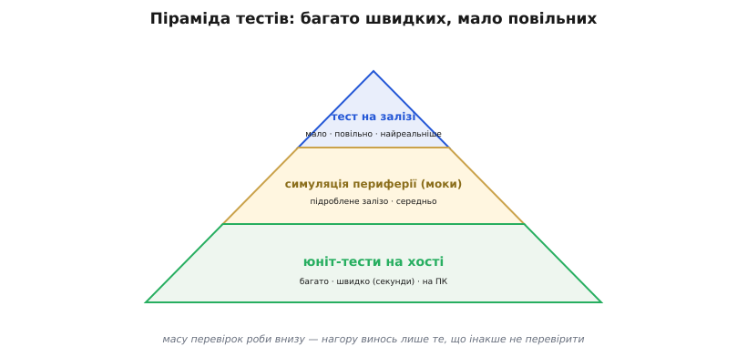
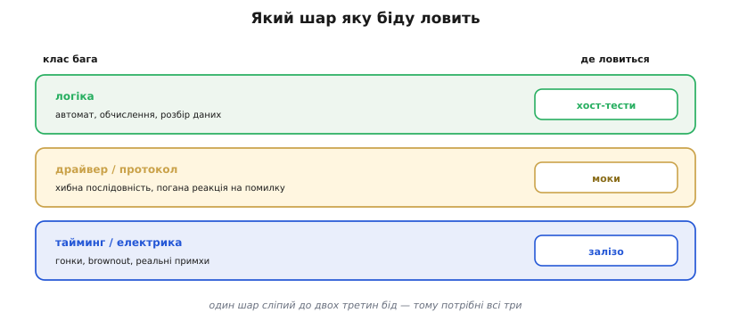

# Тестування прошивки: піраміда тестів

<preknowlist>
- [Гонки](book:programming/atomicity-races) — результат залежить від того, хто кого випередив у часі; баг, що спливає лише за реального збігу моментів.
- [Просідання живлення](book:programming/brownout) — коротке падіння напруги, від якого чіп може перезапуститися чи зіпсувати збережене; фізична відмова, якої на ПК не відтворити.
</preknowlist>

Зібрана й залита прошивка дає одне — робочу програму в чипі. Та «робоча» ще не означає «правильна», а перевіряти прошивку водночас особливо **важко** й особливо **конче**. Важко — бо код живе не на екрані, а в крихті, що смикає реальні ніжки, давачі й мотори: його не спиниш посеред роботи, не підглянеш легко, а рідкісний збій годі відтворити на замовлення. Конче — бо ціна помилки в полі висока: пристрій уже в руках користувача чи замурований у стіні, латку туди просто так не довезеш, а баг у керуванні залізом інколи означає не зіпсований піксель, а зламаний механізм чи небезпеку.

Наївний підхід — «заливаю й дивлюся» — на іграшці працює, але швидко впирається в стіну. Він повільний і ручний, а головне — **не вміє** ганяти важкі випадки: а що, як давач поверне −40 замість 25? а що, як живлення на мить просяде саме посеред запису? Такого в полі на замовлення не викличеш. Тому професійну прошивку перевіряють не одним прийомом, а **шарами** — і ця тема про те, які вони й чому саме так.

Спокуса — спростити й перевіряти все **або лише** на залізі (бо «по-справжньому»), **або лише** на ПК (бо «швидко»). Обидві крайнощі програють. Тільки на залізі — повільно, важко автоматизувати, а рідкісний випадок не виманиш: спробуй-но змусь живлення просісти рівно о потрібній мілісекунді. Тільки на ПК — швидко, та сліпо до самої **фізики**: реальний тайминг, електрика, примхи конкретного чипа лишаться неперевіреними. Тому тести складають у **піраміду** (грец. *pyramís*), а не в стовп.

Унизу, широкою основою, — багато **дешевих і швидких** перевірок, що бігають на вашому ПК за секунди. Посередині — менше тестів із **підробленим** залізом. На вершині — жменя **повільних** прогонів на справжньому чипі. Що нижче — то дешевше, швидше й легше автоматизувати; що вище — то реалістичніше, але дорожче й рідше. Форма не випадкова: більшість багів сидить у **логіці**, а логіку не треба ганяти на чипі — тож саме туди, у широку основу, лягає левова частка перевірок.


*Основа — багато дешевих хост-тестів логіки (секунди, на ПК); середина — тести з підробленим залізом; вершина — нечисленні повільні прогони на справжньому чипі. Масу перевірок роби внизу, нагору винось лише те, що інакше не перевірити.*

Основа піраміди тримається на одній ідеї: **відділити логіку від заліза**. У будь-якій прошивці багато коду насправді **нічого не знає** про конкретний чіп — скінченний автомат режимів, обчислення, розбір вхідних даних, рішення «коли вмикати». Це чиста логіка: функції від входів до виходів, яким байдуже, звідки прийшли числа — зі справжнього давача чи з рядка в тесті. А раз байдуже — її можна **скомпілювати й запустити прямо на ПК**, без жодного мікроконтролера. Перевірку окремої такої одиниці коду звуть **юніт-тестом** (англ. *unit* — окрема одиниця).

**Приклад.** Хай функція вирішує, вмикати помпу чи ні: вмикати, лише якщо бак не порожній **і** немає аварії. Перевірмо її на ПК, перебравши всі кути, зокрема прикрі:

```c
// логіка — про залізо не знає нічого:
bool pump_on(int level, bool alarm) {
    return level > 0 && !alarm;
}

// тест на хості — звичайна програма на ПК:
assert( pump_on(50, false) == true  );   // бак повний, тривоги нема → так
assert( pump_on( 0, false) == false );   // бак порожній → ні
assert( pump_on(50, true ) == false );   // аварія → ні попри повний бак
assert( pump_on( 0, true ) == false );   // обидві біди → точно ні
```

Жодного чипа, жодного давача — а ядро рішення вже перевірене в усіх чотирьох кутах, за секунди й автоматично. Виграш не лише в тому, що не треба заліза: цикл «залити й молитися» довгий (правка → компіляція → заливання → вдивляння в лог), а хост-тест замикає те саме коло за **секунди**, тож помилку ловиш у мить, коли її зробив, а не за тиждень у полі. Саме сюди, в основу, і лягає левова частка тестів.

Та не вся прошивка — чиста логіка; багато коду таки **торкається заліза**: читає давач, смикає шину, чекає відповіді. Як перевірити його, не маючи справжнього давача під рукою, ще й у дивних умовах? **Підмінити** залізо підробкою — **моком** (англ. *mock* — удавання, підробка). Код звертається не до конкретного давача, а до інтерфейсу; у пристрої за тим інтерфейсом справжнє залізо, а в тесті — мок, що повертає **сценарні** відповіді, і код не бачить різниці. Отут і стає в пригоді дивний випадок: ви не чекаєте, поки давач поверне −999 у полі, — ви **наказуєте** мокові повернути це в тесті й дивитеся, чи код вистоїть. Так перевіряють реакцію коду на відмови, яких у житті на замовлення не виманиш.

А дещо не зловити ні логікою на ПК, ні моком — бо воно за своєю природою живе **тільки на залізі**. Реальний тайминг, гонки між перериваннями, просідання живлення, електричні примхи, дрібні відмінності справжньої периферії від її опису — цього підробка не вигадає. Тому на вершині — тести на **справжньому чипі** (англ. *hardware-in-the-loop* — залізо, ввімкнене просто в тестову петлю). Вони повільні, гірше автоматизуються й самі часом «мерехтять» через контакти й температуру, тому їх **небагато** — лише на те, чого інакше не перевірити. Найпростіший і найцінніший з них — **димовий** (англ. *smoke test*, від байки електриків «увімкнув — дивишся, чи піде дим»): залив свіжу збірку, чіп стартував, блимнув, відповів по порту — отже, найгрубіше не зламано.

Звідки певність, що потрібні **всі три** шари, а не один? Бо кожен бачить свій клас багів і **сліпий** до чужого. Помилку в **логіці** — кривий автомат, хибне обчислення, поганий розбір — найдешевше зловить **хост**. Помилку в **драйвері чи протоколі** — переставлений крок, кепську реакцію на відмову — зловлять **моки**. А помилку **таймингу чи електрики** — гонку, просідання, реальну примху периферії — покаже лише **залізо**.


*Кожен шар бачить свій клас багів: логіку ловить хост, драйвер і протокол — моки, тайминг і електрику — залізо. Один шар сліпий до двох третин бід — тому потрібні всі три.*

Виходить піраміда, а не стовп, з простої ощадливості: маса багів гине ще на вашому ПК за секунди, менша частина — на підробленому залізі, і лише те, що справді живе тільки в кремнії, доростає до дорогого прогону на чипі. Прошивці, яку легко так перевірити, легко й **довіряти** — а довіра до власного коду й відрізняє інженера, що спить спокійно, від того, хто щоразу затамовує подих на «Upload».

---
