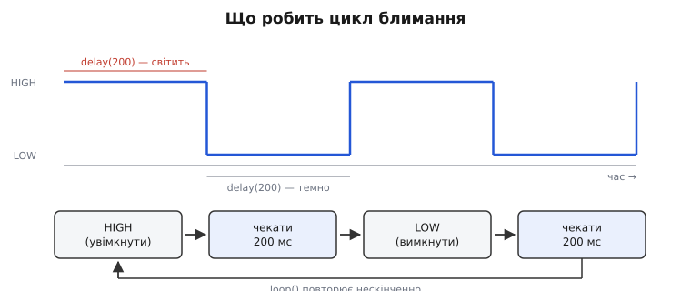
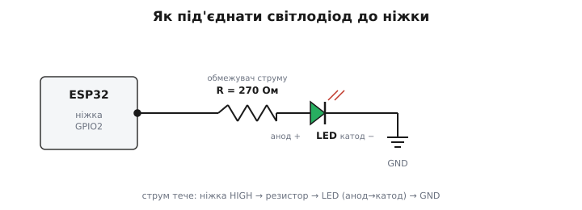
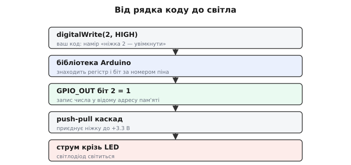
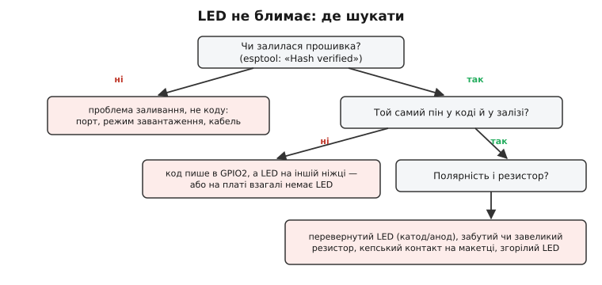

# Перший проєкт: світлодіод блимає

Ось і настала мить, до якої ми йшли весь цей модуль. Ми [вибрали чіп](root:embedded/mcu-selection), розібралися, [що таке фреймворк і скільки коштує його зручність](root:embedded/baremetal-vs-framework), навчилися [класти байти у Flash власними руками через esptool](root:embedded/esptool-workflow). Тепер зберімо все це в одну живу дію — **змусимо світлодіод блимати**. Це той самий крок, що на ньому зупиняється кожен, хто вперше сідає за мікроконтролер: від восьмибітних чипів 1980-х до сьогоднішнього ESP32. І не випадково.

Блимання світлодіодом — це **«Hello, world!» вбудованих систем**. Коли ви вчите нову мову програмування на комп'ютері, перша програма виводить на екран напис — щоб перевірити, що весь ланцюг від коду до результату працює: редактор, компілятор, запуск, вивід. У мікроконтролера екрана немає, натомість є ніжки, до яких можна причепити світлодіод. Тож блимання грає ту саму роль: це найпростіша дія, яка **бачно** доводить, що весь ланцюг живий — від рядка коду на вашому ПК до фізичного струму крізь кремній на столі.

> 🔧 **Навіщо це.** Перший блимаючий світлодіод — не забавка, а **діагностика всього тракту розробки**. Він одночасно перевіряє: чи компілюється ваш код, чи заливається у Flash, чи стартує чіп, чи справний обраний пін, чи правильно з'єднано плату. Коли пізніше ви будете відлагоджувати складну прошивку і щось піде не так, найперший рефлекс досвідченого інженера — **звести задачу до блимання**: якщо навіть світлодіод не мигає, проблема не в складному коді, а нижче — у заливанні, живленні чи розводці. Блимання — це ваш нульовий рівень, до якого завжди можна відступити.

### Анатомія: чому саме блимати, а не просто світити

Спитаймо очевидне, перш ніж писати код: а чому світлодіод має саме **блимати**? Хіба не простіше просто ввімкнути його й лишити світити?

Простіше — так, але тоді ми б нічого не перевірили по-справжньому. Постійно ввімкнена ніжка може «світити» і через випадкову підтяжку, і через застряглу стару прошивку — статичний стан не доводить, що **ваш код виконується просто зараз**. А от блимання доводить: щоб світлодіод мигав із рівним ритмом, процесор мусить **раз за разом** проганяти вашу програму — увімкнути, зачекати, вимкнути, зачекати. Ритмічне мигання — це видимий пульс живого коду.

Розберімо цей пульс на кроки. Аби ніжка блимала, програма нескінченно повторює чотири дії:


*Що насправді робить цикл блимання. Угорі — рівень на ніжці в часі: він стрибає між HIGH (світить) і LOW (темно), утворюючи прямокутний сигнал. Унизу — ті самі чотири кроки, які `loop()` повторює нескінченно: увімкнути → зачекати → вимкнути → зачекати. Без пауз ніжка перемикалася б мільйони разів на секунду, і око бачило б рівне тьмяне світло, а не блимання.*

Ключова тут — **пауза**. Процесор ESP32 виконує близько 240 мільйонів простих дій за секунду. Якби ми написали «увімкни-вимкни» без затримки, ніжка перемикалася б настільки швидко, що око злило б це в рівне неяскраве світіння — жодного блимання ви б не побачили. Тому між увімкненням і вимкненням треба **зупинити** процесор на відчутний людині час — приблизно на пʼяту частку секунди. Пауза — це не «нічого», це **суть** ефекту: саме вона робить блимання видимим.

### Куди чіпляти світлодіод

Перш ніж писати код, треба вирішити фізичне питання: до якої ніжки причепити світлодіод і що між ними поставити. Тут можливі два шляхи, і варто знати обидва.

**Найлегший шлях — вбудований світлодіод.** Багато плат розробки на ESP32 (популярні «DevKit V1» та їхні клони) мають на собі невеликий світлодіод, уже підключений до ніжки **GPIO2**. Це подарунок для першого проєкту: не треба нічого паяти чи вставляти в макетку — просто заливаєш код, що смикає GPIO2, і дивишся на плату.

Але тут причаїлася перша типова пастка, і краще знати про неї заздалегідь. **Не всяка плата має цей світлодіод на GPIO2.** Офіційна плата від самого виробника (Espressif DevKitC) має лише світлодіод живлення, який світить постійно й вашому коду не підкоряється — ніякого «користувацького» світлодіода на GPIO2 там немає. Тож якщо ви залили код, а нічого не блимає, перша підозра — не помилка в коді, а **сама плата**: перевірте за її схемою чи розпіновкою, чи справді є світлодіод, яким можна керувати, і на якій він ніжці. Не всі плати однакові, навіть коли зовні схожі.

**Надійніший шлях — власний світлодіод.** Візьміть окремий світлодіод, звичайний резистор і зберіть просте коло: ніжка GPIO → резистор → світлодіод → земля.


*Мінімальне коло блимання. Ніжка GPIO2 з'єднана через резистор-обмежувач (тут 270 Ом) з анодом («плюсом») світлодіода; катод («мінус», позначений рискою) іде на землю. Коли код ставить ніжку в HIGH, вона підключається до +3.3 В, і струм тече крізь резистор і світлодіод — той світиться. Резистор обов'язковий: без нього струм нічим не обмежений.*

Два моменти в цьому колі критичні. Перший — **полярність**. Світлодіод, на відміну від звичайного резистора, пропускає струм лише в один бік; його довша ніжка (анод, «плюс») має дивитися в бік ніжки чипа, коротша (катод, «мінус», зі скошеним боком корпусу) — на землю. Устромите навпаки — струм не потече, і світлодіод просто не засвітиться, хоч усе інше правильно.

Другий — **резистор**. Ставити світлодіод прямо на ніжку без обмежувача не можна: [через круту вольт-амперну характеристику світлодіода](root:hw-motion/led) навіть маленьке перевищення напруги дає величезний струм, який спалить або світлодіод, або вихідний каскад ніжки. Резистор перетворює цю небезпечно «м'яку» залежність на керовану: він забирає на себе зайву напругу й тримає струм у безпечних межах. Для живлення 3.3 В і типового світлодіода підходить резистор близько 220–330 Ом — [як саме береться це число, докладно розібрано у статті про світлодіоди](root:hw-motion/led). Для першого блимання достатньо взяти будь-який резистор із цього діапазону.

> 🔧 **Навіщо це.** Правило «світлодіод завжди через резистор» — не формальність, а звичка, що рятує деталі. Найчастіша помилка новачка — увіткнути світлодіод прямо в ніжку живлення «просто перевірити». Спалахнути він може ефектно, але один раз: незахищений струм або миттєво вбиває світлодіод, або поволі деградує ніжку чипа. Виробіть рефлекс: між ніжкою й світлодіодом **завжди** стоїть обмежувач. У складніших схемах цей самий принцип масштабується до спеціальних драйверів струму, але думка одна — струм крізь світлодіод має хтось обмежувати.

### Код: блимання двома мовами

Тепер найцікавіше — власне програма. Напишімо її **двома способами**: спершу дружнім фреймворком, тоді голим залізом. Це прямо продовжує [нашу розмову про ціну абстракції](root:embedded/baremetal-vs-framework): та сама дія, два рівні близькості до кремнію.

**Спосіб перший — фреймворк Arduino.** Програма для Arduino складається з двох частин: `setup()` виконується **один раз** на старті (тут ми готуємо ніжку), а `loop()` після нього **повторюється нескінченно** (тут ми блимаємо).

**Класичне блимання GPIO2 з паузою 200 мс, фреймворком Arduino:**
```c
#define LED_PIN 2            // ніжка, до якої під'єднано світлодіод

void setup() {
    pinMode(LED_PIN, OUTPUT);        // налаштувати ніжку на вихід — один раз
}

void loop() {
    digitalWrite(LED_PIN, HIGH);     // увімкнути світлодіод
    delay(200);                      // зачекати 200 мілісекунд (світить)
    digitalWrite(LED_PIN, LOW);      // вимкнути світлодіод
    delay(200);                      // зачекати 200 мілісекунд (темно)
}
```
Прочитаймо це рядок за рядком, бо кожен несе думку. `#define LED_PIN 2` дає ніжці людське ім'я — тепер, якщо світлодіод на іншому піні, правити треба лише в одному місці. `pinMode(LED_PIN, OUTPUT)` у `setup()` каже чипу: ця ніжка тепер **вихід**, вона видаватиме напругу, а не читатиме її — це ввімкнення того самого вихідного каскаду, [про який ми говорили в GPIO-регістрах](root:sf-devices/gpio-registers). Далі в `loop()` чотири рядки роблять рівно ті чотири кроки з діаграми: `digitalWrite(..., HIGH)` піднімає напругу на ніжці до 3.3 В (світить), `delay(200)` зупиняє процесор на 200 мілісекунд, `digitalWrite(..., LOW)` опускає напругу до нуля (темно), і ще одна пауза. Дійшовши до кінця `loop()`, процесор мовчки повертається на його початок — і все повторюється. Звідси й береться ритм.

**Спосіб другий — голе залізо.** Тепер напишімо те саме, звертаючись [до регістрів напряму](root:hw-arch/memory-mapped-io), без обгорток. Це не тому, що так треба (для блимання `digitalWrite` ідеальний), а щоб **побачити правду**: що фреймворк робить під капотом.

**Те саме блимання, але прямим записом у регістри ESP32:**
```c
#include <stdint.h>

// адреси регістрів GPIO у класичного ESP32 (з даташита)
#define GPIO_ENABLE_W1TS (*(volatile uint32_t *)0x3FF44024)  // увімкнути вихід
#define GPIO_OUT_W1TS    (*(volatile uint32_t *)0x3FF44008)  // поставити біт у 1
#define GPIO_OUT_W1TC    (*(volatile uint32_t *)0x3FF4400C)  // скинути біт у 0

#define LED_BIT (1u << 2)                 // GPIO2 — це біт 2

void app_main(void) {
    GPIO_ENABLE_W1TS = LED_BIT;           // ніжка 2 — на вихід (один раз)
    while (1) {
        GPIO_OUT_W1TS = LED_BIT;          // увімкнути: біт 2 = 1
        for (volatile int i = 0; i < 4000000; i++) { }   // груба пауза
        GPIO_OUT_W1TC = LED_BIT;          // вимкнути: біт 2 = 0
        for (volatile int i = 0; i < 4000000; i++) { }   // груба пауза
    }
}
```
Порівняйте два тексти — і вся тема модуля стає відчутною на дотик. Там, де фреймворк писав ясне `digitalWrite(LED_PIN, HIGH)`, тут стоїть `GPIO_OUT_W1TS = LED_BIT` — прямий запис одиниці в біт 2 особливого регістра за конкретною адресою `0x3FF44008`. Ніякої магії: [«торкнутися ніжки» — це записати число у відому комірку пам'яті](root:sf-devices/gpio-registers), і саме це `digitalWrite` тихо робив за нас. Регістри `W1TS` і `W1TC` (від *write-1-to-set* і *write-1-to-clear*) — апаратна зручність ESP32: одиниця, записана в них, ставить чи скидає **лише** відповідний біт, не чіпаючи сусідніх ніжок.

Різниця не лише в записі, а й у **паузі**. У фреймворку ми мали готовий `delay()`, що коректно рахує мілісекунди. На голому залізі його немає — тож пауза тут зроблена найгрубішим способом: порожній цикл, який просто «пропалює» такти процесора. Слово `volatile` тут обов'язкове, бо без нього [компілятор](root:sf-lang/compilation) побачив би цикл, що нічого не робить, і викинув би його геть як марний — і пауза б зникла. Це, до речі, наочно показує, **що саме** дає фреймворк: не тільки короткі імена, а й правильно зроблені дрібниці на кшталт точного відліку часу, які інакше довелося б винаходити самому.

Обидві програми блимають однаково. Яку писати насправді? Майже завжди — **першу**, фреймворком: вона ясна, переносна й безпечна. Другу варто раз написати власноруч саме для того, щоб абстракція перестала бути магією — і ви завжди могли **зазирнути під неї**, коли `digitalWrite` поведеться не так, як ви чекали.


*Що стоїть за одним рядком коду. Ваш намір `digitalWrite(2, HIGH)` бібліотека перекладає на пошук потрібного регістра й біта; далі одиниця лягає в біт 2 регістра `GPIO_OUT` за відомою адресою; це вмикає push-pull каскад, що приєднує ніжку до +3.3 В; і аж тоді крізь резистор і світлодіод тече струм — той світиться. Голе залізо — це коли ви прибираєте середній шар і пишете в регістр самі.*

### Залити й побачити

Код написано — час помістити його в чіп. Тут ми **пожинаємо** все, чого навчилися раніше. У найпростішому шляху ви пишете код у середовищі (Arduino IDE чи ESP-IDF) і тиснете одну кнопку — «Upload». Але тепер ви знаєте, **що** ховається за цією кнопкою: [середовище компілює ваш код у три файли-образи, вводить чіп у режим завантаження й кличе esptool](root:embedded/esptool-workflow), а той диктує вшитому в ПЗП завантажувачу, куди покласти байти у Flash.

Тому, якщо хочете бачити кожен крок, ви можете залити зібрані образи й **вручну** — тією самою командою, яку ми вже розібрали:
```
esptool -p COM5 -b 460800 write_flash \
  0x1000  bootloader.bin \
  0x8000  partitions.bin \
  0x10000 blink.bin
```
Дочекайтеся заповітного рядка `Hash of data verified.` — [саме він, а не крутілка прогресу, доводить, що прошивка справді лягла у Flash](root:embedded/esptool-workflow). Після заливання чіп сам перезавантажиться, вискочить із режиму завантаження, побіжить ваш код — і світлодіод замигає. Якщо він мигає — вітаю: весь тракт від вашого коду до живого кремнію працює. Це справжня, хай і крихітна, перемога.

### Коли нічого не блимає

А тепер найкорисніша частина, бо перший проєкт **рідко** запускається з першого разу — і це нормально. Уміння спокійно знайти, **де** розірвано ланцюг, важливіше за сам код. Гарна новина: коло блимання таке просте, що місць для помилки лічена жменя, і їх легко перебрати по черзі.


*Як шукати причину, коли світлодіод мовчить. Найперше питання — чи взагалі залилася прошивка (був рядок «Hash verified»?). Якщо ні — проблема в заливанні, а не в коді: порт, режим завантаження, кабель. Якщо так — далі перевіряють, чи той самий пін у коді й у залізі, тоді полярність світлодіода й резистор. Кожна гілка звужує пошук удвічі, і за пʼять питань ви знаходите винного.*

Пройдімося гілками цього дерева — це і є практичний чеклист.

**Спочатку відокремте заливання від коду.** Найперше згадайте, чи бачили ви `Hash of data verified` при заливанні. Не бачили (чи натомість була помилка `Failed to connect`) — значить, справа не в коді взагалі, а в тому, що прошивка **не потрапила** в чіп: [не той порт, чіп не ввійшов у режим завантаження, кепський кабель](root:embedded/esptool-workflow). Немає сенсу правити програму, поки вона фізично не в чипі. Це найважливіший поділ: він одразу відсікає половину можливих причин.

**Прошивка залилася, але темрява?** Тоді ланцюг рветься вже на боці заліза, і найімовірніший винний — **пін**. Ваш код смикає GPIO2, а світлодіод підключено до іншої ніжки; або, як ми застерігали, на цій конкретній платі **взагалі немає** керованого світлодіода на GPIO2. Перевірте за схемою плати, який пін насправді має світлодіод, і впишіть саме його номер у `#define LED_PIN`.

**Пін правильний, а світлодіод усе одно мовчить?** Лишилися дрібниці самого кола, і їх варто перебрати всі:
- **Полярність** — світлодіод устромлено навпаки (катод замість анода). Переверніть його; це найчастіша механічна помилка.
- **Резистор** — забутий (тоді світлодіод міг уже згоріти) або, навпаки, завеликий (мегаоми — струм такий мізерний, що світіння не видно оком).
- **Контакт** — ніжка не до кінця сидить у макетці, дріт відійшов. Прості механічні негаразди винні напрочуд часто.
- **Сам світлодіод** — згорів від попереднього досліду. Спробуйте інший.

Логіка тут одна й та сама, і вона універсальна для будь-якої відладки: **звужуйте область пошуку навпіл**. Спершу — код проти заліза (залилося чи ні). Тоді всередині заліза — пін проти кола. Тоді всередині кола — полярність проти контакту. Кожне питання відкидає половину варіантів, і за кілька кроків ви впираєтеся в справжню причину — замість того, щоб наосліп міняти все підряд.

> 🔧 **Навіщо це.** Ця звичка — ділити задачу навпіл — переростає перший світлодіод і лишається з вами назавжди. Коли за рік ви відлагоджуватимете прошивку, що спілкується з давачем по шині, ви робитимете те саме: спершу відокремите «чи доходить сигнал до чипа» від «чи правильно я його обробляю», тоді звузите далі. Блимання — перша, найпростіша школа цього мислення. Хто навчився знаходити, чому мовчить світлодіод, той знає, як підступитися до будь-якої мовчазної системи.

### Куди далі: пауза, що краде час

Наш перший проєкт працює — але в ньому дрімає вада, яку варто побачити вже зараз, бо саме вона поведе нас у наступний модуль. Придивімося до `delay(200)`. Що робить процесор ці 200 мілісекунд? **Нічого.** Він стоїть, застигнувши в паузі, й не здатен більше ні на що — ні прочитати кнопку, ні відповісти давачу, ні мигнути другим світлодіодом у своєму ритмі. Для блимання одного світлодіода це байдуже. Але щойно пристрій має робити **кілька справ водночас**, така пауза стає в'язницею: увесь час, поки ви «чекаєте», марно втрачено.

Правильний спосіб рахувати час — не **зупиняти** процесор паузою, а **питати годинник**: «чи минуло вже 200 мілісекунд від минулого перемикання?» — і між цими питаннями лишати процесор вільним для інших справ. Як переписати блимання без жодного `delay`, щоб воно не крало час, розібрано в окремому [прикладі неблокуючого блимання](root:embedded/first-blink-project/proj-blink-nonblocking.md); а повне вміння працювати з часом на мікроконтролері чекає на нас [далі, у розмові про неблокуючий час](root:sf-devices/nonblocking-time).

Так замикається цей модуль. Ми пройшли [весь шлях від знайомства з мікроконтролером](root:embedded/mcu-selection) до першої власної, живої прошивки в чипі — і крихітний блимаючий світлодіод несе в собі все, чого ми навчилися: вибір чипа, ціну абстракції, механіку заливання, дисципліну відладки. Це фундамент, на якому стоятиме все складніше: варто лише навчити ці ніжки не просто блимати, а **відчувати** світ і **керувати** ним — і почнеться справжня вбудована електроніка.
