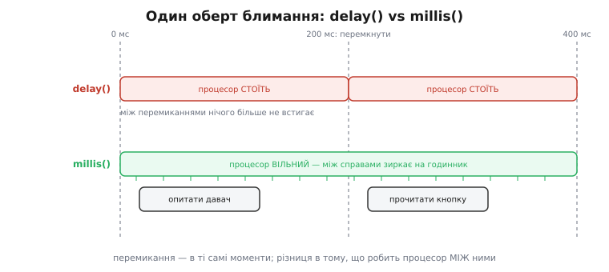

# ⚙️ Блимання без delay(): світлодіод миготить, а процесор вільний

Наш перший блимач працює бездоганно — і саме тому на ньому найлегше побачити ваду, спільну майже всім першим прошивкам. Придивімося ще раз до серця того `loop()`:

:::tabs
```arduino
void loop() {
    digitalWrite(LED_PIN, HIGH);
    delay(200);                      // ← 200 мс процесор стоїть
    digitalWrite(LED_PIN, LOW);
    delay(200);                      // ← ще 200 мс процесор стоїть
}
```
```esp-idf
while (1) {
    gpio_set_level(LED_PIN, 1);
    vTaskDelay(pdMS_TO_TICKS(200));  // ← 200 мс ця гілка коду стоїть
    gpio_set_level(LED_PIN, 0);
    vTaskDelay(pdMS_TO_TICKS(200));  // ← ще 200 мс вона стоїть
}
```
```stm32
while (1) {
    HAL_GPIO_WritePin(LED_GPIO_Port, LED_Pin, GPIO_PIN_SET);
    HAL_Delay(200);                  // ← 200 мс процесор стоїть
    HAL_GPIO_WritePin(LED_GPIO_Port, LED_Pin, GPIO_PIN_RESET);
    HAL_Delay(200);                  // ← ще 200 мс процесор стоїть
}
```
:::

Чотири рядки, з них два — накази **не робити нічого**. І це не фігура мови: під час `delay(200)` процесор ESP32, здатний на ~240 мільйонів дій за секунду, буквально застигає в порожньому очікуванні. За кожен повний оберт нашого блимача — 400 мілісекунд — він **простоює всі 400**. Робота, яку він за цей час міг би зробити (≈ 96 мільйонів інструкцій), просто викинута.

Для одного світлодіода це байдуже: більше нема чого робити, хай стоїть. Але цей крок навчального курсу не про світлодіод — він про **звичку**. Бо щойно пристрій має робити дві справи водночас — блимати **і** слухати кнопку, блимати **і** відповідати давачу, блимати двома світлодіодами в **різних** ритмах — `delay()` перетворюється з дрібнички на в'язницю. Тож перепишімо цей самий блимач так, щоб він миготів **і не крав час**. Задача вузька й конкретна, а урок із неї — на все подальше програмування мікроконтролерів.

> 🔧 **Навіщо це.** Неблокуюче блимання — це не «просунута оптимізація для потім», це **та сама програма, написана правильно з першого дня**. Різниця між `delay()` і патерном, який ми зараз виведемо, — це різниця між іграшковим скетчем і живим пристроєм. Практично будь-яка реальна прошивка (дрон, метеостанція, розумний вимикач) у своєму головному циклі жонглює десятком таких «блимань» одночасно: миготить індикатором, раз на секунду опитує давач, десять разів на секунду коригує тягу моторів, слухає радіо. Жодне з них не сміє **зупинити** решту. Патерн із цього кроку — цеглина, з якої складено той жонглюючий цикл.

## Задача: чому `delay()` крокує все

Спершу як слід розгляньмо, **чому** пауза така руйнівна — бо доки біль не відчутний, немає стимулу міняти звичний код.

`delay(200)` усередині — це, грубо кажучи, отакий порожній цикл:

```c
uint32_t start = millis();
while (millis() - start < 200) {
    // нічого. просто крутимося, палячи такти, аж поки мине 200 мс
}
```

Процесор **застряг** у цьому `while`. Він не повертається у ваш `loop()`, не перевіряє кнопку, не рухається далі жодним рядком — усі 200 мілісекунд він робить одне: питає годинник і бачить, що час іще не вийшов. Це і є суть слова **блокуюче** (англ. *blocking* — те, що затуляє шлях): виклик не віддає керування, поки не завершиться.

Уявімо тепер, що поруч зі світлодіодом ми хочемо щосекунди зчитувати температуру. Наївний код виглядав би так:

:::tabs
```arduino
void loop() {
    digitalWrite(LED_PIN, HIGH);
    delay(200);
    digitalWrite(LED_PIN, LOW);
    delay(200);

    float t = readTemperature();     // а це коли встигне виконатися?
    sendTemperature(t);
}
```
```esp-idf
while (1) {
    gpio_set_level(LED_PIN, 1);
    vTaskDelay(pdMS_TO_TICKS(200));
    gpio_set_level(LED_PIN, 0);
    vTaskDelay(pdMS_TO_TICKS(200));

    float t = read_temperature();    // а це коли встигне виконатися?
    send_temperature(t);
}
```
```stm32
while (1) {
    HAL_GPIO_WritePin(LED_GPIO_Port, LED_Pin, GPIO_PIN_SET);
    HAL_Delay(200);
    HAL_GPIO_WritePin(LED_GPIO_Port, LED_Pin, GPIO_PIN_RESET);
    HAL_Delay(200);

    float t = read_temperature();    // а це коли встигне виконатися?
    send_temperature(t);
}
```
:::

Порахуймо ритм цього циклу вголос. Оберт `loop()` займає **щонайменше 400 мс** самих пауз — і лише після них черга доходить до читання температури. Значить, температуру ми знімаємо не «щосекунди», а раз на ~400 мс, і то нерівно; а якби пауз було більше, розрив ріс би далі. Гірше: поки світлодіод «світить свої 200 мс», код фізично **не може** зчитати давач — процесор замкнений у `delay`. Дві незалежні справи злиплися в одну чергу, і повільніша диктує ритм швидшій. Це і означає «`delay()` крокує все»: **будь-яка** пауза заморожує **весь** цикл, а не тільки ту гілку, що просила почекати.

А тепер найтонше. Додаймо кнопку, яку хочемо ловити миттєво:

:::tabs
```arduino
void loop() {
    digitalWrite(LED_PIN, HIGH);
    delay(200);                      // ← натиснули кнопку ТУТ
    digitalWrite(LED_PIN, LOW);
    delay(200);
    if (digitalRead(BUTTON) == LOW) {
        // зреагувати на натиск
    }
}
```
```esp-idf
while (1) {
    gpio_set_level(LED_PIN, 1);
    vTaskDelay(pdMS_TO_TICKS(200));  // ← натиснули кнопку ТУТ
    gpio_set_level(LED_PIN, 0);
    vTaskDelay(pdMS_TO_TICKS(200));
    if (gpio_get_level(BUTTON_PIN) == 0) {
        // зреагувати на натиск
    }
}
```
```stm32
while (1) {
    HAL_GPIO_WritePin(LED_GPIO_Port, LED_Pin, GPIO_PIN_SET);
    HAL_Delay(200);                  // ← натиснули кнопку ТУТ
    HAL_GPIO_WritePin(LED_GPIO_Port, LED_Pin, GPIO_PIN_RESET);
    HAL_Delay(200);
    if (HAL_GPIO_ReadPin(BTN_GPIO_Port, BTN_Pin) == GPIO_PIN_RESET) {
        // зреагувати на натиск
    }
}
```
:::

Якщо палець торкнувся кнопки на початку першого `delay(200)`, код помітить це щонайраніше через ~400 мс — коли цикл нарешті дійде до `digitalRead`. Для ока 400 мс — це відчутне «підвисання», інтерфейс здається мертвим. А коротка подія — імпульс від давача, брязкіт енкодера — за ці 400 мс може встигнути **початися й скінчитися**, і ми її взагалі проґавимо. Ось де `delay()` перестає бути незручністю й стає **багом**.

Корінь усього — одне хибне припущення в самій формі `delay()`: «почекати» тут означає «**зупинити процесор**». Але почекати можна інакше — **не спиняючись**. Саме цю думку ми зараз і розкрутимо.

## Ідея: не спати, а поглядати на годинник

Зробімо крок убік від коду й подумаймо, як людина робить дві справи «водночас». Скажімо, ви смажите млинці й чекаєте на важливий дзвінок. Ви ж не завмираєте біля плити, тупо дивлячись на млинець, поки він підрум'яниться, глухі до телефону. Ви **час від часу зиркаєте**: «Скільки вже смажиться? Хвилина? Ще рано, перевернемо пізніше». І між цими поглядами ви вільні — можете взяти слухавку, помішати чай, відчинити двері. Секрет у тому, що ви не **чекаєте** біля млинця — ви **запам'ятали**, коли поклали його на сковороду, і час від часу питаєте: «чи вже минула хвилина від тієї мітки?»

Оце і є вся ідея неблокуючого блимання, слово в слово:

1. **Запам'ятати мітку часу** останнього перемикання світлодіода.
2. У кожному оберті `loop()` — **не зупиняючись** — питати годинник: «чи минуло вже 200 мс від тієї мітки?»
3. Якщо **так** — перемкнути світлодіод і **оновити мітку** (записати нинішній час як нову точку відліку).
4. Якщо **ні** — не робити зі світлодіодом нічого й одразу бігти далі по `loop()`, до інших справ.

Порівняймо дві філософії лоба в лоб. `delay()` каже процесору: «**стій** отут 200 мс». Наш підхід каже: «**заглядай** сюди щоразу, і як побачиш, що 200 мс від мітки минуло, — перемкни; а ні — лети далі». У першому випадку між перемиканнями процесор **закритий**. У другому — **вільний**: він пролітає крізь `loop()` тисячі разів на секунду, здебільшого лише зиркаючи на годинник і йдучи геть, і тільки зрідка — коли мітка «дозріла» — робить корисну дію. Той самий видимий ефект (світлодіод миготить рівно раз на 200 мс), але процесор при цьому не в полоні.

Годинник, у який ми «заглядаємо», є в кожному мікроконтролері: вільно біжить апаратний таймер, а середовище дає функцію «скільки часу минуло від старту». В Arduino це `millis()`, в ESP-IDF — `esp_timer_get_time()` (мікросекунди), у STM32 HAL — `HAL_GetTick()`. Далі в тексті пишемо `millis()`, маючи на увазі будь-який із цих лічильників.

> 🔧 **Навіщо це.** `millis()` — це вбудований лічильник мілісекунд, що цокає від старту чипа: викликав — дістав, скільки мілісекунд минуло з увімкнення. Він апаратний (окремий таймер тікає сам, незалежно від вашого коду), тож читати його «безкоштовно» й можна тисячі разів за оберт циклу. Саме він — той годинник, на який ми поглядаємо. Що він насправді повертає, з якою роздільністю й чому по-різному влаштований на Arduino Uno та ESP32 — розібрано у [статті про точний час](root:sf-devices/millis-micros).

Ключова зміна в голові — **інверсія керування часом**. У блокуючому коді ми *активно тримаємо* паузу (сидимо в `delay`). У неблокуючому — ми *пасивно перевіряємо умову* й здебільшого просто йдемо повз. Час перестає бути стіною, об яку впирається процесор, і стає **міткою на стрічці**, повз яку він щоразу пробігає, кидаючи погляд. Тримаймо цю картинку в голові — зараз перекладемо її в робочий C.

## Робочий C: той самий блимач на трьох платформах

Ось те саме блимання світлодіодної ніжки (у нас це GPIO2), що й у першому проєкті, але переписане неблокуюче. Патерн однаковий скрізь, різняться лише імена: головний цикл — це `loop()` в Arduino і `while (1)` усередині `app_main()` чи `main()` в ESP-IDF та STM32. Це справжня прошивка — заливайте як є:

:::tabs
```arduino
#define LED_PIN  2                   // той самий GPIO2, що й у першому блимачі
#define INTERVAL 200                 // період перемикання, мілісекунди

void setup() {
    pinMode(LED_PIN, OUTPUT);        // ніжка на вихід — як і раніше, один раз
}

void loop() {
    static uint32_t lastToggle = 0;  // мітка часу останнього перемикання
    static bool ledOn = false;       // нинішній стан світлодіода

    uint32_t now = millis();         // «зиркнули на годинник» — один раз за оберт

    if (now - lastToggle >= INTERVAL) {
        lastToggle = now;            // ПЕРЕСУНУЛИ мітку на теперішній час
        ledOn = !ledOn;              // перемкнули логічний стан
        digitalWrite(LED_PIN, ledOn ? HIGH : LOW);
    }

    // сюди керування доходить ЩОРАЗУ — і між перемиканнями теж.
    // тут можна робити будь-що інше: читати кнопку, опитувати давач…
}
```
```esp-idf
#include <stdbool.h>
#include "driver/gpio.h"
#include "esp_timer.h"
#include "freertos/FreeRTOS.h"
#include "freertos/task.h"

#define LED_PIN  GPIO_NUM_2          // той самий GPIO2
#define INTERVAL 200                 // період перемикання, мілісекунди

void app_main(void) {
    gpio_config_t cfg = {
        .pin_bit_mask = 1ULL << LED_PIN,
        .mode = GPIO_MODE_OUTPUT,
    };
    gpio_config(&cfg);               // ніжка на вихід — один раз

    uint32_t lastToggle = 0;         // мітка часу останнього перемикання
    bool ledOn = false;              // нинішній стан світлодіода

    while (1) {
        // лічильник дає мікросекунди — переводимо в мілісекунди
        uint32_t now = (uint32_t)(esp_timer_get_time() / 1000);

        if (now - lastToggle >= INTERVAL) {
            lastToggle = now;        // ПЕРЕСУНУЛИ мітку на теперішній час
            ledOn = !ledOn;          // перемкнули логічний стан
            gpio_set_level(LED_PIN, ledOn ? 1 : 0);
        }

        // сюди керування доходить ЩОРАЗУ — і між перемиканнями теж.
        vTaskDelay(1);               // один такт іншим задачам, а не пауза «на 200 мс»
    }
}
```
```stm32
#include <stdbool.h>
#include "main.h"                    // LED_GPIO_Port / LED_Pin з CubeMX

#define INTERVAL 200                 // період перемикання, мілісекунди

int main(void) {
    HAL_Init();
    SystemClock_Config();
    MX_GPIO_Init();                  // ніжка на вихід — один раз, у генерованому коді

    uint32_t lastToggle = 0;         // мітка часу останнього перемикання
    bool ledOn = false;              // нинішній стан світлодіода

    while (1) {
        uint32_t now = HAL_GetTick();   // «зиркнули на годинник» — раз за оберт

        if (now - lastToggle >= INTERVAL) {
            lastToggle = now;        // ПЕРЕСУНУЛИ мітку на теперішній час
            ledOn = !ledOn;          // перемкнули логічний стан
            HAL_GPIO_WritePin(LED_GPIO_Port, LED_Pin,
                              ledOn ? GPIO_PIN_SET : GPIO_PIN_RESET);
        }

        // сюди керування доходить ЩОРАЗУ — і між перемиканнями теж.
        // тут можна робити будь-що інше: читати кнопку, опитувати давач…
    }
}
```
:::

Пройдімо його поглядом, бо в кожному рядку — рішення, яке легко зробити неправильно.

**`static` — чому не звичайні змінні.** `lastToggle` і `ledOn` мусять **пережити** вихід із `loop()` і бути там-таки при наступному вході — інакше вони щоразу обнулятимуться, і мітка ніколи «не постаріє». Зробити їх `static` усередині `loop()` — акуратний спосіб цього досягти: змінна ініціалізується **один раз** (при першому вході), а далі зберігає своє значення між викликами, лишаючись при цьому невидимою для решти файлу. Це те саме, що глобальна змінна, але з вужчою, безпечнішою областю видимості. Приберете `static` — блимач зламається: `lastToggle` завжди дорівнюватиме 0, умова спрацьовуватиме щоразу, і світлодіод знову замиготить із частотою циклу, тобто зіллється в рівне світло. Загальна вимога — «стан мусить пережити оберт», а от `static` потрібен саме там, де тіло циклу є функцією, яку рушій викликає щоразу заново (Arduino-`loop()`); у прошивці з власним `while (1)` усередині `app_main()`/`main()` ті самі змінні живуть від оберту до оберту як звичайні локальні — тому у вкладках ESP-IDF і STM32 вище `static` немає.

> 🔧 **Навіщо це.** `static` усередині функції — робочий кінь усього неблокуючого коду. Будь-який «стан, що триває між обертами» — мітка часу, лічильник, поточна фаза автомата — це `static` (або поле об'єкта чи глобал). Тримати цей стан у купі й не втратити його між викликами `loop()` — і є вся механіка того, як пристрій «пам'ятає, що робив». Звичайна локальна змінна тут — типова, дуже підступна помилка новачка: код компілюється, виглядає правильно, а поводиться дико.

**`uint32_t now = millis()` — знімок часу один раз.** Ми питаємо годинник **раз** на оберт і кладемо відповідь у `now`, а далі порівнюємо саме з `now`. Це не просто економія: якби ми викликали `millis()` двічі в одному оберті, між двома викликами міг би клацнути ще один мілісекунд, і два порівняння побачили б **різний** час — джерело рідкісних, майже невідлагоджуваних збоїв. Один знімок на оберт — одна узгоджена точка відліку. І тип тут не випадковий: `millis()` повертає `uint32_t` — **беззнакове** 32-бітове число, і зберігати його треба саме в `uint32_t`. Чому це критично — за хвилину, у пастках.

**`now - lastToggle >= INTERVAL` — серце патерну.** Ліва частина — «скільки минуло від останнього перемикання», права — «скільки має минути». Це і є той «погляд на годинник» замість «стій тут». Зверніть увагу, чого тут **немає**: жодного `delay`, жодного циклу очікування. Умова або істинна (пора перемикати), або ні (біжимо далі) — і в обох випадках керування миттю рушає до кінця `loop()`.

**`lastToggle = now`, а не `lastToggle += INTERVAL` — тонкість, вартна окремого слова.** Коли час настав, ми пересуваємо мітку **на теперішній** момент. (Існує й друга школа — `lastToggle += INTERVAL`, вона рівномірніша, коли цикл буває довгий; але вона ж і небезпечніша, бо після великої затримки надолужує пропущені такти пачкою. Для рівного блимача `= now` простіше й цілком годиться; тонкощі другого варіанта — тема неблокуючого часу далі в курсі.)

**`ledOn = !ledOn` — перемикач без пам'яті стану ніжки.** Замість читати поточний рівень ніжки й інвертувати його, ми тримаємо стан у своїй булевій змінній і щоразу її перевертаємо. Так надійніше: ми **керуємо** станом, а не **питаємо** його в заліза.

Тепер найцінніше: подивімося, як цей блимач співіснує з іншою справою — тим самим давачем, що вбивав нас у блокуючому варіанті:

:::tabs
```arduino
#define LED_PIN     2
#define LED_INT     200              // блимати кожні 200 мс
#define SENSOR_INT  1000             // читати давач кожну 1000 мс

void loop() {
    static uint32_t lastBlink = 0;
    static uint32_t lastSensor = 0;
    static bool ledOn = false;

    uint32_t now = millis();

    // справа 1: блимання світлодіодом
    if (now - lastBlink >= LED_INT) {
        lastBlink = now;
        ledOn = !ledOn;
        digitalWrite(LED_PIN, ledOn ? HIGH : LOW);
    }

    // справа 2: опитування давача — СВОЯ мітка, СВІЙ інтервал
    if (now - lastSensor >= SENSOR_INT) {
        lastSensor = now;
        float t = readTemperature();
        sendTemperature(t);
    }

    // обидві гілки бачать один і той самий `now`;
    // жодна не блокує іншу; loop() пролітає тисячі разів на секунду
}
```
```esp-idf
#define LED_PIN     GPIO_NUM_2
#define LED_INT     200              // блимати кожні 200 мс
#define SENSOR_INT  1000             // читати давач кожну 1000 мс

void app_main(void) {
    gpio_config_t cfg = { .pin_bit_mask = 1ULL << LED_PIN, .mode = GPIO_MODE_OUTPUT };
    gpio_config(&cfg);

    uint32_t lastBlink = 0, lastSensor = 0;
    bool ledOn = false;

    while (1) {
        uint32_t now = (uint32_t)(esp_timer_get_time() / 1000);

        // справа 1: блимання світлодіодом
        if (now - lastBlink >= LED_INT) {
            lastBlink = now;
            ledOn = !ledOn;
            gpio_set_level(LED_PIN, ledOn ? 1 : 0);
        }

        // справа 2: опитування давача — СВОЯ мітка, СВІЙ інтервал
        if (now - lastSensor >= SENSOR_INT) {
            lastSensor = now;
            float t = read_temperature();
            send_temperature(t);
        }

        // обидві гілки бачать один і той самий `now`;
        // жодна не блокує іншу; оберт триває мікросекунди
        vTaskDelay(1);
    }
}
```
```stm32
#define LED_INT     200              // блимати кожні 200 мс
#define SENSOR_INT  1000             // читати давач кожну 1000 мс

int main(void) {
    HAL_Init();
    SystemClock_Config();
    MX_GPIO_Init();

    uint32_t lastBlink = 0, lastSensor = 0;
    bool ledOn = false;

    while (1) {
        uint32_t now = HAL_GetTick();

        // справа 1: блимання світлодіодом
        if (now - lastBlink >= LED_INT) {
            lastBlink = now;
            ledOn = !ledOn;
            HAL_GPIO_WritePin(LED_GPIO_Port, LED_Pin,
                              ledOn ? GPIO_PIN_SET : GPIO_PIN_RESET);
        }

        // справа 2: опитування давача — СВОЯ мітка, СВІЙ інтервал
        if (now - lastSensor >= SENSOR_INT) {
            lastSensor = now;
            float t = read_temperature();
            send_temperature(t);
        }

        // обидві гілки бачать один і той самий `now`;
        // жодна не блокує іншу; while(1) пролітає тисячі разів на секунду
    }
}
```
:::

Ось де окупається вся перебудова. Світлодіод миготить своїм ритмом (200 мс), давач опитується своїм (1000 мс), і **вони не заважають одне одному** — бо жодна гілка не спиняє процесор, а лише зиркає на спільний `now` і вирішує, її час чи ні. Порівняйте це з тим злиплим блокуючим циклом, де світлодіод диктував ритм давачу: тут дві справи справді незалежні. Саме так — по одній `static`-мітці на кожну періодичну справу — і будують головні цикли реальних пристроїв.

## Складність і пастки

Патерн простий на око, але має три гострі кути, об які ріжуться навіть досвідчені. Розберімо кожен від першопричини — бо всі троє «мовчазні»: код компілюється, здебільшого працює, а зривається зрідка й підступно.

### Пастка 1: переповнення `millis()` — і чому віднімання його переживає

`millis()` цокає від старту чипа. Але лічильник не безмежний: в Arduino й у STM32 (`HAL_GetTick()`) це `uint32_t`, 32 біти (в ESP-IDF лічильник ширший, зате ми звузили його до `uint32_t` — правило те саме), тож найбільше число, яке він уміщає, —

```
2³² − 1 = 4 294 967 295 мілісекунд ≈ 49.7 доби
```

Що станеться на 50-ту добу безперервної роботи? Лічильник **не зупиниться** й **не зламається** — він **переповниться** (англ. *overflow*): дійшовши до максимуму, наступним тактом він перескочить не на 4 294 967 296 (такого числа в 32 бітах немає), а назад на **0**. Як одометр авто, що відкрутив усі дев'ятки й клацнув на суцільні нулі. І ось тут криється справжня міна для наївного коду.

Багато хто, не довіряючи відніманню, пише умову «в лоб» — запам'ятовує **майбутній дедлайн** і чекає, поки годинник до нього дорівняється:

```c
// НЕПРАВИЛЬНО — ламається на переповненні!
uint32_t deadline = millis() + INTERVAL;   // «перемкнути ось у цей момент»
// …
if (millis() >= deadline) { … }            // чекаємо, поки годинник дійде до deadline
```

Уявімо, що мітку взято за 100 мс **до** переповнення, а `INTERVAL` — 200 мс. Тоді `deadline = (2³² − 100) + 200`, і це вже **не влазить** у 32 біти — воно саме переповнюється й стає ~100. Але `millis()` у цей момент іще ~ (2³² − 100), тобто **величезний**. Порівняння `millis() >= deadline` дає «величезне ≥ 100» — **істина негайно**, дедлайн ніби вже настав, хоча минуло 0 мс. Блимач у мить переповнення **смикнеться не в такт**, а то й зіб'ється надовго. Раз на 49.7 доби — рівно той клас багів, що ловиться тижнями.

А тепер магія, заради якої ми весь час писали саме `now - lastToggle`, а не `millis() >= deadline`. Форма **«різниця проти інтервалу»** переповнення **переживає** — і то без жодного спеціального коду. Розгляньмо той самий момент. Хай перемикання сталося за 100 мс до перевороту, тобто:

```
lastToggle = 2³² − 100      (величезне число, близьке до максимуму)
```

Минуло 200 мс — годинник давно перескочив нуль і показує тепер:

```
now = 100                   (100 мс уже ПІСЛЯ перевороту)
```

Рахуємо `now - lastToggle` **у беззнаковій арифметиці**, тобто за модулем 2³²:

```
now - lastToggle = 100 − (2³² − 100)
                 = 100 − 2³² + 100
                 = 200 − 2³²

     а за модулем 2³² (беззнакове віднімання саме так і рахує):

now - lastToggle = 200          ✓  саме стільки, скільки минуло!
```

Різниця виходить **рівно 200** — правильний, реальний проміжок часу, — попри те, що годинник між мітками перескочив через нуль. Магії немає: у беззнаковій арифметиці віднімання завжди рахується **за модулем 2³²**, тому «перенос через нуль» скорочується сам собою й дає точну дельту. Тобто `now - lastToggle >= INTERVAL` спрацьовує **правильно навіть на самому переповненні** — доти, доки реальний проміжок менший за пів-оберт лічильника (а 200 мс проти 49.7 доби — сміховинно менше). Отже, правило залізне:

> **Запам'ятовуй МИНУЛЕ й віднімай (`now - last >= INTERVAL`) — ніколи не запам'ятовуй МАЙБУТНЄ й не порівнюй із ним (`now >= deadline`).** Перше переповнення переживає безкоштовно; друге на ньому ламається.

Це не окремий трюк для блимача, а **центральна ідіома** всього часового коду на мікроконтролерах, і саме тому вона того варта.

> 🔧 **Навіщо це.** Чому саме беззнакове віднімання самозцілюється на перевороті — не забобон, а точна властивість модульної арифметики: `uint32_t` — це не «числа від 0 до 4 мільярдів», а **кільце лишків за модулем 2³²**, де після найбільшого йде найменше, і віднімання замкнене в цьому кільці. Повне, від першопричин, виведення — чому переповнення скорочується й за яких умов правило перестає діяти (коли реальний проміжок переростає пів-оберт) — розібрано в [математичній вставці про беззнакове переповнення](root:hw-arch/timer-overflow/math-unsigned-wrap.md). А сам механізм, яким біти кодують «оберт через нуль», — це [доповняльний код](root:hw-digital/twos-complement-hardware).

### Пастка 2: `>` замість `>=` — втрачений такт на межі

Дрібниця з одного символу, яка справді кусає. Ми пишемо:

```c
if (now - lastToggle >= INTERVAL) { … }     // «більше АБО дорівнює»
```

а спокуса — написати строгу нерівність:

```c
if (now - lastToggle > INTERVAL) { … }      // «строго більше» — тонка вада
```

Різниця виявляється **рівно на межі**, коли минуло **точно** `INTERVAL` мілісекунд — ні більше, ні менше. З `>=` умова в цей момент істинна: настав час, перемикаємо. З `>` — ще ні: `INTERVAL > INTERVAL` хибне, доводиться чекати **наступного** мілісекунда, поки різниця стане `INTERVAL + 1`. Одна зайва мілісекунда на кожне перемикання.

Здавалося б, +1 мс на фоні 200 — хто помітить? Помітить, і ось у чому підступ. По-перше, ця похибка **накопичується**: за годину блимання (18 000 перемикань по 200 мс) зайві мілісекунди складуться в помітний зсув, і якщо ваш світлодіод має мигати синхронно з чимось іще, синхрон попливе. По-друге, і це гірше, — на **коротких** інтервалах помилка стає відносно величезною. Хай ви крутите щось швидке з `INTERVAL = 1` мс: із `>` вам треба, щоб різниця стала строго більшою за 1, тобто **2** мс, — і ваша реальна періодичність не 1 мс, а 2 мс, **удвічі повільніше**, ніж просили. Один зайвий символ здвоїв період.

Причина, якщо копнути, — у самій природі дискретного часу. `millis()` рахує **цілими** тактами; момент «минуло рівно `INTERVAL`» — це **справжня, досяжна** мітка, а не нескінченно тонка мить, яку можна «проскочити». Строге `>` цю досяжну мітку **пропускає** й чекає наступної. Тож правило коротке: для періодичних інтервалів **завжди `>=`**. Ми хочемо спрацювати **в ту саму** мілісекунду, коли час настав, а не через одну після.

### Пастка 3: кілька незалежних інтервалів в одному `loop()` — спільний `now`, окремі мітки

Третій кут — не так пастка, як **правило масштабування**, і ми його вже мовчки застосували у прикладі з давачем. Проговорімо його прямо, бо на ньому легко послизнутися, коли справ стає багато.

Коли в одному `loop()` живуть кілька періодичних справ — блимання, опитування давача, надсилання пакета, — кожна тримає **власну** мітку часу (`lastBlink`, `lastSensor`, …) і **власний** інтервал. А от годинник `now` вони **ділять один** — знятий раз на початку оберту. Це не дрібна деталь, а два різні правила, які не можна плутати:

- **`now` — один на всіх.** Викличеш `millis()` заново в кожній гілці — і гілки бачитимуть **трохи різний** час (між викликами міг клацнути такт). Зазвичай це минається, але зрідка дає розсинхрон і ті самі рідкісні збої «на один мілісекунд», що їх нізащо не зловиш у відладнику. Один знімок `now` на оберт — і всі гілки міряють від **однієї** точки відліку.
- **Мітка — своя в кожної справи.** Одна мітка на дві справи — і вони **зіпсують час одна одній**: перемикання світлодіода «пересунуло» б мітку, від якої відлічує давач, і його період поплив би. Кожна незалежна періодична дія — окрема `static`-мітка, недоторканна для решти.

Є й тонший наслідок, вартий уваги. Гілки в `loop()` виконуються **по черзі**, згори вниз, тож якщо одна з них робить щось **довге** — скажімо, `sendTemperature()` блокує на 50 мс, чекаючи відповіді, — вона **затримає** решту гілок того оберту, зокрема й блимання. Світлодіод, що мав перемкнутися рівно на 200-й мілісекунді, перемкнеться на ~250-й, бо процесор застряг у повільному надсиланні. Неблокуючий патерн рятує від `delay`, але **не рятує** від довгих дій усередині гілок: **загальне правило чуйного циклу — тримати КОЖНУ гілку короткою**. Довгу операцію або розбивають на неблокуючі шматки (свій маленький автомат станів), або виносять під переривання чи в окрему задачу. Але це вже наступний шар — тут важливо засвоїти саму форму: спільний `now`, окремі мітки, короткі гілки.

Зберімо все докупи однією картинкою — двома стрічками часу пліч-о-пліч, блокуючою та неблокуючою:


*Ті самі 400 мс одного оберту блимання — двома способами. Угорі — `delay()`: між перемиканнями світлодіода процесор замкнений у паузі (суцільна темна смуга), і жодна інша справа туди не влазить. Унизу — патерн `millis()`: перемикання стаються в ті самі моменти, але між ними процесор вільний (світлі проміжки з поглядами на годинник), і в них спокійно вміщається опитування давача та читання кнопки. Видимий результат для світлодіода однаковий — ціна для решти пристрою протилежна.*

Отже, весь неблокуючий блимач тримається на трьох звичках, кожна з яких прямо гасить одну пастку: **запам'ятовуй минуле й віднімай** (переживає переповнення), **порівнюй через `>=`** (не губить такт на межі), **спільний `now` і окрема мітка на кожну справу** (незалежні інтервали не псують одне одного). Опанувавши ці три речі на такій дрібній задачі, як блимання, ви дістали кістяк, на якому тримається головний цикл будь-якого серйозного пристрою — від метеостанції до польотного контролера дрона. Наш світлодіод усе ще миготить рівно раз на 200 мс. Різниця лише в тому, що тепер, поки він миготить, процесор **вільний** — а це, як виявиться далі в курсі, і є та воля, з якої починається все цікаве.
