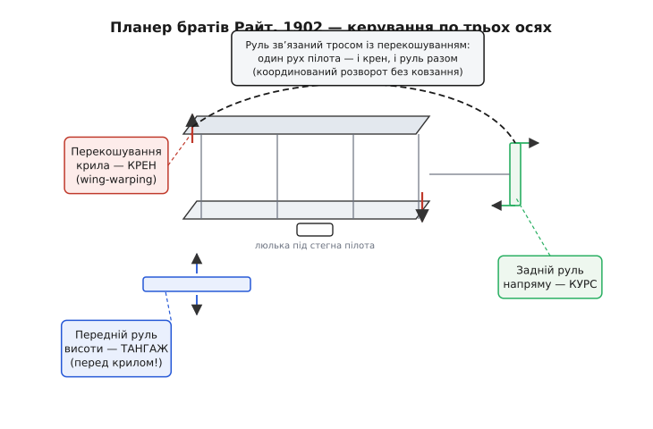

# 📜 Справжнє відкриття братів Райт — не двигун, а три осі

Спитай будь-кого, що винайшли брати Райт, — почуєш «літак» або «літак із двигуном». Це майже нічого не пояснює, бо на грудень 1903-го, коли Флаєр відірвався від піску в Кітті-Гок, у світі вже років двадцять будували апарати з двигунами й крилами. Двигун ніхто не винаходив спеціально під літак — Райти замовили кустарну чотирициліндрову бензинку в свого механіка Чарлі Тейлора (Charlie Taylor), бо жоден серійний мотор не мав потрібного відношення потужності до ваги; це була інженерна морока, а не осяяння. Крило теж не вони придумали — форму профілю, підіймальну силу, навіть біпланну коробку до них досліджували Джордж Кейлі (George Cayley), Отто Лілієнталь (Otto Lilienthal), Октав Шанют (Octave Chanute).

Чого ж бракувало всім, і що насправді знайшли двоє власників велосипедної майстерні з Дейтона? Бракувало **керованості**. І не абиякої, а керованості **одразу по трьох осях** — тієї самої, що ми щойно розібрали як три групи кермових поверхонь. Ось справжнє відкриття: літак — це не крило з двигуном, це **тіло, яким треба безперервно правити навколо трьох осей**, інакше воно тебе вб'є. Райти першими це зрозуміли, першими побудували апарат, що слухався всіх трьох осей, і першими навчилися на ньому літати. Двигун вони приробили останнім — коли керований планер уже був готовий.

Ця замітка — про те, як народилося поняття тривісного керування: що бентежило до Райтів, як вони по черзі здобули кожну вісь, чому їхній планер 1902 року був першим по-справжньому керованим апаратом в історії, як згодом елерони витіснили їхнє перекошування крила — і чому все це закінчилося однією з найгидкіших патентних воєн в історії техніки.

## Хиба, у якій застрягли всі до Райтів

Щоб зрозуміти відкриття, треба відчути глухий кут, з якого воно вивело. А глухий кут був у самій постановці задачі. Майже всі піонери думали так: **політ — це проблема підіймальної сили й тяги**. Дай крилу достатню швидкість (тяга) і достатню площу (підйом) — і воно полетить, як летить кинутий камінь чи пущена стріла. У цій картині апарат мислився як **стабільний за побудовою**: інженер мав так вивірити крила й хвіст, щоб машина сама трималася рівно, а пілот лише «додавав газу» й хіба легенько підправляв напрям. Керування уявляли на кшталт корабельного — один руль, що завертає ніс.

Ця картина здавалася очевидною, і саме тому вбивала. Найясніше видно на долі Отто Лілієнталя — німецького інженера, найкращого планериста свого часу, який зробив понад дві тисячі польотів на балансирних планерах у 1890-х. Керував він єдиним доступним йому способом: **вагою власного тіла**, гойдаючи ногами й тулубом, щоб змістити центр ваги. Поки пориви були слабкі, це працювало. 9 серпня 1896 року порив задер ніс, планер втратив швидкість, звалився — і Лілієнталь, не маючи жодного важеля, щоб опустити ніс чи вирівняти крен швидше, ніж встигне перекинути тіло, розбився й наступного дня помер. Його останні слова, за переказом, — «Opfer müssen gebracht werden» («жертви мусять бути принесені»). Статус цієї фрази — радше легенда, ніж документ, але загибель і її причина — усталений факт.

Ось діагноз, який Райти поставили точніше за всіх сучасників: **Лілієнталя вбила не слабка тяга й не мале крило — його вбила відсутність керування.** Машина сама рівно не трималася, а важеля правити нею вчасно не було. Виснóвок, який зробили брати, звучить майже єретично для свого часу:

> 🔧 **Навіщо це.** Не треба будувати літак, що тримається сам. Треба будувати літак, яким **можна керувати**, — і навчитися ним керувати, як велосипедист навчається тримати рівновагу. Стабільність не в конструкції, а в парі «керма + навички пілота».

Ця думка прийшла до них не випадково: Райти торгували й лагодили велосипеди. А велосипед — апарат **нестабільний за побудовою**: покинутий сам на себе, він падає. Але ним чудово їздять, бо їздець безперервно балансує кермом. Райти першими побачили, що літак — це велосипед, а не корабель. І що, як у велосипеда є одна вісь рівноваги (нахил ліворуч-праворуч), у літака таких осей **три**, і кожну треба вміти правити окремо.

## Крен: як порожня коробка з-під камери підказала перекошування

Три осі Райти здобували не одразу, а по черзі, роками, і кожну — розв'язавши конкретну проблему, що вилазила в польотах. Першою була вісь крену, і саме тут стався той рідкісний момент, який справді заслуговує слова «осяяння».

Улітку 1899 року Вілбур Райт (Wilbur Wright) спостерігав, як великі птахи — грифи, канюки — виправляють крен над річкою Малою Маямі. Він помітив: щоб нахилитися й повернути, птах не махає, а **вивертає кінці крил у різні боки** — одне крило заводить передньою кромкою вгору (більший кут атаки, більший підйом), друге вниз (менший підйом). Крило, що дало більше підйому, піднімається — птах кренить. Ідея була ясна, але як **перенести** її на жорстке крило біплана, не ламаючи його? Як вивернути кінці крил, лишивши середину цілою?

Відповідь Вілбур побачив у руках буквально випадково. За переказом самих братів, він стояв за прилавком крамниці, продавав покупцеві камеру для велосипедної шини, витяг її з довгастої картонної коробки й, розмовляючи, неуважно **крутив порожню коробку за протилежні кінці в різні боки**. І раптом побачив: коли скручуєш коробку, її верхня й нижня грані **вивертаються назустріч одна одній** — точно як два крила біплана, з'єднані стійками. Не треба ламати крило й ставити шарніри — треба **скрутити всю коробку крил тросами**, і кінці самі візьмуть різний кут атаки. Так народилося **перекошування крила** (англ. *wing-warping*).

Це вже не легенда, а добре задокументована історія — вона є в біографіях, у матеріалах Бібліотеки Конгресу, у власних свідченнях братів; статус усталений. Технічно перекошування — це рівно те, що роблять елерони, тільки грубіше: воно міняє **кут атаки** цілого кінця крила замість того, щоб відхиляти окремий клапоть на кромці. Уже в липні 1899-го Райти перевірили ідею на біплановому змії розмахом півтора метра — смикаєш за шнури, змій кренить у той бік, куди скрутив. Крен був здобутий. Це перша з трьох осей.

## Тангаж: передній руль висоти — і несподівана біда

Друга вісь — тангаж, ніс угору-вниз. Тут Райти зробили вибір, який сучасному оку здається дивним: **руль висоти вони поставили не позаду, а попереду крил** (така схема зветься «качка», англ. *canard*). Причин було дві. По-перше, після загибелі Лілієнталя вони боялися звалювання найдужче, а передня поверхня в разі втрати швидкості зривається раніше за крило й **опускає ніс сама**, повертаючи швидкість, — свого роду захист від того, що вбило Лілієнталя. По-друге, поверхню перед очима пілота, що лежить долілиць, видно й легше «читати».

Планер 1901 року вже мав це переднє кермо тангажа й перекошування крила — тобто дві осі з трьох. Райти привезли його на дюни Кітті-Гок упевненими, що керованість у них у руках. І тут вилізла та сама пастка, яку ми в основній темі назвали **зворотним рисканням** (англ. *adverse yaw*) — тільки Райти зустріли її живцем, у повітрі, і спершу нічого не зрозуміли.

Ось що коїлося. Пілот дає перекошування, щоб вийти з крену, скажімо, ліворуч: правий кінець крила бере більший кут атаки, більше підйому — і водночас **більше опору**. Правий кінець гальмується, і ніс, замість того щоб слухняно піти в бік крену, **відвертає в протилежний** — праворуч. Апарат ковзає, кренить не туди, керування ніби «застрягає» й починає боротися само з собою. Найгірше: подеколи спроба вийти з крену перекошуванням лише **поглиблювала** крен, бо ніс завертало не туди, і машина сповзала в бік опущеного крила. У Кітті-Гок 1901-го це так налякало братів, що додому вони поверталися пригнічені; Вілбур, за спогадами, кинув, що людина полетить хіба років за п'ятдесят. Мали дві осі — а машина все одно виривалася з рук.

## Курс: третя вісь, що звʼязала все докупи

Розгадка, яка зробила Райтів Райтами, дозріла взимку 1901–1902 років, і в ній — суть тривісного керування. Брати зрозуміли: **двох осей замало**. Перекошування дає крен, переднє кермо — тангаж, але коли перекошування паразитно завертає ніс не туди, **нема чим це завертання спинити**. Бракує третьої осі — курсу. Потрібна вертикальна поверхня на хвості, яка вміє повернути ніс назад, у бік крену, і тим погасити зворотне рискання.

Так на планері **1902 року** з'явився **задній вертикальний руль напряму** — третя, остання поверхня. Тепер апарат мав повний набір: перекошування (крен), переднє кермо (тангаж), задній руль (курс). Але просто **додати** руль було мало — і в цьому найтонше й найгеніальніше місце всієї історії.

Спершу руль зробили **нерухомим** кілем — думали, вертикальне пір'я саме стабілізує ніс. Не спрацювало: у крутіших розворотах машина все одно норовила сповзти в бік і ввійти в те, що пізніше назвуть штопором. Тоді Райти зробили руль **рухомим** — і постало питання: як пілотові ним правити? У нього ж і так зайняті руки (переднє кермо) та стегна (люлька перекошування). Додати ще один важіль означало вимагати від людини стежити за трьома органами водночас у секунди, коли машина вислизає.

І тут Райти зробили хід, гідний найкращих інженерів: вони **не дали пілотові окремого руля — вони звʼязали руль напряму тросом із люлькою перекошування**. Один рух стегон тепер робив **дві речі разом**: перекошував крило (заводив крен) і відхиляв руль напряму рівно на стільки, щоб компенсувати зворотне рискання від того самого перекошування. Пілот думав тільки про крен — а координацію по курсу машина робила **сама, механічно**. Це, по суті, перший в історії **мікшер** керма: одна дія розкладається на дві поверхні за наперед вивіреним співвідношенням. Рівно та ідея, з якої в основній темі виріс [скоординований поворот](root:embedded/output-mixing) у прошивці — тільки в Райтів вона була не в коді, а в тросах.

*Три осі керування планера Райтів 1902 року. Перекошування крила (червоне) виверта кінці в різні боки — крен. Переднє кермо (синє) перед крилом — тангаж. Задній вертикальний руль (зелене) — курс. Головне — пунктирна звʼязка: руль напряму зʼєднаний тросом із люлькою перекошування, тому один рух пілота водночас кренить машину й гасить зворотне рискання. Це, по суті, перший механічний мікшер керма.*

Планер 1902 року літав так, що брати за осінь зробили на ньому близько тисячі польотів, деякі — за сотні метрів, з розворотами, у вітер, під повним контролем пілота. **Це був перший в історії апарат, яким людина по-справжньому керувала одразу навколо всіх трьох осей.** Так його й описує NASA Glenn Research Center: «Перший апарат, що досяг повного активного керування, — планер 1902 року». Статус цього твердження — усталений; на ньому сходяться і NASA, і Смітсонівський музей авіації.

> 🔧 **Навіщо це.** Двигун після цього був майже формальністю. Коли керований планер уже літав, Флаєр 1903 року = планер 1902-го + мотор Тейлора + два гвинти. Тому й кажуть: справжнім відкриттям Райтів було **керування**, а не силова установка. Патент, що вони подали 1903 року (виданий 1906-го під номером US 821 393), теж захищав не двигун і не крило — він захищав **систему керування по трьох осях**. Цей акцент згодом коштував авіації дуже дорого, до чого ми ще дійдемо.

Варто чесно додати: та сама механічна звʼязка, що зробила 1902 рік тріумфом, виявилася й обмеженням. Уже на Флаєрі III **1905 року** Райти **розʼєднали** руль напряму й перекошування, давши пілотові **окремий** важіль на кожну поверхню — бо жорсткий фіксований мікс не давав правити креном і курсом незалежно там, де це було потрібно (зокрема, щоб виходити з випадкового заносу). Так тривісне керування набуло сучасного вигляду: **три осі — три незалежні органи**, а вже як їх поєднувати (і чи поєднувати), вирішує пілот або, у нашому випадку, мікшер прошивки. Дата 1905 і суть зміни — усталений факт, підтверджений і Вікіпедією, і музейними джерелами по Флаєру III.

## Чому елерони перемогли перекошування

Перекошування крила виграло небо — і за пару десятиліть зникло з нього назавжди. Сьогодні жоден серійний літак не перекошує крило; усі кренять **елеронами** — окремими клаптями на задній кромці кінців крил, тими самими, що ми розібрали в основній темі. Чому здобувач перемоги програв наступнику?

Причина суто конструкційна й дуже фізична. Перекошування працює, **скручуючи все крило**. Поки крило легке, тонке й гнучке (полотно на дерев'яному каркасі, як у Райтів), скрутити його тросами можна. Але авіація рвалася до **більших швидкостей**, а це вимагало крил **жорсткіших** — товщих у профілі, з міцнішим силовим набором, згодом суцільнометалевих. Таке крило скрутити не вийде: воно на те й зроблене, щоб **не** гнутися під навантаженням. Перекошування впиралося в стіну — що кращим ставав силовий каркас крила, то важче було його вивернути.

Елерон обходить проблему елегантно: не чіпай крило взагалі, **приший до його кромки окремий рухомий клапоть на шарнірі**. Жорсткість крила більше не заважає — гнеться лише маленька навісна поверхня, а не вся коробка. Що жорсткіше й швидше крило, то очевидніша перевага елерона. Тому перехід був неминучий: перекошування — рішення для м'якого тихохідного крила початку століття, елерон — для жорсткого швидкісного крила всієї подальшої авіації.

І ось тут історія робить несподіваний поворот, який чудово ілюструє глобальне правило: **винаходи майже ніколи не належать одній людині чи одній даті.** Бо елерон не «винайшли після Райтів». Його запатентували **на тридцять із гаком років раніше за їхній політ** — і зробив це англієць Метью Пірс Ватт Болтон (Matthew Piers Watt Boulton), онук того самого Болтона, що був діловим партнером Джеймса Ватта. У **британському патенті № 392 від 1868 року** Болтон описав саме бічне керування окремими поверхнями на кінцях крил — тобто елерон у сучасному значенні, ще до появи жодного літака з двигуном. Патент забули на десятиліття; його дістали з архівів, коли елерон уже був усюди. Це усталений факт, зафіксований і в патентних архівах, і в матеріалах Смітсонівського музею.

Тут криється гостра юридична іронія, вкрай важлива для наступної частини. **Якби патент Болтона згадали під час патентних боїв Райтів, самі Райти навряд чи змогли б претендувати на пріоритет у бічному керуванні** — англієць описав ідею за покоління до них. Але одне діло **описати** ідею на папері, і зовсім інше — **побудувати** її в металі й полотні. Болтон свій елерон ніколи не збудував. Першим, хто **реально поставив елерони на апарат**, був француз Робер Есно-Пельтрі (Robert Esnault-Pelterie): у 1904 році він скопіював планер у стилі Райтів, але замінив незручне перекошування рухомими поверхнями на кінцях крил. Чи бачив він патент Болтона, чи винайшов елерон незалежно — невідомо; джерела чесно кажуть, що не знають.

> 🔧 **Навіщо це.** Ланцюг «елерона» — хрестоматійний приклад того, як насправді визріває техніка. Болтон **придумав і запатентував** (1868). Есно-Пельтрі **вперше збудував і полетів** (1904). Райти дали світові **робочу систему тривісного керування** (1902) — але через **перекошування**, а не елерон. І лише жорсткіші швидкісні крила зробили елерон **неминучим стандартом**. Ідея, перша реалізація, робоча система, масовий стандарт — це чотири різні події, з різними людьми й датами. Приписати «винахід елерона» комусь одному — значить збрехати.

## Патентна війна: як пріоритет по трьох осях спалив десять років

Лишається найгидкіша частина, і сховати її було б нечесно. Райти отримали за свою працю не лише славу — вони отримали **надзвичайно широкий патент**, і те, як вони ним скористалися, надовго загальмувало американську авіацію.

Патент US 821 393 (виданий 22 травня 1906 року) був сформульований так широко, що претендував не на конкретний механізм перекошування, а на **сам принцип** бічного керування в поєднанні з рулем напряму — тобто фактично на **ідею скоординованого тривісного керування як таку**, яким би способом його не робили. У перекладі на людську мову Райти твердили: будь-який апарат, що кренить одне крило дужче за друге й водночас править курс рулем, — порушує наш патент. У тому числі апарат з елеронами, хоча елерон — це не перекошування й придуманий був до них.

Саме на цьому зіткнулися Райти з **Гленном Кертіссом** (Glenn Curtiss) — талановитим конструктором мотоциклетних двигунів, що прийшов в авіацію й ставив на свої машини елерони. Райти подали позов, доводячи, що елерони Кертісса — те саме бічне керування, отже, порушення. Почалася **патентна війна** — близько дванадцяти великих судових справ, що тяглися роками. У лютому 1913 року суд першої інстанції став на бік Райтів (елерони визнали порушенням патенту 1906 року), у січні 1914-го апеляційний суд це підтвердив.

Наслідок був руйнівний, і ось у чому головна гіркота історії. Райти й Кертісс, взаємно блокуючи одне одного патентами, фактично **зупинили будівництво нових літаків у США**. Кожен виробник боявся позову. І це в роки, коли Європа вже мала бойову авіацію, а Перша світова війна показала, що літак — зброя. На 1917 рік Америка, батьківщина літака, катастрофічно відставала у власному літакобудуванні — значною мірою через патентну блокаду.

Розв'язала вузол не техніка й не суд, а **війна й держава**. Під тиском уряду, якому терміново були потрібні літаки для фронту, 24 липня 1917 року створили **Асоціацію авіавиробників** (Manufacturers Aircraft Association) з **патентним пулом**: усіх виробників зобовʼязали вступити, скинути патенти в спільний котел і платити невеликий роялті з кожного літака, поки ключові патенти не спливуть. Взаємне блокування скасували адміністративно. Кораблебудування авіації розблокували — але десять безцінних років уже згоріли в судах. Усі ці дати й перебіг — усталений факт, зафіксований і у Вікіпедії, і в матеріалах авіаційних та юридичних архівів.

Як оцінювати цю історію без пафосу в жоден бік? Тверезо. Райти **справді** зробили головне відкриття ери польоту — керування по трьох осях, і планер 1902 року це доводить незаперечно. Їхній патент **справді** захищав реальний винахід. Але надто широке його трактування — претензія на **принцип**, а не на конкретний механізм, — і агресивне засудження всіх, хто кренив крило інакше (навіть елероном, що придумали до них і що фізично інший), обернулося тим, що першовідкривачі на роки стали гальмом власної галузі. Це не применшує їхнього генія — це показує, що геній винахідника й мудрість власника патенту не одне й те саме.

## Що з цього забрати

Три осі — не абстрактна класифікація з підручника. Це **вистраждане відкриття**, вихоплене з реальних смертей і реальних майже-катастроф. Лілієнталь загинув, бо мав нуль осей керування — правив вагою тіла. Райти на планері 1901 року мали дві осі — і машина виривалася з рук через зворотне рискання, якому нічим було протидіяти. І лише **третя вісь**, задній рухомий руль, звʼязаний із перекошуванням у координований розворот, зробила апарат по-справжньому керованим — уперше в історії, у 1902 році, ще до всякого двигуна.

Тому коли в основній темі ми ділимо керування літаком на крен, тангаж і курс, а руль напряму називаємо поверхнею **координації**, а не повороту, — ми не переказуємо суху теорію. Ми повторюємо той самий висновок, до якого Райти дійшли тросами, стегнами й ризиком власних ший на дюнах Кітті-Гок. Механізми змінилися — перекошування поступилося елеронам, троси поступилися сервоприводам і рядкам коду, — але **сама ідея тривісного координованого керування** лишилася рівно тією, яку двоє велосипедних майстрів здобули на своєму планері понад століття тому.
