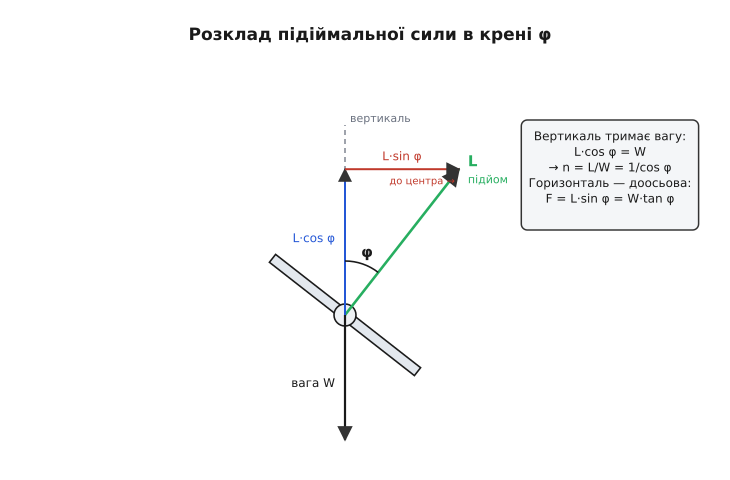
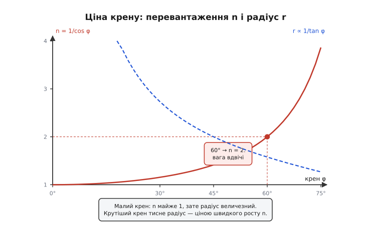

# 🧮 Фізика розвороту креном: звідки беруться n = 1/cos φ і r = V²/(g·tan φ)

Ми вже встановили головне якісно: літак повертає не рулем, а креном — накренені елерони нахиляють вектор підіймальної сили, і його горизонтальна складова тягне машину в дугу. Це пояснює *чому* поворот виходить із крену. Але щойно за це береться автопілот, самого «чому» мало. Контролеру треба **число**: на скільки нахилити літак, щоб пройти дугу заданого радіуса; який радіус вийде з наявного крену на наявній швидкості; наскільки при цьому обважніє апарат і чи не зірветься крило. Уся ця арифметика виводиться з двох сил і одного кута — і виводиться так чисто, що вкладається у три короткі формули, кожну з яких варто не завчити, а **побачити, звідки вона береться**.

Почнімо з того, що взагалі діє на літак у сталому розвороті, — бо всі три формули виростуть із балансу цих сил, як барометрична сім'я виростала з одного диференціального рядка.

## Дві сили і один кут

Уявімо літак у **сталому координованому розвороті**: він іде по колу з незмінним креном, на незмінній висоті, з незмінною швидкістю. «Сталий» тут — ключове слово: якщо нічого не розганяється й не набирає висоти, то по вертикалі й по «розгону-гальму» сили зрівноважені, а нескомпенсованою лишається рівно та сила, що загинає траєкторію в коло. Це дає нам два незалежні рівняння — і з них усе.

Які сили діють? У сталому польоті їх, по суті, дві, що нас цікавлять (тягу й опір винесемо за дужки — вони врівноважують одне одного вздовж траєкторії й на геометрію дуги не впливають):

- **Вага** `W = m·g` — завжди прямо вниз, хоч як нахилений літак. Це сила, з якою Земля тягне масу `m`; `g ≈ 9.81 м/с²`.
- **Підіймальна сила** `L` — і ось тут уся суть: вона напрямлена **перпендикулярно до крил**, а не просто вгору. Крило віддає силу впоперек свого профілю; поки літак летить рівно, це «впоперек» дивиться вгору, але щойно ми накренили апарат на кут `φ`, вектор `L` нахиляється разом із крилом рівно на той самий кут від вертикалі. Звідки взагалі береться `L` і чому вона `½·ρ·V²·S·C_L` — окрема історія самого крила; тут нам досить того, що це **єдина велика керована сила**, і напрям її ми задаємо креном.

> 🔧 **Що треба знати про підіймальну силу.** Крило віддає силу, пропорційну квадрату швидкості: `L = ½·ρ·V²·S·C_L`, де `ρ` — густина повітря, `S` — площа крила, `C_L` — коефіцієнт підйому (росте з кутом атаки до зриву). Ключове для розвороту: `L` напрямлена **перпендикулярно до площини крил**, тож нахил літака нахиляє й вектор сили. Пілот (автопілот) регулює величину `L` кутом атаки через руль висоти, а її **напрям** — креном через елерони. Повний вивід — у [підіймальній силі крила](root:ph-mechanics/fixed-wing-lift).

Тепер розкладемо нахилений вектор `L` на дві складові — вертикальну й горизонтальну — і подивимося, що кожна з них зобов'язана робити. Саме цей розклад — серце всієї теми.


*Літак, накренений на кут φ (вид ззаду). Підіймальна сила L перпендикулярна до крил, тож відхилена на φ від вертикалі. Вертикальна складова L·cos φ тримає вагу W. Горизонтальна L·sin φ ні з чим не врівноважена — вона й є доосьовою (центроспрямованою) силою, що заводить літак у дугу. Уся кількісна фізика розвороту — це два рівняння з цього трикутника.*

## Вертикаль тримає вагу — і звідси перевантаження

Почнімо з вертикалі, бо це рівняння простіше й дає першу з трьох формул. Літак не набирає й не втрачає висоти — отже, сума вертикальних сил дорівнює нулю. Угору тягне вертикальна складова підйому, `L·cos φ`; вниз тягне вся вага `W`. Прирівняймо:

```
L · cos φ  =  W
```

Дивись, що це означає. Коли крену немає (`φ = 0`, `cos 0 = 1`), маємо `L = W` — крило віддає рівно стільки, скільки важить літак, як і має бути в горизонтальному польоті. Але щойно ми кренимо, `cos φ` стає меншим за одиницю, і щоб добуток `L·cos φ` усе одно дорівнював вазі, **сама `L` мусить зрости**. Крило тепер зобов'язане віддавати більше сили, ніж важить літак, — бо лише частина цієї сили (вертикальна проєкція) працює проти ваги, а решта пішла вбік, у поворот. Виразимо, скільки саме потрібно:

```
L  =  W / cos φ
```

Відношення потрібної підіймальної сили до ваги — це і є **перевантаження**, або **коефіцієнт навантаження** (англ. *load factor*), яке позначають `n`:

```
n  =  L / W  =  1 / cos φ
```

Ось перша формула, і вона глибша, ніж здається. `n` — це у скільки разів крило (і вся конструкція, і пілот) навантажені сильніше, ніж у спокійному горизонтальному польоті. У рівному польоті `n = 1` («одне g»): усе важить стільки, скільки має. У розвороті `n > 1`: усе — крило, лонжерони, пасажир, акумулятор — стає **важчим у `n` разів**. І росте це навантаження не лінійно з креном, а через `1/cos φ`, тобто спершу повільно, а під кінець — вибухово. Порахуймо кілька точок, щоб відчути криву:

```
φ = 0°   →  n = 1 / cos 0°   = 1.00      (рівний політ, «одне g»)
φ = 30°  →  n = 1 / cos 30°  = 1.15      (навантаження +15 %)
φ = 45°  →  n = 1 / cos 45°  = 1.41      (крило тягне у 1.4 раза важче)
φ = 60°  →  n = 1 / cos 60°  = 2.00      (рівно вдвічі — «два g»)
φ = 75°  →  n = 1 / cos 75°  = 3.86      (майже вчетверо!)
φ = 80°  →  n = 1 / cos 80°  = 5.76
```

Число `60° → 2g` варто закарбувати: на шістдесятиградусному крені літак і все на борту важать **удвічі**, і крило мусить віддавати подвійну силу. А далі крива стає майже вертикальною — від 75° до 80° перевантаження стрибає з ~3.9 до ~5.8. Ось чому крутий крен небезпечний не сам по собі, а через цю функцію: за кутом 60° розплата за кожен наступний градус зростає лавиною.

> 🔧 **Навіщо це прошивці.** Перевантаження `n = 1/cos φ` — це не абстракція, а **саме те число, що читає акселерометр** у зв'язці вимірювання руху: у координованому розвороті давач питомої сили показує вздовж вертикальної осі літака рівно `n` разів по `g`. Це дає автопілоту дешеву перехресну перевірку крену без окремого давача: виміряна вертикальна питома сила має дорівнювати `1/cos φ` від оціненого крену — розійшлися, отже або оцінка крену бреше, або розворот некоординований (є ковзання). Що таке питома сила й чому акселерометр міряє саме її — у [питомій силі та strapdown](root:ph-mechanics/specific-force). А ще з `n` прямо випливає межа: якщо контролер знає граничне перевантаження планера (скажімо, `n_max = 4`), він може обмежити командний крен так, щоб `1/cos φ` ніколи його не перевищило — тобто заборонити крен, крутіший за `arccos(1/n_max)`.

Тепер повернімося до горизонталі — тієї складової, що ми відклали. Вона дасть радіус і швидкість розвороту.

## Горизонталь загинає траєкторію — звідси радіус і кутова швидкість

Вертикальна складова підйому пішла на боротьбу з вагою й нічого не лишила для повороту. А от **горизонтальна складова** `L·sin φ` не врівноважена нічим — уздовж горизонталі в сталому розвороті немає іншої сили, яка б їй протистояла. За другим законом Ньютона нескомпенсована сила дає прискорення; тіло, що рухається по колу сталого радіуса `r` зі швидкістю `V`, має **доосьове (центроспрямоване) прискорення** `V²/r`, напрямлене до центра кола. Отже горизонтальна складова підйому — це і є та сила, що створює це прискорення:

```
L · sin φ  =  m · V² / r
```

Ліва частина — доосьова сила; права — маса на доосьове прискорення. Тепер маленький, але вирішальний хід: у нас **два** рівняння — це щойно написане й вертикальне `L·cos φ = W = m·g`. Поділімо перше на друге. Зліва `L` і `m` скоротяться самі собою, і лишиться чиста геометрія:

```
(L · sin φ) / (L · cos φ)  =  (m · V² / r) / (m · g)

sin φ / cos φ  =  V² / (r · g)

tan φ  =  V² / (r · g)
```

Ось воно — увесь зв'язок крену, швидкості й радіуса вклався в один рядок `tan φ = V²/(r·g)`, і жодних мас чи площ крила в ньому не лишилося. Це саме по собі красиво: **радіус розвороту не залежить ні від ваги літака, ні від розмаху крил** — важкий транспортник і легкий планер на однаковій швидкості й однаковому крені опишуть коло **однакового** радіуса. Уся конкретика машини сховалася в тому, який крен вона фізично здатна тримати, а щойно крен заданий — геометрія універсальна. Розв'яжімо цей рядок відносно радіуса:

```
r  =  V² / (g · tan φ)
```

Друга формула. Прочитаймо її як механізм, а не як символи. Радіус росте з **квадратом** швидкості: удвічі швидший літак на тому самому крені опише вчетверо ширшу дугу — тому реактивний лайнер розвертається величезними колами, а повільний тренувальний літак крутиться майже на місці. І радіус падає з `tan φ`: що крутіший крен, то тісніший розворот, і падає він швидко, бо `tan` під кінець злітає в нескінченність. На малому крені (`tan φ → 0`) радіус величезний — тому легкий доторк елеронів ледь-ледь загинає курс; на крені під 80–90° радіус тисне до нуля, і літак крутиться майже навколо кінчика крила (якби перевантаження дозволило).

Часто зручніше думати не про радіус, а про **кутову швидкість розвороту** `ω` — скільки градусів на секунду повертається ніс. Вона зв'язана з радіусом простим `V = ω·r` (лінійна швидкість = кутова × радіус), звідки `ω = V/r`. Підставмо наш радіус:

```
ω  =  V / r  =  V / ( V² / (g · tan φ) )  =  g · tan φ / V
```

Третя формула, `ω = g·tan φ / V`, і вона ховає гарний, спершу неочевидний факт: кутова швидкість розвороту **падає** зі швидкістю польоту. На тому самому крені **повільніший** літак повертає ніс **швидше** (більше градусів за секунду), хоч його радіус і менший. Це та сама причина, чому важкий швидкий літак здається млявим у поворотах, а легкий повільний — верким: справа не в «маневреності» абстрактно, а в тому, що `ω ~ 1/V`.


*Ціна крену. Суцільна крива — перевантаження n = 1/cos φ: до 45° росте помірно, після 60° (де n вже = 2) злітає майже вертикально. Пунктирна — відносний радіус r ∝ 1/tan φ: крутіший крен туго стягує дугу. Обидві читаються разом: тісніший розворот завжди коштує більшого перевантаження, і після 60° ця плата стає лавинною.*

Три формули з одного трикутника — зберімо їх в одному місці, бо вони і є вся кількісна фізика розвороту:

```
n  =  1 / cos φ            перевантаження (у скільки разів важче)
r  =  V² / (g · tan φ)     радіус дуги
ω  =  g · tan φ / V        кутова швидкість (рад/с)
```

Перш ніж рахувати приклад, лишилося закрити одну умову, яку ми весь час мовчки припускали, — **координованість**. Без неї трикутник сил кривий, і формули перестають бути точними.

## Умова координованого розвороту: чому «кулька в центрі»

Весь вивід стояв на одному прихованому допущенні: що підіймальна сила — **єдина** сила в площині крил, тобто вбік літак нічим не зноситься. Такий розворот, де немає бічного ковзання, звуть **координованим**. Подивімося, що це означає з боку сил і чому пілот стежить за «кулькою».

Уяви себе всередині літака в розвороті. На тебе (і на все на борту) діють по вертикальній осі *літака* — не Землі — дві речі: реальна вага, що тягне до центра Землі, і реакція крісла, яка тебе тримає. У координованому розвороті їхня рівнодійна лежить **точно вздовж вертикальної осі літака** — притискає рівно в крісло, не завалюючи ні всередину, ні назовні дуги. Прилад, що це показує, — **покажчик ковзання** (англ. *slip indicator*), проста зігнута трубка з кулькою: коли рівнодійна сил напрямлена вздовж осі літака, кулька стоїть **у центрі**. Ковзнув усередину дуги (замало крену для такого повороту) — кулька відкочується всередину; занесло назовні (забагато крену або замало доосьової сили) — назовні.

Кількісно координованість — це рівно та умова, за якої наш трикутник сил прямокутний, тобто виконується `tan φ = V²/(r·g)` **саме з фактичним креном і фактичним радіусом одночасно**. Якщо пілот дав крен `φ`, але потрібної доосьової сили не набралося (наприклад, притримав ніс і `L` замала), літак ковзне назовні: реальна дуга ширша, ніж обіцяє `r = V²/(g·tan φ)` для цього крену. І навпаки. Тому три формули точні лише в координованому розвороті; у ковзанні вони брешуть, бо частина сил пішла в занос, а не в чисту дугу.

> 🔧 **Навіщо це прошивці.** Для автопілота координація — це закон керування, який ми вже називали якісно, а тепер бачимо кількісно: щоб розворот був координований, потрібно, аби доосьова сила `L·sin φ` рівно відповідала кривизні, яку задає крен. На практиці контролер тримає крен елеронами, підбирає `L` рулем висоти (щоб не просісти) і **зводить бічне прискорення до нуля** рулем напряму — а бічне прискорення міряє той самий акселерометр (його бічна вісь). «Кулька в центрі» перекладається в код як «бічна питома сила = 0»: контролер рискання додає руль напряму доти, доки бічний акселерометр не покаже нуль. Це і є цифровий покажчик ковзання. Знову ж — деталі того, що міряє акселерометр, у [питомій силі](root:ph-mechanics/specific-force).

Тепер, коли умова ясна, застосуймо всі три формули до конкретних чисел — спершу на «ручному» прикладі, тоді в коді.

## Стандартний розворот і правило великого пальця

В авіації є домовлена «зручна» швидкість розвороту — **стандартний розворот** (англ. *standard rate turn*), означений як **3° за секунду**, тобто повне коло `360°` за рівно `2` хвилини. Значення `3°/с` усталене: його закріпили ІКАО й авіаційні відомства як базу для приладового пілотування (документ FAA *Instrument Flying Handbook* та стандарти ІКАО подають саме `3°/с` = «rate one»). Це число зручне тим, що дає пілотові й диспетчеру просту арифметику часу: розвернутися на 90° — 30 секунд, розвернутися на курс, що на 45° інакший, — 15 секунд.

Порахуймо, який крен потрібен для стандартного розвороту, — і побачимо, що він **залежить від швидкості**. Переведімо `3°/с` у радіани: `ω = 3 · π/180 ≈ 0.05236 рад/с`. З формули `ω = g·tan φ / V` виразимо крен:

```
tan φ  =  ω · V / g
φ      =  arctan( ω · V / g )
```

Підставмо дві швидкості — повільний тренувальний літак `50 м/с` і крейсер `100 м/с`:

```
V = 50 м/с:   tan φ = 0.05236 · 50  / 9.81 = 0.2668  →  φ = arctan 0.2668 = 14.9°
V = 100 м/с:  tan φ = 0.05236 · 100 / 9.81 = 0.5336  →  φ = arctan 0.5336 = 28.1°
```

Ось чому «стандартний» крен — не одне число: повільний літак тримає стандартний розворот на ~15° крену, вдвічі швидший — уже на ~28°. Звідси й старе пілотське **правило великого пальця**: для стандартного розвороту крен у градусах ≈ (швидкість у вузлах / 10) + 7. Перевіримо його на нашому крейсері: `100 м/с ≈ 194 вузли`, тож правило дає `194/10 + 7 ≈ 26.4°` — проти точних `28.1°`. Наближення грубе (воно й задумане як усне), але порядок ловить: воно лінеаризує `arctan` навколо типових швидкостей. Для прошивки, звісно, беремо точну формулу, а не правило.

Є ще один наслідок росту `n`, який фізика розвороту зобов'язана назвати, бо він прямо загрожує безпеці, — зростання швидкості зриву.

## Прихована плата: крен піднімає швидкість зриву

Крило зривається (втрачає підйом) на певному куті атаки, якому за даної ваги відповідає **швидкість зриву** `V_s` — найменша швидкість, на якій крило ще віддає потрібну силу. Але «потрібна сила» в розвороті — це вже не вага, а `n·W`, бо крило мусить тримати перевантаження. Із формули підйому `L = ½·ρ·V²·S·C_L,max` (на максимальному `C_L`, тобто на межі зриву) видно, що потрібна швидкість росте як корінь із потрібної сили. У рівному польоті крило тримає `W` на `V_s`; у розвороті воно тримає `n·W`, і швидкість зриву піднімається в `√n` разів:

```
V_s(розворот)  =  V_s(рівний) · √n  =  V_s · √(1 / cos φ)
```

Порахуймо для крену 60°, де `n = 2`:

```
V_s(60°)  =  V_s · √2  ≈  1.41 · V_s
```

Тобто в крутому розвороті крило зривається на швидкості на **41 % вищій**, ніж у прямому польоті. Ось звідки береться підступний «зрив у розвороті на малій швидкості»: пілот заходить на посадку повільно, закладає крутий крен — і крило, якому тепер треба тримати подвійну вагу, зривається, хоча в прямому польоті на цій же швидкості трималося б спокійно. Формула `V_s·√n` — це кількісне пояснення, чому на малій швидкості крутий крен смертельно небезпечний, а автопілот на посадковій швидкості мусить обмежувати крен жорсткіше, ніж у крейсері.

> 🔧 **Навіщо це прошивці.** Обмеження крену не може бути одним числом на всі режими — воно має залежати від швидкості. Контролер, що знає `V_s` і поточну `V`, тримає запас над зривом навіть у розвороті: гранично допустиме перевантаження `n_max = (V/V_s)²`, звідки максимально безпечний крен `φ_max = arccos(1/n_max) = arccos((V_s/V)²)`. На крейсерській швидкості цей `φ_max` великий (крутий крен дозволений), а на посадковій — малий; та сама формула сама затискає крен там, де він небезпечний, без окремих «режимних» таблиць.

Тепер зберемо всю арифметику в робочий код — так, як вона реально лягає у прошивку автопілота.

## Приклад: від крену до дуги в коді

Порахуймо повний набір для конкретного випадку й переконаймося, що числа сходяться з тим, що ми виводили руками.

**Умова.** Літак іде на швидкості `V = 100 м/с` (типова крейсерська для невеликого БПЛА-крила) і закладає координований розворот із креном `φ = 45°`. Знайти: перевантаження `n`, радіус дуги `r`, кутову швидкість `ω` та у скільки разів піднялася швидкість зриву. Порахуймо це так, як рахував би автопілот на мікроконтролері.

```c
#include <math.h>

// Уся кількісна фізика координованого розвороту з одного кута й швидкості.
typedef struct {
    float load_factor;   // n = 1/cos φ  (у скільки разів важче)
    float radius_m;      // r = V²/(g·tan φ)  радіус дуги, м
    float rate_deg_s;    // ω = g·tan φ / V   кутова швидкість, °/с
    float stall_mult;    // √n  у скільки разів вища швидкість зриву
} turn_t;

turn_t turn_geometry(float V_ms, float bank_deg) {
    const float g   = 9.81f;
    float phi = bank_deg * (float)M_PI / 180.0f;   // градуси → радіани
    float c = cosf(phi), t = tanf(phi);

    turn_t o;
    o.load_factor = 1.0f / c;                       // n = 1/cos φ
    o.radius_m    = (V_ms * V_ms) / (g * t);        // r = V²/(g·tan φ)
    o.rate_deg_s  = (g * t / V_ms) * 180.0f / (float)M_PI;  // ω, назад у °/с
    o.stall_mult  = sqrtf(o.load_factor);           // √n
    return o;
}
```

Прокрутімо ключові числа в думці для `V = 100`, `φ = 45°` (де `cos 45° = sin 45° = 0.7071`, `tan 45° = 1`):

```
n  = 1 / 0.7071            = 1.414              (крило тягне у 1.41 раза важче)
r  = 100² / (9.81 · 1)     = 10000 / 9.81 = 1019 м   (дуга радіусом ~1 км)
ω  = (9.81 · 1 / 100)·57.3 = 0.0981 · 57.3 = 5.62 °/с (майже вдвічі швидше за стандартний розворот)
√n = √1.414                = 1.19              (швидкість зриву вища на 19 %)
```

Числа сходяться з ручним виведенням і з незалежними джерелами (на `100 м/с` і `45°` радіус справді виходить ~1019 м, `n = 1.41`). Зверни увагу, як усе пов'язано в одній точці: крен 45° — це помірні `1.41 g`, майже кілометровий радіус і `5.6°/с` — майже вдвічі жвавіше за «стандартні» `3°/с`, за які довелося б скинути крен до ~28°, як ми рахували вище.

Тепер — обернена задача, яку прошивка розв'язує частіше: **дано потрібний радіус, знайти крен**. Автопілот, що веде літак по заданій дузі (обхід перешкоди, коло над точкою), має з радіуса дістати команду крену. Обертаємо `r = V²/(g·tan φ)`:

```c
// Потрібний крен, щоб на швидкості V пройти дугу заданого радіуса.
// Повертає крен у градусах; сам радіус лишається за викликачем затиснути в межі.
float bank_for_radius(float V_ms, float radius_m) {
    const float g = 9.81f;
    float t = (V_ms * V_ms) / (g * radius_m);       // tan φ = V²/(g·r)
    return atanf(t) * 180.0f / (float)M_PI;         // → градуси
}
```

**Перевірка.** Хочемо радіус `500 м` на `V = 100 м/с`:

```
tan φ = 100² / (9.81 · 500) = 10000 / 4905 = 2.039
φ     = arctan 2.039        = 63.9°
```

Майже 64° крену — а це вже `n = 1/cos 64° ≈ 2.3`: щоб удвічі стиснути дугу (з ~1019 до 500 м), довелося залізти в крен, що дає понад двократне перевантаження. Ось та сама лавина, яку показала крива: тісний радіус на цій швидкості коштує дорого. Розумний контролер тут або обмежить крен (і змириться з ширшою дугою), або спершу **скине швидкість** — бо радіус падає з `V²`, тож повільніший літак пройде ті самі 500 м на куди меншому крені й перевантаженні. Це і є фізичний зміст трьох формул у роботі: вони не просто рахують, а показують, чим за що платиш.

## Що з цього виносити

Уся кількісна фізика розвороту креном виростає з одного трикутника сил: підіймальна сила `L` перпендикулярна до крил, тож на крені `φ` вона нахилена на цей кут від вертикалі. Вертикальна складова `L·cos φ` тримає вагу — і з умови `L·cos φ = W` негайно випливає **перевантаження** `n = 1/cos φ`: у розвороті все важче в `1/cos φ` разів, помірно до 45°, рівно вдвічі на 60° і лавинно далі. Горизонтальна складова `L·sin φ` ні з чим не врівноважена — вона й є доосьова сила, і, поділивши горизонтальне рівняння на вертикальне, дістаємо чисту геометрію `tan φ = V²/(r·g)`, звідки **радіус** `r = V²/(g·tan φ)` (не залежить від маси, росте з квадратом швидкості) і **кутова швидкість** `ω = g·tan φ / V` (на тому самому крені повільніший літак повертає жвавіше). Усі три формули точні лише в **координованому** розвороті — без бічного ковзання, коли рівнодійна сил лежить уздовж осі літака й «кулька в центрі»; для автопілота це перекладається в «бічне прискорення = 0». Дві приземлені розплати за крен фізика називає прямо: перевантаження `n` — це те, що читає акселерометр (звідси перехресна перевірка крену й межа `φ_max`), а швидкість зриву росте як `√n`, тож на малій швидкості крутий крен смертельний і крен-ліміт мусить залежати від швидкості. Хто тримає в голові цей трикутник, читає будь-яку задачу розвороту — від обходу перешкоди до безпечного заходу на посадку — не як набір заклять, а як два рівняння Ньютона з одним кутом.
