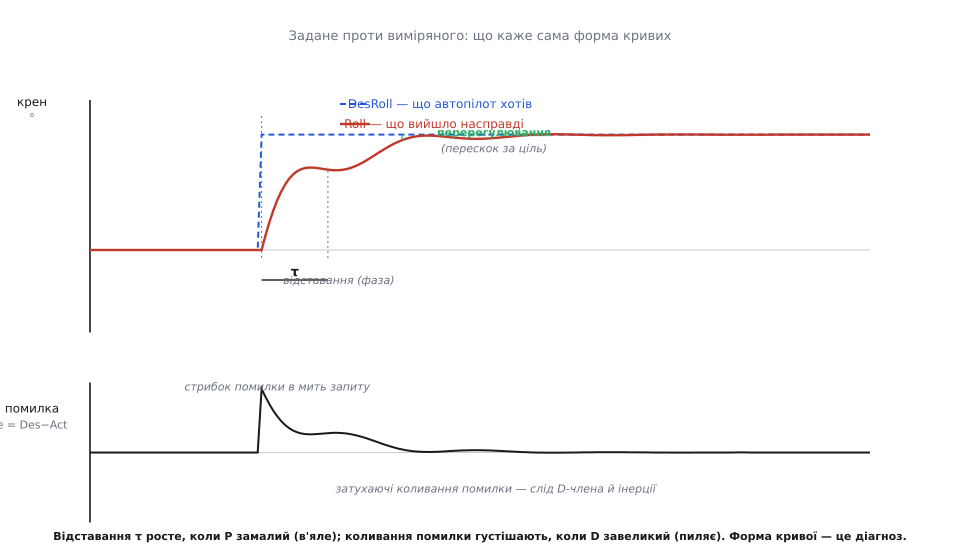

# Аналіз логів польоту/поїздки — глибше

<preknowlist>
- [Дискретний ПІД-регулятор](root:com-signal/discrete-pid) — як P, I та D по-різному реагують на помилку; звідки береться відставання й перерегулювання. Без цього не прочитати пару «задане проти виміряного».
- [Фільтр Калмана / EKF](root:com-signal/kalman-ekf) — оцінка стану зі злиття давачів, поняття прогнозу, виміру й невпевненості (дисперсії). Потрібне, щоб зрозуміти «нев'язку» і ворота.
- [Швидке перетворення Фур'є (ШПФ)](root:com-signal/fft) — розклад сигналу на частоти, поняття частотної роздільності й межі Найквіста. Основа всього про вібрацію.
- [Аварійні режими (failsafe)](root:sys-dron/failsafe) — що змушує апарат сам вертатися чи сідати; сюди сходяться сліди провалу напруги й зриву оцінки.
</preknowlist>

Базова тема дала карту: де в лозі шукати правду — задане проти виміряного, невпевненість оцінки, напруга під навантаженням, вібрація в спектрі. Але карта показує **де**, а не **скільки**. А в реальному розслідуванні різниця між «крива трохи пиляє» і «крива пиляє так, що це відмова» — це різниця в конкретних числах, і хто цих чисел не рахує, той однаково гадає, тільки над графіком. Тут ми беремо кожен слід із базової теми й доводимо його до дна: виводимо, **чому** саме таке число означає саме таку хворобу, рахуємо межі руками й розбираємо випадки, де око бачить одне, а лог каже інше.

Нитка проста: спершу — **час**, бо без спільної осі часу жоден слід не має сенсу; тоді — **три пари** з базової, але вже з арифметикою, що перетворює хвилю на діагноз; наприкінці — **вібрація до останнього гвинта** й **метод зшивання слідів**, коли одна крива бреше, а правда лежить у збігу кількох. Усе, що ми накидали в базовій як «дивися сюди», тут стає «ось формула, ось число, ось межа».

## Час — хребет усього логу

Перше, що треба зрозуміти глибше за базову: лог — це не «дані», а **дані, прив'язані до часу**, і вся діагностика тримається на тому, що різні записи можна поставити на **одну** вісь часу й побачити, що сталося раніше, а що пізніше. Забери час — і лог розсиплеться на купу неспіввідносних чисел.

ArduPilot веде час у полі `TimeUS` — **мікросекунди від старту автопілота** (англ. *microseconds*, 10⁻⁶ с), беззнакове 64-бітне ціле. Чому мікросекунди, а не мілісекунди чи секунди? Бо гвинт обертається сотні разів на секунду, і подія, яку ми розслідуємо, часто триває **частку мілісекунди**; писати час грубішими одиницями — значить не бачити саме те, заради чого й пишемо лог. А чому 64 біти? Порахуймо межу, бо це не дрібниця:

```
32-бітне лічення мкс:  2³² мкс = 4 294 967 296 мкс ≈ 4295 с ≈ 71.6 хв
64-бітне лічення мкс:  2⁶⁴ мкс ≈ 1.8·10¹³ с ≈ 584 542 роки
```

Якби час писали 32-бітним, лічильник **переповнився** б і стрибнув на нуль приблизно через 72 хвилини польоту — і всі криві після цього моменту з'їхали б назад у часі, розсинхронізувавши розслідування рівно тоді, коли довгий політ найцікавіший. 64 біти прибирають цю пастку назавжди: до переповнення — сотні тисяч років. Тому в сучасних логах `TimeUS` **монотонний** (лат. *monos* — один, *tonos* — напрям: іде тільки вперед, ніколи не назад), і на це можна спиратися.

> 🔧 **Навіщо це.** Монотонність — не абстракція, а робочий інструмент. Коли зшиваєш кілька потоків (`ATT`, `GPS`, `BAT`) в одну картину, ти сортуєш **усі** записи за `TimeUS` і йдеш по спільній стрічці. Якщо десь час раптом **зменшився** — це або читаєш побитий лог, або наклав два різні файли, або (у зовсім старих чи гібридних логах) наштовхнувся на інше джерело часу. Побачив немонотонний `TimeUS` — спершу віднови довіру до самого файлу, а тоді вже читай дані; інакше збудуєш хибну послідовність подій.

Тут причаїлася перша глибша тонкість, якої базова не торкалась: **не всі записи писані з однаковою частотою, і не всі покривають однакові відрізки часу**. `ATT` (кути) автопілот пише часто — десятки чи сотні разів на секунду; `GPS` — рідко, зазвичай 5–10 разів; `BAT` — теж рідко. Тому, поклавши їх на одну вісь, дістаєш **нерівну** сітку: між двома сусідніми точками `GPS` уміщається двадцять точок `ATT`. Зшиваючи потоки, не можна припускати, що на кожен `ATT` є свіжий `GPS` — здебільшого ти береш **останній відомий** `GPS` і тягнеш його, поки не прийде новий. Це фундаментально: подія в кутах, що триває 20 мс, у сітці `GPS` узагалі не має власної точки, і шукати її треба в `ATT`, а не в `GPS`.

Звідси — **межа роздільності самого логу**: подію коротшу за крок запису лог **фізично не бачить**. Якщо мотор смикнувся за 3 мс, а `ATT` пишеться раз на 10 мс, у лозі від того смику лишиться в найкращому разі одна перекошена точка, а то й жодної. Це та сама межа, що й у будь-якому вимірюванні: **не можна побачити коливання швидше за половину частоти запису** (до цього ми доберемося строго в розділі про вібрацію — там це зветься межею Найквіста). Практичний висновок: перш ніж казати «лог нічого не показав», спитай, чи міг він **узагалі** показати подію такої тривалості на такій частоті. Часто «нічого не видно» означає «писали надто рідко», а не «нічого не сталося».

Ще одна річ, яку варто знати глибше: `TimeUS` — це годинник **автопілота**, а не єдиний час у системі. GPS несе **свій** час (супутниковий, астрономічно точний), і в лозі є поля, що дають зсув між ними. Для звичайного розслідування бортовий `TimeUS` — усе, що треба, бо всі бортові записи міряні ним і вже узгоджені між собою. Але коли зводиш бортовий лог із **зовнішнім** джерелом (відео з камери, наземний радар, другий апарат), доводиться перераховувати один час в інший — і тоді зсув між бортовим годинником і GPS-часом стає потрібен. У межах одного `.bin` цим можна не перейматися: там панує єдиний `TimeUS`.

## Пара «задане проти виміряного» — тепер з арифметикою

Базова навчила накладати `DesRoll` на `Roll` і читати три випадки на око: пиляє — забагато різкості, ліниво тягнеться — замало підсилення, розбіглися — зрив. Тепер зробимо з цього **вимірюване** число, бо «пиляє» в різних людей різне, а розслідування має спиратися на величину, а не на враження.

Уся діагностика цієї пари виростає з однієї величини — **помилки стеження** (англ. *tracking error*):

```
e(t) = DesRoll(t) − Roll(t)
```

Це миттєва різниця між тим, чого автопілот хотів, і тим, що вийшло, у кожну мить `t`. [Регулятор](root:com-signal/discrete-pid) тільки те й робить, що жене цю помилку до нуля; отже, **форма** `e(t)` — це прямий портрет здоров'я регулятора. Розкладімо три базові випадки на мову `e(t)`.

**Відставання (замалий P).** Коли автопілот запитує новий кут — скажімо, різко хоче нахилитися на 20° — `DesRoll` стрибає сходинкою, а `Roll` не може стрибнути миттєво: апарат має інерцію, мотори — скінченну тягу. Тому `Roll` **тягнеться** до нової цілі з деякою затримкою. Цю затримку видно як **фазове відставання** (англ. *phase lag*) — виміряна крива повторює задану, але зсунута вправо в часі на τ. Що менший пропорційний член P, то слабше регулятор «штовхає» до цілі й то більше τ. У помилці це — довгий, повільно спадний горб: `e(t)` підскакує в мить запиту й **поволі** сповзає до нуля.

**Коливання (завеликий D).** Диференційний член D реагує на **швидкість** зміни помилки й гальмує апарат, коли той наближається до цілі надто прудко. У міру D корисний — гасить перескок. Але завеликий D підсилює **шум** (бо швидкість шумного сигналу — ще шумніша) і сам починає розхитувати: апарат смикається туди-сюди навколо цілі. У помилці це — **затухаючі** (а при зовсім завеликому D — і незатухаючі) коливання: `e(t)` не сповзає плавно, а дзвенить, перетинаючи нуль знову й знову.


*Форма кривих — це діагноз. Задане (`DesRoll`) стрибає сходинкою; виміряне (`Roll`) наздоганяє з відставанням τ і перескакує ціль (перерегулювання), тоді затухаюче коливається. Унизу — сама помилка `e = Des − Act`: різкий стрибок у мить запиту й дзвін, що згасає. Довше τ — замалий P (в'яле); густіший дзвін помилки — завеликий D (пиляє). Розбіжність без повернення — уже не тюнінг, а зрив.*

Тепер — числа, якими це міряють. Замість «пиляє / не пиляє» беруть **середньоквадратичну помилку** (англ. *root-mean-square*, RMS — корінь із середнього квадратів): збираєш `e(t)` за відрізок і рахуєш

```
        ┌─────────────────────
e_rms = │ (1/N) · Σ e(t)²
        └√
```

Квадрат прибирає знак (перескок і недоліт однаково погані) і **карає великі відхилення сильніше** за дрібні, бо росте квадратично. Мала `e_rms` — регулятор тримає ціль щільно; велика — щось не так, і сусідні криві скажуть, що саме. Це те число, яким автотюнери й оцінюють якість налаштування: підкрутили підсилення, політали, порахували `e_rms` — стало менше чи більше.

Але одна `e_rms` не відрізнить **відставання** від **коливання** — обидва дають велику помилку. Розрізняє їх **кількість перетинів нуля** помилкою за секунду: плавне відставання перетинає нуль **раз** (підскочило й сповзло), а коливання — **багато** (дзвенить). Тому практичний детектор хвороби рахує обидва: `e_rms` каже «наскільки погано», а частота зміни знаку `e(t)` каже «в який бік крутити» — менше різкості (D) чи більше сили (P).

Зберемо це в робочий шматок, що читає вже видобуті масиви `des[]`, `act[]` (як їх дістає [проєкт-парсер](root:embedded/flight-log-analysis/proj-log-parser.md)) і видає обидва числа за вікно:

**Оцінка здоров'я регулятора: RMS-помилка та лічба коливань за вікном.**
```c
#include <math.h>
#include <stdint.h>

typedef struct {
    double e_rms;        // середньоквадратична помилка стеження, °
    int    zero_cross;   // скільки разів помилка змінила знак (дзвін)
} TrackHealth;

// des[], act[] — паралельні масиви за один відрізок польоту, n точок.
static TrackHealth track_health(const double *des, const double *act, int n) {
    TrackHealth h = {0.0, 0};
    if (n < 2) return h;

    double sum_sq = 0.0;
    double prev_e = des[0] - act[0];
    for (int i = 0; i < n; i++) {
        double e = des[i] - act[i];       // помилка стеження в точці i
        sum_sq += e * e;                  // накопичуємо квадрат
        if (i > 0 && (e > 0) != (prev_e > 0) && e != 0.0)
            h.zero_cross++;               // знак помінявся — перетин нуля
        prev_e = e;
    }
    h.e_rms = sqrt(sum_sq / n);           // корінь із середнього квадратів
    return h;
}
```

Прочитай, що саме тут вимірюється. `e_rms` — одне число «наскільки регулятор промахується» за весь відрізок; його порівнюєш до й після зміни підсилень. `zero_cross` — груба, але чесна міра «дзвону»: якщо помилка на секундному відрізку змінила знак десяток разів, апарат **коливається** (шукай завеликий D чи резонанс), а якщо раз-два — то це **відставання** (шукай замалий P). Один прохід по масиву дає обидва вироки, і жодного «на око».

**Розбіжність без повернення.** Третій базовий випадок — коли задане й виміряне розбіглися врізнобіч і `Roll` **не вертається** до `DesRoll` узагалі — в арифметиці помітний найгрубіше: `e(t)` не коливається навколо нуля й не сповзає до нього, а **росте монотонно** (або застигає велика й не спадає). Це вже не питання підсилень — регулятор фізично не може виконати команду: мотор не тягне, гвинт відламався, апарат перекинуло за межу, з якої не вибратися. Практичний тест: якщо `|e(t)|` більший за якийсь грубий поріг (скажімо, десятки градусів) **і не зменшується** протягом кількох десятих секунди — це зрив, і далі треба дивитися **чому** регулятор безсилий: сусідні потоки (`RCOU` — що наказано моторам, `BAT` — чи є чим їх живити) покажуть, чи команда взагалі дійшла й чи було чим її виконати.

> 🔧 **Навіщо це.** Не спокушайся крутити підсилення за однією `e_rms`. Велика помилка сама по собі не каже, **куди** крутити: те саме число дає і в'ялий регулятор (мало P — сповзання), і перекручений (багато D — дзвін), і зрив (розбіжність). Спершу поглянь на **форму** `e(t)` — сповзає, дзвенить чи росте — і лише тоді берися до параметрів. Крутити наосліп за одним числом — найшвидший спосіб зробити гірше: додаси P туди, де треба зняти D, і апарат задзвенить ще дужче.

Ще одна тонкість, якої базова не торкалась: пара «задане проти виміряного» існує **окремо для кожної осі** — крен (`Roll`), тангаж (`Pitch`), курс (`Yaw`), а часто ще й для **швидкостей** цих осей (`RATE`-повідомлення: `RDes`/`R` для крену тощо). Хвороба нерідко видна лише на одній осі — наприклад, дзвенить тільки тангаж, бо саме його плече рами резонує, — тож дивитися треба **всі** осі, а не одну. І пам'ятай про **два контури**: зовнішній тримає кут, внутрішній — кутову швидкість; дзвін частіше народжується у **внутрішньому** (швидкісному) контурі, тому `RATE`-пари бувають красномовніші за кутові.

## Нев'язка EKF — що насправді означають числа оцінки

Базова сказала: [фільтр](root:com-signal/kalman-ekf) лишає в лозі показники невпевненості, і коли вони підскакують — оцінка «попливла». Тепер розберімо **механіку** цих чисел, бо саме тут новачки читають лог найгірше: бачать сплеск і не знають, це «фільтр зламався» чи «фільтр якраз спрацював правильно, відкинувши брехливий давач».

Центральне поняття — **нев'язка**, або нововведення (англ. *innovation* — те нове, що приніс вимір; від лат. *innovare* — оновлювати). Фільтр щомиті **прогнозує**, яким має бути наступний вимір (з фізики руху й попередньої оцінки), а тоді дивиться, що давач **насправді** показав. Різниця між ними — і є нев'язка:

```
нев'язка = вимір − прогноз
```

Це серце всього. Мала нев'язка означає «давач сказав те, чого я й чекав» — оцінка й реальність збігаються. Велика нев'язка — «давач приніс несподіванку»: або світ зробив щось непередбачене (різкий порив, гострий маневр), або **давач бреше** (стрибок GPS, збитий компас, вібрація в акселерометрі). Фільтр мусить вирішити, кому вірити — своєму прогнозові чи цьому виміру, — і ключ до рішення в тому, **наскільки велика нев'язка порівняно з тим, якою вона могла б бути законно**.

А законний розмір нев'язки задає **невпевненість** — і оцінки, і виміру. Якщо фільтр сам не певен, де він (велика дисперсія оцінки), то й велика нев'язка не дивна — прогноз же приблизний. Якщо давач шумний (велика дисперсія виміру), то й розкид виміру великий. Обидві невпевненості складаються в дозволену межу. Тому «велика» нев'язка — поняття **відносне**: 5 метрів розбіжності для точного GPS — тривога, а для щойно ввімкненого, ще не збіжного фільтра — норма.

ArduPilot зводить це в одне число — **квадрат тест-відношення** (англ. *innovation test ratio*), і саме воно лежить у лозі (поля `SP` — за позицією, `SV` — за швидкістю, `SM` — за компасом, `SH` — за висотою, у повідомленнях `NKF4`/`XKF4` залежно від версії фільтра). Формула:

```
        ┌            нев'язка              ┐²
R²  =   │  ──────────────────────────────  │
        └   gate · √(дисперсія прогнозу+виміру) ┘
```

Розбери її по частинах, бо кожна щось значить. У чисельнику — **нев'язка** (наскільки вимір розійшовся з прогнозом). У знаменнику — **дозволена межа**: корінь із сумарної дисперсії (це стандартне відхилення σ — типовий законний розкид) помножений на **ворота** `gate` (англ. *gate* — застава, шлюз) — скільки саме σ ми дозволяємо, перш ніж не повірити. Ворота задають параметри на кшталт `EK3_MAG_I_GATE` (для компаса), `EK3_HGT_I_GATE` (для висоти) — і вони кажуть, у скільки сотих σ вимірюється поріг. Усе піднесене в квадрат, щоб знак не заважав і щоб поріг ліг рівно на одиницю. Звідси проста, як вирок, межа:

```
R² < 1   →   нев'язка в межах дозволеного   →   вимір ПРИЙНЯТО (влився в оцінку)
R² > 1   →   нев'язка завелика               →   вимір ВІДКИНУТО (проігноровано)
```

І ключове число з практики: у здоровій системі з добрими давачами `R²` **в польоті типово менший за 0.3** — тобто нев'язки втричі-вчетверо менші за навіть поріг. Тому, читаючи лог, ти дивишся не «чи є сплеск взагалі», а **чи перевалив `R²` за 1** і **чи надовго**.


*Ворота нововведення в дії. Квадрат тест-відношення тихо тримається низько (здорові дані — коло 0.3), поки давачі узгоджені. Стрибок GPS підкидає нев'язку — відношення перевалює за **1**, і на цей час фільтр **відкидає** вимір (заштрихована зона), тримаючись власного прогнозу. Формула праворуч показує, чому поріг саме 1: нев'язку ділять на дозволену межу `gate·√variance`, тож «на межі» = одиниця. Короткий сплеск за 1 — фільтр здоровий, він саме й мусить відкидати брехню; **довгий** сплеск по кількох давачах — оцінка справді пливе, і тоді автопілот міняє смугу або йде в аварійний режим.*

Тепер — найважливіше розрізнення, якого базова не робила й на якому спотикаються всі. **Сплеск `R²` за 1 сам собою — не поломка фільтра, а його робота.** Фільтр **для того й має** ворота, щоб відкидати брехливий вимір: GPS підстрибнув на десять метрів — фільтр глянув, побачив `R² ≫ 1`, сказав «не вірю» й лишився на своєму прогнозі. Це саме те, чого ми від нього хочемо. Тривожить **не** одиничний сплеск, а **тривалий** — коли `R²` тримається вище 1 **секундами** й **по кількох давачах разом**: тоді вже не окремий давач збрехав, а сама оцінка розійшлася з реальністю настільки, що жоден вимір у неї не влазить. Ось тоді фільтр справді «попливив», і саме тоді автопілот перемикає **смугу** (англ. *lane* — доріжка: кожен IMU веде свій паралельний екземпляр фільтра, і автопілот на льоту вибирає найздоровіший) або оголошує [аварію оцінки](root:sys-dron/failsafe) й тікає в безпечний режим.

Зведімо читання цих полів у детектор, що відрізняє «фільтр працює» від «фільтр пливе»:

**Читання нев'язки EKF: короткий сплеск — норма, тривалий по кількох давачах — тривога.**
```c
#include <stdint.h>

// Значення тест-відношень з одного запису NKF4/XKF4 (уже видобуті парсером).
typedef struct { double sp, sv, sm, sh; } EkfRatios;   // поз., швид., компас, висота

typedef struct {
    int bad_streak;      // скільки поспіль зразків хоч одне відношення > 1
    int worst_multi;     // найдовша смуга, де >1 було на ≥2 давачах разом
} EkfVerdict;

// Прогін по зразках EKF за відрізок: шукаємо не сплеск, а ТРИВАЛІСТЬ і збіг.
static EkfVerdict ekf_scan(const EkfRatios *r, int n) {
    EkfVerdict v = {0, 0};
    int streak = 0, multi = 0;
    for (int i = 0; i < n; i++) {
        int over = (r[i].sp > 1) + (r[i].sv > 1) + (r[i].sm > 1) + (r[i].sh > 1);
        if (over >= 1) { streak++; if (streak > v.bad_streak) v.bad_streak = streak; }
        else            streak = 0;
        if (over >= 2) { multi++;  if (multi  > v.worst_multi) v.worst_multi = multi; }
        else            multi = 0;
    }
    return v;
}
```

Логіка тут — уся суть правильного читання EKF. Ми **не** б'ємо тривогу з першого зразка за 1: рахуємо `streak` (скільки поспіль хоч одне відношення завелике) і `multi` (скільки поспіль завелико на **двох і більше** давачах). Короткий `bad_streak` при нульовому `worst_multi` — фільтр здоровий, відкинув поодиноку завади. Довгий `worst_multi` — оцінка справді розійшлася, і це вже причина шукати корінь: `GPS`-запис (скільки супутників, якість — падіння видно там), `MAG`-запис (чи не збився компас від струму моторів), `VIBE` (чи не вібрація підмиває акселерометр). Число зразків легко перевести в час, знаючи частоту запису EKF, — і тоді «пливло 0.8 с по позиції й швидкості» стає твердим фактом, а не враженням.

> 🔧 **Навіщо це.** Читаючи EKF-поля, спитай **три** речі по черзі: (1) чи перевалило `R²` за 1 узагалі; (2) як **надовго**; (3) на **скількох** давачах разом. Одиничний короткий сплеск на одному давачі — здоровий фільтр, лиши його в спокої. Довгий сплеск по кількох — шукай зовнішню причину (GPS, компас, вібрація), бо проблема **не** в фільтрі, а в тому, що його годують брехнею. Найгірша помилка — «підкрутити EKF», коли насправді треба почистити давач: фільтр робив рівно те, що мусив.

## Провал напруги — виведення до останнього ома

Базова сказала дивитися не на спокійну напругу, а на **провал у пікових ривках**, і що глибокий провал — старий чи замалий акумулятор. Тепер виведемо, **звідки** береться цей провал і **скільки саме** його має бути, бо без числа «просіла глибоко» — знову враження.

Уся річ у тому, що акумулятор — не ідеальне джерело напруги. У нього є **внутрішній опір** (англ. *internal resistance*, R_int) — опір самих хімічних процесів і провідників усередині банки. І щойно через цей опір тече струм, на ньому за [законом Ома](root:hw-analog/ohms-law) падає напруга, якої **не** дістається моторам. Напруга на клемах — та, що бачить автопілот і пише в `BAT`, — виходить менша за справжню хімічну напругу банки рівно на це падіння:

```
V_клем = V_хім − I · R_вн
```

де `V_хім` — напруга розімкненого кола (те, що банка «має» без навантаження), `I` — струм, який зараз тягнуть мотори, `R_вн` — внутрішній опір. Ось звідки **провал**: коли всі мотори разом дали газ, `I` підскакує, `I·R_вн` росте, і напруга на клемах **просідає** — тим глибше, чим більший струм і чим гірший (більший) внутрішній опір. Спокійна напруга при малому струмі цього не покаже; провал вилазить саме **під навантаженням**, тому базова й веліла дивитися на ривки.

Тепер — числа, щоб «глибоко» стало кількісним. Візьмімо реальні межі. Свіжа якісна висикотокова банка має внутрішній опір близько **1–6 мОм** (мілі-ом, 10⁻³ Ом); для гострих режимів шукають навіть **менше 2–3 мОм** на банку, а вище **5–6 мОм** банка вже «м'яка» — просідає під газом. Порахуймо провал при однаковому ривку струму для доброї й для вбитої банки:

**Провал напруги при 50 А ривку: свіжа банка проти старої.**
```
Свіжа банка,  R_вн = 2 мОм:
   провал = I · R_вн = 50 А · 0.002 Ом = 0.10 В
   напруга на клемі просідає на 0.1 В — майже непомітно

Стара банка,  R_вн = 20 мОм:
   провал = I · R_вн = 50 А · 0.020 Ом = 1.00 В
   напруга на клемі просідає на цілий вольт — за той самий струм
```

Ось воно, чорним по білому: **той самий** ривок газу на свіжій банці коштує 0.1 В, а на старій — 1.0 В, удесятеро глибше. Автопілот бачить у `BAT` саме цю різницю. Якщо в лозі напруга рівно в мить спільного газу провалюється на майже вольт — банка старіє, її внутрішній опір виріс, і це **вимірюваний** факт, а не здогад. А якщо провал такий, що напруга падає під поріг [аварійного повернення](root:sys-dron/failsafe), — ти щойно знайшов **причину**, чому апарат сам вирішив сідати: не «щось із живленням», а «внутрішній опір банки такий, що пік струму просаджує її під поріг».

Звідси й глибший сенс **C-рейтингу** (англ. *C-rating*) банки — числа на кшталт «50C». Воно каже, який струм банка віддасть, не просідаючи катастрофічно: `50C` при ємності 1.5 А·год — це `50 · 1.5 = 75 А`. Але реальна межа — **не** цей рекламний рейтинг, а **внутрішній опір**: банка з поганим R_вн просяде під газом задовго до свого «C», бо `I·R_вн` з'їсть напругу, хоч заряду в банці ще повно. Тому в лозі важливіший **провал під навантаженням**, ніж напис на банці: рейтинг обіцяє, а лог показує, що є насправді.

Зведімо це в детектор, що ловить саме **корельований** провал — падіння напруги, збіжне зі стрибком струму (бо просто низька напруга наприкінці польоту — це нормальний розряд, а не хвороба):

**Пошук провалу напруги, збіжного зі стрибком струму.**
```c
#include <stdint.h>
#include <math.h>

typedef struct { double t, volt, curr; } BatSample;   // час, напруга, струм (з BAT)

// Оцінити внутрішній опір із двох точок: сталого й пікового струму.
// ΔV / ΔI ≈ R_вн (бо V = V_хім − I·R_вн, а V_хім за короткий час майже стала).
static double est_resistance(const BatSample *s, int n) {
    double v_lo = 0, i_lo = 1e9, v_hi = 0, i_hi = 0;
    for (int k = 0; k < n; k++) {
        if (s[k].curr < i_lo) { i_lo = s[k].curr; v_lo = s[k].volt; } // спокій
        if (s[k].curr > i_hi) { i_hi = s[k].curr; v_hi = s[k].volt; } // пік
    }
    if (i_hi - i_lo < 1.0) return 0.0;             // струм майже не мінявся — не оцінити
    return (v_lo - v_hi) / (i_hi - i_lo);          // ΔV/ΔI, Ом
}
```

Що тут вимірюється й чому воно чесне. Ми беремо точку **спокійного** струму (напруга висока) і точку **пікового** (напруга просіла), і ділимо падіння напруги на приріст струму: `ΔV/ΔI`. За нашою формулою `V_клем = V_хім − I·R_вн`, коли `V_хім` за короткий відрізок майже стала, різниця напруг дорівнює `−R_вн·ΔI`, тож `ΔV/ΔI` і є **внутрішній опір**. Порахувавши його з логу, порівнюєш до межі: коло 2 мОм на банку — здорова, коло 20 — вбита. Це той рідкісний випадок, коли лог дає не просто «щось не так», а **конкретну фізичну величину** здоров'я акумулятора — просто з напруги й струму, які там і так пишуться.

## Вібрація — вікно, Найквіст, аліасинг і гармонійний вирізувач

Базова показала головне про вібрацію: у часі її не видно, а [ШПФ](root:com-signal/fft) розкриває гострий пік на певній частоті, і пік лише у вузькому вікні газу — резонанс рами. Тепер доведемо це до механіки самого перетворення, бо саме тут ховаються найтонші пастки читання спектра — і саме нерозуміння цієї механіки змушує людей «бачити» в спектрі те, чого нема.

Почнімо з того, **звідки** береться частотна вісь спектра. ШПФ бере відрізок сигналу з `N` точок, знятих із частотою `Fs` (англ. *sampling frequency* — частота семплування), і розкладає його на частоти. Але не на будь-які — а на **сітку** з кроком

```
Δf = Fs / N          (частотна роздільність — крок між сусідніми стовпчиками спектра)
```

Це фундаментально: спектр не суцільний, а **дискретний**, з клітинками завширшки `Δf`. Хочеш розрізнити два близькі піки — треба дрібніший `Δf`, тобто **довше** вікно `N` (бо `Fs` задане залізом). Порахуймо на реальних числах ArduPilot: пакетний семплер пише сирий IMU на **1000 Гц**, вікно ШПФ типово 1024 точки:

```
Δf = Fs / N = 1000 Гц / 1024 ≈ 0.98 Гц
```

Тобто з таким вікном ти розрізниш частоти, що різняться приблизно на 1 Гц, — цього з головою для пошуку моторного піку коло 130 Гц. Але якби вікно було вчетверо коротше (256 точок), `Δf` виріс би до ~4 Гц, і два близькі піки злилися б в один розмитий горб. **Довжина вікна — це роздільність спектра**, і коротке вікно бреше злиттям.

Тепер — **стеля** спектра, межа Найквіста (на честь Гаррі Найквіста, шведсько-американського інженера Bell Labs; статус — усталений, теорема названа його ім'ям і Клода Шеннона). Правило залізне: **розклад на частоти не може показати нічого вище за половину частоти семплування**:

```
f_Найквіст = Fs / 2 = 1000 Гц / 2 = 500 Гц
```

Вище 500 Гц спектр із семплу 1 кГц **сліпий** — там нічого не намалюєш, скільки не рахуй. Чому саме половина? Бо щоб упізнати коливання, треба зловити бодай його «верх» і «низ» — щонайменше **дві** точки на період; частіше за половину частоти семплування коливання робить повний цикл між двома вимірами, і воно стає невідрізненним від повільнішого. Це не обмеження ШПФ, а обмеження **вимірювання**: швидше не побачиш нічим.

І звідси — найпідступніша пастка спектра, **аліасинг** (англ. *aliasing* — від *alias*, «інакше званий»: висока частота прикидається чужим, низьким ім'ям). Якщо в сигналі є тряска **вища** за Найквіст, вона не зникає — вона **згортається** вниз і з'являється в спектрі як **інша**, нижча частота, якої насправді нема. Порахуймо конкретний випадок: реальна тряска 700 Гц, семпл 1 кГц:

```
Найквіст = 500 Гц;  реальна частота 700 Гц > 500 Гц → згортається
видима (aliased) частота = |Fs − f| = |1000 − 700| = 300 Гц
```

Тобто в спектрі виросте пік на **300 Гц**, хоча жодної тряски на 300 Гц нема — це привид від справжніх 700 Гц, які семпл не встиг зловити. І якби ти повірив спектрові, то шукав би причину на 300 Гц і ніколи б її не знайшов, бо джерело — на 700. Ось чому семплувати треба **швидко** (щоб Найквіст був вище за найвищу цікаву тряску) **і** гасити високі частоти **фільтром до семплування** — інакше привид не відрізниш від правди.


*Спектр і його межі. Сірий штрих — сирий гіроскоп до фільтра: основний пік моторів коло 132 Гц і його **гармоніки** (кратні частоти) вище. Синій суцільний — після **гармонійного вирізувача**: на кожній гармоніці вузька яма, а решта спектра ціла. Червона межа — **Найквіст 500 Гц** (половина семплу 1 кГц): вище неї ШПФ нічого не бачить. Унизу — **аліасинг**: реальна тряска 700 Гц при семплі 1 кГц з'явиться як хибний пік 300 Гц (700 → |1000−700|). Тому семплюють швидко й фільтрують ДО семплування.*

Тепер — глибший інструмент, якого базова лише торкнулася словами «програмні фільтри»: **гармонійний вирізувач** (англ. *harmonic notch filter*; *notch* — виїмка, вузька яма в спектрі). Проста річ — просто зрізати всі високі частоти низькочастотним фільтром — тут не годиться, бо будь-який такий фільтр **вносить затримку** (фазове відставання), а затримка в контурі керування — отрута: регулятор реагує із запізненням і починає дзвеніти. Тому замість широкої «сокири» ставлять вузький вирізувач — **яму рівно на частоті моторів**, що прибирає саме тряску, майже не чіпаючи корисного сигналу й майже не додаючи затримки.

Але частота моторів **гуляє**: на малому газі оберти нижчі, на повному — вищі, і статична яма то промахнеться повз пік, то з'їсть корисне. Розв'язок елегантний: **рухати яму за обертами моторів у реальному часі**. ArduPilot робить це кількома способами (`INS_HNTCH` — параметри вирізувача): вести яму за **положенням газу** (`MODE=1` — груба оцінка обертів із команди моторам), за **телеметрією з ESC** (точні оберти прямо від регуляторів обертів), або — найрозумніше — за **самим ШПФ у польоті** (`MODE=4`: автопілот безперервно рахує спектр на борту, знаходить головний пік і ставить яму рівно на нього). Плюс вирізувач бере не лише основну частоту, а й **гармоніки** (`INS_HNTCH_HMNCS`) — кратні частоти (2×, 3× від основної), бо мотор трясе не на одній частоті, а на цілій гребінці кратних, як струна дає обертони.

І ось де лог замикає коло: пакетний семплер уміє писати сирий IMU **до** і **після** фільтра одночасно (`INS_LOG_BAT_OPT = 4` — пре- і пост-фільтрове семплування на 1 кГц). Розклавши обидва в спектр, ти **бачиш роботу вирізувача очима**: на кривій «до» — гострі піки моторів, на кривій «після» — на їхньому місці ями. Якщо яма стоїть рівно на піку — вирізувач націлений добре; якщо промахнулася — оцінка обертів збилася, і треба або точніше джерело частоти (ESC-телеметрія), або ширшу яму. Це вже не «підкрутив і сподівайся», а **вимірюване** підтвердження, що фільтр робить те, що має.

> 🔧 **Навіщо це.** Коли читаєш спектр вібрації, тримай у голові три його межі, інакше «побачиш» хворобу, якої нема. Перше — **роздільність** `Δf = Fs/N`: короткий відрізок логу дасть грубий спектр, у якому близькі піки зіллються; бери довше вікно. Друге — **Найквіст** `Fs/2`: вище половини частоти семплування спектр порожній не тому, що там тихо, а тому, що туди не видно; не шукай там причин. Третє — **аліасинг**: пік на несподіваній частоті може бути привидом вищої тряски, згорнутої вниз; перевір, чи семплування було досить швидке й чи стояв фільтр до нього. Не знаючи цих трьох меж, легко гнатися за піком, якого фізично не існує.

## Метод: не одна крива, а збіг кількох

Найглибша річ, якої базова торкнулась лише порядком дій («знайди подію → вернися назад → звір пари»), — це те, що **жодна окрема крива не ставить діагноз сама**. Правда майже завжди в **збігу** кількох слідів у той самий момент часу. Ось чому час — хребет: він дає зшити потоки в одну картину, де причина й наслідок стають на свої місця.

Розглянемо, як це працює на живому прикладі. Апарат у режимі утримання позиції раптом «сіпнувся вбік». Одна крива нічого не доведе: `Roll` показав нахил — але це міг бути і зрив, і законна реакція на порив вітру, і реакція на брехливий давач. Розплутати можна лише **зіставленням у часі**:

- о **T=47.20 с** `GPS`-запис показує стрибок позиції й падіння якості (менше супутників);
- о **T=47.21 с** `NKF4.SP` (тест-відношення позиції) перевалює за 1 — фільтр **відкинув** цей GPS;
- о **T=47.25 с** оцінка позиції, лишившись без GPS, поповзла, і автопілот дав команду на корекцію — `DesRoll` стрибнув;
- о **T=47.28 с** `Roll` пішов за `DesRoll` — апарат нахилився, «сіпнувся».

Побачив цю **послідовність** — і причина стає очевидна: не зрив, не вітер, не поломка регулятора, а **стрибок GPS**, який спершу відкинув фільтр, тоді через це поповзла оцінка, а вже за нею й апарат. Кожна крива окремо мовчить; їхній **збіг у часі** говорить. Це і є суть методу: будуєш **єдину стрічку часу** з усіх потрібних потоків і читаєш причинно-наслідковий ланцюг уздовж неї.


*Та сама помилка стеження в часі — нагадування, що кожен слід (кут, GPS, напруга, нев'язка) лягає на **одну** вісь `TimeUS`, і саме збіг кількох слідів у той самий момент перетворює здогад на діагноз. Порядок подій — GPS стрибнув → фільтр відкинув → оцінка поповзла → `DesRoll` стрибнув → `Roll` пішов за ним — читається лише тоді, коли всі потоки зведені на спільну стрічку часу.*

Тепер — **граничні випадки**, які базова не зачіпала, а вони й ламають розслідування найчастіше, бо змушують лог показувати не те, що було насправді.

**Насичення давача (клипінг).** Акселерометр міряє прискорення лише до межі свого діапазону — типово **±16 g** (де g — прискорення вільного падіння, ≈9.81 м/с²). Коли вібрація б'є сильніше за цю межу, давач **упирається в стелю** — далі виміряти не може й показує максимум. Це зветься клипінгом (англ. *clipping* — зрізання), і ArduPilot рахує його окремо: поля `Clip0`, `Clip1`, `Clip2` (по одному на кожен IMU) — **скільки разів за секунду** давач уперся в межу. Тонкість у тому, що клипінг **отруює** оцінку положення підступно: зрізаний сигнал уже не відповідає реальному прискоренню, і фільтр годується спотвореним виміром. Тому в лозі клипінг читають окремо від рівня вібрації: нулі чи одиниці `Clip` — норма (може стрибнути на жорсткій посадці); **двозначні числа `Clip` у висінні** — важка механічна біда, давач захлинається, і жодне число `VIBE` уже не точне, бо саме джерело даних насичене. Сам рівень `VIBE`, до речі, — це **середньоквадратичне** прискорення за секундне вікно в м/с² (та сама RMS, що й для помилки стеження): грубо, нижче ~15 м/с² по всіх осях — добре, коло 30 — гранично, вище 60 починаються зриви оцінки; а вертикальна вісь `VibeZ` найнебезпечніша, бо саме по ній тряска найдужче псує утримання висоти.

**Пропущені записи й діри в лозі.** Бортовий лог пише на SD-картку, а картка іноді **не встигає** — буфер переповнюється, і частина записів **гине** (ArduPilot рахує це полем `dropped` у `PM`-повідомленні продуктивності). У лозі це виглядає як **діра**: `TimeUS` стрибає вперед більше, ніж на звичайний крок запису. Пастка: наївне читання «сусідніх» точок через діру з'єднає їх прямою, ніби між ними нічого не було, — і ти «побачиш» плавний перехід там, де насправді була пропущена подія. Тому, зшиваючи потоки, стеж за **розривами `TimeUS`**: якщо крок раптом удесятеро більший за звичайний — між цими точками лог **сліпий**, і робити висновки про те, що там сталося, не можна. Повільна картка, до речі, — сама по собі діагноз: якщо логування раз у раз захлинається, `LOG_BITMASK` пише забагато або картка надто повільна.

**Незгода двох IMU.** Серйозні автопілоти несуть **два-три** акселерометри-гіроскопи, і кожен веде свою [оцінку](root:sys-dron/params-gcs) (свою «смугу» фільтра). Здебільшого вони згодні. Але коли один давач збоїть — тріщина в пайці, локальний резонанс саме під ним, — його смуга розходиться з іншими, і автопілот **перемикається** на здоровішу. У лозі це видно як **розбіжність** між `IMU`-потоками (і як зміну активної смуги в EKF-полях). Тонкість: якщо дивитися лише на **один** IMU, можна прийняти його локальний збій за загальну біду апарата — тоді як інший давач весь час показував правду. Тому при дивних коливаннях звіряй **усі** наявні IMU: розбіжність між ними сама по собі — діагноз (конкретний давач чи його кріплення), а не властивість апарата.

Складімо метод у остаточний, глибший порядок — не «дій», а **питань**, які ставиш до зведеної стрічки часу. Знайшовши подію (різкий кут, вимкнення мотора, спрацювання аварії), вертаєшся на кілька секунд назад і питаєш по черзі: **Що зробив регулятор** — `e(t)` сповзала, дзвеніла чи росла (замалий P, завеликий D, чи зрив)? **Чи вірив фільтр давачам** — чи не перевалили `R²` за 1 надовго й по кількох давачах, і якщо так, то який давач приніс брехню (GPS, компас)? **Чи було чим живити мотори** — чи не просіла напруга під струмом настільки, що це `I·R_вн` вбитої банки? **Чи не захлинався давач** — чи не було клипінгу й високої `VIBE` саме перед подією? І весь час пам'ятай про **діри** й **другий IMU**: лог міг бути сліпий у розриві часу, а один давач — брехати, поки другий казав правду. Правда завжди в лозі — але не в одній кривій, а в **збігу** кількох на спільній осі часу.
