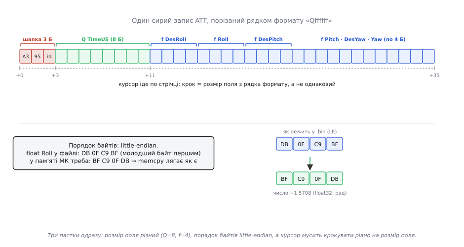

# ⚙️ Читач бортового `.bin`: від маркера до графіка

**Задача.** У статті ми домовилися, що бортовий лог самоописовий: попереду йдуть креслення `FMT`, за ними — потік даних, і одна програма розбирає будь-який лог, бо читає креслення й діє за ними. Скелет такого читача ми вже накидали — він відрізняв креслення від даних. Але скелет — не тіло. Між «розпізнав, що це запис `ATT`» і «маю на екрані криву `DesRoll` проти `Roll`» лежить уся справжня робота, і саме там ламаються перші парсери.

Поставимо конкретну ціль, до якої дійдемо в цьому проєкті: узяти сирий `.bin` з картки, **не знаючи наперед жодного поля**, вивчити з нього креслення, витягти з кожного запису `ATT` рівно два числа — **бажаний крен `DesRoll` і фактичний `Roll`**, зібрати їх у два паралельні масиви й віддати тому, хто малює графік. Це той самий графік «задане проти виміряного», яким у статті ми ставили діагноз здоров'ю [регулятора](book:algorithms/discrete-pid). Тільки тепер ми його не споглядаємо — ми його **народжуємо з байтів**.

Дорогою на нас чекають три пастки, і всі три реальні: креслення для запису **ще не трапилося**, а дані вже течуть; поля в одному записі **різного розміру** (час — вісім байтів, кути — по чотири); числа лежать у файлі **молодшим байтом уперед**, і якщо це проґавити, замість кута дістанеш сміття. Розберімо читача так, щоб кожну пастку побачити в мить, коли вона кусає.

**Ідея.** Уся конструкція тримається на одному розрізненні, яке треба зробити перш ніж писати перший рядок: є **креслення** (`FMT`) і є **дані**, і поводяться вони протилежно. Креслення ми **накопичуємо** — складаємо в таблицю за кодом типу, щоб мати під рукою, коли прийдуть відповідні дані. Дані ми **споживаємо на льоту** — розібрали, витягли потрібне, і байти більше не потрібні. Тобто читач — це не «розбери файл», а **машина з пам'яттю**: вона вчиться формату з тих самих байтів, які потім за цим форматом і читає.

Друга опора — **декодувати за рядком формату, а не за вкомпільованим знанням**. Спокуса новачка: «я ж знаю, що `ATT` — це час і шість кутів, напишу `struct` і накладу його на байти». Це працює рівно до першого логу з іншої прошивки, де в `ATT` додали поле чи змінили тип, — і твій `struct` тихо з'їде на пів байта, а кути перетворяться на марення. Правильний читач **не знає** заздалегідь, що таке `ATT`. Він читає рядок формату (`"Qffffff"` — з креслення!), символ за символом, і кожен символ каже: «наступне поле — таке-то, завширшки стільки-то байтів». Пастка розміру полів тут не збоку — вона **в самому серці** декодера: крок курсора по запису дорівнює розміру поточного поля, а не якомусь сталому числу.

Зберемо читача пошарово: спершу навчимо його впізнавати межу запису, тоді — вчити креслення, тоді — декодувати одне поле за форматом, і аж наприкінці — витягати іменоване поле й будувати масив для графіка. На кожному шарі спинимося там, де ховається пастка.

## Шар 1: де починається й де кінчається запис

Перше рішення визначає все: **як програма розуміє, де межа одного запису**. Файл — суцільна стрічка байтів без розділових ліній; треба самому знайти, де кінчається один запис і починається наступний. ArduPilot дає для цього дві опори, і обидві ми вже назвали в статті.

Перша — **маркер початку**: кожен запис відкривається двома сталими байтами `0xA3 0x95`. Це не випадкові числа — це домовлений «дзвіночок»: побачив цю пару — тут починається запис. (Значення закладені в прошивці як `HEAD_BYTE1 = 0xA3`, `HEAD_BYTE2 = 0x95` — це усталений факт, видно прямо в джерелі ArduPilot, файл `AP_Logger/LogStructure.h`.) Третій байт — **код типу** (`msgid`): яке саме це повідомлення. Отже, шапка запису — рівно три байти: маркер, маркер, тип.

Друга опора хитріша й варта окремої уваги. Звідки знати, **скільки байтів** займає весь запис, щоб перескочити до наступного маркера? Відповідь парадоксальна: з креслення. Саме `FMT` для кожного типу несе поле `length` — повну довжину запису в байтах, шапку враховуючи. Тобто **сам лог каже, якого розміру кожен запис** — але лише після того, як ти прочитав його креслення. Ось чому порядок «креслення попереду даних» не забаганка формату, а умова, без якої нема як навіть **дошагати** до наступного запису.

> 🔧 **Навіщо це.** Не покладайся на маркер як на єдиний спосіб знайти межу. Маркер `0xA3 0x95` — це страховка на випадок, коли потік збився (пошкоджений сектор картки, обірваний запис), а не основний навігатор. Основний — це `length` із креслення: прочитав тип, узяв довжину з таблиці, стрибнув рівно на стільки байтів уперед. Маркер лише **звіряє**: якщо після стрибка на місці маркера не `0xA3 0x95` — потік розсинхронізувався, і треба посканувати вперед до наступної валідної пари, перш ніж читати далі. Читач без цієї перевірки на першому ж битому байті починає розбирати сміття як дані й видає правдоподібну маячню — найгірший сорт помилки.

Заведемо структуру креслення й таблицю за кодом типу — рівно так, як у статті, але тепер із повним набором полів, що знадобляться далі:

```c
#include <stdint.h>
#include <string.h>
#include <stdlib.h>   // realloc для масивів, що ростуть
#include <stdio.h>

#define HEAD_BYTE1  0xA3
#define HEAD_BYTE2  0x95
#define LOG_FORMAT_MSG  0x80   // тип запису FMT (креслення) — 128

// Креслення одного типу повідомлення, витягнуте з FMT-запису.
typedef struct {
    uint8_t  type;        // код типу, який це креслення описує
    uint8_t  length;      // повна довжина ТАКОГО запису в байтах (з шапкою)
    char     name[5];     // "ATT", "GPS", "BAT" (+ '\0')
    char     format[17];  // рядок типів полів: "Qffffff" (+ '\0')
    uint8_t  n_fields;    // скільки полів (= довжина format)
} MsgFormat;

static MsgFormat fmt_table[256];   // креслення за кодом типу; 0 length = ще не знаємо
```

Структура `struct log_Format` у самому ArduPilot ширша — вона несе ще й `labels[64]` (імена полів через кому: `"TimeUS,DesRoll,Roll,..."`) — і ми до цих імен ще повернемось, бо саме вони дадуть нам витягти поле **за назвою**, а не за здогадним номером. Поки досить типів.

## Шар 2: вчимо креслення

Тепер серце машини з пам'яттю — **розпізнати креслення й покласти його в таблицю**. Приходить запис; дивимось на третій байт (код типу). Якщо це `0x80` — перед нами `FMT`, тобто креслення, і його треба **вивчити**, а не «використати». Якщо будь-що інше — це дані, і їх розбираємо за раніше вивченим кресленням.

Тут причаїлася **перша пастка**, і вона не теоретична. Що, як запис даних `ATT` прийде **раніше**, ніж його креслення `FMT ATT`? У справному лозі так не буває — ArduPilot скидає всі креслення на початку. Але лог буває обірваний: картку висмикнули посеред запису, живлення зникло, перші кілобайти побиті. Тоді ти легко почнеш читати з середини — з даних, чиє креслення лишилося позаду й тобі не трапиться. Наївний читач у цю мить бере з таблиці **порожній** запис (`length == 0`), вважає його справжнім кресленням і розбирає дані за форматом із самих нулів — тобто видає марення з упевненим виглядом. Лік простий і обов'язковий: **немає креслення — мовчки пропускаємо запис**, а не вигадуємо його.

```c
// Розібрати FMT-запис і покласти креслення в таблицю.
// Розкладка FMT (після 3 байтів шапки, тобто від rec+3):
//   +0  type    (1 байт)  — код типу, який описуємо
//   +1  length  (1 байт)  — повна довжина такого запису
//   +2  name    (4 байти) — ім'я, напр. "ATT\0"
//   +6  format  (16 байтів)— рядок типів, напр. "Qffffff"
//   +22 labels  (64 байти) — імена полів через кому (тут поки не беремо)
static void learn_format(const uint8_t *rec) {
    MsgFormat f;
    memset(&f, 0, sizeof f);
    f.type   = rec[3 + 0];
    f.length = rec[3 + 1];
    memcpy(f.name,   rec + 3 + 2, 4);   f.name[4]    = '\0';
    memcpy(f.format, rec + 3 + 6, 16);  f.format[16] = '\0';
    f.n_fields = (uint8_t)strlen(f.format);
    fmt_table[f.type] = f;              // тепер знаємо, як читати цей тип
}

// Головний диспетчер: FMT — вчимо, решту — віддаємо декодеру.
static void feed_record(const uint8_t *rec) {
    uint8_t msg_type = rec[2];          // rec[0],rec[1] = 0xA3,0x95

    if (msg_type == LOG_FORMAT_MSG) {   // це креслення — запам'ятовуємо
        learn_format(rec);
        return;
    }

    const MsgFormat *f = &fmt_table[msg_type];
    if (f->length == 0) return;         // ПАСТКА 1: креслення ще не бачили — пропуск
    decode_record(f, rec);              // розбираємо дані за кресленням
}
```

Зверни увагу: зсуви всередині `FMT` (`+2` для імені, `+6` для формату) — це не наша вигадка, а розкладка `struct log_Format` у джерелі ArduPilot: після трибайтної шапки йдуть `type`, `length`, тоді `name[4]`, тоді `format[16]`. Ми не «вгадуємо» ці числа — ми списуємо їх зі структури, яку прошивка й записала. У цьому вся суть: формат несе власну документацію, а креслення `FMT` — теж запис із фіксованою, наперед відомою розкладкою (інакше не було б із чого почати).

## Шар 3: декодуємо одне поле за його типом

Дійшли до ядра. Маємо запис даних і його креслення з рядком формату `"Qffffff"`. Треба пройти запис **поле за полем**, і на кожному кроці два питання: якого поле **типу** (як тлумачити байти) і якого **розміру** (на скільки посунути курсор далі). Обидва дає **один символ** формату. Тут живе **друга пастка — різні розміри полів**: після `Q` курсор мусить стрибнути на 8 байтів, після `f` — на 4, і сталого кроку немає в природі.

Спершу — таблиця «символ → розмір у байтах». Це прямий зліпок із коментаря в `AP_Logger/LogStructure.h` (усталений факт, звірено з джерелом); наведу робочу підмножину, якої вистачає для `ATT`, `GPS`, `BAT` і майже всього, що читають на практиці:

```
символ  тип C           байтів
  b     int8_t             1
  B     uint8_t            1
  h     int16_t            2
  H     uint16_t           2
  i     int32_t            4
  I     uint32_t           4
  f     float              4
  d     double             8
  q     int64_t            8
  Q     uint64_t           8
  n     char[4]            4
  N     char[16]          16
  Z     char[64]          64
  L     int32_t (1e7°)     4     ← широта/довгота, ціле × 10⁷
  M     uint8_t            1     ← код режиму польоту
  c     int16_t × 100      2     ← застаріле: значення = ціле / 100
  C     uint16_t × 100     2
  e     int32_t × 100      4
  E     uint32_t × 100     4
```

Два рядки з цієї таблиці — окрема історія, і саме в них ловляться навіть досвідчені. Тип `L` — це широта чи довгота, але **не** градуси: у файлі лежить ціле, помножене на 10⁷, тож `473994523` означає `47.3994523°`. А застарілі `c C e E` — це **масштабовані цілі**: щоб дістати справжнє значення, ділиш на 100. Колись кути в `ATT` писали саме як `c` (тому в старих логах `Roll` — це `ccc...`, ціле в сотих градуса); у сучасних прошивках перейшли на `f` — звичайний `float` у градусах. Ось чому **не можна** вкомпілювати «`Roll` — це float»: у логу п'ятирічної давнини він `c`, і той самий байтовий зсув треба тлумачити інакше. Рятує лише одне — **читати тип із формату щоразу**, а не з пам'яті. Це не педантизм; це різниця між «крен −1.2°» і «крен −120°» на тому самому записі.

Тепер **третя пастка — порядок байтів**. Числа ArduPilot пише **little-endian** (молодший байт першим) — так їх кладе процесор автопілота, і так вони лягають на картку. На більшості машин, де ти читатимеш лог (ПК, ARM-компаньйон), порядок теж little-endian, тож `memcpy` чотирьох байтів у `float` «випадково» спрацює. Але покладатися на цей збіг — значить писати читач, що зламається на першій big-endian системі мовчки й без сліду. Чесний декодер **збирає число з байтів явно**, зсувами, і тоді порядок у файлі зафіксований у коді, а не в удачі.


*Як формат ріже запис. Три байти шапки (`A3 95 id`), тоді поле `Q` — час, вісім байтів, тоді шість полів `f` по чотири. Курсор іде по стрічці кроком **у розмір поточного поля** (`+3 → +11 → +15 → …`), а не однаковими стрибками — це друга пастка. Праворуч унизу — третя: чотири байти `float` лежать у файлі молодшим уперед (`DB 0F C9 BF`), і зібрати їх треба у правильному порядку, інакше замість −1.5708 дістанеш сміття.*

Зберемо декодер поля. Він читає один символ формату, дістає з байтів число потрібного типу (складаючи little-endian явно), кладе результат у `double` (єдиний тип, що вміщає і `int64`, і `float` без утрат для наших цілей) і **повертає, на скільки посунувся курсор** — тобто розмір поля. Саме це повернене число й розв'язує пастку розмірів: викличник додає його до курсора, і той стає рівно на початок наступного поля:

```c
// Прочитати little-endian ціле шириною n байтів (n ≤ 8) як беззнакове.
static uint64_t rd_uN(const uint8_t *p, int n) {
    uint64_t v = 0;
    for (int i = 0; i < n; i++)
        v |= (uint64_t)p[i] << (8 * i);   // байт [0] — молодший: явний LE
    return v;
}

// Декодувати ОДНЕ поле типу `t` з байтів `p`.
// Значення кладемо в *out (як double); повертаємо РОЗМІР поля в байтах
// (= крок курсора). Так пастка різних розмірів розв'язується сама собою.
static int decode_field(char t, const uint8_t *p, double *out) {
    switch (t) {
    case 'b': *out = (double)(int8_t) p[0];              return 1;
    case 'B': *out = (double)(uint8_t)p[0];              return 1;
    case 'M': *out = (double)(uint8_t)p[0];              return 1;
    case 'h': *out = (double)(int16_t) rd_uN(p, 2);      return 2;
    case 'H': *out = (double)(uint16_t)rd_uN(p, 2);      return 2;
    case 'i': *out = (double)(int32_t) rd_uN(p, 4);      return 4;
    case 'I': *out = (double)(uint32_t)rd_uN(p, 4);      return 4;
    case 'q': *out = (double)(int64_t) rd_uN(p, 8);      return 8;
    case 'Q': *out = (double)(uint64_t)rd_uN(p, 8);      return 8;
    case 'L': *out = (double)(int32_t) rd_uN(p, 4) / 1e7; return 4;  // 1e7° → °
    case 'f': {                                          // 4 байти → float
        uint32_t bits = (uint32_t)rd_uN(p, 4);
        float fv; memcpy(&fv, &bits, 4);                 // біти → float
        *out = (double)fv;                               return 4;
    }
    case 'd': {                                          // 8 байтів → double
        uint64_t bits = rd_uN(p, 8);
        double dv; memcpy(&dv, &bits, 8);
        *out = dv;                                       return 8;
    }
    // застарілі масштабовані: значення = ціле / 100
    case 'c': *out = (double)(int16_t) rd_uN(p, 2) / 100.0; return 2;
    case 'C': *out = (double)(uint16_t)rd_uN(p, 2) / 100.0; return 2;
    case 'e': *out = (double)(int32_t) rd_uN(p, 4) / 100.0; return 4;
    case 'E': *out = (double)(uint32_t)rd_uN(p, 4) / 100.0; return 4;
    // текстові поля — пропускаємо, повертаючи їхній розмір (курсор іде далі)
    case 'n': return 4;
    case 'N': return 16;
    case 'Z': return 64;
    default:  return 0;   // невідомий символ — сигнал «щось не так»
    }
}
```

Придивись, як тут разом працюють обидві пастки й обидва їхні лікування. Порядок байтів схований у `rd_uN`: цикл `p[i] << (8*i)` явно каже «байт нуль — молодший», і код тепер читає little-endian **на будь-якій машині**, бо не питає, який порядок у неї свій. А розмір поля повертається назовні числом `return N`, тож викличник ніколи не «здогадується» про крок — він бере його з декодера. Трюк `memcpy` для `float`/`double` — це коректний спосіб перетлумачити 32 (чи 64) біти як число з комою, не порушуючи правил мови (пряме приведення покажчика `(float*)` тут — невизначена поведінка через порушення строгого аліасингу; `memcpy` компілятор усе одно згорне в один хід).

## Шар 4: пройти запис і витягти поле за назвою

Маємо декодер одного поля — розгорнемо його на **весь запис**. Ідемо по рядку формату символ за символом; курсор по байтах запису починається одразу після трибайтної шапки й після кожного поля зсувається рівно на повернений розмір. Так пастка різних розмірів залишається позаду остаточно: курсор ведений форматом, а не припущенням.

Але нам потрібне не «всі поля», а **конкретні** — `DesRoll` і `Roll`. Як дістатися до `n`-го поля за назвою, коли креслення несе лише рядок типів? Тут і згодяться `labels` — той рядок імен через кому (`"TimeUS,DesRoll,Roll,DesPitch,Pitch,DesYaw,Yaw"`), який ми в шарі 2 відклали на потім. Ім'я поля стоїть на тій самій позиції в `labels`, що й тип у `format`: третій тип у форматі описує третє ім'я в мітках. Отже: розбив `labels` комами, знайшов позицію потрібної назви — і це номер поля, яке треба видекодувати.

Щоб не морочитися з розбором `labels` щоразу, зробимо просту функцію: «дай значення поля з іменем `field` із цього запису». Вона пройде поля по порядку, рахуючи їх, і поверне те, чиє ім'я збіглося. Для наочності спершу навчимося брати поле **за номером** (декодер уже все для цього має), а тоді номер знайдемо за назвою.

```c
// Значення k-го поля (0-based) запису rec за кресленням f.
// Повертає 1 і кладе значення в *out; 0 — якщо поля з таким номером нема.
static int field_by_index(const MsgFormat *f, const uint8_t *rec,
                          int k, double *out) {
    const uint8_t *p = rec + 3;          // курсор: одразу за шапкою
    for (int i = 0; f->format[i]; i++) {
        double v;
        int sz = decode_field(f->format[i], p, &v);
        if (sz == 0) return 0;           // невідомий тип — далі йти наосліп не можна
        if (i == k) { *out = v; return 1; }
        p += sz;                         // крок = розмір поля (ПАСТКА 2 знята)
    }
    return 0;
}

// Номер поля з іменем `name` у рядку labels ("A,B,C") — або -1, якщо немає.
static int index_of_label(const char *labels, const char *name) {
    int idx = 0;
    const char *s = labels;
    size_t nlen = strlen(name);
    while (*s) {
        const char *comma = strchr(s, ',');
        size_t len = comma ? (size_t)(comma - s) : strlen(s);
        if (len == nlen && strncmp(s, name, nlen) == 0)
            return idx;                  // збіг рівно на межах поля
        if (!comma) break;
        s = comma + 1;
        idx++;
    }
    return -1;
}
```

Зверни увагу на дрібницю, що коштує годин відлагодження: у порівнянні імені ми звіряємо **і довжину** (`len == nlen`), а не лише перші літери. Без цього пошук `"Roll"` радісно знайшов би `"DesRoll"` чи `"RollRate"` — бо `strncmp` на чотири літери сказав би «збіг». Іменоване поле треба матчити **точно, на межах коми**, інакше витягнеш не те число й не помітиш.

Тепер `labels` нам таки потрібні в таблиці. Доповнимо `MsgFormat` полем `char labels[65]` і зчитаймо його в `learn_format` (зсув `+22` після шапки — за розкладкою `struct log_Format`):

```c
// (додати до MsgFormat)
//   char labels[65];   // "TimeUS,DesRoll,Roll,..." (+ '\0')
// (додати в learn_format, після format)
//   memcpy(f.labels, rec + 3 + 22, 64);  f.labels[64] = '\0';
```

## Шар 5: фільтр за типом і масив задане-проти-виміряного

Лишився останній крок — той, заради якого все й затівалося. Ми хочемо **не всі** записи, а лише `ATT`, і з кожного — рівно `DesRoll` та `Roll`, зведені в два паралельні масиви для графіка. Це і є **фільтрація за типом повідомлення**: у диспетчері `feed_record` ми вже маємо код типу; лишається порівняти ім'я креслення з `"ATT"` і, якщо збіг, витягти дві потрібні величини.

Зберемо результат у простий накопичувач — три масиви (час, задане, виміряне), що ростуть у міру читання. Час беремо теж (поле `TimeUS`), бо графік «задане проти виміряного» осмислений лише вздовж часу: нам треба бачити, **коли** саме `Roll` відстав від `DesRoll`.

```c
// Накопичувач кривих ATT для графіка.
typedef struct {
    double  *t;         // час, с (з TimeUS / 1e6)
    double  *des;       // DesRoll
    double  *act;       // Roll
    size_t   n, cap;
} AttSeries;

static void series_push(AttSeries *s, double t, double des, double act) {
    if (s->n == s->cap) {                       // місця нема — подвоюємо
        s->cap = s->cap ? s->cap * 2 : 1024;
        s->t   = realloc(s->t,   s->cap * sizeof *s->t);
        s->des = realloc(s->des, s->cap * sizeof *s->des);
        s->act = realloc(s->act, s->cap * sizeof *s->act);
    }
    s->t[s->n] = t; s->des[s->n] = des; s->act[s->n] = act;
    s->n++;
}

// Дістати з одного запису ATT пару (DesRoll, Roll) і час, покласти в серію.
static void collect_att(const MsgFormat *f, const uint8_t *rec, AttSeries *s) {
    int i_t   = index_of_label(f->labels, "TimeUS");
    int i_des = index_of_label(f->labels, "DesRoll");
    int i_act = index_of_label(f->labels, "Roll");
    if (i_t < 0 || i_des < 0 || i_act < 0) return;   // не той ATT — тихо мимо

    double t_us, des, act;
    if (field_by_index(f, rec, i_t,   &t_us) &&
        field_by_index(f, rec, i_des, &des)  &&
        field_by_index(f, rec, i_act, &act))
        series_push(s, t_us / 1e6, des, act);        // мкс → с
}
```

Тепер зшиймо все в диспетчер. Фільтрація за типом — це буквально одне порівняння імені; усе інше вже написано пошарово нижче:

```c
static AttSeries g_att;   // сюди складаємо криві ATT

static void feed_record(const uint8_t *rec) {
    uint8_t msg_type = rec[2];

    if (msg_type == LOG_FORMAT_MSG) { learn_format(rec); return; }

    const MsgFormat *f = &fmt_table[msg_type];
    if (f->length == 0) return;                 // креслення ще нема — пропуск

    if (strcmp(f->name, "ATT") == 0)            // ← ФІЛЬТР за типом повідомлення
        collect_att(f, rec, &g_att);
    // інші типи (GPS, BAT, VIBE…) — тут можна додати свої збирачі
}
```

Ось і все ядро. Що показово: **фільтр за типом виявився тривіальним** — `strcmp(f->name, "ATT")`, — і це не випадковість, а плід усієї попередньої дисципліни. Бо ми не знали `ATT` наперед, а вивчили його з креслення, декодер поля веде себе за форматом, а поле беремо за назвою через `labels`, — то додати збирача для `GPS` чи `BAT` тепер справа п'яти рядків: ще один `strcmp`, ще один `collect_*` із потрібними іменами полів. Читач вийшов **розширюваним**, бо жодне знання про конкретний тип не зашите в код — усе тече з логу.

## Шар 6: обхід файлу від маркера до маркера

Лишилося подати записи в диспетчер — тобто пройти файл, вихоплюючи записи один за одним. Тут і замикаються всі опори шару 1: маркер знаходить початок, а `length` із креслення каже, де кінець. Поки креслення для типу ще нема (сам `FMT` чи побитий початок), ступаємо обережно — маркером.

```c
// Пройти сирий буфер лога довжиною len, згодовуючи записи диспетчеру.
static void parse_log(const uint8_t *buf, size_t len) {
    size_t i = 0;
    while (i + 3 <= len) {
        // 1) синхронізація: стоїмо на маркері?
        if (buf[i] != HEAD_BYTE1 || buf[i + 1] != HEAD_BYTE2) {
            i++;                        // ні — повземо вперед, шукаючи маркер
            continue;
        }
        uint8_t type = buf[i + 2];

        // 2) яка довжина цього запису?
        size_t rec_len;
        if (type == LOG_FORMAT_MSG)
            rec_len = 3 + 2 + 4 + 16 + 64;   // FMT — фіксовані 89 байтів
        else if (fmt_table[type].length)
            rec_len = fmt_table[type].length; // з вивченого креслення
        else {
            i++;                        // креслення ще нема — крок на байт і далі
            continue;
        }

        if (i + rec_len > len) break;   // хвіст обірваний — виходимо

        feed_record(buf + i);           // цілий запис — у диспетчер
        i += rec_len;                   // стрибок рівно на довжину запису
    }
}
```

Три рішення в цьому циклі варті слова. По-перше, `FMT` має **фіксовану** довжину `3 + 2 + 4 + 16 + 64 = 89` байтів — бо це креслення для інших, і його власна розкладка мусить бути відома **до** будь-якого читання логу (яйце, з якого вилуплюється решта). По-друге, коли креслення для типу ще нема, ми **не стрибаємо** на здогадну довжину, а повземо на один байт і шукаємо наступний маркер — бо стрибок наосліп завів би нас у нікуди. По-третє, після кожного цілого запису ми йдемо рівно на `rec_len` — і на початку наступного **знову перевіримо маркер** (перша галузка циклу): якщо там не `0xA3 0x95`, потік десь збився, і ми м'яко пересинхронізуємось повзанням, замість розбирати сміття.

> 🔧 **Навіщо це.** Обхід «перевір маркер → візьми довжину → стрибни → знову перевір маркер» — це не перестраховка, а те, що відрізняє читач, придатний для **реальних**, часом побитих логів, від демонстраційного. Картки псуються, живлення зникає посеред запису, останній запис майже завжди обірваний. Читач, що сліпо довіряє довжині й ніколи не звіряє маркер, на першому ж збої з'їжджає й видає правдоподібні, але брехливі числа — а брехливий лог гірший за відсутній, бо веде розслідування хибним слідом.

Тепер увесь конвеєр в одну картину: `parse_log` іде файлом, вихоплюючи записи маркером і довжиною; кожен запис `feed_record` або **вчить** (якщо `FMT`), або **фільтрує** за іменем і **збирає** (`ATT` → `collect_att`); `collect_att` знаходить поля `TimeUS`, `DesRoll`, `Roll` за назвою в `labels`, декодує кожне за його типом із формату (`field_by_index` → `decode_field`, з правильним розміром і порядком байтів) і кладе трійку в `AttSeries`. На виході — три паралельні масиви, готові лягти на графік «задане проти виміряного» — той самий, яким у статті ми судили здоров'я [регулятора](book:algorithms/discrete-pid): де `act` пиляє навколо `des` — забагато різкості, де ліниво тягнеться — замало, де розбіглися врізнобіч — зрив.

## Складність і пастки: що ламається насправді

Читач вийшов невеликий, і в цьому підступ: кожен його шматок захищає від конкретної біди, і варто прибрати захист — усе тримається рівно до першого «неправильного» логу. Зберемо пастки разом, бо саме на них спіткаються перші парсери.

**Креслення ще не бачили.** Найпідступніша, бо на *твоєму* лозі її може й не бути — креслення на початку, ти читаєш із початку, усе гаразд. Вона вистрелить на чужому лозі, на обрізаному, на прочитаному з середини. Захист — `if (f->length == 0) return;` і повзання-до-маркера в обході. Прибереш — читач почне тлумачити дані за порожнім кресленням і видасть марення без жодного натяку, що щось не так.

**Різні розміри полів.** Спокуса накласти `struct` на байти й прочитати все одним махом. Працює на одній прошивці й розсипається на іншій, де в повідомленні додали поле чи змінили тип, — `struct` з'їжджає, і всі поля після зміни стають сміттям. Захист — вести курсор **за форматом**: крок дорівнює розміру символа, а розмір повертає сам декодер. Це не повільніше на око, зате читає **будь-яку** версію повідомлення.

**Порядок байтів.** Найтихіша пастка: на твоїй little-endian машині `memcpy` чотирьох байтів у `float` спрацює «випадково», і читач здаватиметься правильним — доки хтось не запустить його там, де порядок інший, і кути мовчки не перетворяться на маячню. Захист — збирати число з байтів **явно** (`p[i] << 8*i`), фіксуючи little-endian у коді, а не в удачі платформи.

**Масштаб і тип, зашиті в голову.** Близький родич другої пастки, але про значення, не про розмір. `Roll` у новому лозі — `f` (градуси), у старому — `c` (сотні градуса); широта — `L` (ціле × 10⁷), а не градуси. Вкомпілюєш «`Roll` — float, ділити ні на що» — і на старому лозі дістанеш крен у сто разів більший, а на `L` без ділення — широту в десятки мільйонів. Захист один: **тип і масштаб бери з формату щоразу**, ніколи з пам'яті.

**Збіг імен полів.** Дрібниця, що коштує годин: `strncmp("DesRoll", "Roll", 4)` скаже «збіг», і пошук `Roll` витягне `DesRoll`. Захист — матчити ім'я **точно, на межах коми**, звіряючи й довжину.

Спільна нитка всіх п'яти — **не знати наперед**. Щойно читач «здогадується» про поле, розмір, тип, порядок чи масштаб замість того, щоб прочитати їх із логу, він стає крихким: працює на тому лозі, під який його писали, і бреше на всякому іншому. Самоописовий формат дав нам усе, щоб не гадати, — і єдина дисципліна, яка робить читач надійним, це щоразу **питати лог**, а не власну пам'ять. Тоді та сама півсотня рядків читає й учорашній коптер, і завтрашній ровер, і лог із прошивки, якої ти ще в очі не бачив.
