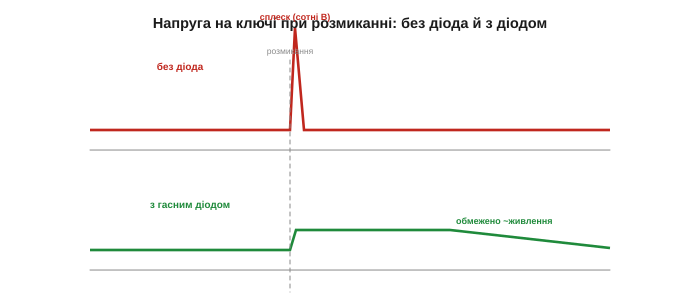

# Захист: flyback для котушки і від зворотної полярності

Ще одна важлива роль діода — **вартовий**. Його однобічність ідеально надається для захисту: діод пропускає те, що має текти, і блокує (чи відводить) те, що загрожує. Розгляньмо дві класичні вартові служби: приборкання небезпечного викиду котушки й захист схеми від переплутаної полярності живлення. Обидві спираються на просту річ — діод пускає струм лише в один бік. Жодної нової фізики тут не буде — лише три розумні способи поставити такий клапан так, щоб він беріг сусідів.

### Проблема: «брикання» котушки

Котушка ненавидить **раптову зміну** струму: різке розмикання породжує [небезпечний кидок напруги](topic:electronics/inductor-kickback). Поки крізь неї тече струм, у магнітному полі [запасено енергію](topic:electronics/inductor-energy). Різко розімкніть коло — і поле, спадаючи, спробує **втримати** струм, наводячи на котушці величезний сплеск напруги (V = L·di/dt, а di/dt при різкому розмиканні гігантське). Цей сплеск може сягати сотень вольтів — і він б'є по тому, хто розмикав: пропалює іскрою контакти реле, пробиває транзисторний ключ.

Куди ж подітися енергії, що була в полі котушки? Закон збереження невблаганний — вона мусить кудись піти. Якщо шляху немає, котушка «продавлює» його сама, піднімаючи напругу доти, доки десь не проскочить іскра або не проб'ється транзистор. Саме тому в старих дзвінках і реле тріщала іскра на контактах. І що **швидше** розмикання (а транзистор робить це за мікросекунди), то вищий сплеск — бо di/dt тим більше, чим різкіший обрив.

*Поки ключ замкнений, крізь котушку тече струм. Розімкнули — поле спадає й наводить різкий викид напруги (V = L·di/dt), що б'є іскрою по контактах чи пробиває транзистор. Що швидше розмикання, то вищий сплеск.*

### Гасний (flyback) діод

Розв'язок елегантний: під'єднаймо діод **паралельно котушці**, у зворотному напрямку щодо живлення. Поки все нормально й струм тече від джерела, діод замкнений — він просто стоїть і нічого не робить. (Чому замкнений? Бо плюс живлення стоїть на його катоді — він [зворотно зміщений](topic:electronics/diode-bias) і не відбирає струму в навантаження.) Та щойно ключ розмикається й напруга на котушці **перевертається**, цей діод опиняється у прямому напрямку — відкривається й **замикає струм котушки на себе**. Тепер струм не обривається різко, а плавно дотікає по колу «котушка → діод», згасаючи на тепло. Замість сотень вольтів сплеску — лише ~0.7 В на відкритому діоді.

Куди тепер дітися струмові? У петлю крізь діод. Котушка на мить стає джерелом і жене свій струм по колу «котушка → діод → котушка», а той помалу згасає, віддаючи запасену енергію на нагрів (швидкість згасання задає відношення L/R — [стала часу RL-кола](topic:electronics/rl-time-constant)). Напруга ж на ключі більше не злітає до небес: вона обмежена живленням плюс ті ~0.7 В діода. Для відчуття масштабу: реле на 12 В без гасного діода може видати кількасот вольтів сплеску — більш ніж досить, щоб пробити транзистор; із діодом напруга на ключі ледь перевищить ті 12 В. Різниця між «згорів» і «працює» — в одній копійчаній деталі. Працює тут та сама однобічність, що й у [випрямлячі](topic:electronics/rectification): діод дає струмові шлях лише в один бік — тут саме в той, яким котушка хоче «доштовхати» свій струм.

*Діод паралельно котушці (зворотно щодо живлення). У нормі він замкнений. Коли ключ розмикається, напруга котушки перевертається й відкриває діод — струм котушки замикається в петлю «котушка → діод» і плавно згасає, а не б'є сплеском. Сплеск «зрізано» до ~0.7 В.*

Цей діод має багато імен — гасний, зворотний, flyback (англ. *fly back* — «летіти назад», бо струм завертає назад у котушку), freewheeling, «catch» — але роль одна: дати струму котушки безпечний шлях, коли основний шлях обірвано. Без нього транзистор, що керує реле чи мотором, живе недовго.

Зверніть увагу на елегантність: у нормальному режимі гасний діод **нічого не робить** — стоїть зворотно й не заважає, прокидаючись лише в ту єдину небезпечну мить розмикання. Ви чули його роботу безліч разів, не знаючи: тихе «клац» реле без тріску й іскри — це гасний діод акуратно прибирає сплеск, а реле без діода клацає різкіше й з часом випалює собі контакти. Найчастіше такий діод бачать поруч із реле й моторами в платах автоматики, іграшок, побутової техніки — скрізь, де транзистор керує чимось намотаним. Помітили на платі діод упритул до реле — це майже напевно він.

*Напруга на ключі при розмиканні. Без діода — гострий високий сплеск (небезпека). З гасним діодом — напруга обмежена трохи вище живлення, а струм котушки плавно згасає крізь діод. Та сама котушка, та сама комутація — різниця лише в одному діоді.*

Зауважте, наскільки **низько** діод тримає сплеск — лише трохи вище напруги живлення (на своє падіння). Транзисторові-ключу більше й не треба: таку напругу він спокійно витримує, тоді як неприборканий сплеск пробив би його миттєво.

> 🔧 **Навіщо це.** Правило, яке рятує безліч схем: **будь-яку індуктивну котушку, якою керує транзистор** — реле, електромагніт, соленоїд, моторчик — обов'язково шунтують гасним діодом (катодом до плюса). Це копійчана деталь, що рятує дорогий ключ. У швидких схемах ([ШІМ](root:embedded/pwm-power-control)) сюди ставлять **швидкий** діод або [Шотткі](root:embedded/zener-schottky), щоб він устигав за перемиканнями.

Є й компроміс. Гасний діод робить згасання струму **повільним** — а для реле це означає, що воно трохи довше відпускає. Коли потрібне швидке відпускання (чи швидке перемикання), замість простого діода ставлять діод **із Зенером** або RC-снабер: вони гасять спалах енергії швидше, але ціною вищого (хоч і досі безпечного) сплеску. Класичний вибір: м'якість проти швидкості.

### Захист від зворотної полярності

Друга вартова служба — боронити схему від **переплутаного** живлення. Підключіть батарейку навпаки — і неправильна полярність може миттю спалити чутливу електроніку. Діод і тут стає в пригоді.

Найпростіше — поставити діод **послідовно** з живленням. Якщо полярність **правильна**, діод відкритий і пропускає струм (ціною свого падіння ~0.7 В; за 5-вольтового живлення Шотткі лишив би схемі ~4.7 В). Якщо **переплутана** — діод замкнений, струму немає, схема ціла. Один діод — і жодна неуважність із батарейкою не зашкодить.

Чому зворотна полярність така згубна? Бо багато компонентів її не терплять: [електролітичні конденсатори](topic:electronics/capacitor-parasitics) при зворотній напрузі здуваються чи вибухають, мікросхеми пропускають струм «не туди» й перегріваються. Одна мить неправильно вставленої батарейки — і пристрій мертвий, причому шкода буває миттєвою й непоправною: поки помітиш запах диму, уже пізно. Послідовний діод робить таку помилку просто **неможливою**: немає правильної полярності — немає струму, а отже, і шкоди.

*Діод послідовно з живленням. Плюс на анод — діод відкритий, схема працює (мінус ~0.7 В). Переплутали полярність — діод замкнений, струму немає, схема в безпеці. Найпростіший захист «від дурня».*

*Ліворуч — батарейку під'єднано правильно: діод проводить, пристрій живиться. Праворуч — навпаки: діод блокує, струм не тече, ніщо не горить. Захист коштує одного діода й невеликого падіння напруги.*

Ціна — те саме падіння ~0.7 В, що на малому живленні шкода втрачати. Тому замість звичайного діода часто беруть **[Шотткі](root:embedded/zener-schottky)** (падіння ~0.3 В), а в економних пристроях — спеціальний «ідеальний діод» на [польовому транзисторі](topic:electronics/field-control) (майже без втрат). Існує й інший підхід — діод **паралельно** входу, зворотно: при правильній полярності він мовчить, а при переплутаній — замикає вхід і спалює запобіжник, рятуючи схему ціною запобіжника. Такий захист стоїть усюди, де живлення вставляє людина: в автомобільній електроніці (акумулятор переплутати легко), у приладах на батарейках, у роз'ємах живлення. Інженери звуть це «захистом від дурня» — і не з погорди, а тому, що помиляються всі, а згоріла плата нікому не потрібна.

> 🔧 **Навіщо це.** Дешевий послідовний діод (краще Шотткі, щоб не втрачати ~0.7 В) на вході живлення — звичка, що рятує пристрої від «вставив батарейку навпаки». Там, де втрата напруги критична (живлення від однієї-двох батарейок), ставлять «ідеальний діод» — [польовий транзистор](topic:electronics/field-control), що відкривається лише за правильної полярності з майже нульовим падінням. А найгрубіший масовий варіант — діод-«лом» із запобіжником.

### Інші вартові ролі

Тим самим прийомом діоди стережуть і **сигнальні** входи. Пара діодів від лінії до плюсової й мінусової шин **обмежує** будь-який викид: якщо напруга на вході підскочила вище живлення, верхній діод відведе надлишок у плюсову шину; якщо впала нижче нуля — нижній підтягне до мінусової. Так входи мікросхем боронять від статики й перенапруг. Такі діоди й звуть **обмежувальними** (*clamp*) — бо вони «затискають» напругу в дозволених межах. Для сильніших ударів додають [Зенер чи супресор](root:embedded/zener-schottky).

До речі, у самих мікросхемах такі обмежувальні діоди вже **вбудовані** на кожному виводі — це перша лінія оборони від статичної електрики (того клацання, коли торкаєшся дверної ручки взимку). Та вони кволенькі, тож для серйозних ударів (довгі кабелі, промислові входи) ставлять зовнішні Зенери чи супресори. Принцип незмінний: дати небезпечному струмові безпечний шлях **повз** чутливе.

Як це працює в деталях? У нормі сигнал гуляє між нулем і живленням, обидва діоди замкнені — їх ніби й немає. Та щойно вхід вискочить за межі, відповідний діод відкриється й «притисне» його назад до шини, узявши удар на себе. Статичний розряд блискавично швидкий, тож тут потрібні **дуже швидкі** діоди — і вбудовані захисні структури мікросхем саме такі. Власне, кожен раз, коли ви безкарно встромляєте USB-флешку чи торкаєтесь роз'єму, вас рятують ці непомітні діоди-вартові всередині чипів.

*Два діоди від входу до шин «+» і «−». У нормі обидва замкнені. Викид вище живлення — відкривається верхній і відводить надлишок угору; нижче нуля — нижній підтягує до мінуса. Вхід завжди лишається в безпечних межах. Це той самий діод-вартовий, лише на сторожі сигналу.*

---
