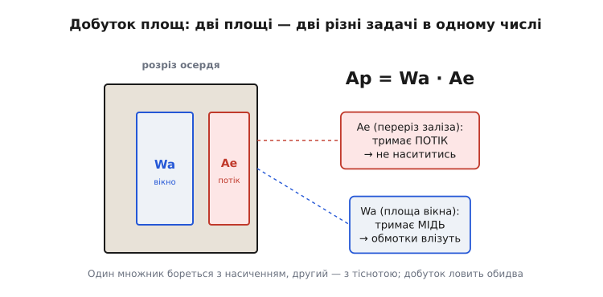
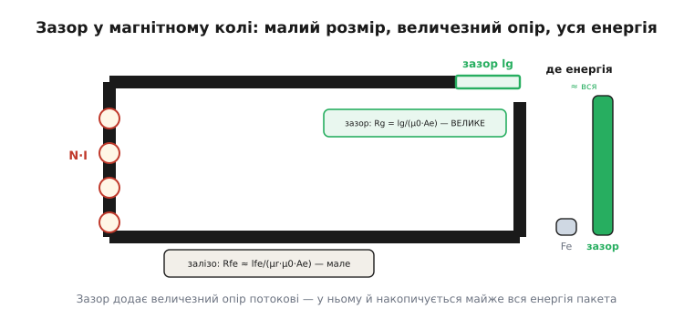
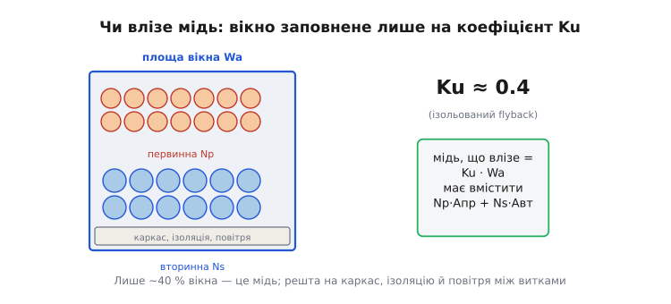

# 🧮 Математика осердя: добуток площ і повітряний зазор

У темі ми тричі впёрлися в одну й ту саму стіну й тричі її обійшли обіцянкою «повну викладку — в математиці осердя». Перший раз — коли треба було вибрати **саме осердя**: ми просто взяли «невелике феритове з Ae = 20 мм²», наче воно впало з неба. Другий — коли рахували зазор: дістали AL ≈ 161 нГн/виток² і сказали, що **фізичну довжину** зазору з нього виводять через reluctance «окремо». Третій — наприкінці, коли пообіцяли, що мідь обмоток **влізе** у вікно, бо це «перевіряє той самий метод добутку площ». Три обіцянки — і всі три ведуть сюди.

Виявляється, за всіма трьома стоїть **одна** величина — **добуток площ** (англ. *area product*), Ap = Wa·Ae: площа вікна під обмотки, помножена на площу перерізу заліза. Одне число, яке одночасно відповідає на питання «не насититься?» і «мідь влізе?». Звідки воно береться, чому саме добуток, а не сума чи щось хитріше, як із нього падає розмір осердя й довжина зазору — про це вся вставка. Ми не приймемо Ap на віру як «інженерну формулу з довідника»; ми **зберемо** його з фізики, яку вже знаємо з теми, і побачимо, що інакше й бути не могло.

> 🔧 **Навіщо це.** Без Ap вибір осердя — це тицяння пальцем: узяв навмання, намотав, перевірив на насичення, не влізло — узяв більше, повторив. Ap робить вибір **прямим**: рахуєш одне число з ТЗ і одразу йдеш у каталог осердь по перше, чий Ap не менший. Це різниця між «трьома ітераціями з паяльником» і «однією формулою до намотування».

## Означення: одне число, дві площі, дві задачі

Спершу — що це взагалі за звір і чому він **добуток**. Уявімо осердя в розрізі. У ньому є дві принципово різні площі, і вони міряють дві принципово різні речі.


*Дві площі осердя. **Ae** — переріз заліза, яким іде магнітний потік; чим він більший, тим менша густина потоку за того самого струму, тобто тим далі до насичення. **Wa** — площа вікна, порожнього простору, куди лягають витки міді; чим вона більша, тим товщий чи численніший провід туди влізе. Дві площі — два цілком різні обмеження: одне магнітне, друге геометричне. Добуток Ap = Wa·Ae зв'язує їх в одне число, бо, як побачимо, обидва обмеження тиснуть на нього **разом**.*

**Добуток площ** Ap осердя — це переріз заліза Ae, помножений на площу вікна Wa:

```
Ap = Wa · Ae        [одиниця: м⁴, на практиці см⁴ або мм⁴]
```

Розмірність — площа в квадраті, метр у четвертому степені; звучить дивно, бо це не «площа» й не «об'єм», а саме **добуток двох площ**, штучна величина. Але вона страшенно зручна, і ось чому. Виробник осердя дає в паспорті і Ae, і Wa (інколи прямо Ap); це властивість **заліза**, відома до того, як ми щось намотали. А з іншого боку — як зараз виведемо — той самий Ap **вимагається** нашою задачею: енергією пакета, межею насичення, густиною струму. Дві сторони сходяться на одному числі, тож вибір осердя стає звіркою: **Ap, який осердя має ≥ Ap, який задача просить**. Усе.

Чому саме **добуток**, а не, скажімо, окремо «треба Ae не менше такого» і «треба Wa не менше такого»? Бо ці дві вимоги **не незалежні** — вони обидві впираються в кількість витків, а витки в'яжуть Ae з Wa в одну петлю. Зараз ми цю петлю розплутаємо й побачимо, як вона сама собою згортається в добуток.

## Інтуїція: чому насичення й тіснота — це одна петля

Перш ніж інтегрувати й підставляти, зловімо суть на пальцях, бо саме тут ховається краса Ap.

Згадаймо дві формули з теми. Перша — про **насичення**: щоб потік на піку струму не перейшов Bнас, треба досить витків:

```
Np = Lпр·Iпік / (Bнас·Ae)      ← з теми, «число третє»
```

Читається так: малий переріз заліза Ae → мало місця для потоку → щоб не насититись, треба **багато** витків (розмазати потік по витках). Тобто **вузьке залізо вимагає численної обмотки**.

Друга — про **мідь**: кожен виток має переріз дроту Aпр (його диктує діючий струм), і всі Np витків мають улягтися у вікно:

```
Np · Aпр ≤ Ku · Wa            ← мідь має влізти, Ku — частка вікна під мідь
```

Читається так: багато витків → багато міді → потрібне **велике** вікно Wa.

А тепер з'єднаймо ці два прочитання в один ланцюжок — і пастка стане очевидною. **Вузьке залізо вимагає багато витків** (перша формула) → **багато витків вимагає велике вікно** (друга формула). Тобто маленький Ae **штовхає** Wa вгору. Не можна просто взяти осердя з крихітним залізом і крихітним вікном: брак заліза ти **оплачуєш** надлишком вікна, і навпаки. Дві площі зв'язані витками в одну петлю, і ця петля каже: важить не кожна площа окремо, а **наскільки одна компенсує брак іншої** — тобто їхній **добуток**.

Ось чому Ap = Wa·Ae, а не Wa та Ae поодинці. Добуток — це і є математична форма фрази «брак однієї площі оплачуєш надлишком другої». Маленьке осердя з будь-яким перекосом площ просто не матиме потрібного **добутку** — і провалить або насичення, або вкладання міді. Залишилось зробити це числом.

## Формальний апарат: виводимо Ap з енергії пакета

Тепер чесне виведення, від першопричини, без жодної формули «з довідника». Мета — отримати, **скільки** Ap вимагає наша задача. Підемо тим самим шляхом, що петля вище, лише акуратно з величинами.

**Крок 1 — потік у залізі обмежений насиченням.** Магнітний потік крізь переріз Ae — це B·Ae. На піку струму густина потоку B сягає робочого максимуму Bнас, тож пікове зчеплення потоку з усією обмоткою (англ. *flux linkage*) дорівнює:

```
Np · B · Ae ≤ Np · Bнас · Ae
```

Ліва частина — це ще й Lпр·Iпік (означення індуктивності: зчеплення потоку = L·I). Прирівнявши, дістаємо рівно «число третє» теми, але запишемо його як **межу на добуток Np·Ae**:

```
Lпр · Iпік = Np · Bнас · Ae        ⟹        Np · Ae = Lпр·Iпік / Bнас      ... (I)
```

Запам'ятаймо (I): **залізо** диктує добуток «витки × переріз».

**Крок 2 — мідь обмежена вікном.** Кожен виток первинної несе діючий струм Iпр(rms) і має переріз дроту, що дорівнює цьому струму, поділеному на допустиму **густину струму** J (скільки ампер на квадратний міліметр ми дозволяємо гнати, не перегріваючи мідь):

```
переріз одного витка:  Aпр = Iпр(rms) / J
```

Усі Np витків займають мідь Np·Aпр, і вона має вкластися в ту частину вікна, що відведена під мідь, — це **Ku·Wa**, де Ku (англ. *window utilization factor*) — частка вікна, реально зайнята міддю (решта — каркас, ізоляція, повітря між круглими дротами). Для спрощення зараз рахуємо так, наче все вікно під одну первинну; вторинну докинемо за мить через коефіцієнт. Тоді:

```
Np · Aпр = Ku · Wa        ⟹        Np · Iпр(rms)/J = Ku · Wa
⟹  Np · Iпр(rms) = Ku · J · Wa        ... (II)
```

Запам'ятаймо (II): **вікно** диктує добуток «витки × струм».

**Крок 3 — перемножуємо дві межі, і витки зникають.** Ось ключовий хід, заради якого все й затівалося. У нас дві рівності: (I) в'яже Np·Ae, (II) в'яже Np·Iпр(rms). Перемножмо їхні **ліві** частини й **праві** частини:

```
(Np · Ae) · (Np · Iпр(rms))  =  (Lпр·Iпік/Bнас) · (Ku·J·Wa)
Np² · Ae · Iпр(rms)          =  Lпр·Iпік·Ku·J·Wa / Bнас
```

Це ще не воно — заважає Np² зліва. Виженемо його. З (I) маємо Np = Lпр·Iпік/(Bнас·Ae); але зручніше скористатися тим, що зчеплення Np·Bнас·Ae = Lпр·Iпік, тобто **сам** добуток Np·Ae вже виражений. Перепишемо інакше, прямо через Wa·Ae. Помножмо обидві частини (II) на Ae:

```
Np · Iпр(rms) · Ae = Ku·J·Wa·Ae = Ku·J·Ap        ... (II·Ae)
```

А Np·Ae зліва замінимо з (I) на Lпр·Iпік/Bнас:

```
(Lпр·Iпік/Bнас) · Iпр(rms) = Ku · J · Ap
```

Витки зникли — лишилися самі величини задачі! Розв'яжемо відносно Ap:

```
Ap = Lпр · Iпік · Iпр(rms) / (Bнас · Ku · J)        ... (★)
```

Це вже робоча формула. Але її прийнято записувати **через енергію**, і так вона стає прозорою. Згадаймо, що енергія пакета — це E = ½·Lпр·Iпік² (та сама, що несе потужність у DCM). А діюче значення трикутного імпульсу Iпр(rms) = Iпік·√(D/3) — трохи менше за пік. Якщо для **оцінки розміру** взяти грубе, але стандартне наближення Iпр(rms) ≈ Iпік/2 (для типових D воно близьке: при D = 0.45 точний множник √(0.45/3) = 0.387, тобто ≈ 0.39, не надто далеко від 0.5 — і дає невеликий запас у бік більшого осердя), то Lпр·Iпік·Iпр(rms) ≈ Lпр·Iпік²/2 = E. Підставивши:

```
        2 · E                    Lпр · Iпік²
Ap  ≈  ─────────────   =   ───────────────────        (енергетична форма)
       Bнас · Ku · J          Bнас · Ku · J
```

Ось він — **класичний добуток площ у енергетичній формі**. Кожен множник у знаменнику тепер читається фізично: чим вищий дозволений Bнас (краще залізо), щільніше вікно Ku (тонша ізоляція) і густіший струм J (терпиміший до нагріву), — тим **менший** Ap, тобто менше осердя впорається. А зростає Ap прямо з **енергією пакета** E: більше енергії запасаємо за раз — більше осердя треба, і це не лінійно по струму, а квадратично (E ∝ Iпік²). Саме тому DCM з його гострим піком так не любить великої потужності: осердя роздувається квадратично.

> 🔧 **Навіщо це.** Енергетична форма Ap = 2E/(Bнас·Ku·J) — це **перший крок** будь-якого проектування магнітики, що передує всім чотирьом числам теми. Ти ще не знаєш ні витків, ні зазору, ні проводу — але вже знаєш E (з потужності й частоти), Bнас (з матеріалу), Ku і J (з досвіду). Підставив — дістав потрібний Ap — відкрив каталог осердь — узяв перше з Ap не меншим. Усі подальші розрахунки теми вже на **обраному** осерді. Без Ap вони повисають у повітрі: рахувати витки нема на чому.

### Звідки історично взявся цей метод

Невелика історична засічка, бо метод не безіменний. Ідею, що осердя з **постійним підмагнічуванням** (а dc-склад у flyback-трансформаторі величезний — увесь струм односпрямований) проектують через запасену енергію й добуток геометричних розмірів, заклав **Чарльз Р. Ганна** (Charles R. Hanna) у праці «Design of reactances and transformers which carry direct current», *Journal of the AIEE*, 1927 — звідти й донині відомі «криві Ганни» для реакторів із підмагнічуванням. Сам **метод добутку площ** (area product, Ap = Wa·Ac) як прямий інженерний інструмент вибору осердя розробив і докладно описав **полковник Вільям Т. Маклаймен** (Colonel William T. McLyman) з Лабораторії реактивного руху NASA (JPL) у «Transformer and Inductor Design Handbook» (перше видання 1978) — цей довідник і досі канон галузі. *(Статус: усталений факт — Ганна 1927 у AIEE підтверджено; авторство методу Ap за Маклайменом підтверджено його довідником і вторинними джерелами.)* Тобто формула, якою ми тут користуємось, — не «магія з даташита», а столітня лінія думки про реактори з підмагнічуванням, доведена Маклайменом до однорядкового рецепта.

## Перевіряємо на числах теми: яке осердя ми насправді взяли

Тепер найцікавіше — підставити **наші** числа й побачити, що Ae = 20 мм², яке в темі «впало з неба», насправді **виводиться** з Ap. Беремо все з теми: Lпр = 71 мкГн, Iпік = 1.75 А, Bнас = 0.30 Тл. Густину струму візьмемо типову для дрібного трансформатора J = 5 А/мм² = 5·10⁶ А/м², а коефіцієнт вікна — Ku = 0.4, бо це **ізольований** flyback: між первинною й вторинною потрібна посилена ізоляція на пробій (англ. *creepage*), каркас (англ. *bobbin*) і міжшарова стрічка з'їдають вікно, тож реально міддю зайнято лише близько 40 % (для звичайного неізольованого дроселя бувало б 0.5–0.6, для триізольованого проводу — до 0.7).

**Потрібний добуток площ (енергетична форма).**

```
енергія пакета:
  E = ½·Lпр·Iпік² = 0.5 · 71e−6 · 1.75² = 0.5 · 71e−6 · 3.0625 ≈ 1.087e−4 Дж ≈ 0.109 мДж

Ap = 2·E / (Bнас·Ku·J)
   = 2 · 1.087e−4 / (0.30 · 0.4 · 5e6)
   = 2.174e−4 / 6.0e5
   ≈ 3.62e−10 м⁴
```

Переведімо в людські одиниці. Один м⁴ = 10⁸ см⁴ (бо 1 м² = 10⁴ см², у квадраті — 10⁸), отже:

```
Ap ≈ 3.62e−10 м⁴ · 1e8 = 0.0362 см⁴
```

Звіримо ще й у міліметрах, бо на одиницях у четвертому степені легко спіткнутися: 1 м⁴ = (10³ мм)⁴ = 10¹² мм⁴, тож Ap = 3.62·10⁻¹⁰ · 10¹² = **362 мм⁴**, а 362 мм⁴ = 362·10⁻⁴ см⁴ = 0.0362 см⁴. Обидва шляхи дають те саме — сходиться.

**А тепер головне — звіримо з осердям теми.** Стаття взяла Ae = 20 мм². Який тоді потрібен Wa?

```
Wa = Ap / Ae = 362 мм⁴ / 20 мм² = 18.1 мм²
```

Вісімнадцять квадратних міліметрів вікна. І ось перевірка реальністю: дрібне феритове осердя класу **EFD20 / EE20 / RM8** має саме Ae ≈ 20 мм² і вікно Wa десь 20–35 мм² — тобто наш Ap = 0.036 см⁴ для нього з запасом доступний. Число теми «Ae = 20 мм²» не з неба: це осердя, чий **добуток площ** ≥ потрібних 0.036 см⁴, і ми щойно це підтвердили з фізики. Якби потрібний Ap вийшов, скажімо, 0.5 см⁴, осердя з Ae = 20 мм² не вистачило б — довелося б брати EE25 чи більше.

> 🔧 **Навіщо це.** Зверніть увагу, що Ap ми порахували, **не знаючи ні витків, ні зазору** — лише з E, Bнас, Ku, J. Це й є сила методу: він стоїть **на самому початку**, до всіх чотирьох чисел теми. Спочатку Ap → вибір осердя (звідси Ae і Wa з паспорта) → і лише потім «число третє» рахує витки на цьому конкретному Ae. У темі ми йшли від витків до AL «навпаки», бо осердя вже було задане; тут видно правильний **прямий** порядок проектування.

## Від AL до фізичної довжини зазору: розплутуємо reluctance

Друга обіцянка теми. Ми дістали AL ≈ 161 нГн/виток² і сказали: «точну довжину зазору з AL виводять через reluctance». Виводимо — і це найкрасивіша частина, бо тут видно, **чому** майже вся енергія flyback живе в зазорі.

**Що таке reluctance.** Магнітне коло — це петля, якою тече потік, і вона напрочуд схожа на електричне коло. Намагнічувальна сила N·I грає роль «напруги» (її звуть *магніторушійна сила*), потік Φ — роль «струму», а опір потокові звуть **магнітним опором**, або **reluctance**, R. Закон Ома магнітного кола:

```
N · I = Φ · R          (аналог U = I·R)
```

Reluctance ділянки магнітопроводу довжиною l і перерізом A залежить від того, наскільки **легко** матеріал проводить потік, — від його магнітної проникності µ:

```
R = l / (µ · A)
```

Чим довша ділянка й чим гірше матеріал проводить потік (менша µ), тим більший опір. А тепер ключове порівняння — **залізо проти повітря**.


*Reluctance як магнітний опір. Потік жене магніторушійна сила N·I (котушка зліва). Залізо проводить потік у тисячі разів краще за повітря (µr ферита ≈ 2000), тож попри довгий шлях lfe його опір Rfe = lfe/(µr·µ0·Ae) — крихітний. Тонесенький зазор lg проводить потік як звичайне повітря (µr = 1), і його опір Rg = lg/(µ0·Ae) виходить **величезним** навіть при частці міліметра. Опори стоять послідовно, тож сумарний майже весь — це зазор. А де найбільший «опір», там і накопичується енергія: ось чому в flyback вона живе у зазорі, а не в залізі.*

Проникність ферита µ = µr·µ0, де відносна µr сягає кількох тисяч (для силових феритів ≈ 2000), а µ0 = 4π·10⁻⁷ — проникність вакууму. Повітря в зазорі має µr = 1, тобто проводить потік **у µr разів гірше** за ферит. Порахуймо обидва опори для нашого осердя (Ae = 20 мм² = 20·10⁻⁶ м²), узявши орієнтовну довжину магнітного шляху заліза lfe ≈ 40 мм і шуканий зазор lg:

```
залізо (µr ≈ 2000, lfe ≈ 40 мм):
  Rfe = lfe/(µr·µ0·Ae) = 0.040 / (2000 · 4π·10⁻⁷ · 20e−6) ≈ 0.040 / (5.03e−8) ≈ 8.0e5  [1/Гн]

зазор (µr = 1, lg ≈ 0.156 мм — порахуємо нижче):
  Rg = lg/(µ0·Ae) = 1.56e−4 / (4π·10⁻⁷ · 20e−6) ≈ 1.56e−4 / (2.51e−11) ≈ 6.2e6  [1/Гн]
```

Зазор тонший за залізо в **двісті п'ятдесят разів** за довжиною (0.156 мм проти 40 мм), а опір дає **у вісім разів більший** (6.2·10⁶ проти 8.0·10⁵). Уся справа в µr = 2000: повітря настільки гірший провідник потоку, що частка міліметра його б'є чотири сантиметри заліза. Сумарний reluctance кола — це сума послідовних (як резистори), і в ній зазор переважає. **Саме тому зазор «нахиляє» лінію B(струм)**, про яку йшлося в темі: він додає левову частку опору, потік за того самого струму меншає, межа насичення відсувається.

**Тепер виводимо довжину зазору.** Індуктивність — це зчеплення потоку на одиницю струму, і через reluctance вона записується гранично просто. З N·I = Φ·R маємо Φ = N·I/R, а індуктивність L = N·Φ/I = N²/R. Тобто:

```
L = N² / R          (індуктивність = витки² поділити на магнітний опір)
```

Ось і означення **AL**, до якого ми звикли: AL ≡ L/N² = 1/R. **AL — це просто обернений reluctance осердя.** Велике AL (легко проводить потік, мало витків на генрі) = малий опір; мале AL = великий опір = є зазор. Тепер, оскільки опір кола майже весь зосереджений у зазорі (Rg ≫ Rfe), знехтуймо залізом і запишімо R ≈ Rg = lg/(µ0·Ae). Підставивши в L = N²/R:

```
L = N² · µ0 · Ae / lg          ⟹        lg = µ0 · N² · Ae / L          ... (зазор)
```

Ось вона — **фізична довжина зазору**, виведена з reluctance, як і обіцяла тема. Порахуймо для наших чисел (N = Np = 21, Ae = 20·10⁻⁶ м², L = 71·10⁻⁶ Гн):

```
lg = µ0 · Np² · Ae / Lпр
   = (4π·10⁻⁷) · 21² · 20e−6 / 71e−6
   = 1.2566e−6 · 441 · 20e−6 / 71e−6
   = 1.2566e−6 · 441 · 0.2817
   ≈ 1.56e−4 м
   = 0.156 мм  (≈ 156 мкм)
```

Зазор — близько **0.16 мм**, частка міліметра. На практиці його роблять або фрезеруванням центрального стрижня осердя на цю величину, або тонкою немагнітною прокладкою (англ. *spacer*) у розрив осердя; бо зазор стоїть у магнітному колі **двічі** (потік перетинає розрив угорі й унизу Ш-подібного осердя), прокладку інколи беруть удвічі тоншою — але це вже тонкощі конкретного осердя.

**Зведімо петлю докупи — переконаймося, що зазор і AL узгоджені.** З того самого lg порахуймо AL і звіримо з тим, що тема дістала «навпаки» (як Lпр/Np²):

```
AL = µ0·Ae/lg = (4π·10⁻⁷ · 20e−6) / 1.56e−4 ≈ 2.51e−11 / 1.56e−4 ≈ 1.61e−7 Гн = 161 нГн/виток²
```

Рівно **161 нГн/виток²** — те саме число, що в темі (AL = 71000 нГн / 21² ≈ 161). Коло замкнулося: тема йшла Lпр → Np → AL, ми пройшли AL → Rg → lg → назад до AL, і числа збіглися до одиниць. Це і є перевірка, що зазор 0.16 мм **фізично відповідає** потрібним 71 мкГн на 21 витку.

> 🔧 **Навіщо це.** Формула lg = µ0·Np²·Ae/Lпр — це місток від «абстрактного AL із каталогу» до **верстата**, на якому осердя гаптують. Виробники продають осердя або з готовим зазором (тоді в паспорті прямо AL — бери й перевіряй, що L = AL·Np² дає потрібне), або без зазору (тоді зазор робиш сам, і ця формула каже **на скільки** фрезерувати чи яку прокладку класти). Помилка в зазорі — це помилка в Lпр: тонший зазор → більше AL → завелика індуктивність → перетворювач зривається в CCM; товщий → замале L → завеликий піковий струм. Тому зазор тримають так само строго, як саму Lпр.

## Третя обіцянка: чи **справді** мідь влізе у вікно

Лишилася остання обіцянка теми — перевірка, що обмотки **вмістяться**. Ми вивели Ap так, наче все вікно під одну первинну, а насправді там **дві** обмотки. Зробімо чесну перевірку для наших чисел — і побачимо, чи обране осердя справді тримає мідь, чи ми себе обдурили.


*Що насправді у вікні. Кругла мідь обох обмоток (первинна — тепла, вторинна — холодна) ніколи не заповнює вікно щільно: між круглими дротами лишається повітря, місце з'їдають каркас і міжобмоткова ізоляція на пробій. Реально під мідь іде лише частка Ku ≈ 0.4 площі вікна (для ізольованого flyback). Перевірка вкладання: сумарна мідь Np·Aпр + Ns·Aвт має бути не більша за Ku·Wa.*

**Крок 1 — переріз міді кожної обмотки.** З теми діюче значення трикутного імпульсу й перерізи (J = 5 А/мм²):

```
первинна:  Iпр(rms) = Iпік·√(D/3) = 1.75·√(0.45/3) = 1.75·0.387 ≈ 0.68 А
           Aпр = Iпр(rms)/J = 0.68/5 ≈ 0.136 мм²

вторинна проводить у фазі ВИКЛ (частку 1−D), а її пік у Np/Ns ≈ 1.16 разів більший:
  Iвт(пік) = Iпік·Np/Ns = 1.75·1.16 ≈ 2.03 А
  Iвт(rms) = Iвт(пік)·√((1−D)/3) = 2.03·√(0.55/3) = 2.03·0.428 ≈ 0.87 А
           Aвт = Iвт(rms)/J = 0.87/5 ≈ 0.175 мм²
```

**Крок 2 — сумарна гола мідь** (Np = 21, Ns = 19):

```
мідь первинної:  Np·Aпр = 21 · 0.136 ≈ 2.86 мм²
мідь вторинної:  Ns·Aвт = 19 · 0.175 ≈ 3.33 мм²
разом голої міді: ≈ 6.2 мм²
```

**Крок 3 — порівняння з тим, що вікно реально дає під мідь.** Вікно Wa ми взяли 18 мм² (з Ap/Ae), а під мідь із нього йде лише Ku·Wa:

```
доступно під мідь:  Ku · Wa = 0.4 · 18.1 ≈ 7.2 мм²
треба під мідь:     ≈ 6.2 мм²
```

**Влізає, і з запасом** — треба 6.2 мм², доступно 7.2. Можна сформулювати це як **коефіцієнт заповнення** (англ. *fill factor*) задачі: 6.2/18.1 ≈ 0.34, тобто мідь з'їдає 34 % вікна, а ми відвели 40 % — лишається 6 % вікна як подушка на каркас, що трохи товщий за очікуваний, чи на додатковий шар ізоляції. Якби вийшло > 40 %, осердя довелося б брати більше (з більшим Wa), і саме тоді Ap-метод **сам** підказав би наступний типорозмір.

Тут варто чесно сказати про **тонкість** методу. Ми вивели Ap у грубому наближенні (Iпр(rms) ≈ Iпік/2, усе вікно «під одну обмотку»), тож він дає **орієнтир**, а не гарантію до останнього міліметра. Дві обмотки, ізоляція між ними, форма каркаса, скін-ефект (що на високій частоті змушує брати літцендрат, а він заповнює гірше) — усе це методом Ap враховано лише через єдиний коефіцієнт Ku. Тому правильний порядок такий: Ap **обирає кандидата** на осердя, а оцей крок-3-розрахунок **перевіряє кандидата** по-справжньому. Якщо не вліз — береш сусідній більший. На щастя, наш кандидат пройшов.

> 🔧 **Навіщо це.** Перевірка вкладання — це різниця між «порахував на папері» і «намотав і кришка осердя закрилася». Класична біда саморобного flyback: усе пораховано, а витки фізично не лізуть під каркас — або лізуть, але без потрібної ізоляції на пробій, і виходить небезпечна іскриста штука. Ku — найкаверзніший коефіцієнт усього розрахунку, бо його не порахуєш точно, лише оцінюєш з досвіду: 0.4 для ізольованого flyback з посиленою ізоляцією — обережна, робоча цифра. Заклав 0.6 «бо мідь же кругла» — і недорахував місця під ізоляцію, отримав пробій між обмотками.

## Зведення: одне число, що передує всім чотирьом

Зберімо апарат вставки докупи — тепер видно, що **добуток площ стоїть до всіх чотирьох чисел теми**, а не між ними.

Стрижнева ідея одна: дві площі осердя міряють дві різні задачі — переріз заліза Ae бореться з насиченням потоку, площа вікна Wa бореться з тіснотою міді, — і вони зв'язані витками в одну петлю, тож важить їхній **добуток** Ap = Wa·Ae.

```
Добуток площ (геометрія осердя):     Ap = Wa · Ae                       [м⁴ / см⁴ / мм⁴]
Потрібний Ap (енергетична форма):    Ap = 2·E / (Bнас·Ku·J),  E = ½·Lпр·Iпік²
Reluctance ділянки:                  R = l / (µ·A)
Індуктивність через опір кола:       L = N² / R,   AL ≡ L/N² = 1/R
Довжина зазору (зазор тримає опір):   lg = µ0·Np²·Ae / Lпр
AL через зазор:                      AL = µ0·Ae / lg
Перевірка вкладання міді:            Np·Aпр + Ns·Aвт ≤ Ku · Wa
```

Три обіцянки теми, виконані до числа. Перша: осердя з Ae = 20 мм² **не випадкове** — це осердя, чий добуток площ ≥ потрібних 0.036 см⁴, що ми порахували з самої лише енергії пакета, до будь-яких витків. Друга: зазор ≈ 0.16 мм **виводиться з reluctance** як lg = µ0·Np²·Ae/Lпр, і він замикається назад на AL = 161 нГн/виток² — те саме число, що дала тема навпаки. Третя: мідь обох обмоток (≈ 6 мм²) **справді влазить** у вікно (доступно ≈ 7 мм² під мідь при Ku = 0.4) — з невеликим запасом.

Уся вставка — про один зсув у голові проектувальника. У темі ми йшли від **заданого** осердя: ось Ae, рахуймо витки, зазор, провід. Це порядок **перевірки**. А правильний порядок **проектування** — зворотний і починається з Ap: рахуєш енергію пакета → дістаєш потрібний добуток площ → береш у каталозі перше осердя з достатнім Ap → і **аж тоді** на ньому рахуєш чотири числа теми. Reluctance каже, що майже вся енергія живе в зазорі, тож зазор — головний важіль індуктивності; а Ku чесно нагадує, що мідь у вікні займає менш як половину. Хто бачить за магнітикою саме цей ланцюг — енергія задає Ap, Ap задає осердя, зазор задає індуктивність, Ku сторожить вікно — той обирає осердя **однією формулою до намотування**, а не трьома ітераціями з паяльником.

Сам цей ланцюг — від ТЗ через Ap до чотирьох чисел і порога струму для прошивки — зведено в робочу функцію, яку зручно тримати під рукою: [калькулятор трансформатора flyback](root:embedded/flyback-transformer-design/proj-flyback-transformer-calc.md). А фізику самого насичення, на якій стоїть Bнас у знаменнику Ap, докладніше розібрано в book-атомі [осердя й насичення](topic:hw-components/inductor-types).
