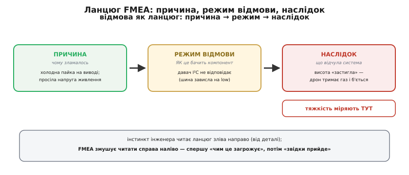
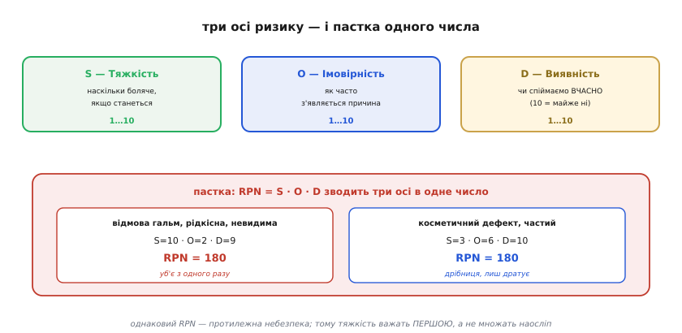

# FMEA у вбудованих системах

Прошивку ми вже навчилися [перевіряти шарами](root:embedded/firmware-testing) — від юніт-тестів на хості до прогону на живому чипі, і навіть навмисне [псувати її fault injection'ом](root:embedded/fault-injection-testing), щоб подивитися, як вона падає. Але всі ці перевірки відповідають на питання «чи робить код те, що я задумав?». Лишається питання страшніше й тихіше: **а що я взагалі забув задумати?** Тест ловить помилку в коді, який є; він безсилий проти давача, що відвалиться через рік корозії, проти живлення, що просяде в мороз, проти випадку, якого ви просто не уявили, сідаючи писати. Проти **невигаданих** бід тест не напишеш — бо щоб написати тест, треба спершу здогадатися, що ця біда можлива.

FMEA — це дисциплінований спосіб **здогадатися наперед**. Назва — англійський акронім *Failure Mode and Effects Analysis*, «аналіз режимів відмов і їхніх наслідків»: сідаєш до того, як спаяв плату, і систематично перебираєш, **чим саме** кожен вузол може зламатися, **до чого** це призведе і **наскільки** ти готовий це зустріти. Не «чи зламається» — а «коли зламається ось так, що буде далі». Це не магія й не математика; це чесний, нудний, рятівний перелік способів, якими твій пристрій може тебе підвести.

> 🔧 **Навіщо це.** На десктопі забутий випадок коштує перезапуску програми. У вбудованій системі забутий випадок — це дрон, що тримає газ із завислим давачем висоти, і втика в землю; це інсуліновий насос, що дозує наосліп. Пристрій уже в полі, патч туди швидко не доставиш, а помилка керує не пікселями, а залізом і часом — людьми. FMEA коштує кількох годин за столом до того, як щось спаяно; ціна пропущеного режиму відмови — у полі й незрівнянно вища.

## Відмова — це ланцюг, а не точка

Перше, що дає FMEA, — правильна мова. Інженер за звичкою думає **від деталі**: «згорів транзистор», «завис давач». Але «завис давач» саме по собі ще нічого не каже про небезпеку — усе залежить від того, **що було далі**. FMEA розкладає кожну відмову на три ланки причинно-наслідкового ланцюга, і кожна відповідає на своє питання.

**Причина** (англ. *cause*) — *чому* зламалось: холодна пайка на виводі, просіла напруга, перегрів, стара прошивка. **Режим відмови** (англ. *failure mode*, де *mode* — лат. *modus*, «спосіб») — *як* саме це проявляється на рівні вузла: давач I²C перестав відповідати, шина зависла на низькому рівні, значення «прилипло». **Наслідок** (англ. *effect*) — *що* від цього відчула вся система й користувач: висота «застигла», апарат утратив керування й розбився.


*Один ланцюг відмови у трьох ланках. Причина відповідає «чому зламалось», режим — «як це бачить компонент», наслідок — «що відчула система». Інстинкт інженера читає ланцюг зліва направо (від деталі до біди), а FMEA змушує читати навпаки: спершу «чим це загрожує», потім «звідки прийде». Тяжкість завжди живе на кінці — біля наслідку, не біля причини.*

Чому розрізнення таке важливе? Бо **одна причина дає різні наслідки, а один наслідок приходить від різних причин**. Холодна пайка може завісити давач — або потягнути живлення; завислий давач може нічого не значити (резерв узяв своє) — або вбити апарат. Якщо думати точками («згорів транзистор — погано»), ти не бачиш, наскільки погано і де стелити соломку. Якщо думати ланцюгами, видно головне: **тяжкість визначається наслідком, а не деталлю**. Тому FMEA читають з кінця — спершу «що найстрашніше може статися», а вже тоді «якими шляхами туди дійти».

## Три осі: тяжкість, імовірність, виявність

Перебрати режими — пів справи; їх назбирується десятки, і руки не дійдуть до кожного. Треба **впорядкувати за небезпекою**. FMEA важить кожен режим трьома незалежними числами від 1 до 10 — і вся сила методу в тому, що ці три осі **не зливаються в одну**.

**Тяжкість** (англ. *severity*, S) — наскільки боляче, *якщо* станеться. Міряється на кінці ланцюга, біля наслідку: подряпина — це 2, втрата керування апаратом — 9-10. **Імовірність** (англ. *occurrence*, O) — як часто з'являється причина: одиничний дефект пайки за весь випуск — низька, перегрів у тісному корпусі щоліта — висока. **Виявність** (англ. *detection*, D) — наскільки легко спіймати збій **вчасно**, поки він не переріс у наслідок. Тут шкала підступна, її легко прочитати навпаки: **10 — це майже неможливо виявити**, 1 — ловиться миттєво й гарантовано. Що **гірша** виявність, то **більше** число.

Виявність — найцінніша вісь саме для прошивки, бо це **єдина з трьох, на яку ви впливаєте кодом просто зараз**. Тяжкість закладена фізикою наслідку, імовірність — якістю заліза й виробництва; а от чи помітить прошивка, що давач замовк, перш ніж керувати наосліп, — цілком у ваших руках. Знизити D з 9 до 2 — це часто лише десяток рядків перевірки.


*Три незалежні осі: тяжкість міряють біля наслідку, імовірність — біля причини, виявність — біля контролю (10 = майже не спіймати). Класичний RPN зводить їх у одне число множенням — і тут пастка: відмова гальм (S=10, O=2, D=9) і косметичний дефект (S=3, O=6, D=10) дають однаковий RPN=180, хоча перша вбиває з одного разу, а друга лише дратує. Тому сучасна практика важить тяжкість першою, а не множить наосліп.*

Класичний спосіб звести три осі докупи — **RPN** (англ. *Risk Priority Number*, «число пріоритету ризику») = S · O · D. Зручно: одне число, сортуй за спаданням і берись за найбільші. Але саме тут — головна **пастка** методу, і її треба знати, перш ніж довіритися числу. Перемноження робить осі взаємозамінними, а вони не взаємозамінні. Відмова гальм рідка й невидима — S=10, O=2, D=9 — дає RPN=180. Косметична дрібниця, часта й теж невидима — S=3, O=6, D=10 — дає ті самі 180. За числом вони рівні; насправді перша **вбиває з одного спрацювання**, друга лише псує вигляд. Множення «розмиває» тяжкість: рідкісну смертельну відмову легко недооцінити поряд із частою дурницею.

Тому сучасна практика (про неї — нижче) **не множить наосліп**, а важить тяжкість окремо й першою: будь-який режим із S=9-10 береться в роботу незалежно від того, який у нього добуток. Просте робоче правило для прошивки: **спершу відсортуй за тяжкістю, і тільки в межах однакової тяжкості дивися на O і D**. Це рятує від класичної біди новачка — годинами «оптимізувати» купу дрібних RPN, поки одна смертельна відмова з низькою частотою тихо лишається без захисту.

> 🔧 **Навіщо це.** Шкала виявності — це прямий місток від паперу до коду. «D=9, давач завмер і ми цього не бачимо» читається як технічне завдання: *додай перевірку, яка це помітить*. Кожен раз, коли ви знижуєте D ось цим діапазон-контролем чи тайм-аутом шини, ви буквально перетворюєте абстрактний ризик на рядок прошивки. FMEA для вбудованника — це передусім машина, що генерує перелік перевірок, яких бракує.

## Рядок таблиці — це замовлення на код

FMEA живе у простій таблиці: рядок на кожен режим відмови, стовпці — наш ланцюг (причина → режим → наслідок) і три оцінки S, O, D, а далі — **захід**, який ми додаємо, і нові оцінки після нього. Для вбудованника ця таблиця — не звітність для галочки, а **перелік оборонних рубежів прошивки**. Кожне з трьох чисел б'ється своїм типом коду.


*Як рядок таблиці стає кодом. Режим «давач висоти завис» (S=9, O=3, D=8, RPN=216) розкладається на три удари по трьох осях: перевірка діапазону плюс тайм-аут шини збивають виявність (ловимо мовчання за 50 мс), резерв із барометра й GPS знижує тяжкість наслідку (відмова одного давача більше не валить керування), а [watchdog](root:sf-devices/watchdog) ловить повне зависання циклу. Таблиця читається як перелік того, що прошивка має вміти пережити.*

Візьмемо саме цей рядок і допишемо його прошивкою. Режим — давач висоти на I²C перестав відповідати; наслідок — апарат керує висотою наосліп. Перше, що ми атакуємо, — **виявність**: зробімо так, щоб код помітив біду. Це той самий [захисний підхід](root:sf-apps/defensive-programming), що ми вже знаємо, прикладений точково до режиму з таблиці — недовіра до входу плюс тайм-аут на операцію, що може зависнути.

**Збиваємо виявність: помітити, що давач замовк.**
```c
// Читаємо висоту; повертаємо false, якщо давач мовчить або бреше.
bool altimeter_read(float *out_m) {
    uint16_t raw;
    // тайм-аут шини: мовчання довше за поріг — це теж відмова, не «ще трішки»
    esp_err_t err = i2c_read_timeout(ALT_ADDR, &raw, /*ms=*/50);
    if (err != ESP_OK) {
        return false;                       // шина зависла / давач не відповів
    }
    float m = raw_to_metres(raw);
    if (m < -500.0f || m > 9000.0f) {       // фізично неможлива висота — давач бреше
        return false;
    }
    *out_m = m;
    return true;
}
```
Поки давач відповідав і значення були в межах, ми вірили їм мовчки — D було близько 9. Тепер код **активно перевіряє** дві речі: чи відповів давач за відведений час і чи лежить значення в фізично можливому діапазоні. D падає до 2: режим уже не «невидимий», ми ловимо його тієї ж секунди. Зверніть увагу на тайм-аут: без нього `i2c_read` на завислій шині зависне сам, і відмова давача перетвориться на відмову всього циклу керування — типова пастка, де перевірка одного режиму, зроблена недбало, **народжує гірший режим**.

Помітити — мало; треба ще **пережити**. Наступний удар — по **тяжкості** наслідку. Якщо висота приходить лише з одного джерела, будь-яка його відмова валить керування (S=9). Додамо резерв: барометр і висоту з GPS. Тепер відмова одного давача не лишає апарат сліпим — він бере справне джерело, і наслідок з «падіння» стає «трохи гіршою точністю».

**Знижуємо тяжкість: резерв замість єдиної точки відмови.**
```c
// Беремо найкраще доступне джерело висоти; жодне не валить апарат поодинці.
float fused_altitude(void) {
    float m;
    if (altimeter_read(&m))  return m;          // основний — лідар/далекомір
    if (baro_read(&m))       return m;          // резерв 1 — барометр
    if (gps_altitude(&m))    return m;          // резерв 2 — GPS
    enter_failsafe();                            // усі три мовчать — керований аварійний режим
    return last_known_altitude;
}
```
Єдина точка відмови (англ. *single point of failure* — вузол, чия поодинока відмова валить усю систему) розчинилась: щоб лишитися без висоти, тепер мають замовкнути **всі три** джерела одразу, а це вже геть інша, набагато менша імовірність. А якщо це таки сталося — ми не вдаємо, що все гаразд, а свідомо входимо у **failsafe** (англ. «безпечний за відмови» — заздалегідь продуманий безпечний стан): зависнути на місці, почати знижуватись, подати сигнал. Це теж рядок FMEA, доведений до кінця: ми не лишили навіть найгіршу гілку без плану.

Лишається третя вісь. Що, як завис не давач, а **сам цикл керування** — вічний цикл у драйвері, переповнення, тиха паніка? Жодна перевірка висоти тут не врятує, бо код, що мав перевіряти, теж стоїть. Це робота для [сторожового таймера](root:sf-devices/watchdog): незалежний лічильник, який прошивка мусить регулярно «годувати»; перестала годувати — він робить [контрольований перезапуск](root:hw-arch/reset-causes). Watchdog — остання сітка під усіма режимами, які ми не передбачили поіменно: він не знає, що саме зламалось, але знає, що **головний цикл більше не дихає**, і цього досить, щоб не дати апарату завмерти назавжди.

**Остання сітка: watchdog ловить зависання самого циклу.**
```c
void control_loop(void) {
    esp_task_wdt_add(NULL);                 // ставимо поточну задачу під нагляд
    for (;;) {
        float alt = fused_altitude();
        update_control(alt);
        esp_task_wdt_reset();               // «я живий» — годуємо сторожа щоциклу
        vTaskDelay(pdMS_TO_TICKS(20));
    }
}
```
Якщо `update_control` чи `fused_altitude` десь зависнуть, `esp_task_wdt_reset()` не викличеться вчасно — і сторож перезавантажить систему в чистий стан замість того, щоб лишити її мертвою в повітрі. Три рядки таблиці — перевірка, резерв, сторож — і три осі ризику збиті трьома різними механізмами. Саме так FMEA перетворюється з паперу на прошивку.

## Коли робити й де межа

FMEA найкорисніша **рано** — на папері чи в електронній таблиці, ще до того, як спаяно першу плату. У цьому весь сенс: знайти й закрити режим відмови, поки він коштує рядка коду, а не відкликання партії. Це не разовий обряд: щойно змінили схему чи додали вузол — таблиця оживає знову, бо новий компонент приносить нові режими. Добре лягає правило «один вузол — один підхід»: пройшли живлення, склали його режими й захист; пройшли давачі — те саме. Так аналіз не лишається абстрактним «а раптом щось зламається».

Корисно знати й **межу** методу — щоб не покладатися на нього сліпо. FMEA дивиться на **поодинокі** відмови: один режим, його причини й наслідки. Він кепсько ловить **збіги** — коли система падає лише від двох відмов разом (давач сам по собі терпимий, живлення саме по собі терпиме, а от обидва водночас — катастрофа). Для таких сплетінь є інші інструменти, що йдуть з іншого боку — від небажаної події вниз до її коренів; FMEA ж іде знизу вгору, від компонента до наслідку. І ще: метод рівно настільки добрий, наскільки чесний перелік режимів — забутий режим не з'явиться в таблиці сам. Тому FMEA не заперечує [тестів](root:embedded/firmware-testing) і [навмисного псування](root:embedded/fault-injection-testing), а доповнює їх: аналіз каже, **що** перевіряти й від чого боронитись, а тести й fault injection підтверджують, що оборона тримає.

Сам метод народився не в програмуванні, а на флоті й у космосі: уперше його формалізували [військові ще 1949 року](root:embedded/fmea-embedded/hist-mil-nasa.md), відточила програма «Аполлон», а звичний нам апарат із числами S, O, D дала пізніше автопромисловість. Корисно знати цю історію — вона пояснює, чому в методі стільки суворої формальності й звідки взялася суперечлива арифметика RPN, яку згодом довелося лагодити.

Підсумок простий. Тест питає «чи правильний мій код?»; FMEA питає **«від чого мій код навіть не пробує боронитись?»** — і відповідає переліком, який можна закрити рядок за рядком. На пристрої, де відмова керує залізом і часом, цей перелік — різниця між «зламалось і безпечно стало» і «зламалось і нікому про це не сказало».
