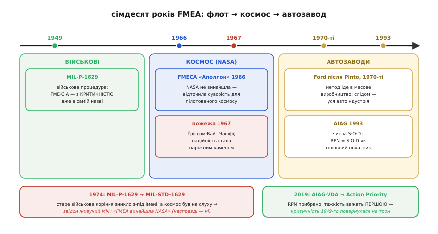

# 📜 Звідки взялася FMEA: флот, «Аполлон» і числа з автозаводу

Метод, яким ми щойно перетворювали рядки таблиці на рядки прошивки, не вигадав програміст. Він старший за мікроконтролери, старший за сам термін «програмне забезпечення». Народився він там, де ціна забутого режиму відмови вимірювалась не перезапуском програми, а вибухом ракети чи загиблим екіпажем, — і саме ця ціна пояснює, **чому** в методі стільки сухої формальності, звідки взялася суперечлива арифметика RPN і чому її врешті довелося лагодити. Історія тут не прикраса: вона показує, що кожна риса методу — відповідь на конкретну катастрофу.

Дорогою ми розчистимо й поширений міф. Спитайте навмання, хто придумав FMEA, — і добра половина відповість «NASA, для польотів на Місяць». Це гарна історія, в ній є зерно правди, і вона **неправильна**. Розберімо, як було насправді й чому помилка така живуча.

## Військові, 1949: спершу порахувати, чим воно вб'є

Перша задокументована поява методу — не цивільна й не космічна. 9 листопада 1949 року збройні сили США випустили процедуру **MIL-P-1629** під назвою *Procedures for Performing a Failure Mode, Effects and Criticality Analysis* — «процедури виконання аналізу режимів відмов, наслідків і критичності». Зверніть увагу на третє слово в назві: **Criticality**, критичність. Уже в найпершому документі метод був не просто «перелічи, як зламається», а «перелічи, **наскільки страшно** зламається» — оцінка критичності сиділа в ньому з народження. Це важливо, бо саме її автопромисловість пізніше прибере з назви, лишивши голу абревіатуру FMEA, — і саме повернення уваги до критичності стане сюжетом останнього акту цієї історії.

> 🔧 **Навіщо це.** Те, що метод народився як FME**C**A — з критичністю всередині, — не історичний дріб'язок. Це нагадування, від чого ми відштовхуємось: ще 1949 року військові розуміли, що сам перелік режимів безсилий без ваги «наскільки це смертельно». Коли ми в [темі-власнику](root:embedded/fmea-embedded) наполягали сортувати спершу за тяжкістю, а не за добутком, — ми не винаходили нічого нового, а поверталися до первісної ідеї, яку проміжна арифметика на якийсь час затьмарила.

Чому саме військові й саме тоді? Бо щойно скінчилась війна, де зброя вперше стала по-справжньому складною: радари, керовані боєприпаси, авіоніка з тисячами деталей. У такій системі підхід «зберемо, увімкнемо, подивимось, що згорить» більше не працював — згоріти могли люди, а ціна одного пуску була шалена. Потрібен був спосіб **передбачити** відмови на папері, до випробування, і відсортувати їх за небезпекою, щоб обмежені гроші й час пішли спершу на найгірше. Це рівно та сама мотивація, що жене вбудованника робити FMEA до того, як спаяна плата: знайти біду, поки вона коштує думки, а не відкликання партії. Просто у військових на тому кінці ланцюга наслідків стояла не зіпсована партія, а боєголовка.

**Статус факту: усталено.** Дата 9 листопада 1949 й позначення MIL-P-1629 підтверджені військовою документацією й сходяться в незалежних джерелах. Це найраніша відома **формалізація** методу — окремий стандарт, а не побіжна згадка. Сама ідея «обдумати наперед, чим воно зламається» очевидно старша за будь-який папір (так міркував кожен тверезий інженер задовго до 1949-го); але **записаною процедурою з оцінкою критичності** її першими зробили саме військові США, і саме цей документ дав методу ім'я.

## «Аполлон», 1966: метод іде в космос

Наступні півтора десятиліття метод тихо жив у обороні й потроху просочувався до підрядників. До початку 1960-х компанії, що працювали на NASA, уже застосовували різні варіації FMECA під різними назвами — кожен на свій лад. Розрізнені практики треба було звести докупи, і 1966 року NASA випустила **власну процедуру FMECA для програми «Аполлон»** — той самий аналіз режимів, наслідків і критичності, тепер націлений на пілотований політ до Місяця.

Логіка та сама, що у військових, лише ставки ще вищі. «Сатурн-V» — це мільйони деталей; командний модуль ніс трьох людей за чверть мільйона кілометрів від найближчої майстерні. Полагодити в польоті не можна майже нічого; «перезапустити» екіпаж — тим паче. У такій системі питання «чим саме може зламатися ось цей вузол і що буде далі» перестає бути паперовою формальністю й стає буквально питанням життя. NASA взяла готовий військовий метод і **відточила його під надійність пілотованого космосу** — не вигадала з нуля, а підняла на новий рівень суворості.

**Статус факту: усталено.** Рік 1966 і прив'язку процедури до «Аполлона» підтверджують технічні звіти NASA. Ключове слово — *відточила*, не *винайшла*: до 1966-го метод уже мав сімнадцять років задокументованої військової історії.

### Пожежа «Аполлона-1»: коли надійність стала головною

Те, що дало методу справжній поштовх усередині NASA, було страшним. 27 січня 1967 року під час наземного випробування на стартовому комплексі — звичайної репетиції, навіть без палива в ракеті — у командному модулі «Аполлона-1» спалахнула пожежа. У чистому кисні під тиском вогонь пішов лавиною. Екіпаж — Ґас Ґріссом (Gus Grissom), Ед Вайт (Ed White) і Роджер Чаффі (Roger Chaffee) — загинув за лічені секунди; вибратися крізь люк, що відчинявся всередину, вони не встигли. Троє людей загинули на землі, у машині, яка навіть не злетіла.

Слідство (Apollo 204 Review Board) розібрало катастрофу до гвинтика, і висновок був гіркий: загинули люди не від одної екзотичної причини, а від **сукупності недооцінених режимів відмов**, кожен з яких поодинці здавався терпимим. Атмосфера з чистого кисню. Гори горючих матеріалів у кабіні. Іскра від потертої проводки. Люк, який не відчинити швидко. Кожна ланка — «ну, малоймовірно»; разом — пастка без виходу. Після цього надійність і систематичний аналіз відмов із паперової вимоги перетворились на **наріжний камінь** усієї програми: краще години занудного перебору режимів за столом, ніж іще один екіпаж, що згорів у машині на землі.

Тут історія дає вбудованнику урок, ширший за дати. По-перше, FMEA найдорожча саме **до** запуску — пожежа сталася на репетиції, і це не врятувало, бо режими не передбачили заздалегідь. По-друге, і це межа методу, яку ми вже відзначали: класична FMEA дивиться на **поодинокі** відмови, а «Аполлон-1» убила саме **комбінація**. Кисень сам по собі — норма. Горючка сама по собі — терпимо. Іскра сама по собі — дрібниця. Жодна окрема клітинка таблиці не кричала «смерть»; смерть жила в їхньому збігу. Тому навіть бездоганна FMEA не скасовує потреби думати про сплетіння відмов окремими інструментами — рівно те, що ми казали, відмежовуючи [межу методу](root:embedded/fmea-embedded).

> 🔧 **Навіщо це.** Перенесіть «Аполлон-1» на свою плату. Сів акумулятор — терпимо. Завис давач — терпимо. Тайм-аут шини обробляється — добре. А якщо всі три разом, у мороз, на розрядженій батареї? Урок 1967 року прямий: FMEA рятує від поіменних режимів, але збіги треба ловити окремо — навмисним [псуванням системи в роботі](root:embedded/fault-injection-testing), де ви валите не один вузол, а кілька водночас, і дивитесь, чи витримає оборона їхню комбінацію.

**Статус факту: усталено.** Дата 27 січня 1967, склад екіпажу (Ґріссом, Вайт, Чаффі) і причина — пожежа в кисневій атмосфері під час наземного тесту — добре задокументовані. Те, що трагедія посилила роль аналізу надійності в «Аполлоні», теж загальновизнане; конкретну «частку заслуги» FMEA в реформах кількісно не міряють, тож тут чесніше казати «дало потужний поштовх», а не «врятувало завдяки одній методиці».

## Міф про авторство NASA — і звідки він

Тепер найцікавіше — як гарна історія розійшлася з фактами. Дуже поширене переконання: FMEA **придумала** NASA для польотів на Місяць. Воно живуче, бо в ньому є півправди — NASA справді зробила метод знаменитим і підняла його суворість. Але **придумали його не там і не тоді**: на момент апполонівської процедури 1966 року методу вже було сімнадцять років, і коріння його — військове, MIL-P-1629 від 1949-го.

Звідки ж узялась плутанина? Розгадка — у датах самих стандартів. 1974 року військовий документ MIL-P-1629 замінили новим стандартом — **MIL-STD-1629** (видання «SHIPS», флотське; пізніше, 1980 року, вийшла редакція MIL-STD-1629A, найвідоміша). Тобто початкова процедура 1949 року формально **зникла з-під старого імені** саме в середині 1970-х. А на той час публічно гучною, на слуху, була апполонівська FMECA 1966 року — про космос писали газети, про військові специфікації не писав ніхто. Старе військове коріння тихо змінило позначення й випало з масової пам'яті — а яскравий космічний епізод лишився. У головах склалося просте, неправильне рівняння: «бачили метод уперше у зв'язку з NASA — отже, NASA його й винайшла».

Це класичний механізм хибної атрибуції: **видиме й драматичне витісняє раннє й непримітне**. Той, хто **популяризував**, отримує лаври того, хто **створив**. Корисно тримати цей шаблон у голові ширше за FMEA — так само часто переписують історію винаходів узагалі, плутаючи «зробив знаменитим» зі «зробив першим».

**Статус факту: усталено, що це хибна атрибуція.** І первісне військове авторство (1949), і роль NASA як того, хто **поширив і відточив** (а не створив), підтверджені; зв'язок плутанини з заміною MIL-P-1629 на MIL-STD-1629 у 1974-му наводять як найімовірніше пояснення прямо в довідкових джерелах. Тобто помилковість приписування NASA — не наша здогадка, а усталений факт; самé пояснення «через зміну стандарту» подається як правдоподібна, добре прийнята причина.


*Лінія часу методу. Початок — військовий (1949, MIL-P-1629, з критичністю в назві). NASA 1966-го не винайшла метод, а підняла його суворість для пілотованого космосу; пожежа «Аполлона-1» 1967-го зробила надійність наріжним каменем. Заміна старого військового документа новим стандартом 1974 року збіглася з гучністю космічної програми — звідси й живучий міф про авторство NASA. Праворуч — другий поворот: автопромисловість, де метод отримав звичні нам числа.*

## Автозаводи, 1970-ті: метод стає масовим — і отримує числа

Третій поворот переніс FMEA з рідкісного, дорогого світу оборони й космосу в світ масового виробництва — і саме там метод набув вигляду, у якому ми його знаємо: таблиця з числами S, O, D і добутком RPN.

Першим серед автовиробників метод узяв на озброєння **Ford** у 1970-х — і поштовхом, як часто буває, стала біда. Модель Pinto здобула сумну славу через паливний бак, схильний займатися при ударі ззаду; репутаційний і безпековий удар був важкий. Реакцією Ford став, серед іншого, систематичний аналіз режимів відмов — спершу для конструкції, потім і для **процесів виробництва** (бо завод теж породжує свої режими відмов). Інші виробники в США, Європі та Британії невдовзі пішли слідом: метод виявився рівно тим, що потрібно конвеєру, де та сама помилка тиражується мільйонами.

Масовість вимагала спільної мови. Доти кожна компанія важила ризик по-своєму, і постачальник, що працював на трьох замовників, мусив вести три різні таблиці. 1993 року галузеве об'єднання **AIAG** (Automotive Industry Action Group, північноамериканське) випустило перший спільний довідник FMEA — і саме він закріпив той апарат, який сьогодні вважають «класичним»: три шкали від 1 до 10 — тяжкість (Severity), імовірність (Occurrence), виявність (Detection) — і число пріоритету ризику

```
RPN = S · O · D
```

як головний показник, за яким сортують режими. Зручність очевидна: одне число на рядок, відсортував за спаданням — і берись за найбільші. Саме цей RPN ми й розбирали в темі-власнику; саме його простота й зробила метод по-справжньому масовим.

**Статус факту: усталено.** Роль Ford як піонера серед автовиробників (1970-ті, контекст Pinto), створення AIAG у 1982-му й вихід першого спільного довідника FMEA у 1993-му з шкалами S-O-D і RPN сходяться в галузевих джерелах. Доречне уточнення з обережністю: «Pinto спричинив FMEA в Ford» — спрощення; точніше — слабкі місця цієї моделі **прискорили** перехід Ford до систематичного аналізу режимів, що визрівав і з інших причин.

## RPN ламається — і 2019-й повертає тяжкість на місце

Просте число — палиця з двома кінцями. Та сама властивість RPN, що зробила його масовим (звести три осі в один порядок сортування), ховала ваду, яку ми вже бачили на конкретних числах у темі-власнику: **множення робить осі взаємозамінними, а вони не взаємозамінні**. Рідкісну смертельну відмову з добутком 180 множення урівнює з частою косметичною дрібницею з тим самим 180 — і смертельна тихо губиться у списку. Найгірше, що арифметика дозволяє **небезпеці сховатися за затишним числом**: тяжкість 9, але низькі імовірність і виявність — і RPN виходить «прийнятний», хоча йдеться про відмову, що вбиває з одного разу. Десятиліттями практики критикували RPN ще й за **перекіс у бік виявності**: накрутив систему контролю, збив D — і небезпечний за суттю режим раптом «подобрішав» на папері, хоч у фізичному світі не змінилось нічого.

Критика назбирувалась роками, аж доки два головні галузеві об'єднання не звели свої підходи в один. 2019 року американське **AIAG** і німецьке **VDA** (Verband der Automobilindustrie, спілка автопромисловості Німеччини) спільно випустили **гармонізований довідник AIAG-VDA FMEA** — і він зробив рішучий крок: **прибрав RPN як головний показник** і замість нього ввів **Action Priority** (AP, «пріоритет дії»). Замість сліпого добутку AP — таблиця підстановки, що за комбінацією S, O, D видає пріоритет «високий / середній / низький», причому **тяжкість важить першою**. Високотяжкий режим не може провалитися в «низький пріоритет» лише тому, що його імовірність мала чи виявність добра, — рівно та діра, крізь яку колись провалювались смертельні відмови, тепер закрита конструкцією методу.

І ось коло замикається. Метод народився 1949 року як FME**C**A — з **критичністю** в самій назві. Автомобільна доба заради простоти й масовості прибрала критичність, лишивши голий добуток RPN, — і добуток зрадив, бо урівняв смертельне з косметичним. А 2019-й, по суті, **повернув критичність на трон**: пріоритет тепер веде тяжкість, а не арифметика. Сімдесят років метод ходив по колу, щоб повернутися до тверезої думки, з якої починав, — спершу спитай, **наскільки страшно**, а вже потім, як часто й чи спіймаєш.

> 🔧 **Навіщо це.** Наше робоче правило з теми-власника — «спершу відсортуй за тяжкістю, і лише в межах однакової тяжкості дивись на O і D» — це не власна вигадка курсу, а та сама ідея, до якої світова практика йшла сімдесят років. Для прошивки висновок простий і дешевий: не наслідуй застарілий RPN, який ще трапляється в старих шаблонах; став питання тяжкості першим. Режим із S=9-10 бери в роботу завжди — байдуже, який у нього добуток. Історія вже заплатила за цей урок кров'ю екіпажу й репутацією автозаводу; нам лишається тільки не повторювати її помилку безкоштовно.

**Статус факту: усталено.** Спільну публікацію AIAG-VDA у 2019 році, заміну RPN на Action Priority з пріоритетом тяжкості й самý критику RPN (перекіс у бік виявності; небезпека, що ховається за прийнятним добутком) підтверджують і довідник, і галузеві огляди. Те, що VDA — німецьке об'єднання, а AIAG — північноамериканське, теж усталено; гармонізація саме й знадобилась, щоб постачальник на обидва ринки вів одну таблицю замість двох.

## Що з цієї історії бере вбудованник

Збираючи нитку докупи: метод пройшов три середовища, і кожне додало йому рису, якою ми користуємось у прошивці. **Військові** (1949) дали саму ідею записаної процедури й критичність — вагу «наскільки смертельно». **Космос** (1966, і трагічний урок 1967-го) дав суворість і показав межу: поодинокі режими — це FMEA, збіги — окремий клопіт. **Автозаводи** (1970-ті → 1993) дали масовість і числа S-O-D, а заразом — повчальну ваду RPN; **гармонізація 2019-го** цю ваду виправила, повернувши тяжкість на чільне місце.

Для нашого діла з усього цього випливає одне практичне правило, перевірене сімома десятиліттями й оплачене дорого: **не множ наосліп — спершу зваж тяжкість**. Решта історії — про те, чому цьому правилу варто довіряти більше, ніж зручному, але зрадливому добутку з застарілого шаблону. А ще — маленьке щеплення від міфів: коли наступного разу почуєте впевнене «це винайшла NASA» (про що завгодно), згадайте MIL-P-1629 і спитайте, хто **зробив знаменитим**, а хто **зробив першим**. Це різні люди частіше, ніж здається.
