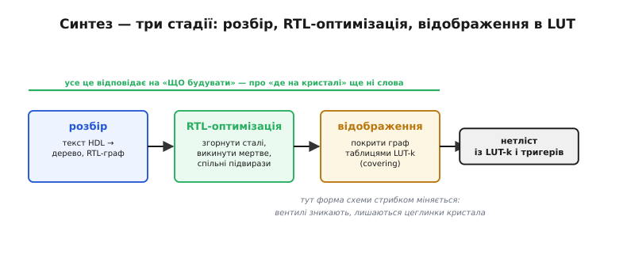
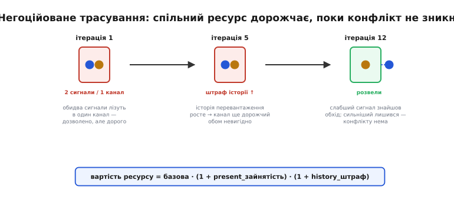
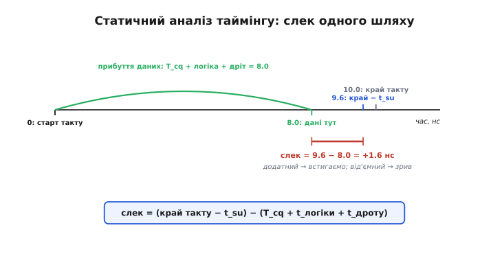
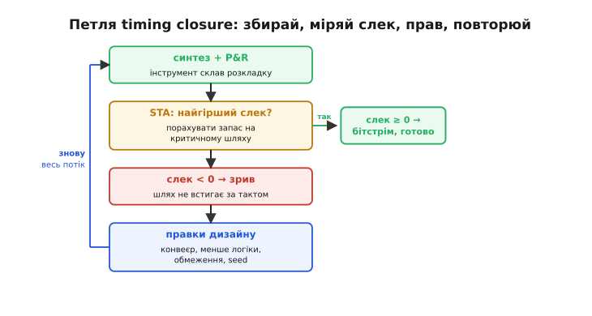

# Потік розробки, глибше: що насправді робить кожен крок

У [базовому кроці](root:embedded/fpga-flow) ми пройшли конвеєр згори: [HDL](topic:hw-digital/hdl) → синтез → розміщення → трасування → бітстрім, і побачили головну відмінність від звичної компіляції — після «компіляції» лишається ще **фізична** робота, вкладання схеми в конкретний кристал. Цього досить, щоб читати повідомлення інструментів і не лякатися чорної скриньки. Але за кожним із чотирьох слів ховається окрема, часто нетривіальна задача — і саме там народжуються найтонші баги: дизайн «синтезується, а на платі мовчить», «збирається, але не встигає за тактом», «щоразу лягає інакше». Щоб розуміти **чому** так, треба спуститися на шар нижче й побачити, що кожен крок — не просто переклад, а **оптимізаційна задача** зі своєю метою, своїми межами й своїм способом здатися, коли ідеалу не існує.

Ця думка — наскрізна нитка всієї статті. Софтовий компілятор теж оптимізує, але він перекладає програму на **фіксований** набір інструкцій фіксованого процесора: мета одна — швидший або коротший код. Потік FPGA щоразу вкладає схему в **порожню тканину із заданою геометрією**, де немає готових суматорів чи регістрів — є лише мільйони однакових клітинок і сітка дротів між ними. Через це майже кожен крок упирається в задачу, яку **точно розв'язати за прийнятний час неможливо**, і інструмент змушений шукати наближення. Побачивши, де саме сидить ця неможливість, ви почнете читати звіти інструментів як лікар читає аналізи: не «добре/погано», а «ось тут запас, ось тут на межі, ось звідки прийде наступна біда».

Почнімо там само, де базовий крок, — із синтезу, — але цього разу зайдемо всередину.

## Синтез — це три різні задачі, а не одна

Слово «синтез» звучить як єдина дія: взяв текст — отримав схему. Насправді всередині відбуваються **три послідовні перетворення**, і плутати їх — значить не розуміти половину повідомлень інструмента. Розберімо кожне.


*Синтез розкладається на три стадії. **Розбір**: текст HDL стає деревом, а тоді графом на рівні регістрів і операцій (RTL). **RTL-оптимізація**: згортання сталих, викидання мертвої логіки, спільні підвирази — усе ще в термінах «плюс», «мультиплексор», «регістр». **Технологічне відображення**: цей абстрактний граф покривають конкретними цеглинками кристала — таблицями LUT-k. Аж на третій стадії форма схеми стрибком міняється: абстрактні вентилі зникають, лишаються реальні клітинки. Але жодна з трьох ще не каже, **де** на кристалі що опиниться.*

**Перша стадія — розбір (parsing) і розгортання (elaboration).** Інструмент читає текст як компілятор: перевіряє синтаксис, будує дерево, розгортає параметри й `generate`-цикли, підставляє константи модулів. Результат — граф на **рівні передавання між регістрами** (register-transfer level, RTL): вузли тут ще великі й людяні — «додати два числа», «вибрати одне з чотирьох», «замкнути в регістр за фронтом такту». Це не вентилі, а **операції**. Саме на цій стадії ловляться помилки типу «ширина шини не сходиться» чи «сигнал ніде не заданий» — і саме тут криється перша пастка: HDL не обов'язково описує те, що ви думали. Опис `reg [7:0] x; assign x = a + b;` для 9-бітної суми **мовчки** відкине старший біт — інструмент зробить рівно те, що написано, а не те, що малося на думці.

> 🔧 **Навіщо це.** Більшість «дивних» результатів синтезу — це не бага інструмента, а **буквальне** прочитання опису. Якщо лічильник переповнюється не там, де ви чекали, або мультиплексор має «зайву» гілку — дивіться на RTL-граф (усі синтезатори вміють його показати схемою). Ви майже завжди побачите, що інструмент чесно збудував те, що написано; виправляти треба опис.

**Друга стадія — оптимізація на рівні RTL і логіки.** Отримавши граф операцій, синтезатор його **чистить**, і робить це агресивно. Три головні механізми варто знати поіменно, бо кожен колись «з'їсть» щось, що ви хотіли лишити:

- **Згортання сталих (constant folding).** Якщо десь виходить, що провід завжди дорівнює 0 або 1, уся логіка, яка його лише обчислювала, зникає. Регістр, у який пишеться стала, перетворюється на просто цю сталу.
- **Викидання мертвої логіки (dead-code elimination).** Вузол, вихід якого нікуди не веде (не впливає на жоден вивід чи регістр, що спостерігається), видаляється цілком. Звідси класична несподіванка: ви додали лічильник для налагодження, ніде його не читаєте — і в звіті ресурсів його немає. Він **мертвий**, синтезатор його викинув.
- **Спільні підвирази й факторизація.** Якщо `a & b` рахується у трьох місцях, лишиться один вузол на всі три. Двобічну логіку інструмент ще й **мінімізує** — зводить булеву функцію до компактнішої форми (це окрема давня наука; коротко про неї — у темі [оптимізація синтезу](topic:hw-digital/synthesis-optimization)).

Уся ця стадія працює ще **в термінах вентилів та операцій** — про кристал вона нічого не знає. Її мета — щоб схема була логічно та сама, але **менша й простіша**. І аж тепер настає стадія, специфічна саме для FPGA.

**Третя стадія — технологічне відображення (technology mapping).** Ось тут FPGA рішуче розходиться з процесором. У процесора «технологія» — це набір інструкцій; синтез коду в них — вибір із меню. У FPGA технологія — це **таблиця істинності на k входів** ([LUT](topic:hw-digital/lut)) плюс тригер поряд, і більше нічого. Отже, весь оптимізований логічний граф треба **покрити** блоками LUT-k так, щоб кожен блок реалізовував функцію не більше ніж від k входів, а разом вони давали ту саму схему. Це задача **покриття (covering)**: розрізати граф на шматки-по-k-входів.

І ось перша поява того, про що ми попереджали: покрити граф можна багатьма способами, а «найкращий» (найменше LUT або найкоротший ланцюг LUT) шукати важко. На щастя, саме для **глибини** (довжини найдовшого ланцюга LUT — а вона прямо визначає затримку) є точний і швидкий метод: [алгоритм FlowMap мінімальним розрізом](root:embedded/fpga-flow/math-lut-covering.md) знаходить **оптимальну за глибиною** розкладку за поліноміальний час. Механіку — зведення до пошуку розрізу заввишки не більше k у графі через мережевий потік — ми виводимо покроково в окремій вставці; тут досить знати підсумок: **глибину** LUT-мережі вміють мінімізувати точно, а от **кількість** LUT доводиться доводити евристиками.

Мінімальний worked-приклад робить усе відчутним. Порахуймо, скільки LUT-4 потрібно на 8-бітну АБО двох чисел і на суматор — щоб відчути різницю між «дешевою» і «дорогою» логікою:

**Скільки LUT-4 з'їдають дві типові операції (8 біт).**
```
1) побітове АБО: y[i] = a[i] | b[i]
   кожен біт — функція від 2 входів (a[i], b[i]) → влазить в 1 LUT-4
   8 біт                                  → 8 LUT-4

2) суматор a + b (ланцюжок переносу, наївно):
   кожен розряд — функція від a[i], b[i], carry_in → 3 входи
   sum[i] і carry[i] — дві функції по 3 входи
   без спец-ланцюга це ~2 LUT на розряд, 8 розрядів → ~16 LUT-4
   АЛЕ: у реальному кристалі є виділений ланцюг переносу
   (carry chain), тож суматор лягає в 8 клітинок майже задарма
```

Висновок читається одразу: широка **побітова** логіка дешева (кожен біт — окремий LUT), а от **арифметика з переносом** була б дорога, якби її будували на голих LUT. Тому в кожній сучасній тканині FPGA поряд із LUT є **виділений ланцюг переносу** — швидкий спеціальний дріт для біта переносу; синтезатор його розпізнає й садить суматор туди. Це той випадок, коли розуміння відображення прямо економить ресурс: пишете `+` — інструмент бере ланцюг переносу; будуєте той самий суматор «вручну» через логічні вирази — можете випадково завадити йому це зробити й отримати вдесятеро повільнішу й ширшу схему (глибше про самий швидкий перенос — у темі [суматор із прискореним переносом](topic:hw-digital/carry-lookahead-adder)).

Остання дія синтезу — **пакування (packing)**: LUT і тригери групуються у ті фізичні блоки, якими кристал реально збудований (у різних родин вони звуться по-різному — logic cell, slice, ALM), бо клітинка тканини зазвичай містить і LUT, **і** тригер поряд, і їх вигідно займати разом. На виході — **нетліст із цеглинок кристала**: не абстрактні вентилі, а конкретні LUT-k і тригери, з'єднані проводами. Але — і це головне, що треба винести із синтезу, — нетліст усе ще **не має географії**. Він каже, з яких клітинок складено схему й що з чим з'єднано, і жодним словом — **де** ці клітинки на кристалі. За все, що вище, відповідала «що»-частина. За «де» береться наступний крок. Народження самої ідеї синтезувати схему з тексту (а не малювати руками) — окрема історія, [її ми розповідаємо у вставці](root:embedded/fpga-flow/hist-birth-of-synthesis.md).

## Обмеження — той другий вхід, якого немає в компіляції

Перш ніж вкладати нетліст у кристал, спинімося на тому, про що базовий крок згадав лише мимохідь, а це насправді окремий **вхід** усього потоку. Компілятору програми ви даєте один файл — текст. Потоку FPGA замало опису: він мусить ще знати **дві речі, яких у HDL немає в принципі**.

Перша — **куди фізично приходять сигнали**. У нетлісті `clk` і `led` — просто імена проводів. Але на кристалі є конкретні ніжки, а на платі до цих ніжок припаяні конкретна кварцівка й конкретний світлодіод. Хтось мусить сказати: сигнал `clk` — на ніжку J3, `led` — на ніжку B12. Це роблять **обмеження призначення виводів**; у відкритому тулчейні iCE40 їх тримає файл `.pcf`, у промислових пакетах — `.sdc`/`.xdc`. Без цього файлу нетліст логічно повний, а фізично ні до чого не прив'язаний — і тут ховається найковарніша пастка потоку, до якої ми ще повернемося.

Друга — **як швидко все має працювати**. Нетліст не містить числа «такт 12 МГц» чи «100 МГц» — це вимога, яка живе **поза** описом схеми. А без цього числа розміщення й трасування не мають **критерію**: вони не знають, який шлях «надто повільний», бо не знають, скільки часу дозволено. Тому їм окремо задають **часові обмеження** — насамперед період такту. Це перетворює туманне «зроби швидко» на конкретну ціль: «кожен шлях від регістра до регістра має вкластися в 83.3 нс» (для 12 МГц) або в 10 нс (для 100 МГц). Уся тонка кухня таймінгу, про яку далі, крутиться навколо цього одного числа. Формат і синтаксис самих обмежень — окрема тема, [файл обмежень FPGA](topic:hw-digital/fpga-constraints); нам зараз важлива сама їх **роль**: це другий вхід потоку, нарівні з HDL.

> 🔧 **Навіщо це.** Дизайн без обмежень **збереться** — і це найгірше, що може статися. Без призначення виводів чип оживе, але сигнали підуть не на ті ніжки (або нікуди), і плата мовчатиме. Без часового обмеження інструмент вважатиме, що поспішати нікуди, розкладе логіку абияк — і на бажаній частоті схема не працюватиме, хоча звіт таймінгу буде «зелений» (бо ви не сказали, з чим порівнювати). Правило залізне: **обмеження — частина дизайну, а не додаток до нього.** Пишете модуль — одразу пишете, куди йдуть його виводи і з якою частотою він тактується.

Тепер, маючи нетліст (що) і обмеження (де приходить, як швидко), інструмент береться за найважчу частину.

## Розміщення: мільйони варіантів і функція вартості

**Розміщення** (*placement*) відповідає на питання «де»: кожній клітинці нетлісту призначити конкретну фізичну плитку кристала. Здавалося б, дрібниця — посадити N вузлів у N із M гнізд. Але подумаймо про масштаб. Навіть скромний кристал має тисячі плиток; вузлів — теж тисячі; варіантів розсадки — добуток, число з сотнями нулів. Перебрати неможливо навіть у Всесвіті. А головне — **не всі розсадки рівноцінні**, і різниця величезна.

Чому нерівноцінні? Бо після розміщення прийде трасування, і **довжина дротів** між зв'язаними вузлами залежить від того, як близько їх посадили. Довгий дріт — це і більша затримка (сигнал довше біжить), і зайняті дефіцитні канали (іншим сигналам менше місця). Отже, у розміщення є **мета**, яку можна виміряти числом, — і це ключ до всього. Формалізують її як **функцію вартості (cost function)**, приблизно таку:

```
вартість = Σ (довжина_дроту між зв'язаними вузлами)          ← сумарна довжина
         + λ · Σ (перевищення таймінгу на критичних шляхах)   ← штраф за повільність
```

Перший доданок тягне зв'язані вузли **ближче** один до одного. Другий — **важливіший** для швидких дизайнів — карає саме за ті шляхи, що ризикують не встигнути за тактом, і тягне їхні кінці ще ближче, навіть ціною подовження неважливих зв'язків. Множник λ балансує: наскільки заради таймінгу ми готові жертвувати загальною компактністю. Тепер задача звучить чітко: **знайти розсадку з найменшою вартістю**. І ось де знову вигулькує неможливість перебору — потрібна евристика.

Класична евристика — **імітація відпалу**; її механіку (навіщо інколи навмисне приймати гірший крок, щоб вибратися з локальної ями) ми докладно розібрали з псевдокодом і графіком у [вставці про відкритий тулчейн](root:embedded/fpga-flow/proj-open-toolchain.md), тож тут не повторюємося. Варто лише додати, що промислові інструменти для великих кристалів часто йдуть іншим шляхом — **аналітичним розміщенням**: вони записують сумарну довжину дротів як гладку (квадратичну) функцію координат усіх вузлів і розв'язують її як систему рівнянь, отримуючи «ідеальне, але нездійсненне» розташування (багато вузлів в одній точці), а тоді ітеративно **розштовхують** їх по реальних гніздах. Це принципово інший підхід, ніж відпал: не випадкові обміни, а математичний розв'язок із наступним розведенням. Але мета в обох одна — **та сама функція вартості**: коротші зв'язки, дотриманий таймінг.

Хоч який метод, результат розміщення — це відповідь на «де сидить кожен вузол». Лишається протягти між ними дроти. І тут — окрема, дуже гарна задача.

## Трасування як переговори за дефіцитний ресурс

**Трасування** (*routing*) має провести кожен зв'язок нетлісту реальними дротами кристала — а дроти в FPGA не безмежні: це фіксована сітка **сегментів** і **перемикачів** між ними ([будова тканини — тут](topic:hw-digital/inside-fpga)). Проблема в тому, що сигналів багато, а сегментів на кожній ділянці — обмаль, і два сигнали не можуть їхати одним сегментом. Виникає **конкуренція за ресурс**. Наївний підхід — вести сигнали по черзі, кожному шукати найкоротший вільний шлях — ламається одразу: перші сигнали займають найзручніші дроти, останнім не лишається нічого, і трасування «не сходиться». Гірше: те, що застрягло, залежить від **порядку**, у якому вели сигнали, а він випадковий.

Розв'язок, який тепер стоїть майже в кожному трасувальнику світу, елегантний до краси: **дозволити конфлікт, а тоді змусити сигнали за ресурс торгуватися**. Це [негоційоване трасування (negotiated congestion routing)](root:embedded/fpga-flow/math-negotiated-routing.md) — алгоритм **PathFinder**, який 1995 року описали [Ларрі Мак-Мерчі й Карл Ебелінг](https://www.cecs.uci.edu/~papers/compendium94-03/papers/1995/fpga95/pdffiles/6a.pdf) (McMurchie, Ebeling) з Вашингтонського університету; підхід виявився настільки надійним, що його прийняли й промислові, і дослідницькі інструменти. Ідея працює так.


*Негоційоване трасування. **Ітерація 1**: обидва сигнали беруть найкоротший шлях — і лізуть в один канал; конфлікт **дозволено**, лише робить ресурс дорожчим. **Ітерація 5**: канал далі перевантажений, тож накопичується штраф історії — сидіти тут стає невигідно **обом**. **Ітерація 12**: сигналу, якому обхід дешевший, вигідніше відступити; він іде іншим шляхом, а той, кому цей канал критичний, лишається. Конфлікт зник **сам**, без жодного «порядку сигналів».*

Спочатку кожен сигнал ведуть найкоротшим шляхом, **не зважаючи** на те, чи хтось уже там їде. Природно, деякі сегменти виявляються зайнятими двома-трьома сигналами — **перевантаженими**. Тепер починаються ітерації: усім перевантаженим сегментам **піднімають ціну**, і кожен сигнал перепрокладають наново — але вже за **вартістю**, а не за довжиною. Формула вартості сегмента — серце методу:

```
вартість_сегмента = базова · (1 + p · present_зайнятість)
                            · (1 + h · history_штраф)
```

Тут `present_зайнятість` — скільки сигналів **зараз** претендує на сегмент (тисне розвести їх у цю ж ітерацію), а `history_штраф` — **накопичена** за всі минулі ітерації міра того, як довго сегмент був перевантажений. Другий доданок — і є та сама «історія переговорів»: якщо за ресурс уперто б'ються, його ціна росте **з кожною ітерацією**, аж поки одному з претендентів дешевше стане відступити на обхід. Хто відступить? Той, кому обхід коштує менше. А сигнал, для якого цей сегмент критичний (обхід був би надто довгий, зірвав би таймінг), — залишиться. Так конкуренцію розв'язує не порядок і не випадок, а **економіка**: ресурс дістається тому, кому він потрібніший, бо решта самі знаходять, що їм вигідніше в іншому місці. Ітерації тривають, поки **жодного** перевантаженого сегмента не лишиться — тоді трасування зійшлося.

> 🔧 **Навіщо це.** Ця механіка пояснює дві речі, які ви бачитимете на практиці. По-перше, **чому трасування іноді довге**: якщо кристал забитий під зав'язку, переговори тривають десятки ітерацій, перш ніж усі конфлікти розв'яжуться, — і це не гальмо, а нормальна робота. По-друге, **чому «майже влазить» — найгірший стан**: коли ресурсу впритул, дрібна зміна дизайну може перекинути, хто саме відступить, і розкладка (а з нею й таймінг) стрибне. Звідси практичне правило: **не завантажуйте кристал на останні відсотки** — лишайте запас каналів, і трасування буде і швидшим, і стабільнішим.

Коли і розміщення, і трасування завершені, схема повністю лягла на кремній: відомо, де кожен вузол і яким дротом він з'єднаний. Тепер можна нарешті **виміряти**, чи справді ця конкретна розкладка встигає за тактом. Це робить статичний аналіз таймінгу — і його варто зрозуміти до кісток, бо саме його вердикт вирішує, готовий дизайн чи ні.

## Статичний аналіз таймінгу: виводимо слек до останньої наносекунди

Дотепер таймінг фігурував як «штраф» у функції вартості. Настав час порахувати його **точно**. Питання просте: чи встигне сигнал добігти від одного регістра до наступного **раніше**, ніж прийде наступний фронт такту й цей наступний регістр «клацне»? Якщо так із запасом — добре. Якщо ні — дизайн зривається, і на бажаній частоті працювати не буде. Метод, який це перевіряє **без запуску схеми**, лише за геометрією й затримками, зветься **статичний аналіз таймінгу** (static timing analysis, STA). «Статичний» — бо не ганяє тестові вектори, а рахує найгірший можливий шлях **аналітично**; тому й ловить проблему, яка на симуляції могла б і не проявитися.

Побудуймо його висновок на очах, як велить метод, — з реальними числами. Розглянемо один шлях: регістр-джерело клацає за фронтом такту, дані біжать крізь логіку й дріт і мусять **устоятися** на вході регістра-приймача **до** його фронту. Три величини визначають, **коли дані прибудуть**:

- **T_cq** (clock-to-Q) — затримка самого регістра-джерела: скільки минає від фронту такту до того, як на його виході з'явиться новий рівень. Типово частки наносекунди.
- **t_логіки** — сумарна затримка вентилів (LUT) на шляху.
- **t_дроту** — затримка дроту; саме її роздуває довгий маршрут після поганого розміщення.

А з іншого боку — **коли дані повинні бути на місці**. Приймач клацає наступним фронтом, тобто через **T_такту** після старту. Але клацнути надійно він може, лише якщо дані встоялися **трохи раніше** фронту — за час **t_su** (setup, час встановлення). Отже, крайній дозволений момент прибуття — це `T_такту − t_su`. Порівняння цих двох моментів і дає **слек (slack)** — запас часу:

```
слек_setup = (T_такту − t_su) − (T_cq + t_логіки + t_дроту)
```


*Слек на часовій осі одного шляху. Дані **прибувають** на 8.0 нс (сума T_cq, затримки логіки й дроту від старту такту). Крайній дозволений момент — **край такту** 10.0 нс мінус час встановлення t_su, тобто 9.6 нс. Слек — різниця: 9.6 − 8.0 = **+1.6 нс** запасу. Додатний слек означає «встигаємо»; від'ємний — дані спізнилися, регістр клацне по несталому рівню, і це зрив.*

**Порахуймо слек setup для шляху на такті 100 МГц.** Візьмемо конкретні числа й доведемо до вердикту:
```
T_такту   = 1 / 100 МГц   = 10.0 нс      ← період такту
t_su      =                 0.4 нс       ← час встановлення приймача
T_cq      =                 0.5 нс       ← затримка регістра-джерела
t_логіки  =                 6.0 нс       ← три LUT по 2.0 нс
t_дроту   =                 1.5 нс       ← дроти на цьому шляху

прибуття   = 0.5 + 6.0 + 1.5           = 8.0 нс
дозволено  = 10.0 − 0.4               = 9.6 нс
слек       = 9.6 − 8.0                = +1.6 нс   → встигаємо, запас 1.6 нс
```

Запас додатний — шлях проходить. А тепер повторимо думкою для 200 МГц: `T_такту` стане 5.0 нс, `дозволено` = 4.6 нс, а прибуття лишиться 8.0 нс — **слек = −3.4 нс**. Той самий дизайн, удвічі швидший такт — і глибокий зрив. Ось звідки береться стеля частоти: серед **усіх** шляхів дизайну є один із найменшим слеком — **критичний шлях**; він і задає максимальну частоту, бо саме він перший піде у від'ємний слек, коли такт коротшає. Докладніше поняття критичного шляху й способи його вкоротити — у темі [критичний шлях](topic:hw-digital/critical-path-and-slack) та [таймінг FPGA](topic:hw-digital/fpga-timing-and-routing).

Є й **другий**, дзеркальний бік, про який часто забувають, — і він підступніший. Ми перевіряли, що дані не **спізнилися**. Але вони можуть прийти й **надто рано**: якщо шлях дуже короткий, новий рівень від джерела дообіжить до приймача **того самого такту** й перепише те, що приймач мав клацнути. Регістру потрібно, щоб дані трималися стабільно ще **t_h** (hold, час утримання) **після** фронту:

```
слек_hold = (T_cq + t_логіки + t_дроту) − t_h
```

Тут усе навпаки: слек тим більший, чим шлях **довший**; загроза — у **надто швидких** шляхах, і найчастіше — у прямих зв'язках регістр-у-регістр без логіки між ними. І ось критична різниця, яку треба закарбувати: **зрив setup лікують повільнішим тактом** (дай сигналу більше часу — і встигне); а **зрив hold тактом не лікується взагалі**, бо `T_такту` у формулу hold **не входить** — хоч як сповільнюй такт, надто короткий шлях лишиться надто коротким. Зрив hold — це майже завжди дефект, який інструмент мусить полагодити, **вставивши затримку** (зайвий буфер), або дефект самого дизайну. Через це порушення hold вважають серйознішою бідою, ніж setup; глибше — тема [порушення hold-часу](topic:hw-digital/hold-violation). Окрема цитадель тих самих законів — межа між двома тактовими доменами, де сигнал приходить **несинхронно**; там на STA вже не покладаються, а ставлять синхронізатор проти [метастабільності](topic:hw-digital/metastability-timing), — але це вже інша розмова.

Отже, STA видає вердикт: найгірший слек по всьому дизайну. Додатний — дизайн вкладається в такт. Від'ємний — ні, і треба щось міняти. Що саме — і як це перетворюється на **цикл**, — наступна частина.

## Timing closure: коли один прогін не дає відповіді

Ось де потік FPGA остаточно перестає бути схожим на «натиснув компіляцію — отримав результат». Синтез, розміщення, трасування, STA — усе це один прогін. Але його вердикт може бути «критичний шлях у зриві на 3 нс», і тоді один прогін нічого не вирішив: він лише **сказав**, що не встигаємо. Довести дизайн до стану, коли **всі** шляхи мають додатний слек, зветься **timing closure** (англ. «закриття таймінгу» — зведення всіх зривів до нуля), і це, по суті, **петля**.


*Петля timing closure. Інструмент збирає розкладку (синтез + розміщення + трасування). STA рахує найгірший слек. Слек невід'ємний — дизайн вкладається, пакуємо бітстрім, готово. Слек від'ємний — критичний шлях не встигає; вносимо правки (додати конвеєр, зменшити логіку між регістрами, уточнити обмеження, зафіксувати seed) і **проганяємо весь потік наново**. Кожен оберт петлі може змінити розкладку цілком — тому робота з таймінгом ітеративна за самою природою.*

Що робити в петлі, коли слек від'ємний? Порядок дій — від найдешевшого до найдорожчого:

- **Розбити критичний шлях конвеєром (pipelining).** Якщо між двома регістрами забагато логіки, вставте посередині ще один регістр: тепер сигнал долає шлях за **два** такти, кожен вдвічі коротший, — і кожен встигає. Ціна — на такт більша затримка результату (латентність), яку в потоковому дизайні зазвичай не жаль. Це найпотужніший важіль, бо б'є в корінь: скорочує `t_логіки` в самій формулі слеку.
- **Зменшити логіку між регістрами.** Іноді критичний шлях роздутий кодом: широке порівняння, довгий ланцюг арифметики, вкладені умови. Простіший опис — коротший шлях.
- **Допомогти інструментові обмеженнями.** Часом інструмент «не старається» на потрібному шляху, бо не знає, що він критичний, — точніші часові обмеження скеровують і синтез, і P&R (тема [timing closure](topic:hw-digital/timing-closure) — про це докладно).
- **Зафіксувати seed.** Розміщення значною мірою **випадкове** (відпал), тож той самий дизайн щоразу лягає інакше, і слек скаче від прогону до прогону. Це не хаос без причини: коли слек близький до нуля, дизайн **на межі** ресурсу й таймінгу, і випадковість розкладки перекидає його то в плюс, то в мінус. Фіксований seed повертає **відтворюваність** (той самий результат щоразу) — корисно, щоб ловити зміни; але справжнє лікування нестабільності — **прибрати межу**: додати запас конвеєром чи розвантажити кристал.

Кожен оберт петлі — це **повний** прогін потоку (правка коду міняє нетліст, новий нетліст — нову розкладку, нова розкладка — новий слек). Тому терпіння тут не примха, а частина ремесла: великий дизайн може обертати цю петлю годинами, і кожен оберт — крок до closure. Коли найгірший слек нарешті став невід'ємним по всіх шляхах, розкладка **застигла** остаточно — і її можна перетворити на те, що заллється в кремній.

## Бітстрім зблизька: не просто «файл бітів»

Базовий крок показав головне про бітстрім: це образ **усіх** комірок конфігурації, а розмір його — від сотень кілобітів до десятків мегабітів, і тому під нього беруть окрему флеш. Тепер розберімо, чому бітстрім — це **не просто вивалений масив бітів**, а структурований файл із власним протоколом заливання; це пояснює цілий клас питань «залив, а DONE не піднявся».

Уся програмованість FPGA, як ми з'ясували, зводиться до вмісту LUT і положення перемикачів маршрутизації, і всі вони — SRAM-комірки, розкидані по кристалу правильною сіткою. Отже, «сирий» бітстрім — це справді значення для кожної такої комірки. Але заливати їх треба **у правильному порядку й на правильні адреси**, тож справжній бітстрім складається не лише з даних конфігурації. Його типова структура — три частини:

- **Заголовок і синхрослово (sync word).** На початку йде впізнаване число-мітка, за яким чип **упізнає** початок бітстріму й вирівнюється по ньому. Поки синхрослово не спіймане, чип ігнорує вхід — тому «сміття» перед бітстрімом не заважає, а от **зіпсоване** синхрослово означає, що конфігурація не почнеться взагалі.
- **Кадри даних (configuration frames).** Тіло — це послідовність **кадрів**: кристал усередині поділений на регулярні стовпці й рядки комірок, і конфігурація ллється кадр за кадром із **адресами**, куди який кадр лягає. Саме тому розмір бітстріму так жорстко відповідає ємності: більше стовпців комірок — більше кадрів.
- **Контрольна сума (CRC) і команда завершення.** Наприкінці — контрольне число по всьому потоку. Чип рахує CRC на льоту й **звіряє**; якщо біт десь спотворився при передачі, суми не збігаються, і чип **відмовляється** підніматися — краще лишитися порожнім, ніж ожити напівконфігурованим і замкнути кудись живлення. Останньою йде команда «конфігурацію завершено».

Аж коли всі кадри прийшли й CRC зійшлася, чип виконує **фінальний ритуал** і піднімає вивід **DONE** у високий рівень — сигнал «я став схемою, працюю». Цей вивід — головний діагностичний ліхтарик: DONE високий — конфігурація вдалася; DONE так і лишився низьким — бітстрім не дійшов, зіпсувався (не зійшлася CRC) або чип не зміг стартувати. Народження й механіку цього процесу — як бітстрім потрапляє в кристал по флеші чи JTAG — детально розбирає тема [конфігурація FPGA](topic:hw-digital/fpga-configuration).

Звідки цей структурований потік **фізично** береться при кожному ввімкненні — ми вже вивели в базовому кроці: тканина на SRAM **летка**, тож при старті чип порожній і мусить завантажити себе із зовнішньої нелеткої флеші (або з вбудованої, якщо клас чипа її має). Додамо єдину практичну деталь до тієї картини: за це «самозавантаження» відповідає **режим конфігурації**. FPGA вміє брати бітстрім по-різному — сама читати послідовну флеш (master-режим), приймати його ззовні від процесора (slave-режим) або отримувати по службовому ланцюгу JTAG для налагодження. Режим зазвичай задають кількома ніжками при вмиканні. Це та деталь, що замикає всю картину: HDL + обмеження пройшли весь потік, застигли в бітстрімі, бітстрім ліг у флеш, а при старті **режим конфігурації** вирішує, звідки саме чип його візьме, щоб за частки секунди постати готовою схемою.

## Що з усього цього читати в звітах

Зберімо нитку докупи — уже не як опис кроків, а як **звички читання**, бо весь сенс детального розуміння в тому, щоб бачити дизайн крізь звіти інструментів.

**Звіт синтезу** каже, **що** інструмент зрозумів із вашого опису: скільки вийшло LUT і тригерів, які блоки він розпізнав (лічильники, суматори, пам'ять), що згорнув чи викинув. Тут ловляться дві біди: несподівано **велика** цифра ресурсу (десь роздулася логіка — гляньте, чи не будуєте арифметику в обхід ланцюга переносу) і несподівано **мала** чи зникла (мертву логіку викинуто — можливо, разом із тим, що ви хотіли). Пам'ятайте головне про синтез: він **буквальний**, тож дивовижі майже завжди в описі, а не в інструменті.

**Звіт розміщення й трасування** каже, чи все **вмістилося** й чи не забитий кристал під зав'язку. Високе заповнення (за 80–90%) — сигнал, що трасування буде довгим і крихким; це той стан «майже влазить», якого варто уникати запасом.

**Звіт таймінгу** — найважливіший — каже найгірший **слек** і показує **критичний шлях** (від якого регістра до якого, скільки на логіці, скільки на дроті). Додатний слек — дизайн вкладається; від'ємний — ось конкретний шлях, який не встигає, і ось де його різати конвеєром. Тут же дивіться, чи не зірвано **hold** — і пам'ятайте, що цей зрив тактом не лікується.

І врешті **DONE** на самій платі — вердикт бітстріму: піднявся — чип став схемою; ні — бітстрім не дійшов або не зійшовся. А якщо DONE високий, а плата все одно мовчить, — майже напевно винне те, з чого ми почали розмову про обмеження: сигнали пішли не на ті ніжки. Так коло замикається: **обмеження — частина дизайну**, і найдовший шлях від коду до робочого чипа найчастіше саме через цей забутий файл і пролягає.

> 🔧 **Навіщо це.** Різниця між тим, хто **бачить** потік наскрізь, і тим, хто тисне «зібрати» й молиться, — це години. Перший, отримавши від'ємний слек, читає критичний шлях і одразу знає, що робити (конвеєр отут). Другий переганяє потік наосліп, сподіваючись, що «якось складеться». Розуміючи, що синтез буквальний, P&R — це оптимізація з наближенням, STA рахує найгірший шлях, а бітстрім має свій протокол, ви перестаєте боротися з інструментами й починаєте вести дизайн — свідомо, від коду до кремнію.
