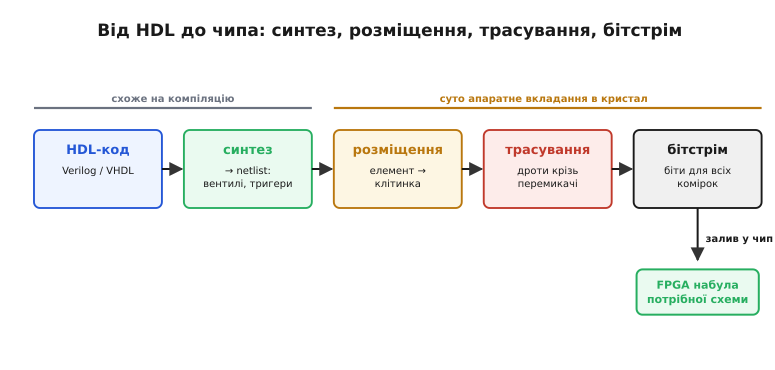
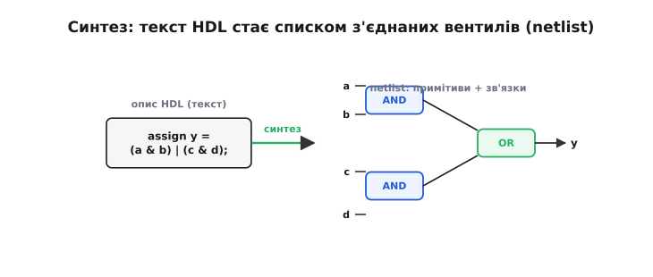
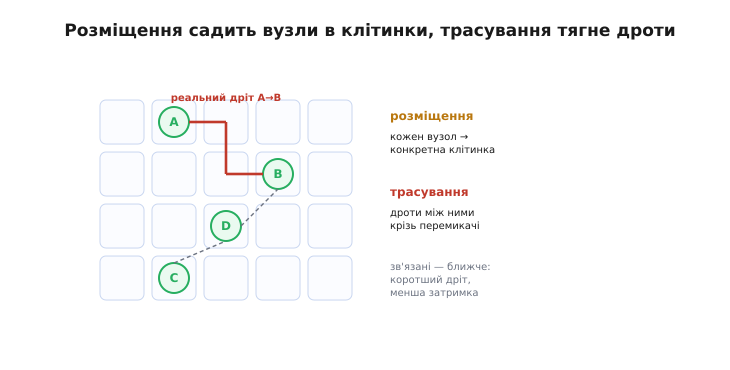
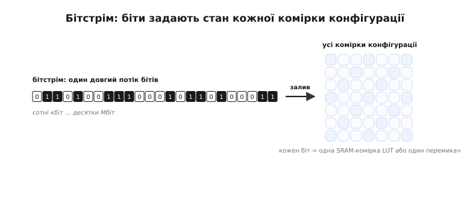
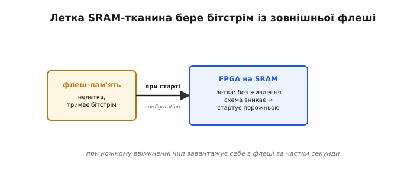

# Потік розробки: синтез → розміщення → трасування → бітстрім

Описати схему можна [мовою HDL](topic:electronics/hdl), але між текстом опису й мікросхемою, що ожила, лежить ціла низка перетворень. У софті компілятор за один крок дає готовий машинний код — і його виконує процесор. Шлях до FPGA довший, бо тут «скомпільоване» ще треба **фізично вкласти** в конкретний кристал: вирішити, у яку з мільйонів клітинок сяде кожен елемент і якими дротами їх з'єднати. Таких кроків у програмуванні взагалі немає — там немає кристала з фіксованою геометрією. Саме вони й визначають усю своєрідність потоку (*flow*, англ. «течія, рух») — і саме звідти приходить половина повідомлень та скарг, які розробник читає, доводячи дизайн до робочого чипа.

### Чотири головні кроки

Опис HDL проходить чотири головні перетворення й стає **бітстрімом** — потоком бітів, що налаштовує кожну клітинку й перемикач чипа.


*Чотири кроки: **синтез** (HDL → список вентилів і тригерів, netlist), **розміщення** (кожен елемент → у конкретну клітинку чипа), **трасування** (прокласти дроти між ними крізь перемикачі) і **бітстрім** (файл бітів для всіх комірок конфігурації), який заливають у FPGA. Перші два кроки нагадують компілятор; останні два — суто апаратне «вкладання» схеми в кристал.*

Головна відмінність від звичної компіляції видна одразу. Програму компілятор перекладає на інструкції — і все, далі їх виконує процесор. Тут після «компіляції» (синтезу) лишається ще **фізична** робота: схему треба **вкласти** в конкретний кристал — у яку з мільйонів клітинок сяде кожен елемент (розміщення) і якими саме дротами їх з'єднати (трасування). Цих кроків у софті немає в принципі, бо там немає кристала з фіксованою геометрією. Найзнайоміший із чотирьох — синтез, із нього й почнімо.

### Синтез: від тексту до списку елементів

**Синтез** (*synthesis*, від грецьк. *sýnthesis* — «складання») найближчий до звичної компіляції. Інструмент «розуміє» опис HDL і будує з нього еквівалентну схему з примітивів: вентилів і тригерів, поки що **без** прив'язки до конкретних місць на чипі.


*Синтезатор перекладає текст HDL (`assign y = (a & b) | (c & d);`) на **netlist** — список з'єднаних примітивів: два вентилі AND, один OR і зв'язки між ними. Це вже конкретна схема, але «схема взагалі» — ще без відповіді, у якій клітинці кристала що опиниться.*

Синтез робить рівно те, що й розумний компілятор, тільки ціль інша. Він розбирає опис, **розпізнає**, де [комбінаційна логіка](topic:electronics/combinational-circuits), а де [регістр](topic:electronics/register), **відкидає** зайве (недосяжну логіку, сталі, які можна згорнути) і видає **netlist** (англ. *net* — «зв'язок, ланцюг» + *list* — «список»): перелік елементів і провідників, що їх з'єднують. Синтез відповідає на питання «**що** будувати»: з яких вентилів і тригерів складається схема. Питання «**де**» він свідомо не чіпає — у нього ще немає поняття конкретної клітинки. На «де» відповідає розміщення — перший із суто апаратних кроків.

### Розміщення й трасування: вкладаємо схему в кристал

Двоє кроків роблять FPGA унікальною. **Розміщення** (*placement*, від англ. *place* — «місце») вирішує, у яку фізичну клітинку сяде кожен елемент netlist'а. **Трасування** (*routing*, від англ. *route* — «маршрут») прокладає реальні дроти між цими клітинками крізь [комутаційні матриці](topic:electronics/inside-fpga).


*Розміщення: кожному елементу (A, B, C, D) обирається конкретна клітинка в сітці. Трасування: між обраними клітинками прокладаються дроти (червоне — реальний шлях A→B) крізь перемикачі маршрутизації. Мета — все вмістити **й** уложитися в таймінг: зв'язані елементи краще класти ближче, щоб дроти були коротші.*

Ці два кроки часто об'єднують абревіатурою **P&R** (*place and route* — «розмістити й протрасувати»), і вони — серце апаратної частини потоку. Тут вирішується доля [**таймінгу**](topic:electronics/fpga-timing): якщо два тісно пов'язані елементи опиняться на протилежних кінцях кристала, дріт між ними буде довгий, затримка велика, і схема не встигне за тактом. Тому інструмент намагається класти взаємодійну логіку поруч, мінімізуючи довжину критичних з'єднань, і водночас **усе вмістити** в наявні клітинки й канали. Це складна оптимізаційна задача (математично споріднена з тим, що роблять при проєктуванні самих чипів), і саме вона зазвичай триває найдовше у великих дизайнах. Коли і розміщення, і трасування завершені, схема повністю «лягла» на конкретний кристал — лишається перетворити цей результат на те, що чип розуміє.

### Бітстрім: образ схеми у вигляді бітів

Підсумок усього потоку — **бітстрім** (*bitstream*, англ. *bit* — «біт» + *stream* — «потік»): один великий файл бітів, що задає стан **кожної** комірки конфігурації — вміст усіх LUT і положення всіх перемикачів маршрутизації.


*Бітстрім — потік бітів (від сотень кілобітів до десятків мегабітів), що заповнює **всі** комірки конфігурації FPGA. Кожен біт задає стан однієї SRAM-комірки LUT або одного перемикача маршрутизації. Залив бітстрім — і однорідна тканина набула вигляду потрібної схеми.*

Бітстрім — це остаточний **образ** схеми, переведений у єдину «мову», яку розуміє кремній: послідовність бітів конфігурації. Уся програмованість FPGA зводиться до двох речей — вмісту [LUT](topic:electronics/lut) і положення [перемикачів маршрутизації](topic:electronics/inside-fpga); бітстрім — це рівно набір значень для **всіх** них разом. Тому його розмір прямо відповідає ємності чипа: що більше клітинок і маршрутів, то довший потік бітів.

**Прикинемо розмір бітстріму для скромного чипа.** Це пояснює, чому під нього беруть саме флеш-пам'ять, а не пару зайвих регістрів. Візьмемо FPGA з 8000 логічними комірками; кожна несе один 4-входовий LUT і трохи конфігурації маршрутизації навколо себе. Один 4-входовий LUT — це таблиця істинності на 2⁴ = 16 біт; нехай на дроти й перемикачі довкола кожної комірки йде ще приблизно стільки ж.

```
LUT:          2⁴             = 16 біт на комірку
маршрутизація ≈                16 біт на комірку
разом:        16 + 16        = 32 біти на комірку
комірок:                       8 000
бітстрім:     8000 · 32      = 256 000 біт
у байтах:     256000 / 8     = 32 000 байт ≈ 32 КБ
```

Навіть для такого скромного чипа це десятки кілобайтів, які мусять прийти **до** першого такту роботи; у старших чипах рахунок іде на мегабіти. Стільки бітів не сховаєш у самій логіці — потрібне окреме нелетке сховище. Лишається одна практична деталь, без якої картина неповна: куди цей бітстрім подіти, адже тканина FPGA, побудована на SRAM, **летка**.

### Звідки береться конфігурація при кожному старті

Тут спливає наслідок ключової властивості пам'яті: [**SRAM летка**](topic:programming/flash-vs-ram) — вона забуває все без живлення. А LUT і перемикачі FPGA побудовані саме на SRAM-комірках. Отже, при кожному ввімкненні чип прокидається **порожнім** — і мусить звідкись узяти свій бітстрім.


*Тканина FPGA на SRAM **летка**: після вимкнення схема зникає. Тому бітстрім тримають у малій **нелеткій флеш-пам'яті** поряд із чипом; при кожному ввімкненні FPGA **завантажує себе** з флеші (configuration, англ. «налаштування») і за частки секунди постає готовою. Окремий клас FPGA має флеш-пам'ять прямо всередині.*

Це пояснює одну з тих [відмінностей FPGA від CPLD](root:embedded/pal-to-fpga). CPLD зазвичай зберігає конфігурацію в собі й готовий до роботи відразу; SRAM-based FPGA — ні, їй потрібна **зовнішня флеш** із бітстрімом і коротка пауза на завантаження при старті. Це невелика плата за гнучкість і колосальну ємність SRAM-тканини: її можна перезаписувати безкінечно, і саме на ній будують найбільші чипи. (Існує й проміжний клас FPGA з вбудованою флеш-пам'яттю — вони стартують миттєво, як CPLD, ціною дещо меншої ємності.) Як саме виглядає цей потік на практиці, з конкретними відкритими інструментами, показує вставка ⚙️ нижче.

> 🔧 **Навіщо це.** Знати потік потрібно, щоб **читати, що кажуть інструменти, і розуміти, де щось пішло не так**. По-перше, **звіти приходять із різних кроків**: синтез скаржиться на двозначності опису й оцінює ресурси; розміщення-трасування каже, чи все вмістилось і чи дотримано [таймінг](topic:electronics/fpga-timing); саме сюди дивляться, коли дизайн «не збирається». По-друге, **P&R — найдовший крок** у великих проєктах, тож терпіння (і запас часу) — частина роботи з FPGA. По-третє, **передбачте флеш для бітстріму** на платі (або візьміть чип із вбудованою), інакше SRAM-based FPGA після ввімкнення просто лишиться порожньою. Розуміючи весь конвеєр, ви перестаєте сприймати інструменти як чорну скриньку й починаєте свідомо вести дизайн від коду до робочого чипа.

> ⚙️ **Загляньте у вставку:** [Відкритий тулчейн: Yosys → nextpnr → бітстрім](root:embedded/fpga-flow/proj-open-toolchain.md) — як ці самі кроки проходять у вільних інструментах для чипів класу iCE40.
