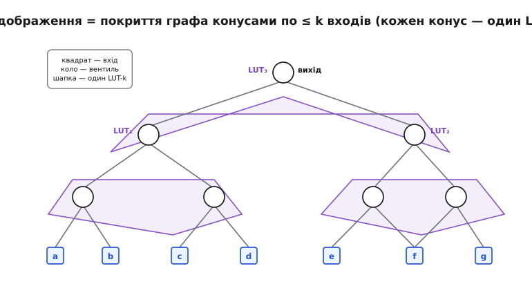
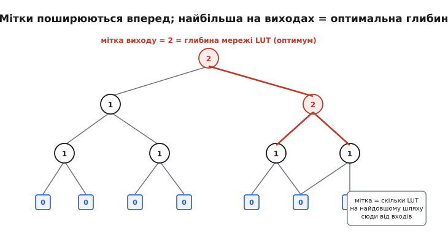
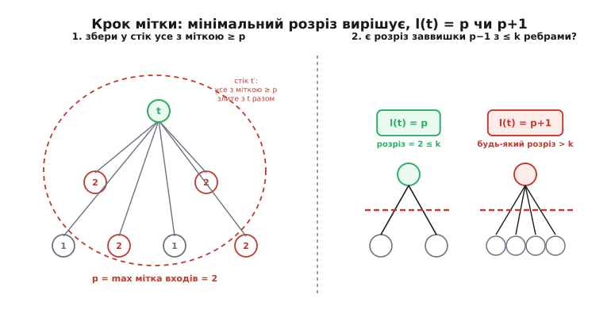

# 🧮 Технологічне відображення в LUT як задача покриття: чому FlowMap мінімізує глибину точно

У кроці про синтез ми дійшли до третьої стадії — технологічного відображення — і сказали дивну на перший погляд річ: **глибину** мережі LUT уміють мінімізувати **точно** й **швидко**, а от **кількість** LUT доводиться зменшувати евристиками. Це справді дивно. У світі оптимізації над схемами майже все важке: класичне технологічне відображення на бібліотеку логічних елементів — **NP-важке**, тобто на нього немає (і, найпевніше, не буде) швидкого точного алгоритму. А тут раптом одна з двох головних цілей — глибина — піддається точному розв'язку за поліноміальний час. Звідки така поблажливість саме до глибини? І чому та сама задача, якщо міряти її кількістю LUT, знову стає важкою?

Ця вставка виводить відповідь від першопричини. Ми не переказуватимемо алгоритм рядок за рядком — ми **побачимо, чому він мусить працювати**: як задача відображення перетворюється на задачу покриття графа, чому глибину можна рахувати вузол за вузлом, як пошук найдешевшого «шва» між вузлом і його передісторією зводиться до класичного мережевого потоку — і чому саме потік дає тут точний оптимум там, де перебір безнадійний. Наприкінці стане зрозуміло й зворотне: чому кількість LUT вислизає з цієї ж машини.

Метод, який ми розбираємо, зветься **FlowMap**. Його 1994 року описали [Джейсон Конг і Юйчжен Дін (Jason Cong, Yuzheng Ding)](https://www.cs.ucla.edu/jason-cong-and-yuzheng-ding-tcfpga-hall-of-fame-paper/) з Каліфорнійського університету в Лос-Анджелесі (UCLA), у *IEEE Transactions on Computer-Aided Design*, т. 13(1), с. 1–12. Результат тоді був сенсацією саме через контраст: **відображення в LUT для мінімальної глибини розв'язується точно за поліноміальний час** — на відміну від NP-важкого відображення на бібліотеку. (Це усталений, багато разів відтворений факт; пізніше стаття увійшла до «зали слави» спільноти FPGA.) Далі — чому це так.

## Означення: що таке «покрити граф блоками LUT-k»

Почнімо з предмета. Після перших двох стадій синтезу схема — це вже не текст, а **граф**: вузли — прості логічні операції (елементарні вентилі: І, АБО, НЕ, XOR), ребра — проводи, що несуть сигнал від виходу одного вузла до входу іншого. Граф цей **орієнтований** (сигнал біжить в один бік, від входів до виходів) і **без циклів** — суто комбінаційна частина не має зворотних петель (петлі в схемі — це регістри, і на час відображення їх «розрізають», лишаючи входи й виходи комбінаційних острівців). Такий граф називають **орієнтованим ациклічним графом** — DAG (англ. *directed acyclic graph*). Якщо потрібне освіження базових понять — вузол, ребро, шлях, ацикл — вони зібрані у статті [теорія графів](root:math-combinatorics/graph-theory). Чому комбінаційна логіка синхронного дизайну — завжди ациклічна (а справжні петлі стану розрізають тригери, що стають межами графа), докладно виведено у [DAG-моделі схеми для аналізу таймінгу](root:hw-digital/critical-path-and-slack/math-static-timing-analysis.md); нам зараз досить самого факту: перед відображенням ми маємо ациклічний граф вентилів.

Тепер згадаймо, з чого складено тканину FPGA. Уся програмована логіка — це **таблиці істинності на k входів**, LUT-k: маленька пам'ять, що для будь-якої булевої функції не більше ніж від k змінних зберігає готову відповідь на всі 2ᵏ комбінацій входів. Що таке LUT детально й чому саме таблиця, а не вентилі — у статті [LUT](root:hw-digital/lut); нам тут важлива одна її властивість, і вона вирішальна: **один LUT-k реалізує будь-яку функцію рівно доти, доки в неї не більше k входів**. Скільки всередині «логіки» — байдуже; чотиривходовий LUT однаково легко втілює і простий `a & b & c & d`, і найзаплутанішу функцію чотирьох змінних. Обмеження єдине — **число входів ≤ k**.

Звідси задача формулюється сама. Ми маємо граф елементарних вентилів; ми маємо будівельний блок, що вміє поглинути будь-який шматок логіки з ≤ k входами. Отже, **технологічне відображення** — це:

```
розрізати граф вентилів на шматки так, щоб
  · кожен шматок мав не більше ніж k входів ззовні,
  · кожен вентиль потрапив хоча б в один шматок,
  · усі шматки разом обчислювали ту саму схему,
і кожен шматок замінити одним LUT-k.
```

Це і є **задача покриття** (covering): накрити весь граф «латками», кожна з яких лягає в один LUT. Латку зручно уявляти не як довільний шматок, а як **конус** (cone): беремо якийсь вузол-вершину, і разом із ним — усю логіку перед ним, аж до тих проводів, що входять у конус ззовні. Ці зовнішні входи конуса — і є входи майбутнього LUT. Умова «≤ k входів» стає умовою «конус **K-допустимий**» (K-feasible): у нього не більше k зовнішніх входів.


*Відображення як покриття. Квадрати — первинні входи схеми, кола — елементарні вентилі, вихід — угорі. Три фіолетові «шапки» — конуси: кожен збирає під собою жмут вентилів так, щоб ззовні в нього входило не більше ніж k = 4 проводи. Кожен конус стане одним LUT-4. Той самий граф можна вкрити конусами багатьма способами — і ось тут починається оптимізація.*

Ключове слово — «багатьма способами». Той самий граф можна порізати на конуси десятками різних розкладок: дрібніші конуси (більше LUT, коротші ланцюги) чи більші (менше LUT, але глибші й ближчі до межі k входів). Усі вони — правильні відображення. Питання не «чи можна вкрити», а «**яке покриття найкраще**». А «найкраще» вимагає міри. Мір дві, і вони тягнуть у різні боки.

## Дві міри якості — і чому вони не заодно

Перша міра — **кількість LUT**. Що менше блоків, то менше кристала з'їдено, то більше місця лишається під решту дизайну. Це міра **площі** (area).

Друга міра — **глибина** (depth): довжина найдовшого ланцюга LUT від будь-якого входу схеми до будь-якого виходу. Чому саме вона критична? Бо кожен LUT на шляху сигналу додає свою затримку: сигнал мусить пройти крізь пам'ять LUT, потім по дроту до наступного LUT, і так ланка за ланкою. Найдовший такий ланцюг — це **критичний шлях** комбінаційної логіки, і саме він визначає, як швидко може цокати такт. Три LUT поспіль — три затримки поспіль; скоротив ланцюг до двох — виграв цілу затримку на найповільнішому шляху. Глибина мережі LUT прямо перекладається у **максимальну частоту** дизайну.

Отут і криється конфлікт. Уявімо ланцюжок вентилів. Можна вкрити його багатьма дрібними LUT — глибина буде велика (багато ланок), зате кожен LUT крихітний. А можна **згорнути** кілька вентилів поспіль в один великий LUT-k — і одразу вкоротити ланцюг: те, що було трьома ланками, стало однією. Менша глибина! Але такий жадібний до глибини хід **марнує входи**: великий конус хапає під себе багато вентилів, його межа розпухає до самих k входів, і сусіднім конусам дістається менше простору для згортання — а часом та сама підлогіка потрапляє одразу в кілька конусів і **дублюється**, роздуваючи число LUT. І навпаки: ощадливе, з найменшою кількістю LUT, покриття залюбки лишить ланцюг довгим, аби не плодити блоки.

Тобто **мінімум глибини й мінімум кількості LUT — це, взагалі кажучи, різні розкладки**, і домогтися обох одночасно не можна: жадібність до одного б'є по другому. Доводиться вибирати головну ціль. Для більшості дизайнів головна — **швидкодія**, тобто глибина: спершу зробити схему максимально швидкою, а вже потім, **не псуючи цієї глибини**, підібрати площу. Саме таку постановку й розв'язує FlowMap: **дай мінімальну можливу глибину точно, а число LUT мінімізуй наскільки вийде, не жертвуючи глибиною**.

І ось перше диво, яке ми зобов'язані пояснити. Здавалося б, шукати найкраще покриття серед експоненційно багатьох — приречена справа: варіантів розкладки стільки, що жоден перебір не впорається (це та сама «неможливість перебору», що переслідує весь потік FPGA). Класичне відображення на бібліотеку вентилів справді NP-важке. Але для **глибини** в LUT є лазівка, якої нема в бібліотечному випадку. Знайдімо її.

## Інтуїція: глибину можна рахувати вузол за вузлом

Секрет — у тому, що **глибина розкладається локально**. Це властивість не будь-якої цілі, а саме глибини, і саме вона все вирішує. Пояснімо на очах.

Припишемо кожному вузлу графа число — **мітку** l(v): це **мінімальна можлива глибина LUT-мережі, що обчислює сигнал у цьому вузлі**, від первинних входів схеми до нього. Для самих первинних входів схеми глибини нема — сигнал уже тут, крізь жоден LUT він не проходив; ставимо їм мітку 0. А тепер запитаймо: якщо ми знаємо мітки **всіх** вузлів, що стоять перед деяким вузлом t, чи можемо порахувати мітку самого t?

Так — і в цьому вся сила. Мітка t каже: скільки LUT максимум на найдовшому шляху до t. Останній із цих LUT — той, що видає сам сигнал t; назвімо його **корінний LUT для t**. Він накриває конус із вершиною t. Хай цей конус має якісь зовнішні входи; кожен такий вхід — це вихід іншого вузла, зі своєю вже відомою міткою. Глибина шляху до t через цей LUT = (найбільша мітка серед входів конуса) + 1 (додається сам корінний LUT). А глибина всієї мережі до t — це найкращий (найменший) такий результат серед **усіх можливих** конусів із вершиною t:

```
l(t) = min по всіх K-допустимих конусах C з вершиною t
        [ 1 + max_{v — вхід конуса C} l(v) ]
```

Читається так: «мітка t — це один LUT плюс найглибший із його входів, і ми обираємо той конус, у якому цей максимум найменший». Простими словами: щоб t був якомога «мілкіший», треба знайти для нього такий конус, чиї входи **самі якомога мілкіші**.

Оце і є та локальність. Глибина мережі не вимагає дивитися на всю схему разом — вона **накопичується вперед**, від входів до виходів, вузол за вузлом. Порахував мітки всіх попередників — можеш порахувати мітку наступного. Це нагадує, як заповнюють таблицю в динамічному програмуванні: кожна клітинка виражається через уже пораховані. І, що вирішально, коли всі мітки пораховані, **мітка на виході схеми і є мінімальна глибина всієї мережі LUT** — точний оптимум, не наближення.


*Мітки поширюються вперед. Первинні входи мають мітку 0. Кожен внутрішній вузол дістає мітку «1 + найглибший вхід його найкращого конуса». Мітки ростуть від входів до виходу; **найбільша мітка на виходах і є оптимальна глибина** мережі LUT — тут 2 (червона гілка — той шлях, що задає глибину). Оптимум порахований локально, без перебору покриттів усієї схеми.*

Але стоп — у формулі мітки сидить «min по всіх K-допустимих конусах». А конусів із вершиною t може бути експоненційно багато: що глибше в передісторію ми забираємося, то більше способів окреслити межу конуса. Перебирати їх усі — знову приреченість. Уся хитрість FlowMap у тому, що цей мінімум **не треба перебирати**: його можна знайти одним точним обчисленням. І тут на сцену виходить мережевий потік.

## Формальний апарат: мінімум зводиться до мінімального розрізу

Придивімося до формули мітки уважніше. Мітки — цілі числа. Найкраще, на що ми можемо сподіватися для t, — щоб його мітка не перевищила мітки його найглибшого попередника, тобто щоб корінний LUT «сховав» усе найглибше під собою й не додав нового рівня. Позначмо через **p** найбільшу мітку серед **усіх** вузлів, що ведуть до t (усієї його передісторії, input(t)). Тоді, доводять Конг і Дін, мітка t може набути лише одне з двох значень:

```
l(t) = p        якщо існує K-допустимий конус із вершиною t,
                у який НЕ потрапляє жоден вузол з міткою p як вхід
                (усі вузли мітки p сховані ВСЕРЕДИНІ конуса);

l(t) = p + 1    інакше.
```

Чому лише ці два? Менше за p мітка t бути не може: серед його передісторії є вузол глибини p, і сигнал t від нього залежить — жоден корінний LUT не зробить t мілкішим за найглибше, від чого t по-справжньому залежить. А більше за p + 1 не буває ніколи: у найгіршому разі ми беремо крихітний конус (сам вузол t зі своїми безпосередніми входами) — він додає рівно один LUT поверх максимальної мітки входів, тобто p + 1. Отже, або пощастило сховати все найглибше в один конус і лишитися на p, або ні — і тоді p + 1. **Уся задача мітки звелася до одного питання «так/ні»**: чи можна побудувати K-допустимий конус вершини t, який ховає всі вузли мітки p всередині, не випускаючи жодного з них у входи?

Оце «так/ні» і є те, що вирішує мережевий потік. Дивіться, як точно збігаються два світи.

Що таке «сховати всі вузли мітки p всередині конуса»? Конус — це деяка множина вузлів навколо t; його **входи** — ребра, що перетинають межу конуса ззовні всередину. Ми хочемо межу, яка (а) лишає всі вузли мітки p з боку конуса й (б) має не більше k вхідних ребер. Тобто ми шукаємо **лінію розрізу** графа на дві частини — «сторону джерел» (вхідну) і «сторону конуса» (з t та всіма вузлами мітки p) — таку, що ребер, які її перетинають, **не більше k**. У теорії графів це називають **розрізом** (cut), а число ребер, що його перетинають, — **пропускною здатністю розрізу**. Ми шукаємо розріз пропускної здатності ≤ k, який лишає всі вузли мітки p на потрібному боці. Висоту такого розрізу (максимальну мітку на вхідному боці) ми якраз і хочемо втримати на p − 1, щоб мітка t вийшла p.

А тепер — фундаментальна теорема, що робить усе поліноміальним. **Теорема про максимальний потік і мінімальний розріз** (max-flow min-cut): у мережі з пропускними здатностями ребер **найбільший потік, який можна проштовхнути від джерела до стоку, дорівнює найменшій пропускній здатності розрізу**, що відділяє джерело від стоку. Іншими словами: щоб дізнатися, наскільки «вузьке» найвужче місце між двома точками графа, не треба перебирати всі можливі розрізи — досить **пустити потік** і подивитися, скільки його пролізе. Максимальний потік знаходять швидко, за поліноміальний час, шляхом пошуку **збільшувальних шляхів** (augmenting paths): раз за разом шукаємо в графі шлях від джерела до стоку, уздовж якого ще є вільна пропускна здатність, і «наливаємо» по ньому потік, аж поки жодного вільного шляху не лишиться. Скільки налили — стільки й максимальний потік, і він дорівнює мінімальному розрізу.

Складімо два світи докупи:

```
конус із ≤ k входами        ⇄   розріз пропускної здатності ≤ k
входи конуса                 ⇄   ребра, що перетинають розріз
«сховати вузли мітки p»      ⇄   лишити їх на боці стоку
чи існує такий конус?        ⇄   чи мінімальний розріз ≤ k?
знайти мінімальний конус     ⇄   max-flow: скільки потоку пролізе
```

Питання «чи є K-допустимий конус, що ховає все найглибше» перетворилося на «чи мінімальний розріз між джерелом і стоком не перевищує k» — а на це відповідає одне обчислення максимального потоку. Пролізло **не більше k** одиниць потоку — розріз ≤ k існує, конус є, **l(t) = p**. Пролізло **більше k** — хоч як ріж, вузьким місцем менше ніж k не обійтися, конуса нема, **l(t) = p + 1**. Перебір експоненційної кількості конусів замінено одним точним потоком.


*Крок обчислення мітки. **Ліворуч**: беремо передісторію вузла t; p — найбільша мітка серед входів (тут 2). Усі вузли мітки p разом із t **зливають в один стік** t′ — щоб потік був змушений відрізати їх усі одним махом. **Праворуч**: рахуємо мінімальний розріз між джерелами й цим стоком. Якщо він ≤ k — конус, що ховає все найглибше, існує, і **l(t) = p**. Якщо будь-який розріз ширший за k — такого конуса нема, і **l(t) = p + 1**. Одне обчислення потоку замість перебору всіх конусів.*

Лишилися дві технічні деталі, без яких зведення не було б точним, — і обидві прості та гарні.

**Перша: злиття стоку.** Ми хочемо втримати на боці конуса **всі** вузли мітки p **одночасно**. Якби ми лишили їх окремими, потік міг би відрізати одні, а інші випустити у входи. Тому всі вузли мітки p, разом із самим t, **зливають в один спільний стік** t′ (стягують у єдину точку). Тепер будь-який розріз, що відділяє джерела від t′, змушений лишити **весь** цей злитий вузол на боці стоку — а отже, сховати всі вузли мітки p разом. Точно те, чого ми хотіли.

**Друга: розщеплення вузлів.** Класична теорема max-flow min-cut рахує розріз по **ребрах** — обмежує, скільки *ребер* його перетинають. А нам треба обмежити входи конуса, тобто, по суті, скільки *вузлів* стоять на межі. Щоб перевести обмеження з вузлів на ребра, кожен вузол графа **розщеплюють надвоє**: на «вхідну половинку» і «вихідну половинку», з'єднані одним внутрішнім ребром **одиничної пропускної здатності**; усі попередні ребра графа роблять «нескінченними» (їх різати заборонено). Тепер потік може перетнути межу лише крізь ці одиничні внутрішні ребра — по одному на вузол, — і **пропускна здатність розрізу дорівнює числу вузлів на межі**. Обмеження «≤ k входів» стало обмеженням «розріз ≤ k» рівно в тому вигляді, який розуміє потік. (Саме цю пару прийомів — злиття високо-мічених вузлів у стік і розщеплення вузлів на одиничні ребра — і описують Конг та Дін як серце кроку мітки.)

Отепер усе стало на місця. Обробляємо вузли в топологічному порядку (кожен — після всіх своїх попередників, бо граф ациклічний). Для кожного вузла t: беремо p = максимум міток передісторії, зливаємо вузли мітки p у стік, розщеплюємо вузли, рахуємо один максимальний потік — і за його величиною ставимо l(t) = p або p + 1. Пройшли всі вузли — маємо мітки скрізь; **найбільша мітка на виходах — точна мінімальна глибина**. І весь цей прохід — поліноміальний: вузлів скінченно, на кожен — один потік, кожен потік — поліноміальний.

## Формальний апарат, друга половина: від міток до самих LUT

Мітки дали нам **число** — оптимальну глибину. Але число саме собою не є розкладкою: нам потрібні конкретні LUT. Тут FlowMap робить другу фазу — і вона майже безкоштовна, бо вся потрібна інформація вже здобута під час рахування міток.

Пригадаймо: коли ми ставили мітку вузлу t, ми (через потік) знаходили **конкретний розріз** — ту саму межу K-допустимого конуса, що дала мінімальну глибину. Цей конус — готовий рецепт корінного LUT для t: його вершина — t, його входи — ребра розрізу, його вміст — уся логіка всередині межі, згорнута в одну таблицю істинності. Отже, **кожен обчислений під час фази міток розріз — це один майбутній LUT**.

Друга фаза складає з цих конусів фактичну мережу LUT, ідучи **назад** — від виходів до входів. Беремо вихід схеми: його корінний конус (уже відомий із фази міток) стає LUT; входи цього конуса — це виходи інших вузлів. Для кожного такого входу, якщо він ще не «покритий», беремо його корінний конус — ще один LUT; його входи знову ведуть углиб. Так, розкручуючи конуси від виходів, ми породжуємо рівно ті LUT, що потрібні, і зупиняємося, дійшовши до первинних входів. Оскільки кожен корінний конус побудований так, що додає не більше одного рівня понад найглибший свій вхід, **уся зібрана мережа має глибину точно таку, як найбільша мітка** — тобто оптимальну. Фаза перша довела, що менше не можна; фаза друга пред'явила розкладку, що цю межу досягає. Разом — точний оптимум за глибиною, з доказом і конструкцією.

**Порахуймо мітки на маленькому ланцюжку — щоб відчути, як народжується глибина.** Візьмемо просту схему й k = 4, і пройдімо вузли вперед:

```
Схема:   входи a,b,c,d,e   →   g1 = a&b   →   g2 = g1|c
         →   g3 = g2^d   →   g4 = g3&e   (g4 — вихід)

l(a)=l(b)=l(c)=l(d)=l(e) = 0        ← первинні входи

l(g1): input = {a,b}, p = 0
       конус {g1} має входи a,b (2 ≤ 4), ховає все мітки 0? 
       вузлів мітки 0 серед ВХОДІВ конуса не сховати (вони і є входи),
       але p=0 — нижче нема куди; корінний LUT дає 0+1
       l(g1) = 1

l(g2): input = {g1,a,b,c}, p = max(1,0,0,0) = 1
       чи є конус вершини g2 з ≤4 входів, що ховає g1 (мітку 1)?
       конус {g2,g1} має входи a,b,c → 3 ≤ 4, g1 всередині ✓
       l(g2) = p = 1        ← g1 і g2 злилися в ОДИН LUT-4

l(g3): input = {g2,g1,a,b,c,d}, p = 1
       конус {g3,g2,g1} має входи a,b,c,d → 4 ≤ 4, усе мітки 1 всередині ✓
       l(g3) = p = 1        ← g1,g2,g3 — досі один LUT-4 (рівно 4 входи!)

l(g4): input = {g3,...,e}, p = 1
       конус {g4,g3,g2,g1} мав би входи a,b,c,d,e → 5 > 4  ✗
       ширший за 4 не влазить; сховати всю мітку-1 не вийде
       l(g4) = p + 1 = 2

Глибина мережі = мітка виходу = l(g4) = 2.
Розкладка: LUT₁ = {g1,g2,g3} (входи a,b,c,d), LUT₂ = {g4} (входи LUT₁, e).
```

Чотири вентилі поспіль лягли всього у **два** LUT-4 і глибину **2**, а не в чотири LUT глибини 4, як дав би наївний «один вентиль — один LUT». І мітки показали це **точно**: щойно конус уперся в стелю k = 4 входів (на g4 їх стало б 5), народився новий рівень — і жодним іншим покриттям глибини 2 не побити, бо п'ять різних первинних входів фізично не влазять в один LUT-4. Ось як локальний рахунок міток видає глобальний оптимум.

> 🔧 **Навіщо це.** Розуміння цієї машини прямо змінює те, як ви пишете HDL. По-перше, ви більше не боїтеся «широкої» логіки: синтезатор із FlowMap-подібним відображенням **сам** згорне ланцюжок дрібних операцій в один LUT, поки входів ≤ k, — тож поділ виразу на купу проміжних сигналів не додає глибини, інструмент їх зіллє. По-друге, стає видно **справжнє** джерело глибини: не кількість операцій, а **скільки різних входів** сходиться до результату. Функція від 5 незалежних сигналів у тканині LUT-4 **не може** мати глибину 1 — фізично; хочете мілкіше — зменшуйте кількість входів, що сходяться (розбивайте дерево, а не ланцюг). По-третє, ви тепер знаєте, чому число k («скільки входів у LUT цієї родини») — головна архітектурна характеристика: більший k робить конуси місткішими й мережі мілкішими. Це вже не магія інструмента, а наслідок формули мітки.

## Де в темі це працює — і чому кількість LUT лишається евристикою

Повернімося до того, з чого почали крок про синтез: третя стадія, технологічне відображення, перетворює оптимізований граф вентилів на мережу LUT-k. Тепер видно, що саме там відбувається. Інструмент **не гадає** і **не перебирає** — він рахує мітки одним проходом уперед (кожна мітка — один максимальний потік), дістає точну мінімальну глибину, а тоді розкручує конуси назад у конкретні LUT. Коли звіт синтезу каже вам «логічних рівнів: 6», за цим числом стоїть саме такий рахунок — це доведений мінімум логічних рівнів для вашого графа за даного k, а не випадковий результат.

І ось чому та сама машина **не** дає мінімуму LUT. Уся точність FlowMap трималася на одній властивості глибини: вона **розкладається локально** й **накопичується монотонно вперед** — мітку вузла визначають лише його попередники, і найкращий вибір для нього (найглибший вхід — якнайменший) не залежить від того, що робитимуть вузли попереду. Тому жадібний уперед рахунок дає глобальний оптимум. Кількість LUT такої властивості **не має**. Рішення «згорнути ці вентилі в один великий конус чи лишити окремими» відлунює по всьому графу: великий конус може **продублювати** підлогіку, яку інший конус теж захопить, і тоді сумарно LUT побільшає; а який вибір найкращий тут — залежить від виборів деінде, бо конуси **діляться** спільними вузлами. Немає напрямку, уздовж якого оптимум «накопичувався» б без озирань. Саме через ці перехресні залежності мінімізація числа LUT — **NP-важка**: швидкого точного алгоритму на неї немає (як і на класичне бібліотечне відображення). Тож FlowMap робить, що може: серед розкладок **оптимальної глибини** він жадібно **збільшує обсяг кожного конуса** (аби покрити більше вентилів одним LUT) і застосовує кілька постобробок, що прибирають зайві дублікати, — але це евристики, наближення, а не гарантований мінімум. Глибину він гарантує; площу — лише покращує.

Ця асиметрія — не вада FlowMap, а глибокий факт про самі задачі. **Глибина локальна — тому точна; площа глобальна — тому важка.** Пізніші алгоритми (їх низка виросла прямо з FlowMap) стараються тиснути площу сильніше, не псуючи здобутої глибини, але фундаментальна межа лишається: одну ціль природа дозволяє взяти точно, другу — ні. Коли наступного разу побачите в звіті синтезу і «логічних рівнів», і «використано LUT», ви читатимете їх по-різному свідомо: перше число — доведений оптимум; друге — найкраще, що змогла евристика, і саме там ще є куди тиснути ручними прийомами (спільні підвирази, ресурсне ділення, обережність із дублюванням логіки).

Ширший контекст мінімізації логіки — навіщо взагалі спрощують булеві функції перед відображенням і як це пов'язано з класичними методами — зібраний у статті [оптимізація синтезу](root:hw-digital/synthesis-optimization). Але серцевину технологічного відображення в LUT ви тепер тримаєте від першопричини: покриття графа конусами, локальність глибини, зведення кроку мітки до мінімального розрізу мережевим потоком — і чіткий кордон, за яким точність поступається евристиці.
