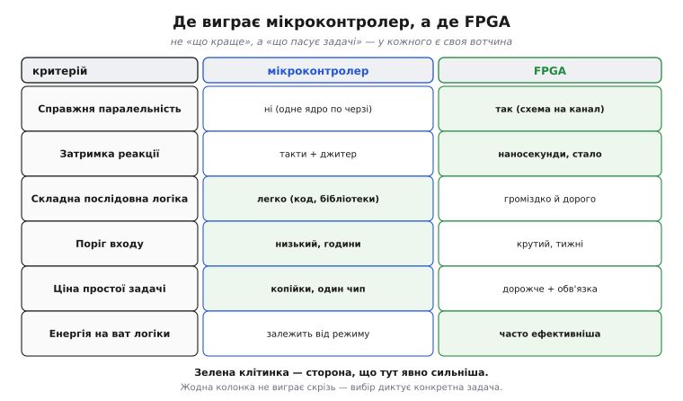
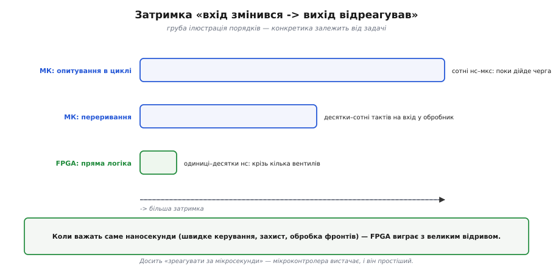
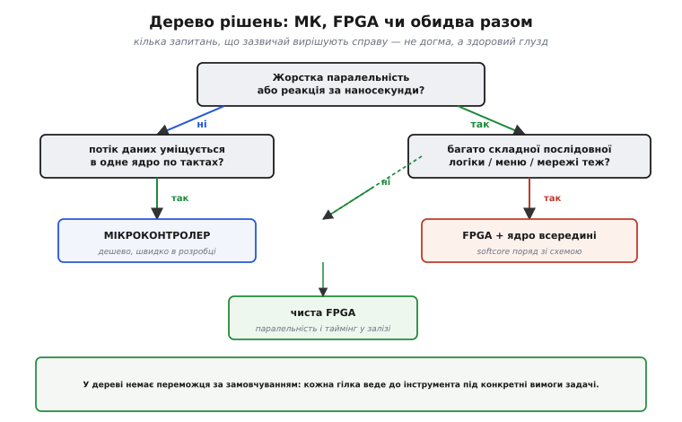

# FPGA чи мікроконтролер: чесні критерії вибору

На старті майже кожного проєкту постає питання: **FPGA чи мікроконтролер?** Його часто ставлять як «що краще», і саме така постановка хибна. Краще — **те, що пасує задачі**: у кожного інструмента є царина, де він явно сильніший, і царина, де він явно зайвий. Тут немає агітації за жоден бік — є **чесні критерії**, за якими ви самі зважите конкретний випадок. Ключові властивості обох зведено в одну порівняльну рамку, до неї додано те, про що порівняння швидкодії зазвичай мовчать, — ціну й поріг входу, — а наприкінці та сама задача розв'язана двома способами, щоб різниця стала відчутною на дотик.

Два слова про назви. **Мікроконтролер** (МК) — це процесорне ядро, пам'ять і периферія на одному кристалі: цілий маленький комп'ютер, що виконує програму **інструкцію за інструкцією**. **FPGA** (англ. *field-programmable gate array* — «вентильна матриця, програмовна в полі», тобто вже у користувача, а не на заводі) — це не процесор, а поле з логічних блоків і з'єднань, з якого ви **складаєте власну цифрову схему**. Звідси й уся різниця нижче.

### Порівняння за критеріями


*Шість критеріїв пліч-о-пліч. Справжня паралельність: МК — ні (одне ядро по черзі), FPGA — так (своя схема на канал). Затримка: у МК такти плюс джитер, у FPGA наносекунди й стало. Складна послідовна логіка: МК легко (код, бібліотеки), FPGA громіздко. Поріг входу: у МК низький (години), у FPGA крутий (тижні). Ціна простої задачі: МК копійки, FPGA дорожче плюс обв'язка. Зелене — де сторона явно сильніша; жодна колонка не виграє скрізь.*

Таблицю варто читати не як змагання, а як **розподіл ролей**. Перші дві осі — вотчина FPGA, і причина в самій природі [програмовної логіки](root:hw-digital/programmable-logic): справжня паралельність і стала наносекундна затримка недосяжні для послідовного ядра, яке хоч-не-хоч робить одне за одним. Решта осей — на боці мікроконтролера. Складна **послідовна** логіка (розбір протоколу, меню, файлова система, мережа) природно лягає на код із готовими бібліотеками, а на FPGA вимагала б громіздкого опису [скінченних автоматів](root:hw-digital/finite-state-machines). **Поріг входу** в МК незрівнянно нижчий: працездатну прошивку пишуть за години, тоді як опанування [потоку синтезу FPGA](root:embedded/fpga-flow) і [мислення схемами на HDL](root:hw-digital/hdl) забирає тижні. І **ціна**: простий мікроконтролер коштує копійки й не потребує зовнішньої обв'язки, тоді як FPGA дорожча сама по собі й тягне ще й оточення. Найнаочніше ця двоїстість видно на одній осі — затримці.

### Один наочний приклад: затримка реакції

Затримка реакції — той випадок, де перевага FPGA не на відсотки, а в рази, тож на ній зручно показати порядки величин.


*Груба ілюстрація порядків; конкретика залежить від задачі. МК з опитуванням у циклі: сотні нс–мкс, поки дійде черга до перевірки. МК через переривання: десятки–сотні тактів на вхід у обробник. FPGA з прямою логікою: одиниці–десятки нс — лише крізь кілька вентилів. Коли важать саме наносекунди, FPGA виграє з великим відривом.*

Тут добре видно, **де проходить вододіл**. Якщо задачі досить зреагувати «за мікросекунди» — спалахнути світлодіодом на натискання, опитати давач, оновити дисплей, — мікроконтролер це робить легко, і його простота й дешевизна переважують. Та коли реакція потрібна **за наносекунди й зі сталою затримкою** — швидке аварійне відключення, обробка фронтів швидкого сигналу, точне багатоканальне керування, — навіть переривання МК завеликі й «плавають», і виручає пряма логіка FPGA. Затримка — лише одна вісь, але вона добре ілюструє загальний принцип: збігаються вимоги задачі з природною силою інструмента — він виграє; ні — програє. Поряд із нею стоять ще дві осі, які новачки часто недооцінюють: **ціна** й **поріг входу**.

### Ціна, енергія й поріг входу — те, про що мовчать порівняння швидкодії

Розмови про FPGA зазвичай крутяться навколо швидкості, та на практиці проєкт частіше вбивають **інші** три речі — гроші, енергія й час на опанування.

**Ціна.** Простий мікроконтролер коштує копійки й самодостатній: вставив у плату — і він працює. Дрібний 8-розрядний МК іде за менш ніж долар, потужний 32-розрядний — за одиниці доларів. FPGA дорожча сама по собі (початкові чипи — від десятка доларів, верхні моделі — сотні), та головне — вона **тягне за собою обв'язку**: окрему флеш для бітстріму (англ. *bitstream* — «потік бітів» конфігурації), який [потік синтезу](root:embedded/fpga-flow) щоразу вантажить у чип на старті, часто кілька різних напруг живлення з власними стабілізаторами, ретельне розведення плати під швидкі сигнали. Реальна ціна рішення на FPGA — це не лише чип, а вся ця інфраструктура; для дрібносерійного чи бюджетного пристрою вона нерідко вирішує справу на користь МК ще до будь-яких технічних аргументів.

**Енергія.** Тут картина не однобока. Сама собою FPGA не «економніша» й не «ненажерливіша» — усе залежить від навантаження. На **ват корисної логіки** паралельне залізо часто ефективніше: те, на що процесор витратив би мільйони тактів (а отже, й енергію на кожен такт), FPGA робить кількома спеціалізованими блоками за раз. Але порожня чи слабко завантажена FPGA все одно споживає помітний струм спокою на саму свою тканину й конфігурацію, тоді як мікроконтролер у режимі сну опускається до мікроамперів. Тому для пристрою «прокинувся, швидко щось зробив, заснув на годину» — типова автономна задача на батарейці — МК майже завжди ощадливіший, а перевага FPGA в енергоефективності розкривається лише під **постійним важким паралельним навантаженням**.

**Поріг входу** (англ. *barrier to entry* — «бар'єр на вході»), а з ним і час до робочого пристрою. Працездатну прошивку для МК пишуть готовими бібліотеками за години, відлагоджують звичним покроковим налагоджувачем, а помилку виправляють перезаливанням за секунди. Дорога на FPGA крутіша: треба перебудувати мислення з «кроків» на «схему», що його вимагає [опис на HDL](root:hw-digital/hdl), опанувати весь [потік синтезу й розміщення-трасування](root:embedded/fpga-flow) (англ. *place and route*, P&R — «розмістити й прокласти зв'язки»), а кожна збірка великого дизайну триває довго, і відлагоджувати паралельне залізо складніше, ніж читати лог послідовної програми. Цей **час на опанування й ітерацію** — реальна стаття витрат проєкту, і його легко недооцінити, надивившись на самі лиш цифри швидкодії.

> 🔧 **Навіщо це.** Поріг входу й ціна — це гроші й тижні, які закладають **до** першого працездатного макета. Недооцінили їх — і FPGA, узята «бо швидша», з'їдає місяць на опанування й подвоює собівартість плати там, де МК за тисячу гривень і два дні розробки закрив би задачу повністю.

### Та сама задача двома способами

Щоб різниця перестала бути абстрактною, розв'яжімо одну конкретну задачу обома інструментами. **Умова: на чотирьох незалежних входах ловимо наростальний фронт і на відповідних чотирьох виходах видаємо рівно один імпульс; усі чотири канали мусять реагувати незалежно й без впливу один на одного.** Це типове «швидке детерміноване керування»: саме той клас, де вибір інструмента вирішує все.

На мікроконтролері всі чотири канали обслуговує **одне ядро**, тож вони неминуче стають у чергу. Найчесніший спосіб — переривання на зміну стану входу:

**МК: один обробник на всі канали, по черзі.**
```c
/* GPIO-переривання на будь-який наростальний фронт чотирьох входів.
   Ядро одне, тож канали обробляються послідовно, один за одним. */
volatile uint8_t prev;                 /* попередній стан входів IN0..IN3 */

void EXTI_IRQHandler(void) {           /* викликається на зміну входу */
    uint8_t now = read_inputs();       /* біти 0..3 — рівні IN0..IN3 */
    uint8_t rise = now & ~prev;        /* де 0 -> 1: наростальні фронти */
    prev = now;

    for (int ch = 0; ch < 4; ch++)     /* перебір каналів — по одному за такт */
        if (rise & (1u << ch))
            pulse_out(ch);             /* видати імпульс на OUTch */
}
```
Поки ядро ще тільки заходить в обробник (а це десятки–сотні тактів на збереження контексту й диспетчеризацію), фронт уже минув; якщо два входи смикнулися майже водночас, другий чекає, доки `for` дійде до нього. Реакція виходить на рівні **тактів і мікросекунд**, та ще й «плаває» залежно від того, що ядро робило в мить фронту. Для повільних подій це бездоганно. Для наносекундних — ні.

На FPGA кожен канал отримує **власну крихітну схему**, і всі чотири працюють **одночасно**, бо це фізично окреме залізо, а не черга на спільному ядрі. Один і той самий опис застосовується до всіх каналів паралельно:

**FPGA: чотири однакові канали, усі разом.**
```verilog
// Детектор фронту на кожен канал; чотири копії працюють одночасно.
// Жоден канал не чекає на інший — це різні ділянки кремнію.
module edge_pulse #(parameter N = 4) (
    input  wire           clk,
    input  wire [N-1:0]   din,         // IN0..IN3
    output reg  [N-1:0]   pulse        // OUT0..OUT3, імпульс на 1 такт
);
    reg [N-1:0] prev;
    always @(posedge clk) begin
        pulse <= din & ~prev;          // усі N каналів обчислюються паралельно
        prev  <= din;
    end
endmodule
```
Затримка від фронту до виходу — це **один такт плюс прохід крізь кілька вентилів**, тобто одиниці–десятки наносекунд, і вона **однакова для всіх чотирьох каналів** незалежно від того, скільки з них спрацювало водночас. Те, що на МК було послідовним `for` по каналах, тут просто **немає чого серіалізувати**: `din & ~prev` — це N паралельних логічних схем, а не цикл. Ось чому на жорстко паралельній задачі з наносекундними вимогами FPGA виграє не на відсотки, а структурно: вона не «швидше робить чергу» — вона **прибирає саму чергу**.

> ⚙️ Обидва рішення цієї задачі мають свої тонкощі, без яких вони працюватимуть лише в демо: на МК — брязкіт, втрачені між читаннями фронти й джитер від інших переривань; на FPGA — обов'язкова синхронізація асинхронного входу проти метастабільності. Повний розбір обох із пастками — у вставці [Чотири канали детектора фронту: МК проти FPGA](root:embedded/fpga-vs-mcu/proj-edge-pulse.md).

### Орієнтовне дерево рішень

Усі осі зводяться в кілька запитань, що зазвичай вирішують справу. Це не догма, а здоровий глузд, оформлений як послідовність розвилок.


*Грубий орієнтир. Немає жорсткої паралельності й наносекундної реакції, а потік уміщується в одне ядро? — мікроконтролер. Потрібні паралельність чи наносекунди? Якщо поряд є й купа складної послідовної логіки — FPGA з процесором усередині (softcore); якщо ні — чиста FPGA. Вибір диктує задача, а не мода.*

Стартова розвилка — головна: **чи є жорстка паралельність або потреба в наносекундній реакції**, тобто саме те, заради чого існує [програмовна логіка](root:hw-digital/programmable-logic)? Якщо ні, і задача вкладається в послідовне ядро по тактах, — мікроконтролер простіший, дешевший і швидший у розробці; шукати тут FPGA означало б платити складністю ні за що. Якщо ж так — наступне питання: **чи багато поряд звичайної послідовної логіки** (меню, мережа, конфігурація)? Якщо її чимало, найкраще рішення — не «або-або», а **обидва разом**: FPGA для паралельного заліза плюс процесор **усередині неї** для рутини. Такий процесор, зібраний із логіки самої FPGA, називають [softcore-процесором](root:hw-digital/soft-core) (англ. *soft core* — «м'яке ядро», бо воно не вилите в кремнії, а описане, як і решта схеми). А коли потрібна тільки паралельна швидкість без рутини — чиста FPGA. Цю гібридну ідею довели до промислового рівня **системи на кристалі**: чипи на кшталт Xilinx Zynq чи Intel SoC FPGA фізично поєднують тверде процесорне ядро (ARM) і тканину FPGA в одному корпусі — тверде ядро тягне операційну систему й мережу, тканина — паралельне залізо. У дереві немає переможця за замовчуванням: кожна гілка веде до інструмента під **конкретні** вимоги.

> 🔧 **Навіщо це.** Цей вибір ви робите на старті **кожного** серйозного проєкту, і ціна помилки висока — невдалий інструмент тягне тижні переробок. Тримайте в голові суть: **мікроконтролер — типова відповідь** (дешево, просто, гнучко через код), і відходити від неї варто лише за вагомої причини; **FPGA — коли задача жорстко паралельна або вимагає наносекундної детермінованої реакції**, бо саме цього послідовне ядро дати не може; **обидва разом** — коли поряд зі швидким залізом потрібна й «звичайна» логіка, для якої зручний [softcore-процесор](root:hw-digital/soft-core) або готова система на кристалі. Чесно зваживши критерії, ви оберете не модне, а **доречне**.
