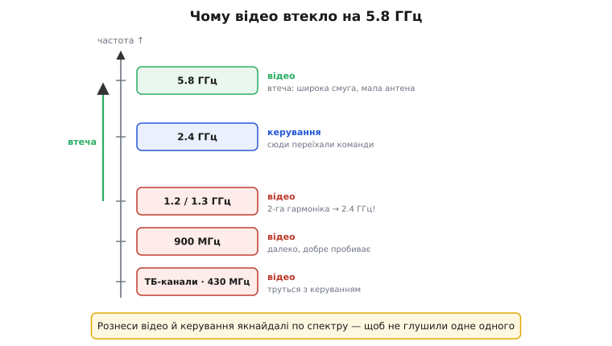
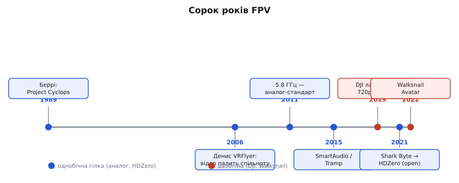

# 📜 Як FPV виросло з охоронних камер і телевізійного радіо — і прийшло до цифри

У головній темі ми весь час говорили про FPV так, наче дві числові сили — затримка й якість — від початку були законом природи. Камера видає сигнал, радіо несе його «зараз», цифра бореться з кодеком за мілісекунди. Усе це правда, але правда без коренів. А корені тут несподівані й повчальні: уся індустрія, де сьогодні крутяться DJI, HDZero й Walksnail, виросла не з авіації й не з військових дронів, а з **охоронних камер відеоспостереження**, перероблених диваками-моделістами, які захотіли побачити небо очима свого літака. І ще цікавіше: майже кожен «прорив», що ми перелічили — 5.8 ГГц, керування каналом голосом прошивки, нарешті HD-цифра, — народжувався не як винахід, а як **відповідь на конкретну біду**, у яку моделісти впиралися лобом. Пройдімо цю історію по-справжньому, з іменами й датами, бо вона пояснює не лише **хто** і **коли**, а й **чому** кожна сьогоднішня система влаштована саме так, а не інакше.

## Біда, з якої все почалося: побачити те, що бачить літак

Уявімо моделіста кінця 1980-х. У нього в руках радіокерована модель — літак чи планер, — і він керує ним **знизу, з землі, очима стороннього спостерігача**. Що далі модель, то гірше видно її орієнтацію: де ніс, де хвіст, куди вона нахилена. На відстані кількасот метрів літак перетворюється на крапку, і пілот фактично вгадує. Думка, яка спадала тоді не одному, була проста й зухвала: а що, як **посадити себе всередину** — поставити на модель камеру, передати картинку вниз і керувати, дивлячись її очима?

Думка проста — реалізація на той час майже неможлива. Згадаймо, що було доступне інженерові-аматорові наприкінці 1980-х. Жодних легких цифрових сенсорів-«очей» на одному чипі ще немає в продажу для простих смертних. Є **аналогові камери відеоспостереження** — ті самі CCD-камери, що висіли в банках і магазинах і годували монітори охорони композитним сигналом [CVBS](book:electronics/composite-video). Вони важкі, ненажерливі до струму, але вони **є** і вони працюють. І є побутова техніка для бездротового відео — нехитрі «відеосендери» (англ. *video sender*), якими люди слали картинку з відеомагнітофона в іншу кімнату на запасний телевізор, прямо на ефірний телеканал. Ось і весь арсенал. Перше FPV не винайшли з нуля — його **зібрали з того, що лежало на полицях не для нього**: око взяли в системи охорони, радіоканал — у домашнього телебачення.

> 🔧 **Навіщо це.** Запам'ятайте цю звичку галузі, бо вона нікуди не поділася: FPV завжди йшло **позаду** індустрій із більшими грошима й переробляло їхні готові шматки. Камери прийшли з відеоспостереження, радіо — з телебачення, пізніше кодеки — з кіно й стримінгу, а цифровий стрибок 2019-го зробила компанія, що доти заробляла на знімальних дронах. Коли ви тримаєте в руках сучасний повітряний блок, ви тримаєте **спадок чужих технологій**, припасованих під одну вузьку задачу — донести картинку пілотові вчасно. Розуміючи це, ви читаєте кожен компроміс системи як слід чийогось іншого, більшого ринку.

## Карл Беррі й кабіна із гральної машини

Першим, хто це справді **злетів і показав**, заведено вважати американця **Карла Беррі** (*Carl Berry*) — інженера-електрика з Техасу, колишнього працівника Boeing Aerospace. Його проєкт мав промовисту назву **Project Cyclops** — «Циклоп», одноокий велетень. Перший випробувальний політ датують **1989 роком**, а публічну демонстрацію на санкціонованих змаганнях — **1993 чи 1994 роком**. *(Дати — з вторинних історичних оглядів спільноти FPV, не з первинного документа; приймаймо як правдоподібно усталене, а не суворо задокументоване.)*

Тут важлива не сама дата, а **залізо**, бо воно прямо пояснює, чому HD довго було неможливим. Камера Беррі — та сама громіздка CCD-камера відеоспостереження — була настільки важка й об'ємна, що під неї довелося будувати **літак-монстра**: близько 8 футів завдовжки (понад два з половиною метри), приблизно 15 кілограмів ваги, з розмахом крила метрів зо три. А «кабіну» пілота Беррі склав із корпусу аркадного ігрового автомата Sega з 19-дюймовим монітором, на який приходила бездротова картинка. Уявіть це наочно: щоб одна людина побачила небо очима моделі, знадобився двометровий апарат вагою як доросла людина — і шафа з монітором на землі. Ось де народжується глибока причина всієї подальшої історії: **вага й об'єм «ока» диктували все**. Поки камера важила кілограми, FPV лишалося розвагою для одинаків із величезними літаками.

## Денис VRFlyer і відео, що запалило спільноту

Якщо Беррі довів, що це **можливо**, то людиною, яка зробила FPV **жаданим**, став **Денис Ґраттон** (*Denis Gratton*), франко-канадець із Монреаля, відоміший під мережевим іменем **VRFlyer**. До радіомоделей він прийшов близько **2001 року**, а в історію спільноти ввійшов своїм відео **2006 року**, знятим над гольф-клубом Royal Bromont під Монреалем. Це відео обійшло всі тодішні форуми: чиста жива картинка з борту, плавний політ і — головна сенсація — **керування поглядом голови** (англ. *head tracking*): пілот повертає голову в окулярах, а камера на борту слухняно повертається слідом. Уперше стороння людина, дивлячись цей запис, по-справжньому **відчула**, що це таке — сидіти в кабіні власної моделі.

І знову — придивімося до заліза, бо воно чесно показує епоху. Сам Денис описував свою бортову камеру просто: брусок розміром приблизно 2×4×1 дюйми, а сигнал від нього ніс звичайний побутовий **відеосендер**, той самий, яким слали відео на запасний телевізор удома, прямо на ефірний телеканал. Жодної спеціальної «дронної» електроніки — її ще не існувало як класу. Те, що сьогодні є окремою індустрією з власними брендами, тоді було **акуратно складеним домашнім кітом** із камери відеоспостереження, телевізійного відеосендера й саморобних окулярів.

Саме навколо цього відео й подібних ентузіастів почала збиратися **спільнота**. Ще наприкінці 1990-х, у **грудні 1999 року**, американець на прізвисько **Mr RC-CAM** (Томас Блек, *Thomas Black*) завів одну з перших мережевих груп, присвячених камерам на моделях, — місце, де перші диваки ділилися схемами, як припаяти охоронну камеру до передавача. З цього розрізненого аматорства за кілька років і виросли перші **компанії**, що почали робити готові набори для FPV, — серед них пізніше з'явиться ImmersionRC, чиє ім'я ще не раз спливе в цій історії.

> 🔧 **Навіщо це.** Зверніть увагу на механізм, який тут запустився й працює досі: спершу **одинак** доводить, що штука можлива (Беррі), тоді хтось знімає **переконливе відео**, від якого загоряються інші (Денис), і лише тоді з юрби ентузіастів кристалізуються **виробники**, що роблять готовий продукт. Та сама послідовність повториться з гоночними дронами й із цифровими системами. Коли ви бачите новий клас апаратів, шукайте цей патерн — він підкаже, на якому етапі ринок і чого від нього чекати далі.

## Війна частот: чому всі зрештою втекли на 5.8 ГГц

Тепер до першого з «проривів», про які ми згадували в головній темі, — до **5.8 ГГц**. У темі ми взяли цю частоту як даність. Насправді FPV прийшло до неї не одразу, а **відступаючи** з нижчих діапазонів, які один за одним ставали непридатними. Це класична інженерна еволюція через тиск, і пройти її варто, бо вона пояснює, чому аналог займає таку широку смугу й чому каналів вічно бракує.

Спочатку відео слали туди, де його несли побутові відеосендери, — на **ефірні телеканали** й сусідні ділянки десь коло 430 МГц. Швидко вилізла перша біда: ці частоти близькі до того, чим **керували самим літаком**, тож відео й команди труться й глушать одне одного. Логічний крок — піднятися вище. З'явилися системи на **900 МГц** (наприклад, англієць Дейв Аптон зі своїм відеолінком INCAB-RC ще близько 1997-го діставав десь до трьох миль) і на **1.2/1.3 ГГц**. Ці діапазони добре летіли далеко й чудово пробивали перешкоди — низька частота завжди краще огинає й проникає, як ми бачили, говорячи про [бюджет лінії](root:embedded/link-budget). Але в них теж знайшлася отрута.

Отрутою стало те, чим почали **керувати моделлю**. Коли радіокерування масово переїхало на **2.4 ГГц** (а воно переїхало, бо там стало просто й дешево), виникла фатальна сусідська сварка: відео на 1.2 ГГц своєю **другою гармонікою** (подвоєною частотою — 2.4 ГГц) лізло прямо у вуха приймачеві керування. Уявіть: що яскравіше «кричить» ваше відео, то гірше модель чує ваші команди — а втратити керування страшніше, ніж картинку. Тримати відео й керування поряд по частоті стало небезпечно.

Звідси й народилася втеча на **5.8 ГГц**. Логіка проста й залізна: рознести відео й керування **якнайдалі по спектру**, щоб вони не чули одне одного. Керування сидить на 2.4 ГГц — отже, відео йде вище, на 5.8 ГГц, удвічі далі. За це доводиться платити (вища частота гірше летить і гірше пробиває стіни — знову той самий [бюджет лінії](root:embedded/link-budget)), але натомість приходить кілька подарунків: широка смуга під багато каналів, **крихітні антени** (півхвилі на 5.8 ГГц — це сантиметри, а не дециметри, тож компактна «конюшинка»-cloverleaf нарешті вміщається на малому апараті) і чистіший на той час ефір. Перші роки 5.8 ГГц мучив **багатопроменевий** прийом — сигнал відбивався від землі й предметів і сам себе гасив, — поки близько **2011 року** не розійшлися вдалі конструкції антен (skew-planar, cloverleaf), що ловлять відбиття з усіх боків. Після цього 5.8 ГГц і став тим самим **аналоговим стандартом de facto**, з яким ми працюємо в головній темі.

*Чому FPV-відео оселилося на 5.8 ГГц. Відео починало на ефірних каналах і 430 МГц (труться з керуванням), піднялося на 900 МГц і 1.2 ГГц (далеко летять, добре пробивають), але коли керування переїхало на 2.4 ГГц, друга гармоніка відео з 1.2 ГГц упала прямо в приймач команд. Рятунок — рознести їх якнайдалі: керування лишилось на 2.4 ГГц, відео втекло на 5.8 ГГц, де є широка смуга й крихітні антени. Ціна — гірша дальність і пробивність на вищій частоті.*

> 🔧 **Навіщо це.** Ось чому в головній темі аналог займає аж ~17 МГц на канал і чому на змаганнях вічно б'ються за вільні частоти: 5.8 ГГц — це не «найкращий» діапазон, а **компроміс-утікач**, у який FPV загнала сусідська сварка з керуванням. Коли наступного разу плануватимете політ і вибиратимете канал, ви розумітимете, що тіснота 5.8 ГГц — спадкова: туди втекли всі, бо більше не було куди. І та сама логіка «рознеси по спектру те, що мусить чути одне одного окремо» стане вам у пригоді щоразу, коли на одному апараті уживаються кілька радіо.

## Дрібна, але вперта біда: як перемкнути канал, не злазячи

Перш ніж перейти до головного — до HD-стрибка, — варто розповісти про маленьку історію, яку ми в темі лише назвали двома іменами: **SmartAudio** і **Tramp**. Вона чудово показує, як галузь дорослішала від «зробив руками» до «керую прошивкою», і чому ці назви взагалі з'явилися в курсі про вбудовані системи.

Згадаймо реальність гонщика середини 2010-х. На змаганнях літає багато пілотів одночасно, і кожен мусить сидіти на **своєму** каналі 5.8 ГГц, інакше відео змішається в кашу. Канал і потужність передавача задавалися **фізично на самій платі** — крихітними перемикачами-DIP або заплутаним меню з однієї маленької кнопки, яку треба було тицяти комбінаціями (раз коротко, двічі довго…) і рахувати спалахи світлодіода. А плата сидить **усередині апарата**, під рамою, під батареєю. Щоб змінити канал, гонщик мусив частково розбирати дрон просто на старті, наосліп шукаючи кнопку пальцем. Помилився на старті в кількості натискань — вилетів не на тому каналі, зіпсував картинку собі й сусідові.

Розв'язок напрошувався: нехай **польотний контролер** (той самий мозок на мікроконтролері, що стабілізує апарат) сам каже передавачеві, на який канал і потужність ставати, — а пілот міняє це з екранного меню в окулярах, не торкаючись заліза. Лишалося питання: **по якому дроту** і **якою мовою** контролер говоритиме з передавачем?

Тут і з'явилися дві відповіді — і обидві геніальні своєю ощадливістю. Компанія **Team BlackSheep (TBS)** придумала **SmartAudio** (близько **2015 року**). Назва спершу спантеличує — до чого тут «аудіо»? А притому, що TBS не стала тягнути **новий** дріт до передавача: вона взяла **той самий контакт, яким у передавач заводять звук** (мікрофон на борту), і навчилася по ньому ж передавати **цифрові команди керування**, злиті з аудіосигналом в один провід. Один наявний дріт — і звук, і керування; звідси й «розумне аудіо». Майже водночас компанія **ImmersionRC** (так, та сама, що виросла з ранньої FPV-спільноти) дала свій протокол — **Tramp**: трохи інший за вдачею (однобічний «штовх» команд на швидшій швидкості), але з тією самою метою — керувати передавачем по одному дроту з польотного контролера.

> 🔧 **Навіщо це.** Здавалося б, дрібниця — як перемкнути канал. Але саме такі дрібниці й роблять різницю між іграшкою й інструментом. SmartAudio й Tramp — це момент, коли FPV-передавач перестав бути **глухою залізякою з кнопкою** й став **периферією, якою керує мікроконтролер по одному послідовному дроту**. Для нас, людей вбудованих систем, це рідна картина: пристрій, що слухає команди по UART за простим протоколом. Коли ви налаштовуєте VTX із меню в окулярах, ви користуєтеся рівно цим — крихітним протоколом поверх одного дроту, придуманим, щоб гонщик не колупався пальцем у нутрощах дрона на старті.

## Чому HD так довго не давалося: повторімо біду, тепер історично

Тепер — головне. У темі ми вже розклали **технічну** причину, чому HD-FPV довго було неможливим: [кодеки на кшталт H.264 тиснуть відео ціною десятків мілісекунд затримки](root:embedded/mjpeg-vs-h264), а стиснутий потік крихкий — втратив пакет, розсипався цілий шматок. Подивімося на ту саму стіну **очима історії**, бо так видно, чому її не міг здолати жоден ентузіаст і чому проломити її змогла лише велика компанія.

Аматор-моделіст, що десятиліттями збирав FPV із готових шматків, тут уперше опинявся **без потрібного шматка на полиці**. Щоб зробити цифрове HD-FPV, треба не припаяти існуючу камеру до існуючого передавача, а **спроєктувати з нуля систему реального часу**: мініатюрний апаратний кодер, що тисне HD-потік за одиниці мілісекунд (а не програмний, що думає десятки); радіоканал із власною стійкою до перешкод модуляцією; приймач із декодером; і все це — у бюджеті ваги й живлення дрона. Це вже не хобі вихідного дня, а робота **інженерних команд із серйозними грошима**. Ось чому стіна стояла так довго: проблема перестала розв'язуватися «переробкою чужого» — а на власну розробку такого масштабу в аматорів не було ні коштів, ні чипів.

І ще одна причина, суто історична: довго **не було кому**. Великі компанії не бачили в гоночному FPV ринку — надто вузький, надто специфічний. Поки одного дня одна з них не подивилася на свій склад технологій і не зрозуміла, що половина потрібного в неї **вже є**.

## 2019: DJI ламає стіну

Цією компанією стала **DJI**. До FPV вона прийшла не з порожніми руками: на знімальних дронах (Phantom, Mavic) DJI вже роками робила саме те, що потрібно, — **передавала стиснуте відео по радіо на пристойну дальність**. Бракувало лише одного: для зйомки затримка в сотню-другу мілісекунд байдужа, а для гонщика — смертельна. DJI взяла свій наявний досвід цифрової відеопередачі й **переточила його під низьку затримку**.

**31 липня 2019 року** DJI оголосила свою першу **Digital FPV System**. Числа, які вона показала, для спільноти прозвучали як грім: **720p при 120 кадрах/с** і наскрізна затримка **близько 28 мс** — «подібно до високопродуктивних аналогових систем», як писали тодішні огляди. Дальність — до 4 км у режимі FCC (і скромні 0.7 км у європейському CE). Уперше в історії цифрова картинка стала **різко чіткішою за аналог, не програвши йому фатально за відгуком**. Стіна, що стояла десятиліття, впала за один анонс.

Тут варто бути точним щодо того, **що саме** зробила DJI, бо легко з'їхати в міф «DJI винайшла HD-FPV». Не винайшла. Ідея цифрового HD-FPV висіла в повітрі роками; окремі шматки (апаратні кодери, цифрові лінки) існували в інших галузях. Заслуга DJI — **інша й цілком конкретна**: вона перша **звела все це в робочу, цілісну, продавану систему** з затримкою на рівні аналогу — повітряний блок, окуляри, камеру, що працюють разом «з коробки». Це не «осяяння», а **інженерна та інтеграційна перемога** компанії, що мала і гроші, і готовий фундамент. Розрізнення тут не педантизм: ідея, окремі реалізації й цілісна система — три різні речі, і DJI виграла саме третю.

> 🔧 **Навіщо це.** Ось чому в головній темі DJI стоїть як «флагман за картинкою» з закритою екосистемою: компанія, що сама звела систему з власних напрацювань, природно тримає її закритою — окуляри й приймачі лише свої. Це прямий історичний наслідок того, **як** прийшов прорив: не від відкритої спільноти знизу, а від однієї великої фірми згори. Коли оцінюєте будь-яку технологію, питайте, **звідки** вона прийшла, — це наперед каже вам, буде вона відкрита чи замкнена.

## Спільнота відповідає: Shark Byte, що став HDZero

Прорив DJI не лишився без відповіді — і відповідь прийшла рівно звідти, звідки колись прийшло саме FPV: **знизу, від ентузіастів**, які хотіли цифрову якість, але **без замкненої екосистеми** й із поведінкою, рідною для гонщика. Історія цієї системи заплутана іменами, тож розкладімо її по порядку, бо в темі ми згадали її лише півреченням.

Технологію розробила невелика компанія **Divimath**. Її ранній варіант ходив під назвою **Byte Frost**. Тоді до справи долучилася **Fatshark** — славетний виробник FPV-окулярів (той самий, що веде родовід від ентузіастів 2000-х; перші окуляри Fatshark RCV922 зробив **Грег Френч**, *Greg French*, ще влітку **2007 року**). Fatshark взяла технологію Divimath, виступила її **рушієм на ринку** й випустила під брендом **Shark Byte**. А **наприкінці 2021 року** Divimath забрала продукт під власне крило — почала постачати його прямо роздробі й підтримувати сама — і **перейменувала на HDZero**. Тобто ланцюг такий: **Byte Frost → Shark Byte (за Fatshark) → HDZero (від кінця 2021)**. Саме тому в темі сказано, що HDZero «виріс із системи, яку Fatshark колись продавала під назвою Shark Byte».

І головна риса, що відрізнила HDZero від DJI, теж має історичне коріння. **24 квітня 2022 року** власник Divimath оголосив, що частину прошивки й заліза HDZero буде **відкрито** (англ. *open-source*). Це був свідомий вибір протилежної до DJI філософії: не замкнена екосистема одного виробника, а відкрита платформа в дусі старої FPV-спільноти. Плюс — інженерне рішення на користь гонщиків: **однобічна** модель доставки з фіксованою малою затримкою й «іскрами» замість замерзання, та сама [плавна деградація](root:embedded/data-reliability), що ми розбирали в темі. HDZero свідомо зробив себе «цифровим аналогом для перегонів»: HD-картинка, але поведінка рідна гонщикові.

## 2022: Walksnail Avatar і третя школа

Майже водночас на сцену вийшов третій гравець. Компанія **Caddx** — відома доти як виробник **камер** для дронів (знов та сама стара звичка галузі: до системи приходить той, хто вже робив якийсь її шматок) — у **травні 2022 року** випустила свою цифрову систему **Walksnail Avatar**. За власними словами компанії, систему розробляли понад два роки, постійно слухаючи відгуки пілотів і оновлюючи прошивку.

Walksnail зайняв позицію, яку ми в темі описали як «сильний універсал»: чудова картинка **1080p** на сучасному кодеку [H.265](root:embedded/mjpeg-vs-h264), **двобічна** модель доставки з пересиланням пакетів — як у DJI, — і так само **закрита** екосистема. По суті, Walksnail став **другим DJI за філософією**: ставка на чистоту картинки ціною змінної затримки й ризику замерзання на межі. Так ринок остаточно набув тієї форми, яку ми розкладали в головній темі: дві «двобічні» закриті системи на красу (DJI, Walksnail) і одна «однобічна» відкрита на відгук (HDZero) — плюс старий аналог, що доживає як мінімалістичний оригінал.

*Сорок років FPV в одній стрічці. 1989 — Карл Беррі піднімає Project Cyclops на важкій охоронній камері. 2006 — відео Дениса VRFlyer запалює спільноту. ~2011 — 5.8 ГГц стає аналоговим стандартом, коли дозрівають антени. ~2015 — SmartAudio (TBS) і Tramp (ImmersionRC) віддають керування передавачем польотному контролеру. 2019 — DJI ламає стіну HD цифровою системою (720p/120, ~28 мс). 2021 — Shark Byte стає HDZero (відкритий). 2022 — Walksnail Avatar від Caddx додає третю школу. Колір: синє — однобічна гілка (аналог, HDZero), червоне — двобічна (DJI, Walksnail).*

## Що ця історія пояснює насправді

Тепер головна тема читається інакше — не як холодне порівняння чотирьох систем, а як **підсумок сорокарічного шляху**, де кожна риса сьогоднішнього заліза має свою причину в минулому.

Чому аналог такий простий і живучий? Бо він — **прямий нащадок** тих перших складанок із камери відеоспостереження й телевізійного відеосендера; у ньому й досі немає нічого зайвого між склом і склом, бо нічого зайвого там ніколи й не було. Чому всі сидять на тісному 5.8 ГГц? Бо туди **втекли** від сварки з керуванням на 2.4 ГГц, і назад дороги нема. Чому передавачем керують із меню окулярів? Бо гонщикам **набридло** колупати кнопку всередині дрона на старті, і SmartAudio з Tramp перетворили VTX на слухняну периферію мікроконтролера. Чому HD прийшло пізно й згори, від DJI, а не знизу, від спільноти? Бо вперше задача **переросла** можливості аматора-складальника й вимагала повноцінної інженерної розробки з грошима. І чому ринок розколовся на закриті «красиві» й відкриту «гоночну» школи? Бо прорив прийшов **одночасно** з двох протилежних боків — від великої закритої фірми (DJI) і від відкритої спільноти (HDZero), — і кожна принесла свою філософію разом із технологією.

Лишається тиха закономірність, варта згадки. Уся ця історія — **не ланцюг геніальних винаходів**, а ланцюг **припасувань під біду**: щоразу хтось брав готове з більшого світу й підганяв під одну вузьку потребу — донести картинку пілотові вчасно. Око позичили в охорони, радіо — у телебачення, кодеки — у кіно, цифрову передачу — у знімальних дронів. І жоден крок не належить одній людині чи одній нації: техасець Беррі, франко-канадець Денис, компанії з різних країн — кожен доклав свою ланку. FPV виросло не з чийогось осяяння, а зі **впертого бажання багатьох диваків** опинитися всередині власного літака — і з готовності щоразу зібрати це бажання з того, що вже лежало на полиці не для них.
