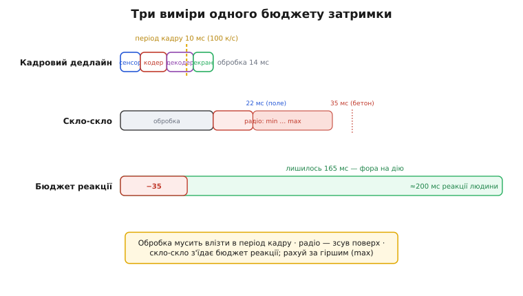

# ⚙️ Калькулятор бюджету затримки FPV

У темі ми вже склали затримку «від скла до скла» в один рядок: набрали п'ять чисел, додали, помножили на швидкість — і дізналися, що апарат пролетить наосліп. Цього досить, щоб відчути ідею. Але справжній бортовий чи настільний інструмент має відповідати не на одне питання, а на три, і саме на тих стиках, де наївне додавання бреше.

Перше питання просте: **скільки всього**? Друге — порівняльне: **котра з чотирьох систем влізе в мої умови**, бо в реальному виборі ви не міряєте одну систему, а ставите їх поруч. А третє — найгостріше і найчастіше пропущене: **чи встигає картинка оновитися до того, як прийде наступний кадр, і чи лишається пілотові час зреагувати**. Бо затримка сама по собі — половина історії. Друга половина — з якою частотою ця затримка оновлюється і скільки від періоду кадру з'їла обробка.

Ця вставка будує такий інструмент крок за кроком. Спершу ми чесно опишемо конвеєр як набір ланок — не одне число, а структуру, бо саме структура дасть нам граничні випадки. Потім додамо те, чого в базовому розрахунку не було взагалі: **діапазон** затримки для двобічних систем (вони не мають однієї цифри — у них є «в полі» і «за бетоном»). Тоді — таблицю чотирьох систем у масиві, щоб одним проходом порівняти їх під ваші умови. І нарешті — перевірку кадрового дедлайну, де ми наштовхнемося на пастку, об яку спіткнувся не один вбудований проєкт: **цілочислову арифметику мілісекунд**.

> 🔧 **Навіщо це.** Перш ніж замовляти комплект на 400 доларів і перешивати раму, корисно за п'ять хвилин на коліні порахувати, чи взагалі ваша зв'язка «камера + система + частота кадрів» лишає пілотові фізичний шанс зреагувати на тій швидкості, на якій ви літаєте. Цей калькулятор — рівно такий інструмент: вводите ланки, він каже «влазиш / не влазиш» і показує, де саме затримка з'їла запас.

## Задача: від одного числа до структури

Базовий розрахунок мав плаский набір: сенсор, кодер, радіо, декодер, екран. Для першого знайомства — ідеально. Та щойно ми хочемо порівнювати системи й ловити граничні випадки, плаского набору замало з двох причин.

По-перше, **радіоланка двобічних систем — не число, а пара чисел**. Як ми бачили в темі, DJI і Walksnail перепитують загублені пакети через запит на повтор — а отже, у добрих умовах кадр долітає з першого разу (нижня межа), а під бетонними відбиттями частина пакетів іде на друге, а то й третє коло (верхня межа). Сам [механізм автоматичного повтору запиту (ARQ)](root:embedded/arq-strategies) ми розбираємо окремо; тут досить знати, що кожен повтор додає один цикл «туди-назад», тож затримка двобічної системи — не точка, а розтяжка. Walksnail у полі дає ~22 мс, а серед бетону розганяється до ~35 мс — і це **та сама система**, просто в інших умовах. Одне число тут — брехня; чесно описати її можна лише діапазоном `[min, max]`.

> 🔧 **Навіщо це.** Якщо ви плануєте політ у місті — між будинків, крізь паркінги, уздовж бетонних стін, — то рахувати треба не за нижньою межею з реклами, а за **верхньою**. Реклама показує «22 мс»; стіна показує «35 мс»; розбита рама не цікавиться, яке число було в рекламі. Інструмент, що тримає діапазон, змусить вас подивитися на гірший випадок — саме той, у якому ви й врізаєтесь.

По-друге, **однобічні системи теж не зводяться до однієї цифри** — у них немає кодера й декодера взагалі (аналог) або вони майже миттєві, зате їхня сильна сторона в тому, що верхня межа дорівнює нижній: затримка стала. Якщо ми описуємо всі чотири системи однаковою структурою, ця сталість має виражатися природно — у того, хто не перепитує, `min` і `max` просто збігаються.

Отже, перша ідея інструменту: **одна структура на ланку, де радіо тримає діапазон, а не точку**. Тоді однобічна система — окремий випадок двобічної, у якого діапазон схлопнувся в точку. Це не ускладнення заради ускладнення: це єдиний спосіб порівнювати «снігову» сталість і «бетонну» мінливість в одному масиві, не роздвоюючи код на дві гілки.

## Ідея: ланки, межі й два питання до суми

Розкладімо думку, перш ніж писати код. Конвеєр — це послідовність ланок, кожна додає свій час. Більшість ланок детерміновані: сенсор набирає кадр за стільки-то, кодер тисне за стільки-то, екран малює за стільки-то. Ці числа коливаються мало, тож для них `min = max`. Мінлива — лише радіоланка двобічних систем, і саме там `max > min`.

Звідси повна затримка системи — теж діапазон:

```
total_min = сенсор + кодер + radio_min + декодер + екран
total_max = сенсор + кодер + radio_max + декодер + екран
```

Для однобічної системи `radio_min = radio_max`, тож `total_min = total_max` — діапазон сам собою стає точкою. Нам не треба окремо обробляти «сталі» й «мінливі» системи: формула одна, а поведінка різна виходить із даних.

Тепер два питання, на які інструмент має відповісти понад просте додавання.

**Питання кадрового дедлайму.** Камера видає кадри з частотою, скажімо, 100 разів на секунду. Між сусідніми кадрами минає **період кадру**:

```
період_кадру = 1000 / частота_кадрів    (мс)
```

При 100 к/с це 10 мс; при 60 к/с — 16.67 мс; при 30 к/с — 33.33 мс. Питання: чи встигає вся обробка кадру (сенсор + кодер + декодер + екран — усе, крім польоту в ефірі) вкластися в цей період? Бо якщо обробка одного кадру триває довше, ніж інтервал між кадрами, конвеєр **не встигає** — кадри або накопичуються в черзі (росте затримка), або відкидаються (падає частота). Це класичний дедлайн реального часу: робота на кадр мусить уміститися в період кадру.

Тут є тонкість, через яку легко помилитися. Радіоланку **не слід** класти в кадровий дедлайн так само, як обробку. Ефір — це конвеєрна затримка (англ. *pipeline latency*): поки перший кадр летить, сенсор уже набирає другий. Радіо зсуває картинку в часі, але не забирає продуктивності конвеєра — воно паралельне набору. А от кодер на одному чипі ділить час із наступним кадром: поки він тисне кадр N, він не може тиснути кадр N+1. Тому в дедлайн ми кладемо **обчислювальні** ланки (сенсор, кодер, декодер, екран), а радіо лишаємо в повній затримці «скло-скло», але не в перевірці пропускної здатності. Це різниця між «як швидко картинка оновлюється» (дедлайн) і «наскільки вона відстала» (скло-скло).

> 🔧 **Навіщо це.** Новачок часто думає: «60 к/с — значить, плавно». Але якщо кодер на дешевій системі тисне кадр 18 мс, то в період 16.67 мс він **не влазить** — система тихо впаде до ~55 к/с або почне накопичувати затримку, і ви відчуєте «гумовий» відгук, не розуміючи чому. Перевірка дедлайну ловить це **до** польоту, на папері.

**Питання запасу на реакцію пілота.** Навіть якщо все влазить у кадровий період, лишається питання людини. Пілот реагує не миттєво: від «побачив перешкоду» до «смикнув стик» минає його власний час реакції — у тренованих гонщиків це порядку 150–250 мс на просту зорову реакцію (загальновідома фізіологія: проста зорово-моторна реакція людини лежить близько 200 мс). Затримка системи **з'їдає** цей бюджет: якщо картинка вже відстала на 35 мс, то від моменту реальної події до моменту, коли пілот почне діяти, минає його реакція **плюс** ця фора. Інструмент має показати, скільки від бюджету реакції лишилося після того, як система забрала своє.

Це й буде наш повний інструмент: структура ланок з діапазоном радіо → повна затримка `[min, max]` → перевірка кадрового дедлайну для обчислювальних ланок → залишок бюджету реакції пілота. Тепер — у код.


*Три виміри одного бюджету. **Кадровий дедлайн** (горизонтальна вісь угорі): сума обчислювальних ланок мусить уміститися в період кадру 1000/к·с — інакше конвеєр захлинається. **Скло-скло** (повна смуга): обчислення плюс радіо — те, на скільки картинка відстала. **Бюджет реакції пілота**: скло-скло з'їдає частину ~200 мс людської реакції; що лишилося — фора на дію. Радіо двобічних систем розтягує смугу від min до max.*

## Робочий код: повний калькулятор

Збираємо все в один файл прошивкового стилю — реальний C, який скомпілюється й видасть числа. Почнімо зі структур, що описують ланку та систему.

:::tabs
```c
#include <stdio.h>
#include <stdbool.h>

// Одна ланка конвеєра. Більшість ланок детерміновані (lo == hi);
// мінлива лише радіоланка двобічних систем, де hi > lo через пересилання.
typedef struct {
    float lo;   // найкращий випадок, мс (у полі, без пересилань)
    float hi;   // найгірший випадок, мс (за бетоном, з пересиланнями)
} span_ms;

// Повний конвеєр від скла до скла.
// sensor/encode/decode/display — обчислювальні (детерміновані тут);
// radio — єдина, що тримає діапазон.
typedef struct {
    const char *name;
    span_ms sensor;    // набір кадру сенсором
    span_ms encode;    // стиснення кодеком (lo=hi=0 для аналогу)
    span_ms radio;     // ефір + (де)модуляція + можливі пересилання
    span_ms decode;    // розпакування (lo=hi=0 для аналогу)
    span_ms display;   // вивід на екран окулярів
    int     fps;       // частота кадрів камери
} fpv_system;
```
```python
from dataclasses import dataclass

# Одна ланка конвеєра. Більшість ланок детерміновані (lo == hi);
# мінлива лише радіоланка двобічних систем, де hi > lo через пересилання.
@dataclass
class SpanMs:
    lo: float  # найкращий випадок, мс (у полі, без пересилань)
    hi: float  # найгірший випадок, мс (за бетоном, з пересиланнями)

# Повний конвеєр від скла до скла.
# sensor/encode/decode/display — обчислювальні (детерміновані тут);
# radio — єдина, що тримає діапазон.
@dataclass
class FpvSystem:
    name: str
    sensor: SpanMs    # набір кадру сенсором
    encode: SpanMs    # стиснення кодеком (lo=hi=0 для аналогу)
    radio: SpanMs     # ефір + (де)модуляція + можливі пересилання
    decode: SpanMs    # розпакування (lo=hi=0 для аналогу)
    display: SpanMs   # вивід на екран окулярів
    fps: int          # частота кадрів камери
```
:::

Зверніть увагу: кожна ланка — `span_ms` з нижньою й верхньою межею. Для детермінованих ланок ми просто кладемо однакові `lo` і `hi`. Це коштує зайвого поля в пам'яті, але дає одну формулу на всі системи — жодних `if (двобічна)`.

Тепер додавання діапазонів. Сума двох діапазонів — діапазон їхніх сум: найкращий випадок системи — коли всі ланки в найкращому, найгірший — коли всі в найгіршому.

:::tabs
```c
static span_ms span_add(span_ms a, span_ms b) {
    span_ms r = { a.lo + b.lo, a.hi + b.hi };
    return r;
}

// Повна затримка «скло-скло» як діапазон [lo, hi].
span_ms glass_to_glass(const fpv_system *s) {
    span_ms t = { 0.0f, 0.0f };
    t = span_add(t, s->sensor);
    t = span_add(t, s->encode);
    t = span_add(t, s->radio);
    t = span_add(t, s->decode);
    t = span_add(t, s->display);
    return t;
}
```
```python
def span_add(a: SpanMs, b: SpanMs) -> SpanMs:
    return SpanMs(a.lo + b.lo, a.hi + b.hi)

# Повна затримка «скло-скло» як діапазон [lo, hi].
def glass_to_glass(s: FpvSystem) -> SpanMs:
    t = SpanMs(0.0, 0.0)
    t = span_add(t, s.sensor)
    t = span_add(t, s.encode)
    t = span_add(t, s.radio)
    t = span_add(t, s.decode)
    t = span_add(t, s.display)
    return t
```
:::

Для однобічної системи `radio.lo == radio.hi`, тож і `t.lo == t.hi` — діапазон вийде нульової ширини сам собою. Нам не довелося писати окрему гілку: сталість аналогу й HDZero — наслідок того, що в їхній радіоланці немає розкиду.

Далі — скільки метрів апарат пролетить за час затримки. Це лінійна функція швидкості; беремо її окремо, бо застосуємо і до нижньої, і до верхньої межі.

:::tabs
```c
// Метри «наосліп» за час latency_ms на швидкості speed_kmh.
float blind_distance_m(float latency_ms, float speed_kmh) {
    float speed_ms = speed_kmh / 3.6f;        // км/год → м/с
    return speed_ms * (latency_ms / 1000.0f); // мс → с
}
```
```python
# Метри «наосліп» за час latency_ms на швидкості speed_kmh.
def blind_distance_m(latency_ms: float, speed_kmh: float) -> float:
    speed_ms = speed_kmh / 3.6            # км/год → м/с
    return speed_ms * (latency_ms / 1000.0)  # мс → с
```
:::

Тепер — кадровий дедлайн. Спершу період кадру, потім сума **обчислювальних** ланок (без радіо, як ми домовилися), потім порівняння. Тут перша зустріч із пасткою цілих чисел — поки що обійдемо її через `float`, а нижче розберемо, чому ціле тут небезпечне.

:::tabs
```c
// Період кадру в мс: інтервал між сусідніми кадрами.
float frame_period_ms(int fps) {
    return 1000.0f / (float)fps;   // ПАСТКА: 1000/fps цілими — нижче
}

// Сума обчислювальних ланок (без радіо) — те, що мусить влізти в період кадру.
// Беремо ВЕРХНЮ межу: дедлайн перевіряють за найгіршим випадком.
float compute_load_ms(const fpv_system *s) {
    return s->sensor.hi + s->encode.hi + s->decode.hi + s->display.hi;
}

// Чи влазить обробка кадру в період? true = встигаємо.
bool fits_frame_deadline(const fpv_system *s) {
    return compute_load_ms(s) <= frame_period_ms(s->fps);
}
```
```python
# Період кадру в мс: інтервал між сусідніми кадрами.
def frame_period_ms(fps: int) -> float:
    return 1000.0 / fps   # ПАСТКА: 1000/fps цілими — нижче

# Сума обчислювальних ланок (без радіо) — те, що мусить влізти в період кадру.
# Беремо ВЕРХНЮ межу: дедлайн перевіряють за найгіршим випадком.
def compute_load_ms(s: FpvSystem) -> float:
    return s.sensor.hi + s.encode.hi + s.decode.hi + s.display.hi

# Чи влазить обробка кадру в період? True = встигаємо.
def fits_frame_deadline(s: FpvSystem) -> bool:
    return compute_load_ms(s) <= frame_period_ms(s.fps)
```
:::

І нарешті — запас бюджету реакції пілота. Скло-скло (за верхньою межею — обережний бік) віднімаємо від людської реакції; що лишилося, те фора.

```c
#define PILOT_REACTION_MS 200.0f   // проста зорово-моторна реакція людини

// Скільки від бюджету реакції лишилось після того, як система забрала своє.
// Від'ємне число → система з'їла весь запас (рахуємо за гіршим випадком).
float reaction_margin_ms(span_ms glass) {
    return PILOT_REACTION_MS - glass.hi;
}
```

Зведімо все в головну функцію зі звітом по одній системі, а тоді — у масив чотирьох систем.

:::tabs
```c
void report(const fpv_system *s, float speed_kmh) {
    span_ms g = glass_to_glass(s);
    float period = frame_period_ms(s->fps);
    float load   = compute_load_ms(s);
    bool  fits   = fits_frame_deadline(s);
    float margin = reaction_margin_ms(g);

    printf("== %s (%d к/с) ==\n", s->name, s->fps);
    if (g.lo == g.hi)
        printf("  Скло-скло:     %.1f мс (стала)\n", g.lo);
    else
        printf("  Скло-скло:     %.1f-%.1f мс (змінна)\n", g.lo, g.hi);

    printf("  Наосліп @%.0f км/год: %.2f-%.2f м\n",
           speed_kmh,
           blind_distance_m(g.lo, speed_kmh),
           blind_distance_m(g.hi, speed_kmh));

    printf("  Кадровий період: %.2f мс, обробка: %.1f мс -> %s\n",
           period, load, fits ? "ВЛАЗИТЬ" : "НЕ ВЛАЗИТЬ");

    printf("  Запас реакції:   %.0f мс %s\n\n",
           margin, margin > 0 ? "" : "(!) з'їдено весь бюджет");
}
```
```python
def report(s: FpvSystem, speed_kmh: float) -> None:
    g = glass_to_glass(s)
    period = frame_period_ms(s.fps)
    load = compute_load_ms(s)
    fits = fits_frame_deadline(s)
    margin = reaction_margin_ms(g)

    print(f"== {s.name} ({s.fps} к/с) ==")
    if g.lo == g.hi:
        print(f"  Скло-скло:     {g.lo:.1f} мс (стала)")
    else:
        print(f"  Скло-скло:     {g.lo:.1f}-{g.hi:.1f} мс (змінна)")

    print(f"  Наосліп @{speed_kmh:.0f} км/год: "
          f"{blind_distance_m(g.lo, speed_kmh):.2f}-"
          f"{blind_distance_m(g.hi, speed_kmh):.2f} м")

    fits_str = "ВЛАЗИТЬ" if fits else "НЕ ВЛАЗИТЬ"
    print(f"  Кадровий період: {period:.2f} мс, обробка: {load:.1f} мс -> {fits_str}")

    margin_note = "" if margin > 0 else "(!) з'їдено весь бюджет"
    print(f"  Запас реакції:   {margin:.0f} мс {margin_note}\n")
```
:::

Тепер масив систем із реальними числами. Я навмисне беру значення, що збігаються з тими, які ми обговорювали в темі й перевіряли за відкритими даними: аналог — короткий ланцюг без кодека з домінуванням камери; HDZero — фіксовані ~14 мс при 100 к/с; DJI O4 у гоночному режимі — близько 15 мс; Walksnail — змінні ~22–35 мс через пересилання.

:::tabs
```c
int main(void) {
    fpv_system systems[] = {
        // АНАЛОГ: нема кодера/декодера; радіо стале (одне число → lo=hi).
        // Домінує сенсор камери; ~19 мс разом.
        { .name = "Аналог",
          .sensor  = {12, 12}, .encode = {0, 0},
          .radio   = { 2,  2}, .decode = {0, 0}, .display = {5, 5},
          .fps = 60 },

        // HDZERO: однобічний, фіксована затримка; кодек є, але без пересилань
        // радіо стале. ~14 мс при 100 к/с.
        { .name = "HDZero",
          .sensor  = {3, 3}, .encode = {4, 4},
          .radio   = {3, 3}, .decode = {2, 2}, .display = {2, 2},
          .fps = 100 },

        // DJI O4 (гоночний режим): двобічний, але в гонці радіо майже без
        // розкиду; ~15 мс скло-скло.
        { .name = "DJI O4 (race)",
          .sensor  = {3, 3}, .encode = {4, 5},
          .radio   = {2, 3}, .decode = {3, 3}, .display = {3, 3},
          .fps = 100 },

        // WALKSNAIL: двобічний; у полі ~22 мс, за бетоном ~35 мс через
        // пересилання — радіо тримає ШИРОКИЙ діапазон.
        { .name = "Walksnail",
          .sensor  = {4, 4}, .encode = {6, 7},
          .radio   = {6, 18}, .decode = {4, 4}, .display = {2, 2},
          .fps = 120 },
    };

    int n = sizeof(systems) / sizeof(systems[0]);
    float speed = 120.0f;   // км/год — типова гоночна

    for (int i = 0; i < n; i++)
        report(&systems[i], speed);

    return 0;
}
```
```python
def main() -> None:
    systems = [
        # АНАЛОГ: нема кодера/декодера; радіо стале (одне число → lo=hi).
        # Домінує сенсор камери; ~19 мс разом.
        FpvSystem(name="Аналог",
                  sensor=SpanMs(12, 12), encode=SpanMs(0, 0),
                  radio=SpanMs(2, 2), decode=SpanMs(0, 0), display=SpanMs(5, 5),
                  fps=60),

        # HDZERO: однобічний, фіксована затримка; кодек є, але без пересилань
        # радіо стале. ~14 мс при 100 к/с.
        FpvSystem(name="HDZero",
                  sensor=SpanMs(3, 3), encode=SpanMs(4, 4),
                  radio=SpanMs(3, 3), decode=SpanMs(2, 2), display=SpanMs(2, 2),
                  fps=100),

        # DJI O4 (гоночний режим): двобічний, але в гонці радіо майже без
        # розкиду; ~15 мс скло-скло.
        FpvSystem(name="DJI O4 (race)",
                  sensor=SpanMs(3, 3), encode=SpanMs(4, 5),
                  radio=SpanMs(2, 3), decode=SpanMs(3, 3), display=SpanMs(3, 3),
                  fps=100),

        # WALKSNAIL: двобічний; у полі ~22 мс, за бетоном ~35 мс через
        # пересилання — радіо тримає ШИРОКИЙ діапазон.
        FpvSystem(name="Walksnail",
                  sensor=SpanMs(4, 4), encode=SpanMs(6, 7),
                  radio=SpanMs(6, 18), decode=SpanMs(4, 4), display=SpanMs(2, 2),
                  fps=120),
    ]

    speed = 120.0   # км/год — типова гоночна

    for s in systems:
        report(s, speed)


if __name__ == "__main__":
    main()
```
:::

Прокрутімо подумки, що надрукує цей код, з покроковою перевіркою кожного нетривіального числа.

**Аналог.** Скло-скло: 12 + 0 + 2 + 0 + 5 = 19 мс, стала (бо `radio.lo == radio.hi`).

```
скло-скло = 12 + 0 + 2 + 0 + 5 = 19.0 мс
наосліп   = (120/3.6) × 19/1000 = 33.33 × 0.019 = 0.63 м
період    = 1000/60 = 16.67 мс
обробка   = 12 + 0 + 0 + 5 = 17.0 мс  → 17.0 > 16.67 → НЕ ВЛАЗИТЬ
запас     = 200 − 19 = 181 мс
```

Цікавий перший улов: аналог із цією камерою на 60 к/с **формально не влазить** у кадровий період — 17 мс обробки проти 16.67 мс періоду. Не тому що система погана, а тому що ми взяли повільнувату камеру (12 мс на набір). У реальності аналогові камери часто швидші; але інструмент чесно показав, що **вузьке місце — сенсор, не радіо**. Це і є цінність розрахунку: він тицяє пальцем у винну ланку.

**HDZero.** Скло-скло: 3 + 4 + 3 + 2 + 2 = 14 мс, стала.

```
скло-скло = 3 + 4 + 3 + 2 + 2 = 14.0 мс
наосліп   = 33.33 × 0.014 = 0.47 м
період    = 1000/100 = 10.0 мс
обробка   = 3 + 4 + 2 + 2 = 11.0 мс  → 11.0 > 10.0 → НЕ ВЛАЗИТЬ
запас     = 200 − 14 = 186 мс
```

Знову повчально: HDZero дає чудові 14 мс скло-скло, але сума обчислювальних ланок (11 мс) трохи перевищує 10-мс період при 100 к/с. На практиці виробник балансує конвеєр так, щоб ланки **перекривалися** (сенсор уже набирає наступний кадр, поки кодер тисне поточний) — і тоді дедлайн рахується інакше, по найдовшій **окремій** ланці, а не по сумі. Наш простий інструмент свідомо консервативний: він сумує, припускаючи відсутність перекриття. Це нагадування, що модель — спрощення; реальний конвеєр із перекриттям витриваліший. Але для прикидки «на коліні» консервативний бік — правильний: краще недооцінити свій запас, ніж переоцінити.

**DJI O4 (гоночний режим).** Тут радіо вже діапазон 2–3, тож скло-скло — діапазон.

```
скло-скло lo = 3 + 4 + 2 + 3 + 3 = 15.0 мс
скло-скло hi = 3 + 5 + 3 + 3 + 3 = 17.0 мс  → "15.0-17.0 мс (змінна)"
наосліп      = 0.50-0.57 м
період       = 1000/100 = 10.0 мс
обробка(hi)  = 3 + 5 + 3 + 3 = 14.0 мс  → НЕ ВЛАЗИТЬ (консервативно)
запас        = 200 − 17 = 183 мс
```

**Walksnail.** Широкий радіодіапазон 6–18 дає видовищний розкид скло-скло — рівно той ефект «у полі проти бетону», що ми обговорювали.

```
скло-скло lo = 4 + 6 + 6 + 4 + 2 = 22.0 мс   (у полі)
скло-скло hi = 4 + 7 + 18 + 4 + 2 = 35.0 мс   (за бетоном)
              → "22.0-35.0 мс (змінна)"
наосліп      = 0.73-1.17 м   ← понад метр у гіршому випадку!
період       = 1000/120 = 8.33 мс
обробка(hi)  = 4 + 7 + 4 + 2 = 17.0 мс  → НЕ ВЛАЗИТЬ (консервативно)
запас        = 200 − 35 = 165 мс
```

Ось воно, серце вставки. Аналог наосліп пролітає 0.63 м, а Walksnail за бетоном — 1.17 м, **майже вдвічі більше**, і то лише через радіоланку, що перепитує загублене. Запас реакції теж промовистий: у аналогу лишається 181 мс, у Walksnail за бетоном — 165 мс. Різниця в 16 мс — це той самий «бетонний податок», який пілот платить чистотою картинки. Жодна система не «найкраща»: інструмент не виносить вирок, він кладе числа поруч, щоб ви вибрали під свою задачу — як ми й казали в темі, говорячи про [дві філософії вмирання](root:embedded/fpv-video-systems).

## Граничні випадки: де наївне додавання бреше

Інструмент уже зловив кілька пасток мимохідь; зведімо їх докупи й додамо ті, що чигають далі.

**Діапазон — не середнє.** Найспокусливіше — взяти «типову» затримку Walksnail як 28 мс (середину між 22 і 35) і рахувати по ній. Це фатально для планування: ви розіб'єтесь не на середньому випадку, а на гіршому. Тому інструмент тримає `[lo, hi]` і всі критичні перевірки (дедлайн, запас реакції, метри наосліп) робить **за `hi`**. Середнє годиться для маркетингу; для виживання рами годиться лише максимум.

**Радіо — конвеєрна затримка, не обчислювальна.** Ми вже відокремили радіо від кадрового дедлайну, але варто наголосити, **чому** це не педантизм. Якщо ви помилково вкинете радіо в `compute_load_ms`, то Walksnail із її 18-мс гіршим радіо «провалить» дедлайн так, ніби не може видати навіть 30 к/с, — а вона спокійно тягне 120. Радіо зсуває кадр у часі (затримка), але поки той кадр летить, кодер уже працює над наступним (пропускна здатність). Плутати ці дві речі — типова помилка, що веде до висновку «цифра не може в високу частоту кадрів», який очевидно хибний. Затримка й пропускна здатність — ортогональні; інструмент тримає їх нарізно навмисне.

**Перекриття ланок робить консервативну оцінку песимістичною.** Наша сума `compute_load_ms` припускає, що ланки йдуть строго одна за одною. Реальний конвеєр часто перекриває їх: поки декодер на боці окулярів розпаковує кадр N, кодер на боці апарата вже тисне N+1. Тоді обмежує не сума, а **найдовша окрема ланка** (вузьке місце конвеєра). Якщо хочете точнішу межу пропускної здатності — рахуйте `max(sensor, encode, decode, display)`, а не суму. Сума — нижня оцінка можливостей (вона раніше скаже «не влазить»); максимум окремої ланки — верхня. Правда десь між ними, ближче до максимуму на добре спроектованій системі. Інструмент свідомо бере песимістичну суму для прикидки; для серйозного аналізу додайте обидві оцінки й дивіться на обидві.

> 🔧 **Навіщо це.** Якщо ваш інструмент каже «не влазить», а система в реальності літає — не поспішайте лаяти числа. Найімовірніше, ваша модель ігнорує перекриття конвеєра. Додайте поряд оцінку «по найдовшій ланці» — і побачите, що насправді обмежує. Це різниця між «мій код бреше» і «мій код консервативний».

**Затримка зростає нелінійно під втратами.** Ми моделюємо `radio.hi` сталим числом (18 мс) — мовляв, гірший випадок такий. Та насправді під пересиланнями затримка двобічної системи зростає **сходинками**: один повтор додає один цикл туди-назад, два повтори — два цикли. Якщо канал зовсім поганий, повторів стає так багато, що система здається й **замерзає** — затримка формально стрибає до нескінченності (кадр не приходить узагалі). Наш `hi` — це «скільки ще терпимо до замерзання»; за ним — обрив, а не плавне зростання. Чесна модель мала б мати третій стан, «freeze», окремо від числового діапазону. Для прикидки досить позначити: `hi` — це край, далі прірва.

## Пастка цілочислової арифметики мілісекунд

А тепер — пастка, заради якої варто читати цю вставку, навіть якщо все інше ви вже знали. Вона коштувала реальним вбудованим проєктам годин відлагодження, і вона невидима, поки не вкусить.

Мікроконтролер часто рахує час у цілих мілісекундах — лічильник `uint32_t`, що цокає від системного таймера. Спокусливо рахувати період кадру теж у цілих:

```c
uint32_t frame_period_int(int fps) {
    return 1000 / fps;          // ПАСТКА
}
```

Подивіться, що це дає для реальних частот:

```
fps=100:  1000/100 = 10        вірно (бо 100 ділить 1000)
fps=60:   1000/60  = 16        А МАЛО Б 16.67 — втратили 0.67 мс!
fps=30:   1000/30  = 33        А МАЛО Б 33.33 — втратили 0.33 мс
fps=90:   1000/90  = 11        А МАЛО Б 11.11 — втратили 0.11 мс
fps=120:  1000/120 = 8         А МАЛО Б 8.33 — втратили 0.33 мс
```

Ціле ділення в C **відкидає** дробову частину (не округлює). При 60 к/с справжній період — 16.67 мс, а ціле дає 16. Здавалося б, дрібниця в 0.67 мс. Але ця дрібниця **накопичується**. Якщо ви плануєте видачу кадрів за цим періодом — «наступний кадр через 16 мс» — то за секунду назбираєте 60 × 0.67 ≈ 40 мс зайвого зсуву, за хвилину — 2.4 секунди. Відео поповзе відносно реального часу; синхронізація з логами чи з керуванням попливе.

Гірше з перевіркою дедлайну. Уявіть систему з обробкою рівно 16.5 мс при 60 к/с:

```c
// Цілий період = 16; обробка 16.5 (округлена до int = 16 або 17?)
// Якщо й обробку тримати цілою — 16.5 стане 16, і перевірка СКАЖЕ "влазить",
// хоча насправді 16.5 > 16.67 теж під питанням, а 16.5 < 16.67 — влазить.
// Подвійне відкидання дробу ховає правду в обидва боки.
```

Подвійне відкидання — у періоді й в обробці — може дати будь-який із двох неправильних висновків: показати «влазить», коли насправді ні, або навпаки. Помилка не систематична, а залежить від того, як саме лягли дроби, — а отже, невідтворювана від випадку до випадку. Це найгірший вид бага: він то є, то нема.

**Як правильно.** Є три чесні шляхи, від простого до строгого.

Перший — рахувати у `float`/`double`, як ми й робили вище. Для калькулятора-прикидки цього досить: похибка `float` (близько 7 значущих цифр) на масштабі мілісекунд абсолютно мізерна проти невизначеності самих вхідних чисел (ви ж не знаєте затримку кодера точніше, ніж до мілісекунди). Не вигадуйте точність, якої нема у вхідних даних.

Другий — лишитися в цілих, але **піднести масштаб**: рахувати не в мілісекундах, а в мікросекундах. Тоді період кадру при 60 к/с — це 1 000 000 / 60 = 16 666 мкс, і ціле ділення відкидає лише 0.67 мкс — у тисячу разів менша похибка, цілком терпима.

```c
uint32_t frame_period_us(int fps) {
    return 1000000u / fps;      // 60 к/с → 16666 мкс, похибка 0.67 мкс
}
```

Третій, найстрогіший для систем реального часу, — **не ділити взагалі**, а порівнювати перехресним множенням. Питання «чи обробка ≤ період?» — це `load_ms ≤ 1000/fps`. Помножимо обидва боки на `fps` (додатний, нерівність не перевертається):

```c
// Чи влазить обробка load_ms у період кадру при fps — БЕЗ ділення.
// load_ms ≤ 1000/fps  ⟺  load_ms × fps ≤ 1000
bool fits_no_division(uint32_t load_ms, int fps) {
    return load_ms * (uint32_t)fps <= 1000u;
}
```

Жодного ділення, жодного відкинутого дробу — порівняння точне. Єдине, за чим стежити: добуток `load_ms * fps` не повинен переповнити тип. При `uint32_t` запас величезний (мільярди), тож для мс і реальних к/с переповнення неможливе; але якщо перейдете на мікросекунди й великі числа — тримайте це в голові й беріть `uint64_t` під добуток.

> 🔧 **Навіщо це.** Перехресне множення — золоте правило часових перевірок у прошивці взагалі, не лише тут. Щоразу, коли хочете порівняти дві дроби або «чи встигаю в період», спитайте себе: чи можу я обійтися множенням замість ділення? Майже завжди можна — і тоді цілочислове відкидання дробу не зіпсує висновок. Цей прийом ще зустрінеться нам, коли йтиметься про [бюджет переривань](root:embedded/polling-vs-interrupts): там та сама математика «чи влізе робота в період».

Підсумок пастки одним реченням: **мілісекунда — груба одиниця для часових бюджетів**; або працюйте у `float`, або підніміть масштаб до мікросекунд, або взагалі не діліть — порівнюйте множенням. Найгірше з можливого — наївне ціле ділення мс, бо воно тихо краде дроби й перетворює перевірку дедлайну на лотерею.

## Складність і що з цим робити

Обчислювально весь інструмент — тривіальний: складання діапазонів і кілька порівнянь, **O(к-сть_ланок)** на систему й **O(к-сть_систем × к-сть_ланок)** на всю таблицю. Жодних циклів за часом, жодної важкої математики — це калькулятор, а не симуляція. Він порахується за мікросекунди навіть на найслабшому 8-бітному мікроконтролері; його сміливо можна лишити в прошивці, щоб, скажімо, при зміні режиму камери на льоту перерахувати, чи лишаємось у дедлайні, і блимнути попередженням в OSD, якщо ні.

Пастки, навпаки, не обчислювальні, а **модельні** — і саме вони важать:

- **Радіо тримай діапазоном, не точкою**, інакше двобічні системи виглядатимуть оманливо стабільними.
- **Критичні перевірки роби за `hi`**, не за середнім: вас уб'є гірший випадок, не типовий.
- **Не клади радіо в кадровий дедлайн** — це конвеєрна затримка, а не навантаження на обчислення; плутанина веде до висновку «цифра не може в високу частоту кадрів», який хибний.
- **Пам'ятай про перекриття конвеєра**: сума ланок — песимістична оцінка пропускної здатності; реальна межа ближча до найдовшої окремої ланки.
- **Тікай від цілого ділення мілісекунд** — float, мікросекунди або перехресне множення; ніколи наївне `1000/fps` у цілих, якщо fps не дільник 1000.
- **Замерзання — окремий стан**, не просто велике число: за `radio.hi` лежить обрив, а не плавне зростання.

І головне, заради чого взагалі будувати такий інструмент: він перетворює розпливчасте відчуття «ця система ніби швидша» на конкретне «обробка 14 мс при періоді 10 мс — вузьке місце сенсор, запас реакції 186 мс, наосліп 0.47 м». Числа сперечатися не дають. А коли ви замовляєте комплект і ставите його на апарат, що летить між дерев на ваших очах, краще сперечатися з числами заздалегідь — ніж із деревом потім.
