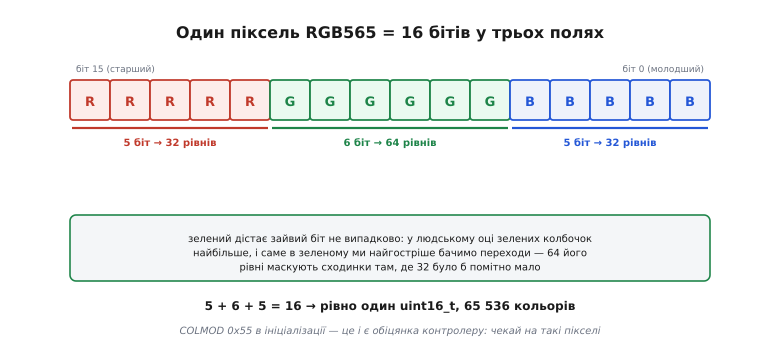
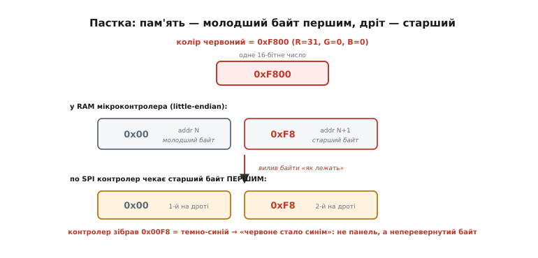
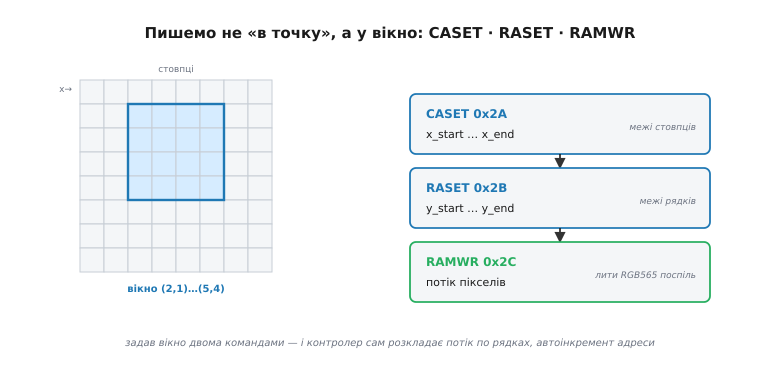

# Кадр у пам'яті: framebuffer і RGB565

Контролер ми щойно [розбудили й налаштували](root:embedded/gram-init-sequence): скидання змило старий стан, `SLPOUT` підняв напругу матриці, `DISPON` відкрив показ. І серед тих команд одна була обіцянкою на майбутнє — `COLMOD 0x55`. Тоді ми проковзнули повз неї одним рядком: «16 біт на піксель, формат RGB565». Але це не дрібна деталь у списку — це **угода про мову**, якою ви віднині розмовлятимете з панеллю. Ви сказали контролеру: «чекай від мене пікселі рівно такого вигляду». Тепер настав час цю обіцянку виконати — зрозуміти, що ж воно за 16-бітне число, звідки в ньому колір, і як ці числа насправді долітають до скла. Бо саме тут, між «екран увімкнено» й «на екрані щось видно», ховається пригорща класичних багів, на яких застряють усі — червоне стає синім, картинка сиплеться, пам'яті раптом бракує. Розберімося так, щоб жоден із них вас не спіймав.

Сама ідея «пам'ять, що є зображенням» — фундамент, і він у нас уже є: [кадровий буфер](topic:electronics/framebuffer) — це неперервний масив, де кожній цятці екрана відповідає своя комірка, а «малювати» означає просто писати числа за адресою `(y·W + x)·бпп`. Ту базу переказувати не будемо — обіпремося на неї й підемо далі, у бік конкретики прошивки: **який саме** байт лягає в комірку, у **якому порядку** він летить у контролер і **де** цьому масиву жити на тісному мікроконтролері.

### RGB565: колір, спакований у два байти

Почнімо з питання, яке `COLMOD` лишив відкритим: що означає одне 16-бітне число як колір? Колір на екрані — це суміш трьох світел: **червоного, зеленого й синього** (англ. *red, green, blue* — звідси RGB). Задати колір означає сказати, скільки кожного. Якби ми мали безліч пам'яті, віддали б кожному каналу по цілому байту — 256 градацій, як у звичному RGB888. Але кадровий буфер — [найбільший поодинокий пожирач RAM](topic:electronics/framebuffer) у пристрої, і три байти на піксель — розкіш, якої дрібний контролер не потягне. Тож інженери пішли на компроміс: **два байти на піксель**, а всередині них — поля різної ширини.


*16 бітів розкроєні як 5-6-5. Червоному й синьому — по 5 біт (32 рівні), зеленому — 6 (64 рівні). Зелений ширший не з примхи: у людському оці зелених колбочок найбільше, і саме в зеленому найпомітніші сходинки-переходи, тож зайвий біт іде туди, де він найпотрібніший. Сума 5+6+5=16 рівно вкладається в один `uint16_t` — 65 536 кольорів.*

Чому саме зеленому дістався зайвий, тринадцятий біт? Це не довільний вибір, а поступка людському зору. Наше око бачить не всі кольори однаково: **зелених** колбочок у сітківці найбільше, і в зеленій частині спектра ми найгостріше розрізняємо близькі відтінки. Тому саме там, де 5 біт (32 рівні) дали б помітні сходинки на плавному переході, 6 біт (64 рівні) їх маскують — а на червоному й синьому, до яких око менш прискіпливе, і 32 рівнів вистачає. Ширину бітів підлаштували під фізіологію ока: зайвий біт кладуть туди, де він дає найбільше видимого виграшу. Точний вивід, чому 64 рівні зеленого відповідають чутливості ока, а числа кольору перетворюються між форматами, розібрано у [математиці кодування RGB565](topic:electronics/color-formats/math-rgb565.md).

Тепер найпрактичніше: як **зібрати** таке число з окремих R, G, B у коді. Кожен канал треба вкласти у своє поле — зсунути на потрібну кількість бітів ліворуч і скласти. Червоне сидить у старших 5 бітах (зсув на 11), зелене — в середніх 6 (зсув на 5), синє — у молодших 5 (без зсуву):

```
RGB565 = (R5 << 11) | (G6 << 5) | (B5)
         ^старші 5      ^середні 6   ^молодші 5
```

**Умова.** Скласти 16-бітний колір RGB565 з трьох повних 8-бітних каналів (0…255 кожен), як їх зазвичай дає код чи картинка. Треба «стиснути» 8 біт кожного каналу до 5 або 6 і поскладати в поля.

```c
#include <stdint.h>

/* 8 біт каналу → потрібну ширину: відкидаємо молодші біти,
   бо саме вони найменше важать для кольору (старші зберігаємо) */
static inline uint16_t rgb565(uint8_t r, uint8_t g, uint8_t b)
{
    return (uint16_t)(((r & 0xF8) << 8)   /* R: беремо старші 5 біт, ставимо на позицію 11..15 */
                    | ((g & 0xFC) << 3)   /* G: старші 6 біт  → позиція 5..10               */
                    | ( b >> 3));         /* B: старші 5 біт  → позиція 0..4                */
}

/* кілька готових кольорів для прикладів нижче */
#define BLACK   0x0000
#define RED     0xF800   /* R=31, G=0,  B=0  */
#define GREEN   0x07E0   /* R=0,  G=63, B=0  */
#define BLUE    0x001F   /* R=0,  G=0,  B=31 */
#define WHITE   0xFFFF
```

Прочитаймо, що тут насправді відбувається. Кожен канал приходить у повній 8-бітній точності, а поля вузькі — тож частину точності доводиться **викинути**. Викидаємо завжди **молодші** біти (`r >> 3` лишає старші 5, `& 0xF8` те саме через маску), бо, як ми вже знаємо з розкладу поля, молодші біти каналу найслабше впливають на видимий колір — їх втрату око майже не помітить. А зсуви ставлять кожне поле на його місце в 16-бітному слові. Ось і вся арифметика кольору: три числа, три зсуви, одне «або». Зверніть увагу на константи — `RED` це `0xF800`, тобто всі 5 біт червоного увімкнені, решта нулі. Запам'ятайте це число: за мить воно нам покаже найпідступніший баг теми.

> 🔧 **Навіщо це.** `rgb565()` — це той місток, яким будь-який ваш колір (з дизайну, з іконки, з датчика) перетворюється на те, що розуміє панель. Коли кольори на екрані виглядають «злегка не такими» — тьмяними чи з ледь помітними смугами на градієнтах, — причина майже завжди тут: 16 біт просто фізично не тримають стільки відтінків, скільки 24. Це не баг вашого коду, а стеля формату, і знати її наперед — значить не витрачати години на пошук неіснуючої помилки.

### Пастка порядку байтів: чому червоне стає синім

А тепер — головний капкан цього кроку, у який падають геть усі. Ви зібрали `rgb565()`, залили екран червоним `0xF800` — а панель показує **синій**. Код правильний, колір правильний, а на склі — не той. Спокуса вирішити, що бракована панель або переплутаний біт `RGB`/`BGR` у `MADCTL` (той самий, [що ми крутили в ініціалізації](root:embedded/gram-init-sequence)). Але дев'ять разів із десяти причина інша й тонша — **порядок байтів**.

Річ у нестикуванні двох світів. Мікроконтролер зберігає 16-бітне число в пам'яті за угодою **little-endian** — [молодший байт за меншою адресою](topic:programming/bits-bytes-endianness), старший за більшою (так роблять ESP32, ARM Cortex-M, майже всі сучасні МК). А контролер дисплея по SPI чекає піксель **старшим байтом уперед** (big-endian на дроті) — така вимога даташитів ST7789, ILI9341 та їхньої рідні. Виходить пряме зіткнення угод: те, що МК тримає в пам'яті першим, контролер хоче отримати другим.


*Той самий піксель, два несумісні порядки. У RAM мікроконтролера `0xF800` лежить як `0x00` (молодший) за адресою N і `0xF8` (старший) за N+1 — це little-endian. Але по SPI контролер чекає **старший байт першим**. Виллеш байти в порядку адрес — контролер прочитає перший (`0x00`) як старший, другий (`0xF8`) як молодший і збере `0x00F8`, а це темно-синій. Звідси й фокус: червоне стало синім, хоч колір ви задали правильно.*

Простежмо це число за числом, бо саме на конкретиці капкан стає очевидним. Червоний `0xF800` у пам'яті ESP32 розкладений так: за адресою `N` лежить `0x00` (молодший байт), за `N+1` — `0xF8` (старший). Якщо ви наївно виллєте вміст пам'яті в SPI у порядку зростання адрес, по дроту першим піде `0x00`, другим `0xF8`. А контролер складає піксель, беручи **перший** байт як старший, **другий** — як молодший. Тобто він прочитає `0x00` у старші вісім бітів, `0xF8` у молодші — і збере `0x00F8`. У полях RGB565 це `0x00F8` = червоний нуль, зелений майже нуль, синій сильний — тобто замість чистого червоного виходить темно-синій. На симетричнішому прикладі це ще наочніше: колір `0xF81F` (пурпуровий) при переставлених байтах став би `0x1FF8`, і червоне з синім помінялися б місцями. Механізм щоразу той самий — жодної поломки, просто два байти пройшли дротом у неправильному порядку, і контролер зчитав їх дзеркально.

Ліки — **перевернути байти** кожного пікселя перед відправкою. Спосіб залежить від того, скільки в кого ресурсу:

```c
/* перевернути 16-бітне слово: старший ↔ молодший байт */
static inline uint16_t swap16(uint16_t c)
{
    return (uint16_t)((c >> 8) | (c << 8));
}

/* тепер колір, готовий летіти по SPI старшим байтом уперед */
uint16_t px = swap16(rgb565(255, 0, 0));   /* червоний, уже «дротовий» */
```

Але перевертати кожен піксель окремо в циклі — марнотратство, коли їх десятки тисяч на кадр. Тому є три зріліші шляхи, і вибір між ними — типове інженерне рішення. Перший: **зберігати кадр одразу в «дротовому» порядку** — тобто хай `rgb565()` повертає вже перевернуте число, і тоді буфер ллється в SPI без жодної обробки. Другий: доручити переворот **самому SPI-контролеру** — багато периферійних SPI на ESP32 і STM32 уміють міняти порядок байтів апаратно, задарма, прямо на льоту. Третій, найшвидший для суцільних заливок: коли ви женете один колір на весь прямокутник, переверніть його **раз** перед циклом, а не на кожній цятці. Спільне в усіх — не робити зайвої роботи в гарячому циклі; який шлях кращий, диктує ваша периферія й обсяг даних.

> 🔧 **Навіщо це.** Побачили інвертовані або дивні кольори — перевіряйте гіпотези в такому порядку: спершу **порядок байтів** (найчастіша причина), тоді біт `RGB`/`BGR` у `MADCTL`, і лише потім підозрюйте панель чи свій `rgb565()`. Переставлені місцями ці кроки коштують годин. І ще: якщо ваша SPI-периферія вміє перевертати байти апаратно — вмикайте це й забудьте про `swap16` у коді; безплатний переворот на льоту завжди кращий за ручний цикл.

### Як пікселі долітають до GRAM: адресне вікно

Гаразд, колір спаковано, байти в правильному порядку. Куди їх, власне, писати? Тут курс розходиться з тим простим `set_pixel`, що ми бачили в базовій статті. Там буфер жив у RAM самого МК, і піксель писався прямо в масив за індексом. Але дуже часто панель, з якою ми працюємо, — **«розумна»**: [контролер тримає кадр у власній пам'яті GRAM](topic:electronics/display-controller), а ми лише шлемо туди пікселі по SPI. І писати в чужу GRAM «за адресою» не можна — до неї нема прямого доступу як до масиву. Спілкування йде інакше: командами.

Логіка тут гарна й варта уваги, бо повторює той самий стиль «команда — дані», що [ми вже бачили в ініціалізації](root:embedded/gram-init-sequence). Замість «постав один піксель за адресою» контролер мислить **прямокутними вікнами**: спершу ви кажете йому, у який прямокутник збираєтесь писати, тоді ллєте потік пікселів — а він сам розкладає їх по рядках усередині цього вікна, автоматично посуваючи внутрішню адресу.


*Запис у GRAM — це не «точка», а вікно. `CASET` (0x2A) задає діапазон стовпців (x_start…x_end), `RASET` (0x2B) — діапазон рядків (y_start…y_end). Ці дві команди окреслюють прямокутник. Далі `RAMWR` (0x2C) відкриває прийом: усе, що ви ллєте по SPI після неї, контролер кладе в GRAM зліва направо, згори вниз усередині вікна, сам збільшуючи адресу. Задав межі — і потік сам лягає на місце.*

Розберімо цей маленький протокол, бо він — ключ до будь-якого малювання на розумній панелі. Три команди йдуть строго по черзі. `CASET` (англ. *column address set* — «задати адресу стовпця», код `0x2A`) приймає чотири байти: початковий і кінцевий стовпці вікна. `RASET` (англ. *row address set*, код `0x2B`) — так само початковий і кінцевий рядки. Разом вони окреслюють на склі прямокутник. А `RAMWR` (англ. *memory write* — «запис у пам'ять», код `0x2C`) переводить контролер у режим прийому: після неї кожні два байти, що прийшли по SPI, він тлумачить як один RGB565-піксель і кладе в наступну комірку вікна, сам рухаючись зліва направо й переходячи на новий рядок на краю. Вам не треба рахувати адресу кожного пікселя — ви задали межі раз, і залізо саме веде «курсор» по GRAM.

Ця вікняна модель — не зайва церемонія, а те, що робить малювання **швидким**. Хочете залити прямокутник кольором — задайте вікном рівно його межі й виллийте один колір потрібну кількість разів; контролер сам розкладе. Хочете вивести спрайт чи літеру — вікно на її розмір, і потік її пікселів. Оновити один піксель — вікно 1×1 і два байти. Одна й та сама трійця команд обслуговує і заливку всього екрана, і зміну єдиної цятки — різниця лише в розмірі вікна й довжині потоку. Готовий, надійний драйвер, що інкапсулює цю трійцю в зручні `set_window()` і `push_pixels()` та коректно жене великі блоки через DMA, варто винести окремо — я зібрав його в [проєкт: віконний вивід у GRAM](root:embedded/framebuffer-basics/proj-blit-window.md), щоб тіло цієї статті не тонуло в обв'язці шини.

### Де жити кадру: повний буфер чи смуга

Лишилося найважливіше проектне питання, і воно дістається нам у спадок від арифметики розміру. Ми вже рахували: кадр 320×240 по 16 біт — це `320 × 240 × 2 = 153 600` байтів, близько **150 КБ**. А скромний мікроконтролер має десятки кілобайтів SRAM, непоганий — кількасот. Часто повний кольоровий кадр **фізично не влазить** у RAM того МК, який ви обрали з інших міркувань. І тоді доводиться вибирати одну з двох стратегій — а цей вибір задає весь стиль вашого графічного коду.

![Дві стратегії: ліворуч повний кадр fb[W·H] у RAM (довільний доступ, але ~150 КБ), праворуч малий буфер на кілька рядків, що виштовхується смугами в GRAM панелі (мало RAM, але без довільного доступу)](/root/course/embedded/framebuffer-basics/img/strategy.svg)
*Компроміс «пам'ять проти свободи». Ліворуч: весь кадр `fb[W·H]` лежить у RAM мікроконтролера — малюй що завгодно й де завгодно, накладай шари, а тоді одним махом виштовхни на панель; ціна — усі ~150 КБ. Праворуч: тримаємо лише малий буфер на кілька рядків (або й зовсім пишемо прямо в GRAM через вікно) — RAM треба в рази менше, зате губиться довільний доступ: малюєш із оглядкою на те, яка смуга зараз у роботі.*

Перша стратегія — **повний кадр у RAM самого МК**. Ви тримаєте весь масив `fb[W·H]` у себе, малюєте в нього з повним [довільним доступом](topic:electronics/framebuffer) — торкаєтесь будь-якого пікселя будь-коли, накладаєте елементи, скільки завгодно разів перемальовуєте чернетку, — а коли кадр готовий, одним віконним `RAMWR` на весь екран виштовхуєте його в GRAM. Це найзручніший для програміста режим: полотно повністю ваше. Ціна — ті самі 150 КБ, які треба десь узяти: або МК із достатньою SRAM, або зовнішня пам'ять.

Друга стратегія — для тісної пам'яті: **малий буфер на кілька рядків**, або й зовсім **пряме малювання в GRAM** через адресне вікно, без буфера в хості взагалі. Тут ви або тримаєте буфер на смугу (скажімо, 320×20 пікселів — усього ~13 КБ), малюєте в нього шматок картинки, виштовхуєте смугу, повторюєте — доки не складеться весь екран; або взагалі не тримаєте кадру, а щоразу відкриваєте вікно й пишете прямо в пам'ять панелі. RAM економиться в рази — але, як майже завжди в embedded, за економію платять ускладненням коду: губиться довільний доступ до всього кадру. Малювати доводиться з оглядкою на те, яка смуга зараз у роботі, а елемент, що ліг на межу двох смуг, обробляється двічі. Це свідомий інженерний вибір, а не дрібниця реалізації: пам'яті мало — миришся зі складнішою логікою; пам'яті вдосталь — купуєш собі зручність повного кадру.

> 🔧 **Навіщо це.** Перш ніж писати перший рядок графіки, порахуйте розмір кадру (W × H × бпп ÷ 8) і звірте з SRAM вашого МК. Влазить із запасом — беріть повний кадр у RAM, це найпростіше й найгнучкіше. Не влазить — це не привід міняти чип наосліп, а розвилка: смуги, пряме малювання в GRAM, менша глибина кольору або зовнішня пам'ять. Кадровий буфер часто сам диктує, який клас МК вам потрібен, — тому рахувати його треба на старті проєкту, а не коли графіка вже написана.

### Що зібралося і куди далі

Зведімо нитку від тієї одинокої `COLMOD 0x55`, з якої почали. Ми з'ясували, що криється за «16 біт RGB565»: колір спакований у два байти полями 5-6-5, і зелений дістав зайвий біт, бо око найгостріше бачить саме його переходи; складається такий піксель трьома зсувами в `rgb565()`. Далі — головна засідка: мікроконтролер тримає це число молодшим байтом уперед, а контролер по SPI чекає старшим, і неперевернутий байт обертає червоне на синє — лікується переворотом, найкраще апаратним. Тоді ми побачили, що в розумну панель пишуть не «за адресою», а **вікном**: `CASET` і `RASET` окреслюють прямокутник, `RAMWR` приймає в нього потік пікселів, а контролер сам веде курсор по GRAM. І, нарешті, розвилка розміру: повний кадр у RAM дає свободу ціною сотні кілобайтів, а смуги чи пряме малювання в GRAM економлять пам'ять ціною складнішого коду. Історію самого 16-бітного «високого кольору» — звідки взявся формат 5-6-5 і чому саме він став стандартом дешевих панелей — винесено в [історію: як 16 біт стали «високим кольором»](root:embedded/framebuffer-basics/hist-high-color.md).

Тепер у нас є все, щоб намалювати перший осмислений кадр: колір спаковано правильно, байти летять у правильному порядку, пікселі лягають у потрібне вікно GRAM. Контролер розбуджений, формат узгоджений, кадр знає, де жити, — панель готова показувати те, що ми задумали. Але ввімкнути й намалювати раз — це лише початок робочого життя екрана. Далі його доведеться присипляти заради батареї, будити назад, гасити й оживляти на льоту, стежити, у якому він стані, — тобто керувати всім його [життєвим циклом](root:embedded/display-lifecycle), а не одноразовим показом. Саме туди — від «намалювати кадр» до «правильно водити екран увесь час роботи» — ми й перейдемо наступним кроком.
