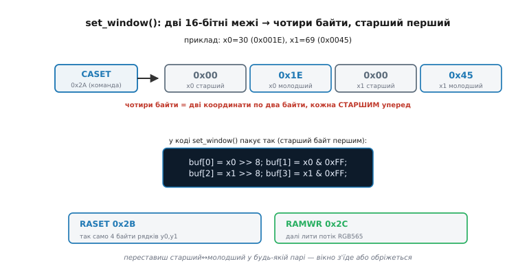
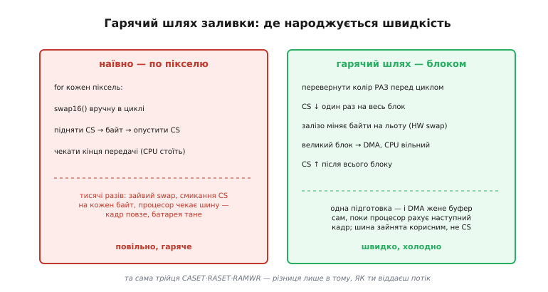

# ⚙️ Віконний вивід у GRAM: драйвер, що малює блоками

**Задача.** У статті ми розібрали протокол на пальцях: `CASET` окреслює стовпці, `RASET` — рядки, `RAMWR` відкриває потік, а контролер сам веде курсор по [власній пам'яті GRAM](root:hw-motion/display-controller). Знати цей протокол і мати з нього зручний драйвер — різні речі. Щойно ви спробуєте писати ці три команди прямо в тілі кожної функції малювання, код розповзеться однаковими шматками: тут спакував межі вікна, там знову ті самі чотири байти, і в кожному місці свій шанс переставити старший байт із молодшим. Тому зберімо все в один невеликий драйвер поверх примітивів `send_cmd`/`send_data`, [що лишилися нам від ініціалізації](root:embedded/gram-init-sequence): одна функція `set_window()`, яка правильно пакує межі, і пара функцій виводу — `push_pixels()` для потоку й `fill_rect()` для суцільної заливки. А тоді проженемо крізь цей драйвер три різні за характером задачі — залити прямокутник, вивести спрайт, поміняти один піксель — і побачимо, де народжується швидкість, а де чигають класичні пастки. Усе на реальному C прошивки, без псевдокоду.

**Ідея.** Погляньмо, що спільного в геть різних дій — заливці всього екрана, виводі літери, зміні однієї цятки. У всіх трьох рівно два кроки: **окреслити вікно** й **вилити в нього стільки-то пікселів**. Різниця лише в розмірі вікна та довжині потоку — а сама пара «відкрий вікно / лий пікселі» незмінна. Коли форма дій однакова, її гріх повторювати в кожному місці: краще один раз інкапсулювати «відкрити вікно» в `set_window()`, «вилити потік» — у `push_pixels()`, а всі вищі операції зібрати з цих двох цеглин. Тоді `fill_rect()` — це `set_window()` плюс потік одного кольору, вивід спрайта — `set_window()` плюс потік його масиву, а один піксель — `set_window()` на 1×1 плюс два байти. Одна пара примітивів обслуговує весь спектр малювання, а вся тонка робота — правильне пакування байтів меж, переворот кольору, гарячий шлях великих блоків — живе в одному місці, де її легко зробити раз і правильно.

## set_window(): чотири байти, які всі плутають

Почнімо з серця драйвера — функції, що окреслює прямокутник. У статті ми сказали, що `CASET` і `RASET` беруть «початковий і кінцевий» стовпці та рядки. Тепер точніше: кожна з цих команд чекає **чотири байти аргументів**, бо кожна координата — 16-бітна (панель буває ширша за 255 пікселів), а на два кінці треба дві координати. І порядок цих байтів — не абиякий: контролер хоче кожне 16-бітне число **старшим байтом уперед** (big-endian на дроті), точно як він хотів пікселі у форматі RGB565. Це та сама вимога big-endian, що вже перетворювала нам червоне на синє у прозі статті, — тільки тепер вона стосується координат, і плата за помилку інша: не колір поплив, а вікно з'їхало.


*Чому меж чотири байти. Команда `CASET` (0x2A) приймає дві 16-бітні координати — початок і кінець стовпця, — а кожна 16-бітна координата на дроті йде двома байтами, старшим уперед. Для стовпців 30…69 це `0x00 0x1E 0x00 0x45`: `x0=30=0x001E` розкладене на `0x00` (старший) і `0x1E` (молодший), тоді `x1=69=0x0045` так само. `RASET` (0x2B) робить те саме для рядків, `RAMWR` (0x2C) відкриває потік. Переставиш старший із молодшим у будь-якій парі — вікно зсунеться або обріжеться, а картинка «попливе» без жодної помилки компілятора.*

Ось `set_window()`. Уся її суть — правильно розкласти чотири 16-бітні числа на вісім байтів у потрібному порядку й послати три команди строго по черзі:

```c
#include <stdint.h>

/* Примітиви з кроку ініціалізації — ті самі, не переписуємо. */
void send_cmd(uint8_t c);                        // D/C = 0, вилити байт-команду
void send_data(const uint8_t *buf, uint32_t n);  // D/C = 1, вилити n байтів даних

#define CASET  0x2A   // column address set — межі стовпців
#define RASET  0x2B   // row address set    — межі рядків
#define RAMWR  0x2C   // memory write       — відкрити потік пікселів

/* Окреслити прямокутне вікно [x0..x1] × [y0..y1] і відкрити прийом пікселів.
   Межі ВКЛЮЧНІ з обох кінців: вікно 0..0 — це рівно один піксель. */
static void set_window(uint16_t x0, uint16_t y0, uint16_t x1, uint16_t y1)
{
    uint8_t buf[4];

    send_cmd(CASET);                    // далі — чотири байти меж стовпців
    buf[0] = (uint8_t)(x0 >> 8);        // x0 СТАРШИЙ байт першим
    buf[1] = (uint8_t)(x0 & 0xFF);      // x0 молодший
    buf[2] = (uint8_t)(x1 >> 8);        // x1 старший
    buf[3] = (uint8_t)(x1 & 0xFF);      // x1 молодший
    send_data(buf, 4);

    send_cmd(RASET);                    // те саме для рядків
    buf[0] = (uint8_t)(y0 >> 8);
    buf[1] = (uint8_t)(y0 & 0xFF);
    buf[2] = (uint8_t)(y1 >> 8);
    buf[3] = (uint8_t)(y1 & 0xFF);
    send_data(buf, 4);

    send_cmd(RAMWR);                    // курсор у (x0,y0), контролер чекає потік
}
```

Прочитаймо, що тут важливо. Пакування `x0 >> 8` дає старший байт, `x0 & 0xFF` — молодший, і кладемо ми їх у буфер саме в цьому порядку — старший на позицію `buf[0]`, бо контролер читає перший байт як старший. Це **ручне** пакування, і воно навмисне не покладається на те, як ваша платформа тримає `uint16_t` у пам'яті: ми беремо число й самі витягуємо з нього байти зсувами, тож код дасть однаковий результат і на little-endian ESP32, і на big-endian машині. Це принципова відмінність від наївного «вилити байти uint16 як лежать»: там порядок диктувала пам'ять, тут — ми. Три команди йдуть строго `CASET` → `RASET` → `RAMWR`, і остання не має аргументів: вона лише перемикає контролер у режим прийому, після чого кожні два байти по SPI він тлумачить як один піксель. Після `set_window()` контролер сидить із курсором у лівому верхньому куті вікна й чекає — лий потік.

> 🔧 **Навіщо це.** `set_window()` — єдине місце в усьому графічному коді, де межі перетворюються на байти. Зосередивши це пакування в одній функції, ви прибиваєте цілий клас багів «картинка з'їхала на кілька пікселів» до одного місця, де його легко звірити з datasheet раз і назавжди. Розсипте ці ж чотири байти по десятку функцій малювання — і кожна стане окремим шансом переставити старший байт із молодшим, а такий баг не ловиться компілятором і виглядає як загадковий зсув зображення.

## push_pixels(): потік у відкрите вікно

Вікно відкрито — час лити пікселі. Друга цегла драйвера бере готовий масив 16-бітних кольорів і виливає його в контролер як суцільний потік байтів. Тут причаївся той самий порядок байтів, що й у меж, тільки тепер він стосується самих пікселів, — і саме тут ми вперше свідомо обираємо, **хто** перевертає байти.

```c
#include <stddef.h>

/* Вилити масив із n пікселів RGB565 у вже відкрите вікно.
   Пікселі МУСЯТЬ бути у «дротовому» порядку — старшим байтом уперед. */
static void push_pixels(const uint16_t *px, size_t n)
{
    /* Найпростіше — вилити весь масив як байти одним send_data.
       Байти вже у правильному порядку (див. нижче про переворот),
       тож жодної обробки в циклі: одна передача на весь блок. */
    send_data((const uint8_t *)px, n * 2);   // 2 байти на піксель
}
```

Зверніть увагу, чого тут **немає**: немає циклу, що перевертає кожен піксель. Масив виливається одним махом, як суцільний блок байтів. Але це працює тільки за умови, що пікселі вже лежать у пам'яті **дротовим** порядком — старший байт кожного за меншою адресою. Звідки він там візьметься? Є три чесні шляхи, і вибір між ними — та сама інженерна розвилка, про яку йшлося в статті. Перший: хай ваш `rgb565()` одразу повертає перевернуте число, і тоді весь буфер від початку «дротовий». Другий, найкращий: доручити переворот **самому SPI**, який уміє міняти байти апаратно — тоді в пам'яті хай лежить звичний little-endian, а на дріт залізо віддасть big-endian задарма. Третій ми зараз побачимо на суцільній заливці — перевернути колір **раз** перед циклом. Спільне у всіх: у гарячому циклі `push_pixels()` **жодного** `swap16` — переворот або вже зроблено при заповненні буфера, або його робить залізо.

А що як SPI перевертати байти апаратно **не** вміє, а буфер лежить у природному порядку? Тоді доводиться перевертати софтом — але й тоді не поштучно в наївному циклі, а цілим проходом по буферу перед єдиною передачею:

```c
/* Запасний варіант, коли ні HW-swap, ні «дротового» буфера немає:
   переганяємо блок у тимчасовий буфер уже переверненим — одним проходом. */
static void push_pixels_swap(const uint16_t *px, size_t n)
{
    static uint16_t line[320];          // буфер на один рядок, у флеш не лізе
    while (n) {
        size_t chunk = (n < 320) ? n : 320;
        for (size_t i = 0; i < chunk; i++)
            line[i] = (uint16_t)((px[i] >> 8) | (px[i] << 8));   // swap16
        send_data((const uint8_t *)line, chunk * 2);            // блок цілком
        px += chunk;
        n  -= chunk;
    }
}
```

Різниця з наївним підходом тонка, але вирішальна: переворот тут — окремий тісний цикл над масивом у RAM, а передача — **один** `send_data` на цілий рядок. Ми не змішуємо «перевернути» й «послати» на кожному пікселі, бо кожен окремий `send_data` на два байти тягне за собою всю церемонію транзакції шини (а на SPI ESP32 — ще й смикання CS, до чого зараз дійдемо). Перевернути весь рядок у пам'яті — копійки; послати його одним блоком — швидко; послати ті самі пікселі поштучно — повільно на порядок.

> 🔧 **Навіщо це.** Порядок байтів пікселя вирішуйте **один раз** на рівні архітектури драйвера, а не в кожному виводі. Найкраще — увімкнути апаратний переворот у SPI й забути про `swap16` у коді зовсім; тоді буфери лежать у природному little-endian, а на дріт летить правильний big-endian без жодного такту процесора. Ручний переворот — лише запасний аеродром для периферії, що цього не вміє, і навіть він мусить бути проходом над блоком, а не операцією в гарячому циклі.

## Сценарій 1: суцільна заливка прямокутника

Тепер зберімо перше корисне з двох цеглин — заливку прямокутника одним кольором. Це найчастіша операція взагалі: очистити екран, намалювати смугу, підкласти тло під текст. І саме на ній найяскравіше видно, як **не** треба лити пікселі й як треба.

```c
uint16_t swap16(uint16_t c) { return (uint16_t)((c >> 8) | (c << 8)); }

/* Залити прямокутник [x0..x1]×[y0..y1] суцільним кольором.
   color — «людський» RGB565 (як повертає rgb565); переворот робимо тут. */
static void fill_rect(uint16_t x0, uint16_t y0,
                      uint16_t x1, uint16_t y1, uint16_t color)
{
    set_window(x0, y0, x1, y1);                 // окреслили вікно, RAMWR уже пішов

    uint16_t wire = swap16(color);              // ПЕРЕВОРОТ РАЗ, перед циклом!
    uint32_t count = (uint32_t)(x1 - x0 + 1) * (y1 - y0 + 1);   // скільки пікселів

    /* лити один і той самий wire count разів — блоками, не поштучно */
    static uint16_t chunk[64];
    for (int i = 0; i < 64; i++) chunk[i] = wire; // заповнили буфер-шматок раз

    while (count) {
        uint32_t k = (count < 64) ? count : 64;
        send_data((const uint8_t *)chunk, k * 2);  // цілий шматок одним send_data
        count -= k;
    }
}
```

Ось де ховається головний урок заливки — рядок `uint16_t wire = swap16(color)` стоїть **перед** циклом, а не всередині. Колір один на весь прямокутник, тож перевертати його треба **раз**, а не на кожному з десятків тисяч пікселів. Наївний код зробив би `send_data` окремо на кожен піксель і всередині кликав би `swap16` щоразу — та сама робота повторюється стільки разів, скільки в прямокутнику точок, дарма гріючи процесор. Ми ж перевертаємо колір один раз, заповнюємо ним невеликий буфер-шматок теж один раз, а тоді женемо цей готовий шматок у контролер великими порціями. Контролер сам розкладає потік по рядках вікна — йому байдуже, що всі пікселі однакові. Для заливки всього екрана 320×240 це 76 800 пікселів, і різниця між «перевернути раз» і «перевернути 76 800 разів» — це різниця між миттєвою заливкою й помітним оку підгальмовуванням.

Заповнення `chunk[]` одним кольором теж винесене з головного циклу: ми набиваємо буфер `wire`-ом раз, а тоді лише переливаємо його в шину скільки треба. Це та сама думка — **зайву роботу геть із гарячого циклу**, — але вже на рівень нижче.

## Сценарій 2: блит спрайта-масиву

Друга задача — вивести на екран готове зображення: іконку, літеру шрифту, кадр анімації. У пам'яті воно лежить масивом пікселів RGB565 підряд, рядок за рядком, — це той самий [кадровий буфер](root:sf-visual/framebuffer), тільки маленький, розміром зі спрайт. «Блит» (англ. *blit*, від *block image transfer* — «блокова передача зображення») означає перекинути цей блок пікселів на екран одним махом. І тут вікняна модель показує всю свою красу: окресли вікно рівно під спрайт — і вилий його масив потоком.

```c
/* Вивести спрайт w×h пікселів з лівого верхнього кута (x,y).
   sprite — масив w*h пікселів RGB565, рядок за рядком.
   Пікселі вважаємо вже у «дротовому» порядку (готують при завантаженні образу). */
static void blit_sprite(uint16_t x, uint16_t y,
                        uint16_t w, uint16_t h, const uint16_t *sprite)
{
    set_window(x, y, x + w - 1, y + h - 1);     // вікно РІВНО під спрайт
    push_pixels(sprite, (size_t)w * h);         // увесь масив — одним потоком
}
```

Придивіться, наскільки це коротко — і чому. Уся робота з розкладанням пікселів по рядках лежить на контролері: ми лише сказали «вікно `w×h` отут» і вилили `w·h` пікселів поспіль. Контролер сам знає, що після `w`-го пікселя рядок скінчився й час переходити на новий рядок вікна, — нам не треба ні рахувати переходи, ні слати координати кожного рядка окремо. Ключова тонкість у розмірі вікна: `x + w - 1` та `y + h - 1`, а не `x + w`, бо межі вікна **включні** з обох боків — вікно від 10 до 10 покриває рівно один стовпець, а не нуль і не два. Помилка на одиницю тут — класика: візьмете `x + w` замість `x + w - 1`, і спрайт вилізе на піксель ширшим, потік не збіжеться з вікном, а картинка «поповзе» вправо з кожним рядком.

Одна умова робить цей блит таким швидким: пікселі спрайта мусять уже лежати в «дротовому» порядку. Спрайти зазвичай зашиті у флеш як константа, тож перевернути їх байти можна **під час підготовки образу** — конвертером на етапі збірки прошивки, раз і назавжди, — і тоді в рантаймі блит не платить за переворот нічого. Це та сама економія, що й зберігати кадр у дротовому порядку: винести переворот з рантайму туди, де він робиться один раз.

> 🔧 **Навіщо це.** Уся анімація й весь текст на панелі — це блит спрайтів. Тому варто, щоб `blit_sprite()` був якнайтоншим над `set_window()` + `push_pixels()`, а вся підготовка (переворот байтів, палітра) відбувалася **до** рантайму. Готовий двигун таких послідовних блитів — як із них складають плавний рух — розгорнуто в [проєкті рушія анімації](root:embedded/led-animation-patterns/proj-engine.md); тут же нам важливо, що один блит — це буквально «вікно під спрайт і потік його пам'яті».

## Сценарій 3: один піксель — вікно 1×1

Третя задача виглядає протилежністю перших двох: змінити **одну** цятку. Намалювати точку графіка, засвітити піксель курсору. Здавалося б, для одного пікселя вікняна машина — з гармати по горобцях. Але ніякого іншого шляху в розумну панель немає: писати в чужу GRAM можна **тільки** через вікно, тож один піксель — це просто вікно розміром 1×1.

```c
/* Поставити один піксель кольору color у точку (x,y). */
static void draw_pixel(uint16_t x, uint16_t y, uint16_t color)
{
    set_window(x, y, x, y);                     // вікно 1×1: обидва кінці однакові
    uint16_t wire = swap16(color);              // один піксель — один переворот
    send_data((const uint8_t *)&wire, 2);       // рівно два байти в GRAM
}
```

Тут `set_window(x, y, x, y)` — вікно, у якого початок і кінець збігаються по обох осях, тобто рівно одна комірка. Далі два байти кольору — і все. Прочитайте це у зв'язці з попередніми сценаріями: **та сама** трійця `CASET`/`RASET`/`RAMWR`, **та сама** `set_window()`, різниця лише в тому, що вікно завбільшки з піксель, а потік — два байти. Одна машина обслуговує і заливку 76 800 пікселів, і зміну однієї цятки; масштаб різний, механізм тотожний.

Але тут криється й пересторога, важливіша за сам код. Один `draw_pixel()` тягне за собою **три команди й дві передачі даних** — цілий протокол відкриття вікна заради двох байтів. Це страшенно марнотратно, якщо малювати щось із багатьох пікселів **поштучно**: намалювати лінію чи коло викликами `draw_pixel()` у циклі означає відкривати нове вікно на кожну точку, і накладні витрати вікна роздмухають просту фігуру в тисячі зайвих команд. `draw_pixel()` хороший рівно для **поодиноких** цяток. Щойно пікселів багато й вони поруч — думайте прямокутниками (`fill_rect`) або малюйте у власний буфер і виштовхуйте його одним блитом. Вікно 1×1 — інструмент для однієї точки, а не будівельний блок для фігур.

## Гарячий шлях: CS, DMA і апаратний переворот

Дотепер ми стежили, щоб не робити зайвого в циклі. Тепер піднімімося на рівень шини й розберімо, **чому** великий блок треба гнати саме так — тримаючи CS низьким, через DMA, з апаратним переворотом байтів. Це і є гарячий шлях: місце, де вирішується, чи кадр малюється миттєво, чи повзе.


*Дві дороги до тієї самої картинки. Ліворуч наївно: `swap16` крутиться в циклі, CS підіймається й опускається на кожен байт, процесор стоїть і чекає кінця кожної крихітної передачі — кадр повзе, батарея тане. Праворуч гарячий шлях: колір перевернуто раз, CS опущено один раз на весь блок, байти міняє залізо на льоту, а великий блок жене DMA, поки процесор рахує наступний кадр. Трійця команд однакова — різниця лише в тому, ЯК віддається потік.*

**Чому тримати CS низьким на весь блок.** [Лінія CS (chip select — «вибір мікросхеми»)](root:com-devices/chip-select) каже панелі «зараз я говорю до тебе»: поки CS низький, контролер слухає шину, коли високий — ігнорує. Природна спокуса — на кожен `send_data` чесно опустити CS перед байтами й підняти після. Для великого потоку це згубно: підняти CS означає **закрити** транзакцію, а наступний байт відкриває нову, з усією її церемонією — і потік рветься на тисячі окремих клаптиків. Правильно — опустити CS **один раз** перед усім блоком і тримати низьким, доки не вилито останній піксель. Тоді пікселі течуть суцільною рікою, а не окремими краплями, кожна зі своїм краном. На SPI ESP32 це виражають прапорцем транзакції `SPI_TRANS_CS_KEEP_ACTIVE` — «не піднімати CS після цієї передачі», — зчіплюючи кілька передач в одну неперервну.

**Чому DMA для великих блоків.** Коли процесор сам виливає буфер у SPI байт за байтом, він на весь час передачі **зайнятий** — стоїть у циклі, годуючи шину, і більше нічого не робить. Для заливки екрана це десятки тисяч байтів, протягом яких мовчать давачі й завмирає керування. DMA (англ. *direct memory access* — «прямий доступ до пам'яті») знімає цю ношу: ви віддаєте йому вказівник на буфер і довжину, а спеціальний контролер сам, без участі процесора, переганяє байти з пам'яті в SPI. Поки DMA жене кадр у панель, процесор вільний рахувати наступний кадр, читати давачі, крутити керування. На ESP32 DMA вмикається вибором каналу при налаштуванні шини (`dma_chan` у `spi_bus_initialize`), і саме він знімає стелю розміру передачі — без DMA одна транзакція SPI обмежена кількома десятками байтів, а з ним ллється буфер будь-якого розміру. Тому DMA — не прикраса, а те, що взагалі робить блит цілого кадру можливим одним махом.

**Чому апаратний переворот байтів замість `swap16`.** Ми вже казали: SPI-периферія багатьох МК уміє віддавати байти в оберненому порядку сама. Варто це підключити — і `swap16` зникає з коду зовсім: у пам'яті буфер лежить у природному little-endian, а на дріт залізо кладе big-endian на льоту, не витрачаючи **жодного** такту процесора. Порівняйте з ручним переворотом цілого кадру перед відправкою: то зайвий прохід по 150 КБ і зайва копія в RAM. Апаратний переворот робить те саме безплатно, паралельно з самою передачею. На ESP32 це роблять готові макроси на кшталт `SPI_SWAP_DATA_TX`, що готують слово під формат шини; сенс той самий — перекласти механічну роботу на залізо, а процесор лишити для корисного.

Складімо ці три речі докупи — так виглядає заливка на гарячому шляху концептуально:

```c
/* Гарячий шлях заливки одним блоком: CS вниз, DMA жене буфер, HW-swap у SPI.
   spi_* — обгортки над периферією вашої платформи. */
static void fill_rect_fast(uint16_t x0, uint16_t y0,
                           uint16_t x1, uint16_t y1, uint16_t color)
{
    set_window(x0, y0, x1, y1);
    uint32_t count = (uint32_t)(x1 - x0 + 1) * (y1 - y0 + 1);

    /* колір готуємо РАЗ; апаратний swap у SPI зробить big-endian сам,
       тож у буфер кладемо звичайний color, без ручного swap16 */
    static uint16_t block[512];
    for (int i = 0; i < 512; i++) block[i] = color;

    spi_cs_low();                                // CS ↓ один раз на весь блок
    while (count) {
        uint32_t k = (count < 512) ? count : 512;
        spi_write_dma((const uint8_t *)block, k * 2);  // DMA жене, CPU вільний
        count -= k;
    }
    spi_cs_high();                               // CS ↑ після всього блоку
}
```

Різниця з першим `fill_rect()` — не в логіці, а в тому, **чиїми руками** робиться робота. Логіка та сама: окреслив вікно, приготував колір раз, вилив потрібну кількість. Але тепер CS опускається один раз на весь блок (не смикається на кожну передачу), байти жене DMA (не процесор у циклі), а порядок байтів робить SPI апаратно (не `swap16` у коді). Кожен із трьох переносів зокрема прискорює вивід, а разом вони перетворюють «повзе й гріється» на «миттєво й холодно».

> 🔧 **Навіщо це.** Це три важелі, якими ви розганяєте будь-який вивід на панель, і крутити їх треба разом. CS низько на весь блок — щоб потік не рвався на транзакції. DMA — щоб процесор не стояв, годуючи шину, а рахував наступний кадр. Апаратний переворот — щоб байти лягали правильно без єдиного такту CPU. Пропустите бодай один — і впораєтеся з дрібним спрайтом, але заллятий екран почне помітно підгальмовувати, а споживання підстрибне на порожньому місці.

## Складність і пастки

Драйвер вийшов невеликий, але кожна з трьох його дій ховає класичну пастку, на якій застрягають усі, хто вперше пише вивід у GRAM. Розберімо їх із механізмом — бо саме розуміння *чому* економить години полювання на привида.

**Межі вікна за краєм екрана.** Найпідступніше — коли прямокутник або спрайт частково вилазить за фізичні розміри панелі. Скажімо, екран 240 пікселів завширшки, а ви кличете `fill_rect(200, 0, 300, 20, …)` — правий край `x1=300` за межею останнього стовпця `239`. Що зробить контролер, залежить від його норову: одні мовчки обріжуть вікно до країв матриці, інші загорнуть адресу й почнуть писати з протилежного боку екрана, лишивши сміттєву смугу там, де її не чекали. Компілятор тут глухий — `300` цілком законне 16-бітне число. Захист один: **обрізати** межі до розмірів екрана перед тим, як віддати їх у `set_window()`. Ось дешева обгортка, що це робить:

```c
#define SCR_W 240
#define SCR_H 320

/* Безпечна заливка: обрізає прямокутник до екрана, відкидає вироджений. */
static void fill_rect_safe(int x0, int y0, int x1, int y1, uint16_t color)
{
    if (x0 < 0) x0 = 0;   if (y0 < 0) y0 = 0;          // не лізти ліворуч/вгору
    if (x1 > SCR_W - 1) x1 = SCR_W - 1;                // не лізти за правий край
    if (y1 > SCR_H - 1) y1 = SCR_H - 1;               // не лізти за нижній край
    if (x0 > x1 || y0 > y1) return;                    // весь прямокутник за екраном
    fill_rect((uint16_t)x0, (uint16_t)y0,
              (uint16_t)x1, (uint16_t)y1, color);
}
```

Зверніть увагу на два запобіжники. Обрізання зверху (`x1 > SCR_W-1`) не пускає вікно за правий і нижній краї; перевірка `x0 > x1` після обрізання ловить випадок, коли прямокутник **весь** лежить за екраном (тоді після обрізки початок опиниться правіше кінця) — і тихо нічого не малює замість того, щоб слати контролеру безглузде вивернуте вікно. Ці кілька рядків коштують копійки, а рятують від цілого класу «звідки на екрані ця смуга сміття збоку».

**Забутий RAMWR перед потоком.** Друга пастка тонша й дошкульніша. Ви окреслили вікно `CASET`/`RASET` — і одразу, забувши `RAMWR`, почали лити пікселі через `send_data`. Що станеться? Контролер **не** в режимі запису пам'яті: він досі чекає або команду, або аргументи попередньої, і ваші «пікселі» він з'їсть як казна-що — як аргументи невідомо чого чи як команди. На екрані — хаос або нічого, і причина зовсім не там, де її шукаєш, бо колір і координати правильні. Саме тому в нашому драйвері `RAMWR` **вшитий у кінець** `set_window()`: функція не просто задає межі, а лишає контролер уже готовим приймати потік. Це свідоме рішення — зробити неможливим «відкрив вікно, забув RAMWR»: хто кличе `set_window()`, той автоматично отримує й відкритий потік. Якби `RAMWR` жив окремою функцією, яку треба кликати руками, забути її було б питанням часу. Мораль ширша за цей код: **інкапсулюйте кроки, які завжди йдуть разом**, щоб їх не можна було рознести й загубити один.

**Зайвий переворот у циклі.** Третю пастку ми весь час обходили, тож назвімо її прямо. Це найпоширеніша втрата швидкості: перевертати колір `swap16` **всередині** циклу виводу замість одного разу перед ним. Спокуса природна — «мені ж треба дротовий порядок, переверну тут, де ллю». Але при суцільній заливці колір **один** на весь прямокутник, тож переворот у циклі повторює тотожну операцію десятки тисяч разів дарма. Тонший різновид тієї ж помилки — окремий `send_data` на кожен піксель: навіть без `swap16` це роздуває вивід, бо кожна крихітна передача тягне повну церемонію транзакції шини, а при `SPI_TRANS_CS_KEEP_ACTIVE` ще й марно зчіплює те, що могло б їхати одним блоком. Правило коротке: **у гарячому циклі — нуль обчислень, що не залежать від конкретного пікселя**. Колір перевернути раз перед циклом (а краще — доручити SPI); буфер-шматок набити раз; лити блоками, не поштучно. Усе, що однакове для всіх пікселів блоку, готують **до** циклу.

Підсумуймо нитку драйвера. Ми помітили, що будь-яке малювання в GRAM зводиться до двох дій — окреслити вікно й вилити в нього потік, — і зібрали з них дві цеглини: `set_window()`, що правильно й в одному місці пакує чотири байти кожної межі старшим уперед, і `push_pixels()`, що жене масив одним блоком без перевороту в циклі. З цих двох склалися три різні за масштабом операції — заливка прямокутника, блит спрайта, зміна однієї цятки вікном 1×1, — і всі три виявилися тією самою машиною, різною лише розміром вікна й довжиною потоку. На гарячому шляху ми поклали важку роботу на залізо: CS низько на весь блок, щоб потік не рвався; DMA, щоб процесор не стояв; апаратний переворот, щоб байти лягали правильно без такту CPU. А три класичні пастки — вікно за краєм екрана, забутий `RAMWR`, зайвий переворот у циклі — знешкодили в самій конструкції драйвера: обрізанням меж, вшитим у `set_window()` `RAMWR`-ом і залізним правилом тримати гарячий цикл порожнім від зайвого. Це і є форма, в якій варто тримати вивід у розумну панель: тонкі цеглини поверх примітивів шини, важка робота — на DMA й залізі, а пастки закриті так, щоб у них не можна було впасти.
