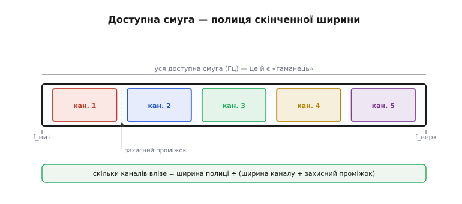
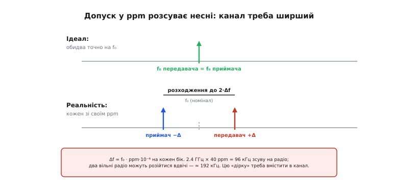
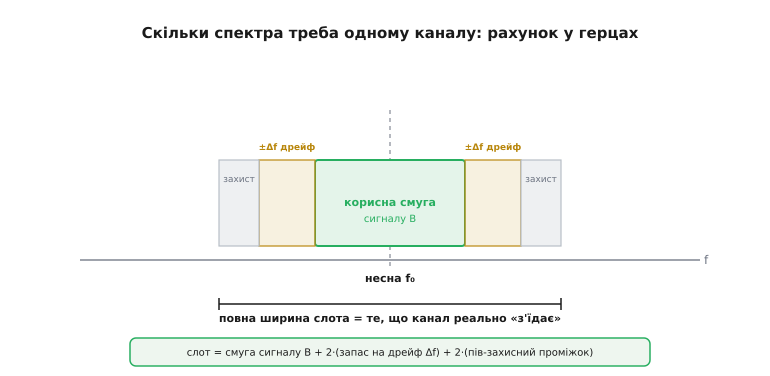
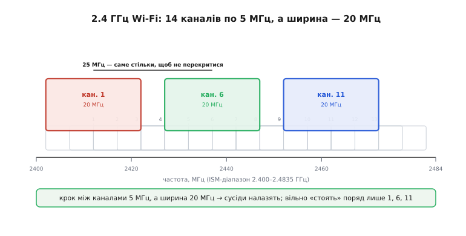

# Частотний бюджет у системах зв'язку

У [бюджеті радіолінії](root:embedded/link-budget) ми навчилися рахувати **потужність**: стовпчик децибел, що відповідає на питання «чи добиває сигнал на потрібну відстань». Це був бюджет одного ресурсу — **енергії**. Але енергія не єдине, чого в радіо завжди бракує. Є другий ресурс, такий самий скінченний і такий самий спільний, — **частота**. Ефір — не безмежна порожнеча, у яку можна напхати скільки завгодно каналів: доступна смуга вузька, поділена законом між усіма, і кожен сигнал займає в ній цілком конкретний шматок герців. Коли цей шматок треба роздати багатьом — або просто впевнитися, що твій канал не наповзе на сусідній, — рахунок ведуть так само строго, як рахунок потужності. Цей рахунок і зветься **частотний бюджет** (*frequency budget*).

Ідея дзеркальна до знайомої. Там ми складали й віднімали децибели, доки вистачало запасу за потужністю. Тут ми складатимемо й віднімати **герци**, доки вистачає місця в смузі. І так само, як бюджет лінії рятує від «спробуймо й побачимо, чи добʼє», частотний бюджет рятує від «спробуймо й побачимо, чи поміститься» — питання, на яке в людному ефірі дедалі важче відповісти навмання.

### Смуга — це гаманець, а не океан

Почнімо з найголовнішого «чому»: чому взагалі є про що рахувати. Здавалося б, частот нескінченно багато — бери будь-яку. Насправді ж той клапоть спектра, у якому **дозволено** працювати твоєму пристрою, вузький і жорстко окреслений. Знайомий усім [діапазон](topic:communications/frequency-bands) 2.4 ГГц — це насправді смуга завширшки лише **83.5 МГц** (від 2.400 до 2.4835 ГГц). Усе: Wi-Fi, Bluetooth, мікрохвильовки, радіокеровані іграшки, бездротові навушники — мусять уміститися в ці вісімдесят із гаком мегагерц. За межі лізти не можна: сусідні смуги належать стільниковим операторам, авіації, військовим, і вторгнення туди — порушення закону про спектр.

> 📡 **Залежність — діапазони частот.** Спектр поділено між службами міжнародними угодами; вільні для всіх «без ліцензії» лише кілька **ISM-смуг** (industrial, scientific, medical) — як 2.4 ГГц чи 868/915 МГц. Знати тут досить одного: твоя робоча смуга має фіксовані краї, за які виходити заборонено, тож усі канали мусять уміститися всередині неї. Докладніше — у темі [діапазони частот](topic:communications/frequency-bands).

Отже, смуга — це **гаманець** зі скінченною сумою герців, а не бездонний океан. І щойно ми це визнали, з'являється бухгалтерія: скільки коштує один канал, скільки каналів влізе, що з'їдає місце «в нікуди».


*Уся дозволена смуга — це полиця від f_низ до f_верх. На неї ставлять канали-коробки, а між ними лишають захисні проміжки. Скільки каналів влізе — проста ділянка: ширина полиці поділена на (ширина одного каналу плюс проміжок). Спектр скінченний, тож це справді бюджет.*

### Ширину каналу диктує швидкість даних

Перше питання бюджету: скільки герців з'їдає **один** канал? Відповідь приходить не з радіо, а з теорії інформації, і ми її вже зустрічали. Щоб передавати швидше, потрібна ширша смуга — це залізний [обмін Шеннона між швидкістю та смугою](topic:communications/bandwidth-capacity). Канал, що везе сотні мегабіт за секунду, мусить бути широким (десятки мегагерців); вузенький канал на кілька кілогерців здатен на повільну цівку байтів — і не більше.

> 🔧 **Навіщо це.** Це перший важіль частотного бюджету, і він прямо повʼязаний із бюджетом лінії. Хочеш умістити **більше** каналів у ту саму смугу — звужуй кожен, тобто **знижуй швидкість**. Звузив канал — у нього потрапляє менше шуму, тож поліпшується чутливість приймача (саме тому LoRa з її вузькою смугою чує так глибоко). Той самий вибір «швидкість проти дальності», що ми бачили в [бюджеті лінії](root:embedded/link-budget), тут стає вибором «швидкість проти кількості каналів». Один важіль — два бюджети.

Тож ширина каналу — не вільний параметр, а наслідок потрібної швидкості. Закладемо її як перший доданок і рушаймо далі: бо сама лише смуга сигналу — це ще не все, що канал реально «з'їдає».

### Чому між каналами лишають порожнечу

Якби сигнал ідеально вміщувався у свою смугу — як вода в склянку рівно до краю — канали можна було б ставити впритул. Але реальний сигнал так не вміє: його спектр має «спідниці» (*sidelobes* — бічні пелюстки), що виходять за номінальні краї каналу й тихо світять у сусідів. Якщо поставити два канали впритул, ці спідниці одного потраплять у приймач другого як завада. Тому між каналами завжди лишають **захисну смугу** (*guard band*) — навмисне порожній проміжок, який ніхто не використовує, аби спідниці згасли, перш ніж дістатися сусіда.

Це той самий [захисний проміжок](topic:communications/guard-band-duplexing), що ми мигцем бачили у [методах множинного доступу](root:embedded/multiple-access-methods): FDMA працює лише тому, що між частотними каналами є порожні зазори. Тепер ми розуміємо його роль точніше — це **стаття витрат** частотного бюджету: герці, віддані «в нікуди» заради того, щоб сусіди не чули одне одного.

> 📡 **Залежність — захисна смуга й дуплекс.** Реальний сигнал не вміщується ідеально у свій канал — його краї «вилазять» до сусідів, тож між каналами лишають порожній проміжок-захист. Той самий прийом розділяє і два напрямки звʼязку (туди й назад) у частотному дуплексі. Досить памʼятати: частина смуги завжди йде на ізоляцію, і це закладають у бюджет. Докладніше — [захисні смуги і дуплекс](topic:communications/guard-band-duplexing).

### Несна не стоїть на місці: дрейф у ppm

Тепер найтонше — і саме тут частотний бюджет із простого діління перетворюється на справжню інженерію. Ми досі мовчки припускали, що канал стоїть рівно на своїй частоті. Але **несна частота** (*carrier* — та частота, навколо якої будується сигнал) задається кварцовим резонатором, а жоден кварц не точний абсолютно. Його похибку міряють у **проміле** (*ppm*, parts per million — частин на мільйон): скажімо, кварц «±40 ppm» означає, що справжня частота може гуляти на 40 мільйонних від номіналу в будь-який бік.

Сорок мільйонних здається дрібницею — доки не помножиш на велику несну. На 2.4 ГГц:

```
Δf = f₀ · ppm · 10⁻⁶ = 2.4·10⁹ · 40 · 10⁻⁶ = 96 000 Гц = 96 кГц
```

Майже сто кілогерців зсуву — від **одного** радіо. А передавач і приймач мають **кожен свій** кварц, і їхні похибки можуть дивитися в протилежні боки: передавач уплив на +96 кГц, приймач — на −96 кГц. Сумарне розходження між ними — **до 192 кГц**. Це вже не дрібниця: для вузького каналу така «дірка» може бути зіставна з самою смугою сигналу.


*Угорі ідеал: передавач і приймач точно на f₀. Унизу реальність: кожен зі своїм кварцом, передавач зсунувся на +Δf, приймач — на −Δf, і вони розійшлися аж до 2·Δf. Цю «дірку» канал мусить уміщувати, інакше приймач шукатиме сигнал не там, де той насправді є.*

Звідси випливає правило, неочевидне для початківця: **канал мусить бути ширший за саму смугу сигналу** — рівно настільки, щоб уместити можливий дрейф несної з обох боків. Інакше при найгіршому збігу похибок приймач наведеться повз сигнал і просто його не почує — хоч потужності за [бюджетом лінії](root:embedded/link-budget) вистачає з лишком. Лінія «працює» на папері, а зв'язку немає, бо канал виявився завузьким для реального дрейфу.

> 🔧 **Навіщо це.** Ось чому в даташиті радіомодуля поряд зі швидкістю завжди стоїть вимога до кварцу — наприклад, «±20 ppm або краще». Дешевший кварц на ±50 ppm коштує втричі менше, але його дрейф може виштовхнути несну за межі, де приймач її ще ловить, — і зв'язок почне «то є, то нема» від нагріву плати. Економлячи копійки на кварці, легко купити нестабільний лінк. Або інший бік: якщо взяв **дорогий** точний кварц (одиниці ppm), можеш дозволити собі вужчі канали — і вмістити їх у смузі більше. Кварц — це прямий доданок частотного бюджету.

### Рух теж зсуває частоту: Доплер

Є ще одне джерело зсуву, і для дронів воно особливо доречне — **ефект Доплера** (*Doppler*, на честь Крістіана Доплера, австрійського фізика, який 1842 року описав зсув частоти від руху). Коли передавач і приймач зближуються або віддаляються, прийнята частота зсувається пропорційно швидкості:

```
f_доплер = f₀ · v / c
```

де v — взаємна швидкість, c — швидкість світла. Порахуймо для дрона.

**Приклад (доплерівський зсув швидкого дрона).** Апарат летить просто на наземну станцію зі швидкістю 30 м/с на несній 2.4 ГГц:

```
f_доплер = 2.4·10⁹ · 30 / 3·10⁸
         = 2.4·10⁹ · 1·10⁻⁷
         = 240 Гц
```

Лише **240 герців** — на тлі сотень кілогерців кварцового дрейфу це майже ніщо. Висновок важливий саме своєю несподіваністю: для повільних апаратів на низьких несних Доплер у бюджеті можна **знехтувати** — його забиває кварцова похибка. Він стає помітним там, де швидкості великі (літак, супутник на орбіті — кілометри за секунду) або несна висока (5.8 ГГц і вище). Знати, **коли** доданок мізерний, — теж частина грамотного бюджету: не варто закладати запас на те, що на три порядки менше за головний внесок.

> 🔧 **Навіщо це.** Для типового FPV-дрона на 2.4 чи 5.8 ГГц Доплер не проблема — десятки-сотні герців тоне в кварцовому дрейфі. А от для зв'язку з **низькоорбітальним супутником** (швидкість близько 7.5 км/с) на тих самих частотах зсув сягає десятків кілогерців, і приймач мусить його активно відстежувати й компенсувати, інакше втратить сигнал. Тому в бюджеті завжди питай: яка взаємна швидкість і яка несна? Відповідь одразу каже, рахувати Доплер чи відкинути.

### Повний рахунок: ширина одного слота

Складімо все докупи. Місце, яке один канал реально «з'їдає» в смузі, — це не сама смуга сигналу, а **слот** (*slot* — комірка): смуга сигналу плюс запас на дрейф з обох боків плюс половина захисного проміжку до кожного сусіда.


*У центрі — корисна смуга сигналу B. Обабіч — запас на дрейф несної ±Δf (кварц плюс Доплер). По краях — захисні проміжки до сусідів. Сума всього і є повна ширина слота: саме стільки герців канал відбирає в гаманця-смуги. Ця фігура — частотний відповідник «водоспаду» з бюджету лінії, тільки складаємо не децибели, а герці.*

Одним рядком, головною формулою теми:

```
W_слот = B + 2·Δf + G
```

де B — смуга сигналу (з потрібної швидкості), Δf — максимальний дрейф несної з одного боку (кварц + Доплер), G — повна захисна смуга на канал. А скільки таких слотів влізе в дозволену смугу:

```
N_каналів = W_смуги / W_слот   (округлити вниз)
```

Помічаєш дзеркальність? У [бюджеті лінії](root:embedded/link-budget) ми складали доданки в децибелах і дивилися, чи лишився **запас за потужністю**. Тут ми складаємо доданки в герцах і дивимося, скільки **каналів за частотою** вміщується. Та сама бухгалтерська логіка — інша валюта.

### Рахуємо приклад: скільки каналів дає BLE

Найкраще видно на знайомому радіо. Bluetooth Low Energy працює в тій самій смузі 2.4 ГГц і ділить її на **40 каналів** із кроком **2 МГц**. Перевірмо цей вибір частотним бюджетом.

**Приклад (частотний бюджет BLE).** Складаємо ширину одного слота й ділимо на смугу:

```
B      = 1.0 МГц     (смуга GFSK-сигналу BLE на 1 Мбіт/с)
2·Δf   ≈ 0.2 МГц     (кварц ±40 ppm: 2 × 96 кГц ≈ 0.19 МГц; Доплер мізерний)
G      ≈ 0.8 МГц     (захисні проміжки до сусідів)
─────────────────────────────
W_слот = 1.0 + 0.2 + 0.8 = 2.0 МГц

N = 83.5 МГц / 2.0 МГц ≈ 41  →  обрано 40 каналів
```

Збіг не випадковий: крок 2 МГц у BLE й узятий так, щоб умістити мегагерцеву смугу сигналу разом із кварцовим дрейфом і захисним зазором, а 83.5 МГц смуги якраз дають рівно стільки двомегагерцевих слотів, скільки в стандарті. Частотний бюджет тут не наш домисел — це те саме міркування, яким керувалися автори стандарту. (Усталений факт: BLE від першої версії використовує 40 каналів по 2 МГц у смузі 2.4 ГГц — 3 для оголошень і 37 для даних.)

### Той самий гаманець ділять усі: коли каналів не вистачає

Дотепер ми рахували смугу так, ніби вона **наша**. Але ISM-діапазон — комуналка, той самий висновок, що ми зробили в [методах множинного доступу](root:embedded/multiple-access-methods): у тих самих 83.5 МГц одночасно сидять Wi-Fi, твій BLE, сусідський роутер, мікрохвильовка. Частотний бюджет у спільній смузі стає драмою, і найнаочніший її приклад — канали Wi-Fi на 2.4 ГГц.


*Стандарт нарізав 13 каналів із кроком лише 5 МГц, а кожен канал завширшки 20 МГц. Тонкі контури — усі 13, і видно, як вони густо налазять один на одного. Кольором виділено канали 1, 6 та 11: відстань між ними — рівно 25 МГц, саме стільки, щоб 20-мегагерцеві смуги не перетнулися. Тому в одному просторі реально співіснують лише ці три.*

Ось де частотний бюджет б'є по реальності найболючіше. Wi-Fi оголошує **тринадцять** каналів, але крок між їхніми центрами — лише 5 МГц, тоді як сам канал займає 20 МГц. Слот (20 МГц) **уп'ятеро ширший** за крок (5 МГц) — отже, сусідні канали важко перекриваються. За бюджетом у смугу 83.5 МГц поміщається лише близько **трьох** неперекривних 20-мегагерцевих каналів — і це знамениті **1, 6 і 11**, чиї центри (2.412, 2.437 і 2.462 ГГц) розставлені рівно на 25 МГц. Решта «каналів» — ілюзія вибору: поставиш роутер на канал 3, і він гризтиметься і з тим, хто на 1, і з тим, хто на 6.

> 🔧 **Навіщо це.** Це найпрактичніший висновок усієї теми. Коли в багатоквартирному будинку Wi-Fi «гальмує», причина рідко в потужності — її за [бюджетом лінії](root:embedded/link-budget) звичайно вистачає. Причина в **частотному бюджеті**: десятки сусідів тиснуться в три реальні канали, і ефір переповнений. Тому грамотне налаштування — ставити роутер на 1, 6 або 11 (ніколи на проміжні), а краще — піти в просторіший діапазон 5 ГГц, де неперекривних каналів значно більше. Це і є частотний бюджет у дії: не «додати гучності», а «знайти вільне місце в гаманці».

### Коли каналів бракує: дві відповіді

Що робити, коли бюджет не сходиться — каналів треба більше, ніж влазить? Дві відповіді, обидві вже знайомі.

Перша — **тіснитися в часі замість частоти**: якщо абонентам не вистачає окремих частот, нехай ділять ту саму частоту по черзі (TDMA), як ми бачили в [множинному доступі](root:embedded/multiple-access-methods). Тоді частотний бюджет розв'язується не за рахунок ширшої смуги, а за рахунок розкладу в часі.

Друга, хитріша, — **відмовитися від вузьких каналів зовсім** і розмазати сигнал по всій смузі. Це [розширений спектр](topic:communications/spread-spectrum): замість сидіти у вузькому каналі (і боротися за нього з сусідами), сигнал стрибає по частотах або розтягується на широку смугу так, що кільком абонентам стає байдуже, хто де. Ту саму ідею ми вже застосовували проти глушіння в [лінку під глушінням](root:embedded/jamming-fhss); тут вона працює і як спосіб обійти тісноту частотного бюджету — багато стрибучих сигналів співіснують там, де вузьких каналів не вистачило б на всіх.

> 📡 **Залежність — розширений спектр.** Замість тримати сигнал у вузькому каналі, його навмисне розмазують по широкій смузі — стрибками частоти або розтягуванням кодом. Так сигнал стає стійкішим до вузькосмугової завади й може ділити смугу з іншими розмазаними сигналами. Досить памʼятати: ширина смуги тут — не марнотратство, а інструмент співіснування. Докладніше — [розширений спектр](topic:communications/spread-spectrum).

### Як цим користуватися на практиці

Зведімо тему в інженерний порядок дій — бо частотний бюджет, як і бюджет лінії, цінний саме тим, що його роблять **до** збирання, а не після.

Перше — визнач **межі смуги**: у якому дозволеному діапазоні працює пристрій і яка його повна ширина (для 2.4 ГГц це 83.5 МГц). Друге — порахуй **ширину одного слота** за формулою `B + 2·Δf + G`: смуга сигналу з потрібної швидкості, плюс дрейф кварцу (несна × ppm × 10⁻⁶ з обох боків) і, якщо швидкості великі, Доплер, плюс захисний проміжок. Третє — поділи смугу на слот і дізнайся, **скільки каналів** реально влазить. Четверте — згадай, що смуга **спільна**: відніми те, що вже зайняли сусіди, і дивися, чи лишилося місце тобі. І якщо бюджет не сходиться — не нарощуй потужність (це інший бюджет, він тут не зарадить), а шукай місце: вужчі канали, поділ у часі, точніший кварц чи розширений спектр.

Хто хоче бачити повне виведення формул дрейфу й Доплера в герцах — звідки беруться сотні кілогерців на типовому ppm і чому Доплер на 2.4 ГГц мізерний, — є [математика частотного дрейфу](root:embedded/frequency-budget-analysis/math-frequency-drift.md): акуратний розбір ppm і доплерівського зсуву з числами для кварцу, дрона й супутника. А хто хоче готовий інструмент — є [калькулятор розкладки каналів](root:embedded/frequency-budget-analysis/proj-channel-planner.md): короткий C-код, що з параметрів радіо рахує ширину слота й кількість каналів у заданій смузі.

Найважливіша думка наприкінці — та сама, заради якої ми взагалі поставили частоту поряд з потужністю. Радіо має **два** скінченні бюджети, і вони незалежні. Можна мати бездоганний [бюджет лінії](root:embedded/link-budget) — потужності з величезним запасом — і все одно не вийти на зв'язок, бо канал завузький для кварцового дрейфу або в смузі немає вільного місця. І навпаки: можна елегантно вмістити всі канали в спектр, але не добити до приймача за потужністю. Грамотний інженер рахує **обидва** гаманці — герців і децибел — і лінк працює лише тоді, коли сходяться **обидва**.

---
