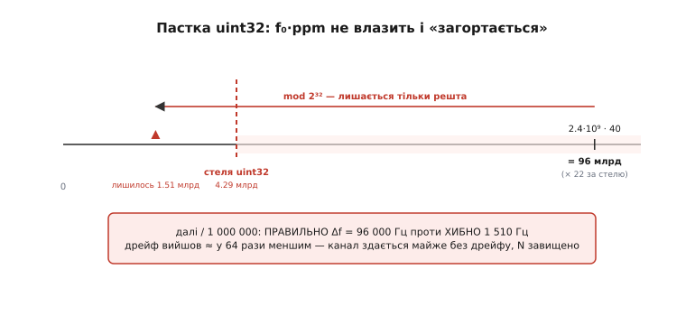

# ⚙️ Калькулятор розкладки каналів: від параметрів радіо до числа N

У темі ми вивели головну формулу частотного бюджету двома рядками: ширина слота `W = B + 2·Δf + G`, кількість каналів `N = смуга / слот` із округленням униз. Цього досить, щоб зрозуміти ідею — і навіть прикинути на серветці один випадок. Але інженер не рахує один випадок: він бере даташит нового радіомодуля, підставляє його несну, його кварц, його смугу сигналу — і хоче за секунду побачити, **скільки каналів вийде** і **чи це взагалі лягає в дозволений діапазон**. А ще краще — поставити поруч два-три кандидати й порівняти. Для цього потрібен не олівець, а інструмент: маленька програма, у яку ти заклав параметри радіо й отримав число.

Здавалося б, що там програмувати — дві формули. Саме ця оманлива простота й робить вставку вартою уваги. Бо щойно ці дві формули лягають у реальний C на реальному мікроконтролері, між ними й правильним числом постають три тихі пастки, кожна з яких **не падає, а бреше** — повертає правдоподібне, але хибне `N`. І найпідступніша з них — арифметична: множення несної на ppm переповнює цілий тип ще до того, як ти встиг помітити. Розберімо інструмент шар за шаром і впіймаймо всі три.

> 🔧 **Навіщо це.** Перш ніж замовляти радіомодуль під свою систему, корисно за хвилину перевірити: чи вистачить у твоєму діапазоні каналів на стільки апаратів, скільки ти плануєш? Чи не з'їсть кварцовий дрейф половину смуги? Чи не доведеться брати дорожчий кварц, щоб канали стали вужчі? Цей калькулятор відповідає на ці питання **до** замовлення, на папері — а не після, коли плата вже на столі й канали несподівано налазять один на одного.

## Задача: що саме має порахувати інструмент

Сформулюймо чесно, бо від формулювання залежить структура коду. На вхід інструмент дістає **опис радіо** — кілька чисел, кожне з даташита:

- **несну** f₀ (та частота, навколо якої будується сигнал) — щоб порахувати кварцовий дрейф, бо дрейф пропорційний саме їй;
- **допуск кварцу** в ppm (частин на мільйон) — наскільки несна може гуляти від номіналу;
- **смугу сигналу** B — скільки герців займає сам корисний сигнал (вона диктується потрібною швидкістю даних);
- **захисний проміжок** G — скільки герців лишаємо «в нікуди» між сусідами, щоб спідниці спектра згасли;
- **взаємну швидкість** v — щоб порахувати доплерівський зсув, якщо апарати швидкі (для нерухомих кладемо нуль).

На вихід — два числа: **ширина слота** W (скільки герців реально відбирає один канал) і **кількість каналів** N, що влазить у задану смугу. Плюс корисна дрібниця: скільки відсотків слота йде на «накладні» (дрейф і захист), а не на корисний сигнал, — це одразу показує, наскільки бюджет «жирний».

Зверни увагу на одну річ, що визначить весь подальший код. Усі ці числа живуть у **дуже різних масштабах**: несна — мільярди герців (гігагерци), смуга сигналу — мільйони (мегагерци), кварцовий дрейф — сотні тисяч (сотні кілогерців), Доплер — сотні герців. Між найбільшим і найменшим — сім порядків. Саме цей розкид масштабів і породжує дві з трьох наших пасток. Тому перше рішення інструменту: **усе рахуємо в одній одиниці — у герцах** — і ніде, **ніде** не змішуємо мегагерці з кілогерцями в одному виразі.

## Ідея: одна структура, одна функція, єдина одиниця

Перш ніж писати, домовмося про дві речі, які знімуть більшість майбутніх граблів.

**Перша — одиниця.** Усе всередині інструменту — у герцах, як `double`. Не в мегагерцах, не в кілогерцах — у голих герцах. Несна 2.4 ГГц — це `2.4e9`. Смуга 1 МГц — це `1.0e6`. Кварцовий дрейф 96 кГц — це `96000.0`. Ми приймаємо числа від людини у зручних одиницях (хто ж вводить несну в герцах вручну), але **на вході одразу переводимо** все в герці й далі живемо тільки в них. Жодна формула не побачить мішанки одиниць — а отже, друга пастка (плутанина МГц/кГц/Гц) просто не матиме де виникнути всередині розрахунку.

**Друга — тип.** Чому `double`, а не цілі герці в `uint64_t`? Бо герці тут — фізична величина з невизначеністю, а не точний лік. Ти не знаєш смугу сигналу до останнього герца; кварц «±40 ppm» сам по собі — діапазон, а не точка. `double` тримає близько 15–16 значущих десяткових цифр (це усталений факт: подвійна точність IEEE 754 дає 52 біти мантиси, тобто ≈15.95 десяткових цифр) — на наших масштабах гігагерців це запас у мільйони разів понад те, що нам треба. А головне — `double` **не переповнюється** на множенні `2.4e9 · 40`, тоді як необережне ціле переповнюється тихо. Це наша головна зброя проти першої, найковарнішої пастки; до неї ще повернемося докладно.

Тепер сама ідея коду. Опис радіо — це **структура** з п'яти полів. Розрахунок — це **одна функція**, що бере структуру й заповнює результат. Жодних класів, жодного стану між викликами: чистий вхід → чистий вихід. Це робить інструмент тривіальним для перенесення хоч на 8-бітний мікроконтролер, хоч у настільну утиліту.

```
структура «радіо»  →  функція plan_channels()  →  структура «результат»
   f₀, ppm, B,          W = B + 2·Δf + G            W_слот, N_каналів,
   G, v, смуга          N = смуга / W (вниз)        частка накладних
```

Уся складність — у тому, як акуратно порахувати `Δf` (кварц плюс Доплер) без переповнення й без мішанки одиниць, і як округлити `N` саме **вниз**, а не як попало. Це й розпишемо.

## Шар 1: структури вхід і вихід

Почнімо з опису радіо. Кожне поле — у зрозумілих людині одиницях, бо так його й беруть із даташита; перевід у герці зробимо в одному місці нижче.

:::tabs
```c
#include <stdint.h>
#include <stdio.h>
#include <math.h>     // floor()

// ── Опис радіо: усе так, як стоїть у даташиті ────────────────────────────
typedef struct {
    double carrier_hz;      // несна f₀, Гц     (напр. 2.4e9)
    double ppm;             // допуск кварцу, частин на мільйон (напр. 40)
    double signal_bw_hz;    // смуга сигналу B, Гц  (з потрібної швидкості)
    double guard_hz;        // захисний проміжок G на канал, Гц
    double rel_speed_ms;    // взаємна швидкість для Доплера, м/с (0 — нерухомі)
    double band_hz;         // уся доступна смуга діапазону, Гц
} radio_spec;

// ── Результат розрахунку ─────────────────────────────────────────────────
typedef struct {
    double drift_one_hz;    // дрейф несної з ОДНОГО боку (кварц + Доплер), Гц
    double slot_hz;         // повна ширина слота W = B + 2·Δf + G, Гц
    int    channels;        // скільки слотів влазить у смугу (округлення вниз)
    double overhead_frac;   // частка слота, що пішла НЕ на сигнал (0..1)
} channel_plan;
```
```python
from dataclasses import dataclass
import math                    # math.floor()

# ── Опис радіо: усе так, як стоїть у даташиті ────────────────────────────
@dataclass
class RadioSpec:
    carrier_hz:   float        # несна f₀, Гц     (напр. 2.4e9)
    ppm:          float        # допуск кварцу, частин на мільйон (напр. 40)
    signal_bw_hz: float        # смуга сигналу B, Гц  (з потрібної швидкості)
    guard_hz:     float        # захисний проміжок G на канал, Гц
    rel_speed_ms: float        # взаємна швидкість для Доплера, м/с (0 — нерухомі)
    band_hz:      float        # уся доступна смуга діапазону, Гц

# ── Результат розрахунку ─────────────────────────────────────────────────
@dataclass
class ChannelPlan:
    drift_one_hz:  float       # дрейф несної з ОДНОГО боку (кварц + Доплер), Гц
    slot_hz:       float       # повна ширина слота W = B + 2·Δf + G, Гц
    channels:      int         # скільки слотів влазить у смугу (округлення вниз)
    overhead_frac: float       # частка слота, що пішла НЕ на сигнал (0..1)
```
:::

Дві структури — увесь «інтерфейс» інструменту. Вхід — те, що ти переписав із даташита; вихід — те, що хочеш знати. Зверни увагу на коментар біля `drift_one_hz`: це дрейф **з одного боку**. У формулі слота він входить **подвоєним** (`2·Δf`), бо несна може поїхати в обидва боки. Тримати в результаті саме односторонній дрейф зручно: так одразу видно «скільки тягне сам кварц», а множник 2 явно стоїть у формулі слота — і його важче забути. Забутий множник 2 — наша третя пастка, і ця маленька дисципліна іменування вже наполовину її знешкоджує.

## Шар 2: дрейф несної — кварц і Доплер, обережно з порядком дій

Серце розрахунку — скільки герців несна може зсунутися в один бік. Два доданки: кварцовий дрейф і доплерівський. Повне виведення обох — звідки береться формула `f₀·ppm·10⁻⁶` і чому Доплер на 2.4 ГГц мізерний — лежить у [математиці частотного дрейфу](root:embedded/frequency-budget-analysis/math-frequency-drift.md); тут нам потрібен лише результат у коді, але порахований **правильно**.

:::tabs
```c
// Дрейф несної з ОДНОГО боку: кварцовий + доплерівський, Гц.
// Усе вже в герцах і м/с — мішанки одиниць тут бути не може.
static double carrier_drift_one_side(const radio_spec *r) {
    // Кварц: Δf = f₀ · (ppm · 10⁻⁶).
    // КЛЮЧОВО: спершу ppm·1e-6 (мала частка), ТОДІ множимо на несну.
    double quartz_hz = r->carrier_hz * (r->ppm * 1e-6);

    // Доплер: f_доплер = f₀ · v / c.  c — швидкість світла, м/с.
    const double C_LIGHT = 299792458.0;          // точне значення, м/с
    double doppler_hz = r->carrier_hz * (r->rel_speed_ms / C_LIGHT);

    return quartz_hz + doppler_hz;
}
```
```python
# Дрейф несної з ОДНОГО боку: кварцовий + доплерівський, Гц.
# Усе вже в герцах і м/с — мішанки одиниць тут бути не може.
def carrier_drift_one_side(r: RadioSpec) -> float:
    # Кварц: Δf = f₀ · (ppm · 10⁻⁶).
    # КЛЮЧОВО: спершу ppm·1e-6 (мала частка), ТОДІ множимо на несну.
    quartz_hz = r.carrier_hz * (r.ppm * 1e-6)

    # Доплер: f_доплер = f₀ · v / c.  c — швидкість світла, м/с.
    C_LIGHT = 299792458.0                        # точне значення, м/с
    doppler_hz = r.carrier_hz * (r.rel_speed_ms / C_LIGHT)

    return quartz_hz + doppler_hz
```
:::

Дві дрібниці тут — не косметика, а захист від пасток.

**Порядок множення у кварцовому доданку.** Ми пишемо `carrier_hz * (ppm * 1e-6)`, а не `carrier_hz * ppm * 1e-6`. У `double` різниця в точності мізерна, але цей порядок — звичка, що рятує життя, **коли хтось перепише це в цілих**. Якщо рахувати `carrier_hz * ppm` першим у цілому типі, добуток `2_400_000_000 · 40 = 96_000_000_000` миттєво вилітає за межі 32-бітного цілого (його стеля — близько 4.3 мільярда). А якщо спершу взяти `ppm · 10⁻⁶`, у цілих вийде просто `0` (бо `40 · 0.000001` обрізається до нуля при цілому діленні) — теж хибно, але по-іншому. У `double` обидва порядки дають правильно; ми пишемо безпечніший просто щоб привчити пальці. Сама пастка цілого переповнення настільки важлива, що їй присвячено окремий розділ нижче.

**Швидкість світла — точне число.** `c = 299 792 458` м/с — це не виміряне «приблизно 3·10⁸», а **точне за означенням** значення (усталений факт: з 1983 року метр означено через швидкість світла, тож c у вакуумі — рівно 299 792 458 м/с, без похибки). У серветкових прикидках ми пишемо `3e8` і не помиляємось помітно (різниця 0.07%), але в інструменті беремо точне — воно нічого не коштує.

## Шар 3: ширина слота й кількість каналів

Маючи дрейф, решта — пряме застосування двох формул теми. Але саме тут чигає третя пастка (множник 2) і вирішується доля округлення.

```c
void plan_channels(const radio_spec *r, channel_plan *out) {
    // 1. Дрейф несної з одного боку (кварц + Доплер).
    out->drift_one_hz = carrier_drift_one_side(r);

    // 2. Ширина слота: W = B + 2·Δf + G.
    //    Множник 2 — бо несна їде в ОБИДВА боки (тx +Δf, rx −Δf).
    out->slot_hz = r->signal_bw_hz
                 + 2.0 * out->drift_one_hz       // ← НЕ забути 2.0!
                 + r->guard_hz;

    // 3. Скільки цілих слотів влазить у смугу — округлення ВНИЗ.
    //    floor, бо半-канал не існує: 41.7 слота = 41 канал, не 42.
    out->channels = (int) floor(r->band_hz / out->slot_hz);
    if (out->channels < 0) out->channels = 0;    // захист від дурних вхідних

    // 4. Частка слота, що пішла НЕ на корисний сигнал (накладні).
    out->overhead_frac = (out->slot_hz - r->signal_bw_hz) / out->slot_hz;
}
```

Три рядки формул — і три місця, де легко схибити, кожне прокоментоване. Розберімо чому саме так.

**Множник 2.0 у ширині слота.** Це третя пастка в чистому вигляді. Несна **передавача** може поїхати на +Δf, несна **приймача** — на −Δf (у кожного свій кварц, і їхні похибки дивляться в різні боки). Канал мусить умістити **повне** розходження — від −Δf до +Δf, тобто `2·Δf`. Хто пише `B + drift + G` замість `B + 2·drift + G`, той робить канал **удвічі вужчим за дрейф**, ніж треба, і отримує завищене `N`. Лінк на папері «вміщує більше каналів», а в ефірі при найгіршому збігу похибок приймач наводиться повз сигнал. Пастка тиха: число виходить правдоподібне, просто неправильне.

**Округлення саме вниз через `floor`.** Половини каналу не буває. Якщо в смугу влазить 41.7 слота — це **41** канал, а не 42 і не «округлити до 42». Тут легко машинально написати звичайне ціле перетворення `(int)(band / slot)` — і **здебільшого пощастить**, бо приведення `double` до `int` у C відкидає дробову частину, тобто теж округлює до нуля. Але для від'ємних результатів (якщо хтось задав смугу меншу за слот через помилку знаку) поведінка `(int)` і `floor()` розходиться, тож явний `floor()` — чесніший і читабельніший: він прямо каже «вниз». Плюс рядок-запобіжник: від'ємне `N` безглузде, тиснемо його в нуль.

**Частка накладних** — діагностика, не самоціль. `(slot − B) / slot` каже, яка частина слота пішла на дрейф і захист замість сигналу. Якщо вона велика (скажімо, понад половину), це сигнал: або кварц надто грубий, або захист надто щедрий — є що оптимізувати. Один погляд на це число економить роздуми «чому каналів так мало».

## Прогін перший: скільки каналів дає BLE

Перевірмо інструмент на радіо, відповідь для якого ми **знаємо наперед**: Bluetooth Low Energy ділить смугу 2.4 ГГц на 40 каналів. Якщо калькулятор не видасть приблизно 40 — він бреше.

```c
int main(void) {
    // ── BLE: 2.4 ГГц, кварц ±40 ppm, GFSK на 1 Мбіт/с ────────────────────
    radio_spec ble = {
        .carrier_hz   = 2.4e9,      // несна 2.4 ГГц
        .ppm          = 40.0,       // типовий кварц ±40 ppm
        .signal_bw_hz = 1.0e6,      // смуга GFSK-сигналу BLE ≈ 1 МГц
        .guard_hz     = 0.8e6,      // захисний проміжок ≈ 0.8 МГц
        .rel_speed_ms = 0.0,        // нерухомі пристрої — Доплера нема
        .band_hz      = 83.5e6,     // уся ISM-смуга 2.400–2.4835 ГГц
    };

    channel_plan p;
    plan_channels(&ble, &p);

    printf("BLE @ 2.4 ГГц:\n");
    printf("  дрейф (1 бік):   %.0f кГц\n", p.drift_one_hz / 1e3);
    printf("  ширина слота:    %.2f МГц\n", p.slot_hz / 1e6);
    printf("  каналів влазить: %d\n", p.channels);
    printf("  накладні:        %.0f%%\n", p.overhead_frac * 100.0);
    return 0;
}
```

Прокрутімо подумки, що це надрукує, перевіряючи кожне число вручну.

**Дрейф з одного боку.** Кварц `2.4e9 · 40 · 10⁻⁶`:

```
quartz = 2.4·10⁹ · (40 · 10⁻⁶)
       = 2.4·10⁹ · 4·10⁻⁵
       = 96 000 Гц = 96 кГц
доплер = 0 (нерухомі)
дрейф (1 бік) = 96 кГц
```

**Ширина слота.** Сигнал 1 МГц, подвоєний дрейф `2 · 96 кГц = 192 кГц`, захист 0.8 МГц:

```
W = 1 000 000 + 2·96 000 + 800 000
  = 1 000 000 + 192 000 + 800 000
  = 1 992 000 Гц ≈ 1.99 МГц
```

**Кількість каналів.** Смуга 83.5 МГц поділена на слот 1.992 МГц:

```
N = floor(83 500 000 / 1 992 000)
  = floor(41.92)
  = 41
```

**Накладні.** Із 1.992 МГц слота на сигнал пішов 1.0 МГц:

```
накладні = (1 992 000 − 1 000 000) / 1 992 000 = 0.498 ≈ 50%
```

Інструмент друкує:

```
BLE @ 2.4 ГГц:
  дрейф (1 бік):   96 кГц
  ширина слота:    1.99 МГц
  каналів влазить: 41
  накладні:        50%
```

Сорок один проти сорока в стандарті — збіг чудовий: наша груба оцінка захисного проміжку (0.8 МГц) дала слот трохи вужчий за рівні 2 МГц, тож влізло на один більше, ніж нарізали автори. Підкрутиш захист до 0.808 МГц — слот стане рівно 2.0 МГц і `N` сяде на 41.75 → теж 41; щоб отримати рівно 40, треба слот ≥ 2.0875 МГц. Сенс не в тому, щоб підігнати до 40 хитруванням, а в тому, що **порядок збігся**: реальний крок BLE справді продиктований сумою «смуга + кварцовий дрейф + захист», і наш калькулятор відтворює це міркування з тих самих фізичних чисел. (Усталений факт: BLE від першої версії використовує 40 каналів по 2 МГц у смузі 2.4 ГГц — 3 канали оголошень і 37 каналів даних; центр k-го каналу — 2402 + k·2 МГц, від 2402 до 2480 МГц.) Те, що накладні склали половину слота, теж промовисте: на 2.4 ГГц з дешевим кварцом **половина** кожного слота йде не на дані, а на дрейф і захист. Ось де калькулятор уже корисний: видно, що точніший кварц звільнив би відчутну частину смуги.

## Прогін другий: чому на Wi-Fi 2.4 ГГц лише три канали

Тепер найдраматичніший приклад теми — Wi-Fi на 2.4 ГГц. Стандарт оголошує тринадцять каналів із кроком 5 МГц, але кожен канал завширшки 20 МГц, і реально без перекриття стоять лише **три**: 1, 6 та 11. Подивімось, чи дасть це наш інструмент. Тут смуга сигналу домінує над усім: 20 МГц проти кілогерців дрейфу.

```c
    // ── Wi-Fi 2.4 ГГц: канал 20 МГц, той самий кварц і смуга ─────────────
    radio_spec wifi = {
        .carrier_hz   = 2.437e9,    // центр діапазону (≈ канал 6)
        .ppm          = 20.0,       // Wi-Fi радіо точніше, ±20 ppm
        .signal_bw_hz = 20.0e6,     // канал 802.11 завширшки 20 МГц
        .guard_hz     = 5.0e6,      // міжканальний зазор до сусіда
        .rel_speed_ms = 0.0,
        .band_hz      = 83.5e6,
    };

    channel_plan w;
    plan_channels(&wifi, &w);

    printf("\nWi-Fi @ 2.4 ГГц (канал 20 МГц):\n");
    printf("  дрейф (1 бік):   %.0f кГц\n", w.drift_one_hz / 1e3);
    printf("  ширина слота:    %.2f МГц\n", w.slot_hz / 1e6);
    printf("  каналів влазить: %d\n", w.channels);
```

Перевіримо руками.

**Дрейф.** `2.437e9 · 20 · 10⁻⁶ = 48 740 Гц ≈ 49 кГц`. На тлі 20-мегагерцевого каналу це майже ніщо — менш ніж чверть відсотка ширини. Тут видно те, що тема підкреслювала: для широких каналів кварцовий дрейф у бюджеті майже не важить; він критичний саме для **вузьких**.

**Ширина слота.** Сигнал 20 МГц, подвоєний дрейф ≈ 0.097 МГц, захист 5 МГц:

```
W = 20 000 000 + 2·48 740 + 5 000 000
  = 20 000 000 + 97 480 + 5 000 000
  = 25 097 480 Гц ≈ 25.1 МГц
```

**Кількість каналів.**

```
N = floor(83 500 000 / 25 097 480)
  = floor(3.327)
  = 3
```

Друк:

```
Wi-Fi @ 2.4 ГГц (канал 20 МГц):
  дрейф (1 бік):   49 кГц
  ширина слота:    25.10 МГц
  каналів влазить: 3
```

Рівно **три** — і це ті самі знамениті 1, 6, 11. Збіг не випадковий: ми взяли захист 5 МГц так, щоб слот вийшов близько 25 МГц — а 25 МГц якраз і є відстань між центрами каналів 1, 6 і 11 (їхні центри 2.412, 2.437 і 2.462 ГГц рознесені рівно на 25 МГц). Калькулятор підтвердив бухгалтерією те, що тема показала на пальцях: у 83.5 МГц поміщається лише три неперекривні 20-мегагерцеві канали. (Усталений факт: у смузі 2.4 ГГц канали 802.11 рознесені на 5 МГц, а займають 20 МГц, тож без перекриття стоять лише 1, 6, 11 із рознесенням центрів 25 МГц; четвертий неперекривний канал 14 існує лише в Японії й лише для застарілого 802.11b на 2484 МГц.) Спробуй у коді поставити `guard_hz = 0` — слот стане 20.1 МГц, `N` підскочить до 4, і це буде та сама ілюзія, що й «тринадцять каналів»: формально влазить чотири, та поставлені впритул 20-мегагерцеві канали гризтимуться краями. Захисний проміжок у бюджеті — не примха, і калькулятор це показує числом.

> 🔧 **Навіщо це.** Цей самий код — готовий діагност домашнього Wi-Fi. Постав несну й ширину каналу свого роутера, додай у `band_hz` лише ту частину смуги, що **не зайнята сусідами**, — і побачиш, скільки вільних каналів реально лишилось тобі. Майже завжди відповідь — «нуль або один», і це пояснює, чому в багатоквартирному будинку 2.4 ГГц безнадійно повільний: трьох каналів на десятки квартир не вистачає. Той самий інструмент одразу підкаже й вихід — підстав ширшу смугу діапазону 5 ГГц, і `N` стане двозначним.

## Пастка перша: цілочислове переповнення на f₀·ppm

Ось та пастка, заради якої варто прочитати вставку, навіть якщо формули ти вже знаєш напам'ять. Вона невидима, доти доки не вкусить, і кусає мовчки — програма не падає, а видає число, якому ти довіряєш.

Спокуса проста. Несна, ppm, смуга — усе це цілі числа герців без дробів. Чому б не рахувати в цілих, у звичному `uint32_t`, як рахують більшість лічильників у прошивці? Спробуймо «в лоб» порахувати кварцовий дрейф у цілому:

```c
uint32_t carrier = 2400000000u;   // 2.4 ГГц у герцах — ПАСТКА вже тут
uint32_t ppm     = 40u;
uint32_t drift   = carrier * ppm / 1000000u;   // нібито Δf
```

Прокрутімо, що тут насправді відбувається, крок за кроком.

Перша біда — у самому `carrier`. `uint32_t` тримає числа до 4 294 967 295 (трохи понад 4.29 мільярда). Несна 2.4 ГГц — це `2 400 000 000`, ще влазить. Але **5.8 ГГц** — це `5 800 000 000`, що **більше за стелю** `uint32_t`: присвоєння мовчки обріже число за модулем 2³², і ти отримаєш `1 505 032 704` замість 5.8 мільярда. Несна вже спотворена, а жодного попередження немає.

Друга біда — у множенні, і вона б'є навіть на 2.4 ГГц, де сам `carrier` ще цілий. Вираз `carrier * ppm` рахується **в типі `uint32_t`**, перш ніж результат кудись присвоїться. А `2 400 000 000 · 40 = 96 000 000 000` — це дев'яносто шість мільярдів, у **двадцять два рази** більше за стелю `uint32_t`. Добуток переповнюється й обрізається за модулем 2³²:

```
2 400 000 000 · 40 = 96 000 000 000
96 000 000 000 mod 4 294 967 296 = 1 510 719 488   ← усе, що лишилось
```

За правилами C множення двох `uint32_t` дає знову `uint32_t`, тож результат береться за модулем 2³² **одразу**, без жодного проміжного 64-бітного уявлення. Виходить `1 510 719 488` (це `96 000 000 000 mod 4 294 967 296`), і далі `/ 1000000` дає `1510` герців замість правильних 96000. Калькулятор оголосить дрейф **майже в 64 рази меншим**, ніж він є, — і порахує канали так, ніби кварц майже ідеальний. `N` вийде завищеним, ти замовиш модуль, а в полі канали наповзуть.

```
ХИБНО (uint32):  2400000000·40 переповнилось → drift ≈ 1510 Гц
ПРАВИЛЬНО:        Δf = 96000 Гц  (≈ у 64 рази більше!)
```

Найгірше — програма **не подала знаку**. Жодного краху, жодного попередження компілятора за замовчуванням; просто тихе, правдоподібне, неправильне число. Це найнебезпечніший різновид бага: він не кричить, він бреше.


*Справжній добуток `2.4·10⁹ · 40` — це 96 мільярдів, у двадцять два рази більше за стелю `uint32_t` (4.29 млрд). У C множення двох `uint32_t` дає `uint32_t`, тож зайве просто відкидається за модулем 2³² — лишається 1.51 млрд. Після ділення на мільйон дрейф виходить ≈ 1.5 кГц замість 96 кГц: канал здається майже без дрейфу, і `N` завищується. Жодного попередження при цьому немає — число просто стає хибним.*

Як правильно — три чесні шляхи, від найпростішого.

**Перший — рахувати у `double`, як ми й робили весь час.** Дрейф — фізична величина з невизначеністю, їй не потрібна цілочислова точність, а `double` тримає до ~15 значущих цифр і **не переповнюється** на цих масштабах. `2.4e9 * 40e-6` дає рівно `96000.0`, `5.8e9` зберігається без втрат. Для калькулятора-прикидки це найкращий вибір — саме тому весь наш інструмент на `double`.

**Другий — лишитися в цілих, але взяти достатньо широкий тип.** Якщо чомусь потрібні саме цілі герці (скажімо, ти синтезуєш частоту й рахуєш регістри синтезатора), бери `uint64_t` — він тримає до ~1.8·10¹⁹, і `96` мільярдів у ньому губляться:

```c
uint64_t carrier = 5800000000ULL;          // 5.8 ГГц — у 64 бітах вільно
uint64_t drift   = carrier * 40ULL / 1000000ULL;   // = 232000 Гц, правильно
```

Зверни увагу на суфікси `ULL` та порядок: множити треба **до** ділення (інакше `carrier/1000000` втратить точність ще раніше), і хоч один операнд має бути 64-бітним **до** множення, щоб уся арифметика пішла в 64 бітах. Напишеш `carrier * 40` де `carrier` — `uint32_t`, і переповнення станеться в 32 бітах **ще до** присвоєння в 64-бітну змінну — пастка повернеться.

**Третій — переставити порядок так, щоб великі числа не множилися.** Замість `f₀ · ppm` рахуй `(f₀ / 10⁶) · ppm`: спершу поділи несну на мільйон (2400 для 2.4 ГГц), і тільки тоді множ на ppm. Тепер найбільший проміжний добуток — `2400 · 40 = 96000`, що влазить у будь-який тип. Платня — втрата точності на діленні (несна 2 400 500 кГц обріжеться до 2400), але для прикидки дрейфу це дрібниця.

> 🔧 **Навіщо це.** Це не теоретична небезпека — це найчастіша реальна помилка в коді, що рахує радіочастоти на мікроконтролері. 8- і 32-бітні МК за замовчуванням працюють у 32-бітних цілих, а несні давно перевалили за 2³² герців. Запам'ятай як рефлекс: **щойно множиш частоту в герцах на будь-що — питай, чи влазить добуток**. Несна в герцах майже завжди вимагає `double` або `uint64_t`; `uint32_t` для частоти в герцах — міна, що рано чи пізно вибухне на 5+ ГГц або на множенні.

## Пастка друга: плутанина МГц / кГц / Гц

Друга пастка тихіша за першу, але зустрічається ще частіше, бо народжується не в коді, а в **голові** того, хто заповнює числа. Даташити змішують одиниці без сорому: несну дають у гігагерцах, смугу — у мегагерцах, дрейф кварцу — у кілогерцах або ppm, а ширину фільтра — інколи в герцах. Людина переписує це в код «як бачить» — і отримує вираз, де герці складаються з мегагерцами.

Подивись, як це виглядає й чим кінчається:

```c
// ПАСТКА: змішані одиниці в одному виразі
double signal_bw = 1.0;        // «1 МГц» — записали як 1.0, забувши, що це МГц
double drift     = 96000.0;    // 96 кГц записали в герцах
double slot      = signal_bw + 2*drift;   // 1.0 + 192000 = 192001 ?!
```

Тут `signal_bw` мислиться в мегагерцах (1.0 МГц), а `drift` — у герцах (96000 Гц). Складати їх — безглуздя: виходить `192001`, число без жодного фізичного сенсу. Якщо пощастить — результат настільки дикий, що ти помітиш. Якщо не пощастить — масштаби виявляться ближчими, число вийде правдоподібним, і помилка прослизне. Класичний випадок «не пощастило»: хтось вводить смугу `20` (маючи на увазі 20 МГц), а дрейф `0.097` (маючи на увазі 0.097 МГц) — і все працює; а наступного дня вводить дрейф `97000` (бо даташит дав його в герцах) — і слот роздувається в тисячу разів, `N` падає в нуль, а причина неочевидна.

Ліки — дисципліна, яку ми заклали з самого початку: **одна одиниця всередині, перевід на межі**. Усередині інструменту все — у герцах. Числа від людини приймаємо у зручних одиницях, але переводимо **в одному місці**, явними іменованими множниками, щоб одиниця кожного числа стояла на видноті:

```c
// Іменовані множники — одиниця видно прямо в коді, помилитися важко.
#define MHZ  1.0e6
#define KHZ  1.0e3
#define GHZ  1.0e9

radio_spec ble = {
    .carrier_hz   = 2.4 * GHZ,     // читається як «2.4 гігагерца»
    .signal_bw_hz = 1.0 * MHZ,     // «1 мегагерц»
    .guard_hz     = 800.0 * KHZ,   // «800 кілогерц»
    // ...
};
```

Тепер кожне число несе свою одиницю прямо в записі: `2.4 * GHZ` неможливо сплутати з `2.4 * MHZ`, а `800 * KHZ` сам себе документує. Поле структури називається `..._hz` — інваріант «усередині все в герцах» закріплений в імені. Помилка одиниць не зникає магічно, але стає **видимою**: щоб її зробити, треба написати явно неправильний множник, а не просто забути в голові, що мав на увазі.

> 🔧 **Навіщо це.** Помилка одиниць — друга за частотою причина, чому радіокалькулятор бреше (перша — переповнення вище). Вона особливо підступна, бо не залежить від мови чи платформи: це помилка перекладу даташита в код. Залізне правило: **обери одну внутрішню одиницю (для радіо — герц), переводь усе на вході явними множниками, і ніколи не змішуй одиниці в арифметиці**. Той самий принцип діє скрізь, де фізика зустрічає код: час (усе в мікросекундах), відстань (усе в метрах), кути (усе в радіанах). Змішав — отримав сміття, яке інколи виглядає як число.

## Пастка третя: забутий множник 2 на двосторонній дрейф

Третя пастка найтонша, бо число, яке вона дає, **виглядає геть нормальним** — просто канал виходить удвічі тіснішим за дрейф, ніж має бути. Її не зловиш ні крахом, ні дикою величиною; зловиш лише розумінням фізики або тестом на знайомому радіо.

Корінь — у тому, **скільки разів** дрейф входить у слот. Інтуїція підказує: «несна може гуляти на Δf, отже додам Δf до слота». І це **половина правди**. Бо дрейфують **обидва** радіо, незалежно й у різні боки:

```
передавач:  f₀ + Δf   (його кварц поїхав угору)
приймач:    f₀ − Δf   (його кварц поїхав униз)
розходження між ними: (f₀+Δf) − (f₀−Δf) = 2·Δf
```

Канал мусить умістити **повне** розходження `2·Δf` — від найнижчого, куди може з'їхати приймач, до найвищого, куди може з'їхати передавач. Хто кладе в слот лише `Δf`, той робить запас удвічі замалим:

```c
// ХИБНО: дрейф входить ОДИН раз
double slot_wrong = signal_bw + drift + guard;        // запас удвічі малий

// ПРАВИЛЬНО: дрейф з ОБОХ боків
double slot_right = signal_bw + 2.0 * drift + guard;  // повне розходження
```

Чим це кінчається? Слот виходить вужчим, ніж треба, тож `N` — **завищеним**: калькулятор каже «влізе 45 каналів», ставиш їх — і при найгіршому збігу кварцових похибок (передавач на краю +Δf, приймач на краю −Δf) приймач наводиться повз сигнал на сусідній канал. Лінк «то є, то нема» залежно від температури плати, бо саме температура жене кварц до краю допуску. Найковарніше — на столі все працює: два радіо поряд, однакова температура, кварци близькі, реального розходження майже немає, і вдвічі замалий запас ніяк не муляє. Пастка чекає польових умов, де кварци розходяться на повний допуск.

Захист тут не код, а **дисципліна іменування**, яку ми заклали в шарі 1. Ми навмисне назвали поле `drift_one_hz` — «дрейф з одного боку». Сама назва кричить: це **половина** того, що піде в слот. Коли в формулі стоїть `2.0 * out->drift_one_hz`, множник 2 поряд із «one» читається природно й забути його важко. Якби поле звалося просто `drift`, спокуса написати `+ drift` (без двійки) була б куди сильнішою. Іменуй величину так, щоб її роль у формулі була очевидною, — і ціла категорія помилок відмирає сама.

> 🔧 **Навіщо це.** Множник 2 тут — не педантизм, а різниця між лінком, що працює в полі, і лінком, що працює лише на столі. Передавач і приймач **завжди** мають окремі кварци (це два різні пристрої), тож їхні дрейфи **завжди** додаються. Той самий «множник 2 на незалежні джерела» зустрінеться скрізь, де дві сторони мають свою похибку: у бюджеті часу TDMA (два годинники розходяться вдвічі швидше за один — ми це бачили в [TDMA-планувальнику](root:embedded/multiple-access-methods/proj-tdma-scheduler.md)), у допусках механіки (два розміри з допуском ±δ дають зазор ±2δ). Питай завжди: скільки **незалежних** джерел похибки тут складається? Якщо два — десь має стояти двійка.

## Складність і що з цим робити

Обчислювально весь інструмент — тривіальний: п'ять множень, кілька додавань, одне ділення й один `floor` на радіо. Складність **O(1)** на розрахунок, **O(к-сть_кандидатів)** на порівняння таблиці радіо. Жодних циклів, жодної важкої математики — це калькулятор, не симуляція. Він порахується за мікросекунди на найслабшому 8-бітному МК, тож його сміливо лишають у прошивці: наприклад, при зміні швидкості даних на льоту (а отже, смуги сигналу) перерахувати, скільки тепер влазить каналів, і не дати конфігурації вилізти за межі діапазону.

Уся вага вставки — не в обчисленні, а в **трьох пастках**, бо кожна повертає правдоподібне, але хибне число, не подавши знаку:

- **Цілочислове переповнення на `f₀·ppm`** — найковарніше. Несня в герцах перевалила за 2³², а добуток `f₀·ppm` тим паче; `uint32_t` тихо обрізає його за модулем, і дрейф виходить у десятки разів меншим. Ліки: рахуй у `double` (для прикидки) або `uint64_t` (для точних цілих герців), множ до ділення, стеж за типом проміжного добутку.
- **Плутанина МГц / кГц / Гц** — найчастіша, бо народжується в голові при переписуванні даташита. Ліки: одна внутрішня одиниця (герц), перевід на вході явними іменованими множниками (`GHZ`/`MHZ`/`KHZ`), жодного змішування одиниць в арифметиці.
- **Забутий множник 2 на двосторонній дрейф** — найтонша, бо число виглядає нормальним, а лінк ламається лише в полі. Ліки: пам'ятай, що передавач і приймач дрейфують **незалежно**, тож у слот іде `2·Δf`; іменуй величину `drift_one_side`, щоб двійка в формулі читалася сама.

І головне, заради чого взагалі будувати такий калькулятор: він перетворює розпливчасте «здається, каналів вистачить» на тверде «слот 25.1 МГц, у смугу влазить рівно 3, накладні 20%». А ще — він **ловить власні помилки об відоме радіо**: проганяєш BLE, бачиш ~40, проганяєш Wi-Fi, бачиш 3 — інструмент відкалібрований, можна довіряти йому на новому радіо. Якщо ж BLE раптом дає 600 каналів або Wi-Fi дає 40 — це не радіо дивне, це одна з трьох пасток уже вкусила, і ти знаєш, де шукати. Калькулятор, що вміє себе перевірити на знайомому, вартий удесятеро більше за той, що просто видає число.
