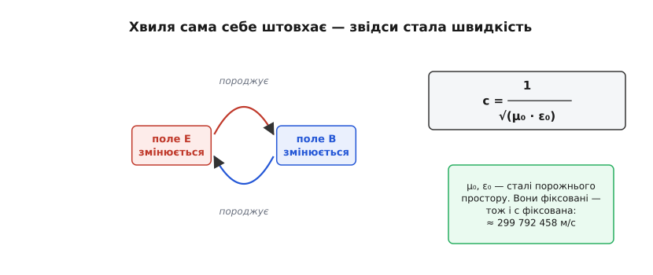
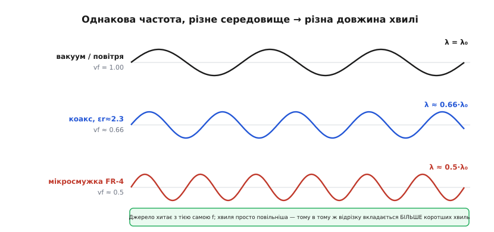
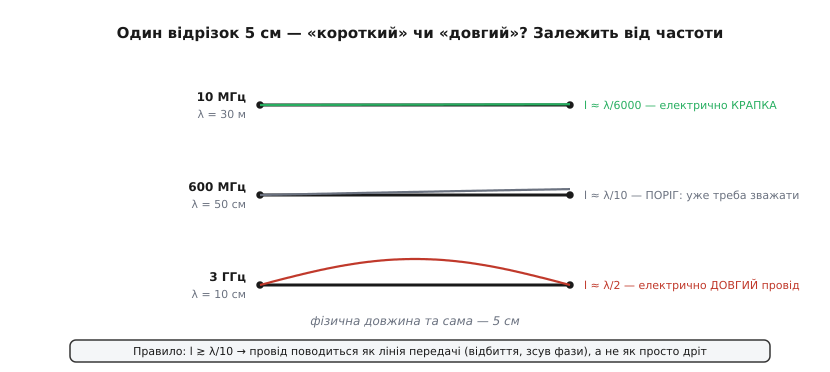
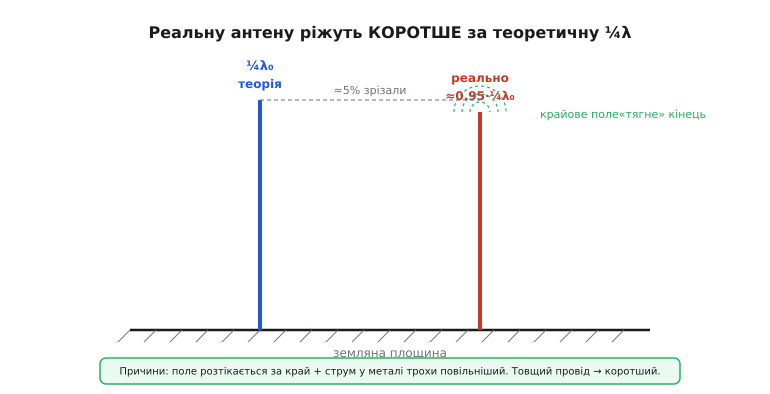

# Частота й довжина хвилі углиб: звідки c, чому хвиля коротшає в матеріалі, електрична довжина

<preknowlist>
- [Електромагнітна хвиля](topic:physics/em-wave) — змінне електричне поле породжує магнітне, а змінне магнітне — знову електричне; цим хвиля живить сама себе й біжить простором.
</preknowlist>

У [базовому кроці](root:embedded/frequency-wavelength) ми взяли формулу `c = λ·f` як даність і навчилися за частотою миттєво «бачити» довжину хвилі й розмір антени. Це головний навик, і його досить, щоб читати даташити. Але щойно доводиться робити щось руками — різати антену під конкретний модуль, вести високочастотну доріжку по платі, розуміти, чому кварц із похибкою 20 ppm раптом «зʼїдає» пів каналу на 2.4 ГГц, — простої формули вже мало. Бо в ній сховані два припущення, які на практиці майже завжди хибні: що швидкість завжди дорівнює `c`, і що провід — це просто провід.

Розберімо тему до дна. Спершу побачимо, **звідки взагалі береться стала швидкість** і чому вона саме така, а не інша — це не аксіома, а наслідок будови поля. Тоді знімемо перше припущення: у реальному середовищі — коаксіалі, діелектрику плати, тілі антени — хвиля біжить **повільніше за c**, і саме тому реальна антена коротша за ту, що дає шкільна формула. Знімемо й друге: провід перестає бути «просто дротом», щойно його довжина стає помітною часткою λ, — звідси поняття **електричної довжини**, яке вирішує, треба вам узгоджувати лінію чи ні. Наприкінці подивимося, що робить із частотою **рух** (ефект Доплера) і **неточність генератора** (ppm), бо і те, і те — це зсув тієї самої f, який має цілком відчутну ціну в бітах.

## Звідки взагалі стала швидкість

Почнімо з питання, яке базовий крок обійшов: **чому** швидкість електромагнітної хвилі — стала? Чому не буває «повільного» й «швидкого» радіо у вакуумі, як буває повільний і швидкий автомобіль? Відповідь не в тому, що «так виміряли», а в самій природі хвилі, і зрозуміти її варто, бо з неї випливає геть усе інше.

Електромагнітна хвиля — це не щось, що летить крізь простір, як камінь. Це **самопідтримна пара полів**, де кожне породжує інше. Уяви, що в якійсь точці різко змінилося електричне поле E. Змінне електричне поле, за законами електромагнетизму, породжує поряд магнітне поле B. Але це B теж не стоїть на місці — воно щойно виникло, отже, змінюється, — а змінне магнітне поле у свою чергу породжує електричне. Те нове E знову змінне, знову народжує B — і так пара «перекидає» сама себе далі й далі в простір. Хвиля не потребує середовища саме тому, що середовищем для неї є **власні поля**: вони тримають одне одного за руки й біжать разом.


*Змінне електричне поле породжує магнітне, змінне магнітне — знову електричне; ця замкнена петля причинності самопідтримується й біжить у просторі. Швидкість бігу задають дві сталі порожнього простору — μ₀ і ε₀; вони фіксовані, тому й швидкість фіксована.*

Ключове ось у чому: швидкість цієї «естафети» не довільна. Її диктують дві фізичні сталі порожнього простору. **ε₀** (електрична стала, вона ж діелектрична проникність вакууму) каже, наскільки легко в порожнечі виникає електричне поле; **μ₀** (магнітна стала) — наскільки легко виникає магнітне. Що «важче» полю відгукнутися, то повільніше йде перекидання. Точна формула, яку дає теорія поля [Максвелла](topic:physics/em-wave):

```
        1
c = ─────────
    √(μ₀ · ε₀)
```

Підставмо числа й переконаймося, що це не абстракція, а саме ті `3×10⁸`, якими ми користувалися в базовому кроці:

**Приклад (порахуймо швидкість світла з двох сталих).** μ₀ ≈ 1.2566×10⁻⁶, ε₀ ≈ 8.8542×10⁻¹² (в одиницях СІ):

```
μ₀ · ε₀       = 1.2566×10⁻⁶ · 8.8542×10⁻¹² = 1.1127×10⁻¹⁷
√(μ₀ · ε₀)    = 3.3357×10⁻⁹
c = 1 / 3.3357×10⁻⁹                         = 2.9979×10⁸ м/с
```

Виходить рівно `299 792 458 м/с`. І ось найдивовижніше: це число **точне за означенням**. Від 1983 року метр означують саме через нього — метр є відстанню, яку світло проходить у вакуумі за 1/299 792 458 секунди (усталений факт: рішення Генеральної конференції з мір і ваг). Тобто ми більше не міряємо швидкість світла — ми міряємо нею. Це переставляє причину й наслідок: не `c` виводять із метра, а метр із фіксованого `c`. Для нас практичний висновок простий — округлення `c ≈ 3×10⁸ м/с` дає похибку лише 0.07%, і саме тому оцінки «на серветці» з базового кроку такі надійні.

> 🔧 **Навіщо це.** Розуміння, що швидкість задають ε₀ і μ₀ **середовища**, — не філософія, а прямий вхід до наступного розділу. Щойно хвиля виходить із вакууму в матеріал із іншими ε і μ, у знаменнику стоять уже інші числа, швидкість падає — і разом із нею коротшає λ. Без цього кроку неможливо зрозуміти, чому реальна антена й реальна доріжка коротші за розрахункові. Уся практика радіо на платі виростає саме звідси.

Історію самого відкриття — як Максвелл спершу вивів цю швидкість на папері й помітив, що вона збігається зі швидкістю світла, а Герц через двадцять років упіймав ці хвилі в лабораторії й підтвердив здогад, — варто знати окремо: [як хвилю спочатку порахували, а тоді впіймали](root:embedded/frequency-wavelength/hist-maxwell-hertz.md). Це рідкісний випадок, коли теорія на роки випередила експеримент.

## Хвиля в середовищі: чому вона коротшає

Тепер зніміть перше приховане припущення формули `c = λ·f`: що швидкість завжди дорівнює `c`. У вакуумі — так. Але щойно хвиля входить у **діелектрик** (грец. *diá* — крізь, і *ēlektron* — бурштин: речовина, крізь яку поле проходить, не проводячи струму) — у поліетилен коаксіалю, у скловолокно плати, у пластик корпусу, — картина міняється.

Логіка пряма й випливає з попереднього розділу. У матеріалі електричне поле «в'язне»: молекули діелектрика поляризуються, підлаштовуються під поле, і цим гальмують його зміну. Формально це означає, що діелектрична проникність зростає з ε₀ до ε = ε₀·εr, де **εr** (відносна проникність, вона ж діелектрична стала) — у скільки разів матеріал «важчий» для поля за порожнечу. Підставмо це в нашу формулу швидкості:

```
        1              1                 c
v = ──────────  = ──────────────  = ─────────
    √(μ · ε)       √(μ₀ · ε₀·εr)      √(εr)
```

(для звичайних немагнітних діелектриків μ ≈ μ₀, тож магнітну частину лишаємо як у вакуумі). Висновок чіткий: **швидкість у середовищі менша за c рівно в √εr разів**. Цей множник називають **коефіцієнтом укорочення** або *velocity factor* (vf):

```
vf = v / c = 1 / √(εr)
```

А тепер найважливіше для практики. У формулі `v = λ·f` частота **не міняється** при переході в середовище — джерело хитає поле з тією самою швидкістю, скільки коливань за секунду вкладає, стільки й лишається; змінити f хвиля не може, бо це задає передавач. Раз `f` стала, а `v` упала в √εr разів, то **λ мусить упасти в стільки ж разів**:

```
λ_середовище = v / f = (c / √εr) / f = λ₀ / √εr
```


*Джерело хитає з однією й тією самою частотою, але у щільнішому діелектрику хвиля повільніша, тож у той самий відрізок простору вкладається більше коротших хвиль. Коефіцієнт укорочення vf = 1/√εr: коаксіаль зі суцільним поліетиленом дає ≈0.66, мікросмужка на FR-4 — близько 0.5.*

**Приклад (наскільки коротшає хвиля 2.4 ГГц у різних середовищах).** У вакуумі λ₀ = 12.5 см (це ми знаємо з базового кроку). Порахуймо у трьох матеріалах:

```
Коаксіаль, суцільний поліетилен, εr ≈ 2.3:
  vf = 1/√2.3 = 0.66
  λ = 12.5 см · 0.66 = 8.2 см

Спінений (foam) діелектрик, εr ≈ 1.5:
  vf = 1/√1.5 = 0.82
  λ = 12.5 см · 0.82 = 10.2 см

Мікросмужка на FR-4 (ефективна εr ≈ 2.8):
  vf = 1/√2.8 = 0.60
  λ = 12.5 см · 0.60 = 7.5 см
```

Числа взято з реальних даташитів: суцільний поліетилен у коаксіалі дає vf ≈ 0.66 (усталене значення для кабелів на кшталт RG-58), спінений — близько 0.8, бо повітряні бульбашки знижують εr. Різниця в понад чверть довжини — і це вже не дрібниця, а те, від чого залежить, запрацює антена чи ні.

Один тонкий момент варто прояснити, бо він плутає. Ефективна проникність мікросмужки на FR-4 (≈2.8) **менша** за проникність самого матеріалу FR-4 (≈4.3). Чому? Бо доріжка-мікросмужка лежить на поверхні плати: під нею — скловолокно, а над нею — повітря. Поле ділиться між двома середовищами, тож ефективне εr виходить середнім між εr плати й εr повітря — десь посередині. Якби ту саму доріжку сховали **всередину** плати (це називають смужковою лінією, *stripline*), поле цілком опинилося б у FR-4, ефективне εr підскочило б майже до 4.3, а сигнал сповільнився б відчутніше. Ось чому та сама доріжка на поверхні й усередині плати має різну затримку — важлива деталь для швидких цифрових шин.

> 🔧 **Навіщо це.** Це найпоширеніша й найдорожча пастка новачка в радіо. Ви розрахували антену за `λ₀ = c/f`, вирізали чвертьхвильовий штир, а вона не резонує на потрібній частоті — бо всередині металу антени хвиля теж біжить трохи повільніше, і фізичну довжину треба вкоротити. Так само зустрічна: коли вам кажуть «додай пів метра коаксіалю, щоб зсунути фазу», реальна електрична довжина того кабелю більша за фізичну — півметра кабелю з vf=0.66 «важить» стільки, скільки 0.76 м у вакуумі. Той, хто цього не знає, ганяється за примарами тижнями.

Ця сама повільність хвилі в матеріалі має ще один наслідок — **затримку сигналу в доріжці**, критичну для швидкої цифри. Порахуймо її прямо, бо це щоденна величина для того, хто розводить пам'ять чи високошвидкісні шини.

**Приклад (затримка сигналу на доріжці плати).** Швидкість у мікросмужці FR-4 і час на 10 см доріжки:

```
v = c / √εr = 3×10⁸ / √2.8 = 3×10⁸ / 1.673 = 1.79×10⁸ м/с
t = довжина / v = 0.10 м / 1.79×10⁸ = 5.6×10⁻¹⁰ с = 560 пс
```

Тобто сигнал долає 10 см плати не миттєво, а за пів наносекунди. У перерахунку — близько 6 нс на метр, або звичне у вимірах ~140 пс на дюйм. Для повільної логіки це нічого, але на шині DDR чи PCIe, де такт коротший за наносекунду, ці півнаносекунди — вирішальні: саме тому доріжки шин **вирівнюють по довжині** з точністю до міліметрів. Ось короткий приклад на C, як прикинути таку затримку у прошивці чи в скрипті перевірки топології:

:::tabs
```c
#include <math.h>

// Затримка сигналу на доріжці плати (мікросмужка).
// len_m — довжина доріжки в метрах, eps_eff — ефективна проникність.
float trace_delay_ns(float len_m, float eps_eff) {
    const float c = 2.998e8f;                 // м/с
    float v = c / sqrtf(eps_eff);             // швидкість у середовищі
    return (len_m / v) * 1e9f;                // у наносекундах
}

// приклад: 10 см на FR-4 → ≈0.56 нс
// float d = trace_delay_ns(0.10f, 2.8f);
```
```python
from math import sqrt

# Затримка сигналу на доріжці плати (мікросмужка).
# len_m — довжина доріжки в метрах, eps_eff — ефективна проникність.
def trace_delay_ns(len_m, eps_eff):
    c = 2.998e8                    # м/с
    v = c / sqrt(eps_eff)          # швидкість у середовищі
    return (len_m / v) * 1e9       # у наносекундах

# приклад: 10 см на FR-4 → ≈0.56 нс
# d = trace_delay_ns(0.10, 2.8)
```
:::

## Електрична довжина: коли провід перестає бути дротом

Тепер друге приховане припущення — що провід це просто провід. Воно тримається рівно доти, доки провід **короткий проти хвилі**. Щойно його довжина стає помітною часткою λ, він перетворюється на щось геть інше — на лінію передачі, зі своїми відбиттями й зсувами фази. Межу між цими двома світами задає поняття **електричної довжини**.

Ідея проста, але її треба відчути. Уяви, що ти подаєш на провід сигнал і в кожній точці проводу дивишся на миттєву напругу. Якщо провід набагато коротший за довжину хвилі, то поки хвиля пробігає його з кінця в кінець, вона майже не встигає змінитися — уздовж усього проводу напруга практично однакова в кожну мить. Провід поводиться як єдина точка: що подав з одного кінця, те миттєво є на другому. Але якщо провід завдовжки з половину хвилі, то на одному його кінці хвиля вже в горі, а на другому — вже в западині: **уздовж одного шматка металу напруга різна**. Провід перестає бути точкою; він тепер відрізок, на якому «живе» частина хвилі.

Тому важлива не довжина в сантиметрах сама по собі, а її **відношення до λ**. Один і той самий п'ятисантиметровий відрізок буде «крапкою» на низькій частоті й «довгою лінією» на високій — бо λ у цих випадках різна.


*Фізична довжина відрізка та сама — 5 см. На 10 МГц (λ=30 м) він становить нікчемну частку хвилі й поводиться як точка. На 600 МГц (λ=50 см) сягає ≈λ/10 — це поріг, за яким уже треба зважати на хвильову природу. На 3 ГГц (λ=10 см) у ньому вкладається пів хвилі — це вже повноцінна лінія передачі.*

Домовленість, яку тримають у голові всі радіоінженери: відрізок вважають **електрично коротким** (можна не думати про хвилю), поки він менший за приблизно **λ/10**, і **електрично довгим** (треба враховувати відбиття, узгоджувати), коли він більший. Поріг у десяту частку — не магічне число, а робочий компроміс: на λ/10 фаза уздовж відрізка встигає провернутися на 36°, і похибка від нехтування хвильовою природою стає помітною.

Звідси корисно міряти довжину прямо у **градусах фази**. Повна хвиля λ — це 360° повороту. Тоді будь-який відрізок можна перерахувати:

```
фаза (°) = 360° · (довжина / λ)
```

**Приклад (у скільки градусів обертається доріжка).** Доріжка 4 см на FR-4, сигнал 2.4 ГГц. Спершу знайдемо λ у цьому середовищі (з попереднього розділу), тоді фазу:

```
λ = λ₀ · vf = 12.5 см · 0.60 = 7.5 см
фаза = 360° · (4 / 7.5) = 360° · 0.533 = 192°
```

Майже пів обороту фази на чотирьох сантиметрах доріжки! Це вже нізащо не «точка» — на такій доріжці неузгоджений кінець дасть відбиття, що повернеться і спотворить сигнал. Ось чому на платах для 2.4 ГГц антенні доріжки роблять із контрольованим імпедансом і тримають якнайкоротшими. Той самий розрахунок у коді:

:::tabs
```c
// Електрична довжина відрізка у градусах фази.
// len_m — фізична довжина (м), f_hz — частота, vf — коефіцієнт укорочення.
float electrical_length_deg(float len_m, float f_hz, float vf) {
    const float c = 2.998e8f;
    float lambda = (c / f_hz) * vf;           // довжина хвилі в середовищі
    return 360.0f * (len_m / lambda);
}

// поріг «електрично довгого»: > 36° (≈ λ/10) — час думати про лінію передачі
```
```python
# Електрична довжина відрізка у градусах фази.
# len_m — фізична довжина (м), f_hz — частота, vf — коефіцієнт укорочення.
def electrical_length_deg(len_m, f_hz, vf):
    c = 2.998e8
    lam = (c / f_hz) * vf                      # довжина хвилі в середовищі
    return 360.0 * (len_m / lam)

# поріг «електрично довгого»: > 36° (≈ λ/10) — час думати про лінію передачі
```
:::

Коли відрізок стає електрично довгим, він починає жити за законами [лінії передачі](topic:communications/transmission-lines): у ньому виникають відбиття від неузгоджених кінців, стоячі хвилі, а вхідний опір залежить від довжини. Це окрема велика тема, але вхід до неї — саме тут: усе починається з простого питання «яку частку λ становить мій провід».

> 🔧 **Навіщо це.** Це відповідь на щоденне питання розробника: «мені треба узгоджувати цю доріжку чи можна просто провести?». Правило λ/10 дає миттєвий критерій. Кнопка з дротом на 50 Гц — завжди точка (λ = 6000 км). Доріжка I²C на 400 кГц — теж точка. А ось тактовий сигнал 100 МГц по доріжці 20 см — це вже λ/1.5, повноцінна лінія, яку треба узгоджувати, інакше відбиття зіпсують фронти. Одне відношення `довжина/λ` розділяє «просто провід» і «складна лінія» — і рятує від годин налагодження загадкових збоїв на швидких шинах.

## Резонанс антени: чому реальна коротша за розрахункову

У базовому кроці ми взяли, що антена — це чверть довжини хвилі, і на цьому спинилися. Тепер зберемо докупи все, що дізналися про швидкість у металі й крайові ефекти, і зрозуміємо, **чому саме чверть** і **чому реальна антена завжди коротша за розрахункову**. Це та точка, де вся попередня теорія стає ножем і лінійкою в руках.

Спершу — чому чверть. Антена резонує, коли уздовж неї вкладається стояча хвиля струму так, щоб на вільному кінці струм був нулем (там металу далі немає, стікати нікуди), а біля живлення — максимумом. Найкоротший відрізок, на якому струм проходить від максимуму до нуля, — це чверть хвилі: від пучності до вузла. Тому чвертьхвильовий штир над землею — найменша антена, що резонує на заданій частоті. Детальний механізм резонансу — чому струм саме так розподіляється й що таке пучність та вузол — розкрито окремо в [резонансі диполя](topic:communications/resonance-dipole); тут нам досить того, що резонансна довжина зав'язана на λ.

А тепер причина укорочення, і вона подвійна — обидві половини ми вже підготували в попередніх розділах.

**Перша причина — швидкість у металі.** Струм біжить не в порожнечі, а в тілі провідника й у тонкому шарі поля навколо нього, де діелектрик (ізоляція, повітря, близька плата) сповільнює хвилю. Отже, «електрична» чверть хвилі, що вкладається в антену, коротша за вакуумну λ₀/4 — рівно на коефіцієнт укорочення, який ми вивели: помножити на vf.

**Друга причина — крайовий ефект (*end effect*).** На вільному кінці антени поле не обривається різко, а «випинається» назовні, за фізичний край металу. Виходить, наче кінець антени трохи довший, ніж він є насправді, — поле додає їй уявних сантиметрів. Щоб скомпенсувати цю добавку, фізичний метал доводиться **вкоротити**. Для тонкого дроту крайовий ефект дає множник близько **0.95** (усталене емпіричне значення): реальний штир десь на 5% коротший за теоретичний. І що товщий провід відносно довжини, то сильніше «випинається» поле й то більше треба зрізати.


*Теоретична довжина — рівно ¼λ₀. Реальний резонанс настає при коротшій довжині: струм у металі трохи повільніший, а поле на вільному кінці розтікається за фізичний край, наче подовжуючи антену. Обидва ефекти компенсують укороченням фізичного металу — для тонкого дроту приблизно на 5%.*

Зберімо все в одну робочу формулу довжини чвертьхвильового штиря:

```
L = (c / f) · (1/4) · k       де k ≈ 0.95 (крайовий ефект + метал)
```

**Приклад (реальна антена під 868 МГц).** Порахуймо спершу «наївно», тоді з поправкою — і побачимо різницю в сантиметрах:

```
Наївно (як у базовому кроці):
  λ₀ = 3×10⁸ / 868×10⁶ = 0.3456 м = 34.6 см
  L = λ₀/4 = 8.64 см

З поправкою на реальність (k ≈ 0.95):
  L = 8.64 см · 0.95 = 8.2 см
```

Різниця — майже пів сантиметра. На 868 МГц це зсуває резонанс на десятки мегагерців — цілком достатньо, щоб антена «промазала» повз дозволений діапазон. Ось чому в даташитах на антенні модулі завжди дають **точну** довжину, а не просто λ/4, і чому фінальну довжину зазвичай ще й підганяють виміром. Робочий розрахунок у коді прошивки чи в утиліті:

:::tabs
```c
#include <math.h>

// Фізична довжина чвертьхвильового штиря з поправкою на реальність.
// f_hz — частота; k — сумарний коефіцієнт укорочення (≈0.95 для тонкого дроту).
float quarter_wave_len_m(float f_hz, float k) {
    const float c = 2.998e8f;
    float lambda0 = c / f_hz;
    return lambda0 * 0.25f * k;
}

// 868 МГц → ≈0.082 м (8.2 см), а не наївні 8.6 см
```
```python
# Фізична довжина чвертьхвильового штиря з поправкою на реальність.
# f_hz — частота; k — сумарний коефіцієнт укорочення (≈0.95 для тонкого дроту).
def quarter_wave_len_m(f_hz, k):
    c = 2.998e8
    lambda0 = c / f_hz
    return lambda0 * 0.25 * k

# 868 МГц → ≈0.082 м (8.2 см), а не наївні 8.6 см
```
:::

Ще одна величина, яку детальний рівень зобов'язаний прояснити, — **смуга частот** антени, бо вона пояснює, чому одна антена «бере» цілий діапазон, а не одну точку. Антена резонує не строго на одній частоті, а в околі навколо неї; ширину цього околу задає добротність. Груба, але корисна оцінка — відносна смуга:

```
відносна смуга ≈ 1 / Q       (Q — добротність антени)
```

Тонкий дротяний штир має високу добротність (вузьку смугу), товстий чи плаский елемент — низьку (широку смугу). Ось чому Wi-Fi-антени на платах роблять широкими доріжками або пласкими пластинами: їм треба покрити весь діапазон 2.4–2.5 ГГц, а вузькосмугова тонка антена туди б не влізла. Це прямий місток від геометрії до придатності: форма антени — не примха, а спосіб керувати смугою.

## Рух і неточність: два способи зсунути частоту

Досі ми вважали частоту фіксованою. Насправді її здатні непомітно зсунути дві геть різні речі — **рух** приймача чи передавача і **неточність** самого генератора частоти. Обидва зсуви малі у відсотках, але на високих частотах навіть малий відсоток — це багато герців, і за них доводиться платити. Детальний рівень мусить це показати, бо і Доплер, і ppm — це щоденні числа для того, хто робить радіозв'язок.

**Рух — ефект Доплера.** Якщо джерело й приймач зближаються, приймач ловить хвилю частіше, ніж вона випромінюється: кожен наступний гребінь виходить із трохи ближчої точки, тож приходить трохи раніше. Частота на прийомі зростає. Розбігаються — навпаки, спадає. Для швидкостей, набагато менших за c (а всі земні швидкості такі), зсув частоти дає проста формула:

```
Δf = f · (v / c)       v — швидкість зближення (+) чи віддалення (−)
```

**Приклад (Доплер на 2.4 ГГц від пішохода й від авто).** Порахуймо зсув для двох швидкостей:

```
Пішохід, v = 1.5 м/с:
  Δf = 2.4×10⁹ · (1.5 / 3×10⁸) = 12 Гц

Авто на трасі, v = 30 м/с (108 км/год):
  Δf = 2.4×10⁹ · (30 / 3×10⁸) = 240 Гц
```

Дванадцять герців від пішохода — дрібниця, її ловлять хіба точні системи. Але 240 Гц від авто вже помітні: приймач, що чекає сигнал на точній частоті, мусить мати достатньо широке «вікно» захоплення, інакше швидкий об'єкт із нього вислизне. У Wi-Fi і Bluetooth це закладено в конструкцію; у радарах цей самий зсув, навпаки, **корисний** — за ним прямо міряють швидкість цілі. Повне виведення формули Доплера — і чому для звуку й для світла воно трохи різне (у звуку важливо, хто саме рухається відносно повітря, а у світла — лише відносна швидкість) — розібрано окремо в [ефекті Доплера](topic:physics/doppler-effect).

**Неточність генератора — ppm.** Частоту в пристрої задає кварцовий резонатор, і його точність указують у **ppm** (англ. *parts per million* — часток на мільйон): скільки мільйонних часток від номіналу може «гуляти» частота. Це відносна величина, тож у герцах вона тим більша, чим вища сама частота, — і тут ховається пастка.

```
Δf = f · (ppm / 1 000 000)
```

**Приклад (що важать 20 ppm на різних частотах).** Той самий кварц, дві частоти:

```
Годинник реального часу, 32 768 Гц, 20 ppm:
  Δf = 32768 · 20/1 000 000 = 0.66 Гц
  (за добу набіжить ≈1.7 с — прийнятно для годинника)

Несуча Wi-Fi, 2.4 ГГц, той самий 20 ppm:
  Δf = 2.4×10⁹ · 20/1 000 000 = 48 000 Гц = 48 кГц
```

Один і той самий кварц: на годиннику похибка — частка герца, а на 2.4 ГГц — цілих 48 кГц! Тому радіостандарти жорстко обмежують ppm генератора: передавач і приймач мусять зійтися частотами достатньо точно, щоб потрапити в один канал. Для Bluetooth Low Energy, наприклад, вимога — не гірше ±50 ppm; кварц гірший за цю межу просто не дасть з'єднанню відбутися. Ось чому в радіомодулях ставлять точні (і дорожчі) кварци, а в простому годиннику вистачає дешевого. Порахувати «бюджет» частоти корисно прямо в прошивці:

```c
// Абсолютний відхід частоти від номіналу через неточність кварцу.
// f_hz — номінальна частота, ppm — паспортна точність резонатора.
float freq_error_hz(float f_hz, float ppm) {
    return f_hz * (ppm / 1.0e6f);
}

// 2.4 ГГц із кварцом ±20 ppm → до 48 кГц відходу; на межі каналу це багато
```

> 🔧 **Навіщо це.** Обидва зсуви — Доплер і ppm — це той самий ефект «частота поїхала», і разом вони визначають, наскільки широким має бути приймальне вікно. Проєктуючи радіо, ви складаєте: похибку свого кварцу, похибку кварцу співрозмовника й максимальний Доплер від руху — і приймач мусить упевнено ловити сигнал у всьому цьому діапазоні. Занадто вузьке вікно — і зв'язок рветься на морозі (кварц пливе) чи в русі; занадто широке — і в нього налазить сусідній канал зі своїми завадами. Тому цифри в ppm із даташита кварцу — не формальність, а прямий внесок у надійність зв'язку.

## Що з цього тримати в голові

За кожним із цих ефектів — сповільнення в √εr, поріг λ/10, поправка на крайове поле, зсув від Доплера чи ppm — ховається та сама рима: усе це поправки лише на кілька відсотків. Але «кілька відсотків» самі по собі нічого не вирішують; вирішує, на тлі чого їх міряти. Пів наносекунди затримки на доріжці — ніщо для повільної логіки й катастрофа для DDR; 20 ppm — дрібниця для годинника й пів каналу для несучої 2.4 ГГц; 240 герц Доплера — нуль для повільного протоколу й розрив зв'язку для вузького вікна захоплення. Тому справжній навик цього рівня — не завчити п'ять формул, а на око прикинути, чи вижене конкретна частота й конкретна довжина цю малу поправку за межу, де вона починає коштувати біти. Ось чому та сама величина в даташиті буває то приміткою дрібним шрифтом, то першим, що доводиться рахувати.

Тепер, знаючи, що хвиля має не лише довжину, а й швидкість, що залежить від середовища, природно спитати: а як вона **долає простір** між передавачем і приймачем — чому загасає, огинає перешкоди, відбивається, і в якому напрямі мусять «дивитися» антени? Це наступний крок — [поширення й поляризація](topic:communications/propagation-polarization), де довжина хвилі з цього кроку стає ключем до дальності та проникності.

---
