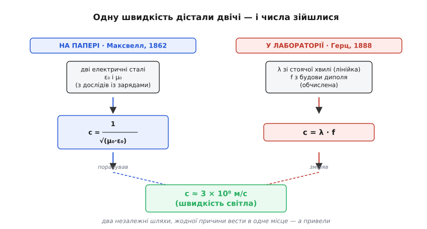

# 📜 Як хвилю спочатку порахували, а тоді впіймали

> Уяви, що хтось називає точну швидкість якоїсь речі, ніколи цю річ не бачивши — навіть не знаючи напевно, що вона існує. Саме це зробив Максвелл із радіохвилею: він вирахував її швидкість на папері, з двох чисел, які інші люди зміряли на лабораторному столі зовсім для іншої мети, — і побачив, що вийшла швидкість світла. Минуло понад двадцять років, перш ніж Генріх Герц у темній кімнаті впіймав цю хвилю приладом і зміряв її довжину та швидкість, підтвердивши здогад. Ця історія варта того, щоб її розказати повільно, бо вона показує рідкісну річ: як теорія на роки випереджає дослід — і чим саме доводять існування того, чого не видно.

У [детальному кроці](root:embedded/frequency-wavelength/detail) ми вивели, що швидкість електромагнітної хвилі задають дві сталі порожнього простору — електрична ε₀ і магнітна μ₀, — і що `c = 1/√(μ₀·ε₀)`. Ми взяли цю формулу як готовий інструмент і полічили нею `299 792 458 м/с`. Тут ми повернемося до того самого рівняння, але з іншого боку: не як користувачі, а як свідки того, **як воно вперше з'явилося на світ** — і чому поява числа `3×10⁸` у ньому колись здалася майже дивом. Бо коли розумієш, звідки взялося те число і як його впіймали, формула перестає бути магічним заклинанням і стає тим, чим є насправді: висновком, що його можна перевірити.

---

## Дві сталі, зміряні зовсім для іншого

Почнімо з того, що найважче відчути з сьогоднішньої відстані: у 1850-х роках ніхто не пов'язував електрику зі світлом. Це були дві окремі науки. Оптику вивчали одні люди — міряли, як швидко біжить світло, як воно заломлюється у склі. Електрику й магнетизм вивчали інші — ставили досліди з батареями, котушками, зарядженими банками. Ці два світи майже не перетиналися, і думка, що видиме світло й іскра в лабораторії — одне явище, здалася б безглуздою.

І ось у цьому окремому світі електрики визріла загадкова стала. Щоб пояснити, звідки вона взялася, треба пригадати технічну дрібницю тодішньої фізики — вона виявиться ключем до всієї історії.

Заряд у ті часи можна було міряти **двома різними способами**, і це не примха, а наслідок того, що заряд проявляє себе двояко. Перший спосіб — **електростатичний**: беремо два заряди, дивимося, з якою силою вони відштовхуються за законом Кулона, і за силою визначаємо величину заряду. Другий спосіб — **електромагнітний**: пускаємо заряд рухатися (тобто робимо з нього струм), дивимося, з якою силою два струми притягуються чи відштовхуються, і за цією силою визначаємо заряд. Один і той самий заряд — але дві мірки: одна через нерухомий заряд і силу Кулона, друга через рухомий заряд і магнітну силу між струмами.

Здавалося б, обидві мірки мали б давати одне число. Але ні — вони давали числа, що різнилися у величезну кількість разів. І щоб перевести одну мірку в другу, потрібен був **перевідний коефіцієнт** — скільки електростатичних одиниць в одній електромагнітній. Цей коефіцієнт нікого особливо не хвилював як щось глибоке: просто технічна стала, потрібна, щоб узгодити два способи рахунку. Але в неї, як з'ясувалося, була захована розмірність швидкості — метри на секунду. Чому саме швидкості — стане ясно згодом; поки що важливо, що це число мало вимірюватися в м/с, хоч ішлося ніби про самі лише заряди.

1856 року двоє німецьких фізиків — **Вільгельм Вебер** (*Wilhelm Weber*) і **Рудольф Кольрауш** (*Rudolf Kohlrausch*) — узялися це число зміряти акуратно. Дослід був хитромудрий: вони заряджали лейденську банку (тодішній конденсатор) відомим зарядом в електростатичних одиницях, а тоді розряджали її й міряли той самий заряд уже як струм, в електромагнітних одиницях. Відношення двох показів і давало шуканий коефіцієнт.

Вони отримали **3.107×10⁸ м/с**.

Число як число. Вебер і Кольрауш акуратно його записали й пішли далі — вони шукали перевідний коефіцієнт, а не розгадку природи світла. Те, що це число підозріло близьке до швидкості світла (яку Фізо на той час зміряв як 3.14×10⁸ м/с, а Фуко як 2.98×10⁸ м/с), вони **не помітили** — чи не надали значення. І це не докір їм: у їхній системі думок електрика й світло лежали в різних шухлядах, тож зіставляти ці числа не було жодної причини. Загадка лежала на видноті кілька років і чекала на того, хто гляне на неї під іншим кутом.

> 🔧 **Навіщо це.** Той самий множник, що колись був «нудним перевідним коефіцієнтом», — це і є ваша стала `c` з формули `c = λ·f`. Коли наступного разу підставлятимете `3×10⁸`, згадайте: це число прийшло не з оптики, а з двох способів зміряти заряд на лабораторному столі. Природа зашила швидкість світла у звичайнісінькі електричні досліди задовго до того, як хтось здогадався там її шукати. Це добре щеплення проти думки, що фундаментальні сталі падають із неба, — вони сидять у вимірюваннях, які роблять руками.

---

## Максвелл дивиться під іншим кутом

Людиною, що глянула інакше, був шотландський фізик **Джеймс Клерк Максвелл** (*James Clerk Maxwell*, 1831–1879). Наприкінці 1861 року, працюючи над теорією електромагнітного поля — тією, що згодом дасть славетні рівняння, — він робив дещо, чого до нього по-справжньому не робив ніхто: **виводив рух поля з механіки самого поля**, а не описував окремі досліди окремими формулами.

Хід його думки для нашої історії важливіший за самі рівняння, тож простежимо суть, не тонучи в математиці. Максвелл додав до вже відомих законів одну симетричну половину. Було відомо (з індукції Фарадея), що змінне магнітне поле породжує електричне. Максвелл припустив, що має бути й дзеркальне: змінне **електричне** поле теж породжує магнітне. Ця добавка — її звуть струмом зміщення — замкнула картину: тепер кожне з двох полів, змінюючись, живило інше. А коли дві речі живлять одна одну поперемінно, природно шукати, чи не виходить із цього **хвиля** — самопідтримна пара, що біжить простором. Саме цю хвилю ми в детальному кроці назвали «естафетою» E і B; тут ми бачимо, як вона вперше народилася на кінчику пера. Механізм тієї естафети — чому змінне E тягне за собою B і навпаки — розібрано в статті [про електромагнітну хвилю](book:physics/em-wave); нам зараз важить не він сам, а те число, що з нього випало.

І рівняння справді дали хвилю. Понад те — вони дали її **швидкість**, і швидкість ця виражалася через ті самі електричну й магнітну сталі, що сидять у законах Кулона й магнітної взаємодії струмів. У сучасному записі це рівно та формула з детального кроку:

```
        1
v = ─────────
    √(μ₀ · ε₀)
```

А тепер — момент, заради якого вся історія. Максвелл підставив у цю формулу числа, відомі з електричних дослідів (по суті — той самий вебер-кольраушів коефіцієнт, бо саме він зв'язує ε₀ і μ₀), і подивився, яка виходить швидкість. Вийшло близько **3.1×10⁸ м/с**. Він порівняв це зі швидкістю світла, яку на той час зміряли оптики, — і числа збіглися.

Тут треба спинитися й відчути силу цього збігу, бо саме вона рухала все далі. Максвелл не міряв швидкість хвилі — жодної хвилі ще ніхто не бачив. Він **порахував** її з двох чисел, здобутих у дослідах із зарядами й струмами, де про світло не було й мови. І це чисто електричне число збіглося з тим, що незалежно наміряли зовсім інші люди зовсім іншими приладами, ловлячи промінь світла. Два шляхи, які не мали жодної причини вести в одне місце, привели в одне місце. Для фізика такий збіг — не випадковість, яку можна відмахнути, а гучний натяк, що за ним стоїть глибша єдність.

Максвелл цей натяк почув. У праці **«Про фізичні лінії сили»** (*On Physical Lines of Force*, друкувалася частинами 1861–1862) він написав слова, які варто навести близько до оригіналу, бо вони — поворотна точка: ми заледве можемо уникнути висновку, що **світло полягає в поперечних коливаннях того самого середовища, яке є причиною електричних і магнітних явищ**. Простіше кажучи: світло — це і є електромагнітна хвиля. Пізніше, у зрілій праці **«Динамічна теорія електромагнітного поля»** (*A Dynamical Theory of the Electromagnetic Field*, 1865), він сформулював це ще твердіше: узгодження результатів показує, що світло й магнетизм — прояви однієї речовини, а світло є електромагнітним збуренням.

Ось де народилося велике об'єднання: радіо, тепло, видиме світло, рентген — усе це одна хвиля, різна лише частотою. І народилося воно не з досліду, а з **збігу двох чисел** — поміченого людиною, яка вміла дивитися під іншим кутом.

Статус цього твердження варто назвати чесно, як вимагає ремесло історика науки. На 1862 рік це був **блискучий, добре обґрунтований здогад** — не доведений факт. Максвелл мав сильний непрямий доказ (збіг швидкостей) і струнку теорію, але прямого спостереження хвилі не було. Наука розрізняє «математика передбачає» і «дослід підтвердив», і між цими двома станами тут пролягли понад двадцять років. Це не применшує Максвелла — навпаки: передбачити на папері те, що зловлять лише за покоління, і є вища проба теорії.

---

## Двадцять років, коли хвиля жила лише на папері

Легко, знаючи кінець, поставитися до цих двадцяти років зневажливо: мовляв, теорія ж правильна, чого чекати. Але сучасники так не могли, і варто зрозуміти чому — бо в цьому вся різниця між красивою ідеєю і встановленою істиною.

Теорія Максвелла була математично важка й спиралася на незвичні припущення. Головне з них — що хвиля летить крізь **порожній простір** сама собою, без відомого середовища. У ті часи фізики були переконані, що будь-яка хвиля потребує середовища: звук біжить повітрям, хвилі — водою, тож і світло мусить бігти чимось. Це «щось» називали світлоносним етером (*luminiferous aether*) і вірили в нього твердо. Максвеллова хвиля вимагала прийняти, що поля тримають одне одного самі, — а це багатьом здавалося майже містикою. Струм зміщення — та сама симетрична добавка — довго вважали радше математичним трюком, ніж фізичною реальністю.

Була й друга біда: **саму хвилю ніхто не міг ні створити, ні зловити**. Видиме світло — так, воно скрізь, але ж треба було показати, що можна взяти електричний прилад і згенерувати ним хвилю нижчої частоти, а тоді її прийняти, — і довести, що це те саме явище. А цього не вміли. Теорія передбачала існування невидимих хвиль, які можна робити електрикою, але в руках їх не було ні в кого.

І Максвелл **не дожив** до розв'язки. Він помер 1879 року, у сорок вісім, від раку — так і не дізнавшись, чи існує його хвиля насправді. Це гірка, але показова деталь: людина вивела одне з найважливіших передбачень фізики й пішла, не побачивши йому підтвердження. Здогад лишився блискучим, але **недоведеним** — і чекав на експериментатора.

Тим часом теорію не лишили лежати. Гурток фізиків, яких згодом назвуть **максвеллівцями** (*the Maxwellians*), — серед них **Олівер Гевісайд** (*Oliver Heaviside*), **Джордж Фіцджеральд** (*George FitzGerald*), **Олівер Лодж** (*Oliver Lodge*) — розчищали й переписували важку теорію Максвелла, доводячи її до придатного вигляду. Саме Гевісайд звів громіздкий набір із двадцяти рівнянь до чотирьох компактних, які ми сьогодні й звемо «рівняннями Максвелла» — по справедливості їх варто було б звати й рівняннями Гевісайда. Ця робота була не косметична: вона зробила теорію такою прозорою, що з неї стало видно, **який саме дослід її перевірить**. Теорію готували до зустрічі з експериментом.

> 🔧 **Навіщо це.** Ці двадцять років сумніву — добрий урок для інженера й досі. Красива формула, що сходиться на папері, — ще не робоча істина, поки її не підперто вимірюванням. Максвеллова хвиля була математично бездоганна й усе одно лишалася гіпотезою, доки хтось не показав її наживо. Тому, проєктуючи щось нове за самою лише теорією, тримайте в голові: остаточне слово — за дослідом на столі, а не за красою рівнянь. Максвелл мав рацію, але правоту довів інший, приладом.

---

## Герц будує машину, що робить хвилі

Експериментатором став **Генріх Рудольф Герц** (*Heinrich Rudolf Hertz*, 1857–1894) — німецький фізик, працював у Політехніці міста **Карлсруе**. Тут доречно точно назвати ідентичність, як велить ремесло: Герц був німцем; його родина по батьковій лінії походила з євреїв, що за два десятиліття до його народження перейшли з юдаїзму в лютеранство. Це не дрібниця для точності опису й нічого не віднімає в його заслузі — просто частина правдивого портрета.

Герц не збирався винаходити радіо. Він хотів **перевірити Максвелла** — показати дослідом, існують ці хвилі чи ні. І в 1886–1888 роках він спорудив прилад, що вперше в історії свідомо **створював** і **ловив** електромагнітні хвилі. Розберімо його логіку, бо вона напрочуд ясна й лежить в основі кожної антени донині.

Щоб зробити хвилю, за Максвеллом, потрібен **швидко коливний заряд** — заряд, що смикається туди-сюди дуже часто. Герц дістав таке коливання іскрою. **Передавач** його — це диполь: два металеві стрижні з великими цинковими кулями на кінцях, а між ними, посередині, вузький **іскровий проміжок**. На стрижні подавали десятки кіловольтів від котушки Румкорфа (*Ruhmkorff coil* — тодішній підвищувач напруги). Коли напруга сягала межі, у проміжку проскакувала іскра — і в цю мить заряд у диполі починав швидко коливатися вперед-назад, наче маятник, що дзенькнув. Коливний заряд, за теорією, мусив випромінити електромагнітну хвилю. Так проста іскра ставала передавачем.

**Приймач** був іще простіший — і в цій простоті вся краса. Герц узяв звичайну дротяну **петлю** (рамку) з таким самим крихітним проміжком між кінцями й поставив її за кілька метрів від передавача. Жодного дроту між приладами, порожній простір. Логіка: якщо хвиля справді летить від передавача, вона, долетівши до петлі, наведе в ній коливний струм, і той струм спробує проскочити проміжок **малесенькою іскоркою**. Побачив іскорку в петлі — значить, щось невидиме перетнуло кімнату.

І він її побачив. Коли передавач іскрив, у проміжку петлі-приймача за кілька метрів проскакувала кволенька іскра. Вона була така слабка, що Герц спостерігав її в **затемненій кімнаті**, часом крізь лупу, у повній тиші. Ця крихітна іскра й була тим, чого фізика чекала двадцять років: **прямим доказом, що електромагнітна хвиля Максвелла існує** — її щойно зробили електрикою й зловили за кілька метрів без жодного дроту.

Сам устрій приладу — іскровий передавач і петлю-приймач — детально розібрано в [історії про те, як Герц упіймав хвилю](book:physics/em-wave/hist-hertz.md); нам тут важливий наступний крок, якого та розповідь торкається побіжно, а він — саме та ланка, що змикає всю нашу історію: **як Герц зміряв довжину й швидкість хвилі**.

---

## Найголовніше: як зміряли довжину й швидкість невидимого

Побачити іскру — це довести, що хвиля є. Але щоб замкнути коло з Максвеллом, треба було більше: показати, що ця хвиля біжить саме зі **швидкістю світла** — з тим числом `3×10⁸`, яке Максвелл дістав із двох електричних сталих. А швидкість не зміряєш безпосередньо: хвиля летить надто швидко, щоб устежити за нею секундоміром на кількох метрах кімнати. Герц розв'язав це блискуче — і саме тут наша тема «частота й довжина хвилі» стає знаряддям історичного доказу.

Пригадаймо наскрізну формулу цього кроку: `c = λ·f`. Вона каже, що швидкість — це добуток довжини хвилі на частоту. Отже, щоб дістати швидкість, не конче ловити саму хвилю в польоті: досить **окремо зміряти довжину λ і окремо частоту f**, а тоді перемножити. Герц зробив саме це — розбив недосяжну швидкість на два вимірювані шматки.

**Частоту** f він знав із будови передавача. Диполь із кулями — це, по суті, коливний контур: його ємність і індуктивність задають, як швидко смикається заряд, так само як довжина маятника задає темп його хитання. Знаючи розміри й форму диполя, Герц міг обчислити частоту коливань — вона виходила дуже висока, сотні мільйонів коливань за секунду.

Лишалося зміряти **довжину хвилі** λ — відстань, яку хвиля проходить за одне коливання. І ось тут Герц застосував гарний прийом зі **стоячою хвилею** (*standing wave*). Він поставив навпроти передавача великий металевий (цинковий) лист — відбивач. Хвиля долітала до листа, відбивалася й бігла назад. Пряма хвиля й відбита накладалися одна на одну — і там, де гребінь однієї збігався з западиною другої, вони гасилися, а де гребінь на гребінь — підсилювалися. У просторі виникав **нерухомий візерунок**: чергування місць, де поле завжди сильне (пучності), і місць, де воно завжди нульове (вузли). Це і є стояча хвиля — та сама, що виникає на натягнутій струні.

Ключова властивість цього візерунка: **відстань між сусідніми вузлами дорівнює половині довжини хвилі**. Отже, вимірявши лінійкою відстань між точками, де приймач мовчить (іскра в петлі зникає), Герц прямо міряв λ/2 — а звідси й саму λ. Він водив петлю-приймач уздовж кімнати між передавачем і листом і позначав, де іскра гасне, а де спалахує найсильніше. Проміжки між тихими точками й дали йому довжину хвилі. У його дослідах виходили хвилі завдовжки близько **кількох метрів** (стоячу хвилю він, за описами, будував, поставивши передавач приблизно за дюжину метрів від відбивача).

Тепер обидва множники були в руках. Лишилося перемножити — точно за формулою цього кроку:

```
c = λ · f
    ↑    ↑
    |    частота з будови диполя (обчислена)
    довжина хвилі зі стоячої хвилі (зміряна лінійкою)
```

І добуток дав **швидкість світла**. Хвиля, зроблена іскрою в Карлсруе, бігла з тією самою швидкістю, яку Максвелл двадцять із гаком років тому вирахував із двох чисел, намаряних у дослідах із зарядами. Коло замкнулося: **порахували на папері — впіймали в лабораторії — і числа зійшлися**.

**Приклад (як із двох мірок виходить швидкість).** Відтворімо логіку Герца сучасними числами, щоб відчути, як працює доказ. Нехай стояча хвиля дала відстань між сусідніми вузлами 2 метри, а частоту диполя обчислено як 75 мегагерців:

```
λ/2 (між вузлами) = 2 м     →   λ = 4 м
f (з будови диполя)          =   75×10⁶ Гц

c = λ · f = 4 · 75×10⁶ = 3×10⁸ м/с
```

Виходить рівно швидкість світла — не тому, що ми її підставили, а тому, що так лягли дві незалежні мірки. Саме ця сходимість і була підтвердженням: не одне число, а **два**, здобуті різними шляхами, разом указали на `c`.

Герц на цьому не спинився. Він показав, що його хвилі роблять усе, що вміє світло: **відбиваються** від металу (як від дзеркала — власне, так і постала стояча хвиля), **заломлюються**, проходячи крізь велику призму зі смоли, і мають **поляризацію** — напрям коливань. Кожна властивість світла знайшлася в радіохвилі. Разом зі збігом швидкостей це не лишало сумніву: **радіохвиля й світло — одне явище**, як і передбачив Максвелл. Здогад 1862 року став доведеним фактом близько 1888-го.

> 🔧 **Навіщо це.** Прийом Герца — зміряти те, що піддається (довжину й частоту), і **обчислити** те, що не піддається (швидкість), — це щоденний метод інженера-радіста досі. Ви так само не ловите хвилю в польоті: ви знаєте частоту з кварцу генератора й рахуєте довжину хвилі формулою `λ = c/f`, точно як у базовому кроці. Стояча хвиля з дослідів Герца теж жива в кожній лабораторії — це вона показує неузгодження в лінії передачі (там, де відбиття дає пучності й вузли, які меряє рефлектометр). Історичний доказ і сучасна практика — той самий шматок фізики.

---

## Що з цієї історії лишається важити

Ми пройшли шлях від нудного перевідного коефіцієнта до підтвердженого закону природи, і варто зібрати докупи те, що ця дорога справді дає — понад самі імена й дати.


*Ліворуч Максвелл рахує швидкість із двох електричних сталих ε₀ і μ₀, здобутих у дослідах із зарядами, — суто на папері, 1862. Праворуч Герц міряє довжину хвилі по стоячій хвилі й обчислює частоту з будови диполя, а тоді перемножує їх за `c = λ·f` — у лабораторії, 1888. Два шляхи, що не мали причини вести в одне місце, привели до того самого `3×10⁸ м/с`. Саме ця сходимість і є доказом.*

Перше й головне: **фундаментальна стала `c` з вашої формули `c = λ·f` — не аксіома й не подарунок згори**. Вона прийшла з двох чисел, зміряних на лабораторному столі в дослідах із зарядами, де про світло ніхто не думав. Максвелл лише глянув під іншим кутом і побачив у їхньому відношенні швидкість світла. Коли підставляєте `3×10⁸`, ви користуєтеся висновком, що його колись треба було вистраждати.

Друге: між «теорія передбачає» і «дослід підтвердив» лежить справжня прірва, і чесна фізика її не замазує. Максвеллів здогад 1862 року був блискучий і добре обґрунтований — але **лишався здогадом двадцять із лишком років**, аж поки Герц не зробив хвилю приладом і не зміряв її. Це рідкісний, майже показовий випадок, коли теорія на роки випередила дослід, — і саме тому його варто знати: він учить поважати різницю між красивою формулою та встановленою істиною.

Третє, найближче до нашої теми: **саму швидкість невидимого зміряли, розбивши її на довжину й частоту** — рівно за формулою `c = λ·f`, з якою ми працюємо весь цей крок. Герц не гнався за хвилею; він зміряв λ по стоячій хвилі, обчислив f з будови диполя й перемножив. Той самий хід — знаю частоту, дістаю довжину (чи навпаки) — ви робите щоразу, прикидаючи антену за частотою модуля.

І нарешті — про чесність в іменах. Хвилю **передбачив** один (Максвелл), **упіймав і зміряв** другий (Герц), а перетворили її на радіозв'язок уже зовсім інші люди в різних країнах — але це вже окрема історія, зі своєю суперечкою за пріоритет, і їй присвячено [окрему розповідь у книзі](book:physics/em-wave/hist-hertz.md). Тут доречно спинитися на головному, що дала саме ця пара: одиницю частоти назвали **герц** (її затвердила Міжнародна електротехнічна комісія 1930 року) — на честь того, хто хвилю впіймав; а число, що він підтвердив, — швидкість світла — сидить у кожному вашому розрахунку довжини хвилі. Максвелл порахував, Герц упіймав — і відтоді радіо перестало бути магією й стало фізикою, яку можна перевірити лінійкою.
