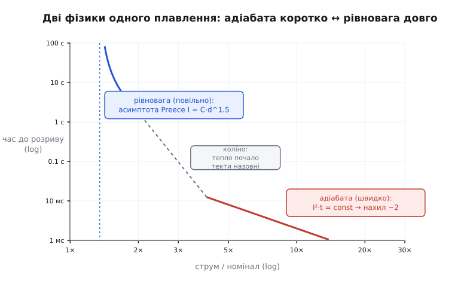
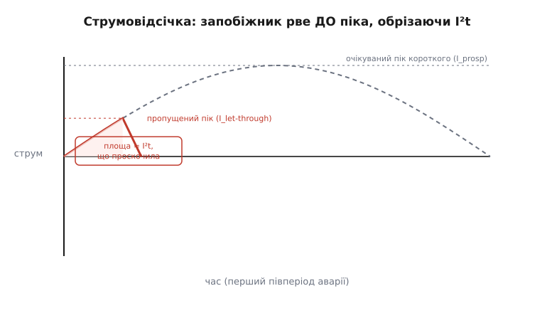
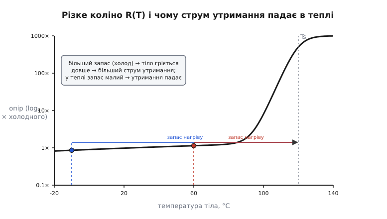
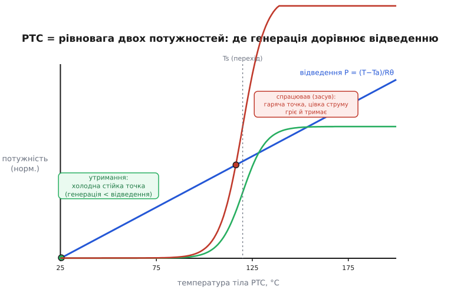

# Запобіжники й PTC у деталях: фізика плавлення, дуги й самовідновлення

Базовий крок дав нам каркас: надструм — це ворог, бо тепло [I²R](book:physics/joule-heating) росте як квадрат струму; запобіжник — навмисно найслабша ланка, що гине першою; у нього не точка, а **крива** спрацювання; а PTC — той самий вартовий, тільки багаторазовий, що не плавиться, а розбухає й розриває провідні ланцюжки. Ми вже знаємо, *що* роблять ці деталі й *коли* яку брати.

Тут ми відкриваємо кришку й дивимося на **механізм**. Чому крива має саме таку форму — з майже вертикальним хвостом на малому надлишку й пологим спадом на великому? Звідки береться загадкове число **I²t**, і чому воно то стале, то ні? Що фізично коїться в ті мілісекунди, коли дротик випаровується, а між його рештками спалахує **дуга**? Як швидкий («струмообмежувальний») запобіжник встигає обрізати аварію ще **до** того, як струм досягне піка? І нарешті — як із простого теплового балансу «генерація проти відведення» самі собою випливають **струм утримання**, **струм спрацювання**, **засув** у гарячому стані та їхнє повзання від температури довкілля в PTC. Мета — щоб наприкінці ти міг не лише вибрати запобіжник із таблиці, а **порахувати** його поведінку й розуміти кожне число в даташиті так, ніби вивів його сам.

Домовимося про одне спрощення наперед. Скрізь, де нижче стоїть I²R чи I²t, треба тримати в голові, що опір R сам залежить від температури — у металу з нагрівом він **росте**. Ми це врахуємо там, де воно принципове (адіабатне плавлення), і знехтуємо там, де воно лише захаращує думку. Це чесний інженерний прийом: спершу гола суть, тоді поправка.

## Дві фізики одного плавлення

Почнімо з питання, яке в базовому кроці ми обійшли: **чому** часострумова крива має саме таку форму. Відповідь — що плавкий елемент живе у **двох різних теплових світах** залежно від того, як швидко на нього навалюється струм, і крива — це просто зшивка цих двох світів.

Уся справа в змаганні двох потоків тепла. Струм **вкидає** тепло в елемент зі швидкістю P = I²R (ват). Водночас елемент **віддає** тепло назовні — через ковпачки, виводи, пісок, повітря — зі швидкістю, що зростає, коли елемент нагрівся понад довкілля. Запишемо тепловий баланс для маленького плавкого містка як рівняння енергії:

```
C·(dT/dt) = I²·R − (T − Ta)/Rθ
```

Ліворуч — накопичення тепла: C — **теплоємність** елемента (Дж/К, скільки енергії треба, щоб нагріти його на градус), dT/dt — швидкість нагрівання. Праворуч — прибуток мінус витрата: I²R гріє, а член (T − Ta)/Rθ відводить тепло до довкілля з температурою Ta через [тепловий опір](book:physics/thermal-resistance) Rθ (К/Вт — наскільки погано тепло стікає назовні). Це те саме рівняння, що описує нагрів будь-якого тіла струмом; уся поведінка запобіжника захована в ньому.

Тепер — ключове спостереження. У цього рівняння є власний **час релаксації** — теплова стала τ = Rθ·C (секунди), за яку елемент устигає обмінятися теплом з довкіллям. І все залежить від того, чи аварія **коротша** за τ, чи **довша**.

**Світ перший — адіабатний (швидко, коротке замикання).** Хай струм велетенський, і елемент нагрівається за час, набагато менший за τ. Тоді відвести тепло він просто **не встигає** — член (T − Ta)/Rθ мізерний проти I²R, бо (T − Ta) ще не встигло вирости. Викидаємо його. Лишається:

```
C·(dT/dt) ≈ I²·R
```

Усе вкинуте тепло йде **тільки** на нагрів самого елемента. Проінтегруймо від початку до миті плавлення (коли T дійде до температури плавлення Tплав, а елемент поглине енергію плавлення):

```
∫ I²·R dt = C·(Tплав − Ta) + (енергія власне плавлення)
```

Права частина — це фіксована **порція енергії**, потрібна саме цьому елементу, щоб розплавитися: суто його властивість, від струму не залежить. Якщо R майже стале, зліва виноситься I²·t. Одержуємо славетне:

```
I²·t = const   (адіабатний режим)
```

Ось звідки береться **I²t** (*let-through energy*, «пропущена енергія»): це просто теплова енергія на одиницю опору, потрібна, щоб убити плавкий елемент. У режимі короткого вона **стала** — байдуже, чи то 100 А за 4 мс, чи 200 А за 1 мс: добуток I²·t однаковий, бо однакова порція енергії плавить той самий дротик. На лог-лог-графіку t(I) це дає пряму з нахилом **−2**: lg t = lg(const) − 2·lg I.

> 🔧 **Навіщо це.** Саме I²t — головне число, коли запобіжником треба захистити **напівпровідник**. У даташиті діода чи тиристора є своє «витримане I²t» — енергія, яку кристал переживе до загибелі. Захист працює лише тоді, коли **I²t запобіжника менше за I²t деталі**: запобіжник мусить «згоріти», випустивши менше енергії, ніж та, що вбиває кристал. Тому для захисту напівпровідників беруть спеціальні «надшвидкі» запобіжники (semiconductor fuse) з гранично малим I²t — звичайний побутовий тут безсилий, бо його дротику треба мілісекунди, а кристалу вистачає мікросекунд.

**Світ другий — рівноважний (повільно, легке перевантаження).** Тепер протилежність: струм лише трохи понад норму, і елемент гріється так повільно, що встигає майже весь надлишок **віддавати** назовні. Через час, набагато більший за τ, нагрів виходить на **сталу** температуру, де прибуток дорівнює витраті: dT/dt → 0, тож

```
I²·R = (T − Ta)/Rθ   →   T = Ta + I²·R·Rθ   (усталена температура)
```

Плавлення настане, лише якщо ця усталена T дотягне до Tплав. Прирівняймо T = Tплав і знайдімо струм, за якого це станеться, — **пороговий струм плавлення** I_плав:

```
I_плав = √( (Tплав − Ta) / (R·Rθ) )
```

Зверни увагу, що тут часу вже **немає**: це струм, нижче якого елемент **ніколи** не розплавиться (устигне все віддати), а трохи вище — розплавиться, але через невизначено довгий час, поки повільно доповзе до Tплав. Тому на кривій це вертикальна **асимптота**: біля неї час до розриву злітає до нескінченності. Ось чому запобіжник «на 2 А» не рветься рівно на 2 А — його поріг сталого плавлення лежить трохи вище номіналу, а сам номінал беруть ще нижче, з запасом.

Ця асимптота — не абстракція, а стара, добре виміряна фізика. Ще у [1884 році британський телеграфний інженер Вільям Генрі Пріс](root:embedded/fuses-ptc/hist-pptc.md) вивів із того самого балансу «I²R проти поверхневого відведення» просту формулу порогу плавлення для круглого дроту: I_плав = k·d^1.5, де d — діаметр, а k — стала матеріалу (для міді ≈ 10244, якщо d у дюймах). Показник 3/2 випливає прямо: тепловиділення в дроті йде з його **об'єму** (∝ d²), а відведення — з **поверхні** (∝ d), тож баланс дає I² ∝ d³, тобто I ∝ d^1.5. Пріс, до речі, шукав це не для побутових запобіжників, а щоб дібрати грозозахисну ланку на телеграфі, — та сама історія «найслабшої ланки», що народила запобіжник узагалі.

**Зшивка двох світів.** Реальна крива — це плавний перехід між двома асимптотами: пологою прямою нахилу −2 (адіабата, велике коротке) угорі-праворуч і майже вертикальною лінією (рівновага, поріг Пріса) унизу-ліворуч. Посередині — «коліно», де аварія триває приблизно τ: тепло вже почало **частково** стікати, але ще не встигає стекти все. Саме тому крива така, а не інша: вона просто зшиває дві граничні фізики.


*Часострумова крива — зшивка двох режимів. Велике коротке (праворуч) плавить елемент адіабатно: I²·t стале, нахил −2. Малий надлишок (ліворуч) веде до сталої температури — час злітає до вертикальної асимптоти порогу плавлення I ≈ C·d^1.5 (Пріс). Коліно — там, де аварія триває приблизно теплову сталу τ.*

Тепер видно, чому поділ на **швидкі (F)** й **повільні (T)** запобіжники — це фактично зсув коліна вздовж часу. Повільний робить теплову сталу τ = Rθ·C **більшою** (масивніший елемент, гірший тепловий контакт), тож коліно з'їжджає праворуч-угору: короткий пусковий кидок [inrush](book:electronics/inrush-current), що триває мілісекунди, встигає розсіятись, і елемент його не помічає. Швидкий, навпаки, робить τ малою — коліно ліворуч-унизу, і він реагує майже без інерції. Одна й та сама фізика, тільки з іншою тепловою масою.

**Приклад (два режими на числах).** Візьмімо запобіжник з умовними R = 5 мОм, τ = Rθ·C, і подивімося, як по-різному його вбиває струм у двох світах. Порахуймо, скільки енергії проскакує при короткому 100 А за 3 мс і порівняймо з довгим перевантаженням.

:::tabs
```cpp
// Оцінка "пропущеної енергії" I2t у режимі короткого (адіабата)
float R = 0.005f;          // Ом, опір плавкого елемента
float I_short = 100.0f;    // А, струм короткого
float t_clear = 0.003f;    // с, час до розриву (з кривої даташита)

float I2t = I_short * I_short * t_clear;   // А²·с — "пропущене I²t"
float E   = I2t * R;                       // Дж — теплова енергія в елементі
// I2t = 100*100*0.003 = 30 А²·с
// E   = 30 * 0.005 = 0.15 Дж
```
```python
# Оцінка "пропущеної енергії" I2t у режимі короткого (адіабата)
R = 0.005            # Ом, опір плавкого елемента
I_short = 100.0      # А, струм короткого
t_clear = 0.003      # с, час до розриву (з кривої даташита)

I2t = I_short * I_short * t_clear   # А²·с — "пропущене I²t"
E   = I2t * R                       # Дж — теплова енергія в елементі
# I2t = 100*100*0.003 = 30 А²·с
# E   = 30 * 0.005 = 0.15 Дж
```
:::

Півтори десяті джоуля, вкинуті за три мілісекунди у крихітний місток, — цього досить, щоб він википів. А тепер уяви те саме I²t = 30 А²·с, але «розтягнуте»: струм 10 А (лише вдвічі понад умовний номінал 5 А) мусив би текти 30/10² = 0.3 с. Але за 0.3 с частина тепла вже **стече** назовні — тож насправді при 10 А він або не перегорить зовсім (якщо це нижче порога Пріса), або протримається значно **довше** за наївні 0.3 с. Це й є практична різниця двох світів: у короткому I²t передбачає час майже точно, у перевантаженні — бреше в безпечний бік, бо частину енергії забирає відведення.

## Що коїться в мить розриву: дуга й відключна здатність

Досі ми говорили, ніби «елемент розплавився — і струм спинився». Насправді найдраматичніше починається саме тоді, коли метал зникає. Розберімо це докладно, бо тут ховається різниця між запобіжником, що рятує, і запобіжником, що **вибухає**.

Уяви коротке з велетенським очікуваним струмом — тисячі ампер. Плавкий місток нагрівається так люто, що не просто плавиться, а **випаровується**, лишаючи між рештками металу проміжок. Але струм у колі несе [індуктивність](book:electronics/inductance) проводів, а вона, як маховик, не дає струму урватися миттєво — і намагається проштовхнути його **крізь проміжок**. Напруга на розриві підскакує, повітря (чи пари металу) в проміжку іонізуються — спалахує **електрична дуга** (*arc*, від лат. *arcus* — лук, дуга): канал розжареної плазми, що чудово проводить струм. У цю мить запобіжник іще **не** розімкнув коло — він лише замінив мідний місток на плазмовий.

Отут і вирішується доля. Щоб справді обірвати струм, запобіжник мусить **погасити дугу** — охолодити плазму, підняти її опір, розтягнути шлях так, щоб напруга джерела вже не могла її живити. Якщо він це вміє — струм спадає до нуля, дуга гасне, коло розімкнене. Якщо **не** вміє (дуга стійка) — струм тектиме крізь плазму далі, елемент розжарюється ще й ще, корпус може тріснути чи вибухнути, розкидаючи розжарений метал. Саме тому запобіжник — не просто «дротик у скельці», а ретельно спроєктована **дугогасна камера**.

Як гасять дугу насправді:

- **Пісок (кварцовий наповнювач).** Потужні запобіжники (мережеві, промислові) наповнюють дрібним кварцовим піском. Коли місток випаровується, розжарені пари металу вриваються в пісок, миттєво **охолоджуються** об холодні піщинки й **сплавляють** пісок у скловидну масу — **фульгурит** (від лат. *fulgur* — блискавка; так само звуть трубки скла, що їх лишає справжня блискавка в піску). Ця скляна пробка розриває канал і не дає дузі відновитися. Пісок водночас відбирає багато тепла — тому пісочні запобіжники мають величезну відключну здатність.
- **Довгий і вузький канал.** Що довший проміжок і що вужчий канал, то важче дузі втриматись — плазмі не вистачає напруги на всій довжині. Тому елемент часто роблять із **звуженнями** (перешийками): кожне звуження випаровується першим і породжує **низку** послідовних дуг замість однієї, а кілька коротких дуг погасити куди легше, ніж одну довгу.
- **Просто повітря.** Дешеві скляні запобіжнички на малі струми гасять дугу голим повітрям у трубці. Цього досить, поки струм короткого невеликий; тому в них і **мала** відключна здатність.

Звідси — суворе, часто недооцінене число: **відключна здатність** (*breaking capacity*, або *interrupting rating*). Це **найбільший** струм короткого, який запобіжник здатний обірвати **безпечно**, не вибухнувши. Скляний побутовий може мати її лише ~35–100 А; керамічний із піском — тисячі ампер; промисловий — десятки тисяч. Правило залізне: **відключна здатність запобіжника мусить перевищувати найбільший можливий струм короткого в цьому місці кола.** Інакше в разі справжньої аварії запобіжник не врятує, а сам стане джерелом вибуху й пожежі — тобто зробить рівно протилежне тому, для чого стоїть.

> 🔧 **Навіщо це.** Найпідступніша помилка новачка — дивитися лише на номінал і клас швидкості, забувши про відключну здатність. Скляний запобіжник «250 В 2 А» коштує копійки, але поставити його на вході приладу, який живиться від потужної мережі (де струм короткого сягає кількох кА), — небезпечно: за реального короткого він може розлетітися. У такому місці треба керамічний із піском і високою відключною здатністю. Тому на корпусі мережевих запобіжників завжди є **три** числа — напруга, струм і відключна здатність (наприклад, «250V T2A H» чи «…1500A»), і читати їх треба всі три. Докладніше, як ці три числа лягають на реальні [корпуси й маркування запобіжників](book:electronics/fuse-types), — окремо.

### Струмообмеження: обрізати аварію до піка

З дуги випливає найкрасивіша здатність швидкого запобіжника — **струмообмеження** (*current limiting*). Щоб її зрозуміти, розрізнимо два струми.

**Очікуваний струм короткого** (*prospective current*) — той, що потік би в колі, якби замість запобіжника була гола перемичка: його визначають лише напруга джерела й повний опір кола. У мережі це може бути синусоїда з амплітудою в тисячі ампер. **Пропущений струм** (*let-through current*) — той, що реально встигає протекти, поки запобіжник рве коло.

І ось суть: у мережі змінного струму аварійний струм наростає **не миттєво**, а по синусоїді — від нуля до піка за чверть періоду (5 мс при 50 Гц). Якщо запобіжник досить швидкий, він розплавиться й розірве коло **ще на висхідній частині** синусоїди, **до** того, як струм досягне очікуваного піка. Тоді реальний пік струму (пропущений) виявляється в рази **нижчим** за очікуваний — запобіжник ніби «зрізає верхівку» аварійної хвилі.


*Струмообмеження. Пунктир — очікуваний струм короткого, що потік би без запобіжника (повна синусоїда з високим піком). Суцільна — реальний, пропущений струм: запобіжник рве коло ще на підйомі, до піка, зрізаючи верхівку хвилі. Заштрихована площа під нею — пропущене I²t, тобто вся енергія, що встигла проскочити в коло.*

Це не косметика, а порятунок для решти кола. Механічні й теплові навантаження від короткого ростуть як **квадрат** струму (сила між провідниками ∝ I², нагрів ∝ I²): зрізавши пік удвічі, ми зменшуємо руйнівний вплив **учетверо**. Тому струмообмежувальні запобіжники дають змогу ставити на плату дешевші, «слабші» доріжки й роз'єми — бо до них ніколи не дійде повний струм короткого, лише обрізаний. У даташиті таку здатність показують кривими **пропущеного I²t** та **пікового пропущеного струму** залежно від очікуваного: що крутіший запобіжник, то нижче він тримає пропущений пік.

## PTC у деталях: рівновага двох потужностей

Тепер перейдімо до самовідновного вартового й розберімо його не на рівні «розбух — розсунулись частинки», а на рівні того самого теплового балансу, з якого в нас уже випливла крива запобіжника. Виявиться, що весь характер PTC — струм утримання, струм спрацювання, засув у гарячому стані, повзання від температури — виводиться з **однієї** картинки: генерація потужності проти відведення.

Нагадаю базову механіку одним реченням, бо будуватимемо на ній: усередині PTC — [напівкристалічний полімер](root:basic-chemistry/polymers) (зазвичай поліетилен високої густини), напханий провідними частинками сажі; поки полімер кристалічний і щільний, частинки торкаються й проводять, а коли він нагрівається до температури плавлення кристалітів і **розбухає**, частинки розсуваються, ланцюжки рвуться — і опір стрибає в тисячі разів. Ключове для нас: опір R залежить від температури тіла T, і залежність ця — з різким **коліном** біля температури переходу Ts. Сам ефект різкого стрибка опору в такому композиті [відкрили ще до транзисторної ери, а зручним багаторазовим захистом він став аж через десятиліття](root:embedded/fuses-ptc/hist-pptc.md) — але про це в окремій історії.


*Крива R(T) полімерного PTC: до температури переходу Ts (плавлення кристалітів, ~120 °C для поліетилену) опір майже сталий, а біля Ts стрибає в сотні-тисячі разів на кількох градусах. Дві вертикалі — холодне (−10 °C) і тепле (+60 °C) довкілля: у теплі «запас нагріву» до Ts менший, тож тілу треба менший струм, щоб дійти до коліна, — звідси падіння струму утримання в теплі.*

Запишімо для PTC той самий тепловий баланс, що й для запобіжника, але тепер із R, що залежить від T:

```
C·(dT/dt) = I²·R(T) − (T − Ta)/Rθ
```

У сталому стані (dT/dt = 0) прибуток тепла дорівнює витраті:

```
I²·R(T) = (T − Ta)/Rθ
```

Ліворуч — **крива генерації** P_gen(T) = I²·R(T): при малих T вона низька й майже плоска (R ще мале), а біля Ts злітає вгору (R стрибнув). Праворуч — **пряма відведення** P_dis(T) = (T − Ta)/Rθ: чим гарячіше тіло понад довкілля, тим більше тепла воно віддає. Робочі стани PTC — це **точки перетину** цих двох ліній: там, де скільки тепла народжується, стільки й стікає.


*Уся поведінка PTC — з перетину двох потужностей. Синя пряма — відведення тепла до довкілля. Зелена крива — генерація I²R при струмі утримання: перетинає пряму в холодній стійкій точці (тіло ледь тепле, опір малий, струм тече). Червона крива — генерація при струмі спрацювання: піднялась так, що холодна точка зникла, лишилась гаряча — тіло стрибнуло за Ts, опір величезний, крізь нього йде лише цівка, яка сама себе гріє й тримає (засув).*

Тепер прочитаймо з цієї картинки всі числа даташита.

**Струм утримання** (*hold current*, I_H). Візьмімо малий струм. Крива генерації I²·R(T) лежить низько й перетинає пряму відведення в **холодній** точці — тіло ледь тепліше за довкілля, опір малий, струм тече вільно. Ця точка **стійка**: якщо тіло випадково трохи нагріється, відведення (пряма) починає перевищувати генерацію (крива ще пласка), тепло стікає — і тіло вертається назад. PTC сидить холодним «вічно». Струм утримання — це **найбільший** струм, за якого холодна стійка точка ще існує: тіло гріється, але не дотягує до коліна Ts.

**Струм спрацювання** (*trip current*, I_T). Тепер збільшуймо струм. Крива генерації I²·R(T) піднімається вгору (кожна точка множиться на більший I²). У якийсь момент вона **відірветься** від прямої відведення в холодній зоні — холодна стійка точка **зникне**. Тепер генерація всюди вище за відведення, поки тіло не нагріється аж за коліно Ts, де опір злетів так, що... стоп, здавалося б, вищий опір — вища генерація I²R? Ні: коли ланцюжки порвались, струм майже спинився, тож I впав катастрофічно, і добуток I²R хоч і великий, та вже кінцевий, і десь у гарячій зоні знову зрівнюється з відведенням. Тіло **стрибає** в цю **гарячу** точку — PTC спрацював.

Отже, різниця I_H і I_T — не два незалежні числа, а **дві межі одного зникнення холодної точки**: нижче I_H тіло певно холодне, вище I_T — певно гаряче, а між ними «сіра зона», де PTC може бути в будь-якому стані залежно від передісторії. Ось чому в даташиті I_T зазвичай приблизно вдвічі більший за I_H: це ширина сірої зони, задана крутизною коліна R(T).

**Засув (latch) у гарячому стані.** Найтонше — чому спрацьований PTC **лишається** гарячим, поки подано напругу. У гарячій точці тіло розжарене за Ts, опір величезний, крізь нього тече лише крихітна цівка. Але ця цівка на величезному опорі виділяє потужність I_цівки²·R_гаряче, і цієї потужності якраз досить, щоб **утримувати** тіло гарячим — рівно стільки, скільки стікає назовні. PTC сам себе гріє власним струмом витоку, застрягши (latched) у високоомному стані. Прибери напругу — зникне й цівка, генерація впаде до нуля, тіло охолоне нижче Ts, полімер стиснеться, ланцюжки зімкнуться, опір упаде — і PTC **сам** повернеться в холодну точку. Ось повний цикл, і весь він — мандрівка робочої точки по нашій картинці: з холодного перетину вгору в гарячий і назад.

**Приклад (де сидить робоча точка).** Хай PTC у нормі має холодний опір R = 0.1 Ом, тепловий опір до довкілля Rθ = 40 К/Вт, температуру переходу Ts = 120 °C, довкілля Ta = 25 °C. Прикиньмо, за якого струму тіло дотягне до Ts і почнеться спрацювання. Для оцінки візьмімо R майже сталим до коліна (це дає струм спрацювання):

:::tabs
```cpp
// Оцінка струму, за якого тіло PTC доходить до переходу Ts
float R_cold = 0.10f;    // Ом, холодний опір
float Rth    = 40.0f;    // К/Вт, тепловий опір до довкілля
float Ts     = 120.0f;   // °C, температура переходу полімеру
float Ta     = 25.0f;    // °C, довкілля

// у сталому стані: I²·R·Rth = (Ts − Ta)  →  I = sqrt((Ts−Ta)/(R·Rth))
float I_trip = sqrtf((Ts - Ta) / (R_cold * Rth));
// = sqrt(95 / (0.1*40)) = sqrt(95/4) = sqrt(23.75) ≈ 4.87 А
```
```python
from math import sqrt
# Оцінка струму, за якого тіло PTC доходить до переходу Ts
R_cold = 0.10    # Ом, холодний опір
Rth    = 40.0    # К/Вт, тепловий опір до довкілля
Ts     = 120.0   # °C, температура переходу полімеру
Ta     = 25.0    # °C, довкілля

# у сталому стані: I²·R·Rth = (Ts − Ta)  →  I = sqrt((Ts−Ta)/(R·Rth))
I_trip = sqrt((Ts - Ta) / (R_cold * Rth))
# = sqrt(95 / (0.1*40)) = sqrt(95/4) = sqrt(23.75) ≈ 4.87 А
```
:::

Близько 4.9 А — за такого струму тіло сталою потужністю догрівається саме до коліна. Струм утримання буде помітно нижчий (бо треба лишити запас, щоб не доповзти до Ts від законних коливань і теплого довкілля) — звідси й типове співвідношення I_H ≈ 0.5·I_T. А тепер головне спостереження: якщо довкілля стане теплішим, різниця (Ts − Ta) в чисельнику **зменшиться**, і той самий поріг настане за **меншого** струму. Це не похибка — це фундаментальне повзання, до якого переходимо.

### Повзання від температури: чому PTC «неточний»

У базовому кроці ми сказали, що PTC «менш точний» і «залежить від температури». Тепер видно **чому** — прямо з формули I_trip = √((Ts − Ta)/(R·Rθ)). Струм спрацювання пропорційний √(Ts − Ta), тобто квадратному кореню з **запасу нагріву** — різниці між температурою переходу й температурою довкілля. Що тепліше довкола, то менший цей запас, то менший струм потрібен, щоб доповзти до коліна.

Порахуймо повзання на числах для нашого прикладу:

```
довкілля Ta      запас (Ts−Ta)     струм спрацювання ∝ √запас
  −20 °C           140 К              √140 = 11.83   (умовних одиниць)
  +25 °C            95 К              √95  =  9.75
  +60 °C            60 К              √60  =  7.75
  +85 °C            35 К              √35  =  5.92
```

Від морозу −20 до спеки +85 струм спрацювання падає майже **вдвічі** — і це не дефект конкретного зразка, а сама фізика теплового балансу. Тому даташит PTC завжди дає **криву дерейтингу** (*derating curve*): скільки відсотків номінального струму утримання лишається за кожної температури довкілля. Проєктуючи, беруть I_H **не** за 25 °C, а за найгіршою (найвищою) робочою температурою пристрою — інакше PTC хибно спрацьовуватиме в спеку від цілком законного струму.

Порівняй це з плавким запобіжником: його поріг теж трохи повзе від температури (метал теж має свою (Tплав − Ta)), але Tплав металу — сотні градусів, тож зміна довкілля на десятки градусів — це мала поправка. У PTC Ts усього ~120 °C, тож те саме коливання довкілля з'їдає помітну частку запасу. Ось чому PTC «неточніший»: у нього просто **менший запас нагріву** за абсолютною шкалою, тож усе, що ворушить довкілля, сильніше ворушить і поріг.

> 🔧 **Навіщо це.** Пристрій, що працює і на морозі, і в нагрітому корпусі, — типова пастка з PTC. Обереш I_H за кімнатною температурою — і в літню спеку чи біля гарячого блока живлення PTC почне «сам собою» вимикати цілком справне навантаження, а на морозі, навпаки, пропустить більший струм, ніж ти розраховував. Тому для PTC завжди дивляться дерейтинг і закладають запас під **верхню** робочу температуру. Якщо потрібна точна, стабільна межа струму незалежно від погоди — PTC не той інструмент; тоді беруть плавкий запобіжник або активний [електронний захист](book:electronics/efuse) з опорним джерелом.

### Час до спрацювання й старіння

Ще два практичні числа випливають із того самого рівняння балансу — тепер із поверненим членом C·(dT/dt).

**Час до спрацювання** (*time-to-trip*). PTC спрацьовує не миттєво: тілу треба нагрітися від довкілля до Ts, а на це йде час, заданий тепловою масою C. Розв'язок рівняння нагріву (поки R майже стале) — це знайома **експонента**: T(t) = T_кінц·(1 − e^(−t/τ)), τ = Rθ·C. Що більший надструм, то вища «цільова» температура T_кінц, то раніше крива перетне Ts — тому час до спрацювання круто падає зі струмом (як і в запобіжника). При струмі трохи понад I_T це секунди; при доброму короткому — частки секунди. Але **ніколи** не мікросекунди: теплову масу не обдуриш. Ось чому PTC принципово **повільніший** за плавкий запобіжник у режимі короткого й тим паче за електронний захист — від блискавичного піка він устигає пропустити чималий струм, поки прогріється. PTC береже від **тривалого** надструму, а не від наносекундного сплеску.

**Старіння (*resistance drift*).** Кожне спрацювання — це плавлення й застигання полімеру, і щоразу мікроструктура частинок сідає трохи інакше. Наслідок: **холодний** опір PTC після спрацювань поволі **росте** — типово опір R1 (через годину після першого спрацювання) вищий за початковий R_min нового зразка, а далі підповзає ще. Це не поломка, а нормальне «зношування»: важить лише там, де падіння напруги на PTC критичне. Тому даташит дає і R_min (новий), і R_max (гарантована стеля холодного опору за життя) — рахувати треба за R_max, щоб врахувати старіння наперед.

## Ціна вартового: власний опір і падіння напруги

Обидва вартові — і запобіжник, і PTC — стоять **послідовно** в колі й самі несуть увесь струм навантаження. Тому обидва мають власний опір, а отже, **крадуть** частину напруги й **гріються** навіть у нормі. У точних чи сильнострумових колах це не дрібниця, і в детальному розгляді її треба порахувати.

Падіння напруги просте: U_втрати = I·R_вартового. У запобіжника R крихітний (міліоми), тож на малих струмах втрати мізерні. А от у **PTC** холодний опір помітний — від десятків міліом до одиниць ом, — і на робочому струмі це може з'їсти відчутну частку напруги живлення. Гірше того: PTC у нормі вже трохи **підігрітий** робочим струмом, а підігрітий полімер має вищий опір (він же вже піднімається до коліна), тож падіння росте нелінійно, коли підбираєшся до струму утримання.

**Приклад (втрати на PTC у нормі).** Хай PTC із R_max = 0.5 Ом (з урахуванням старіння) стоїть на лінії 5 В, що живить пристрій зі струмом 0.4 А:

:::tabs
```cpp
float R_ptc = 0.5f;     // Ом, холодний опір з урахуванням старіння (R_max)
float I     = 0.4f;     // А, робочий струм
float Vin   = 5.0f;     // В, напруга до PTC

float V_drop = I * R_ptc;        // В, падіння на PTC
float V_load = Vin - V_drop;     // В, що дісталось навантаженню
float P_ptc  = I * I * R_ptc;    // Вт, самонагрів PTC у нормі
// V_drop = 0.4 * 0.5 = 0.20 В
// V_load = 5.0 - 0.20 = 4.80 В
// P_ptc  = 0.4*0.4*0.5 = 0.08 Вт (це тепло PTC розсіює постійно)
```
```python
R_ptc = 0.5     # Ом, холодний опір з урахуванням старіння (R_max)
I     = 0.4     # А, робочий струм
Vin   = 5.0     # В, напруга до PTC

V_drop = I * R_ptc         # В, падіння на PTC
V_load = Vin - V_drop      # В, що дісталось навантаженню
P_ptc  = I * I * R_ptc     # Вт, самонагрів PTC у нормі
# V_drop = 0.4 * 0.5 = 0.20 В
# V_load = 5.0 - 0.20 = 4.80 В
# P_ptc  = 0.4*0.4*0.5 = 0.08 Вт (це тепло PTC розсіює постійно)
```
:::

Двісті мілівольт втрати на п'ятивольтовій лінії — це 4 %, і для чутливого до напруги навантаження вже забагато. А 80 мВт постійного самонагріву означають, що PTC у нормі теплий, тож його реальний струм утримання **нижчий** за паспортний (він уже частково «витратив» запас нагріву на себе). Мораль: для сильнострумових або низьковольтних (3.3 В і нижче) кіл PTC вибирають із гранично малим R_max, інакше сам вартовий стає помітним споживачем і псує живлення, яке мав би берегти.

> 🔧 **Навіщо це.** Коли на платі з PTC «просідає напруга» під навантаженням, перше підозрюване — сам PTC: виміряй напругу до нього й після. Часто це не «слабке живлення», а падіння на послідовному захисті, ще й підросле від старіння й самонагріву. У проєкті це закладають наперед: рахують падіння за R_max (не R_min!) і за верхньою температурою, інакше готовий виріб на межі струму утримання почне і гріти PTC, і недодавати напруги навантаженню.

## Три вартові поруч: коли який

Тепер, коли ми бачимо механізм кожного, зведімо вибір докупи вже не гаслами, а за фізичними властивостями. Третій вартовий — [автомат захисту](book:electronics/circuit-breaker) (*circuit breaker*), механічний багаторазовий вимикач із двома розчіплювачами: тепловим (біметал, що гнеться від I²R-нагріву, — повільний, для перевантаження) і магнітним (соленоїд, що миттєво вибиває засувку від великого короткого). Він накриває обидва роди надструму, як запобіжник кривою, тільки багаторазово й з важелем замість заміни.

Порівняння за суттю, а не за ярликами:

```
властивість        плавкий запобіжник   PTC                автомат
розмикання         повне (розрив)       часткове (цівка)   повне (контакти)
відновлення        заміна (одноразовий) саме, охолонувши   важіль (багаторазовий)
швидкість короткого  мкс–мс             частки секунди     мс (магнітний)
точність порогу    висока               низька (повзе)     середня
струм короткого    величезний           скромний           великий
власне падіння     міліоми              десятки мОм–Оми    міліоми (контакти)
захист напівпровідн. лише надшвидкі      ні (повільний)     ні
типове місце       мережа, авто, БЖ     USB, батареї, іграшки  домашній щиток
```

Логіка вибору читається з таблиці прямо. Потрібне **повне, точне, швидке** розмикання великого струму, а рідкісна заміна не проблема — **плавкий запобіжник** (мережа, автомобіль, вхід блока живлення). Збої **часті, дрібні, тимчасові**, лізти із заміною незручно, а невеличке падіння напруги терпиме — **PTC** (кожен USB-порт, захист акумулятора від короткого, мотори іграшок). Потрібне **багаторазове** розмикання цілої лінії з ручним поверненням і струмами домашньої мережі — **автомат** (щиток). А для наносекундної точності захисту дорогого кристала жоден із трьох не годиться — там ставлять **активний** електронний захист (eFuse, обмежувач струму), що вимикає коло за мікросекунди транзистором.

**Приклад (добір PTC для USB-порту).** Порт віддає до 0.5 А корисно, живлення 5 В, пристрій має вижити в корпусі, що прогрівається до 60 °C. Який PTC?

:::tabs
```cpp
// Крок 1: струм утримання МУСИТЬ бути вищим за законний струм навантаження
float I_load_max = 0.5f;     // А, максимум корисного струму
// беремо запас ~1.5×, бо в теплі I_H падає
float I_hold_25  = 0.75f;    // А, шукаємо PTC з таким I_H при 25 °C

// Крок 2: перевірка дерейтингу до робочих 60 °C
// типовий дерейтинг ~ 0.6× при 60 °C (з кривої даташита)
float derate_60  = 0.60f;
float I_hold_60  = I_hold_25 * derate_60;    // = 0.75 * 0.6 = 0.45 А (!)
// 0.45 А < 0.5 А навантаження  →  у спеку спрацює хибно!
```
```python
# Крок 1: струм утримання МУСИТЬ бути вищим за законний струм навантаження
I_load_max = 0.5     # А, максимум корисного струму
# беремо запас ~1.5×, бо в теплі I_H падає
I_hold_25  = 0.75    # А, шукаємо PTC з таким I_H при 25 °C

# Крок 2: перевірка дерейтингу до робочих 60 °C
# типовий дерейтинг ~ 0.6× при 60 °C (з кривої даташита)
derate_60  = 0.60
I_hold_60  = I_hold_25 * derate_60    # = 0.75 * 0.6 = 0.45 А (!)
# 0.45 А < 0.5 А навантаження  →  у спеку спрацює хибно!
```
:::

Розрахунок ловить пастку: PTC з I_H = 0.75 А при 25 °C у нагрітому до 60 °C корпусі тримає лише 0.45 А — **менше** за законні 0.5 А, тож почне вимикати справний пристрій. Правильний хід — узяти PTC з більшим I_H (скажімо, 1.1 А при 25 °C), щоб після дерейтингу до 60 °C лишилося з запасом понад 0.5 А. Ось навіщо ми так довго виводили повзання від температури: без нього цей вибір роблять «на око» й потрапляють у сезонні глюки, які потім місяцями ловлять як «плаваючу несправність».

## Спільний корінь і зворотний бік

Пройшовши обидва вартові до самого дна, побачимо ту саму єдність, що й у базовому кроці, — але тепер вона вже не гасло, а висновок з рівнянь. **І запобіжник, і PTC, і тепловий розчіплювач автомата** живуть на одному рівнянні теплового балансу C·(dT/dt) = I²·R − (T − Ta)/Rθ. Запобіжник доводить ліву частину до плавлення металу; PTC — до плавлення кристалітів полімеру, що стрибком міняє R; біметал автомата — до вигину пластини. Три різні наслідки одного нагріву, поставленого на службу безпеці. Навіть форма їхніх часострумових кривих однакова з тієї ж причини: адіабата на великому струмі, рівноважна асимптота на малому.

І з цієї ж єдності випливає зворотний бік. Якщо навіть **справні** деталі неминуче гріються, бо несуть струм (той самий I²R), то це тепло треба кудись **відводити** — інакше компонент звариться у власному соку без жодної аварії. Той самий член (T − Ta)/Rθ, що в запобіжнику рятує, відводячи тепло від містка, в силовому транзисторі стає питанням життя: чи встигає [тепловий шлях](book:physics/thermal-resistance) відвести розсіювану потужність, поки кристал не перегрівся. Джоулеве тепло, що тут було вартовим, там постає ворогом, якого доводиться приборкувати радіатором і розрахунком теплового опору. Але це вже інша нитка — про відведення тепла, а не про захист від струму.

---
