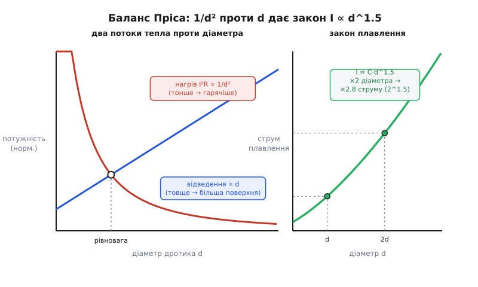

# 📜 Число замість чуття і полімер, що ожив: дві історії за лаштунками запобіжника

> Про народження самої ідеї «найслабшої ланки» — телеграф, блискавки, Едісон і монетка за пробкою — ми вже говорили в [іншій історії](root:embedded/fuses-ptc/hist-fuse.md). Тут — дві речі, яких там не було, але без яких сучасний захист немислимий. Перша: як плавкий дротик із **ремесла на око** став **інженерним числом** — коли товщину запобіжника навчилися рахувати, а не вгадувати. Друга: як народився PTC — той самий самовідновний захист із нашої теми, що не гине, а «зомліває». Виявляється, ефект, на якому він стоїть, описали ще **до появи транзистора**, а до реальних USB-портів йому лишалося пів століття.

Обидві історії про одне й те саме: між **ідеєю** й **робочою річчю** лежить велика прірва, і засипають її часто зовсім інші люди, ніж ті, кому дістається слава. Ідея запобіжника, ми пам'ятаємо, була така природна, що батька в неї немає. Але «поставити тонкий дротик» — це ще не інженерія. Інженерія починається тоді, коли можна сказати наперед: **оцей** дротик перегорить рівно за такого струму. І окремо — коли той самий захист удається зробити **багаторазовим**, щоб не бігати з пінцетом після кожного збою. Ось про ці два стрибки й мова.

## Частина перша: коли товщину дроту навчилися рахувати

### Ремесло, яке працювало, але не пояснювало себе

Уявімо телеграфного майстра десь у 1870-х. Він знає з досвіду: щоб захистити лінію від грози, треба вставити тонкий дротик — надто товстий не перегорить від блискавки, надто тонкий перегорятиме від звичайного робочого струму. Але **наскільки** тонкий? На це в нього немає формули — лише чуття, таблички, успадковані від старших, і метод спроб. Для однієї лінії дібрав — а прийшла інша, з іншим струмом, — і все спочатку.

Це типовий стан молодої техніки: річ **працює**, але не вміє **пояснити себе числом**. А без числа її не можна ні надійно повторити, ні передати іншому, ні закласти в проєкт наперед. Запобіжник у цьому сенсі довго лишався ремеслом. Потрібен був хтось, хто спитає не «який дротик спрацював у сусіда», а «**чому саме такий** і як це порахувати з першопринципів».

### Пріс і баланс двох потоків тепла

Цим кимось став **Вільям Генрі Пріс** (*William Henry Preece*, 1834–1913) — валлійський інженер, головний консультант, а згодом і головний інженер британської поштової служби (*British General Post Office*, GPO), яка тоді відповідала за весь телеграф країни. Той самий світ, де народився запобіжник: лінії просто неба, блискавки, дорога апаратура на кінцях. Пріса турбувала цілком конкретна річ — **грозозахист**: підібрати такий дротик-запобіжник, що спокійно нестиме телеграфний струм, але згорить від грозового кидка. Тільки він вирішив підібрати його не на око, а **вивести**.

> 🔧 **Навіщо це.** Це та сама задача, що й сьогодні у вас на столі, коли ви обираєте запобіжник до плати: він мусить **терпіти** робочий струм і **рвати** аварійний. Пріс перший перетворив це «терпіти/рвати» на рівняння — і воно досі живе у вашому даташиті, тільки виробник уже порахував його за вас.

Хід думки Пріса — взірець фізики «від першопричин», тож пройдімо його разом. Дротик, по якому тече струм, водночас **гріється** і **остигає**. Гріє його [джоулеве тепло](book:physics/joule-heating): потужність нагріву — це I²R. А остигає він, віддаючи тепло з **поверхні** — випромінюванням і конвекцією в повітря. Дротик перебуває при сталій температурі, коли ці два потоки **зрівноважені**: скільки тепла народилось усередині, стільки й пішло з поверхні.

Тепер найтонше — як кожен потік залежить від **діаметра** дротика d. Запишімо обидва й подивімося, хто росте швидше:

```
народжується (нагрів):   P_gen = I²·R,   а опір R = ρ·l / A,   де A = π·d²/4
                          → при тій самій довжині R ∝ 1/d²
віддається (з поверхні):  P_dis = h · (площа поверхні) = h · π·d·l
                          → P_dis ∝ d
```

Ось де ховається вся суть. Нагрів через опір росте як **1/d²** (тонший дріт — більший опір — сильніший нагрів тим самим струмом), а відведення росте лише як **d** (товщий дріт — більша бічна поверхня, більше остигання). Дріт розплавиться, коли за незмінного струму нагрів дожене відведення. Прирівняймо два потоки на межі плавлення й подивімося, як гранична сила струму залежить від d:

```
на межі:  I²·R = h·π·d·l
          I² · (ρ·l)/(π·d²/4) = h·π·d·l
          I² · (4ρ)/(π·d²) = h·π·d           (довжина l скорочується!)
          I² = h·π²·d³/(4ρ)
          I = √(h·π²/(4ρ)) · d^1.5
```

І ось воно — **закон Пріса**:

```
I_плав = C · d^1.5
```

Струм плавлення росте не пропорційно діаметру й навіть не квадрату його, а як діаметр **у степені півтора**. Уся фізика — оте скорочення довжини й гонитва «1/d² проти d» — стиснулась у скромний показник 1.5. А весь бруд реального світу (який метал, як він випромінює, яка температура плавлення) сховався в один коефіцієнт C, що його Пріс визначив **дослідом** для кожного металу.


*Дротик у рівновазі: скільки тепла народив опір (росте як 1/d² з тоншанням), стільки має піти з бічної поверхні (росте як d). Прирівнявши два потоки на межі плавлення, Пріс дістав, що гранична сила струму росте як діаметр у степені півтора — не лінійно й не квадратично. Праворуч — сам степінь: подвоїти діаметр означає підняти струм плавлення приблизно в 2.8 раза (2^1.5).*

Ці досліди Пріс проводив і публікував у першій половині 1880-х, а підсумкові коефіцієнти виклав у праці 1888 року в **Proceedings of the Royal Society** (публікації тривали протягом 1883–1888 років). Для міді константа вийшла

```
C_Cu ≈ 10244   (діаметр — у ДЮЙМАХ, струм — в амперах)
```

Одиниці тут не дрібниця, а частина факту: цифра 10244 прив'язана до **дюймів**, як їх міряли у вікторіанській Британії; для інших металів Пріс дав свої числа (мідь ≈ 10244, алюміній ≈ 7585, залізо ≈ 3148, олово ≈ 1642 — усі в тій самій «дюймовій» шкалі). Перерахуєш діаметр у міліметри — константа стане інша.

**Приклад (звідки береться «дротик на стільки-то ампер»).** Візьмімо мідний дротик діаметром 0.2 мм. Скільки струму він витримає до плавлення за Прісом?

```
d = 0.2 мм = 0.2 / 25.4 = 0.00787 дюйма
d^1.5 = 0.00787^1.5 ≈ 0.000698
I_плав = 10244 × 0.000698 ≈ 7.2 А
```

Тобто такий волосок згорить приблизно при семи амперах. Хочете вдвічі більший струм витримки — не подвоюйте діаметр (це дало б лише ×2.8 замість ×4 у площі перерізу з іншого боку). Це вже інженерія: число, яке можна покласти в проєкт, а не успадкувати від майстра.

### Чесно про межі: де закон Пріса ламається

Аналогія «баланс двох потоків» точна — але, як усяка добра аналогія, має де зламатися, і Пріс це знав гірше за нас. Його вивід мовчки припускає, що дротик уже дійшов до **сталої** температури: нагрів і відведення встигли зрівноважитись. Це правда для **повільного** перегріву — коли струм лише трохи понад норму й дротик неквапно доходить до плавлення за секунди чи хвилини. Тоді тепло справді встигає стікати з поверхні, і закон Пріса — на своєму місці.

А от при **короткому замиканні** все навпаки. Струм у десятки разів понад норму вкидає тепло так швидко, що воно **не встигає** нікуди піти з поверхні — дротик випаровується за мілісекунди, ніби він теплоізольований. Це вже інша фізика, **адіабатна** (гр. *adiábatos* — «непрохідний», тепло не проходить назовні), і закон Пріса до неї не пасує: у ній діаметр поверхні взагалі не грає ролі, бо остигати ніколи.

Цей другий, швидкий режим отримав своє власне рівняння — **рівняння Ондердонка** (*Onderdonk*). Замість балансу з поверхнею воно каже інше: усе вкинуте тепло йде на розігрів **маси** самого металу до плавлення, тож важить не діаметр, а переріз і **час**. Це і є та сама енергія **I²t**, про яку йдеться в нашій темі, коли ми говоримо, скільки встигне «проскочити» до перегоряння — тільки записана як закон.

Із самим Ондердонком історія майже детективна, і чесність вимагає її розказати. **Ім'я I. M. Ондердонк відоме, а людина — ні.** Первісного джерела, де він вивів своє рівняння, ніхто не знайшов; уперше формула з'явилася в **1928 році** — у статті журналу *General Electric Review*, яку написав Е. Р. Штауффахер (*E. R. Stauffacher*), інженер із захисту компанії Southern California Edison. Тобто ми маємо рівняння, назване чиїмось прізвищем, без жодного документа від самого носія цього прізвища. Статус тут треба назвати прямо: **рівняння — усталений інженерний факт**, ним досі рахують нагрів провідників при коротких струмах; а **особа Ондердонка — історична загадка**, і будь-яка певність щодо того, ким він був, була б вигадкою. Додаймо й межу самого рівняння: воно чесне лише для **коротких** інтервалів (класично — до ~10 секунд), бо тримається на припущенні, що тепло не встигає піти; на довших часах повертається світ Пріса.

Тож дві формули — не суперниці, а **дві половини** однієї картини: Пріс описує повільне плавлення в рівновазі (I ∝ d^1.5), Ондердонк — швидке адіабатне (I²t ≈ const). Саме цю пару — «дві фізики одного плавлення» — ми й бачили на кривій часострумової характеристики в детальному розборі теми: пологу гілку повільного перегріву й круту гілку миттєвого короткого. Тепер зрозуміло, звідки в кожної гілки своє коріння й свої імена.

## Частина друга: полімер, що навчився оживати

### Прірва між «помітили ефект» і «зробили прилад»

Друга історія — про сам **самовідновний PTC** із нашої теми, і вона ще виразніше показує, яка глибока прірва між ідеєю та річчю. Тут між першим спостереженням ефекту й першим масовим приладом лягло **пів століття**.

Нагадаємо суть, до якої ми дійшли в темі: усередині PTC — полімер, напханий провідними частинками; холодний він проводить, а нагрівшись — розбухає, ланцюжки частинок рвуться, і опір стрибає в тисячі разів. Ключове тут — **додатний температурний коефіцієнт** опору (*Positive Temperature Coefficient*, звідси й PTC): гарячіше означає більший опір. Для металів це майже банальність (метал теж трохи «важчає» опором у теплі), але щоб опір злітав **різко, стрибком** — потрібен саме такий рукотворний матеріал: провідні зерна в полімері, що тане чи розширюється. Хтось же мав уперше помітити, що така суміш поводиться так дивно.

### Пірсон, 1939: ефект, знайдений до транзистора

Цим кимось був **Джеральд Пірсон** (*Gerald Pearson*, 1905–1987) — американський фізик із **Bell Labs**, легендарної лабораторії телефонної компанії. У **1939 році** він описав різкий ріст опору в провідному полімері — суміші **сажі** (дрібного вуглецю) з **поліетиленом** — і закріпив це патентом **US 2 258 958** під сухою назвою «Conductive device» («провідний пристрій»; заявку подано 13 липня 1939 року, патент видано 1941-го). Це і є перша задокументована поява PTC-ефекту в провідному полімері. Статус факту — **усталений**: і рік, і ім'я, і номер патенту сходяться в незалежних джерелах.

Аби відчути, наскільки це рано, поставмо поряд одну дату. Пірсон уславився не полімером, а тим, що вісім-дев'ять років по тому стояв поруч із народженням **транзистора**: у 1947–1948 роках у тій самій Bell Labs Джон Бардін, Волтер Браттейн і Вільям Шоклі створили перший транзистор, і Пірсон працював у тому ж колі напівпровідникової фізики. Тобто **PTC-ефект описали ще до транзисторної ери** — до того, як з'явилася сама електроніка, якій самовідновний захист колись стане в пригоді. Ідея визріла на пів століття раніше за свою потребу.

І тут — головний урок, той самий, що й у першій історії, і в історії самого запобіжника: **помітити ефект — це ще не зробити прилад**. Пірсон описав дивовижу матеріалу, але з неї **не вийшло** одразу жодного продукту. Не було ще ні тих кіл, які треба захищати, ні технології робити такий полімер стабільним і дешевим, ні навіть виразної потреби. Патент проліг у сплячці десятиліттями. Між «оце цікаво поводиться» і «оце стоїть на кожному USB-порту» лежала не одна лабораторна ніч, а покоління інженерів.

### Raychem і PolySwitch: коли ефект став товаром

Прірву цю засипала вже не одна людина, а **компанія** — і засипала своїм, окремим ремеслом: не відкриттям фізики, а вмінням зробити з неї надійний, дешевий, повторюваний **товар**. Компанія ця — **Raychem**, заснована 1957 року в Менло-Парку (Каліфорнія) Полом Куком (*Paul Cook*) як відгалуження від дослідного інституту SRI. Її первісний хист був у зовсім іншому — у **радіаційно зшитих полімерах** (опромінені пучком електронів пластики з новими властивостями, спершу для стійкої ізоляції дротів). Але саме глибоке володіння полімерами й привело Raychem до провідних сумішей і до самовідновного захисту.

Свою лінійку таких приладів Raychem випустила під назвою **PolySwitch** — «полімерний вимикач». І першим серйозним застосуванням був не USB (його ще й на світі не було), а захист **нікель-кадмієвих акумуляторів** (*NiCd*): такий елемент боїться короткого замикання й надмірного струму, а вбудований PPTC-елемент обмежував струм, не даючи батареї перегрітися, і сам відновлювався. Масовим самовідновний захист став уже у **1980–90-х**, коли розплодилася портативна електроніка з акумуляторами, а потім і порти на кшталт USB — де збої часті, дрібні й де бігати із заміною запобіжника було б безглуздо. Саме тоді PTC з лабораторної цікавинки перетворився на непомітного вартового мільярдів пристроїв.

Тут корисно назвати три різні речі, які легко зливаються в одне недбале «винайшли PTC», — так само, як ми розрізняли їх в історії плавкого запобіжника:

```
ефект (фізика)        → Джеральд Пірсон, Bell Labs, 1939, патент US 2 258 958
                         («провідний полімер різко втрачає провідність у теплі»)
робочий прилад        → перетворення ефекту на стабільний,
                         повторюваний захисний елемент (полімерні суміші Raychem)
комерційна система    → лінійка PolySwitch, спершу захист NiCd,
                         масово — портативна електроніка й порти 1980–90-х
```

Це не педантизм. Кожен рядок — окрема, велика, ні на що не схожа праця, і кожну робили різні люди в різні десятиліття. Приписати все першому, хто «помітив», — так само неточно, як казати, що запобіжник «винайшов Едісон». Пірсон побачив дивину матеріалу; безіменні інженери Raychem зробили з неї надійну деталь; ринок портативної електроніки дав їй мільярдну домівку. Слава дісталася останнім — а перший стрибок зробив фізик, чиє ім'я поза колом фахівців майже ніхто не знає.

## Спільна мораль двох історій

Ці дві розповіді — про число замість чуття і про полімер, що ожив, — на різні лади повторюють одну думку, варту того, щоб винести її з-за лаштунків.

Перша: **велика ідея й корисна річ — це майже завжди різні дати й різні люди**. «Поставити тонкий дротик» — одне; уміти **порахувати**, який саме, — інше, і між ними Пріс поклав ціле рівняння. «Полімер дивно втрачає провідність» — одне; **USB-порт, що сам оживає**, — інше, і між ними лягло пів століття й ціла компанія. Читаючи будь-яку історію техніки, варто щоразу питати себе, про яку ланку йдеться: ідею, теорію, робочий прилад чи масову систему.

Друга: **найважчу частину роботи часто роблять безіменні**. Пріс лишив прізвище на рівнянні; Ондердонк — саме́ прізвище без людини; Пірсон — патент, який мовчав десятиліттями; а тих, хто в Raychem довів полімер до товару чи хто у вікторіанських майстернях виточував грозозахисні дротики, історія й зовсім не назвала. Скромний запобіжник — і плавкий, і самовідновний — тому й вартий доброго слова: за його простотою стоїть довгий, тихий труд багатьох, чиє головне надбання — не слава, а те, що воно **працює** й далі рятує кола, поки ми про це навіть не думаємо.
