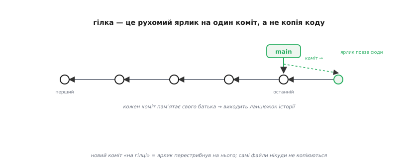
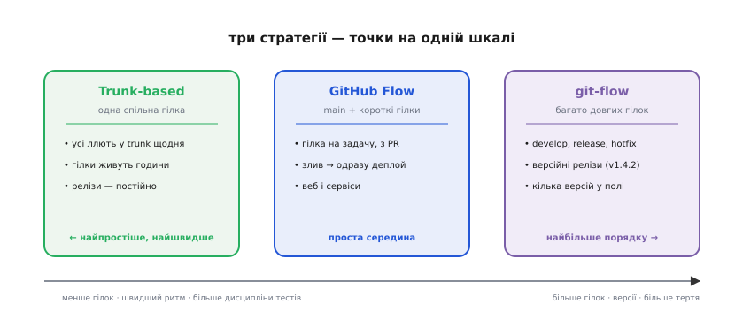
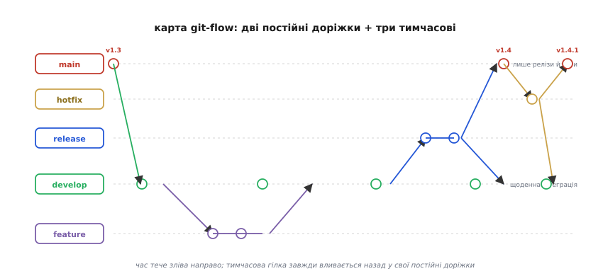
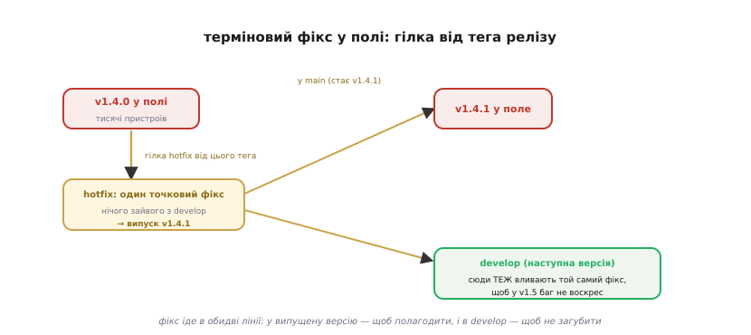

# Стратегії гілкування в git: trunk-based, GitHub Flow і git-flow

Прошивку ви вже навчилися перевіряти шарами — і налаштований раз набір тестів сам біжить [на кожну зміну коду](root:embedded/firmware-testing), ловлячи поломку за хвилини. Та лишилося питання, від якого та сітка безпеки й залежить: а **звідки** ці зміни беруться і **як** вони зливаються докупи, коли над прошивкою працює не одна людина, а троє, і кожен пише своє? Бо «зміна коду» — це не абстракція з повітря: це чиясь робота, що мусить якось потрапити в спільну гілку, не зламавши те, що там уже працює. Лад, за яким ця робота тече й зливається, і називають **стратегією гілкування**.

Чому це болить саме у вбудованих системах — видно з однієї дуже конкретної ситуації. Прошивка v1.4.0 уже залита в тисячу пристроїв у полі. Команда тим часом місяць пише велику нову можливість — код наполовину готовий, наполовину зламаний. І тут із поля приходить звіт: у v1.4.0 критичний баг, пристрої подеколи зависають. Полагодити треба **сьогодні** — але ви ж не можете залити людям те, що зараз у роботі: воно недороблене. Потрібен спосіб випустити **один точковий фікс** до тієї версії, що вже в полі, **не тягнучи** за собою все недоварене. Саме така потреба й народжує гілки — і саме тут найпопулярніша стратегія, git-flow, показує, навіщо вона взагалі є.

> 🔧 **Навіщо це.** Стратегія гілкування — не бюрократія заради порядку в репозиторії. Це відповідь на просте питання: коли горить у полі, ви можете швидко й безпечно випустити латку **рівно до тієї версії**, що в людей, — чи мусите або відкласти пожежу, або залити недороблене? Команда без узгодженого гілкування рано чи пізно опиняється перед цим вибором, і обидві відповіді погані.

## Що таке гілка насправді

Перш ніж порівнювати стратегії, варто зрозуміти, **що** ми ділимо. Інтуїція з файлів-копій («гілка — це окрема папка з кодом») тут оманлива й веде в хибний бік. Гілка в [git](topic:sf-release/version-control) майже нічого не важить, і зрозуміти **чому** — половина теми.

Уявіть історію проєкту як ланцюжок **комітів** (англ. *commit* — внесок, фіксація): кожен коміт — це знімок усього коду в певну мить, і кожен **пам'ятає свого батька** — попередній знімок. Зв'язок «дитина знає батька» і нанизує коміти в ланцюжок: від першого до останнього тягнеться вся історія, бо з будь-якого коміта можна піти назад до самого початку. А **гілка** — це лише **рухомий ярлик**, що вказує на один-єдиний коміт (зазвичай на останній). І все. Ім'я плюс адреса коміта — кілька десятків байтів.


*Коміти лежать ланцюжком — кожен знає свого батька, тож виходить уся історія. Гілка (тут main) — лише рухомий покажчик на один коміт. Зробив новий коміт «на гілці» — ярлик перестрибнув на нього; самі файли нікуди не копіюються.*

Звідси й випливає головне: **завести гілку — майже безкоштовно**, бо ви не копіюєте код, а лише ставите новий ярлик на наявний коміт. Коли ви робите коміт «перебуваючи на гілці», новий знімок чіпляється до ланцюжка, а ярлик гілки **переповзає** на нього. Дві гілки — це два ярлики, що з якогось спільного коміта розповзлися своїми ланцюжками. Саме тому в git гілками користуються вільно й часто, тоді як у старіших системах контролю версій гілкування було дорогою, рідкісною операцією — і там його боялися. Уся стратегія гілкування й тримається на цій дешевизні: якщо завести лінію роботи нічого не коштує, можна дозволити собі стільки окремих ліній, скільки потрібно для порядку.

## Справжнє питання: не «як завести», а «як злити назад»

Якщо гілку завести легко, то де ж складність? Вона не в розгалуженні, а в **сходженні**. Дві гілки рано чи пізно треба з'єднати — щоб робота з однієї потрапила в іншу. Це **злиття** (англ. *merge* — зливати): git бере зміни з обох ліній від точки їхнього розходження й намагається поєднати їх в один новий коміт.

Поки правки в різних місцях коду, git зводить їх сам. Але щойно дві гілки **по-різному змінили той самий рядок**, git не може вгадати, чию версію лишити, — це **конфлікт злиття** (англ. *merge conflict*), і розплутувати його доводиться людині руками. І ось ключове спостереження, на якому стоять усі стратегії: **що довше гілка живе окремо, то далі вона відповзає від спільної лінії — і то болючіше злиття**. Тиждень нарізно — кілька дрібних конфліктів. Місяць нарізно, поки сусіди переписали півпроєкту, — пекло злиття, де ви годинами зводите чужі правки зі своїми й боїтеся щось загубити.

Звідси два протилежні страхи, між якими й балансує кожна стратегія. З одного боку — **тримати все в одній лінії**: тоді злиття не болить (бо немає чого зливати), але недороблена робота одного одразу засмічує спільний код усім, і незрозуміло, що з нього взагалі можна випускати. З іншого боку — **розвести всіх по довгих окремих гілках**: тоді кожен спокійно робить своє, але злиття перетворюється на рідкісну криваву подію, а спільної правди про «де ми зараз» немає взагалі. Стратегія гілкування — це і є обраний компроміс між цими двома страхами.

## Три стратегії — точки на одній шкалі

Стратегій придумали багато, але майже всі лягають на одну шкалу: **скільки довгоживучих гілок ви тримаєте і як часто випускаєте**. На одному кінці — мінімум гілок і постійні релізи; на іншому — багато гілок і нечасті версійні випуски. Три імені покривають майже все поле.


*Стратегії — точки на шкалі «скільки довгих гілок проти якого ритму випуску». Ліворуч менше гілок і швидший ритм, але потрібна сувора дисципліна тестів; праворуч більше гілок і версій, але й більше тертя на злиттях.*

**Розробка стовбуром** (англ. *trunk-based development*) — ліворуч, найрадикальніша простота. Усі ллють свою роботу в одну спільну гілку — **стовбур** (англ. *trunk* — стовбур дерева, головна лінія) — щонайменше раз на день. Окремі гілки або не заводять зовсім, або вони живуть години. Логіка пряма: якщо вливатися щодня, гілки не встигають відповзти, і злиття майже не болить. Але за це треба платити **суворою дисципліною**: раз у стовбур постійно тече жива робота, його рятує лише той самий автоматичний набір тестів на кожен коміт — без нього спільна гілка миттю стає непридатною. Власне, безперервна інтеграція в строгому сенсі **і означає** розробку стовбуром: щодня зводити все докупи й тримати робочим автотестами. Незакінчену можливість при цьому ховають за **прапорцем** (англ. *feature flag* — вмикач можливості): код уже в стовбурі, але вимкнений, доки не дозрів.

**GitHub Flow** — проста середина. Є одна головна гілка (`main`), яка **завжди придатна до випуску**. Беретесь за задачу — заводите від `main` коротку гілку з промовистою назвою, робите свої кілька комітів, відкриваєте **запит на злиття** (англ. *pull request* — прохання забрати зміни) на огляд колегам, і після перевірки гілка вливається назад у `main` та зникає. Гілки тут короткі — дні, не місяці, — тож відповзти далеко не встигають. Цю модель 2011 року описав Скотт Чейкон (Scott Chacon), один зі співзасновників GitHub; вона лягає на сервіси та вебзастосунки, які **викочують щодня** й де «остання версія» — єдина, що існує.

**git-flow** — правий кінець, найбільше структури. Тут постійних гілок аж дві, а тимчасових — ще три типи, і кожна зі своїм призначенням. Це найскладніша з трьох, зате єдина, що з коробки відповідає на запитання з початку теми: як випускати латки до **версії, що вже в полі**, поки команда пише наступну. Саме тому в прошивках її згадують найчастіше — і саме її варто розібрати докладно.

## git-flow: дві постійні доріжки і три тимчасові

git-flow — це не команда git, а **угода** про те, які гілки заводити й коли їх зливати. Її 2010 року описав нідерландський інженер [Вінсент Дрізсен у замітці «A successful Git branching model»](root:embedded/gitflow-branching/hist-branching-models.md) — і за десятиліття вона стала чи не найвідомішою схемою гілкування взагалі. В основі — **дві гілки, що живуть вічно**, і **три типи тимчасових**, що відгалужуються й вливаються назад.

Дві постійні — це різні рівні готовності. `main` — священна лінія: на ній лежать **тільки випущені версії**, кожна позначена **тегом** (англ. *tag* — мітка; незмінний ярлик на конкретний коміт, на відміну від рухомої гілки). Подивившись на `main`, ви будь-якої миті бачите рівно те, що поїхало користувачам. `develop` — щоденна лінія інтеграції: сюди стікається вся готова робота й тут збирається **наступна** версія. `main` відстає від `develop` рівно на «ще не випущене».


*Дві постійні доріжки git-flow — main (лише релізи й теги) і develop (щоденна інтеграція) — і три тимчасові. Час тече зліва направо. Тимчасова гілка завжди відгалужується від своєї постійної й вливається назад: feature ↔ develop, release й hotfix — у main із тегом і назад у develop.*

Три тимчасові гілки покривають три різні події в житті проєкту:

**feature** — гілка під одну нову можливість. Відгалужується **від `develop`**, живе, поки можливість пишуть, і вливається **назад у `develop`**, коли та готова. Усе ризиковане й недороблене сидить тут, не чіпаючи спільну лінію; у `develop` потрапляє лише завершене. Це той самий принцип ізоляції роботи, що й у GitHub Flow, — просто гілки тут чіпляються до `develop`, а не до `main`.

**release** — гілка стабілізації перед випуском. Коли в `develop` назбиралося досить на нову версію, від неї відгалужують `release`. На цій гілці вже **не додають** нового — лише ловлять останні дрібні хиби, правлять номер версії, чистять. А головне — поки тут іде «передпольотна перевірка», `develop` **не стоїть**: команда вже може заводити feature-гілки для наступної версії. Дозріла `release` вливається у `main` (де її позначають тегом — це й є реліз) **і назад у `develop`**, щоб правки стабілізації не загубилися.

**hotfix** — і ось вона, відповідь на пожежу з початку теми. Це єдина гілка, що відгалужується **від `main`** — тобто **від уже випущеної версії**. Коли в полі горить, ви берете рівно той коміт, що в людей, кладете на нього **один точковий фікс** — і нічого зайвого з `develop`, де все недороблене, — і випускаєте латку. Потім, як і `release`, hotfix вливається у **дві** лінії: у `main` (нова латана версія для поля) **і** в `develop` (щоб у наступній версії баг не воскрес).

## Чому це особливо лягає на прошивку

Тепер варто з'єднати git-flow із тим, що відрізняє прошивку від вебсервісу, — бо саме ця відмінність і робить версійні гілки тут доречними, а не зайвими.

Вебсервіс має по суті **одну** живу версію: викотив нову — стара перестала існувати, відкотити можна за хвилину. Прошивка — навпаки. Залита у [фізичний пристрій](topic:sf-lang/firmware-image) версія живе там роками, оновлення доїжджає повільно (а часом і не доїжджає ніколи), і в полі **одночасно** працює багато різних версій: хтось на v1.2, хтось на v1.4, хтось іще на торішній v1.0. Тому версії прошивки — не формальність, а реальність: вони існують паралельно, і кожну треба вміти **окремо латати**.

Саме під цю реальність git-flow і скроєний. Тег `v1.4.0` на `main` — це не просто число: це точка, від якої можна відгалузити hotfix і випустити `v1.4.1` **рівно для тих**, хто на 1.4, не чіпаючи ані тих, хто на 1.2, ані недороблену 1.5 у `develop`. Розгляньмо ту саму пожежу до кінця.


*Версія v1.4.0 уже в тисячах пристроїв. Гілку hotfix відгалужують саме від її тега — не від develop, де все недороблене. Один точковий фікс → випуск v1.4.1 у поле. Той самий фікс іде в обидві лінії: у main (щоб полагодити випущене) і в develop (щоб у наступній версії баг не загубився).*

**Приклад (точковий фікс одним рядком).** Хай у v1.4.0 сторожовий таймер скидав пристрій, бо в одному з режимів цикл інколи не встигав його «погладити». Фікс — пересунути скидання таймера так, щоб воно гарантовано встигало. У гілці hotfix міняється буквально одне місце:

```c
// було (v1.4.0): таймер гладимо тільки в кінці циклу —
// у важкому режимі цикл затягувався й сторож скидав чіп
void main_loop(void) {
    while (1) {
        do_sensors();
        do_heavy_mode();   // інколи > періоду сторожа → reset
        watchdog_kick();   // не встигало
    }
}

// стало (v1.4.1, гілка hotfix): гладимо ще й усередині важкого кроку
void main_loop(void) {
    while (1) {
        do_sensors();
        watchdog_kick();   // гарантований дотик до сторожа
        do_heavy_mode();
        watchdog_kick();
    }
}
```

Один прицільний фікс, зібраний саме від коміта v1.4.0, дає v1.4.1 — і поле дістає рятунок уже сьогодні, тоді як півготова v1.5 спокійно дозріває собі в `develop`. Той самий фікс вливають і в `develop`, інакше в наступній версії хтось знову забере таймер у старе місце, і баг повернеться. А зібрати, підписати й розіслати цю v1.4.1 у поле — уже робота [механізму оновлення по повітрю](root:embedded/ota-server), куди гілка hotfix і віддає свій плід.

> 🔧 **Навіщо це.** Версійні теги на `main` — це не косметика, а **якорі для латання поля**. Маючи тег `v1.4.0`, ви будь-коли точно відтворите збірку, що в людей, відгалузите від неї фікс і випустите латку **рівно до неї**. Без такої дисципліни «латка для тих, хто на 1.4» перетворюється на археологію: де ж той код, що ми залили торік? Гілки й теги роблять кожну випущену версію назавжди досяжною для ремонту.

## Як обрати — і чому git-flow не завжди відповідь

Спокусливо взяти найскладнішу схему — мовляв, у ній «усе передбачено». Це помилка, і застеріг від неї **сам автор git-flow**: 2020 року Дрізсен дописав до своєї замітки, що для команд із безперервним викочуванням git-flow — радше тягар, ніж поміч, і там краще брати простіший потік на кшталт GitHub Flow. Універсальних ліків немає; стратегію диктує **природа того, що ви випускаєте**.

Орієнтир простий. Що ближче ваш продукт до вебсервісу — одна жива версія, миттєвий відкіт, викочування щодня, — то лівіше по шкалі: trunk-based або GitHub Flow, де порядок тримається не на гілках, а на дисципліні автотестів. Що більше у вас рис справжньої прошивки — багато версій паралельно в полі, повільне й рідкісне оновлення, потреба латати стару версію, поки пишеться нова, — то правіше, до git-flow з його `release` і `hotfix`. Маленький домашній проєкт на одну людину взагалі обійдеться однією гілкою: усі ці схеми народилися, щоб **узгоджувати кількох людей і кілька версій**, а де нема ні того, ні того, вони лише додають церемоній.

І остання, найважливіша думка, що зшиває цю тему з усім модулем про прошивку. Будь-яка стратегія гілкування **стоїть на тому самому фундаменті**, що й попередній крок: на автоматичних тестах, які біжать на кожне злиття. Гілки лише вирішують, **які** зміни й **коли** зіллються; а **чи безпечне** це злиття, скаже лише та сама сітка перевірок. Trunk-based без неї — самогубство (жива робота прямо в спільній лінії), git-flow без неї — ілюзія порядку (гарна мапа гілок, у кожній з яких може сидіти зламаний код). Тому гілкування — не заміна тестам, а **русло**, яким робота тече до них: добре обране русло робить злиття дрібними й частими, а отже — дешевими для перевірки. Виберіть найпростішу схему, що покриває ваші версії, тримайте гілки короткими, латайте поле від тегів — і спіть спокійно, бо за кожним злиттям стоїть зелений набір тестів.

---
