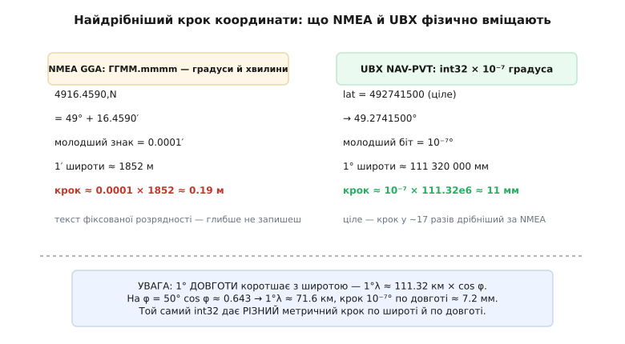
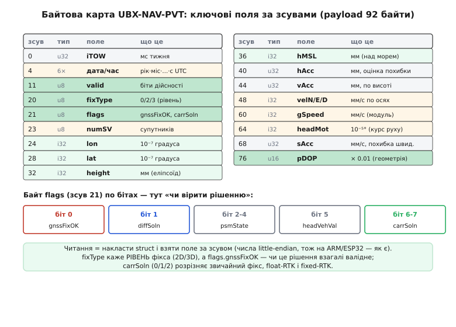
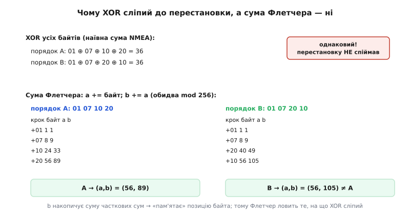
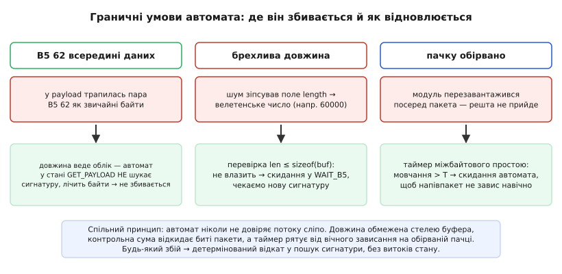

# GNSS-приймач у прошивці: NMEA і UBX — глибше

<preknowlist>
- [Супутникова навігація (GNSS)](topic:hw-sensing/gnss) — звідки береться фікс: час польоту сигналів, псевдодальності, розв'язання Δt приймача, чому геометрія супутників (DOP) керує точністю й чим модуль уразливий (глушіння, підміна).
- [UART-кадр](topic:com-devices/uart-frame) — як байт їде дротом: старт-біт, 8 біт даних молодшим уперед, парність, стоп-біт; що таке «бод» і скільки байтів за секунду дає задана швидкість.
- [Автомат розбору потоку](topic:com-protocol/stream-parser) — чому потік байтів без меж читають неблокуючим скінченним автоматом, що годується по одному байту й ніде не спиняє основний цикл.
- [Порядок байтів (endianness)](topic:sf-algorithms/bits-bytes-endianness) — що таке «молодший байт перший» (little-endian), як багатобайтове ціле лежить у пам'яті й чому це вирішує, чи можна читати поле «як є».
- [Доповняльний код і числа з фіксованою комою](topic:hw-arch/fixed-point) — як від'ємне ціле записане в бітах і як ціле «× 10⁻⁷» несе дробове значення без плаваючої коми.
- [Контрольні суми](topic:com-modulation/checksums) — навіщо до повідомлення додають кілька байтів контролю й чим одні схеми виявлення помилок сильніші за інші.
</preknowlist>

У базовому кроці ми провели межу: GNSS-модуль — чорна скринька, що всю фізику рахує сама, а прошивці віддає готове рішення звичайним UART-потоком; говорить він двома мовами — текстовою NMEA й двійковою UBX; читають обидві неблокуючим автоматом; по дроту RX модуль можна налаштувати. Цього досить, щоб «завести» модуль і побачити координати. Але за кожним із тих тверджень стоїть механіка, яку ми тоді свідомо проковтнули, — і саме в ній ховається різниця між драйвером, що працює на столі, і драйвером, що не завалить апарат у польоті. Тепер розкриймо цю механіку до дна: **скільки саме точності фізично вміщає кожен формат і чому**, **як улаштоване кожне поле аж до біта**, **чому двобайтова сума Флетчера ловить те, на що XOR сліпий**, **де саме автомат може збитися й що його рятує**, і **як насправді виглядає стартовий ритуал** — уже без спрощень.

## Скільки точності вміщає формат: числова анатомія координати

Ми казали, що NMEA «обмежена в точності», а UBX «дає сантиметри». Це не гасло — це прямий наслідок того, **яким числом** кожен формат записує широту й довготу. Полічімо межу обох на дотик, бо саме ці цифри пояснюють, чому серйозна прошивка не терпить текстового формату.

Почнімо з NMEA. Координату вона пише в успадкованому з мореплавства форматі «градуси й хвилини»: поле широти виглядає як `4916.4590` і читається `49° + 16.4590′`. Молодший записаний знак тут — чотири цифри після коми **у хвилинах**, тобто крок 0.0001 хвилини. Переведімо цей крок у метри:

```
1 хвилина широти = 1 морська миля ≈ 1852 м
молодший крок NMEA = 0.0001′
→ крок ≈ 0.0001 × 1852 ≈ 0.185 м ≈ 18.5 см
```

Вісімнадцять сантиметрів на молодший записаний знак — і це вже **фізична стеля текстового поля**: глибше воно просто не пише, бо форматом закладено чотири десяткові цифри у хвилинах. Для судна, якому досить знати місце з точністю до десятків метрів, цього з головою; для дрона, що сідає на майданчик, чи для геодезії з поправками RTK — ні. Формат несе в собі уявлення 1983 року про те, яка точність узагалі потрібна на воді, і жодним налаштуванням цю стелю не піднімеш.

Тепер UBX. Він пише широту й довготу **32-бітним цілим в одиницях 10⁻⁷ градуса** (це підтверджує офіційний інтерфейс-опис: поля `lat` і `lon` типу `I4`, scale `1e-7`, unit `deg`). Порахуймо крок молодшого біта, і тут потрібна точна довжина градуса, а не кругле «111 км». Меридіан WGS-84 дає для градуса широти приблизно:

```
екваторіальний радіус Землі ≈ 6 378 137 м
1° широти ≈ π/180 × 6 378 137 ≈ 111 320 м = 111 320 000 мм
молодший біт UBX = 10⁻⁷ градуса
→ крок ≈ 10⁻⁷ × 111 320 000 ≈ 11.1 мм
```

Одинадцять міліметрів проти вісімнадцяти сантиметрів — двійкове ціле дає крок приблизно у **17 разів дрібніший**, і це вже сантиметровий світ, у якому RTK має де розвернутися. Причина не в тому, що «двійкове точніше саме собою», а в тому, що ціле в чотирьох байтах несе розрядність, яку текстовий рядок фіксованого формату фізично не запише.


*Найдрібніший крок координати, який фізично вміщає кожен формат. Текстове поле NMEA обмежене чотирма цифрами у хвилинах — глибше не запишеш; двійкове ціле UBX кладе крок у ~17 разів дрібніший. А знизу — пастка, про яку мовчать обидва формати: один градус довготи не дорівнює одному градусу широти, він коротшає до полюсів як cos φ.*

Тут криється тонкість, на якій спотикаються, коли починають рахувати відстані з координат: **крок 10⁻⁷ градуса — різний у метрах для широти й для довготи**. Градус широти майже сталий по всій Землі (меридіани — кола однакового розміру). А градус **довготи** коротшає, що далі від екватора, бо паралелі стискаються до полюсів. Точний зв'язок — через косинус широти:

```
1° довготи ≈ 111 320 м × cos φ
на екваторі (φ = 0):   cos 0 = 1     → 1°λ ≈ 111.3 км, крок 10⁻⁷° ≈ 11.1 мм
на φ = 50°:            cos 50° ≈ 0.643 → 1°λ ≈ 71.6 км,  крок 10⁻⁷° ≈ 7.2 мм
на полюсі (φ = 90°):   cos 90° = 0    → 1°λ = 0,        усі довготи сходяться
```

Той самий `int32` дає **різний метричний крок** по двох осях, і драйвер, що конвертує координати у локальні метри (наприклад, щоб віддати їх у сітку планувальника шляху), мусить множити різницю довгот на `cos φ`, інакше на широті Києва отримає горизонтальний масштаб, розтягнутий у півтора раза. Це прямий місток до фізики, яку ми вже знаємо: [супутникова навігація](topic:hw-sensing/gnss) видає положення в кутових координатах на еліпсоїді, а не в метрах, і перехід між ними — не множення на константу.

> 🔧 **Навіщо це.** Коли бачиш у чужому коді «магічну» константу `111320` або ділення різниці довгот на косинус широти — це саме цей перехід від кутів до метрів. Помилка тут тиха й підступна: апарат літає, координати «правильні», але дистанції до вейпойнтів пораховані з розтягнутим горизонтальним масштабом, і він систематично недолітає або перелітає по довготі. Тому масштаб координат — це не деталь формату, а фізична величина, яку драйвер мусить рахувати чесно.

Ця числова анатомія стосується не лише координат. Кожне поле UBX має свій масштаб, і читати їх «як цілі» без перерахунку — типова пастка. Курс руху `headMot` записаний в одиницях 10⁻⁵ градуса, `pDOP` — в одиницях 0.01, швидкості — цілими в мм/с. Про повну карту цих полів — за мить; спершу закінчимо з тим, **як** число потрапляє в рядок NMEA, бо там теж не все просто.

## NMEA до кінця: граматика рядка й пастки розбору

Базово ми взяли одне речення GGA й перевірили його XOR-суму. Але реальний потік NMEA — це не одне речення, а пачка різних, і між ними є правила, які легко проґавити й отримати парсер, що тихо бреше.

Почнімо з точної **анатомії рядка**. Повне NMEA-речення має жорсткий каркас: символ `$` (початок), далі **п'ять символів заголовка** — два талкера й три формату, потім поля через кому, тоді `*`, дві шістнадцяткові цифри контрольної суми й завершення `<CR><LF>` (повернення каретки й перехід рядка). І тут перша важлива межа, яку варто пам'ятати: **усе речення обмежене 82 символами**, разом із `$` і завершальними `<CR><LF>`. Це не орієнтир, а частина стандарту NMEA 0183. Наслідок практичний: буфер приймача під один рядок може бути маленьким і фіксованим (скажімо, 90 байтів із запасом), а якщо байти йдуть, а `<LF>` усе не приходить після 82 символів — рядок битий або це взагалі не NMEA, і його треба відкинути, а не роздувати буфер безмежно.

Заголовок ділиться на дві частини з різним змістом. Перші два символи — **талкер** (*talker ID*), він каже, **хто** говорить: `GP` — розв'язок лише за GPS, `GL` — за ГЛОНАСС, `GA` — Galileo, `GB` — BeiDou, а `GN` — комбінований розв'язок за кількома сузір'ями разом. Наступні три — **формат** (*sentence formatter*), він каже, **що** за речення: `GGA`, `RMC`, `GSA`, `GSV`, `VTG` і так далі. Це розрізнення важить на практиці: якщо ти чекаєш на положення й фільтруєш рядки за підрядком `GGA`, то мусиш ловити його **незалежно від талкера** — і `$GPGGA`, і `$GNGGA` несуть положення. Порівнювати весь п'ятисимвольний заголовок — типова помилка, через яку драйвер «не бачить фікса» на модулі, що перемкнувся з `GP` на `GN`.

Тепер про пачку. Модуль зазвичай раз на цикл сипле кілька речень, і кожне несе свій шматок картини:

- **GGA** (*Global positioning system fix data*) — положення, висота, якість фікса, кількість супутників, HDOP. Головне речення для координат.
- **RMC** (*Recommended Minimum specific GNSS data*) — «мінімальний рекомендований»: широта, довгота, швидкість над землею, курс і **дата** в одному рядку. Часто його беруть як основне, бо в ньому є дата, якої немає в GGA.
- **GSA** (*GNSS DOP and active satellites*) — режим фікса (2D/3D) і всі три показники розмивання: PDOP, HDOP, VDOP.
- **GSV** (*GNSS satellites in view*) — які супутники видно, їхні азимут, висота над горизонтом і рівень сигналу. Це речення **багаточастинне**: супутників багато, в один рядок не влазять, тож GSV приходить пачкою з двох-трьох рядків із лічильником «рядок m з n».
- **VTG** (*Course over ground and ground speed*) — курс і швидкість.

Багаточастинність GSV — окрема пастка. Парсер, що читає кожен рядок незалежно, побачить `GSV` тричі й не зрозуміє, що це одне логічне повідомлення, розбите на частини; щоб зібрати повний список супутників, треба дивитися на два числа на початку речення — загальну кількість частин і номер поточної. Для нашого діла (положення) GSV не критичне, але якщо колись знадобиться показати «супутникове небо» — цю збірку доведеться робити.

Друга група пасток — **самі поля**. NMEA дозволяє **порожні поля**: якщо модуль не має значення (немає фікса — немає висоти), він лишає поле порожнім, і в рядку з'являються **дві коми поспіль** `,,`. Наївний розбір «розділи по комах і візьми поле номер k» тут ламається двічі. По-перше, порожнє поле легко сплутати з нулем: `,,` для висоти — це «невідомо», а не «0 метрів над морем». По-друге, деякі бібліотеки під час розбивання «склеюють» порожні поля, і нумерація полів З'ЇЖДЖАЄ — поле, яке ти читав як довготу, виявляється якістю фікса. Правильний розбір рахує коми **як роздільники позицій** і трактує порожнє поле як «немає значення», ніколи не як нуль.

Третя пастка — **локаль і формат чисел**. Число в рядку доводиться перетворювати з тексту (`strtol`, `atof`), а `atof` у деяких реалізаціях залежить від локалі системи: там, де десятковий роздільник — кома, `atof("30038.712")` може зупинитися на першій крапці або взагалі повернути не те. У прошивці цього зазвичай немає (там локаль «C»), але щойно той самий парсер переносять на настільний бік для розбору логів — сюрприз готовий. Надійний код або не покладається на локаль зовсім, або розбирає число вручну, знаючи, що роздільник у NMEA — завжди крапка.

І остання, найважливіша перевірка — **якість перед координатами**. У GGA поле якості фікса стоїть **до** полів широти й довготи не випадково: воно каже, чи взагалі можна брати те, що йде далі. Значення поля мають конкретний зміст: `0` — фікса немає (координати сміттєві), `1` — звичайний GPS-фікс, `2` — фікс із диференційними поправками (DGPS/SBAS), `4` — RTK з фіксованими цілими (сантиметри), `5` — RTK «плаваючий» (гірше за 4). Драйвер, що бере координати, не глянувши в це поле, рано чи пізно візьме нулі під час втрати сигналу й поведе апарат у точку `(0, 0)` посеред Гвінейської затоки. Це той самий урок валідації, що ми винесемо й для UBX: **прийшов рядок — ще не означає, що координати справжні**.

Хто хоче простежити, звідки взялися всі ці морські дивацтва — чому речення текстове, чому поля через кому, чому швидкість у вузлах, а талкерів десятки, — знайде корені в [історії двох мов GNSS](root:embedded/gnss-receiver-integration/hist-nmea-ublox.md): NMEA прийшла з капітанського містка 1983 року, де найслабшою ланкою був дешевий повільний прилад, а найдорожчою чеснотою — простота.

## UBX до біта: каркас, зсуви й прапорці NAV-PVT

Двійковий бік просимо розібрати з тією самою прискіпливістю. Каркас пакета UBX ми накреслили; тепер пройдімо його байт за байтом і глянемо, що робить кожне поле рамки:

```
0xB5 0x62 │ class │ id │ length (2, LE) │ payload (length байтів) │ CK_A │ CK_B
  2 байти     1     1        2                length                    2 байти
сигнатура   клас   ID    скільки даних      корисні дані          сума Флетчера
```

Кожен елемент має чітку роль. **Сигнатура `0xB5 0x62`** — це не «магія», а свідомо рідкісна пара байтів, за якою парсер упізнає початок пакета в сирому потоці. **Клас** — це група повідомлень (наприклад, `0x01` — навігаційні рішення `NAV`, `0x06` — конфігурація `CFG`, `0x05` — підтвердження `ACK`), а **ID** — конкретне повідомлення в групі. **Довжина** — два байти в порядку «молодший перший», і саме вона робить двійковий формат надійним: прочитавши ці два байти, парсер **точно знає**, скільки байтів даних читати далі, і не мусить шукати кінець за роздільником. У двійкових даних це критично: будь-який байт даних може випадково збігтися з будь-яким «роздільником», тож розділяти ними не можна взагалі — облік довжини єдиний надійний спосіб.

Тепер найкорисніше повідомлення — **NAV-PVT** (*Navigation Position-Velocity-Time*, клас `0x01`, ID `0x07`, payload рівно **92 байти**). Одне воно несе повну картину: час, положення, висоту, швидкість, курс, якість, оцінки похибок. Ось його реальна розкладка за офіційним інтерфейс-описом — саме ці зсуви й типи має відтворити структура в прошивці:


*Байтова карта NAV-PVT. Читання повідомлення — це накласти структуру на прийняті байти й узяти кожне поле за його зсувом. Ліворуч видно, що дата й час займають байти 4–10, статусні поля fixType і flags стоять на 20–21, а самі координати — на 24 і 28. Праворуч унизу розкладено критичний байт flags: саме його біти, а не сам факт приходу пакета, кажуть, чи можна довіряти рішенню.*

Кілька зсувів варто закарбувати, бо їх легко переплутати. Час зайнятий послідовно: `iTOW` (U4, зсув 0) — мілісекунди GPS-тижня; далі `year` (U2, зсув 4 — **два байти**, а не один!), `month`, `day`, `hour`, `min`, `sec` (по U1, зсуви 6–10). На зсуві 4 багато хто помилково кладе однобайтове поле — і вся структура з'їжджає на байт, а координати перетворюються на нісенітницю. Далі `valid` (X1, зсув 11) з бітами дійсності часу, потім оцінки часу, і на зсуві 20 — `fixType`, на 21 — `flags`. Координати: `lon` (I4, зсув 24), `lat` (I4, зсув 28), `height` над еліпсоїдом (I4, зсув 32, мм), `hMSL` над рівнем моря (I4, зсув 36, мм). Швидкості `velN/velE/velD` (I4, зсуви 48/52/56, мм/с), `gSpeed` — модуль горизонтальної швидкості (I4, зсув 60), `headMot` — курс руху (I4, зсув 64, масштаб 10⁻⁵°). Оцінки похибок `hAcc`, `vAcc`, `sAcc` — цілі в мм або мм/с, а `pDOP` (U2, зсув 76) — в одиницях 0.01.

Найважливіше поле для довіри — **`fixType` разом із `flags`**, і їх треба читати в парі. `fixType` каже **рівень** рішення: `0` — фікса немає, `2` — 2D (є положення, але не висота), `3` — повний 3D, `4` — GNSS плюс числення шляху (*dead reckoning*), `5` — лише час. Але сам по собі `fixType` ≥ 3 ще не гарантія: остаточне «чи можна вірити цьому рішенню» дає **біт `gnssFixOK`** (біт 0 байта `flags`). Офіційний опис прямо каже: `gnssFixOK = 1` означає «валідний фікс у межах масок точності й DOP», тобто модуль сам вирішив, що рішення проходить внутрішні пороги. Тому строге правило драйвера: брати координати, лише коли `fixType >= 3` **і** `gnssFixOK == 1`. Ще два біти того самого байта несуть тонший стан: `diffSoln` (біт 1) — застосовано диференційні поправки; `carrSoln` (біти 6–7) — стан фазового розв'язку: `0` немає, `1` «плаваючий» RTK, `2` «фіксований» RTK із цілими (сантиметри). Апарат, який хоче користатися RTK лише за фіксованого розв'язку, дивиться саме в `carrSoln == 2`.

Тепер про читання цих полів у C, і тут дві глибші пастки, які базова стаття лише згадала.

**Перша — порядок байтів.** Числа в UBX лежать little-endian (молодший байт перший). На ARM (STM32) і ESP32 процесор теж little-endian, тож структуру можна накласти на буфер і читати поле «як є» — байти вже в потрібному порядку. Але це **щастя платформи, а не властивість протоколу**. На big-endian машині (трапляється в мережевих чипах, деяких MIPS) те саме накладання дасть перевернуті числа: `lat` перетвориться на велетенське сміття. Портативний драйвер не покладається на збіг, а **збирає** число з байтів явно, зсувами, — тоді код читає однаково на будь-якій платформі. Ця залежність — прямий випадок того, що ми знаємо про [порядок байтів](topic:sf-algorithms/bits-bytes-endianness): багатобайтове ціле не має «природного» вигляду, поки не домовишся, який байт молодший.

**Друга — вирівнювання й пакування структури.** Спокуса оголосити структуру з усіма полями й накласти її на буфер (`*(ubx_nav_pvt_t*)buf`) зваблива, але небезпечна: компілятор за замовчуванням **вирівнює** поля й може вставити невидимі байти-заповнювачі між ними (наприклад, перед `I4`, щоб він ліг на межу чотирьох байтів). Тоді зсуви полів у структурі **перестануть збігатися** зі зсувами в пакеті, і `lat` прочитається з чужого місця. Рятунок — або сказати компілятору не вставляти заповнювачів (`#pragma pack` чи атрибут `packed`), або взагалі не накладати структуру, а діставати кожне поле функцією за явним зсувом. Другий шлях повільніший на пару інструкцій, зате переносний і застрахований від тихого зсуву. І окремо: накладання структури на буфер порушує правила псевдонімів типів (*strict aliasing*) у C — суворо кажучи, поле треба діставати через `memcpy` з байтового буфера, і саме так роблять акуратні драйвери. Оскільки числа тут ще й цілі з фіксованим масштабом (`lat × 10⁻⁷`), правильний перерахунок у градуси спирається на те, що ми знаємо про [числа з фіксованою комою](topic:hw-arch/fixed-point): ділити на `1e7` треба **у double**, бо `int32`, помножений назад, переповниться, а результат потрібен дробовий.

Робочий код повного драйвера — з переносним читанням полів, перевіркою пари `fixType`/`gnssFixOK` і перерахунком масштабів — винесено окремо, щоб не роздувати виклад; його розбираємо в [проєкті драйвера GNSS](root:embedded/gnss-receiver-integration/proj-ubx-driver.md), де зібрано автомат розбору, звірку суми на льоту й стартовий конфіг-ритуал у цілісний модуль прошивки.

## Чому Флетчер, а не XOR: доказ на пальцях

Базово ми сказали, що UBX рахує суму «8-бітним алгоритмом Флетчера», який «чутливіший до перестановки байтів». Це твердження заслуговує доказу, бо саме воно пояснює, чому двійковий формат не взяв простий XOR, як NMEA, а вклав два байти-акумулятори.

Спершу згадаймо, **чому XOR узагалі щось ловить**. Контрольна сума NMEA — це побітове виключне АБО всіх байтів між `$` і `*`. XOR має властивість: якщо в одному біті одного байта сталася помилка (0 став 1 чи навпаки), відповідний біт суми теж перевернеться, і перерахована сума не збіжиться з переданою. Тож одиничну бітову помилку XOR ловить безвідмовно. Але в XOR є фатальна сліпа пляма — **він не залежить від порядку**. Операція комутативна й асоціативна: `a ⊕ b ⊕ c` дорівнює `c ⊕ b ⊕ a`. Отже, якщо два байти в дорозі **помінялися місцями** (а таке буває — збій у буфері, зсув на такт), XOR цього **не помітить узагалі**, бо сума тих самих байтів у будь-якому порядку однакова.

Ось цей провал наочно. Візьмімо чотири байти й порахуймо XOR для двох порядків — оригінального й з переставленими двома останніми:

```
порядок A: 01 ⊕ 07 ⊕ 10 ⊕ 20 = 36
порядок B: 01 ⊕ 07 ⊕ 20 ⊕ 10 = 36     ← та сама сума!
```

XOR каже «однаково» — перестановку він проґавив. Для морського NMEA на 4800 бод це терпіли: помилки там частіше псували окремі символи, а не переставляли їх, та й ціна пропущеної помилки була невисока. Для двійкового потоку, де порядок байтів несе весь зміст (переставив два байти `int32` — і координата стрибнула на кілометри), така сліпота неприйнятна.

**Сума Флетчера** латає саме цю діру, і робить це навдивовижу дешево — двома байтами-акумуляторами `a` і `b`, що йдуть по всіх байтах від `class` до кінця даних:

```
для кожного байта:
    a = (a + байт)  mod 256     // накопичує суму самих байтів
    b = (b + a)     mod 256     // накопичує суму часткових сум
```

Хитрість — у другому рядку. `a` — це проста сума (теж, до речі, залежна від значень, але не від порядку). А `b` додає **поточне** значення `a` на кожному кроці, тобто накопичує **суму часткових сум**. І ось тут порядок починає важити: ранній байт входить у `a` рано й тому додається до `b` **багато разів** (на кожному наступному кроці), а пізній байт — лише кілька разів. Фактично кожен байт входить у `b` з **вагою, що залежить від його позиції**. Переставиш два байти — зміняться їхні ваги в `b`, і фінальне `b` вийде іншим. `b` «пам'ятає», де стояв байт.

Проженімо той самий приклад через Флетчера для обох порядків:

```
порядок A: 01 07 10 20
  +01 → a=1,  b=1
  +07 → a=8,  b=9
  +10 → a=24, b=33
  +20 → a=56, b=89      → (a,b) = (56, 89)

порядок B: 01 07 20 10   (переставили останні два)
  +01 → a=1,  b=1
  +07 → a=8,  b=9
  +20 → a=40, b=49
  +10 → a=56, b=105     → (a,b) = (56, 105)
```

`a` збіглося (56 = 56) — сама сума байтів від порядку не залежить. А **`b` розійшлося** (89 ≠ 105) — Флетчер спіймав перестановку, на яку XOR був сліпий. Ось уся суть: другий акумулятор ловить те, що перший (і XOR) проґавлює.


*Чому UBX узяв два байти замість одного. XOR комутативний — тим самим байтам у будь-якому порядку він дає ту саму суму, тож перестановку не помічає. Сума Флетчера накопичує другим акумулятором суму часткових сум, тому кожен байт входить у неї з вагою за позицією; переставиш байти — b зміниться. Один зайвий рядок коду закриває цілий клас помилок.*

Варто чесно окреслити й **межі** Флетчера, щоб не переоцінити його. Він сильніший за XOR, але слабший за повноцінний [циклічний надлишковий код (CRC)](topic:com-modulation/checksums): існують комбінації помилок, які Флетчер пропускає (наприклад, певні пари змін, що компенсують одна одну за модулем 256). UBX обрав Флетчера як розумний компроміс — він у рази дешевший за CRC на маленькому мікроконтролері (два додавання на байт, жодних таблиць чи зсувів), а ловить переважну більшість реальних збоїв UART, зокрема перестановки. Для транспорту «модуль на платі, кілька сантиметрів дроту» цього досить; там, де канал справді ворожий (радіоміст), поверх UBX кладуть ще один шар із CRC. Тобто вибір суми — теж інженерний компроміс «сила проти ціни», а не «чим складніше, тим краще».

Тонкість реалізації, що економить пам'ять: суму **не конче рахувати наприкінці над зібраним буфером**. Оскільки Флетчер накопичувальний, `a` і `b` можна оновлювати **на льоту**, просто в автоматі розбору, — кожен прийнятий байт `class..payload` одразу підмішуємо в акумулятори. Тоді коли надійдуть два байти переданої суми, лишається порівняти їх із уже готовими `a` і `b`, і окремий буфер під увесь пакет для перерахунку не потрібен. Це той самий прийом інкрементальної контрольної суми, що й у загальному [автоматі розбору потоку](topic:com-protocol/stream-parser).

## Де автомат збивається і що його рятує

Неблокуючий автомат ми накреслили: чекай сигнатуру → читай class/id → читай довжину → набирай дані → звіряй суму → віддавай пакет. На чистому потоці цього досить. Але реальний UART брудний: байти губляться, приходять уривками з буфера, модуль перезавантажується посеред пакета, шум псує окремі байти. Драйвер, що цього не передбачив, зависає або починає тихо видавати сміття. Розберімо три граничні умови, які **мусить** пережити будь-який серйозний парсер, і чому в кожній рятує саме конструкція автомата.


*Автомат ніколи не довіряє потоку сліпо. Якщо пара B5 62 трапилась усередині даних — облік довжини не дає її сплутати з початком пакета; якщо шум зробив довжину велетенською — перевірка стелі буфера відкидає пакет; якщо пачку обірвано — таймер міжбайтового простою рятує від вічного зависання. Будь-який збій веде в один детермінований стан: пошук сигнатури.*

**Пастка перша: сигнатура всередині даних.** Що, якщо байти `0xB5 0x62` випадково трапляться посеред корисних даних якогось пакета — скажімо, у полі `hAcc` виявиться таке значення? Наївний парсер, що постійно «виглядає» сигнатуру, кинеться розбирати фальшивий пакет із середини справжнього. Рятує саме **облік довжини**: коли автомат у стані «набираю дані» (`GET_PAYLOAD`), він **не шукає сигнатуру взагалі** — він лічить рівно `length` байтів у буфер, хоч би що в них було, зокрема й `0xB5 0x62`. Пара сигнатурних байтів має значення **лише** у стані очікування; усередині даних вона — звичайні байти. Ось чому облік довжини не просто зручний, а необхідний для коректності: без нього двійковий потік у принципі не розбереш надійно.

**Пастка друга: брехлива довжина.** Шум зіпсував два байти поля `length`, і замість реальних 92 автомат прочитав, скажімо, 60000. Якщо сліпо повірити, він спробує набрати 60 тисяч байтів у буфер, розрахований на 128, — і **переповнить буфер**, затерши сусідню пам'ять (класична вразливість переповнення буфера, через яку падають і зламуються прошивки). Рятунок простий і обов'язковий: **перевірка стелі** одразу після читання довжини — `if (len > sizeof(buf)) { скидання в WAIT_B5; }`. Не влазить у буфер — це не наш пакет (або биті дані), відкидаємо й чекаємо нову сигнатуру. Один рядок перевірки закриває цілий клас аварій. У коді базового кроку ця перевірка вже стоїть (`st = (len <= sizeof buf) ? GET_PAYLOAD : WAIT_B5`) — тепер видно, **чому** вона там не косметична, а несуча.

**Пастка третя: обірвана пачка.** Модуль почав слати пакет, устиг віддати сигнатуру, class, id, довжину — і тут перезавантажився (просіла напруга, збій живлення). Решта пакета **не прийде ніколи**. Автомат застряг у стані `GET_PAYLOAD`, чекаючи байтів, яких немає, і **зависне назавжди**, а з ним — оновлення положення. Тут облік довжини вже не рятує (байти просто не течуть). Рятує **таймер міжбайтового простою**: драйвер засікає час від останнього прийнятого байта, і якщо в незавершеному пакеті настала тиша довша за поріг (скажімо, кілька мілісекунд — на 115200 бод пакет із 92 байтів іде менш ніж 10 мс), автомат **примусово скидається** в пошук сигнатури. Напівпакет не зависає, а тихо викидається, і за наступну повну сигнатуру драйвер синхронізується наново. Це вже не про формат, а про **живучість** драйвера в часі: реальне залізо збоїть, і автомат мусить уміти відновитися сам, без перезапуску прошивки.

Спільний принцип усіх трьох: **автомат ніколи не довіряє потоку сліпо й завжди має детермінований шлях назад**. Довжина обмежена стелею буфера, контрольна сума відкидає биті пакети, таймер рятує від вічного очікування. Будь-який збій — не той байт, не та сума, обірвана пачка — веде в один і той самий стан `WAIT_B5`, без витоків стану й без напівзаповнених буферів, що просочуються в наступний пакет. Саме ця дисципліна «збій → чистий відкат» відрізняє драйвер, що витримує години польоту, від того, що розсипається на першому просіданні живлення.

Є ще одна практична деталь **входу** в автомат, про яку варто сказати. Байти з UART зазвичай приходять не по одному в зручний момент, а пачками через [DMA](root:embedded/dma-spi-i2s) чи кільцевий буфер у перерванні: залізо складає прийняте у пам'ять саме, а прошивку сповіщає, коли назбирався шматок. Автомат від цього не змінюється — він однаково годується **по одному байту**, просто драйвер у циклі згодовує йому весь наявний шматок буфера за раз. Головне, чого не можна робити, — це те, від чого застерігала базова стаття: не можна «зачекати цілий пакет» у циклі, спинивши керування. Автомат тим і добрий, що переживає будь-яке дроблення потоку: прийшло три байти — з'їв три й повернувся; прийшло сорок — з'їв сорок. Стан живе між викликами, і пакет збирається впродовж скількох завгодно перерувань, ніде не блокуючи політний цикл.

## Наказати модулю по-справжньому: два покоління конфіг-інтерфейсу

Досі, як і базово, розмова була переважно на слух. Але дріт RX веде в модуль, і стартовий ритуал налаштування — це те, без чого модуль лишиться на заводських NMEA + 1 Гц, і чужий апарат «бачитиме супутники, але позиція смикатиметься раз на секунду». Базово ми перелічили, що треба зробити (підняти швидкість, вимкнути NMEA, увімкнути NAV-PVT, задати темп, обрати сузір'я). Тепер — **як** це виглядає насправді, і тут ховається важлива глибша правда: **конфіг-інтерфейс u-blox змінився між поколіннями модулів**, і драйвер мусить знати, з ким говорить.

**Старий інтерфейс (u-blox 8 / M8 і раніше)** — це набір **окремих CFG-повідомлень**, кожне під свою підсистему:

- **CFG-PRT** (*port*) — налаштування порту: яка швидкість UART, які протоколи на вході й виході. Саме ним піднімають швидкість із 9600 на 115200.
- **CFG-MSG** (*message*) — як часто видавати конкретне повідомлення на конкретному порту. Ним вимикають кожне NMEA-речення (ставлять темп 0) і вмикають NAV-PVT (ставлять темп 1 — раз на навігаційний цикл).
- **CFG-RATE** (*rate*) — темп навігаційних розв'язків: `measRate` (період вимірювання в мс) і `navRate`. Ставлять `measRate = 100` для 10 Гц.
- **CFG-GNSS** — які сузір'я вмикати (GPS, Galileo, ГЛОНАСС, BeiDou) і скільки каналів під кожне.

**Новий інтерфейс (u-blox 9 / M9 / M10)** відмовився від цього зоопарку окремих повідомлень і ввів **єдину ключ-значення систему**: `CFG-VALSET` (задати), `CFG-VALGET` (прочитати), `CFG-VALDEL` (видалити). Це підтверджує офіційний інтерфейс-опис M10, де саме VALSET/VALGET/VALDEL — головний спосіб конфігурації, а старі окремі CFG-повідомлення на цих модулях уже не діють. Кожен параметр тепер має **32-бітний ключ** (наприклад, `CFG-UART1-BAUDRATE`, `CFG-MSGOUT-UBX_NAV_PVT_UART1`, `CFG-RATE-MEAS`), і одним `CFG-VALSET` можна задати одразу пачку пар «ключ = значення». Понад те, з'явилися **шари конфігурації**: `RAM` (діє зараз, зникає з живленням), `BBR` (резервна пам'ять із батарейкою) і `Flash` (незмінна). Один `CFG-VALSET` може записати значення в потрібні шари — скажімо, і в `RAM` (щоб подіяло негайно), і у `Flash` (щоб пережило перезапуск).

Наслідок для драйвера прямий: **універсальний драйвер спершу впізнає модуль** (наприклад, опитавши версію повідомленням `MON-VER`) і залежно від покоління шле або старі CFG-PRT/MSG/RATE/GNSS, або нові CFG-VALSET із ключами. Код, написаний під M8, мовчки нічого не налаштує на M10 (модуль відповість `ACK-NAK` на невідомі повідомлення), і навпаки. Це типова причина, чому «той самий драйвер працював, а на новому модулі перестав».

Незалежно від покоління, три речі лишаються спільними, і кожна — окрема пастка.

**Порядок і швидкість.** Найтонше місце — **зміна швидкості UART**. Якщо драйвер наказав модулю перейти на 115200 бод, то далі він **сам мусить говорити на 115200** — інакше зв'язок обірветься на півслові, бо модуль уже слухає на новій швидкості, а прошивка ще шле на старій. Правильна послідовність: надіслати команду зміни швидкості на **старій** швидкості → переналаштувати власний UART на нову → усі подальші команди слати вже на новій. Помилка тут дає «модуль замовк після налаштування», і новачок винуватить залізо.

**Підтвердження, а не постріл наосліп.** Кожну CFG-команду не можна слати й забувати: модуль відповідає **UBX-ACK-ACK** (клас `0x05`, ID `0x01`) на прийняту команду й **UBX-ACK-NAK** (клас `0x05`, ID `0x00`) на відкинуту. Драйвер має **дочекатися** ACK з таймаутом, і якщо його немає (або прийшов NAK) — вважати крок невдалим і повторити чи стати в помилку. Це той самий принцип «дочекайся підтвердження», що ми бачили в [командах MAVLink](root:embedded/mavlink-commands): критичну зміну стану підтверджують, а не сподіваються, що вона дійшла.

**Збереження в пам'ять.** Щоб після перезапуску не налаштовувати все наново, зміну зберігають у незмінну пам'ять модуля: на старому інтерфейсі — повідомленням **CFG-CFG** (клас `0x06`, ID `0x09`, «clear/save/load»), на новому — записом у шар `Flash` через `CFG-VALSET`. Без цього кожен старт — це повний ритуал заново, зайві секунди до першого валідного фікса.


*Стартовий ритуал драйвера як послідовність підтверджуваних кроків. Кожна CFG-команда — не «вистрелив і забув»: модуль відповідає ACK-ACK на прийняту або ACK-NAK на відкинуту, і драйвер чекає підтвердження з таймаутом. Найтонше місце позначено окремо — після зміни швидкості весь подальший діалог іде вже на новій швидкості, інакше зв'язок обривається. На M9/M10 ці концептуальні кроки виконує один-два CFG-VALSET із ключами й шарами RAM/Flash.*

> 🔧 **Навіщо це.** Коли чужий апарат «бачить супутники, але позиція оновлюється раз на секунду й смикається» — причина майже завжди тут, у конфігурації, а не в залізі: модуль лишили на заводських NMEA + 1 Гц. І дуже часта версія тієї самої біди — драйвер під старий M8, застосований до нового M9/M10: він шле CFG-PRT/MSG, модуль відповідає суцільним NAK, налаштування не застосовується, і модуль так і сипле заводський текст. Тому серйозний драйвер GNSS **сам** переналаштовує модуль під себе на старті, впізнавши покоління, чекає на кожен ACK і зберігає результат — а не сподівається на заводські значення.

Повний робочий модуль стартового налаштування — з упізнанням покоління, послідовністю команд, коректною зміною швидкості й очікуванням ACK із таймаутом і ретраями — зібрано в тому самому [проєкті драйвера GNSS](root:embedded/gnss-receiver-integration/proj-ubx-driver.md), поряд з автоматом розбору.

## Здоров'я фікса й місце в контурі: чому «прийшов пакет» ≠ «є положення»

Останнє, що варто поглибити, — доля координат **після** розбору. Базово ми сказали: драйвер перевіряє якість фікса й віддає положення оцінювачу стану. Тепер розгорнімо, **що саме** перевіряти й **як** координати вплітаються в контур, бо тут — межа між надійним апаратом і заручником першого-ліпшого збою сигналу.

Валідність фікса — це **кон'юнкція кількох умов**, а не одна галочка. Строгий драйвер бере координати з NAV-PVT, лише коли справджуються всі:

- **`fixType >= 3`** — є повне 3D-рішення (для наземного апарата іноді досить 2D, для повітряного — ні, бо без висоти).
- **`gnssFixOK == 1`** — сам модуль підтвердив, що рішення в межах його масок точності й DOP.
- **`numSV` не замалий** — розв'язок на трьох-чотирьох супутниках крихкий; розумний поріг — шість-сім і більше, бо надлишок супутників дає модулю змогу відкинути хибні виміри.
- **`pDOP` не завеликий** — геометрія супутників прийнятна. Показник розмивання (*dilution of precision*) множить похибку відстаней на геометричний коефіцієнт: коли супутники скупчені в одній ділянці неба (у дворі-колодязі видно лише вузьку смугу), `pDOP` злітає, і навіть за формально валідного фікса реальна похибка положення в рази більша. Поріг на кшталт `pDOP < 3` відсіює найгіршу геометрію.
- **`hAcc` у межах** — модуль сам оцінює горизонтальну похибку в мм; якщо вона більша за прийнятне для задачі (скажімо, метри там, де треба сантиметри), координати формально є, але для точної посадки не годяться.

Чому так строго? Бо GNSS вразливий, і ми знаємо це з фізики: [глушіння](topic:hw-sensing/gnss) заливає діапазон шумом (модуль або втратить фікс, або, гірше, видасть хибний із високим `pDOP`), підміна тихо веде в хибне місце (тут `gnssFixOK` може лишатися `1` — це окрема, складніша загроза), а міські каньйони псують геометрію. Драйвер, що бере будь-які координати «бо пакет прийшов», зробить апарат сліпим до всіх цих збоїв. Тому валідний фікс — це не «прийшов валідний за сумою пакет», а «прийшов пакет **і** сукупність його полів якості каже, що координатам можна вірити». Байти на UART — лише транспорт; **довіру** до положення прошивка вирішує сама, зважуючи `fixType`, `gnssFixOK`, `numSV`, `pDOP` і `hAcc` разом.

Друга частина долі координат — **свіжість у часі**. Навіть валідний фікс старіє: якщо NAV-PVT перестали приходити (модуль завис, дріт відпав, антену заступило), останнє відоме положення з кожною секундою дедалі менш правдиве. Тому драйвер тримає **позначку часу останнього валідного фікса** й позначає дані «протухлими» (*stale*), якщо свіжого пакета немає довше за поріг. Оцінювач стану має знати не лише «де ми», а й «наскільки свіже це де» — інакше він довірятиме мертвим координатам.

І тут координати нарешті вливаються в загальний контур — у **[поєднання давачів](topic:com-signal/sensor-fusion)**. Логіка злиття прямо спирається на властивості GNSS, які ми тепер розуміємо в деталях. GNSS дає **абсолютне** положення (прив'язку до Землі), але **повільно** (навіть 10 Гц — це рідко проти контуру керування на сотнях-тисячах герц) і з **затримкою** (модуль рахує рішення не миттєво). IMU (гіроскоп плюс акселерометр) — навпаки: **швидко** (тисячі вимірів за секунду) й **без затримки**, але **відносно** й зі **спливанням** (інтеграл похибки накопичується, і без зовнішньої прив'язки оцінка положення пливе). Оцінювач (фільтр Калмана) поєднує їх за частотами: між рідкими фіксами GNSS він **інтегрує** швидкий IMU, а коли надходить свіжий валідний фікс — **підтягує** накопичену оцінку до абсолютної істини, гасячи спливання. Саме тому свіжість і якість фікса критичні: протухлий чи хибний фікс, підсунутий у цей момент корекції, не виправить спливання, а вкине в оцінку викид, від якого апарат сіпнеться. Транспорт віддав байти; тепер над ними стоїть уся ланка «розбір → перевірка якості → перевірка свіжості → зважене злиття», і кожна її ланка спирається на те, що ми розібрали в цьому кроці.

## Підсумок: від байтів до довіри

Базовий крок дав карту; цей крок пройшов її до дна. Ми полічили, що NMEA у градусах-хвилинах фізично впирається у крок близько 18 см, а UBX цілим × 10⁻⁷° дає крок близько 11 мм, — і побачили, що той самий крок означає різну відстань по широті й по довготі, бо градус довготи коротшає як `cos φ`. Ми розібрали NMEA до граматики рядка (82 символи, талкер проти формату, багаточастинний GSV, порожні поля як `,,`, локаль, якість перед координатами) і UBX до біта (92-байтовий NAV-PVT, точні зсуви з `year` як двобайтовим полем, пара `fixType`/`gnssFixOK`, `carrSoln` для RTK, пастки порядку байтів і пакування структури). Ми довели на прогоні, чому XOR сліпий до перестановки, а два акумулятори Флетчера її ловлять — і чесно окреслили, що Флетчер слабший за CRC, зате дешевший. Ми пройшли три граничні умови автомата (сигнатура в даних, брехлива довжина, обірвана пачка) і побачили, що кожну рятує конкретна риса конструкції — облік довжини, перевірка стелі буфера, таймер простою, — а будь-який збій веде в один чистий стан. Ми розкрили стартовий ритуал уже без спрощень: два покоління конфіг-інтерфейсу (окремі CFG-повідомлення проти ключ-значення VALSET із шарами RAM/BBR/Flash), критичний порядок зміни швидкості, очікування ACK-ACK/NAK, збереження у Flash. І ми довели ланку до кінця — від валідності фікса як кон'юнкції `fixType`, `gnssFixOK`, `numSV`, `pDOP`, `hAcc`, через свіжість у часі, до зваженого злиття з IMU в оцінювачі. Червона нитка та сама, що й у базовому кроці, лише тепер видно кожне її волокно: **модуль рахує положення; прошивка розбирає байти, перевіряє їхню правдивість і свіжість — і лише тоді впускає координати в те, як апарат відчуває себе у світі**.
