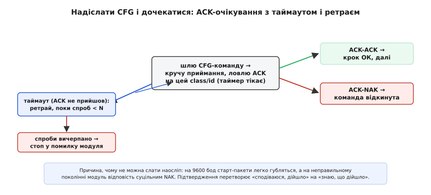

# ⚙️ Драйвер GNSS у прошивці: цілісний UBX-модуль

Ми вже розібрали кожну частину поодинці — неблокуючий автомат, суму Флетчера, зсуви полів NAV-PVT, два покоління конфіг-інтерфейсу, ворота здоров'я фікса. Кожна з тих частин жила у власному фрагменті коду, ізольовано. Але між «зрозумів кожен шматок» і «маю драйвер, що не завалить апарат за три години польоту» лежить те, чого окремі фрагменти не показують: **як вони зшиваються в один модуль, де стан одного шматка переживає між викликами іншого, де збій у будь-якій ланці не валить сусідні, і де ховаються пастки, видимі лише коли все працює разом**. Зберімо тепер повний робочий драйвер — такий, який справді кладуть у прошивку політного контролера, — і на кожній пастці зупинимося прямо в коментарі коду.

## Задача: один модуль, що переживає брудний потік і брудне залізо

Сформулюймо чесно, що драйвер мусить робити, бо саме з вимог випливе його форма.

Він приймає **сирий потік байтів** з UART — по одному в перерванні або пачками з DMA, у будь-який момент, дробленими як завгодно. Він **ніде не блокує** керуючий цикл: жодного `while (немає байта);`, жодного очікування цілого пакета — бо кожна мілісекунда паузи для дрона в повітрі може бути фатальною. Він **сам** приводить модуль у робочий режим на старті (UBX-only, потрібний темп, усі сузір'я), упізнавши, з яким **поколінням** заліза говорить. Він **переживає збої**: биті байти, брехливі довжини, обірвані посеред пакета пачки, перезавантаження модуля — і завжди має чистий шлях назад у синхронізацію. І він **не віддає нагору жодної координати, поки не переконався**, що фіксу можна вірити й що він свіжий.

Ключове слово тут — **стан, що живе між викликами**. Автомат розбору не може щоразу починати з нуля: пакет приходить упродовж багатьох перерувань, і між ними його напівзібраний стан мусить зберігатися. Сума Флетчера копиться байт за байтом і теж переживає між викликами. Очікування ACK триває, поки крутиться приймання інших повідомлень. Свіжість фікса вимірюється відносно часу останнього валідного пакета. Драйвер — це не функція, а **машина зі станом**, і саме тому його природна форма — модуль із власними статичними полями, а не купка вільних функцій.

## Ідея: конвеєр шарів, кожен зі своєю відповідальністю

Замість монолітної «функції, що все робить», зберімо драйвер як **конвеєр**, де кожен шар має рівно одну роботу й нічого не знає про нутрощі сусідів. Це не естетика — це живучість: коли шар декодування зіпсується на кривому пакеті, він не має змоги затерти буфер приймача чи збити конфіг-логіку, бо просто не має до них доступу.


*Драйвер не як одна функція, а як конвеєр шарів. Знизу вгору: перервання складає прийняте в кільцевий буфер; цикл згодовує байти автомату (сума Флетчера копиться на льоту); декодер дістає кожне поле NAV-PVT за його зсувом через memcpy; ворота здоров'я пускають далі лише валідний і свіжий фікс. Ліворуч — окремий канал старту: по дроту RX драйвер упізнає покоління модуля й надсилає конфіг, чекаючи на кожен ACK. Довіру до координат дає тільки верхній шар — усе нижче лише транспорт.*

Пройдімо шари знизу вгору, кожен — робочим кодом.

## Спільний фундамент: константи протоколу

Перш ніж писати логіку, закладімо словник протоколу — усі магічні числа в одному місці, з іменами, щоб далі жодне `0x07` не висіло в коді без пояснення. Ці значення я звірив з офіційним інтерфейс-описом u-blox та з бойовими драйверами PX4 і SparkFun — вони точні.

```c
#include <stdint.h>
#include <stdbool.h>
#include <string.h>   // memcpy

// ── Каркас UBX ────────────────────────────────────────────────────────────
#define UBX_SYNC1   0xB5      // перший сигнатурний байт
#define UBX_SYNC2   0x62      // другий сигнатурний байт

// Класи повідомлень
#define UBX_CLS_NAV  0x01     // навігаційні рішення
#define UBX_CLS_ACK  0x05     // підтвердження
#define UBX_CLS_CFG  0x06     // конфігурація
#define UBX_CLS_MON  0x0A     // моніторинг (версія тощо)

// ID у своїх класах
#define UBX_NAV_PVT     0x07  // Position-Velocity-Time
#define UBX_ACK_ACK     0x01  // команду прийнято
#define UBX_ACK_NAK     0x00  // команду відкинуто
#define UBX_MON_VER     0x04  // версія прошивки/заліза
#define UBX_CFG_VALSET  0x8A  // задати конфіг (Gen9+: M9/M10)
#define UBX_CFG_PRT     0x00  // порт (легасі, M8)
#define UBX_CFG_MSG     0x01  // темп повідомлення (легасі)
#define UBX_CFG_RATE    0x08  // темп навігації (легасі)
#define UBX_CFG_GNSS    0x3E  // вибір сузір'їв (легасі)
#define UBX_CFG_CFG     0x09  // зберегти/завантажити конфіг (легасі)

// Зсуви ключових полів у payload NAV-PVT (payload = 92 байти).
// Саме ці зсуви — з офіційного інтерфейс-опису; переплутати = читати сміття.
#define PVT_iTOW      0   // u32, мс GPS-тижня
#define PVT_year      4   // u16 — ДВА байти, не один!
#define PVT_fixType  20   // u8  0=нема, 2=2D, 3=3D
#define PVT_flags    21   // u8  біт0 gnssFixOK, біти6-7 carrSoln
#define PVT_numSV    23   // u8  супутників у розв'язку
#define PVT_lon      24   // i32 × 1e-7 градуса
#define PVT_lat      28   // i32 × 1e-7 градуса
#define PVT_height   32   // i32 мм над еліпсоїдом
#define PVT_hMSL     36   // i32 мм над рівнем моря
#define PVT_hAcc     40   // u32 мм, оцінка горизонтальної похибки
#define PVT_gSpeed   60   // i32 мм/с, модуль горизонтальної швидкості
#define PVT_headMot  64   // i32 × 1e-5 градуса, курс руху
#define PVT_pDOP     76   // u16 × 0.01, геометричне розмивання

#define PVT_PAYLOAD_LEN  92
#define UBX_BUF_MAX     128   // стеля буфера payload — більше не буває в потрібних нам повідомленнях
```

> 🔧 **Навіщо це.** Один блок констант — це не «чистота заради чистоти». Коли за півроку доведеться додати читання ще одного поля (скажімо, `velN` на зсуві 48), ти правиш один рядок, а не полюєш по всьому коду за розкиданими `0x…`. І головне: помилка в зсуві `PVT_year` (два байти замість одного) зсуне всю подальшу структуру й перетворить координати на нісенітницю — тримати ці числа в одному впорядкованому місці з коментарем «ДВА байти» рятує від найпідступнішого класу помилок цього драйвера.

## Шар 1: приймання без блокування

Найнижчий шар — місток між залізом UART і рештою драйвера. Залізо складає прийняті байти у **кільцевий буфер** (щоб швидкий потік не губився, поки основний цикл зайнятий іншим), а драйвер у зручний момент вичерпує накопичене.

Тут головна дисципліна: перервання має бути **коротким**. Воно робить рівно одне — кладе байт у кільце й посуває вказівник. Уся розумна робота (розбір, декодування) — уже поза перерванням, у головному циклі. Якщо запхати розбір у перервання, довгий обробник заблокує інші перервання й розхитає весь тайминг апарата.

```c
// Кільцевий буфер прийому: перервання пише, головний цикл читає.
// Розмір — степінь двійки, щоб маскувати індекс дешевим &, а не %.
#define RX_RING  512
static volatile uint8_t rx_ring[RX_RING];
static volatile uint16_t rx_head;   // куди пише ISR
static uint16_t          rx_tail;   // звідки читає цикл (не volatile: чіпає лише цикл)

// Викликається з перервання UART на кожен прийнятий байт. МУСИТЬ бути коротким.
void gnss_uart_isr(uint8_t byte) {
    uint16_t next = (rx_head + 1) & (RX_RING - 1);
    if (next != rx_tail) {          // є місце?
        rx_ring[rx_head] = byte;
        rx_head = next;
    }
    // Кільце повне — байт відкидаємо. Це не катастрофа: наступний валідний
    // пакет пересинхронізує автомат. Гірше було б заблокуватися чи зациклитись.
}
```

Пастка, яку легко проґавити: `rx_head` **обов'язково** `volatile`, бо його змінює перервання, а читає цикл, і без `volatile` компілятор може закешувати старе значення в регістрі й «не побачити» нових байтів. А `rx_tail` — навпаки, чіпає лише цикл, тож volatile йому шкідливий (зайві перечитування з пам'яті). Ця асиметрична дисципліна volatile — типове місце тонких помилок у драйверах з перерваннями.

Байти з кільця драйвер вичерпує в головному циклі, згодовуючи їх автомату розбору по одному:

```c
// Викликається з головного циклу якомога частіше. Вичерпує кільце,
// не блокуючи: скільки байтів є — стільки й з'їдає, і повертається.
void gnss_poll(uint32_t now_ms) {
    while (rx_tail != rx_head) {
        uint8_t b = rx_ring[rx_tail];
        rx_tail = (rx_tail + 1) & (RX_RING - 1);
        ubx_feed(b, now_ms);        // згодувати автомату один байт
    }
    ubx_check_idle(now_ms);         // таймер міжбайтового простою (нижче)
}
```

Помітно: `gnss_poll` не чекає ні на що. Прийшло три байти — з'їв три й вийшов; прийшло сорок — з'їв сорок. Керуючий цикл викликає його між своїми справами, і драйвер жодного разу не спиняє апарат. `now_ms` — поточний час у мілісекундах (від системного таймера); він потрібен нижнім шарам для таймерів простою й свіжості.

## Шар 2: автомат розбору із сумою Флетчера на льоту

Це серце драйвера. Автомат приймає по байту, посувається станами каркаса UBX і, коли зібрав валідний пакет, кличе обробник. Ключова оптимізація проти базового начерку: **сума Флетчера рахується інкрементально**, прямо в автоматі, — кожен байт `class..payload` одразу підмішується в акумулятори. Тоді коли надійдуть два байти переданої суми, лишається порівняти їх із уже готовими `ck_a`, `ck_b`, і окремий прохід по буферу не потрібен. Це той самий прийом інкрементальної контрольної суми, що й у загальному [автоматі розбору потоку](root:com-protocol/stream-parser): скінченний автомат годується по одному байту, ніде не спиняє основний цикл, а суму нарощує на льоту разом із прийомом.

```c
// Стани автомата — прямо з каркаса пакета UBX.
enum ubx_state {
    UST_SYNC1, UST_SYNC2, UST_CLASS, UST_ID,
    UST_LEN1,  UST_LEN2,  UST_PAYLOAD, UST_CKA, UST_CKB
};

// Увесь стан парсера — статичний, переживає між викликами gnss_poll.
static struct {
    enum ubx_state state;
    uint8_t  msg_class, msg_id;
    uint16_t len, idx;          // очікувана довжина payload та скільки вже набрано
    uint8_t  buf[UBX_BUF_MAX];  // payload
    uint8_t  ck_a, ck_b;        // сума Флетчера, копиться на льоту
    uint8_t  rx_cka;            // прийнятий CK_A (звіряємо з обчисленим)
    uint32_t last_byte_ms;      // час останнього байта — для таймера простою
} P;

// Підмішати один байт у суму Флетчера (той самий алгоритм, що звіряє UBX).
static inline void ck_step(uint8_t b) {
    P.ck_a += b;                // накопичує суму байтів
    P.ck_b += P.ck_a;          // накопичує суму часткових сум (обидва mod 256 самі)
}

static void ubx_reset(void) {   // єдиний чистий шлях назад у синхронізацію
    P.state = UST_SYNC1;
    P.ck_a = P.ck_b = 0;
    P.idx = 0;
}

// Годуємо по одному байту. Коли зібрано валідний пакет — кличемо ubx_dispatch.
void ubx_feed(uint8_t b, uint32_t now_ms) {
    P.last_byte_ms = now_ms;    // будь-який байт освіжає таймер простою

    switch (P.state) {
    case UST_SYNC1:
        if (b == UBX_SYNC1) P.state = UST_SYNC2;
        break;                   // поки не побачили B5 — крутимося тут

    case UST_SYNC2:
        // Тонкість: якщо після B5 прийшов не 62, а знову B5 — це може бути
        // початок СПРАВЖНЬОЇ сигнатури; лишаємось у SYNC2, не падаємо в SYNC1.
        if (b == UBX_SYNC2)      P.state = UST_CLASS;
        else if (b != UBX_SYNC1) P.state = UST_SYNC1;
        break;

    case UST_CLASS:
        P.msg_class = b;
        P.ck_a = P.ck_b = 0;    // сума рахується від class — обнуляємо саме тут
        ck_step(b);
        P.state = UST_ID;
        break;

    case UST_ID:
        P.msg_id = b; ck_step(b);
        P.state = UST_LEN1;
        break;

    case UST_LEN1:
        P.len = b; ck_step(b);
        P.state = UST_LEN2;
        break;

    case UST_LEN2:
        P.len |= (uint16_t)b << 8;   // little-endian: старший байт довжини
        ck_step(b);
        P.idx = 0;
        // КРИТИЧНА перевірка стелі: брехлива довжина від шуму не сміє
        // переповнити buf. Не влазить — це не наш пакет, назад у пошук.
        if (P.len == 0)               P.state = UST_CKA;         // порожній payload
        else if (P.len <= UBX_BUF_MAX) P.state = UST_PAYLOAD;
        else                          ubx_reset();               // задовга — відкидаємо
        break;

    case UST_PAYLOAD:
        P.buf[P.idx++] = b; ck_step(b);
        if (P.idx >= P.len) P.state = UST_CKA;   // набрали рівно len байтів
        break;                                    // тут сигнатуру НЕ шукаємо — лічимо байти

    case UST_CKA:
        P.rx_cka = b;           // прийнятий CK_A запам'ятали, чекаємо CK_B
        P.state = UST_CKB;
        break;

    case UST_CKB:
        // Обчислені ck_a/ck_b уже готові (копилися на льоту). Звіряємо.
        if (P.rx_cka == P.ck_a && b == P.ck_b) {
            ubx_dispatch(P.msg_class, P.msg_id, P.buf, P.len);  // валідний пакет!
        }
        ubx_reset();            // хай там як — назад у чистий стан
        break;
    }
}
```

Три речі варто підкреслити, бо саме вони роблять цей автомат живучим, а не просто робочим.

**Перше — облік довжини як захист коректності.** У стані `UST_PAYLOAD` автомат **не шукає сигнатуру взагалі** — він лічить рівно `P.len` байтів, хоч би що в них було, зокрема й випадкову пару `B5 62` посеред даних. Пара сигнатурних байтів має значення лише у станах очікування; усередині payload вона — звичайні байти. Без обліку довжини двійковий потік у принципі не розібрати надійно.

**Друге — перевірка стелі буфера.** Рядок `else if (P.len <= UBX_BUF_MAX)` — не косметика. Якби шум зіпсував два байти довжини й автомат прочитав, скажімо, 60000, то без цієї перевірки він спробував би набрати 60 тисяч байтів у 128-байтовий `buf` і затер би сусідню пам'ять — класичне переповнення буфера, через яке падають і зламуються прошивки. Один рядок закриває цілий клас аварій.

**Третє — єдиний чистий вихід.** Будь-який збій — не та сума, задовга довжина, обірвана пачка — веде в `ubx_reset()`, який обнуляє стан, суму й лічильник. Немає жодного шляху, де напівзаповнений буфер чи недорахована сума просочилися б у наступний пакет. Ця дисципліна «збій → чистий відкат» і є різниця між драйвером, що витримує години польоту, і тим, що розсипається на першому просіданні живлення.

Лишився таймер простою — рятунок від обірваної пачки. Якщо модуль перезавантажився посеред пакета, решта байтів не прийде ніколи, і автомат застрягне в `UST_PAYLOAD`, чекаючи на те, чого немає. Тут облік довжини вже не поможе (байти просто не течуть) — рятує час:

```c
// Викликається з gnss_poll щоразу. Якщо ми посеред пакета, а байтів
// немає довше за поріг — примусово синхронізуємось наново.
#define UBX_IDLE_MS  20   // на 115200 бод пакет із 92 байтів іде <10 мс; 20 — із запасом

static void ubx_check_idle(uint32_t now_ms) {
    if (P.state != UST_SYNC1 &&
        (uint32_t)(now_ms - P.last_byte_ms) > UBX_IDLE_MS) {
        ubx_reset();        // напівпакет протух — викидаємо, не зависаємо
    }
}
```

Зверни увагу на `(uint32_t)(now_ms - P.last_byte_ms)` — віднімання беззнакових із приведенням коректно працює навіть тоді, коли лічильник мілісекунд **переповнюється** (раз на ~49 діб для 32-бітного). Наївне `now_ms > P.last_byte_ms + UBX_IDLE_MS` зламалося б на переповненні; беззнакова різниця — ні. Це стандартний прийом роботи з таймерами в прошивці, і забути його — джерело багів, що вилазять раз на пів- місяця роботи.

## Шар 3: переносне декодування NAV-PVT

Автомат зібрав валідний пакет і передав `class/id/buf/len` у `ubx_dispatch`. Тепер треба дістати з `buf` осмислені поля. Базово ми накладали структуру на буфер — і чесно назвали дві пастки: **порядок байтів** і **пакування/вирівнювання структури**, плюс порушення правил псевдонімів типів (*strict aliasing*). Тут напишемо декодування **переносно**: кожне поле дістаємо явно за його зсувом через `memcpy`, який не порушує aliasing і не залежить від пакування.

```c
// Дістати багатобайтове ціле з payload за зсувом, у нативний порядок.
// memcpy НЕ порушує strict aliasing і не залежить від пакування структури.
// Ці читання коректні на LE-платформі (ARM/ESP32). Для повної переносності
// на BE тут була б перестановка байтів — але цільове залізо LE, тож memcpy як є.
static inline uint32_t rd_u32(const uint8_t *b, int off) {
    uint32_t v; memcpy(&v, b + off, 4); return v;
}
static inline int32_t  rd_i32(const uint8_t *b, int off) {
    int32_t v;  memcpy(&v, b + off, 4); return v;
}
static inline uint16_t rd_u16(const uint8_t *b, int off) {
    uint16_t v; memcpy(&v, b + off, 2); return v;
}

// Готовий, уже перерахований і перевірений фікс — саме це віддаємо нагору.
typedef struct {
    double   lat_deg, lon_deg;   // градуси (з int32 × 1e-7)
    double   alt_m;              // метри над рівнем моря
    double   speed_mps;          // м/с (з мм/с)
    double   head_deg;           // курс руху, градуси (з int32 × 1e-5)
    float    hacc_m;             // оцінка горизонтальної похибки, метри
    float    pdop;               // геометричне розмивання (з u16 × 0.01)
    uint8_t  fix_type;           // 0/2/3
    uint8_t  num_sv;
    bool     gnss_fix_ok;
    uint32_t itow_ms;
    uint32_t stamp_ms;           // коли ЦЕЙ фікс прийняв драйвер (для свіжості)
} gnss_fix_t;

// Розібрати сирий payload NAV-PVT у зручні одиниці. Перерахунок масштабів — тут.
static void decode_pvt(const uint8_t *b, uint32_t now_ms, gnss_fix_t *f) {
    f->itow_ms  = rd_u32(b, PVT_iTOW);
    f->fix_type = b[PVT_fixType];
    f->num_sv   = b[PVT_numSV];
    f->gnss_fix_ok = (b[PVT_flags] & 0x01) != 0;   // біт0 байта flags

    // Координати: int32 × 1e-7 → градуси. ДІЛИТИ у double: int32,
    // помножений назад, переповнився б, а результат потрібен дробовий.
    f->lat_deg = (double)rd_i32(b, PVT_lat) * 1e-7;
    f->lon_deg = (double)rd_i32(b, PVT_lon) * 1e-7;
    f->alt_m   = (double)rd_i32(b, PVT_hMSL) / 1000.0;   // мм → м  (див. fixed-point нижче)

    f->speed_mps = (double)rd_i32(b, PVT_gSpeed) / 1000.0;   // мм/с → м/с
    f->head_deg  = (double)rd_i32(b, PVT_headMot) * 1e-5;    // × 1e-5 градуса
    f->hacc_m    = (float)rd_u32(b, PVT_hAcc) / 1000.0f;     // мм → м
    f->pdop      = (float)rd_u16(b, PVT_pDOP) * 0.01f;       // × 0.01

    f->stamp_ms  = now_ms;   // позначка часу прийому — база для перевірки свіжості
}
```

Читаються ці поля коректно тому, що числа в UBX лежать молодшим байтом уперед, а цільове ядро (ARM, ESP32) теж little-endian, — байти вже в потрібному порядку; на протилежному [порядку байтів](root:sf-algorithms/bits-bytes-endianness) тут була б потрібна явна перестановка. Чому саме `memcpy`, а не `*(uint32_t*)(b + off)`? Пряме приведення вказівника й розіменування — це подвійне порушення. По-перше, **вирівнювання**: `b + 24` може не лежати на межі чотирьох байтів, і на деяких ядрах (Cortex-M0 без апаратної підтримки невирівняного доступу) таке читання дає **hard fault** — прошивка просто падає. По-друге, **strict aliasing**: стандарт C забороняє читати байтовий буфер через вказівник іншого типу, і компілятор з увімкненою оптимізацією має право згенерувати код, що робить не те, що ти думав. `memcpy` вільний від обох гріхів: він копіює байти незалежно від вирівнювання, і компілятор чудово розпізнає й **вставляє** його вбудовано (на практиці — те саме одне-два інструкції завантаження, коли адреса вирівняна), тож ціна нульова. Акуратні драйвери GNSS роблять саме так. А перерахунок масштабів спирається на те, що цілі тут — [числа з фіксованою комою](root:hw-arch/fixed-point): `lat` в одиницях 10⁻⁷ градуса несе дробове значення без плаваючої коми, і повернути його в градуси можна лише діленням у `double`, бо `int32`, помножений назад, переповниться.

> 🔧 **Навіщо це.** Ти пишеш драйвер на STM32 (little-endian, Cortex-M4 з невирівняним доступом) — і накладання структури «просто працює». Через рік той самий код переносять на дешевший Cortex-M0+ чи компілюють з агресивнішою оптимізацією — і драйвер починає падати в hard fault або тихо видавати сміттєві координати. `memcpy`-декодування коштує рівно нуль на швидкому ядрі, зате не має цих мін узагалі. Це той випадок, коли «переносно» не абстрактна чеснота, а страховка від багів, які інакше вилізуть у найгірший момент.

## Шар 4: ворота здоров'я й свіжості

`ubx_dispatch` викликає `decode_pvt`, дістаючи зручний `gnss_fix_t`. Але **розібраний ще не означає довірений**. Останній шар — ворота, що пускають координати нагору лише тоді, коли сукупність полів каже: фіксу можна вірити, і він свіжий.

Валідність — це **кон'юнкція** кількох умов, а не одна галочка. Кожна відсіює свій клас брехні:

```c
// Пороги довіри — виведені окремо, бо залежать від задачі апарата.
#define FIX_MIN_SV     6      // менше — розв'язок крихкий, легко впіймати хибний вимір
#define FIX_MAX_PDOP   3.0f   // більше — геометрія погана (каньйон, вузька смуга неба)
#define FIX_MAX_HACC   10.0f  // м; для точної посадки поставили б менше
#define FIX_STALE_MS   500    // фікс старший за це вважаємо протухлим

// Чи можна ВЗЯТИ цей фікс: усі умови мусять справдитися разом.
static bool fix_is_healthy(const gnss_fix_t *f) {
    if (f->fix_type < 3)          return false;  // нема повного 3D
    if (!f->gnss_fix_ok)          return false;  // модуль сам НЕ підтвердив рішення
    if (f->num_sv  < FIX_MIN_SV)  return false;  // замало супутників
    if (f->pdop    > FIX_MAX_PDOP) return false; // геометрія погана
    if (f->hacc_m  > FIX_MAX_HACC) return false; // оцінена похибка завелика
    return true;
}

// Останній валідний фікс — сюди складає dispatch, звідси бере оцінювач.
static gnss_fix_t g_last_fix;
static bool       g_have_fix;

void ubx_dispatch(uint8_t cls, uint8_t id, const uint8_t *buf, uint16_t len) {
    // Спершу — конфіг-квитанції (їх чекає стартовий ритуал, шар нижче).
    if (cls == UBX_CLS_ACK && (id == UBX_ACK_ACK || id == UBX_ACK_NAK)) {
        cfg_on_ack(id == UBX_ACK_ACK, buf, len);   // передати очікувачу ACK
        return;
    }
    // Наше корисне повідомлення.
    if (cls == UBX_CLS_NAV && id == UBX_NAV_PVT && len == PVT_PAYLOAD_LEN) {
        gnss_fix_t f;
        decode_pvt(buf, P.last_byte_ms, &f);
        if (fix_is_healthy(&f)) {          // ворота: лише довірене йде далі
            g_last_fix = f;
            g_have_fix = true;
        }
        // Нездоровий фікс НЕ затираємо g_last_fix — хай оцінювач бачить
        // останній ДОБРИЙ, поки не протух, а не свіже сміття.
    }
    // Інші повідомлення (MON-VER тощо) обробляє стартовий ритуал за потреби.
}

// Оцінювач стану питає драйвер: «дай свіжий валідний фікс». Повертає false,
// якщо фікса нема або він протух — тоді оцінювач числить по IMU далі.
bool gnss_get_fix(uint32_t now_ms, gnss_fix_t *out) {
    if (!g_have_fix) return false;
    if ((uint32_t)(now_ms - g_last_fix.stamp_ms) > FIX_STALE_MS) {
        return false;               // фікс застарів — не віддаємо як свіжий
    }
    *out = g_last_fix;
    return true;
}
```

Дві тонкощі цього шару варті окремого слова.

**Свіжість — окрема від валідності перевірка.** Навіть бездоганний фікс старіє: якщо NAV-PVT перестали приходити (антену заступило, дріт відпав, модуль завис), останнє відоме положення з кожною секундою дедалі менш правдиве. `gnss_get_fix` тому дивиться на `stamp_ms` і відмовляє, якщо свіжого пакета немає довше за поріг. Оцінювач мусить знати не лише «де ми», а й «наскільки свіже це де» — інакше він довірятиме мертвим координатам і не переходитиме вчасно на числення по IMU. Саме звідси `gnss_fix_t` бере готовий вхід у [поєднання давачів](root:com-signal/sensor-fusion): фільтр між рідкими фіксами інтегрує швидкий IMU, а свіжий валідний фікс підтягує накопичену оцінку до абсолютної істини — тож протухлий чи хибний фікс, підсунутий у мить корекції, не виправив би спливання, а вкинув би у стан викид.

**Нездоровий фікс не затирає добрий.** Коли приходить пакет з поганою геометрією чи без `gnssFixOK`, ми **не** пишемо його в `g_last_fix`. Логіка тонка: краще віддати оцінювачу останній *добрий* фікс, поки він не протух за таймером, ніж підсунути свіже, але сміттєве значення. Свіжість і валідність працюють у парі — старий добрий фікс живе рівно до порога протухання, а потім драйвер чесно каже «немає».

Чому ворота такі строгі? Бо GNSS вразливий, і ми знаємо це з фізики. Глушіння заливає діапазон шумом — модуль або втратить фікс, або видасть хибний із роздутим `pDOP`. Міський каньйон лишає видимою вузьку смугу неба — геометрія псується, і навіть за формально валідного фікса реальна похибка в рази більша. Драйвер, що бере будь-які координати «бо пакет прийшов», зробить апарат заручником першого-ліпшого збою сигналу. Тому валідний фікс — це не «прийшов валідний за сумою пакет», а «прийшов пакет **і** сукупність його полів якості каже, що координатам можна вірити».

## Стартовий ритуал: упізнати покоління й налаштувати

Досі все було про **слухання**. Тепер — про дріт RX, яким драйвер сам приводить модуль у робочий режим. Без цього модуль лишиться на заводських NMEA + 1 Гц, і апарат «бачитиме супутники, але позиція смикатиметься раз на секунду».

Тут головна глибша правда: **конфіг-інтерфейс u-blox змінився між поколіннями**. Модулі M8 і раніше налаштовують набором окремих CFG-повідомлень (CFG-PRT для порту, CFG-MSG для темпу повідомлень, CFG-RATE для темпу навігації, CFG-GNSS для сузір'їв). Модулі M9/M10 відмовилися від цього зоопарку й ввели єдину систему «ключ-значення»: один `CFG-VALSET` задає пачку пар «32-бітний ключ = значення» одразу, ще й у вибрані шари пам'яті (RAM — діє зараз, Flash — переживає перезапуск). Драйвер під M8, застосований до M10, отримає суцільний NAK на невідомі повідомлення — і нічого не налаштує. Тому універсальний драйвер **спершу впізнає модуль**.

Почнімо зі спільного інструмента — складання й надсилання будь-якого UBX-пакета з правильною сумою. Той самий Флетчер, що звіряє вхідні пакети, тепер рахуємо для вихідних — це один із класу [контрольних сум](root:com-modulation/checksums), дешевший за CRC, зате чутливий до перестановки байтів, чого XOR не вміє:

```c
// Зовнішня функція платформи: віддати n байтів у UART модуля.
extern void uart_write(const uint8_t *data, uint16_t n);

// Скласти UBX-пакет (сигнатура, class/id, len, payload, сума) і відіслати.
static void ubx_send(uint8_t cls, uint8_t id, const uint8_t *payload, uint16_t len) {
    uint8_t hdr[6] = { UBX_SYNC1, UBX_SYNC2, cls, id,
                       (uint8_t)(len & 0xFF), (uint8_t)(len >> 8) };
    // Сума Флетчера — від class (hdr[2]) до кінця payload.
    uint8_t a = 0, b = 0;
    for (int i = 2; i < 6; i++) { a += hdr[i]; b += a; }
    for (uint16_t i = 0; i < len; i++) { a += payload[i]; b += a; }

    uart_write(hdr, 6);
    if (len) uart_write(payload, len);
    uint8_t ck[2] = { a, b };
    uart_write(ck, 2);
}
```

Тепер — очікування ACK, без якого конфіг перетворюється на постріл наосліп. Це той самий принцип «дочекайся підтвердження», що ми бачили в [командах MAVLink](root:embedded/mavlink-commands): критичну зміну стану підтверджують квитанцією, а не сподіваються, що вона дійшла. Кожну CFG-команду треба **дочекатися**: модуль відповідає `ACK-ACK` на прийняту й `ACK-NAK` на відкинуту. Драйвер шле команду й крутить приймання, шукаючи квитанцію саме на цей `class/id`, поки не збіжить таймаут; якщо ACK немає — ретрай, а вичерпав спроби — помилка.


*Чому конфіг — не «вистрелив і забув». Драйвер надсилає CFG-команду й крутить приймання, шукаючи квитанцію саме на її class/id, поки тікає таймер. ACK-ACK — крок пройдено, йдемо далі; ACK-NAK — команду відкинуто (часто ознака, що покоління вгадано хибно); таймаут — ретрай, поки лічильник спроб не вичерпано, а тоді чесна помилка модуля. Підтвердження перетворює «сподіваюся, дійшло» на «знаю, що дійшло».*

```c
// Стан очікувача ACK — заповнюється dispatch'ем, читається ритуалом.
static struct {
    bool    waiting;         // чи ми зараз чекаємо ACK
    uint8_t want_cls, want_id;  // на яку саме команду
    bool    got, ok;         // прийшла квитанція? і яка — ACK(true)/NAK(false)
} A;

// dispatch кличе це, отримавши ACK-ACK або ACK-NAK. payload квитанції несе
// class+id команди, яку вона підтверджує (2 байти) — звіряємо, що це «наша».
static void cfg_on_ack(bool is_ack, const uint8_t *buf, uint16_t len) {
    if (!A.waiting || len < 2) return;
    if (buf[0] == A.want_cls && buf[1] == A.want_id) {
        A.got = true;
        A.ok  = is_ack;
    }
}

// Зовнішні функції платформи: час і згодовування вхідних байтів під час чекання.
extern uint32_t millis(void);

// Надіслати команду й ДОЧЕКАТИСЯ її ACK. Повертає true, якщо ACK-ACK.
// Не блокує апарат надовго: у циклі чекання крутить gnss_poll, тож автомат
// живе, а таймаут обмежує чекання зверху.
static bool ubx_send_await(uint8_t cls, uint8_t id,
                           const uint8_t *payload, uint16_t len,
                           uint32_t timeout_ms, int retries) {
    for (int attempt = 0; attempt <= retries; attempt++) {
        A.waiting = true; A.got = false; A.ok = false;
        A.want_cls = cls; A.want_id = id;

        ubx_send(cls, id, payload, len);      // послали команду

        uint32_t t0 = millis();
        while ((uint32_t)(millis() - t0) < timeout_ms) {
            gnss_poll(millis());              // крутимо приймання — ACK прийде сюди
            if (A.got) {
                A.waiting = false;
                if (A.ok) return true;        // ACK-ACK — крок удався
                break;                        // ACK-NAK — ретраїти нема сенсу, вийти
            }
        }
        A.waiting = false;
        if (A.got && !A.ok) return false;     // явний NAK — не ретраїмо
        // інакше таймаут — пробуємо ще раз (наступна ітерація attempt)
    }
    return false;   // спроби вичерпано — крок провалено
}
```

Цикл `while` тут не порушує принципу неблокування фатально: він обмежений `timeout_ms` зверху й **усередині крутить `gnss_poll`**, тож автомат живе, а ACK приходить звичайним шляхом через `dispatch`. Стартовий ритуал виконується **один раз** на ініціалізації, коли апарат ще на землі й нікуди не летить, — тут коротке очікування прийнятне, на відміну від польотного циклу, де його не можна допустити.

Тепер саме впізнання й розгалуження. Драйвер питає версію `MON-VER`, з відповіді витягує покоління й обирає гілку налаштування:

```c
typedef enum { GEN_UNKNOWN, GEN_M8, GEN_M9_M10 } ubx_gen_t;
static ubx_gen_t g_gen;

// MON-VER повертає ASCII-рядки; серед розширень є "PROTVER=xx.yy".
// Протокол ≥ 27 → покоління M9/M10 (ключ-значення); менше → M8 (легасі CFG).
// (Спрощено: у бойовому коді ще й ловлять MOD=... з назвою модуля.)
static void detect_from_monver(const uint8_t *buf, uint16_t len) {
    for (uint16_t i = 0; i + 8 <= len; i++) {
        if (memcmp(buf + i, "PROTVER=", 8) == 0) {
            int major = 0;
            for (uint16_t j = i + 8; j < len && buf[j] >= '0' && buf[j] <= '9'; j++)
                major = major * 10 + (buf[j] - '0');
            g_gen = (major >= 27) ? GEN_M9_M10 : GEN_M8;
            return;
        }
    }
}
```

Далі — дві гілки конфігурації. **Нова (M9/M10)** будує один `CFG-VALSET`: заголовок (версія 0, шар, два резервні байти), тоді пари «ключ + значення». Ширину значення підказує сам ключ — поле бітів 28-30 у ньому кодує розмір, і кодує **не числом байтів**: `0x1`→1 біт (у пакеті — 1 байт), `0x2`→1 байт, `0x3`→2 байти, `0x4`→4 байти, `0x5`→8 байтів. Тобто ключ `0x2091…` (темп PVT) несе один байт, а `0x3021…` (темпи вимірювання й навігації) — по два; сплутати цю таблицю означає записати кожне значення не тієї ширини й **зсунути весь потік «ключ-значення»**, після чого модуль не второпає жодної пари:

```c
// Ключі конфігурації M9/M10 (32-бітні; біти 28-30 = код розміру значення).
#define KEY_UART1_BAUD     0x40520001u   // U4: швидкість UART1
#define KEY_MSGOUT_PVT     0x20910007u   // U1: темп NAV-PVT на UART1 (1 = щоцикл)
#define KEY_RATE_MEAS      0x30210001u   // U2: період вимірювання, мс
#define KEY_RATE_NAV       0x30210002u   // U2: скільки вимірів на навігаційний розв'язок

#define VALSET_LAYER_RAM    0x01
#define VALSET_LAYER_FLASH  0x04         // RAM|FLASH = діє зараз І переживе перезапуск

// Дописати ключ (4 байти LE) і значення потрібної ширини у буфер VALSET.
// val — 64-бітне, бо ключ може вимагати аж 8 байтів (розмір 0x5).
static uint16_t put_key(uint8_t *p, uint32_t key, uint64_t val) {
    p[0]=key; p[1]=key>>8; p[2]=key>>16; p[3]=key>>24;   // ключ, LE
    // Ширину значення кодує поле бітів 28-30 ключа, і кодує НЕ числом байтів:
    // 0x1→1 біт (1 байт), 0x2→1 байт, 0x3→2 байти, 0x4→4 байти, 0x5→8 байтів.
    int sz = (key >> 28) & 0x7;
    int n  = (sz <= 2) ? 1 : (sz == 3) ? 2 : (sz == 4) ? 4 : 8;
    for (int i = 0; i < n; i++) p[4 + i] = (uint8_t)(val >> (8 * i));  // значення, LE
    return (uint16_t)(4 + n);
}

static bool configure_m9_m10(void) {
    uint8_t pl[64];
    uint16_t n = 0;
    pl[n++] = 0x00;                          // версія
    pl[n++] = VALSET_LAYER_RAM | VALSET_LAYER_FLASH;  // куди писати
    pl[n++] = 0x00; pl[n++] = 0x00;          // резерв

    n += put_key(pl + n, KEY_MSGOUT_PVT, 1);      // увімкнути NAV-PVT щоцикл
    n += put_key(pl + n, KEY_RATE_MEAS,  100);    // 100 мс → 10 Гц
    n += put_key(pl + n, KEY_RATE_NAV,   1);      // 1 вимір на розв'язок
    // Швидкість UART міняємо ОСТАННЬОЮ й окремо — див. пастку порядку нижче.

    if (!ubx_send_await(UBX_CLS_CFG, UBX_CFG_VALSET, pl, n, 300, 2))
        return false;

    // Тепер окремий VALSET лише на швидкість — і одразу перемикаємо свій UART.
    uint8_t bp[16]; uint16_t bn = 0;
    bp[bn++] = 0x00; bp[bn++] = VALSET_LAYER_RAM | VALSET_LAYER_FLASH;
    bp[bn++] = 0x00; bp[bn++] = 0x00;
    bn += put_key(bp + bn, KEY_UART1_BAUD, 115200);
    ubx_send(UBX_CLS_CFG, UBX_CFG_VALSET, bp, bn);   // без await: модуль зараз змінить швидкість
    uart_flush();                                    // дочекатися, поки байти пішли
    uart_set_baud(115200);                           // МИ теж переходимо на 115200
    return true;
}
```

**Стара гілка (M8)** шле окремі повідомлення. Наведу тут ключове — CFG-RATE (темп) — як зразок форми; CFG-MSG, CFG-PRT, CFG-GNSS будуються так само зі своїх payload за інтерфейс-описом:

```c
static bool configure_m8(void) {
    // CFG-RATE: measRate(мс, LE) · navRate · timeRef. 100 мс = 10 Гц.
    uint8_t rate[6] = { 100, 0,   // measRate = 100 (0x0064) LE
                        1,   0,   // navRate  = 1
                        1,   0 }; // timeRef  = 1 (GPS)
    if (!ubx_send_await(UBX_CLS_CFG, UBX_CFG_RATE, rate, sizeof rate, 300, 2))
        return false;

    // CFG-MSG: увімкнути NAV-PVT на поточному порту (rate=1).
    uint8_t msg[3] = { UBX_CLS_NAV, UBX_NAV_PVT, 1 };
    if (!ubx_send_await(UBX_CLS_CFG, UBX_CFG_MSG, msg, sizeof msg, 300, 2))
        return false;

    // ... аналогічно: вимкнути NMEA-речення (CFG-MSG rate=0 для кожного),
    //     CFG-GNSS для сузір'їв, CFG-PRT для швидкості (останнім, з переходом),
    //     CFG-CFG для збереження у Flash.
    return true;
}
```

І, нарешті, точка входу — публічна ініціалізація, що зшиває впізнання з гілками. Тонкість: **на старті ми не знаємо швидкості модуля** (заводська 9600 або вже переставлена 115200 з минулого запуску), тож упізнання пробуємо на обох:

```c
// Публічний старт драйвера. Викликати раз, поки апарат на землі.
bool gnss_init(void) {
    const uint32_t bauds[] = { 9600, 115200 };   // заводська й наша цільова
    for (int i = 0; i < 2; i++) {
        uart_set_baud(bauds[i]);
        ubx_reset();
        // Запит версії: payload порожній, відповідь MON-VER зловить dispatch.
        g_gen = GEN_UNKNOWN;
        ubx_send(UBX_CLS_MON, UBX_MON_VER, NULL, 0);
        uint32_t t0 = millis();
        while ((uint32_t)(millis() - t0) < 400) {
            gnss_poll(millis());
            if (g_gen != GEN_UNKNOWN) break;      // dispatch викликав detect_from_monver
        }
        if (g_gen != GEN_UNKNOWN) break;          // відповів на цій швидкості
    }
    if (g_gen == GEN_UNKNOWN) return false;       // модуль не озвався — залізо/дроти

    bool ok = (g_gen == GEN_M9_M10) ? configure_m9_m10() : configure_m8();
    return ok;
}
```

(Щоб `dispatch` викликав `detect_from_monver`, у нього додається гілка `if (cls == UBX_CLS_MON && id == UBX_MON_VER) detect_from_monver(buf, len);` — я лишив головний `dispatch` вище стислим, але ця гілка потрібна.)

> 🔧 **Навіщо це.** Найчастіша скарга на «мертвий GNSS» — не биті дроти, а конфіг: модуль лишили на заводських NMEA + 1 Гц. І дуже часта версія тієї самої біди — драйвер під старий M8, застосований до нового M9/M10: він шле CFG-PRT/MSG, модуль відповідає суцільним NAK, налаштування не застосовується. Тому серйозний драйвер **сам** упізнає покоління, налаштовує модуль під себе, чекає на кожен ACK і зберігає результат у Flash — а не сподівається на заводські значення. Ця гілка `detect → configure` і є те, що відрізняє драйвер, який «працює на моєму столі з моїм модулем», від того, що працює на будь-якому модулі з коробки.

## Пастка порядку: чому зміну швидкості лишають наостанок

Одну пастку варто виокремити, бо на ній спотикаються всі, і в коді вище вона захована в порядку рядків. **Зміна швидкості UART розриває розмову навпіл.** Коли драйвер наказав модулю перейти на 115200 бод, модуль **негайно** починає і слухати, і говорити на новій швидкості. Якщо драйвер після цього надішле бодай ще один байт на старій 9600 — модуль його не зрозуміє, і зв'язок обірветься на півслові.

Звідси три правила, вплетені в `configure_*`:

```
1. Усі команди, крім зміни швидкості, шлемо на СТАРІЙ швидкості —
   поки розмова ще спільна.
2. Зміну швидкості шлемо ОСТАННЬОЮ й БЕЗ очікування ACK: квитанція
   прийшла б уже на новій швидкості, а ми ще на старій — не почули б.
3. Одразу після відсилання: uart_flush() (дочекатися, поки байти
   фізично пішли) → uart_set_baud(нова) → далі говоримо на новій.
```

Помилка тут дає рівно той симптом, за яким її впізнають: «модуль замовк одразу після налаштування», і новачок винуватить залізо. Насправді драйвер сам себе оглушив, лишившись на старій швидкості після того, як переставив модуль на нову. Тому `configure_m9_m10` вище робить швидкість **окремим останнім** VALSET з негайним `uart_set_baud` — не в спільній пачці з рештою ключів.

## Складність і пастки: що робить цей драйвер бойовим

Зберімо в одному місці всі міни, на яких підривається наївна реалізація, — саме їх обходить код вище, і саме їх варто тримати в голові, читаючи чужий драйвер.

**Стан мусить пережити між викликами.** Автомат, сума Флетчера, очікувач ACK, останній фікс — усе це статичні поля, а не локальні змінні. Пакет збирається впродовж багатьох викликів `gnss_poll`; якби стан скидався щоразу, жоден пакет не зібрався б. Це фундамент, з якого випливає форма «модуль зі станом».

**volatile рівно там, де треба.** `rx_head` пише перервання, читає цикл — `volatile` обов'язковий, інакше цикл не побачить нових байтів. `rx_tail` чіпає лише цикл — `volatile` шкідливий (зайві звернення до пам'яті). Плутанина тут дає баги, що зникають під час налагодження й вилазять на швидкому потоці.

**Беззнакова арифметика таймерів.** Скрізь, де порівнюємо час — таймер простою, таймаут ACK, свіжість фікса — різниця береться як `(uint32_t)(now - then) > поріг`, а не `now > then + поріг`. Перше коректне на переповненні лічильника (раз на ~49 діб), друге — ламається. Баг, що вилазить раз на пів- місяця безперервної роботи, — найгірший для пошуку.

**Облік довжини — не зручність, а коректність.** У стані набору payload автомат не шукає сигнатуру взагалі, бо `B5 62` може випадково трапитися в даних. Без обліку довжини двійковий потік у принципі не розібрати надійно — це не оптимізація, а необхідність.

**Перевірка стелі буфера — обов'язкова.** Брехлива довжина від шуму без перевірки `len <= UBX_BUF_MAX` дає переповнення буфера — аварію або вразливість. Один рядок закриває цілий клас катастроф.

**Таймер простою рятує від зависання.** Обірвана посеред пакета пачка (модуль перезавантажився) лишила б автомат вічно чекати. Таймер міжбайтового простою примусово синхронізує наново — драйвер відновлюється сам, без перезапуску прошивки.

**memcpy замість накладання структури.** Пряме приведення вказівника ризикує hard fault'ом на невирівняному доступі й порушує strict aliasing. `memcpy` вільний від обох, а коштує нуль на швидкому ядрі. Переносність тут — страховка, не абстракція.

**Масштаби перераховувати у double.** `lat × 1e-7`, `headMot × 1e-5`, `hMSL / 1000`, `pDOP × 0.01` — кожне поле має свій масштаб, і читати «як ціле» без перерахунку — тиха помилка. Ділити конче у `double`: `int32`, помножений назад, переповниться.

**Валідність — кон'юнкція, не галочка.** `fixType >= 3` **і** `gnssFixOK` **і** `numSV` **і** `pDOP` **і** `hAcc` — усі разом. Кожна умова відсіює свій клас брехні (нема 3D, модуль не певен, крихкий розв'язок, погана геометрія, завелика похибка). Пропустиш одну — впустиш відповідний клас сміття.

**Свіжість окремо від валідності.** Бездоганний фікс старіє. `stamp_ms` і поріг протухання відділяють «валідний колись» від «валідний зараз». Без цього оцінювач довірятиме мертвим координатам.

**Покоління конфіг-інтерфейсу.** M8 — окремі CFG-повідомлення; M9/M10 — ключ-значення VALSET із шарами. Драйвер під одне покоління мовчки не налаштує інше. Упізнання через MON-VER — умова універсальності.

**Порядок зміни швидкості.** Швидкість — остання команда, без очікування ACK, з негайним переходом власного UART. Порушиш порядок — оглушиш себе.

**ACK, а не постріл наосліп.** Кожну CFG-команду чекаємо з таймаутом і ретраєм. На 9600 бод старт-пакети легко губляться; підтвердження перетворює «сподіваюся, дійшло» на «знаю, що дійшло».

Складність цього драйвера не в жодному окремому шматку — кожен простий. Складність у тому, що всі шматки мусять бути правильні **водночас**, бо помилка в будь-якому вилазить не одразу, а через години роботи, у польоті, коли її найважче ловити. Саме тому реальний драйвер GNSS у прошивці політного контролера виглядає саме так: конвеєр шарів із чистим станом, суворими воротами й самовідновленням — машина, що перетворює брудний потік байтів із брудного заліза на координати, яким апарат може довірити своє відчуття власного місця у світі.
