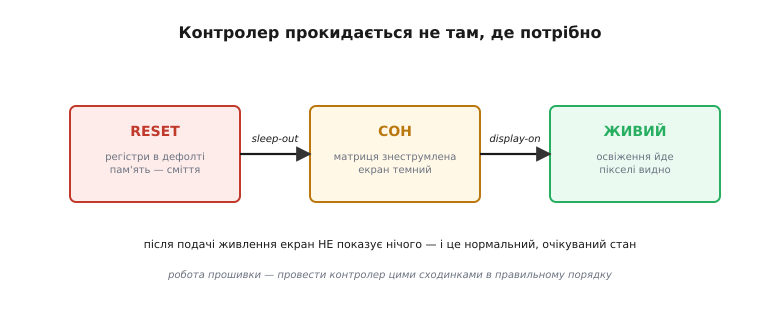
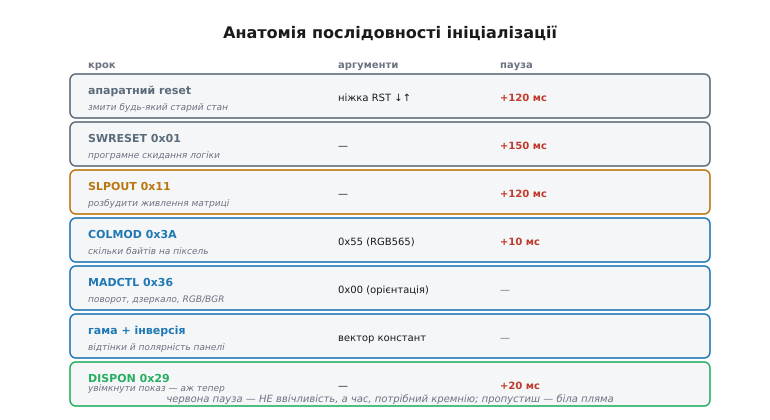
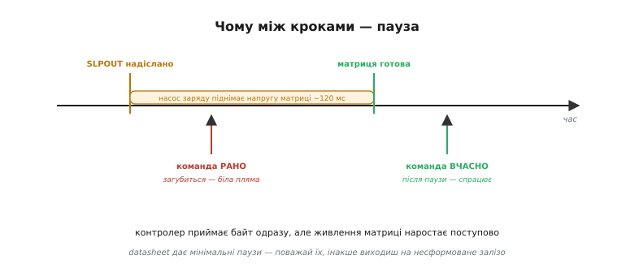
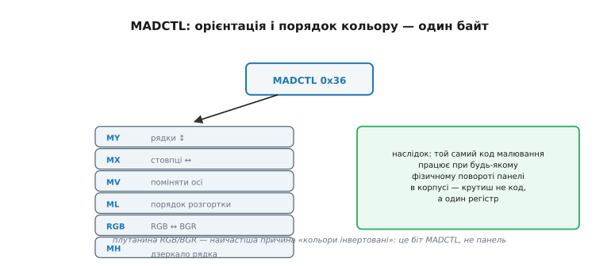

# Ініціалізація контролера дисплея

Панель ми вже [вибрали й під'єднали](root:embedded/display-selection): шлейф у розʼємі, живлення подане, лінії шини розведені. Здавалося б, лишилося надіслати пікселі — і картинка зʼявиться. Ви пишете перший `fill_rect`, заливаєте екран синім, заливаєте кадр зображенням — а скло мовчить. Біле, чорне або з безладними смугами, але точно не те, що ви малюєте. І це не поломка: так і має бути. Контролер у панелі після подачі живлення прокидається **не готовим показувати** — у режимі сну, з регістрами в заводських дефолтах і пам'яттю кадру, повною сміття. Перш ніж він прийме хоч один ваш піксель, його треба провести вузькою стежкою команд: розбудити, налаштувати формат, орієнтацію, відтінки — і лише наприкінці ввімкнути показ. Ця стежка й зветься **послідовністю ініціалізації** (від лат. *initium* — «початок»), і пройти її треба рівно в правильному порядку та з правильними паузами.

### Чому екран мовчить після ввімкнення

Згадаймо, що ми вже знаємо про [контролер дисплея](topic:hw-motion/display-controller): у типовій дрібній панелі він несе на собі і пам'ять кадру (GRAM), і двигун освіження, що сам перемальовує скло. Мікроконтролер лише шле туди команди й пікселі. Але цей контролер — повноцінна крихітна мікросхема зі своїми регістрами стану, і після подачі живлення ці регістри не порожні й не «нейтральні» — вони в **заводських значеннях за замовчуванням**, обраних виробником кремнію, а не вами. А головне — щоб не палити струм одразу при першому дотику живлення, контролер прокидається в **режимі сну** (англ. *sleep mode*): його внутрішній насос заряду (англ. *charge pump* — схема, що піднімає напругу до потрібної матриці) вимкнено, висока напруга на рідкий кристал чи органіку не подається, показ вимкнено. Екран фізично не може нічого показати, бо матриця знеструмлена.


*Контролер прокидається не там, де потрібно. Після живлення його регістри — у заводських дефолтах, а матриця знеструмлена (режим сну): екран темний, і це нормально. Команда «вихід зі сну» вмикає насос заряду; команда «показ увімкнути» відкриває картинку. Робота прошивки — провести контролер цими сходинками в правильному порядку.*

Звідси й перший зсув у мисленні. Темний екран на старті — це **не помилка**, а очікуваний стан, з якого все починається. Завдання прошивки — не «полагодити» мовчазну панель, а виконати ритуал пробудження, який виробник описав у даташиті. Поки ритуал не пройдено, будь-який ваш `fill_rect` або влетить у сплячий контролер і загубиться, або ляже в GRAM, але не зʼявиться на склі, бо показ ще вимкнено. Тому послідовність ініціалізації — не формальність, а буквально **умова** того, що екран узагалі оживе.

> 🔧 **Навіщо це.** Найперше, з чим стикається новачок: «під'єднав дисплей правильно, шлю пікселі — нічого». У дев'яти випадках із десяти проблема не в проводах і не в шині, а в тому, що контролер так і не вивели зі сну. Звідси практичне правило відлагодження: перш ніж шукати поганий контакт чи підозрювати биту панель, переконайтеся, що init-послідовність виконалася повністю й у правильному порядку. Це економить години марного перепаювання.

### Анатомія послідовності: розбудити, налаштувати, показати

Хоч конкретні команди різняться від контролера до контролера, кістяк послідовності в усіх однаковий, бо відображає ту саму логіку «спершу привести в чуття, тоді налаштувати, тоді показати». Пройдімо його по кроках на прикладі поширеного контролера класу ST7789/ILI9341 — того самого, що стоїть у більшості дешевих кольорових SPI-екранів.


*Кістяк послідовності. Спершу два скидання (апаратне ніжкою RST і програмне SWRESET) змивають будь-який старий стан. Тоді SLPOUT будить живлення матриці. Далі — налаштування: COLMOD задає, скільки байтів на піксель; MADCTL — орієнтацію й порядок кольору; вектор констант — гаму й полярність. І лише наприкінці DISPON відкриває показ. Червоні паузи — час, потрібний самому кремнію.*

**Скидання** йде першим, і часто аж двічі. Апаратне скидання — це коротко смикнути ніжку **RST** (англ. *reset* — «скинути»): притиснути її до нуля на кілька мікросекунд і відпустити, чим контролер примусово повертається в чистий стартовий стан, хай би що там було в регістрах від попереднього сеансу. Слідом нерідко шлють і **програмне скидання** — команду `SWRESET` (код `0x01`), що робить те саме логікою, без ніжки. Подвійність тут не від надмірності, а від обережності: якщо ніжка RST на платі не розведена (буває на дрібних модулях), лишається тільки програмний шлях, і навпаки — апаратне скидання надійніше там, де контролер міг зависнути. Після кожного скидання обов'язкова **пауза**: апаратне — близько 120 мс, програмне — близько 150 мс, доки внутрішня логіка не вгамується.

**Вихід зі сну** — серце всієї послідовності. Команда `SLPOUT` (англ. *sleep out* — «вийти зі сну», код `0x11`) каже контролеру ввімкнути той самий насос заряду й підняти напругу на матрицю. Це найважливіша пауза в усій ініціалізації: після `SLPOUT` треба зачекати **щонайменше 120 мс**, доки живлення матриці справді встановиться. Пропустиш цю паузу — і наступні команди підуть на ще несформоване залізо; класичний наслідок — «сніг» (англ. *snow* — безладні крапки) або біла пляма замість зображення.

Аж тепер ідуть **налаштування**, бо є чому коритися. `COLMOD` (англ. *colour mode*, код `0x3A`) задає **формат пікселя** — скільки бітів кольору ви шлете на кожну цятку; значення `0x55` означає 16 біт на піксель у форматі RGB565 (5 біт червоного, 6 зеленого, 5 синього), найпоширеніший компроміс між якістю й обсягом даних. `MADCTL` (англ. *memory access control*, код `0x36`) керує орієнтацією й порядком кольору — до нього повернемося окремо. Далі зазвичай ідуть **гама** (англ. *gamma* — крива, що звʼязує число яскравості з реальною світлістю пікселя) та **інверсія** (полярність: чи 0 — це чорний чи білий), задані векторами констант, специфічними для кожної панелі.

**Показ** замикає послідовність. Команда `DISPON` (англ. *display on* — «показ увімкнути», код `0x29`) нарешті виводить вміст GRAM на скло. Логіка порядку прозора: спершу все налаштовуємо в тиші, і лише коли контролер готовий, відкриваємо завісу — щоб глядач не побачив проміжного безладу. Після `DISPON` дають ще коротку паузу, і екран живий.

> 🔧 **Навіщо це.** Запамʼятайте порядок як мантру: **reset → sleep-out → налаштування → display-on**. Це не довільна послідовність, а причинно-наслідковий ланцюг — не можна налаштовувати сплячий контролер і не можна вмикати показ, поки не заданий формат пікселя. Більшість «дивних» дефектів старту (половина екрана, зсунуті кольори, мерехтіння) — це переставлені місцями або пропущені кроки цього ланцюга.

### Чому паузи обовʼязкові, а не для годиться

Найчастіша помилка початківця — викинути затримки: «навіщо ці `delay(120)`, шина ж і так швидка». Але пауза тут не про швидкість шини, а про фізику кремнію. Коли ви шлете `SLPOUT`, контролер **приймає байт миттєво** — а от підняти напругу матриці миттєво не може: насос заряду перекачує заряд поступово, і висока напруга наростає десятки мілісекунд.


*Чому між кроками — пауза. Контролер приймає байт `SLPOUT` одразу, але насос заряду піднімає напругу матриці поступово, близько 120 мс. Команда, послана зарано, влітає в ще несформоване залізо й губиться — звідси біла пляма. Команда після паузи лягає на готову матрицю й спрацьовує. Datasheet дає мінімальні паузи — їх треба поважати.*

Виходить розрив у часі: логіка контролера готова прийняти наступну команду вже за мікросекунди, а **матриця** ще не готова її відпрацювати. Пошлеш команду в цей розрив — вона або загубиться, або ляже на нестабільне живлення з непередбачуваним результатом. Datasheet кожного контролера дає **мінімальні** значення цих пауз; брати треба їх або трохи з запасом. Це і є та причина, чому однакові з вигляду драйвери в одного працюють, а в іншого «через раз»: різні плати, різні насоси, і той, хто заощадив на паузі, ходить по краю.

Зверніть увагу: затримки тут — простий блокувальний `delay`, і це той рідкісний випадок, коли блокувати головний цикл нормально, бо ініціалізація йде **один раз** при старті, коли робити все одно ще нічого. Зрілі драйвери кодують паузу прямо в таблиці команд — наприклад, бібліотека Adafruit для ILI9341 використовує старший біт `0x80` у байті-лічильнику аргументів як прапорець «після цієї команди зроби затримку» ([загальновживана угода в таких драйверах](root:embedded/gram-init-sequence/hist-magic-numbers.md)). Так уся послідовність — і команди, і паузи — лягає в один компактний масив даних, який інтерпретатор просто прокручує згори вниз.

### MADCTL: один регістр крутить увесь кадр

Окремо варто спинитися на `MADCTL`, бо саме він — джерело двох найчастіших косметичних дефектів старту: «картинка боком» і «кольори інвертовані». Цей один байт керує тим, **як контролер читає GRAM при розгортці**: у якому напрямку йдуть рядки, у якому — стовпці, чи помінялися вони місцями, і в якому порядку йдуть кольорові компоненти.


*Орієнтація і порядок кольору — один байт. Біти MY/MX/MV дзеркалять і міняють місцями осі (звідси чотири повороти екрана), біт ML керує напрямком розгортки, а біт RGB перемикає порядок компонент RGB↔BGR. Наслідок: той самий код малювання працює при будь-якому фізичному повороті панелі в корпусі — крутиш не код, а один регістр. Плутанина RGB/BGR — найчастіша причина «кольори інвертовані».*

Сила цього регістра в тому, що він зсуває роботу з повороту на **апаратуру контролера**: ваш код завжди малює в координатах «зліва направо, згори вниз», а як саме ці координати лягають на фізичне скло — вирішує `MADCTL`. Поставили панель у корпус «догори ногами»? Не переписуйте код малювання — поміняйте біти орієнтації, і та сама програма намалює правильно. А біт `RGB`/`BGR` лікує класичну халепу, коли червоне й синє помінялися місцями: різні панелі фізично розкладають субпікселі по-різному (одні RGB, інші BGR), і цей біт каже контролеру, у якому порядку тлумачити ваші байти кольору. Якщо на екрані небо червоне, а помідори сині — це майже напевно не панель і не ваш колір, а один невгаданий біт у `MADCTL`.

> 🔧 **Навіщо це.** Два правила економлять купу часу. Перше: орієнтацію екрана задавайте **регістром**, а не поворотом координат у коді — інакше кожна зміна положення панелі тягне переписування всієї графіки. Друге: побачили інвертовані або переставлені кольори — спершу перемкніть біт RGB/BGR у `MADCTL`, а тоді вже підозрюйте панель чи свій конвертер кольору. Це різниця між зміною одного байта й годинами полювання на привид.

### Зібрати докупи: робочий старт екрана

Складімо тепер усе в реальний код. Нижче — мінімальна, але повна послідовність старту для панелі класу ST7789, що спирається на ті самі низькорівневі примітиви, які ми вже бачили в [контролері дисплея](topic:hw-motion/display-controller) (`send_cmd` тримає ніжку D/C у стані «команда», `send_data` — «дані»). Видно весь кістяк: два скидання з паузами, вихід зі сну, формат, орієнтація, показ.

> **Умова.** Розбудити панель класу ST7789 по SPI й приготувати її приймати пікселі: апаратне й програмне скидання, формат RGB565, портретна орієнтація, увімкнути показ. Ніжки RST, D/C і CS уже налаштовані; `delay_ms` — блокувальна затримка платформи.

```c
#include <stdint.h>

// низькорівневі примітиви платформи (HAL) — ті самі, що й при малюванні
void send_cmd(uint8_t c);                       // D/C = 0, вилити байт-команду
void send_data(const uint8_t *buf, uint32_t n); // D/C = 1, вилити дані
void rst_pin(int level);                        // керувати ніжкою RST
void delay_ms(uint32_t ms);                     // блокувальна пауза

void st7789_init(void) {
    // 1. апаратне скидання: смикнути RST і дати логіці вгамуватися
    rst_pin(1); delay_ms(5);
    rst_pin(0); delay_ms(10);                    // активний нуль ≥10 мкс, беремо з запасом
    rst_pin(1); delay_ms(120);                   // після reset матриці треба час

    // 2. програмне скидання — підстраховка, якщо RST не розведено
    send_cmd(0x01);                              // SWRESET
    delay_ms(150);                               // datasheet: ≥120 мс

    // 3. вихід зі сну — найважливіша пауза в усій послідовності
    send_cmd(0x11);                              // SLPOUT
    delay_ms(120);                               // насос заряду піднімає напругу матриці

    // 4. формат пікселя: 16 біт, RGB565
    send_cmd(0x3A);                              // COLMOD
    { uint8_t a = 0x55; send_data(&a, 1); }

    // 5. орієнтація й порядок кольору (тут портрет, RGB)
    send_cmd(0x36);                              // MADCTL
    { uint8_t a = 0x00; send_data(&a, 1); }      // інвертовані кольори? спробуй 0x08 (BGR)

    // 6. (гама/інверсія/живлення — вектори констант панелі йдуть тут)

    // 7. аж тепер відкрити показ
    send_cmd(0x29);                              // DISPON
    delay_ms(20);
}
```

Прочитаймо головне в цьому коді. Уся послідовність — це строго впорядкований ланцюг: кожен наступний крок має сенс лише тому, що попередній уже виконано. Не можна задати формат пікселя сплячому контролеру (крок 4 безглуздий до кроку 3), не можна ввімкнути показ ненастроєної панелі (крок 7 — лише після 4–6). А `delay_ms` між кроками — не лінь і не магія, а ті самі вікна часу, у які кремній доводить своє живлення. Викиньте бодай одну паузу після `SLPOUT` — і драйвер стане крихким: на одній платі запрацює, на іншій дасть білу пляму.

Один блок я свідомо лишив згорнутим — крок 6, вектори гами, живлення й часові константи панелі. Це і є ті славнозвісні **«магічні числа»**, які копіюють із готових драйверів, не розуміючи до кінця кожного байта. Звідки вони беруться, чому їх не пояснюють у даташиті й як до них ставитися — окрема [історія «магічних чисел» init-послідовностей](root:embedded/gram-init-sequence/hist-magic-numbers.md). А повноцінний, переносний драйвер — той, що читає послідовність із таблиці-даних, сам обробляє паузи, перевіряє помилки шини й коректно тримає ніжку reset, — варто винести з прошивки в окремий [рушій ініціалізації за таблицею](root:embedded/gram-init-sequence/proj-init-driver.md), щоб не плодити простирадла однакових `send_cmd` під кожну панель.

### Куди далі

Тепер контролер розбуджений і налаштований, GRAM приймає пікселі, освіження йде — екран **живий і готовий малювати**. Але ввімкнути показ — це лише початок його робочого життя. Далі екран доведеться присипляти, коли пристрій не використовують (заради батареї), будити назад, регулювати яскравість, гасити й вмикати на льоту — тобто керувати всім його [життєвим циклом](root:embedded/display-lifecycle), а не тільки одноразовим стартом. Саме до цього — від «оживити раз» до «правильно водити екран увесь час роботи» — ми перейдемо наступним кроком.
