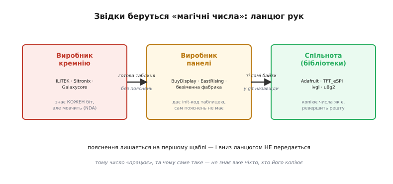
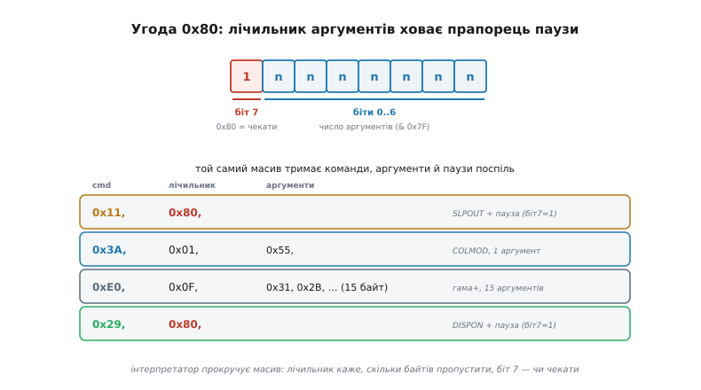

# 📜 «Магічні числа»: байти, що працюють, хоч ніхто не знає чому

> Це не довідник «що означає регістр 0xE0». Це історія про те, **як у мільйонах прошивок опинилися числа, яких ніхто з тих, хто їх копіює, до кінця не розуміє** — звідки вони беруться, чому виробник кремнію їх не пояснює, і чому ціла спільнота інженерів роками передає з рук у руки таблицю байтів, як стародавній рецепт, що «працює, тільки не питай чому». У [попередньому кроці](root:embedded/gram-init-sequence) ми свідомо лишили один блок init-послідовності згорнутим — вектори гами, регістри живлення, дивні часові константи. Настав час відкрити його й розібратися, що ж там насправді.

Згадаймо, на чому ми спинилися. Init-послідовність ми пройшли по кістяку: скидання, `SLPOUT`, формат пікселя, орієнтація, показ — кожен крок прозорий, кожен має очевидну причину. Та між «налаштувати орієнтацію» і «ввімкнути показ» у будь-якому реальному драйвері причаївся блок, який виглядає геть інакше:

```c
// гама й живлення — той самий «крок 6», що ми лишили згорнутим
send_cmd(0xC0); { uint8_t a = 0x23;       send_data(&a, 1); }          // PWCTR1
send_cmd(0xC1); { uint8_t a = 0x10;       send_data(&a, 1); }          // PWCTR2
send_cmd(0xC5); { uint8_t a[] = {0x3E, 0x28};        send_data(a, 2); } // VMCTR1
send_cmd(0xE0); { uint8_t a[] = {0x0F, 0x31, 0x2B, 0x0C, 0x0E, 0x08,   // гама +
                                 0x4E, 0xF1, 0x37, 0x07, 0x10, 0x03,
                                 0x0E, 0x09, 0x00}; send_data(a, 15); }
send_cmd(0xE1); { uint8_t a[] = {0x00, 0x0E, 0x14, 0x03, 0x11, 0x07,   // гама −
                                 0x31, 0xC1, 0x48, 0x08, 0x0F, 0x0C,
                                 0x31, 0x36, 0x0F}; send_data(a, 15); }
```

Тридцять із гаком байтів без жодного коментаря, що пояснив би **чому саме ці**. Не `0x0F`, а саме `0x0F`; не `0x31`, а саме `0x31`. Звідки вони? Чому в даташиті їх немає серед рекомендованих? Чому всі бібліотеки світу мають майже ті самі цифри з точністю до байта? І найгостріше — **чи можна їх чіпати**? Це і є «магічні числа» init-послідовностей, і за ними стоїть напрочуд людська історія — про секретність, лінь, добру волю та цілу екосистему копіювання.


*Звідки беруться магічні числа. Виробник кремнію (ILITEK, Sitronix, Galaxycore) знає призначення кожного біта, але тримає його під NDA. Виробник панелі отримує готову init-таблицю й передає її замовнику — сам пояснень уже не має. Бібліотеки спільноти копіюють числа як є й реверсять решту. Пояснення лишається на першому щаблі ланцюга й униз НЕ передається — тому число «працює», а чому саме таке, не знає вже ніхто, хто його далі копіює.*

---

## Чому даташит дає команди, але не значення

Перше непорозуміння треба зняти одразу. Коли новачок відкриває даташит контролера — скажімо, [ILI9341](book:electronics/display-controller), найпоширенішого кремнію в дешевих кольорових екранах, — він очікує знайти там готову init-послідовність із поясненими значеннями. І справді знаходить: десятки сторінок опису команд. Команда `0xE0` зветься `GMCTRP1` (*positive gamma correction*, корекція гами для додатної полярності), `0xE1` — `GMCTRN1` (від'ємна), `0xC0`–`0xC5` — регістри живлення. Усе чесно задокументовано: ось команда, ось скільки байтів вона їсть, ось що загалом робить кожен біт.

Але є тонка, підступна різниця між **«що робить регістр»** і **«яке значення туди записати»**. Даташит майже завжди дає перше й майже ніколи — друге. Він скаже вам: «байти команди `0xE0` задають вузлові точки кривої гами». Він **не** скаже: «для цієї конкретної панелі запишіть `0x0F, 0x31, 0x2B…`». Бо правильне значення залежить не від кремнію-контролера, а від **скла, на яке він посаджений** — від конкретної рідкокристалічної матриці, її електрооптичної кривої, товщини шару, складу. Той самий контролер ILI9341 стоїть на сотні різних панелей різних фабрик, і для кожної правильна гама **своя**.

Згадаймо, що ми вже знаємо про природу гами з [кроку про керування кольором](root:embedded/color-management): крива гами зв'язує число яскравості, яке ви шлете, з реальною світлістю пікселя на склі. А ця світлість — фізична властивість конкретної матриці. Виходить розрив відповідальності: виробник кремнію знає, **як** влаштований регістр гами, але не знає, на яке скло його посадять; виробник панелі знає своє скло, але саме він мусить підібрати числа. І ось тут починається найцікавіше — бо підбирає їх той, хто потім ні з ким не ділиться.

> 🔧 **Навіщо це.** Засвойте цю різницю раз і назавжди: даташит контролера описує **механізм**, а не **налаштування під вашу панель**. Тому марно шукати в ньому «правильну» гаму — її там немає й бути не може. Правильні числа живуть не в даташиті кремнію, а в reference-коді виробника **панелі** (або в бібліотеці, що той код увібрала). Перше місце, куди дивитися, налаштовуючи новий екран, — це init-приклад від продавця конкретного модуля, а не загальний datasheet чипа.

---

## Калібрування, якого ви не бачили

То звідки ж конкретні числа беруться насправді? Їх **калібрують** — на заводі, очима й приладами, для кожної моделі панелі окремо. І це варто уявити фізично, бо саме тут народжується «магія».

Інженер на фабриці панелей бере складену матрицю з посадженим контролером, чіпляє її до стенда й крутить значення регістра гами доти, доки картинка не стане «правильною»: сірі переходи — рівними, без провалів і зашкалів, баланс білого — чистим, темні відтінки — помітними, а не злитими в чорноту. Це частково вимірювання приладом-колориметром, частково — підбір на око під вимоги замовника. Кінець процесу — стовпчик байтів, що для **цієї** панелі дає гарну картинку. Ці байти й лягають у reference-таблицю, яку фабрика віддає тому, хто купує панелі тисячами.

І тут — ключовий момент усієї історії. Цей стовпчик байтів — **результат**, з якого **викинули процес**. У таблиці лишається `0x0F, 0x31, 0x2B…`, але ніде не лишається записаним, що `0x2B` — це третя вузлова точка кривої, підкручена, бо інакше середні сірі провалювалися. Знання, **чому** саме таке число, лишилося в голові того інженера й на його стенді. У код пішов голий результат. Магія — це завжди наслідок, від якого відрізали причину; і `0x2B` стало «магічним» рівно в ту мить, коли його записали в таблицю без коментаря, чому воно `0x2B`.

Тепер видно, чому ці числа годі вивести з перших принципів, сидячи за столом. Вони не обчислені формулою — вони **виміряні на залізі**, якого у вас немає. Можна знати все про теорію гами й однаково не вгадати правильний байт, бо він прив'язаний до фізичного зразка скла. Це принципово інша природа знання, ніж, скажімо, `SLPOUT = 0x11`: код команди логічний і однаковий для всіх, а значення гами — емпіричне й унікальне для партії панелей.

---

## Слово від тих, хто ці числа копіює

Найкраще цю ситуацію описали не теоретики, а практики — інженери, що пишуть бібліотеки дисплеїв, якими користуються мільйони. Їхні власні слова на форумах варті більше за будь-яке пояснення збоку, бо це визнання людей, які тримають ці числа в руках щодня.

Коли користувачі на форумі Adafruit допитувалися, що означають конкретні значення гами в бібліотеці й як їх правильно налаштувати, відповідь розробника була обеззброююче чесною. Сенс її такий: init-таблицю їм **фактично передав сам виробник панелі** («basically given to us by the TFT vendor»), у ній **немає нічого магічного**, але вона працює; а сам вендор, найпевніше, теж нічого більше про неї не знає — просто передав далі по ланцюгу від того, хто стоїть вище. *(Достеменність: пряма цитата з форуму Adafruit; конкретного автора повідомлення не наводжу, бо за наявним записом його ім'я певно не встановити.)*

Розкладімо це зізнання на складники, бо в ньому — вся суть.

**«Передав вендор».** Числа не вигадані в Adafruit і не виведені з даташита — вони прийшли готовою таблицею від виробника панелі. Бібліотека лише **переписала** їх у свій код. Те саме незалежно зробили й інші великі бібліотеки: [TFT_eSPI](https://github.com/Bodmer/TFT_eSPI) Бодмера, [LVGL](https://lvgl.io), [u8g2](https://github.com/olikraus/u8g2) Олікрауса, LovyanGFX. Усі вони не розраховували гаму — вони **зібрали** її з вендорських прикладів. Тому й значення в них збігаються майже до байта: це не незалежні відкриття, а спільне коріння — той самий reference-код, що розійшовся екосистемою. І це аж ніяк не Arduino-феномен: ті самі байти гами лежать у панельних драйверах компонента `esp_lcd` в ESP-IDF, у прикладах BSP від STMicroelectronics для STM32 і в порт-файлах LVGL під будь-яку платформу. Джерело одне на всіх, змінюється лише обгортка API навколо нього.

**«Нічого магічного».** Чесне уточнення: ці байти — не якесь таємне закляття, а просто значення регістрів, описаних у даташиті. «Магічними» їх робить не природа, а **втрачений контекст** — те, що ніхто в ланцюзі копіювання не знає, чому обрано саме їх.

**«Працює».** Прагматичний критерій, на якому й тримається вся практика. Числа лишають у коді не тому, що їх зрозуміли, а тому, що **картинка з ними гарна**. Це інженерія за результатом: якщо панель показує добре — таблицю не чіпають, хай би що в ній стояло.

**«Вендор теж не знає».** Найглибший шар. Навіть той, хто передав таблицю, часто вже не тримає пояснення — він теж отримав її згори по ланцюгу. Знання розчиняється на кожному щаблі передачі.

> 🔧 **Навіщо це.** З цього зізнання випливає важлива психологічна настанова для розробника: **не соромтеся не розуміти магічних чисел до кінця** — їх не розуміє до кінця практично ніхто, включно з авторами найкращих бібліотек. Це не діра у ваших знаннях, а об'єктивний стан речей у галузі. Правильна реакція — не годинами медитувати над `0x2B`, намагаючись його вивести, а взяти перевірену таблицю з надійного джерела (бібліотека або вендорський приклад саме вашої панелі) і рухатися далі. Розуміння тут коштує дорожче, ніж дає.

---

## Чому виробник кремнію мовчить: NDA й недокументовані регістри

Лишається питання, від якого нікуди не дітися: добре, значення гами емпіричні. Але чому в init-послідовностях трапляються команди, **яких узагалі немає в даташиті**? Не значення, а самі коди команд — `0x80`-`0x8F`, якісь `0x62`, `0x67`, на які в офіційному документі немає жодного рядка. Звідки беруться вони?

Тут починається інший шар секретності — уже не «забули записати процес», а **свідомо не публікують**. Виробник кремнію документує не все, що вміє його чип. Частина регістрів лишається **недокументованою** — їх не виносять у публічний даташит, бо це або тонке заводське калібрування, або робота під конкретного великого замовника, або просто внутрішні налаштування, які виробник не хоче відкривати конкурентам. Доступ до повного опису дають лише за **NDA** (*non-disclosure agreement*, угода про нерозголошення) — і то лише великим клієнтам, що купують чипи мільйонами.

Масштаб цього явища вражає, коли наштовхуєшся на нього вперше. На форумі Arduino розробник, що реверсив init-послідовність круглого дисплея на контролері GC9A01 (виробництва Galaxycore), порахував: **близько 70% команд** у вендорському демо-коді **не задокументовані** в офіційному даташиті — «I would say approx 70% are not documented». Цілі діапазони команд (`0x80`-`0x8F`, `0x62`-`0x67`) працюють, входять у робочу послідовність, але в datasheet GC9A01 про них **ані слова**. *(Достеменність: повідомлення з форуму Arduino від користувача winneymj; підтверджено в тій самій гілці.)*

Це не виняток, а радше правило для дешевих контролерів. Досвідчений автор бібліотек дисплеїв Девід Прентіс (*David Prentice*) у тій же дискусії зауважив, що недокументовані регістри в чипів Galaxycore — звична річ: навіть для спорідненого GC9102 фірмовий application note містить регістри, яких немає в самому даташиті. Виходить, повна правда про чип розпорошена між публічним даташитом, напівприватним application note під NDA та головами заводських інженерів — і пересічний розробник бачить лише вершечок.

Звідси й сумна практична реальність: коли в робочій init-послідовності стоїть команда `0x87` із якимись аргументами, а в даташиті її немає, у вас **немає легального способу дізнатися**, що вона робить. Вона прийшла з вендорського демо-коду, вона потрібна (без неї панель показує гірше або не показує зовсім), і ви її просто **копіюєте наосліп**, довіряючи, що той, хто її туди поклав, знав, що робив. Недокументовані команди — це магічні числа в найчистішому, найбезнадійнішому вигляді: тут невідоме навіть не значення, а саме **призначення** команди.

> 🔧 **Навіщо це.** Практичне правило відлагодження: побачили в чужій init-послідовності команду, якої немає в даташиті, — **не викидайте її** як «зайву» чи «незрозумілу». З великою ймовірністю це недокументований, але необхідний регістр, що його вендор поклав свідомо. Викинете — панель може стати тьмяною, смугастою або зовсім німою, і ви згаєте години, шукаючи причину не там. У світі дешевих дисплеїв «я не розумію цю команду» і «ця команда не потрібна» — **геть різні речі**, і плутати їх дорого.

---

## Угода 0x80: як в один масив поклали і команди, і паузи

Тепер — про окрему дрібну «магію», яку ви неодмінно зустрінете, читаючи зрілі драйвери, і яка спершу теж виглядає як незрозумілий байт, а насправді є гарним інженерним трюком. У [кроці про init-послідовність](root:embedded/gram-init-sequence) ми мимохідь згадали, що бібліотека Adafruit кодує паузи прямо в таблиці команд через старший біт `0x80`. Табличний init — прийом загальний (так само влаштовані панельні драйвери `esp_lcd` в ESP-IDF і вендорські BSP для STM32), а Adafruit дає його найчистіший і найкоротший приклад. Розберімо цю угоду до кінця — вона повчальна.

Уявіть задачу очима автора бібліотеки. Init-послідовність — це довга низка кроків, де кожен крок це: код команди, кілька байтів аргументів (або жодного) і, **можливо**, пауза після. Найгрубіший спосіб закодувати це — простирадло викликів `send_cmd`/`send_data`/`delay`, як у нашому навчальному прикладі вище. Воно зрозуміле, але незграбне: під кожну панель — свій довжелезний шмат коду, який важко зберігати й порівнювати. Зріліший підхід — скласти всю послідовність у **компактний масив байтів** і написати один маленький інтерпретатор, що його прокручує. Але тоді постає питання кодування: як в одному потоці байтів вмістити і команди, і їхні аргументи, і ознаку «тут потрібна пауза»?

Рішення Adafruit елегантне до краси. Кожен запис у таблиці — це: байт команди, далі **байт-лічильник**, далі стільки байтів аргументів, скільки лічильник назвав. А пауза ховається **всередині самого лічильника**. Аргументів не буває більше за 127 (їх фізично стільки немає в жодної команди), тож для лічильника досить **семи молодших бітів**. А **старший, восьмий біт** (вага `0x80` = 128) лишається вільним — і його віддали під прапорець «після цієї команди зроби затримку».


*Угода 0x80 розкрита. Байт-лічильник несе одразу два значення: молодші 7 бітів (`& 0x7F`) — скільки байтів аргументів читати, старший біт (`& 0x80`) — чи робити паузу після команди. Тому один лінійний масив тримає поспіль і команди, і аргументи, і паузи: `0x11, 0x80` — це SLPOUT із паузою (аргументів нуль, біт 7 піднятий); `0x3A, 0x01, 0x55` — COLMOD з одним аргументом без паузи. Інтерпретатор прокручує масив згори вниз, на кожному кроці питаючи лічильник, скільки байтів пропустити й чи чекати.*

Подивімося, як це читає інтерпретатор — це майже дослівно цикл із бібліотеки Adafruit:

```c
uint8_t cmd, x, numArgs;
while ((cmd = pgm_read_byte(addr++)) > 0) {   // 0 = кінець таблиці
    x = pgm_read_byte(addr++);                // байт-лічильник
    numArgs = x & 0x7F;                        // молодші 7 бітів — число аргументів
    send_cmd_with_args(cmd, addr, numArgs);    // вилити команду й аргументи
    addr += numArgs;                           // перескочити аргументи
    if (x & 0x80) delay(150);                  // старший біт — затримка
}
```

Гляньмо, що тут відбувається, по черзі. Інтерпретатор бере байт — це команда. Бере наступний — це лічильник `x`. Маскою `x & 0x7F` витягає число аргументів (відкидаючи старший біт), шле команду з цими аргументами, пересуває вказівник за них. А тоді — ключовий рядок — перевіряє `x & 0x80`: якщо старший біт піднятий, робить паузу. Один байт `x` чесно несе **два різні** значення водночас, і маски їх акуратно розділяють. Уся послідовність — команди, аргументи, паузи — лягає в один плаский масив, який цикл проходить згори вниз.

Платформозалежні тут лише два імені, і варто одразу знати, чим їх замінити. `pgm_read_byte` — риса 8-бітних AVR, де флеш лежить в **окремому** адресному просторі, тож до сталої таблиці потрібна спеціальна інструкція; на Cortex-M (STM32, RP2040) і на ESP32 флеш відображений у той самий простір, і читання зводиться до звичайного `*addr++`. А `delay(150)` — це просто блокуюча пауза в мілісекундах: у Arduino `delay`, у STM32 HAL `HAL_Delay`, в ESP-IDF `vTaskDelay(pdMS_TO_TICKS(150))`, у Zephyr `k_msleep`. Сама ж угода `0x80` не залежить від платформи взагалі — це домовленість про формат даних, а не про API.

Тепер зрозуміло, чому в реальній таблиці запис виглядає як `0x11, 0x80` — і чому новачка це збиває з пантелику. Він бачить два байти й думає: команда `0x11` (`SLPOUT`) з аргументом `0x80`. А насправді `0x80` — **не аргумент**, а лічильник: молодші сім бітів нульові (аргументів немає), старший біт піднятий (зроби паузу). Знаючи угоду, читаєш це миттєво: «розбуди зі сну й зачекай». Не знаючи — `0x80` стає черговим магічним числом. Різниця, як завжди, лише в **контексті**: той самий байт або прозорий, або магічний — залежно від того, чи знаєш ти угоду, за якою його записали.

Це, до речі, протилежний випадок до гами. Гама магічна **по суті** — її значення емпіричні, контекст утрачено назавжди. А `0x80` магічний лише **на вигляд** — щойно знаєш угоду кодування, магія зникає повністю, бо за нею стоїть проста й цілком логічна структура даних. Корисно розрізняти ці два сорти «магії»: одну можна розвіяти знанням угоди, іншу — ні.

---

## Коли числа чіпати можна, а коли — ні

Уся ця історія веде до єдиного практичного питання, заради якого розробник і відкриває цей файл: **чи можна мені їх змінювати?** Відповідь не «так» і не «ні», а «залежить, які саме» — і тепер, розклавши природу різних магічних чисел, ми можемо дати чесний, диференційований присуд.

**Часові константи — чіпати обережно, лише в безпечний бік.** Паузи (`delay(120)` після `SLPOUT` і подібні) — це **мінімуми**, продиктовані фізикою кремнію, як ми розібрали в основному кроці. Збільшувати їх **безпечно завжди**: зайвий запас часу нікому не шкодить, хіба трохи довший старт. Зменшувати — **небезпечно**: ви заощаджуєте десятки мілісекунд один раз при ввімкненні й натомість ризикуєте отримати плаваючий дефект, що спливає на холоді чи на іншій партії плат. Правило просте: паузи руш лише вгору, і то якщо справді розумієш навіщо.

**Значення гами — чіпати можна, це навіть заохочується.** Той самий розробник Adafruit, чию цитату ми розбирали, прямо казав, що **підправляти ці значення безпечно**, якщо хочеться. І це логічно: гама керує лише **тим, як виглядає** картинка — балансом яскравостей, — а не тим, чи панель узагалі працює. Невдале значення гами дасть бліді або перенасичені кольори, провалені тіні — косметичний дефект, який видно й який легко відкотити. Спалити панель гамою не можна. Тож якщо картинка вам не до смаку — експериментуйте з векторами `0xE0`/`0xE1` сміливо, це найбезпечніший із магічних блоків. Гірше за «негарно» не буде.

**Регістри живлення — чіпати лише з даташитом і дуже обережно.** А ось `PWCTR1`/`PWCTR2`/`VMCTR1` (`0xC0`-`0xC5`) — інша категорія. Вони задають **напруги**, які контролер подає на матрицю: рівні насоса заряду, опорну напругу комірок. Тут навмання крутити не можна: завищена напруга в принципі здатна вкоротити життя матриці або зіпсувати зображення глибше, ніж гама. Ці значення міняйте **тільки** звіряючись із даташитом контролера й рекомендаціями виробника панелі, розуміючи, яку напругу ви задаєте. Це межа, де «магічне число» з косметичного стає потенційно шкідливим.

**Недокументовані команди — не чіпати взагалі.** Команди, яких немає в даташиті (ті `0x80`-`0x8F` із GC9A01), — **недоторканні**. Ви не знаєте, що вони роблять, тож не можете передбачити наслідок зміни. Єдина правильна стратегія — **скопіювати їх точно** з перевіреного джерела під вашу панель і не торкатися. Тут навіть експеримент небезпечний: міняючи невідоме на невідоме, ви граєте всліпу.

> 🔧 **Навіщо це.** Складімо це в один робочий компас. Зустрівши магічне число, спитайте себе: до якого воно сорту? **Пауза** — збільшувати безпечно, зменшувати ні. **Гама** — крути сміливо, це лише вигляд. **Живлення** — тільки з даташитом, бо це напруги на залізі. **Недокументована команда** — копіюй точно, не чіпай. Цей поділ за **наслідком зміни** (косметика / працездатність / довговічність / повна невідомість) і є та практична мудрість, заради якої варто було розбиратися, звідки магічні числа взялися. Бо «магічне число» — це не одна категорія, а чотири дуже різні за ризиком.

---

## Що з цієї історії інженерові

Магічні числа init-послідовностей — чудовий, майже лабораторно чистий приклад того, як у техніці народжується й передається знання, від якого відрізали пояснення. Озирнімося на весь шлях і витягнемо з нього те, що ширше за самі дисплеї.

**Магія — це завжди втрачений контекст.** За кожним «магічним числом» колись стояла причина: вимірювання на стенді, рішення інженера, рядок в application note під NDA. Число стає магічним не тому, що воно ірраціональне, а тому, що по дорозі від причини до коду **причину загубили**. Гаму виміряли — записали голий результат. Команду задокументували під NDA — у публічний даташит не винесли. Угоду `0x80` придумали — а той, хто читає таблицю вперше, угоди не знає. Скрізь та сама механіка: знання було, та на якомусь щаблі передачі відпало, і лишився голий результат, що «просто працює». Це не вада конкретної галузі — це загальний закон руху знання через руки.

**Копіювання без розуміння — інколи раціональна стратегія, а не лінь.** Інстинкт сумлінного інженера — розуміти кожен рядок свого коду. Здоровий інстинкт, але тут він заводить у глухий кут: значення гами **неможливо** вивести без фізичного стенда, недокументовану команду **неможливо** розшифрувати без NDA. Витрачати дні на «розуміння» того, що принципово недоступне, — гірше марнотратство, ніж чесно взяти перевірену таблицю й рухатися далі. Дорослість інженера — це зокрема вміння **відрізнити, що варто розуміти до дна, а що раціонально прийняти на віру** з надійного джерела. Магічні числа — саме другий випадок.

**Екосистема пам'ятає те, чого не пам'ятає окремий розробник.** Жоден автор бібліотеки не калібрував ту гаму особисто. Але спільнота — Adafruit, TFT_eSPI, LVGL, u8g2 — колективно зберегла робочі таблиці для сотень панелей, передаючи їх із проєкту в проєкт. Окрема людина числа не розуміє, а **система** загалом їх надійно береже й доносить до кожного нового пристрою. Це теж урок: у відкритому коді цінне не лише те, що хтось зрозумів, а й те, що хтось **зберіг і передав далі**, навіть не до кінця розуміючи. Чужа перевірена таблиця — це сконденсований досвід заводського стенда, до якого ви ніколи не матимете доступу.

І останнє, найпрактичніше. Тепер, відкривши той згорнутий «крок 6» з основної статті, ви дивитеся на тридцять байтів гами вже іншими очима. Це не закляття й не ваша неосвіченість — це **виміряний на чужому стенді результат**, який хтось дбайливо доніс до вас через ланцюг рук. Ваша робота — не вивести його заново (це неможливо), а взяти правильну таблицю під вашу панель, зрозуміти, **який байт якого сорту** (пауза, гама, живлення, недокументоване) і відповідно — що з ним можна, а чого не можна. Саме це перетворює сліпе копіювання на свідому інженерію: не «я переписав магічні числа», а «я знаю, чому вони магічні, звідки взялися й наскільки кожне з них недоторканне». А коли захочете прибрати простирадла однакових `send_cmd` і покласти всю послідовність — байти й паузи — в один акуратний масив із власним інтерпретатором, як це роблять зрілі бібліотеки, цьому присвячено окремий [рушій ініціалізації за таблицею](root:embedded/gram-init-sequence/proj-init-driver.md).
