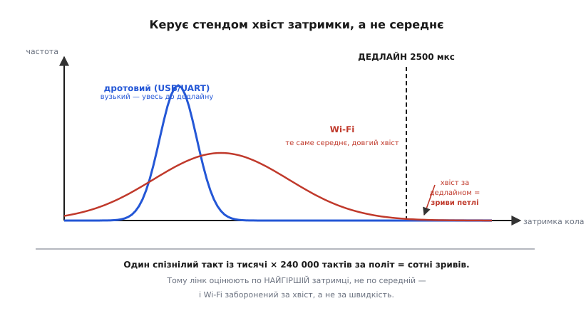

# HIL-стенд, зблизька: бюджет часу, електрична інжекція й lockstep

<preknowlist>
- [SITL — симуляція всього апарата](book:programming/sitl-simulation) — модель фізики заміняє і чіп, і світ; саме її діру («перевіряємо код, а не пристрій») HIL закриває.
- [Атомарність і гонки](book:programming/atomicity-races) — що таке гонка за спільними даними й чому переривання посеред читання псує значення; HIL ловить саме такі баги.
- [Просідання живлення (brownout)](book:programming/brownout) — як падіння напруги напівперезавантажує чіп; на HIL це відтворюють насправді.
- [Захоплення й порівняння таймера](book:programming/capture-compare) — апаратне вимірювання тривалості імпульсу; ним стенд зчитує ШІМ-команди на мотори.
</preknowlist>

Базова стаття про HIL дала нам карту: справжня плата в петлі, дві двері для вимірів — електрична й програмна, стіна реального часу, якої в SITL не було. Тепер зайдемо під капот кожної з цих ідей. Бо на карті «лінк має бути швидким» — це одне речення, а коли ти справді ставиш стенд, воно розсипається на десяток чисел: **скільки саме** мікросекунд у тебе є, **куди** вони течуть, у якому місці бюджет тріщить і що з цим робити. Так само «електрична двері — дорого» ховає ціле мистецтво: як ти взагалі змушуєш дріт вдавати гіроскоп, який чіп сидить на іншому кінці шини й прикидається давачем, чому це так важко зробити чесно. І «lockstep рятує» — за цим стоїть точний механізм рукостискання за модельним годинником, який варто вивести до останнього кроку, бо саме він відрізняє стенд, що бреше, від стенда, якому можна вірити.

Ми не переказуватимемо базову — ми її **поглибимо**: порахуємо бюджет часу від першого принципу, розберемо електричну інжекцію по кожній шині окремо, виведемо, чому в вільному ході модельний і апаратний годинники розповзаються, і напишемо lockstep-крок у коді так, щоб було видно кожну його передумову. Нитку веду туди, куди її повернула базова стаття, — до трьох речей, від яких залежить стенд: **куди** підсунути виміри, **як** устигнути в реальний час, **що** з цього зловити. Тільки тепер кожну з них розгорнемо до дна.

## Бюджет часу: звідки береться дедлайн і куди він витрачається

Базова стаття сказала: плата вимагає свіжий вимір кожні, скажімо, 2.5 мс, і не чекатиме. Це число — не з повітря, і зрозуміти, звідки воно, критично, бо саме воно задає весь бюджет стенда.

Період керування диктує **петля оцінки положення й керування** на самій платі. Автопілот мультикоптера тримає апарат у повітрі не «іноді», а **безперервно**: гіроскоп читається сотні-тисячі разів на секунду, бо кутова швидкість апарата змінюється швидко, і кожен пропущений вимір — це шматок траєкторії, за яким оцінка орієнтації втратила слід. Типова внутрішня петля стабілізації йде на 400 Гц у ArduPilot і до 1 кГц і вище у PX4 на швидких платах. Візьмімо 400 Гц як робочий приклад:

```
період петлі = 1 / 400 Гц = 2.5 мс = 2500 мкс
```

Ось звідки 2.5 мс. Це **весь** проміжок, за який на HIL-стенді має статися повне коло: модель віддала вимір → вимір доїхав до плати → плата зробила крок керування → команди на мотори доїхали назад → модель проінтегрувала фізику на 2.5 мс уперед і приготувала наступний вимір. Якщо будь-яка ланка не вклалася, наступний такт петля зустріне **без свіжого виміру** — і поведеться так, ніби апарат раптом «осліп» на один крок.

Розкладімо ці 2500 мкс по ланках. Кожну порахуємо від фізики процесу, а не «на око».

**Ланка 1 — модель рахує наступний стан.** Симулятор інтегрує рівняння руху апарата на крок Δt. Це матрична арифметика над станом із десятка-другого чисел плюс модель аеродинаміки; на сучасному ПК це одиниці, від сили десятки мікросекунд. Скажімо, **20 мкс**. Дрібниця — але тільки якщо модель проста; складна модель із гнучкістю корпусу чи детальною аеродинамікою може з'їсти в рази більше, і це вже перший кандидат на зрив бюджету.

**Ланка 2 — серіалізація й вихід повідомлення з ПК.** Модельні числа треба спакувати в HIL-повідомлення (кути, прискорення, тиск, координати — байтів сто-двісті) і віддати драйверу порту. Сам пакунок — наносекунди, але **віддати ОС** — це системний виклик, і тут ховається перша пастка: планувальник ПК не реального часу. Windows чи звичайний Linux можуть **притримати** твій потік на цілі мілісекунди, якщо саме тоді вирішили зайнятися чимось іншим. У доброму випадку — одиниці мікросекунд; у поганому — стрибок на 1–10 мс, і весь бюджет полетів. Це не гіпотеза, а головна причина, чому зовнішній HIL примхливий.

**Ланка 3 — фізичне передавання по лінку.** Ось де рахунок стає точним і повчальним. Час на дроті складається з двох геть різних доданків, і плутати їх — класична помилка.

Перший доданок — **час серіалізації бітів**: скільки триває проштовхнути N байтів крізь канал відомої швидкості.

```
t_передачі = (кількість байтів × 8 біт) / швидкість_каналу
```

Для UART на 921600 бод і повідомлення на 100 байтів:

```
t_передачі = (100 × 8) / 921600 = 800 / 921600 ≈ 868 мкс
```

Майже мілісекунда — **лише на проштовхування бітів**, ще без жодних затримок! Ось чому повільний UART для HIL швидко стає вузьким місцем: на 115200 бод те саме повідомлення їхало б ≈ 6.9 мс — більше за весь період петлі, стенд неможливий у принципі. На USB (навіть Full-Speed, 12 Мбіт/с) ті самі 100 байтів — це вже ≈ 67 мкс, на порядок легше; тому USB — типовий вибір.

Другий доданок — **латентність каналу**: скільки часу мине від «поклав перший біт» до «перший біт виліз на тому кінці», плюс накладні витрати протоколу. У UART це майже нуль (біт тече, щойно вийшов). А от USB — **опитуваний** протокол: хост опитує пристрій не безперервно, а раз на кадр. У Full-Speed USB кадр — 1 мс, у High-Speed мікрокадр — 125 мкс. Це означає, що навіть крихітне повідомлення може **чекати** до цілого кадру, поки хост його забере:

```
латентність USB-FS ≈ до 1000 мкс очікування наступного кадру
латентність USB-HS ≈ до  125 мкс очікування наступного мікрокадру
```

Ось тонкий момент, який плутають найчастіше: **USB має вищу пропускну здатність, але не обов'язково нижчу латентність, ніж UART**. По пропускній він виграє (12–480 Мбіт/с проти ~1 Мбіт/с), тож серіалізація бітів на ньому миттєва. Але його кадрова природа додає **сталу** затримку опитування, якої в UART немає. Для HIL важать **обидва** числа, і саме тому вибір лінка — не «що швидше в мегабітах», а «що дає малу **й передбачувану** повну затримку туди-назад».

**Ланка 4 — плата приймає, крок керування, відповідь.** Прийом пакета в перериванні UART/USB, розбір, підстановка виміру у шов, повний прохід петлі керування (фільтр оцінки положення + закон стабілізації + мікшер моторів), пакування команд назад. На чипі це десятки-сотні мікросекунд залежно від складності фільтра; візьмімо **150 мкс**.

**Ланка 5 — команди назад у модель.** Дзеркало ланок 2–3, ще ≈ 100–900 мкс залежно від лінка.

Складімо песимістично, для зовнішнього HIL по USB Full-Speed:

```
модель            :   20 мкс
серіалізація+ОС   :   50 мкс   (у доброму випадку)
лінк туди         :   67 мкс серіалізації + до 1000 мкс кадру USB-FS
плата (крок)      :  150 мкс
лінк назад        :   67 мкс + до 1000 мкс кадру
─────────────────────────────
разом (найгірше)  : ≈ 2354 мкс — на межі 2500 мкс!
```

Число промовисте: **у найгіршому випадку ти вже майже впираєшся в дедлайн, і це навіть без стрибка планувальника ОС**. Один випадковий сплеск на ланці 2 — і коло не встигло. Саме цей рахунок, а не абстрактна «повільність», убив класичний зовнішній HIL в ArduPilot: коли зверху дописали інерціальну навігацію (оцінку положення інтегруванням гіроскопа), петля стала різко чутливою до **кожного** запізнення, а зовнішня модель по лінку такої гарантії дати не могла.

> 🔧 **Навіщо це.** Порахувати цей бюджет — перше, що робиш, проєктуючи стенд, і робиш це **до** того, як щось паяти. Бюджет одразу каже дві речі. По-перше, який лінк узагалі має право на життя: якщо на обраному каналі сама серіаліція повідомлення більша за період петлі — стенд неможливий, крапка, шукай швидший канал або рідший темп. По-друге, скільки лишається на модель: якщо лінк з'їдає 2 мс із 2.5, твоя модель мусить укладатися в 500 мкс, і складну аеродинаміку доведеться спростити. Число керує архітектурою — а не навпаки.

Повне виведення бюджету з розкладкою по всіх ланках, формулами пропускної здатності для UART/USB/Ethernet і статистикою джитера — окремою математичною вставкою: [бюджет часу й пропускної здатності HIL-лінка](root:embedded/hil-testing/math-latency-budget.md).

## Джитер: чому вбиває не середнє, а хвіст

Тут — найглибша й найменш очевидна річ про реальний час, і базова стаття її лише торкнулася словом «передбачувана». Розгорнемо, бо це серце того, чому Wi-Fi заборонений, а дротовий USB — ні.

Уяви, що середня затримка кола на стенді — комфортні 800 мкс при бюджеті 2500 мкс. Здавалося б, запас потрійний, живи спокійно. Але «середня» — оманливе число. Петля керування працює не з середнім, а з **кожним окремим** тактом. Достатньо, щоб **один** такт із тисячі спізнився понад 2500 мкс — і саме на цьому такті оцінка положення отримає крок на старому вимірі. Одна така прогалина — легкий поштовх; коли вони капають регулярно, оцінка орієнтації починає накопичувати помилку, керування реагує на неї, апарат у моделі розгойдується, і «політ» розвалюється.

Розкид затримки навколо середнього називають **джитером** (англ. *jitter* — тремтіння). І керує стендом не середній джитер, а **хвіст розподілу** — найгірші, найрідші затримки. Формально: якщо ймовірність, що окремий такт спізниться, дорівнює p, то за політ із N тактів очікувана кількість зривів — просто N·p:

```
такти за 10-хвилинний політ = 400 Гц × 600 с = 240 000 тактів
якщо p = 0.001 (один зрив на тисячу):
   очікувано зривів = 240 000 × 0.001 = 240 зривів за політ
```

Двісті сорок прогалин за політ — це вже не «раз пощастило», це стабільно розхитана оцінка. Ось чому оцінювати лінк за **середньою** затримкою — пастка: середнє може бути прекрасним, а хвіст на рівні p=0.001 усе одно поховає стенд. Правильна метрика — **найгірша** затримка (або 99.9-й процентиль), і саме її треба тримати під дедлайном.

Тепер зрозуміло, чому Wi-Fi — табу, а дротовий USB — норма. Річ не в **середній** швидкості (Wi-Fi буває й швидшим за UART). Річ у **хвості**: у Wi-Fi ретрансмісії при колізіях, дільба каналу з сусідами, керування живленням радіо час від часу підкидають затримку одного пакета на десятки мілісекунд. Середнє чудове — хвіст жахливий. Дротовий канал такого хвоста не має: його найгірша затримка близька до середньої, розподіл вузький. Для реального часу вузький розподіл із трохи гіршим середнім **набагато** кращий за чудове середнє з довгим хвостом.


*Керує стендом не середня затримка, а хвіст розподілу. Вузький дротовий розподіл (синій) увесь лівіше дедлайну — жодного зриву. Широкий розподіл Wi-Fi (червоний) має те саме середнє, але довгий правий хвіст заходить за межу; кожен такт із-за межі — крок керування на старому вимірі. Тому метрика лінка для HIL — найгірша затримка, а не середня.*

> 🔧 **Навіщо це.** Це правило рятує від дуже спокусливої помилки: «зроблю HIL по Wi-Fi, дрон же й так по радіо літає». Дрон **терпить** джитер радіоканалу, бо його петля стабілізації сидить **на самій платі** й годується локальним гіроскопом — радіо несе лише команди пілота, які й так рідкі. А HIL по Wi-Fi запхав би у радіоканал саму **петлю оцінки**, яка не терпить жодного запізнення. Те, що годиться для команд, смертельне для виміру в петлі. Тому лінк HIL — завжди дріт, і оцінюєш його по найгіршому такту, а не по середньому.

## Друга стіна: годинники розповзаються

Є ще одна проблема реального часу, про яку базова стаття не казала зовсім, бо вона тонша за латентність, — і вона є завжди, навіть якщо лінк ідеально швидкий і без джитера. Це **розбіжність годинників**.

У вільному ході (не lockstep) на стенді цокають **два незалежні годинники**. Один — кварц на платі DUT, за яким плата відмірює свої 2.5 мс. Другий — годинник ПК, за яким симулятор інтегрує фізику й вирішує, коли слати наступний вимір. Проблема в тому, що **жоден кварц не ідеальний**: реальний резонатор має похибку частоти, яку міряють у мільйонних частках (англ. *parts per million*, ppm). Дешевий кварц — ±50 ppm, добрий — ±10 ppm.

Що це означає для стенда? Що «секунда» плати й «секунда» ПК — трохи різної довжини. Виведімо, наскільки. Хай плата має похибку +30 ppm (біжить трохи швидше), а ПК — ідеальний. Тоді за кожну реальну секунду плата «думає», що минуло на 30 мільйонних більше:

```
дрейф за секунду = 30 ppm = 30 × 10⁻⁶ с = 30 мкс/с
```

Тридцять мікросекунд розбіжності **накопичуються щосекунди**. За хвилину польоту:

```
накопичений зсув = 30 мкс/с × 60 с = 1800 мкс = 1.8 мс
```

Майже цілий період петлі розбіжності за одну хвилину! Плата, що біжить швидше, за хвилину «випередить» модель майже на такт: вона попросить вимір, якого модель ще не порахувала, — або модель нашле вимір, який плата вже проґавила. У довгій місії зсув росте лінійно й неминуче доходить до цілого такту й далі. Оцінка положення почне пливти не через лінк, а просто тому, що **час на двох кінцях стенда тече по-різному**.

Це фундаментальна вада будь-якого вільного HIL: два незалежні годинники **завжди** розповзуться, питання лише, як швидко. Пом'якшити можна періодичною ресинхронізацією (модель підганяє свій темп під мітки часу з плати), але повністю прибрати розбіжність вільний хід не може — доти, доки годинників два.

І ось де lockstep показує свою справжню силу, глибшу за «встигнути в реальний час». Він **прибирає другий годинник**. Розберемо це до кінця в наступному розділі — бо саме тут ховається головна архітектурна відмінність серйозного HIL.

## Lockstep: один годинник на двох

Базова стаття сказала: у lockstep плата й симулятор ходять по черзі за модельним годинником, і латентність лінка перестає вбивати петлю, бо плата **чекає** на модель. Тепер виведімо, **чому саме** це прибирає обидві стіни — і латентність, і дрейф — і що воно коштує.

Ідея в одному зсуві мислення. У вільному ході час плати веде **її власний кварц**: таймер цокнув — петля побігла, і байдуже, готова модель чи ні. У lockstep час плати веде **модель**: кожен вимір приходить із **міткою модельного часу**, і прошивка бере свій «зараз» **із цієї мітки**, а не з апаратного таймера. Плата більше не питає «котра година на моєму кварці?» — вона питає «котру годину прислала модель?».

Простежмо один такт покроково:

```
1. Модель: стан апарата на модельний час T.
2. Модель → плата: вимір {gyro, accel, baro, gps, t_model = T}.
3. Плата: бере T як «зараз», робить РІВНО ОДИН крок петлі керування.
4. Плата → модель: команди на мотори {thr[4]}.
5. Модель: інтегрує фізику від T до T+Δt під цими командами.
6. T ← T + Δt. Повертаємось на крок 1.
```

Тепер придивись, що сталося з **латентністю**. У кроці 3 плата не побіжить, доки не отримає вимір із кроку 2. У кроці 5 модель не рушить, доки не отримає команди з кроку 4. **Ніхто не біжить попереду.** Якщо лінк раптом затримав пакет на 5 мс — інша сторона просто **чекає** ці 5 мс, а модельний час T **не рухається** весь цей час. Коли пакет нарешті дійшов, обидва продовжують рівно з того місця. Латентність лінка більше не «з'їдає бюджет», бо **бюджету в реальному часі немає** — модельний час зупиняється разом із очікуванням. Джитер, який у вільному ході був смертельним, тут стає лише питанням, **як довго йде** симуляція по стінному годиннику, а не питанням правильності.

Тепер придивись, що сталося з **дрейфом**. Годинник тепер **один** — модельний T. Плата не звіряється з власним кварцом узагалі: її «зараз» — це прислане T. Кварц плати може мати хоч ±100 ppm — це не важить, бо ним ніхто не міряє час петлі. Два годинники стали одним, і розповзатися більше нема чому. Обидві стіни реального часу впали від одного прийому — плата **позичила** годинник у моделі.

Ось чому lockstep — не просто «зручніший режим», а якісно інша конструкція. Вільний HIL і lockstep-HIL відрізняються так само глибоко, як недетермінований і детермінований обмін: у першому правильність залежить від того, чи встиг лінк; у другому — не залежить ні від чого, крім логіки.


*Дві конструкції HIL. Вільний хід (угорі): плата веде час власним кварцом, латентність лінка й дрейф кварцу псують правильність. Lockstep (унизу): плата бере «зараз» із модельної мітки T і чекає на модель; модельний час зупиняється на час очікування, тому ні латентність лінка, ні розбіжність годинників на правильність не впливають — вони лише подовжують симуляцію по стінному годиннику.*

За все платимо. Ціна lockstep — три речі, і кожну варто назвати чесно.

**Перша: прошивка мусить уміти позичати час.** У бойовій збірці «зараз» береться з апаратного таймера (`micros()` і подібне). У lockstep-збірці всі, хто питає час у петлі, мусять брати його з модельної мітки. Це вимагає, щоб джерело часу було, як і давачі, **за швом** — ще одна залежність, яку впорскують збіркою. Не кожен автопілот так спроєктований; ті, що ні, не можуть у lockstep узагалі.

**Друга: втрачаємо справжній апаратний тайминг.** І це — вирішальний компроміс, який треба зрозуміти до дна. У lockstep плата **не** біжить у реальному часі — вона біжить у модельному, з паузами на очікування. А отже, частина «залізних» бід, заради яких HIL і затівали, стає **невидимою**. Гонка переривань, що спрацьовує лише коли гіроскоп смикає лінію рівно в реальний момент, у lockstep може не відтворитися, бо реального моменту більше немає — усе синхронізовано з модельним годинником. Виходить парадокс: lockstep дає ідеальну повторюваність фізики, але **притуплює** саме той клас багів (тайминг, гонки), заради якого варто йти на справжнє залізо.

**Третя: симуляція йде повільніше реального часу.** Раз плата чекає на модель, а модель — на плату, повний такт триває стільки, скільки найповільніша ланка, і ніяк не швидше. Якщо кожен такт по стінному годиннику займає 4 мс, а моделюєш крок 2.5 мс, то симуляція йде повільніше реального в:

```
коефіцієнт сповільнення = 4 мс (стінних) / 2.5 мс (модельних) = 1.6×
```

Десятихвилинна місія проганяється за шістнадцять хвилин. Не катастрофа, але й не безкоштовно — а на складніших моделях коефіцієнт росте.

Ось де все зійшлося в чіткий вибір, дзеркальний до дверей інжекції: **вільний хід зберігає реальний тайминг, але вимагає швидкого лінка й потерпає від дрейфу; lockstep імунний до лінка й дрейфу, але жертвує реальним таймінгом і швидкістю.** PX4 обрав lockstep і виграв детермінізм; частина стендів лишилася у вільному ході саме тому, що їм потрібен **справжній** тайминг, який lockstep розмиває. Немає універсально правильного — є правильне під те, **що саме ти цим стендом ловиш**.

Повний протокол lockstep-рукостискання — кадр із міткою часу, обробник кроку, синхронізація старту й відновлення після втрати пакета — розписаний робочим кодом у [проєкті-протоколі lockstep-обміну](root:embedded/hil-testing/proj-lockstep-protocol.md).

## Крок lockstep у коді: час теж за швом

Базова стаття показала шов для **вимірів** (`imu_read`) і для **команд** (`motors_output`). Тепер додамо третій, найтонший шов — **час** — і зберемо lockstep-крок цілком, щоб було видно кожну передумову.

Ключова думка: у lockstep джерело часу — така сама залежність, як давач. Оголосимо його за швом:

```c
// Шов часу: петля питає «котра зараз», не знаючи, звідки число.
uint32_t now_us(void);   // бойова: micros() з таймера; HIL: модельна мітка
```

У бойовій збірці `now_us` — це апаратний таймер. У lockstep-збірці — останнє прислане модельне T. Тепер обробник одного HIL-такту читається як прямий переклад тих шести кроків, що ми вивели вище:

```c
#ifdef HIL_LOCKSTEP

static volatile uint32_t g_model_time_us;   // «зараз» = мітка з моделі
static volatile imu_sample_t g_injected;    // вимір із моделі

uint32_t now_us(void) { return g_model_time_us; }   // час — з моделі, не з кварцу

// Викликається, коли по лінку прийшов повний HIL-кадр із міткою часу.
void hil_on_sensor_frame(const hil_sensors_t *f) {
    g_model_time_us = f->t_us;          // 3a. беремо модельний час за «зараз»
    g_injected      = f->imu;           //     і модельний вимір

    float thr[4];
    control_step(thr);                  // 3b. РІВНО один крок петлі керування
                                        //     (усередині: imu_read → фільтр → мікшер)

    hil_send_actuators(thr, 4);         // 4.  віддаємо команди назад у модель
    // на цьому такт завершено; наступний кадр моделі прийде, коли ВОНА
    // проінтегрує фізику до T+Δt — плата доти просто НЕ РОБИТЬ кроків
}
#endif
```

Придивись, що тут **не** відбувається. Немає жодного `while (!timer_elapsed)`, жодного очікування апаратного такту. Крок керування робиться **рівно тоді**, коли прийшов кадр моделі, і **рівно один раз**. Між кадрами плата в петлі керування **простоює** — саме це й означає «плата чекає на модель». І `control_step` усередині кличе `imu_read` (бере `g_injected`) та, що тонше, будь-який `now_us` бере `g_model_time_us` — тож фільтр оцінки положення інтегрує гіроскоп по **модельному** Δt, а не по реальному. Час підмінено так само чесно, як вимір.

Порівняй із вільним ходом, щоб різниця вкарбувалася. Там та сама `control_step` викликалася б із **апаратного** переривання таймера:

```c
#ifdef HIL_FREERUN
uint32_t now_us(void) { return micros(); }   // час — з кварцу плати

void on_control_timer(void) {   // апаратний таймер: цокнув кожні 2500 мкс
    float thr[4];
    control_step(thr);          // біжить БАЙДУЖЕ, чи прийшов свіжий вимір
    motors_output_hil(thr);     // якщо модель спізнилась — крок на СТАРОМУ g_injected
}
#endif
```

Ось воно, чорним по білому: у вільному ході таймер **не питає** дозволу в моделі — цокнув і побіг, і якщо свіжий вимір не встиг, `g_injected` лишився старим. У lockstep такту взагалі немає, поки не прийшов кадр, — тому «старого виміру» не буває за визначенням. Уся різниця конструкцій — у тому, **хто дає команду «крок»**: апаратний таймер плати чи прибуття кадру моделі.

> 🔧 **Навіщо це.** Третій шов — час — це те, що відрізняє прошивку, здатну на lockstep, від нездатної. Якщо десь у петлі час узятий **напряму** з `micros()`, а не через `now_us()`, ця гілка «втече» у реальний час навіть у lockstep-збірці: фільтр міритиме Δt по кварцу, а вимір братиме по моделі — і оцінка поламається на розбіжності, яку lockstep мав прибрати. Тому, проєктуючи прошивку під HIL, час виводять за шов **так само дисципліновано**, як давачі. Пропустиш один прямий виклик таймера — і детермінізм, за який заплатив швидкістю, тихо зіпсується.

## Електрична двері зблизька: як дріт удає давач

Тепер — інша гілка, яку базова стаття назвала «дорогою й найчеснішою», але не розкрила механіку. Розберемо, **як саме** інтерфейсна плата змушує звичайний дріт вдавати гіроскоп, GPS чи давач струму. Бо тут не одна техніка, а чотири різні — по одній на кожен спосіб, яким давач розмовляє з чіпом. І кожна складна по-своєму.

Згадаймо суть електричної інжекції: прошивка на DUT читає давач **тим самим драйвером, що й у польоті** — той самий регістр, та сама шина. Отже, інтерфейсна плата мусить на цій шині **стати** давачем: коли драйвер шле запит, відповісти рівно так, як відповів би справжній чіп. Це означає, що інтерфейсна плата — не пасивний перехідник, а **активний пристрій**, який сам розмовляє протоколом давача. Розгляньмо чотири випадки.

**Випадок 1 — цифрова шина, де давач веде (SPI/I²C).** Гіроскоп, акселерометр, магнітометр зазвичай висять на SPI чи I²C, і драйвер їх **опитує**: шле «дай мені регістри від 0x3B» і чекає байти у відповідь. Щоб удати такий давач, інтерфейсна плата мусить бути **підпорядкованим** (slave/target) на цій шині: слухати, коли майстер-DUT почне транзакцію, розпізнати адресу регістра й **вчасно** віддати модельні байти в такт, який задає майстер. Складність тут — у слові «вчасно»: у SPI майстер жене такт, і підпорядкований **зобов'язаний** виставити біт до фронту, інакше зчитається сміття. Тобто інтерфейсна плата мусить мати свій швидкий мікроконтролер (або FPGA), що реалізує slave-бік протоколу з мікросекундними дедлайнами. Це вже не «дротик» — це другий вбудований пристрій, спроєктований під конкретний давач.

**Випадок 2 — аналоговий вихід (давач через АЦП).** Давач струму, деякі давачі тиску чи положення віддають **напругу**, яку DUT читає своїм АЦП. Тут інтерфейсна плата мусить **виставити цю напругу** — тобто мати **ЦАП** (цифро-аналоговий перетворювач), який модель керує: «постав на цьому вході 1.37 В». І тут спливає власна пастка, глибша за здається. АЦП DUT має скінченну роздільність; щоб інжекція була чесною, крок ЦАП інтерфейсної плати має бути **дрібнішим** за молодший біт АЦП, інакше модель не зможе відтворити тонкі виміри. Виведімо вимогу. Хай АЦП DUT — 12-бітний на діапазон 3.3 В:

```
крок АЦП DUT = 3.3 В / 2¹² = 3.3 / 4096 ≈ 0.806 мВ
```

Щоб ЦАП міг подати будь-яке значення, розрізнюване цим АЦП, його власний крок має бути щонайменше вдвічі дрібнішим (щоб не втратити межові рівні):

```
потрібний крок ЦАП ≤ 0.806 / 2 ≈ 0.40 мВ
→ для діапазону 3.3 В це ≥ log₂(3.3 / 0.0004) ≈ 13 біт ЦАП
```

Тобто щоб чесно вдати давач для 12-бітного АЦП, інтерфейсний ЦАП має бути **13-бітним і кращим**. Дасиш грубіший — і модель фізично не зможе відтворити частину виміру, стенд збреше на дрібних сигналах. Це прямий наслідок того, що інжектор мусить бути **точнішим** за пристрій, який дурить.

**Випадок 3 — потоковий давач, що веде сам (UART-GPS).** GPS-приймач не опитують — він **сам** шле кадри координат по UART, коли захоче (раз на секунду, на 10 Гц). Удати його найлегше з чотирьох: інтерфейсна плата просто **генерує** ті самі кадри (наприклад, речення NMEA чи двійкові пакети) з модельними координатами й шле їх у UART-вхід DUT за розкладом справжнього приймача. Драйвер GPS на DUT їх розбере, не помітивши підміни. Складність мінімальна — бо давач сам ведучий, ловити чужий такт не треба; тому GPS часто інжектують електрично навіть там, де решту — програмно.

**Випадок 4 — периферія, що керує, а не вимірює (проблема навпаки).** Іноді DUT сам **веде** пристрій, який на стенді відсутній, — наприклад, шле команди на зовнішній контролер моторів по шині. Тоді інтерфейсна плата мусить не відповідати як давач, а **приймати як виконавчий пристрій** і рапортувати моделі, що DUT наказав. Це дзеркало актуаторного readback, до якого повернемось окремо.


*Електрична інжекція — не один прийом, а чотири, по типу давача. Опитувані цифрові (SPI/I²C) вимагають, щоб інтерфейсна плата була підпорядкованим і ловила такт майстра з мікросекундним дедлайном. Аналогові — щоб ЦАП був роздільнішим за АЦП DUT. Потокові (UART-GPS) найлегші — плата сама генерує кадри. Спільна риса: інтерфейсна плата завжди активний пристрій, точніший і швидший за той, який удає.*

Тепер видно, **чому** електрична двері така дорога, і це не «бо залізо коштує». Вона дорога, бо інтерфейсна плата — це фактично **набір емуляторів давачів**, кожен зі своїм мікроконтролером чи FPGA, кожен зобов'язаний бути точнішим і швидшим за оригінал, кожен спроєктований під конкретну модель давача. Промислові HIL-стенди для авіації й авто саме такі: реальний-часова стійка з десятками каналів, де кожен канал електрично незбагненний від справжнього давача чи навантаження. Дрон-аматор такого не потягне — тому й починає з програмної двері.

## Виміри мусять бути фізично коректні: система координат і гравітація

Є пастка глибша за всю електрику, і вона однакова для **обох** дверей — і програмної, і електричної. Базова стаття мовчазно припустила, що «модель дає виміри». Але **які саме** числа модель мусить дати, щоб прошивка їм повірила? Це не тривіально, і помилка тут провалює стенд навіть при ідеальному лінку.

Візьмімо акселерометр. Наївно: «модель знає прискорення апарата — його й пошлемо». **Хибно.** Справжній акселерометр міряє не прискорення руху, а **питому силу** (англ. *specific force*) — і це геть інша величина. Головна відмінність: акселерометр, що **нерухомо лежить на столі**, показує не нуль, а **1 g вгору**. Чому? Бо він міряє не рух, а силу реакції опори, що тримає його проти гравітації. У вільному падінні він, навпаки, показав би **нуль** — хоч прискорення там максимальне.

Отже, модель мусить видати акселерометру:

```
питома сила = прискорення_апарата − вектор_гравітації   (усе у зв'язаній системі координат)
```

Для апарата, що висить нерухомо (прискорення = 0), гравітація напрямлена вниз (−g по вертикалі світу), і формула дає +g вгору по вертикалі тіла — рівно те, що показав би справжній давач. Якщо модель забуде відняти гравітацію й пошле «чисте» прискорення руху, прошивка на нерухомому апараті побачить **невагомість** — вирішить, що падає, — і скажено смикне мотори. Стенд провалиться не через код автопілота, а через **фізично неправильний вимір**.

Друга половина пастки — **система координат**. Гіроскоп і акселерометр міряють у **зв'язаній із корпусом** системі (англ. *body frame*): їхні осі крутяться разом з апаратом. Модель же рахує стан у **світовій** системі (англ. *world/NED frame*). Щоб вимір був правильним, модель мусить **повернути** свої світові величини у зв'язану систему через поточну орієнтацію апарата:

```
gyro_у_тілі  = R(орієнтація)ᵀ · кутова_швидкість_у_світі
accel_у_тілі = R(орієнтація)ᵀ · (прискорення_світ − g_світ)
```

де R — матриця повороту від тіла до світу, а Rᵀ — назад. Переплутати напрямок повороту (взяти R замість Rᵀ) — і осі інвертуються, апарат у моделі «полетить дзеркально». Це найтиповіша помилка при налаштуванні HIL, і вона підступна тим, що код автопілота **бездоганний** — бреше саме модель давача.

> 🔧 **Навіщо це.** Ось чому HIL-стенд — це не лише лінк і шов, а й **правильна модель давача**, і без неї найдорожча електрична двері безсила. Модель мусить знати, що акселерометр міряє питому силу з гравітацією, що гіроскоп і акселерометр живуть у зв'язаній системі, що між світом і тілом стоїть поворот на поточну орієнтацію. Пропустиш гравітацію — апарат «падає» нерухомо; переплутаєш поворот — «летить дзеркально». І найгірше: код автопілота при цьому виглядає винним, хоча винна модель. Тому налагодження HIL починають із **найпростішого** тесту — апарат нерухомо на землі — і перевіряють, що інжектований акселерометр дає рівно +1 g вгору, а гіроскоп — нулі. Не зійшлося на цьому — далі йти марно.

## Актуаторний readback: скільки насправді дала прошивка

Тепер — назад по петлі, до другої точки дотику: **зчитати** з DUT, скільки газу вона наказала моторам. Базова стаття сказала «зчитуємо ШІМ і віддаємо в модель». Розгорнемо, бо в програмній і електричній дверях це робиться по-різному, і в електричній ховається власне обмеження роздільності — дзеркальне до ЦАП-пастки вище.

У **програмній** двері все просто: `motors_output` у HIL-збірці не жене ШІМ на ніжки, а кличе `hil_send_actuators(thr, 4)` — числа тяги йдуть у модель прямо, без жодної електрики. Точність ідеальна: модель отримує рівно ті float, що обчислила прошивка.

У **електричній** двері складніше й чесніше. Прошивка виставляє **справжній ШІМ** на ніжки (бо ми перевіряємо й сам драйвер ШІМ), а інтерфейсна плата мусить цей сигнал **виміряти** — визначити шпаруватість імпульсу, перевести назад у тягу й віддати моделі. Вимірюють апаратним [захопленням таймера](book:programming/capture-compare): таймер інтерфейсної плати засікає час фронту й спаду імпульсу, різниця дає ширину.

І тут — власна межа роздільності, яку варто вивести. Точність, з якою інтерфейсна плата зчитає ширину імпульсу, обмежена частотою її вимірювального таймера. Хай таймер зчитувача — 84 МГц, а сервосигнал стандартний: ширина 1000–2000 мкс кодує тягу 0…100%. Один тік таймера триває:

```
крок таймера = 1 / 84 МГц ≈ 0.0119 мкс = 11.9 нс
```

Скільки тіків укладається в робочий діапазон 1000 мкс (від 1000 до 2000 мкс)?

```
тіків на діапазон = 1000 мкс / 0.0119 мкс ≈ 84 000 тіків
роздільність зчитаної тяги = 1 / 84 000 ≈ 0.0012% ≈ 12 ppm
```

Роздільність розкішна — на п'ять порядків дрібніша за будь-яку значущу зміну тяги. Тобто для звичайного сервосигналу апаратне захоплення зчитує команду майже ідеально, і ця ланка **не** вузьке місце. Але висновок не в тому, що «все добре завжди», а в тому, що **межу треба знати**: якби зчитувач мав повільний таймер (скажімо, 1 МГц), крок став би 1 мкс, роздільність упала б до 1/1000 = 0.1%, і тонкі команди тяги стенд уже розрізняв би грубо. Правило те саме, що з ЦАП: **вимірювач мусить бути точнішим за те, що міряє**.

Складніше з новими цифровими протоколами команд на мотори (де тяга йде не шириною імпульсу, а цифровим пакетом). Тоді інтерфейсна плата мусить **розбирати цей протокол** — знову ставати активним приймачем, як у випадку 4 електричної інжекції. Це ще один доказ, що інтерфейсна плата — повноцінний вбудований пристрій з обох боків: і вдає давачі, і розбирає команди актуаторів.

## Справжня відмова: brownout, який не змоделюєш

Останнє, і те, заради чого електричний HIL іноді незамінний, — **справжня** фізична відмова, яку жодна модель не відтворить чесно, бо вона живе в аналоговому світі напруг і струмів. Базова стаття назвала [просідання живлення](book:programming/brownout) прикладом; розгорнемо, як це роблять і чому це якісно інакше за модельну відмову.

У SITL «brownout» можна лише **зіграти**: сказати моделі «а тепер вдай, що чіп перезавантажився». Але це не brownout — це наша **здогадка** про те, як чіп на нього реагує. Справжній brownout — це коли напруга живлення фізично просіла нижче порогу, і чіп повівся так, як велить його **аналогова** схема скидання: можливо, перезавантажився чисто, можливо — застряг у напівстані, можливо — RAM частково вцілів, а частина регістрів периферії злетіла. Передбачити це модель не може, бо це поведінка **конкретного кремнію** на межі працездатності.

HIL дає влаштувати це **насправді, але безпечно**. Живлення DUT беруть не від глухого стабілізатора, а від **керованого** джерела (програмованого блока живлення чи електронного навантаження), яким модель командує: «просади напругу на 3 мс до 2.7 В саме зараз — під час різкого розгону моторів». І дивляться на **справжню** реакцію справжнього чипа: чи спрацював його апаратний детектор просадки, чи прошивка гідно [деградувала](book:programming/graceful-degradation) — перейшла в безпечний стан, зберегла критичне в незалежну пам'ять, коректно перезапустилась, — чи впала намертво.

Виведімо, чому час тут критичний. Реакція на brownout залежить не лише від глибини просадки, а й від її **тривалості** відносно того, що встигає чіп. Скажімо, детектор скидання спрацьовує за 50 мкс нижче порогу. Тоді:

```
просадка коротша за 50 мкс → детектор не встиг, чіп «пережив» (або тихо зіпсував дані)
просадка довша за 50 мкс   → детектор спрацював, чистий reset
просадка на самій межі     → НЕДЕТЕРМІНОВАНА поведінка — найнебезпечніший випадок
```

Саме межовий випадок — просадка рівно на порозі часу спрацювання — найпідступніший, бо там чіп поводиться по-різному від разу до разу, і **тільки** справжнє залізо на HIL це покаже. Модель, налаштована людиною, завжди відповість однаково; кремній на межі — ні. Ось клас багів, що народжується виключно на справжньому живленні, і жоден шар нижче за HIL його не бачить навіть теоретично.

> 🔧 **Навіщо це.** Це найяскравіший приклад того, чим HIL принципово більший за все нижче в піраміді. Мок brownout — це **твоя гіпотеза** про поведінку чипа, вбудована в тест; вона перевіряє лише, що код правильно реагує на **уявлену** тобою відмову. HIL-brownout перевіряє реакцію на **справжню** відмову справжнього кремнію — включно з тими її гранями, про які ти не здогадувався й тому не змоделював. Різниця та сама, що між «я думаю, міст витримає» і «ми навантажили міст і він витримав». Тому критичні системи проганяють саме фізичний brownout на HIL: не щоб перевірити свою модель відмови, а щоб побачити відмову **без** моделі, як вона є.

## Де провести межу: карта рішень стенда

Складімо всі глибші рішення в одну карту — тепер, коли кожне розібране до механізму. Проєктуючи HIL, ти послідовно відповідаєш на чотири питання, і кожна відповідь — компроміс, який ми вивели.

**Питання 1 — котрі двері інжекції?** Програмна (шов у коді, дешево, але драйвери давачів обійдено) чи електрична (весь стек, чесно, але інтерфейсна плата — набір емуляторів давачів, точніших за оригінал). Відповідь диктує **що ловиш**: підозрюєш логіку й тайминг — програмна; підозрюєш сам драйвер давача — тільки електрична.

**Питання 2 — вільний хід чи lockstep?** Вільний зберігає **справжній** апаратний тайминг (і ловить гонки, що живуть у реальному моменті), але вимагає швидкого лінка й потерпає від дрейфу годинників. Lockstep імунний до лінка й дрейфу (позичив моделі годинник), дає ідеальну повторюваність, але **розмиває** реальний тайминг і йде повільніше реального. Відповідь знову диктує **що ловиш**: реальні гонки — вільний хід; детермінована перевірка логіки польоту — lockstep.

Помітна симетрія: обидва головні вибори стенда впираються в один компроміс — **реалістичність (справжнє залізо, справжній тайминг) проти зручності (дешевизна, повторюваність, детермінізм)**. Правіше по обох осях — чесніше й дорожче; лівіше — дешевше й сліпіше. І крайній правий кут (електрична інжекція + вільний реальний час) — це і є промисловий HIL авіації й авто, який базова стаття назвала «до самого краю правих дверей».

**Питання 3 — який лінк?** Виводиться з бюджету часу: канал, де сама серіалізація повідомлення менша за частку періоду петлі, з **вузьким** розподілом затримки (дріт, не Wi-Fi), бо керує хвіст, а не середнє. У lockstep вимога до лінка м'якшає (латентність лише подовжує симуляцію), у вільному ході — жорстка (латентність псує правильність).

**Питання 4 — чи правильна модель давача?** Найтихіша, але провальна пастка: питома сила з гравітацією, зв'язана система координат, поворот на орієнтацію. Без неї найдорожчий стенд бреше, а винним здається код. Перевіряють найпростішим тестом — нерухомий апарат дає +1 g вгору й нулі гіроскопа.

Практичний **середній шлях**, до якого прийшов ArduPilot після відмови від класичного зовнішнього HIL, — [«симуляція на залізі»](root:embedded/autonomous-system): сам автопілот на своїй платі крутить і бойову прошивку, і модель фізики поряд. Це елегантно обходить **два** з чотирьох питань. Лінка немає взагалі (модель усередині плати — питання 3 знято). Годинник один за визначенням (модель ділить кварц із прошивкою — дрейфу немає, частина lockstep-виграшу безкоштовно). Ціна — інжекція лишається програмною (питання 1 закрите не на користь чесності), а модель мусить бути дуже легкою, щоб влізти в чіп поряд із прошивкою й не з'їсти її цикли. Але код крутиться на **справжньому цільовому чипі** з його реальним плануванням — тож частину «залізних» бід видно й так, без зовнішнього стенда.

## Підсумок

Базова стаття дала карту HIL; ми пройшли її до дна й побачили, що кожен її пункт — насправді точний інженерний рахунок.

**Бюджет часу** — не «швидко чи повільно», а конкретні мікросекунди: серіалізація бітів (пропорційна до довжини повідомлення й обернена до швидкості каналу) плюс латентність каналу (у USB — кадрова, стала; у UART — майже нуль), і USB виграє в пропускній, але не завжди в затримці. **Джитером** керує хвіст розподілу, а не середнє: один спізнілий такт із тисячі за політ дає сотні зривів, тому лінк оцінюють по найгіршій затримці, і тому Wi-Fi заборонений не за середнє, а за довгий хвіст. **Годинники розповзаються** завжди, поки їх два: похибка кварцу в ppm накопичується в цілий такт за хвилини.

**Lockstep** валить обидві стіни — латентність і дрейф — одним прийомом: плата позичає годинник у моделі, тож модельний час зупиняється на час очікування, а другого годинника просто немає. Платить за це справжнім таймінгом (розмиває гонки), швидкістю й вимогою вивести **час** за шов так само, як давачі. **Електрична інжекція** — не дротик, а набір емуляторів давачів, кожен точніший і швидший за оригінал: slave на SPI, що ловить такт майстра; ЦАП, роздільніший за АЦП DUT; генератор кадрів для GPS. **Модель давача** мусить бути фізично коректною — питома сила з гравітацією у зв'язаній системі, — інакше нерухомий апарат «падає», а винним здається код. **Актуаторний readback** обмежений частотою вимірювального таймера, і вимірювач, як і інжектор, мусить бути точнішим за те, що міряє. А **справжній brownout** на керованому живленні показує реакцію кремнію на межі, якої жодна модель не відтворить, бо це поведінка конкретного заліза, а не наша гіпотеза про нього.

Уся глибша картина зводиться до однієї симетрії, яку варто винести: кожен вибір стенда — **реалістичність проти зручності**. Справжнє залізо, справжній тайминг, справжня відмова — чесно, дорого, повільно; шов у коді, lockstep, модельна відмова — дешево, повторювано, але сліпіше. Правильної відповіді «взагалі» немає; є правильна під те єдине, **що саме цей стенд мусить зловити**, — і мистецтво HIL у тому, щоб на кожній із чотирьох осей стати рівно там, де ловиться твій клас багів, і ні на крок правіше, бо кожен крок правіше коштує.

---
