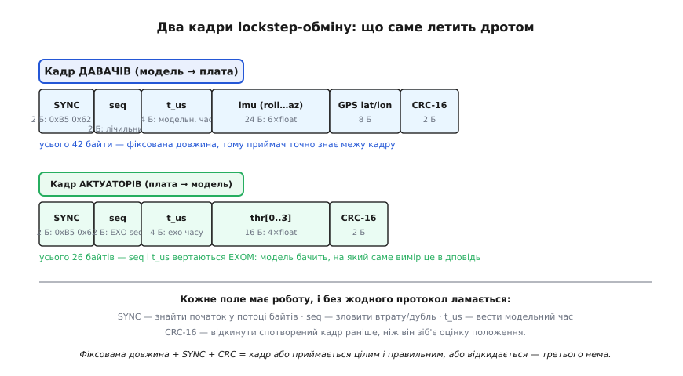

# ⚙️ Протокол lockstep-обміну: робочий кадр, такт і відновлення

Стаття-власниця вивела ідею lockstep до самого шва: `now_us()` бере час із моделі, `hil_on_sensor_frame` робить рівно один крок, плата між кадрами простоює. Але там на дроті лишилася діра, яку ми свідомо обійшли. Коли симулятор «шле виміри з міткою часу», а плата «відповідає командами на мотори» — **що саме летить дротом**? Які байти, у якому порядку, з яким захистом? Що станеться, коли USB ковтне пакет або віддасть його двічі? Як плата й модель узагалі домовляються, що обидві готові, — перш ніж перший крок зробить бодай хтось?

Це не дрібниці реалізації, які «якось напишуться». Це і є та частина, де lockstep-стенд або працює роками, або тихо зависає раз на годину без жодного повідомлення про помилку — і ти півдня шукаєш баг у законі керування, якого там немає. Тут ми зберемо протокол **цілком**: два кадри до байта, обгортку з CRC, приймач, що знаходить кадр у сирому потоці, обробник одного такту, рукостискання старту й три захисти — від втрати, від дубля, від розсинхрону міток. Код — справжній C прошивки, той самий, що заллється в плату; імена (`hil_sensors_t`, `control_step`, `now_us`, `hil_send_actuators`) — ті самі, що вже зустрічалися в статті, лише тепер під ними з'явиться дно.

## Задача: домовитися про кожен байт, бо помилки нікому пояснити

Спершу — чому це взагалі окрема робота, а не «серіалізуй структуру та й по всьому». Дротом між платою і моделлю тече **потік байтів** — USB чи UART віддає їх один за одним, без жодних меж. Він не каже «ось почався кадр, а ось скінчився»; він просто сипле байти, і серед них треба самому впізнати, де початок одного повідомлення й кінець іншого. Гірше: цей потік не ідеальний. Байт може спотворитися. Пакет USB може загубитися при перевантаженні. Драйвер може віддати той самий буфер двічі. І по обидва боки дроту сидять **дві незалежні програми** — прошивка на чипі й симулятор на ПК, — які компілювалися окремо, різними компіляторами, і мусять зрозуміти одна одну без жодного спільного слова, крім домовленого наперед формату.

Ось у чому суть задачі. Нам треба протокол, у якому виконано три речі воднораз. Перше: **знайти межу кадру** в суцільному потоці — щоб приймач завжди знав, з якого байта починати читати структуру. Друге: **впізнати зіпсутий кадр** і викинути його, поки він не отруїв оцінку положення хибним виміром. Третє — і це те, чого немає у звичайному «надіслати структуру», — **зберегти детермінізм lockstep**: кожен вимір мусить призвести рівно до одного кроку керування, ні до нуля (застрягли), ні до двох (дубль проінтегрував фізику двічі). Протокол, що виконує перші дві вимоги, але провалює третю, у SITL-lockstep працюватиме, а на HIL зрадить тихо й підступно.

> 🔧 **Навіщо це.** Може здатися, що на дроті між твоєю платою і твоїм ПК, обидва в тебе на столі, панікувати нема чого — не інтернет, звідки спотворенням узятися. Але USB-CDC (віртуальний COM-порт по USB) під навантаженням **справді** втрачає й переупорядковує пакети, а зайвий електричний шум від тих самих моторів наводить помилки в UART. І навіть якби дріт був ідеальний, лишається третя вимога — детермінізм, — яку не рятує ніяка чистота лінка: досить драйверу віддати буфер двічі (а це буває від логіки подвійної буферизації), і без лічильника кадрів плата зробить два кроки на одному виміри. Тому CRC й лічильник — не паранойя «про всяк випадок», а несуча конструкція саме HIL-стенда.

## Ідея: фіксований кадр із маркером початку, лічильником, часом і CRC

Рішення складається з чотирьох простих винаходів, кожен закриває одну зі щойно названих бід. Складені разом, вони дають кадр, який приймач або прийме цілим і правильним, або впевнено відкине — третього не буде.

**Маркер початку (SYNC).** Щоб знайти межу кадру в потоці, кладемо на його початок дві умовлені байтові константи — послідовність, яку приймач **виглядає** в потоці. Побачив ці два байти — тут імовірно початок кадру, можна читати далі. Цей прийом не ми вигадали: рівно так починає кожен свій кадр GPS-приймач u-blox — двома байтами `0xB5 0x62` (усталений факт — це преамбула протоколу UBX за офіційним описом інтерфейсу; за нею йдуть клас, ідентифікатор, довжина, тіло й двобайтова контрольна сума). Ми запозичимо саме цю пару як данину традиції — байти довільні, важливо лиш, щоб обидві сторони знали їх наперед.

**Фіксована довжина.** Наш кадр давачів завжди однакового розміру — скажімо, 42 байти. Це різко спрощує приймач: знайшов SYNC, відлічив рівно 42 байти — маєш повний кадр, знаєш, де він закінчився, і де може початися наступний. (Змінна довжина потребувала б поля довжини й обробки його спотворення — нам це ні до чого, бо набір давачів у стенді сталий.)

**Лічильник (seq).** Двобайтове число, що зростає на одиницю з кожним новим кадром давачів. Це — око протоколу на втрату й дубль. Прийшов кадр із тим самим seq, що й минулий, — це **дубль**, викидаємо. Прийшов зі стрибком через число — **загубився** кадр між ними. Без цього лічильника ні втрату, ні повтор не побачити взагалі: байти самі про себе такого не розкажуть.

**Контрольна сума (CRC-16).** У хвіст кадру дописуємо два байти, пораховані з усього вмісту за спеціальною формулою. Приймач рахує ту саму формулу над отриманими байтами й порівнює: збіглося — кадр цілий, не збіглося — бодай один біт спотворився, кадр отруєний, викидаємо не думаючи. Чому саме CRC, а не проста сума байтів, і як воно ловить помилки, яких сума не бачить, — це окрема тема; коротко тут треба знати, що [CRC (циклічний надлишковий код)](book:communications/crc) ловить усі поодинокі й здвоєні бітові помилки та будь-який пакет спотворених бітів завдовжки до розрядності суми, тоді як проста сума пропускає цілі класи спотворень. Для нашого кадру 16 біт з головою.


*Що саме летить дротом. Кадр давачів несе модельний час t_us, виміри й CRC; кадр актуаторів вертає seq і t_us **ехом**, щоб модель бачила, на який вимір це відповідь. Фіксована довжина + SYNC + CRC означають: кадр або приймається цілим і правильним, або відкидається — проміжного стану нема.*

Зверни увагу на відповідь-ехо у кадрі актуаторів: плата вертає в модель той самий `seq` і `t_us`, на які відповідає. Це не надмірність — це те, чим модель у lockstep розуміє, що плата обробила **саме** останній вимір, а не застрягла на позаминулому. Побачивши ехо свого останнього `seq`, модель знає: такт зімкнувся, можна інтегрувати фізику далі й слати наступний кадр. Так само робить PX4: його симулятор шле `HIL_SENSOR` із міткою `time_usec`, чекає у відповідь `HIL_ACTUATOR_CONTROLS` і лише тоді рахує фізику далі (усталений факт — це задокументований механізм lockstep у Simulator MAVLink API; час у повідомленнях PX4 бере з `hrt_absolute_time()`). Наш `t_us`-ехо — та сама ідея, зведена до двох полів.

## Крок 1: кадри як структури, і чому важлива їх розкладка

Почнімо з типів. Кадр давачів несе все, що модель мусить підсунути платі за один такт; кадр актуаторів — усе, що плата віддає назад. `imu_sample_t` ми вже оголошували у статті — беремо його як є й вбудовуємо.

```c
#include <stdint.h>
#include <string.h>
#include <stdbool.h>

#define HIL_SYNC0 0xB5u          // маркер початку — як преамбула u-blox UBX
#define HIL_SYNC1 0x62u
#define HIL_N_MOTORS 4

// Вимір IMU — той самий тип, що логіка керування читає через imu_read().
typedef struct {
    float roll, pitch, yaw;   // кути, рад
    float ax, ay, az;         // прискорення, м/с²
    uint32_t t_us;            // мітка часу виміру (дублює кадрову — див. нижче)
} imu_sample_t;

// КАДР ДАВАЧІВ: модель → плата. Рівно один такий кадр = рівно один крок.
typedef struct __attribute__((packed)) {
    uint8_t  sync0, sync1;    // 0xB5 0x62 — знайти початок у потоці
    uint16_t seq;             // лічильник кадрів — ловить втрату/дубль
    uint32_t t_us;            // МОДЕЛЬНИЙ час цього такту — стане now_us()
    float    roll, pitch, yaw;
    float    ax, ay, az;      // 6×float = IMU-вимір
    double   lat, lon;        // координати від «GPS» моделі (8 Б)
    uint16_t crc;             // CRC-16 усього, що вище
} hil_sensors_t;              // разом 42 байти

// КАДР АКТУАТОРІВ: плата → модель. Ехо seq/t_us каже, на що це відповідь.
typedef struct __attribute__((packed)) {
    uint8_t  sync0, sync1;
    uint16_t seq;             // ЕХО seq того виміру, що обробили
    uint32_t t_us;            // ЕХО модельного часу
    float    thr[HIL_N_MOTORS]; // тяга 0..1 на кожен мотор
    uint16_t crc;
} hil_actuators_t;            // разом 26 байтів
```

Тут ховається перша пастка, і вона типова саме для обміну між двома різними програмами. Без `__attribute__((packed))` компілятор має право **вставити невидимі дірки** між полями структури — так зване вирівнювання (padding): щоб `uint32_t t_us` ліг на адресу, кратну чотирьом, компілятор може всунути два порожні байти після `seq`. На платі це прискорює доступ до пам'яті. Але дротом ми шлемо структуру **байт у байт**, і якщо прошивка (компілятор ARM) вставила дірку там, де симулятор (компілятор x86) не вставив, — розкладка розповзеться, і `t_us` на прийомі зчитається зі сміття. `packed` наказує: жодних дірок, поля впритул, розкладка точно така, як написано. Обидві сторони мусять узгодити це однаково — інакше протокол мовчки бреше.

> 🔧 **Навіщо це.** Ця дірка-невидимка — класична причина, чому «код же правильний, а на стенді числа маячня». Логіка бездоганна, серіалізація «просто копіює структуру» — а між платою і ПК розкладка структури різна на два байти, і весь кадр з'їхав. Тому в протоколах обміну структуру або пакують явно (`packed`), або — надійніше на всі компілятори — серіалізують поле за полем у масив байтів вручну. Ми взяли `packed` для стислості; у бойовому стенді, де сторони можуть зібратися геть різними тулчейнами, безпечніше ручне пакування, бо `packed` — розширення компілятора, не гарантоване стандартом C.

## Крок 2: CRC-16 — двадцять рядків, що відкидають брехню

Перш ніж слати чи приймати кадр, треба вміти рахувати його контрольну суму. Візьмемо CRC-16/CCITT — поширений, добре вивчений варіант. Механіку поліномів лишаємо темі про CRC; ось робоча, побітна реалізація, яку зрозуміло читати (у стенді швидкість CRC не критична — кадри рідкі й короткі):

```c
// CRC-16/CCITT-FALSE: поліном 0x1021, початок 0xFFFF, без інверсії на виході.
// Побітно — повільно, але прозоро; для 40-байтового кадру цього з головою.
uint16_t crc16(const uint8_t *data, size_t n) {
    uint16_t crc = 0xFFFF;
    for (size_t i = 0; i < n; i++) {
        crc ^= (uint16_t)data[i] << 8;      // байт у старший розряд
        for (int b = 0; b < 8; b++) {
            if (crc & 0x8000)               // старший біт одиниця?
                crc = (crc << 1) ^ 0x1021;  // зсув і «ділення» на поліном
            else
                crc <<= 1;
        }
    }
    return crc;
}
```

Головне — рахувати CRC над **тими самими** байтами по обидва боки: над усім кадром **окрім** двох останніх байтів (самого поля `crc`). Домовмося на цьому явно, бо неоднозначність «а що входить у CRC» — вічне джерело несумісності між незалежними реалізаціями. Зробимо два хелпери, щоб точка відліку була одна на весь код:

```c
// Кадр давачів: CRC покриває все від sync0 до lon включно — тобто
// весь розмір структури МІНУС два байти самого поля crc наприкінці.
static uint16_t sensors_crc(const hil_sensors_t *f) {
    return crc16((const uint8_t *)f, sizeof(*f) - sizeof(f->crc));
}
static uint16_t actuators_crc(const hil_actuators_t *f) {
    return crc16((const uint8_t *)f, sizeof(*f) - sizeof(f->crc));
}
```

Тепер у нас є все, щоб і зібрати кадр на відправку, і перевірити прийнятий.

## Крок 3: приймач, що виловлює кадр із сирого потоку

Ось серце протоколу з боку плати. Байти прилітають по одному (з переривання UART чи з USB-callback), у довільні моменти, і наше завдання — з цього струмка **зібрати** повний, цілий кадр давачів, а зібравши — віддати його на обробку такту. Класичний прийом — маленький **скінченний автомат**, що йде байт за байтом: спершу полює на `SYNC0`, потім на `SYNC1`, далі накопичує тіло рівно до повного розміру, наприкінці звіряє CRC.

```c
// Стан приймача кадру давачів. Годуємо його по одному байту.
typedef struct {
    enum { WAIT_S0, WAIT_S1, IN_BODY } st;
    uint8_t  buf[sizeof(hil_sensors_t)];  // сюди складаємо кадр
    size_t   have;                        // скільки байтів тіла вже маємо
} sensor_rx_t;

static sensor_rx_t g_rx = { .st = WAIT_S0 };

// Повертає true РІВНО тоді, коли зібрано повний і CRC-цілий кадр.
// Тоді *out містить готовий кадр; інакше *out не чіпаємо.
bool sensor_rx_byte(sensor_rx_t *rx, uint8_t byte, hil_sensors_t *out) {
    switch (rx->st) {
    case WAIT_S0:
        if (byte == HIL_SYNC0) { rx->buf[0] = byte; rx->st = WAIT_S1; }
        return false;                       // ще не кадр

    case WAIT_S1:
        if (byte == HIL_SYNC1) {            // маркер повний — почалося тіло
            rx->buf[1] = byte;
            rx->have   = 2;
            rx->st     = IN_BODY;
        } else if (byte == HIL_SYNC0) {
            rx->st = WAIT_S1;               // два S0 поспіль — лишаємось напоготові
        } else {
            rx->st = WAIT_S0;               // фальстарт — усе спочатку
        }
        return false;

    case IN_BODY:
        rx->buf[rx->have++] = byte;
        if (rx->have < sizeof(hil_sensors_t))
            return false;                   // тіло ще не повне

        // Кадр набрано цілком. Звіряємо CRC.
        rx->st = WAIT_S0;                   // хай там що — далі шукаємо новий SYNC
        hil_sensors_t f;
        memcpy(&f, rx->buf, sizeof(f));
        if (f.crc == sensors_crc(&f)) {     // CRC збігся — кадр цілий
            *out = f;
            return true;
        }
        return false;                       // CRC не збігся — тихо викинули
    }
    return false;
}
```

Придивися до трьох тонкощів, кожна з яких — про надійність, а не про красу. Перша: якщо після першого `SYNC0` прийшов **не** `SYNC1`, а знову `SYNC0`, ми **не** скидаємось у самий початок, а лишаємось у `WAIT_S1` — раптом це і є справжній маркер, а перший `SYNC0` був хвостом попереднього сміття. Друга: щойно тіло набрано, ми **завжди** повертаємось у `WAIT_S0`, незалежно від того, зійшовся CRC чи ні — щоб зіпсутий кадр не заклинив приймач, а просто загубився, і ми одразу шукали наступний SYNC. Третя, найважливіша: цей приймач **не робить кроку керування**. Він лише збирає й перевіряє кадр. Що з ним робити далі — вирішує обробник такту, і саме там живе логіка lockstep.

## Крок 4: обробник одного такту — з усіма трьома захистами

Стаття показала кістяк `hil_on_sensor_frame`: узяти час, узяти вимір, один `control_step`, відповісти. Тепер повісимо на цей кістяк три захисти, без яких він зрадить на реальному, неідеальному лінку. Кожен захист — це причина **не робити** крок: дубль, порушена монотонність часу, і (для повноти) необроблений старт.

```c
// Стан такту: що ми бачили востаннє, щоб упізнати дубль і розсинхрон.
static uint16_t g_last_seq;
static uint32_t g_last_t_us;
static bool     g_stream_started = false;

static volatile uint32_t g_model_time_us;   // «зараз» для now_us()
static volatile imu_sample_t g_injected;    // вимір для imu_read()

uint32_t now_us(void) { return g_model_time_us; }  // час — з моделі, не з кварцу

// Викликаємо, коли sensor_rx_byte() віддав повний CRC-цілий кадр.
void hil_on_sensor_frame(const hil_sensors_t *f) {
    // ── ЗАХИСТ 1: дубль. Той самий seq, що й минулого разу?
    if (g_stream_started && f->seq == g_last_seq)
        return;                         // повтор — НЕ робимо другий крок на тому ж виміри

    // ── ЗАХИСТ 2: монотонність часу. Модельний час мусить лише зростати.
    if (g_stream_started && f->t_us <= g_last_t_us)
        return;                         // мітка стрибнула назад/стала — кадр підозрілий, викид

    // (втрату кадру — стрибок seq через число — у lockstep НЕ караємо: див. нижче)
    g_last_seq = f->seq;
    g_last_t_us = f->t_us;
    g_stream_started = true;

    // ── Такт: підставляємо модельні час і вимір, робимо РІВНО один крок.
    g_model_time_us = f->t_us;          // модельний час стає «зараз»
    g_injected.roll = f->roll; g_injected.pitch = f->pitch; g_injected.yaw = f->yaw;
    g_injected.ax = f->ax; g_injected.ay = f->ay; g_injected.az = f->az;
    g_injected.t_us = f->t_us;

    float thr[HIL_N_MOTORS];
    control_step(thr);                  // один крок петлі: imu_read → фільтр → мікшер

    // ── Відповідь: ехо seq/t_us, щоб модель знала, на що це відповідь.
    hil_send_actuators_framed(thr, HIL_N_MOTORS, f->seq, f->t_us);
}
```

Захист від **дубля** (перевірка `f->seq == g_last_seq`) — найважливіший з трьох саме для lockstep, і варто зрозуміти, чому. Уяви, що USB-драйвер віддав той самий кадр двічі (буває від подвійної буферизації). Без цієї перевірки плата зробила б **другий** `control_step` на тому самому `t_us`. Оцінка положення інтегрує гіроскоп по проміжку часу — а проміжок тут нульовий (час не зрушив), тож фільтр або поділить на нуль, або зробить порожній, але зайвий крок, і, головне, відповість моделі другим кадром актуаторів. Модель, побачивши **два** ехо на один свій вимір, зіб'ється з рахунку lockstep. Один рядок перевірки seq вирізає весь цей клас лиха під корінь.

Захист від **розсинхрону міток** (`f->t_us <= g_last_t_us`) стереже те, на чому тримається весь час-за-швом. Якщо в модель заповзе баг і вона надішле мітку, меншу за попередню, фільтр оцінки положення порахує Δt = `t_us − g_last_t_us` **від'ємним** — а це в кращому разі маячня в оцінці, у гіршому — NaN, що розповзеться по всьому стану керування й уже нікуди не дінеться. Дешевше відкинути такий кадр і зачекати нормального, ніж рятувати отруєний фільтр.

А от **втрату** кадру (стрибок seq через число, скажімо з 8 на 10) ми свідомо **не** караємо — і тут криється сама природа lockstep, яку легко проґавити. У вільному ході втрата була б бідою: плата бігла б далі на старому виміри. Але в lockstep модель **фізично не шле** наступний кадр, доки не отримає ехо на попередній. Тому в усталеному lockstep-потоці seq просто **не може** перескочити — черга завжди з одного кадру. Якщо стрибок усе ж стався, це означає не «загубився кадр у польоті», а «потік щойно перезапустився» — модель скинулась, стартувала нову сесію. Правильна реакція на це — не лаятись на пропуск, а **прийняти новий seq як новий відлік** (що код і робить: просто оновлює `g_last_seq`). Карати за «діру» тут було б помилкою: ми відкинули б перший кадр законного нового потоку й зависли б назавжди, чекаючи неможливого.


*Один лічильник seq (плюс перевірка монотонності t_us) ловить усі три біди лінка. У lockstep втрата майже неможлива — черга з одного кадру, — тож головні спрацьовування це дубль і розсинхрон. Правило єдине: крок роби, лише якщо seq зріс рівно на одиницю І модельний час строго виріс; інакше тихо відкинь і лишись на старому стані.*

## Крок 5: збирання кадру актуаторів на відповідь

Обробник кличе `hil_send_actuators_framed` — доробимо його. Це дзеркало приймача: беремо числа тяги, кладемо в структуру, проставляємо ехо seq/t_us, рахуємо CRC і випихаємо байти в лінк. Тут з'являється й обіцяне статтею `hil_send_actuators` — воно тепер просто найтонша обгортка, що не морочиться з seq (для випадків поза строгим ехо):

```c
extern void link_write(const uint8_t *data, size_t n);  // UART/USB — байти в лінк

void hil_send_actuators_framed(const float thr[], int n,
                               uint16_t echo_seq, uint32_t echo_t_us) {
    hil_actuators_t f;
    f.sync0 = HIL_SYNC0;
    f.sync1 = HIL_SYNC1;
    f.seq   = echo_seq;                 // ЕХО: на цей вимір відповідаємо
    f.t_us  = echo_t_us;
    for (int i = 0; i < HIL_N_MOTORS; i++)
        f.thr[i] = (i < n) ? thr[i] : 0.0f;
    f.crc = actuators_crc(&f);          // CRC над усім, окрім себе

    link_write((const uint8_t *)&f, sizeof(f));  // 26 байтів у лінк
}
```

Симетрія тут не випадкова, а сама суть надійного обміну: **однакова обгортка з обох боків**. Модель збирає кадр давачів рівно так — SYNC, seq, час, тіло, CRC — і розбирає кадр актуаторів тим самим автоматом, що плата розбирає давачі. Один формат, дзеркально прочитаний із двох кінців. Саме тому дві незалежно написані програми й розуміють одна одну без жодного спільного рядка коду.

## Крок 6: рукостискання старту — хто перший ступить

Лишилося найтонше, про що легко забути, поки воно не підвісить стенд намертво: **як обидві сторони домовляються почати**. У lockstep кожна сторона чекає на іншу — плата чекає кадр давачів, модель чекає кадр актуаторів. Але на самому старті **обидві** чекають, і якщо ніхто не ступить першим, вони зависнуть у вічному взаємному очікуванні. Це дедлок, класичний як світ: двоє в дверях, кожен пропускає іншого, ніхто не проходить.

Розв'язок — призначити, **хто ходить перший**, і зробити це асиметрично. Природний вибір: перший крок робить **модель**. Вона надсилає найперший кадр давачів (seq = 0), нічого не чекаючи, — і цим запускає коло. Плата до першого кадру просто сидить у `WAIT_S0` і нічого не ініціює. Отримала перший валідний кадр — обробила такт, відповіла — і з цієї миті лінивий пінг-понг lockstep поїхав сам.

Але є ще одна пастка, гостра саме на старті: **напівстарі байти в буфері**. Коли стенд щойно ввімкнули або перепідключили USB, у приймачі плати може лежати шматок недокадру з минулої сесії — і перший справжній SYNC приклеїться до цього хвоста. Тому старт роблять **явним**, а не «просто перший кадр серед потоку». Дамо платі функцію, що чекає саме **чистого** першого кадру й скидає весь стан під нову сесію:

```c
// Готовність до нової сесії: викинути недогризки минулого потоку,
// дочекатися ПЕРШОГО цілого кадру давачів — і лише тоді відкрити lockstep.
void hil_await_handshake(void) {
    g_rx.st = WAIT_S0;                   // забути будь-який напівкадр у приймачі
    g_stream_started = false;            // seq/час — з чистого аркуша

    hil_sensors_t first;
    uint8_t byte;
    for (;;) {
        if (!link_read_byte(&byte))      // блокуюче читання одного байта з лінку
            continue;
        if (sensor_rx_byte(&g_rx, byte, &first)) {  // зібрався цілий CRC-кадр?
            hil_on_sensor_frame(&first); // перший такт — і поїхали
            return;                      // далі кадри йдуть звичайним шляхом
        }
    }
}
```

Тонкість тут — рядок `g_stream_started = false`. Він каже: цей перший кадр не має з чим порівнювати seq і час, тож захисти від дубля й розсинхрону його **пропускають** (обидві перевірки в обробнику стоять під `if (g_stream_started …)`). Інакше перший кадр із seq = 0 і якимось `t_us` не мав би попередника, а порівняння з нулем випадково відкинуло б законний старт. Одна булева змінна чесно розрізняє «ще нічого не бачив» і «уже в потоці» — і рятує від хибного спрацьовування захистів на самому вході.

> 🔧 **Навіщо це.** Пропущене рукостискання — найпідступніший баг у HIL, бо він **не помилка коду**, а помилка порядку. Логіка бездоганна, кадри правильні, CRC сходиться — а стенд просто висить після ввімкнення, і в логах порожньо. Причина завжди та сама: обидві сторони чекають одна одну, бо ніхто не призначений ходити першим, або плата приклеїла перший SYNC до сміття з минулого разу. Тому в кожному lockstep-стенді має бути **явна** відповідь на два питання — хто ступає перший і як він переконується, що потік чистий. Ми відповіли: перша ходить модель, плата скидає буфер і чекає перший цілий кадр. Двадцять рядків, які відрізняють стенд, що заводиться з першого разу, від стенда, який «іноді не стартує, перезавантаж USB».

## Складність і пастки: де цей протокол ламається тихо

Протокол зібрано; тепер чесно про те, де він кусається — бо кожна з цих пасток коштувала комусь загубленого дня, і всі вони мовчазні: код не падає, він просто робить не те.

**Пастка перша, головна: прямий виклик таймера в петлі.** Це та сама пастка, яку стаття назвала найгіршою, і в коді протоколу вона підстерігає в кожному місці, де хтось за звичкою напише `micros()` замість `now_us()`. Уяви, що всередині `control_step` фільтр оцінки положення міряє Δt так: `dt = micros() - prev; prev = micros();`. У бойовій збірці — правильно. У lockstep — катастрофа, і **тиха**: вимір плата бере з моделі (по `g_injected`), а Δt міряє по **кварцу плати**. Модельний час стоїть, поки чекаємо наступний кадр, а кварцовий біжить — тож фільтр думає, що між двома IMU-вибірками минуло, скажімо, 3 мілісекунди реального очікування, хоча модель зробила крок на 2.5 мс модельного часу. Гіроскоп інтегрується по неправильному Δt, оцінка орієнтації пливе — і не тому, що фільтр поганий, а тому, що **один виклик часу втік із-під шва**. Детермінізм, за який ти заплатив швидкістю lockstep, тихо зіпсувався в одному рядку. Ліки одні: у HIL-збірці **весь** час іде через `now_us()`, дисципліновано, без винятків — жодного прямого `micros()`, `HAL_GetTick()`, `esp_timer_get_time()` у гарячій петлі. Це не стиль, це умова коректності.

**Пастка друга: CRC над різними діапазонами.** Дві сторони мусять рахувати CRC над **точно** тими самими байтами. Досить одній рахувати з SYNC, а другій — з поля після SYNC, і CRC ніколи не зійдеться: кожен кадр відкидається, стенд не бачить жодного виміру й висне, ніби лінк мертвий. Баг диявольський тим, що обидві реалізації CRC «правильні» поодинці — розходяться лише в межах діапазону. Тому ми й винесли `sensors_crc`/`actuators_crc` в один хелпер із явною формулою `sizeof(*f) - sizeof(f->crc)`: щоб точка відліку була **одна**, записана раз, а не вгадувалась двічі.

**Пастка третя: порядок байтів (endianness).** `uint32_t t_us` — чотири байти; плата (ARM) і ПК (x86) обидва зазвичай **little-endian**, тож у нашому стенді пронесе. Але щойно один бік стане big-endian (буває на екзотичних цільових чипах чи мережевих проксі), `t_us` прочитається з переставленими байтами — і час стрибне на мільйони. Надійний протокол фіксує порядок явно (наприклад, усе little-endian, з ручним пакуванням у байти), а не покладається на те, що «обидва однакові». Ми цю залежність тут прийняли свідомо заради стислості — але знати про неї мусиш, бо це саме той баг, що не виникне на твоєму столі й вилізе на чужому.

**Пастка четверта: тайм-аут проти вічного очікування.** Наш `hil_await_handshake` чекає перший кадр **нескінченно**. Якщо модель не запустилась чи кабель не той, плата зависне тихо. У бойовому стенді додають тайм-аут: не прийшов перший кадр за секунду — блимнути світлодіодом помилки, написати в консоль «немає лінка з моделлю», а не мовчки висіти. Те саме — в усталеному потоці: якщо черговий кадр давачів не прийшов за розумний час (модель упала посеред сесії), плата має це **помітити** й перейти у безпечний стан, а не чекати вічно на мертву модель. Ми лишили ці тайм-аути за кадром, щоб не затуляти кістяк, — але у справжньому стенді вони обов'язкові, бо різниця між «стенд повідомив про обрив» і «стенд просто висить» — це різниця між п'ятьма хвилинами й половиною дня пошуків.

**Пастка п'ята, тонка: подвійна мітка часу.** Ти помітив, що `t_us` є і в кадрі (`hil_sensors_t.t_us`), і всередині вкладеного `imu_sample_t.t_us`. Це навмисне дублювання, і воно може розійтися, якщо необережно заповнювати кадр на боці моделі. Домовленість проста: **кадровий** `t_us` — головний, це модельний час такту; вкладений у вимір — має дорівнювати йому. Обробник вище так і робить (`g_injected.t_us = f->t_us`). Але якби модель проставила їх різними, фільтр міг би взяти час виміру з одного поля, а крок лічити по іншому — знову тихий розсинхрон. Мораль та сама, що червоною ниткою йде крізь увесь протокол: **одне джерело правди на кожну величину**, і жодних «майже однакових» дублів, які колись розійдуться.

## Що лишається в руках

Ми пройшли шлях від «модель шле виміри, плата відповідає» до кожного байта на дроті — і по дорозі стало видно, що lockstep-протокол простий у ідеї, але вимогливий у чесності. Кадр — це SYNC, щоб знайти початок; seq, щоб зловити дубль і розпізнати новий потік; `t_us`, щоб вести модельний час і стерегти його монотонність; CRC, щоб відкинути спотворене раніше, ніж воно отруїть оцінку. Обробник такту робить рівно один крок на кадр — і три захисти пильнують, щоб «рівно один» лишалося правдою навіть на неідеальному лінку. Рукостискання призначає, хто ходить перший, і чистить буфер під нову сесію.

А наскрізна мораль одна, і вона глибша за будь-який окремий рядок: **детермінізм lockstep живе не в законі керування, а в дисципліні на його межі**. Один прямий виклик таймера, один розбіжний діапазон CRC, один зайвий крок на дублі — і стенд, що коштував тобі заліза й часу, починає брехати зеленим і червоним однаково безпідставно. Тому кожне поле кадру має роботу, кожен захист — причину бути, а кожна величина — рівно одне джерело. Зроблено так — і той самий код, що ловив гонки й brownout на справжньому чипі, обмінюється з моделлю надійно, крок за кроком, годинами поспіль, без жодного тихого зависання посеред «польоту» на столі.
