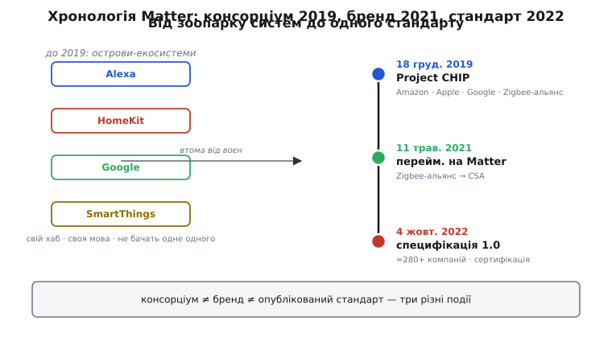

# 📜 Кінець воєн екосистем: як народився Matter

Уяви кімнату 2018 року, де вже живе «розумний дім». На полиці — лампа, яку купили, бо нею керує Alexa. У розетці — вимикач, який слухається лише Google Assistant. На стіні — замок, що працює тільки з Apple HomeKit. І десь у кутку — хаб SmartThings, до якого прив'язані датчики руху. Кожна з цих речей робить приблизно те саме: вмикається, вимикається, повідомляє свій стан. Але жодна з них не бачить сусідку. Щоб увімкнути світло, коли спрацював датчик, треба, щоб датчик і лампа говорили однією мовою — а вони говорять чотирма різними, і кожен виробник цю мову тримає при собі.

Це і є той стан речей, який в індустрії напівжартома називали **війнами екосистем** (ecosystem wars). І саме з утоми від цих воєн народився стандарт, який ми розбираємо в цій темі. Історія коротка — усього кілька років, — але повчальна, бо показує рідкісну річ: як чотири компанії, що звикли воювати за той самий будинок, сіли за один стіл. Розберімося, що саме їх туди привело, у якому порядку відбувалися події (їх легко сплутати) і чому в самій основі задуму лежала вимога працювати **локально**, без походу в чужу хмару за кожним натиском вимикача.

## Зоопарк, з якого не було виходу

Щоб відчути силу мотивації, спершу треба відчути силу болю. А біль тут був не в тому, що систем багато, — біль був у тому, що вони **множилися** в кожній точці ланцюга.

Почнімо з покупця. Він приходить у крамницю по розумну лампочку й бачить на коробці дрібний рядок значків: «works with Alexa», «works with Google», «works with HomeKit». Якщо в нього вдома телефон Apple, а колонка від Amazon, — котрий значок йому потрібен? Часто відповідь була: **обидва, і все одно не факт**. Бо «works with» означало, що виробник лампи окремо написав місток до Alexa, окремо — до Google, окремо — до Apple, і кожен місток жив своїм життям: десь оновлення прийшло, десь застрягло, десь відвалилося після зміни хмарного API. Покупець ставав заручником комбінації, яку не він вигадав.

Тепер — виробник лампи. Щоб продавати ширше, він мусив **написати ту саму лампу тричі**: під протокол Amazon, під протокол Google, під протокол Apple. Кожен зі своїми правилами, своєю сертифікацією, своїми серверами. Для великого гравця це дорого; для малого стартапу — часто непідйомно. І це ще до того, як згадати радіо: хтось будував на Wi-Fi, хтось на Zigbee, хтось на Z-Wave, хтось на Bluetooth, і кожне радіо тягло за собою свій хаб-перекладач.

> 🔧 **Навіщо це.** Коли ти пишеш прошивку для вузла розумного дому, ця історія — не музейний факт, а пояснення, чому Matter улаштований саме так. Стандарт вимучений із конкретного болю: «одна прошивка — один опис пристрою — усі системи розуміють». Знаючи, від чого тікали, легше зрозуміти, чому в Matter пристрій просто каже «я термостат» замість того, щоб носити окрему візитівку кожній екосистемі.

І над усім цим — виробник екосистеми. Apple, Google, Amazon кожен вкладав шалені гроші в свій «дім», і кожному було вигідно, щоб пристрої тягнулися саме до нього: що більше ламп «works with Alexa», то міцніше покупець сидить у світі Amazon. Це називають **прив'язкою до екосистеми** (ecosystem lock-in), і вона довго була не багом, а стратегією. HomeKit від Apple тут страждав окремо: високі вимоги безпеки означали, що виробник мусив ставити в пристрій спеціальний чип автентифікації «Made for iPhone», через що сумісних пристроїв було мало, коштували вони дорожче, а список їх ріс повільно. *(Статус: усталено; описано в галузевих оглядах того періоду.)*

Виходить замкнене коло. Покупцеві незручно — але він уже вклався в одну екосистему й не хоче все викидати. Виробникові дорого — але він мусить підтримувати всіх, бо покупці розкидані. Екосистемам вигідно тримати стіни — але стіни й відлякують покупців від усієї категорії. Усі невдоволені, а зрушити ніхто поодинці не може: перша компанія, що «відкриється», начебто дарує перевагу конкурентам. Класична пастка, з якої немає одностороннього виходу — вийти можна лише **всім разом**.

## Грудень 2019: чотири суперники сідають за стіл

Вихід почався 18 грудня 2019 року. Того дня Amazon, Apple, Google й **Zigbee-альянс** (Zigbee Alliance — галузеве об'єднання сотень компаній навколо радіостандарту Zigbee) оголосили, що створюють спільну робочу групу й нову відкриту специфікацію. Назвали задум **Project Connected Home over IP** — «проєкт під'єднаного дому поверх IP», скорочено **CHIP**. *(Статус: усталено; підтверджено синхронними пресрелізами всіх учасників, зокрема Apple, від 18 грудня 2019 року.)*

Уже в назві — уся суть і головна ставка. **«over IP»** означало: хай пристрої говорять звичайним інтернет-протоколом (IP), тим самим, що й уся решта мережі, а не десятком закритих діалектів. Тоді перекладачі-хаби між екосистемами стають не потрібні — усі вже в одній мережі й на одному базовому протоколі. А слово **«Connected Home»** чесно окреслювало межу задуму: дім, а не заводи чи міста; побутові речі, які покупець ставить сам.

Варто одразу розрізнити три речі, які потім легко зіллються в пам'яті в одну, — бо це різні події з різними датами:

```
подія          що це насправді                     коли
────────────   ─────────────────────────────────   ─────────────
консорціум     хто сів за стіл (Project CHIP)       18 груд. 2019
бренд          як це назвали для світу (Matter)     11 трав. 2021
стандарт       опублікований документ (спец. 1.0)   4 жовт. 2022
```

Тобто спершу зібралася **коаліція** й почала працювати; лише через півтора року вона дала задуму гучне ім'я; і ще через півтора року з'явився власне **готовий стандарт**, за яким можна виробляти й сертифікувати. Плутати їх — усе одно що плутати день заручин, день, коли обрали ім'я дитині, і день, коли дитина народилася.



*Три віхи, які легко сплутати: коаліція зібралася 2019-го, ім'я з'явилося 2021-го, документ — 2022-го.*

Чому саме ці четверо і чому саме тоді? Тут важлива точність, бо навколо таких оголошень швидко наростають спрощення. Формальних **засновників-ініціаторів** було чотири: Amazon, Apple, Google й Zigbee-альянс. Але робочу групу того ж дня посилив цілий ряд компаній із ради Zigbee-альянсу — серед названих у пресрелізі були **Samsung SmartThings**, IKEA, Legrand, NXP Semiconductors, Resideo, Schneider Electric, Signify (колишня Philips Lighting), Silicon Labs, Somfy й Wulian. *(Статус: усталено; поіменний список — із пресрелізу Apple від 18 грудня 2019 року.)* Тому коли пишуть, що «Matter заснували п'ятеро, разом із Samsung» — це не помилка й не суперечність: Samsung SmartThings справді був у групі з першого дня, просто не серед чотирьох ініціаторів оголошення, а серед board-компаній Zigbee-альянсу, що приєдналися. Розрізняти «ініціатор» і «учасник з першого дня» тут доречно — інакше історія перетворюється на суперечку, якої немає.

Мотив, який учасники назвали вголос, звучав стримано: «спростити розробку для виробників і підвищити сумісність для покупців». За цією канцелярською формулою — рівно той біль, що ми розібрали: годі писати кожну лампу тричі, годі змушувати покупця вгадувати комбінацію значків. Прикметно, що жоден із них не міг зробити це поодинці — і саме тому оголошення було **спільним**. Amazon без Apple не встановив би стандарт (лишалася б стіна HomeKit); Apple без Google — теж (лишалася б стіна Android). Стандарт має сенс лише тоді, коли за столом сидять усі, чиї стіни ти хочеш прибрати. Це рідкісний випадок, коли конкуренція логічно змушує до співпраці: цінність спільної мови для кожного більша, ніж перевага від власної стіни, — але тільки якщо мову приймуть **усі одночасно**.

## Локально за задумом: чому це не дрібниця

Тепер — про рису, заради якої цю історію взагалі варто розповідати інженерові, а не лише згадати три дати. У самій архітектурі «over IP» була закладена річ, якої закритим екосистемам якраз бракувало: пристрої мали керуватися **в межах домашньої мережі**, без обов'язкового походу в хмару виробника на кожну дію.

Розберімо, чому це випливає саме з «over IP», а не додано як гасло. Якщо вимикач і лампа обидва — звичайні вузли однієї домашньої IP-мережі, то натиснути вимикач означає **послати пакет сусідові по тій самій мережі**: від вимикача до лампи, через локальний Wi-Fi, Thread чи Ethernet. Мережевому пакету нема потреби виходити в інтернет, летіти на сервер у чужому дата-центрі й вертатися назад лише для того, щоб увімкнути лампу за два метри. У старій, хмароцентричній моделі саме так і бувало: натиск вимикача летів на сервер Amazon, там опрацьовувався й повертався командою лампі — тому світло вмикалося з відчутною затримкою, а варто було впасти інтернету чи вимкнутися далекому серверу, як розумний дім тупів на очах.

Ось де порівняння з реальністю потребує чесності, бо тут легко перебільшити. Будувати систему так, щоб керування жило в домашній мережі, — це **архітектурний принцип** Matter, який прямо випливає з IP-основи й підтверджений тим, як стандарт працює: вузли спілкуються по локальній мережі, і базове керування не потребує інтернету. Але це не варто подавати як окремий пункт-мандат, урочисто вписаний у перше оголошення 2019 року: тодішній пресреліз говорив радше про сумісність і про взаємодію «пристроїв, застосунків і хмарних сервісів», а не про заборону хмари. *(Статус: перевірено — «локальне за замовчуванням» коректне як опис архітектури й поведінки Matter; формулювання «обов'язкова вимога, записана від першого дня» джерелами не стверджується, тож так його подавати не будемо.)* Різниця тонка, але для інженера принципова: локальність тут — **наслідок вибору IP як фундаменту**, а не окрема заповідь.

І межу цієї локальності теж назвімо чесно, бо вона важлива на практиці. «Працює локально» стосується самого керування пристроями: увімкнути, вимкнути, прочитати стан, зв'язати датчик із лампою — це житиме й без інтернету, поки в мережі є контролер Matter. Але **голосові помічники — інша річ**: щоб Siri, Alexa чи Google Assistant зрозуміли фразу «увімкни світло у вітальні», їм треба розпізнати мову, а це й досі роблять у хмарі. Тож без інтернету лампа слухатиметься застосунку в телефоні по локальній мережі, але не слухатиметься голосу. І частина пристроїв додає власні функції, які теж тягнуться в хмару виробника. *(Статус: усталено; підтверджено документацією й практичними оглядами Matter.)* Локальність Matter реальна, але вона про **керування**, не про геть усе.

Чому це варто тримати в голові, пишучи прошивку? Бо саме тут відповідь на питання «а що з моїм пристроєм, коли впаде інтернет». У світі закритих хмар відповідь була сумна: нічого не працює. У світі Matter відповідь інша: базове керування лишається живим, бо пакет ходить від вузла до вузла по твоїй же мережі, а не через океан і назад.

## Травень 2021: у задуму з'являється ім'я

Півтора року коаліція працювала під робочою назвою CHIP — назвою радше для інженерів, ніж для коробки в крамниці. 11 травня 2021 року відбулися одразу дві пов'язані події, і їх варто розрізняти.

Перше: **Zigbee-альянс перейменувався на Connectivity Standards Alliance** (Альянс стандартів зв'язку, скорочено **CSA**). Логіка проста: організація давно переросла єдиний радіостандарт Zigbee, а нове ім'я мало показати, що вона опікується стандартами зв'язку взагалі, не лише Zigbee. Сам Zigbee при цьому нікуди не зник — альянс і далі його розвиває й зберігає його бренд; змінилася назва **організації-парасольки**, а не окремого протоколу. *(Статус: усталено; підтверджено оголошенням альянсу від 11 травня 2021 року.)*

Друге, того ж дня: **Project CHIP дістав публічне ім'я Matter** — і разом із ним логотип, який задумували як «печатку якості»: побачив знак Matter на коробці — знаєш, що річ працюватиме надійно, безпечно й із будь-якою сумісною системою. *(Статус: усталено; те саме оголошення 11 травня 2021 року.)* Слово «Matter» англійською водночас означає й «матерія, речовина», і «мати значення, бути важливим» — гра, яку вибрали навмисне: мовляв, це та основа, з якої зроблено розумний дім.

Тут корисно ще раз спіймати себе на спокусі спростити. Легко сказати «2021 року заснували Matter» — і це буде неточно. Заснували коаліцію 2019-го; 2021-го їй **дали ім'я** й показали світові. Народження ідеї та її хрестини — різні дати, і плутати їх означає стирати півтора року реальної інженерної роботи, що йшла між ними.

## Жовтень 2022: народжується сам стандарт

І нарешті — те, заради чого все затівалося. 4 жовтня 2022 року Connectivity Standards Alliance опублікував **специфікацію Matter 1.0** — власне готовий документ, за яким можна виробляти пристрої й проходити сертифікацію. Разом зі специфікацією відкрилися авторизовані випробувальні лабораторії, вийшли інструменти перевірки й **відкритий SDK** — референсна реалізація з відкритим кодом, щоб виробникам не починати з нуля. До того моменту під парасолькою CSA працювало вже понад 280 компаній, серед провідних називали Amazon, Apple, Comcast, Google, Samsung SmartThings і Signify. *(Статус: усталено; підтверджено оголошенням CSA «Matter Arrives» від 4 жовтня 2022 року.)*

Різниця між «є специфікація» і «є готова коаліція» — не формальність. До 4 жовтня 2022-го існувала домовленість, напрям, працездатні напрацювання. Після — існував **стандарт, який можна взяти й реалізувати**: із номерами версій, тестами, сертифікацією. Це та сама відмінність, що між кресленням мосту й мостом, яким уже можна їхати. Саме від цієї дати починається відлік реальних пристроїв: оновлення для наявних систем пішли наприкінці 2022-го, а Matter-пристрої на полицях — з 2023-го.

І тут доречно тверезо додати те, чого ця історія не приховує. Стіни не впали в один день. Кожен із гігантів, домовившись про спільну мову, водночас і далі пильнував власну екосистему: те, як Matter-пристрій поводиться в Apple Home, Google Home чи SmartThings, досі різниться, а частину зручностей кожен лишає «своїм». Коаліція проти фрагментації — сама теж місце безперервного торгу, і чимало компромісів стандарту — сліди цього торгу. *(Статус: усталено; це стала критика Matter у галузевих оглядах.)* Кінець воєн екосистем — радше перемир'я з єдиною спільною мовою, ніж повне роззброєння. Але навіть перемир'я, у якому лампа нарешті бачить датчик незалежно від значків на коробці, — величезний зсув проти зоопарку 2018 року, з якого ми почали.

## Що з цієї історії лишається інженерові

Три дати варто закарбувати саме як три різні події: **18 грудня 2019-го** зібралася коаліція (Project CHIP), **11 травня 2021-го** задум дістав ім'я Matter (а Zigbee-альянс став CSA), **4 жовтня 2022-го** вийшла специфікація 1.0. Не одна подія у трьох переказах, а три кроки: заручини, ім'я, народження.

Але головне — не дати, а **чому**. Matter — це не чергова красива абревіатура, а вимучена відповідь на цілком конкретний біль: покупець-заручник комбінації значків, виробник, що пише ту саму річ утричі, екосистеми, яким вигідні стіни, і всі троє в пастці, з якої немає одностороннього виходу. Вихід знайшли рівно тому, що сіли **всі разом** і поклали в основу звичайний IP — а з нього природно випливло, що керувати можна **локально**, у межах свого дому, без обов'язкового поклону чужій хмарі за кожним натиском вимикача. Саме цю логіку — «один опис пристрою, спільна мова, локальне керування» — ми й побачимо в дії, коли візьмемося за конкретні вузли й прошивку.

*Статус фактів: усталено. Ключові дати (18 грудня 2019, 11 травня 2021, 4 жовтня 2022), склад засновників і учасників, перейменування Zigbee-альянсу на CSA та Project CHIP на Matter підтверджені синхронними першоджерелами — пресрелізами Apple й Connectivity Standards Alliance та галузевими оглядами. «Локальне за замовчуванням» подано як архітектурний принцип Matter (наслідок IP-основи), а не як письмову вимогу першого оголошення — саме так, як це стверджують джерела; межу локальності (голосові помічники потребують хмари) названо окремо.*
