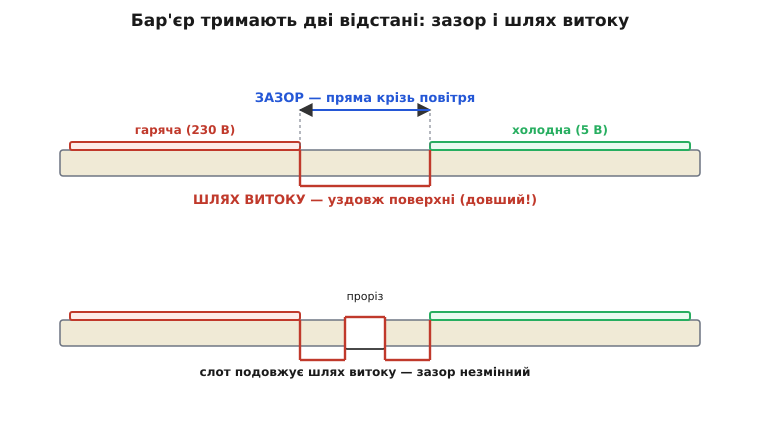

# Живлення побутового пристрою: від мережі, безпечно, з малим standby — глибше

<preknowlist>
- [Зворотноходовий перетворювач](book:electronics/flyback-isolated) — трансформатор запасає енергію в паузі й віддає її в паузі, зчіплюючи мережу й вихід лише полем; це ізольований AC/DC.
- [LDO](book:electronics/ldo) — лінійний регулятор як керований резистор: спалює зайву напругу теплом, тихий, але гріється на різниці Vin−Vout.
- [Buck](book:electronics/buck) — імпульсний знижувальний перетворювач: рубає вхід ключем і згладжує котушкою, ККД 85–95 %, але шумить.
- [Безпека мережі](book:electronics/mains-safety) — чому ~30 мА крізь грудну клітку зупиняють серце; поріг відпускання, шлях струму, роль землі.
- [Кидок увімкнення](book:electronics/inrush-ntc) — порожні конденсатори на вмиканні смикають струм у рази вищий за робочий; приборкує NTC-термістор.
- [Режими сну](book:programming/sleep-modes) — як приспати процесор до мікроамперів так, щоб він прокинувся вчасно й пам'ятав потрібне.
- [Вузол розумного дому](root:embedded/smart-home-node) — звідки ми взяли вузол, що дрімає й слухає мережу; тут він переїжджає жити в стіну.
</preknowlist>

У [базовому кроці](root:embedded/home-device-power) ми провели живлення побутового вузла від стіни й побачили головне: тракт розпадається на чотири щаблі, ізоляцію купують готовою, точковий регулятор вибирають між LDO і buck за теплом, а спокій ловлять з обох кінців — тихий блок плюс сон чипа. Цього досить, щоб зробити пристрій правильно. Але «зробити правильно» і «розуміти, чому інакше не можна» — різні глибини, і саме друга рятує тебе, коли готове рішення раптом не лягає: модуль гріється дужче за паспорт, standby пробиває норматив на волосину, сертифікаційна лабораторія завертає плату через зазор на пів міліметра. Тут ми спускаємося на шар нижче — до фізики бар'єра, до виведення тих формул, які в базовому кроці лишилися відповідями без розрахунку, і до тих граничних випадків, де рішення «за замовчуванням» ламається.

Веду нитку тим самим ланцюгом — від стіни до чипа, — але тепер зупиняюся на кожному щаблі довше й питаю не «що робити», а «звідки береться саме таке число». Почнемо з бар'єра, бо він тримає життя користувача, а в базовому кроці ми лише сказали «купи готовий» — не пояснивши, **що саме** купуємо і чому це не можна відтворити на коліні.

## Анатомія бар'єра: дві відстані, які плутають ціною життя

Гальванічний бар'єр — не абстракція «мережа окремо, логіка окремо». Це фізична конструкція, яку тримають **дві різні відстані**, і хто плутає їх, той будує пастку. Розберімо їх до дна, бо саме на них завертають плати сертифікаційні лабораторії.

Уяви дві мідні доріжки на платі: одна на гарячому боці (230 В), друга на холодному (5 В). Пробій між ними може статися двома різними шляхами, і кожен має свою міру. Перший шлях — **крізь повітря**, найкоротшою прямою між провідниками. Це **зазор** (англ. *clearance*): пряма лінія повітрям, яку мусить перестрибнути дуга, щоб пробити. Другий шлях — **уздовж поверхні** діелектрика (текстоліту плати, корпусу трансформатора): струм повзе по поверхні, і цей шлях зветься **шлях витоку** (англ. *creepage*, «повзіння»). Ключова підступність: creepage завжди **довший або рівний** clearance, бо повзти вздовж поверхні — це огинати всі виступи, тоді як повітрям можна навпростець.


*Бар'єр тримають дві незалежні відстані. Зазор (clearance) — пряма крізь повітря: її пробиває дуга, і вона задає стійкість до короткочасних піків напруги. Шлях витоку (creepage) — дорога вздовж поверхні діелектрика: по ній струм повзе повільно через бруд і вологу, і вона задає стійкість до тривалого «протікання» по забрудненій поверхні. Creepage завжди ⩾ clearance. Хитрий прийом унизу: прорізаний у платі слот (щілина) різко подовжує шлях витоку, бо струм мусить обходити її краєм, — зазор при цьому не змінюється. Саме тому в мережевих модулях бачиш прорізи в текстоліті під трансформатором.*

Чому їх дві, а не одна? Бо руйнують ізоляцію два різні вороги. Зазор пробиває **короткочасний пік напруги** — блискавка навела 4 кіловольти на секунду, і дуга проскочила повітрям там, де воно найтонше. Шлях витоку губить **час і бруд**: осідає пил, конденсується волога, і по цій вологій плівці струм починає повзти навіть за робочої напруги — повільно обвуглюючи поверхню, аж поки вона не стане провідною доріжкою (це зветься трекінг). Тому зазор рахують від піків напруги, а creepage — ще й від **ступеня забруднення** (pollution degree) і від **матеріалу** поверхні (порівняльний індекс трекінгу, CTI). Побутовий пристрій живе в брудному, вологому повітрі кухні чи ванної — це другий-третій ступінь забруднення, і creepage там треба чималий.

Тепер числа, і тут два рівні захисту, які плутати не можна. **Основна ізоляція** (basic insulation) — один шар, що відділяє живе від решти; його при 230 В вистачає приблизно на 3 мм creepage. Але цього мало для того, чого торкається людина: якщо єдиний шар пробило — усе, корпус під фазою. Тому там, де за бар'єром пальці користувача, ставлять **підсилену ізоляцію** (reinforced insulation) — вона одна дає той самий захист, що два незалежні шари основної, і вимагає **подвоєного** зазору: близько 6 мм creepage при 230 В (усталена норма IEC 60950-1 / IEC 62368-1). Логіка проста й невблаганна: один шар може мати прихований дефект, тож між мережею й людиною закладають запас на два незалежні відмови.

> 🔧 **Навіщо це.** Коли розводиш плату мережевого вузла, ці два числа — 3 мм і 6 мм — це не рекомендація, а межа допуску виробу. Проведи в редакторі плати заборонену зону навколо всього гарячого мідного острова: усе холодне мусить лишатися за 6 мм по поверхні від нього. Не вистачає місця — прорізуй слот у текстоліті (він подовжує creepage, не з'ївши площі) або підіймай гарячу частину на окрему секцію плати. Пів міліметра тут — це різниця між сертифікатом і завернутою партією, бо перевіряють цю відстань лінійкою просто по фото плати.

Ось чому «спаяти самому» з базового кроку — не про вміння намотати трансформатор. Це про те, що кожну з цих відстаней треба **витримати конструктивно, порахувати від піків і бруду, а тоді ще й довести випробуванням** — прогнати крізь бар'єр 3–4 кіловольти протягом хвилини й переконатися, що не пробило. Готовий сертифікований модуль приносить усі три речі разом: витримані зазори, пройдене випробування й документ, який лабораторія прийме без переробки. Ти купуєш не «коробочку на 5 вольтів» — ти купуєш **закритий бар'єр із папером на нього**.

## Конденсатори, що стоять на бар'єрі: чому X падає в коротке, а Y — у розрив

Є деталі, які самі сидять **верхи на бар'єрі** — одним виводом на гарячому боці, другим на холодному, — і тому їхня безпека влаштована зовсім особливо. Це конденсатори придушення завад: без них мережевий перетворювач не пройде норм на електромагнітну сумісність, бо імпульсний ключ трансформатора випромінює в мережу шум. Але поставити туди звичайний конденсатор — злочин, і ось чому.

Завади бувають двох родів, і кожен глушать своїм конденсатором. **Диференційна** завада тече «туди-назад» між фазою й нулем — її коротить конденсатор **клас X**, увімкнений між лінією й нулем (line-to-line). **Синфазна** завада тече однаково по обох проводах відносно землі — її відводить конденсатор **клас Y**, увімкнений з лінії на захисну землю (line-to-earth). Різне ввімкнення — різна смертельна логіка відмови, і вона протилежна.

Конденсатор **клас X** сидить між фазою й нулем — жодного шляху на землю, тож на людину він безпечний навіть при пробої. Тому його роблять так, щоб при відмові він **замкнув накоротко** (fail-short): коротке замикання фаза-нуль миттєво спалює запобіжник, і прилад чесно вмирає замість тихо тліти. Коротке тут прийнятне, бо не дістає пальців — лише рве коло через захист.

Конденсатор **клас Y** — інша річ, і саме він найнебезпечніший вузол усієї схеми, бо стоїть однією ногою на землі, якої торкається людина. Якби він замкнув накоротко, **корпус приладу опинився б під фазою** — смертельна пастка. Тому Y-конденсатор роблять так, щоб він відмовляв **у розрив** (fail-open): при пробої він розмикається й просто перестає фільтрувати, але **ніколи** не з'єднує фазу із землею. Це різниця, яку не видно оком — обидва схожі на звичайний плівковий конденсатор, — але від неї залежить, чи вб'є прилад при відмові одного компонента.

Звідси залізне правило, дзеркальне до «не імпровізуй ізоляцію»: **на бар'єрі стоять лише сертифіковані конденсатори свого класу** — X (зазвичай підклас X2 для 230 В побуту) між лінією й нулем, Y (підклас Y2) на землю. Звичайний конденсатор туди ставити не можна ніколи, навіть із запасом за напругою: він не має гарантованого способу відмови, і його пробій може вбити. У готовому модулі вони вже правильні — ще одна причина брати модуль, а не збирати вхідний фільтр самому.

> 🔧 **Навіщо це.** Y-конденсатор ще й тече повз бар'єр робочим струмом — і це задає **межу твоєї величини**. Через нього на землю постійно стікає невеликий струм витоку (англ. *touch current* / *leakage current*), і норми обмежують його жорстко: для звичайного побутового приладу цей струм на дотик не має перевищувати приблизно 0.25–0.5 мА, інакше людина відчує «щипання» від корпусу або й гірше. Тому Y-ємність не роблять великою «про запас»: чим більший Y-конденсатор, тим кращий фільтр, але тим більший струм витоку на землю — і в певний момент він упреться в норму на дотик раніше, ніж у норму на завади. Це класичний інженерний компроміс на бар'єрі: фільтрація проти безпеки дотику, і межу диктує безпека.

## LDO проти buck: виведемо струм перелому, а не вгадаємо його

У базовому кроці ми порахували, що LDO при 250 мА палить 0.425 вата, і сказали: «гарний, поки струм малий». Але «малий» — це скільки саме? Є точна межа, і її можна **вивести формулою**, а не намацати прикладами. Зробімо це, бо саме тут інженерне рішення стає розрахунком.

Втрати лінійного регулятора ми вже знаємо — це закон Джоуля на різниці напруг:

```
Pldo = (Vin − Vout) · I
```

Уся ця потужність перетворюється в тепло **всередині корпусу** регулятора, у кристалі. А кристал має межу — температуру, вище якої напівпровідник деградує (звичайно близько +125 °C для кремнію). Питання, чи витримає LDO, — це насправді питання, чи **встигає корпус віддати це тепло** назовні швидше, ніж воно нагріває кристал понад межу. Зв'язок між розсіяною потужністю й перегрівом кристала над довкіллям задає одне число з паспорта — **тепловий опір «кристал-повітря»** (англ. *thermal resistance junction-to-ambient*, позначають θJA чи RθJA), у градусах на ват:

```
ΔT = Pldo · θJA          (перегрів кристала над довкіллям)
Tj = Ta + Pldo · θJA     (температура кристала)
```

Ось де все стає конкретним. Задамо межу — кристал не має перегріти Tj(max) — і **розв'яжемо нерівність відносно струму**. Це й буде струм перелому: до нього LDO живе, за ним пече.

**Умова: LDO у корпусі SOT-23 з θJA ≈ 250 °C/Вт (типово для дрібного корпусу без тепловідводу) знижує 5 В до 3.3 В. У закритій коробці довкілля Ta = 40 °C, межа кристала Tj = 125 °C. За якого струму навантаження LDO дійде до межі?**

Спершу знайдемо, скільки тепла корпус узагалі здатен розсіяти, не перегрівши кристал:

```
Допустимий перегрів:  ΔTmax = Tj − Ta = 125 − 40 = 85 °C
Допустима потужність: Pmax  = ΔTmax / θJA = 85 / 250 = 0.34 Вт
```

Тепер із цієї потужності дістанемо струм — падіння напруги ми знаємо:

```
Vdrop = 5.0 − 3.3 = 1.7 В
Imax  = Pmax / Vdrop = 0.34 / 1.7 = 0.20 А = 200 мА
```

Ось точна відповідь: цей конкретний LDO у цьому конкретному корпусі й довкіллі **тримає рівно до 200 мА**. Уся розмова «малий струм» звелася до числа, і воно залежить не від бажання, а від θJA корпуса та температури коробки. Зроби коробку гарячішою (Ta = 55 °C замість 40) — і межа впаде: ΔTmax = 70 °C, Pmax = 0.28 Вт, Imax ≈ 165 мА. Та сама мікросхема, гарячіше довкілля — менший дозволений струм. Це і є та причина, чому паспортний максимум LDO — брехлива цифра без вказаної теплової картини: чип може «вміти» 500 мА за струмом, але спалить сам себе на 200, якщо різниця напруг велика, а корпус дрібний.

Тепер порівняймо з buck на тому самому струмі й побачимо перелом наочно. Buck не палить різницю напруг — він **перекачує** потужність із ККД η, тож його власні втрати це лише невеликий недобір:

```
Pbuck = Pout · (1/η − 1) = Vout · I · (1/η − 1)
```

Порахуймо обидва на діапазоні струмів і знайдемо, де їхнє тепло зрівнюється — там і проходить розумна межа переходу з LDO на buck.

**Умова: 5 В → 3.3 В, buck із ККД η = 90 %. За якого струму buck починає гріти менше за LDO, і скільки тепла палить кожен?**

```
LDO:   Pldo(I)  = 1.7 · I
buck:  Pbuck(I) = 3.3 · I · (1/0.9 − 1) = 3.3 · I · 0.111 = 0.367 · I
```

Помітно одразу: обидва ростуть лінійно зі струмом, але **нахил у LDO у 4.6 раза крутіший** (1.7 проти 0.367). Це означає, що buck вигідніший за теплом **на будь-якому струмі** за цих напруг — його лінія втрат іде положе від самого нуля. Підставмо 250 мА:

```
Pldo(0.25)  = 1.7 · 0.25   = 0.425 Вт   (те саме, що в базовому кроці)
Pbuck(0.25) = 0.367 · 0.25 = 0.092 Вт   ← уп'ятеро менше тепла
```


*Тепло регулятора проти струму навантаження при 5 В → 3.3 В. Лінія LDO росте круто — її нахил дорівнює всьому падінню напруги (1.7 В), бо кожен ампер палить 1.7 вата. Лінія buck росте положе — її нахил лише недобір ККД (0.37), решту потужності buck перекачує далі. Горизонталь — скільки тепла дрібний корпус LDO здатен розсіяти, не перегрівши кристал (Pmax): де крута лінія LDO її перетинає, там струм перелому — за ним LDO пече себе. Buck на тому самому струмі лишається глибоко під межею. Мораль виведена, а не вгадана: LDO обирають, коли добуток падіння на струм лишається під тепловою стелею корпусу; інакше — buck.*

Чому ж тоді не ставити buck завжди, коли він завжди холодніший? Бо тепло — не єдина ціна. Buck **шумить**: його ключ перемикається сотні тисяч разів на секунду, і на виході живе пульсація тієї частоти плюс викиди на фронтах, а в землі — імпульсні струми. Поруч у нашому вузлі радіо (Wi-Fi, BLE) і, можливо, аналогові давачі — усе, що цей шум псує. LDO цього шуму не має взагалі: керований резистор нічого не перемикає, він тихий, як опір. Тому реальний вибір ширший за «тепло»:

- **малий струм + різниця напруг мала** → LDO: тепло під стелею, шуму нуль, радіо чисте;
- **великий струм або велика різниця напруг** → buck: інакше спечеш корпус, а шум приборкуй фільтром і розводкою;
- **обидва разом**, і це найчастіше в ситому вузлі: buck грубо зводить високу вхідну напругу до 3.3 В для «важких» споживачів (мотор, стрічка), а тихий LDO домішує з тих 3.3 окрему **чисту** шину саме для радіо й аналогу — щоб імпульсний шум не ліз туди, де він найшкідливіший. LDO тут працює на малій різниці напруг (наприклад, 3.3 → 3.0), тож палить копійки й лишається холодним, зате віддає ідеально тиху лінію.

Виходить, вибір регулятора — не одновимірна задача «що холодніше», а компроміс на площині «тепло проти шуму», і межу на осі струму ми тепер уміємо порахувати точно.

## Куди течуть власні міліватти блока: розкладемо холостий хід на джерела

Базовий крок показав головну істину: у мережевому вузлі власний спокій блока живлення пожирає в тисячі разів більше за сплячий чип, тож воювати треба **спершу за тихий блок**. Але «тихий блок» — це знову відповідь без механізму. Звідки взагалі беруться ті пів вата холостого ходу дешевого адаптера? Розкладімо їх на фізичні джерела, бо лише тоді видно, **чому** сучасні мікросхеми вміють десятки міліватів там, де старі палили пів вата.

Коли з блока **нічого не беруть**, він усе одно мусить лишатися готовим віддати струм тієї ж миті, як його попросять. Ця готовність коштує, і ось із чого вона складається — п'ять окремих струмочків, кожен зі своєю фізикою.


*Власний спокій ізольованого блока — не одне число, а сума п'яти струмочків «готовності». Пусковий і розрядний резистори підтягнуті прямо до 230 В і гріють постійно (найгрубіший гріх старих блоків). Контролер живиться сам — від пускового кола, потім від допоміжної обмотки — і його схема керування споживає завжди. Снабер гасить викид котушки на кожному такті ключа — а на холостому ходу тактів робити не конче. Оптрон зворотного зв'язку світить світлодіодом, щоб тримати вихід у нормі. Y-конденсатор тихо стікає струмом на землю. Праворуч — прийом, яким сучасні мікросхеми валять цю суму в рази: **burst-режим** зупиняє ключ і присипляє контролер між рідкими короткими пачками перемикань, тож більшість струмочків течуть лише частку часу. Стара архітектура палила пів вата постійно; нова — десятки міліватів, бо навчилася майже все вимикати, поки навантаження мовчить.*

Пройдімо джерела за спаданням гріха.

**Пусковий і розрядний резистори — головний гріх старих блоків.** Щоб контролер увімкнувся першої миті, коли аж живлення на нього ще немає, класична схема підтягує його вхід живлення прямо до випрямленої мережі через **пусковий резистор** (startup resistor) — і цей резистор висить під ~320 вольтами (амплітуда 230 В) **постійно**, гріючи навіть після старту. Плюс норма вимагає **розрядного резистора** на вхідному X-конденсаторі: коли вилку висмикнуть, конденсатор мусить розрядитися за секунди, щоб не вдарити струмом того, хто торкнеться штирів вилки, — і цей резистор теж висить під мережею весь час, поки прилад увімкнений. Порахуймо, скільки палить лише один такий резистор.

**Умова: пусковий резистор 2 МОм підтягнутий до випрямленої мережі (≈ 320 В амплітуди, діюче значення ≈ 230 В). Скільки тепла він розсіює постійно?**

```
Діюча напруга на резисторі:  Vrms ≈ 230 В
Потужність втрат:            P = Vrms² / R = 230² / 2 000 000 = 52 900 / 2 000 000 ≈ 0.026 Вт = 26 мВт
```

Двадцять шість міліватів — з одного резистора, який просто висить у мережі й нічого корисного не робить. А таких підтяжок у дешевому блоці кілька, і разом вони вже дають добру частину холостого споживання. Ось перше джерело, і воно чисто конструктивне: чим менший опір (щоб контролер стартував певніше), тим більше цей резистор палить у спокої.

**Живлення самого контролера.** Мікросхема керування — це схема, що працює завжди, поки блок увімкнений: генерує такти, стежить за виходом, захищає від перевантаження. Після старту вона живиться не від мережі напряму, а від **допоміжної обмотки** (auxiliary winding) трансформатора — маленької третьої обмотки, що дає їй кілька вольтів. Але сама схема керування споживає струм спокою (одиниці міліампер), і на холостому ходу цей струм — чиста витрата.

**Снабер.** На кожному розмиканні ключа енергія розсіювання трансформатора викидається сплеском напруги, який гасить **снабер** (snubber) — ланцюжок, що поглинає викид, аби не пробити ключ. Кожне гасіння — це втрачена порція енергії. На повному навантаженні тактів багато, снабер гріє помітно; на холостому ходу — головне їх **не робити**, і тут вступає ключовий прийом.

**Зворотний зв'язок через оптрон.** Щоб тримати вихід рівно 5 В, вихідна сторона міряє напругу й **світить світлодіодом оптрона** назад на контролер крізь бар'єр (оптрон переносить сигнал світлом, не порушуючи ізоляції). Цей світлодіод споживає струм постійно, поки зв'язок активний.

**Струм крізь Y-конденсатор** — той самий струм витоку на землю, про який ми говорили вище: невеликий, але постійний.

А тепер головне — **як сучасні мікросхеми валять цю суму з пів вата до десятків міліватів**. Прийом зветься **пачковий режим** (англ. *burst mode*, іноді skip/skip-cycle). Логіка проста й красива: якщо навантаження нічого не бере, **навіщо взагалі перемикати ключ безперервно?** Контролер робить коротку пачку перемикань, підзаряджає вихідний конденсатор трохи вище норми, а тоді **зупиняє ключ і засинає сам** — його власна схема переходить у режим мікроспоживання. Вихід повільно просідає на власному навантаженні, і коли впаде до нижньої межі, контролер прокидається, робить наступну коротку пачку — і знову спить. Між пачками ключ мовчить, снабер не гріє, контролер спить, оптрон майже не світить. Виходить, більшість струмочків течуть лише **частку часу** — і середня потужність падає в рази.

Плюс сучасні мікросхеми викидають найгрубіший гріх — постійний пусковий резистор: замість нього ставлять **високовольтне пускове коло** (HV startup cell), яке живить контролер лише на старті, а тоді **вимикається зовсім**, перестаючи текти. Розрядний резистор X-конденсатора теж уже вбудовують у мікросхему як активне коло, що розряджає ємність **лише** коли виявить зникнення мережі, а не тече постійно.

> 🔧 **Навіщо це.** Тепер видно, що ховається за паспортним числом «no-load power» чи «standby power» в документації на модуль AC/DC — і чому воно так різниться між дешевим і добрим. Дешевий блок — це стара архітектура: постійні підтяжки, безперервне перемикання, і звідси пів вата спокою. Добрий — це burst-режим плюс HV startup: десятки міліватів. Обирай блок **саме за цим числом**, бо в мережевому вузлі воно вирішує норматив: у спокої, де пристрій проводить 99 % життя, головний споживач — не твій сплячий чип, а власний холостий хід блока, і різниця між «26 мВт на один резистор постійно» і «майже нуль між пачками» — це різниця між пройденим і заваленим стандартом.

## Networked standby: точні стелі й вимога сама заснути

Базовий крок назвав загальні числа нормативу. Спустімося в точні межі, бо наш вузол потрапляє в найтонший клас — **мережевий спокій** (networked standby), і саме тут норми найм'якші, але й найхитріші.

Чинна норма — регламент екодизайну **(EU) 2023/826**, що від 9 травня 2025 року замінив старий EC 1275/2008. Він розрізняє **три різні стани** «нічогонероблення», і межа для кожного своя — це усталений факт, чинна вимога допуску на ринок ЄС:

```
Вимкнений (off mode):          ≤ 0.5 Вт  (а з 9 травня 2027 — ≤ 0.3 Вт)
Спокій (standby):              ≤ 0.5 Вт
Спокій з індикацією стану:     ≤ 0.8 Вт   (світить дисплеєм/годинником)
Мережевий спокій (networked):  ≤ 2…8 Вт   залежно від класу пристрою
                               (верхня межа 8 → 7 Вт з 2027)
```

Різниця між станами тонка, але важлива для нашого вузла. **Вимкнений** — пристрій не робить нічого корисного, лише чекає команди ввімкнення (кнопки чи пульта); тут стеля найжорсткіша й падає до 0.3 вата з 2027 року. **Спокій** — не працює, але тримає щось живим (годинник, пам'ять). **Мережевий спокій** — саме наш випадок: вузол дрімає, але **лишається на зв'язку**, тобто мусить періодично прокидатися слухати мережу (Wi-Fi keep-alive, MQTT, реакцію на команду з дому). За те, що пристрій тримає радіо на зв'язку, норма дає йому вищу стелю — від 2 до 8 ватів залежно від класу, — бо тримати Wi-Fi живим фізично дорожче, ніж просто чекати кнопку.

Здавалося б, 2–8 ватів — це просторо, і можна розслабитися. Але тут є пастка, яку заклав новий регламент і якої не було в старому: **вимога сама засинати**. Пристрій зобов'язаний **автоматично** переходити в найекономніший доступний режим після періоду бездіяльності — і цей період регламент обмежує (порядку кількох хвилин для багатьох класів). Тобто мало **вміти** мало споживати — треба ще **сам** у цей режим упасти без участі користувача, і то швидко. Для нашого вузла це означає конкретну вимогу до прошивки: після того, як активність стихла (ніхто не звертається, нічого не сталося), вузол мусить **сам** перевести і чип у глибокий сон, і радіо в економний режим keep-alive, не чекаючи, поки хтось його «вимкне». Засинання — тепер не оптимізація, а вимога закону.

> 🔧 **Навіщо це.** Проєктуючи прошивку мережевого вузла, закладай **таймер бездіяльності** як обов'язкову деталь, а не бонус. Лічильник, що скидається на кожну корисну подію (команда з дому, значуща зміна давача) і, добігши до межі, переводить вузол у найглибший сон, з якого його підніме мережева подія чи локальний тригер, — це прямо те, чого вимагає (EU) 2023/826. Тут стуляються дві нитки курсу: [сон чипа](book:programming/sleep-modes), який ти вже вмієш, і мережевий keep-alive вузла, який ми будували в [розумному домі](root:embedded/smart-home-node), — разом вони й дають той «мережевий спокій», що вкладається в норму й засинає сам.

## Перша мілісекунда, порахована: звідки береться кидок і скільки в ньому струму

Базовий крок сказав: на вмиканні порожні конденсатори смикають струм у рази вищий за робочий, і його приборкує NTC-термістор. Порахуймо цей кидок від першопричини — бо його величина не абстрактна, вона просто виводиться, і з виведення видно, **чому** NTC саме такий, який треба.

У мить, коли вилка входить у розетку, вхідний конденсатор блока порожній — на ньому нуль вольт. А мережа в цю мить може бути на будь-якій фазі синусоїди, у найгіршому разі — на **амплітуді**, тобто ~320 вольтів (амплітуда 230 В діючих). Порожній конденсатор для миттєвої напруги — це майже коротке замикання: єдине, що обмежує струм першої миті, — це **опір усього кола послідовно** (опір проводів, обмотки, і головне — те, що ми навмисне поставимо). Пік кидка — це просто закон Ома для цієї миті:

```
Ipeak = Vpeak / Rseries
```

Побачмо, що буде **без** обмежувача — лише природний паразитний опір кола.

**Умова: вхідний конденсатор порожній, вилку встромили в піку синусоїди (Vpeak ≈ 320 В). Паразитний опір кола (проводи, випрямляч, ESR конденсатора) сумарно ≈ 0.5 Ом. Який пік кидка?**

```
Ipeak = Vpeak / Rseries = 320 / 0.5 = 640 А
```

Шістсот сорок ампер — на частку мілісекунди. Це в тисячі разів більше за робочий струм побутового вузла (десятки міліампер). Саме цей імпульс приварює контакти вимикача, спалює запобіжник тієї ж миті чи просаджує напругу так, що блимає світло. Струм спадає, щойно конденсатор набирає заряд (за постійну часу RC — частки мілісекунди), але пік встигає накоїти лиха.

Тепер поставмо NTC-термістор у розрив і подивімося, як він приборкує пік. NTC (англ. *negative temperature coefficient*) на холоді має великий опір — скажімо, 10 Ом. Перерахуймо пік:

```
Ipeak = Vpeak / (Rseries + Rntc) = 320 / (0.5 + 10) = 320 / 10.5 ≈ 30 А
```

Уже 30 ампер замість 640 — у двадцять разів менше, у межах, які й вимикач, і запобіжник переживуть. Ось для чого саме такий опір: він мусить бути достатньо великим, щоб загнати пік у безпечну область, — і водночас не заважати потім. А не заважає він завдяки своїй природі: пропустивши робочий струм, NTC **розігрівається** власним теплом, його опір падає до часток ома за секунду-дві, і далі він майже не палить. Це елегантно: обмежувач сам себе прибирає, коли кидок уже минув.

Але за це NTC платить, і межа тут теплова — тим самим законом, що й у LDO. У першу мить уся енергія кидка розсіюється **в термісторі**, розігріваючи його; якщо конденсатор надто великий, а вмикань часто, NTC не встигає охолонути між увімкненнями й може не витримати. Тому NTC добирають під **енергію**, яку доведеться поглинути (вона визначається ємністю вхідного конденсатора й напругою), а не лише під пік струму. Це та сама гранична умова, що всюди в силовому живленні: величину визначає не миттєвий струм, а **тепло**, яке компонент здатен розсіяти.

Приємна новина з базового кроку лишається чинною і тут, тепер уже з розумінням чому: у готовому сертифікованому модулі NTC (чи інший обмежувач кидка) **уже стоїть і вже дібраний** під ємність цього модуля. Купуючи модуль, ти купуєш і приборканий inrush, дібраний за енергією, — ще одна відповідальність, знята з тебе разом із бар'єром.

## Земля, корпус і два класи приладу

Лишилася одна річ, яку базовий крок оминув, а вона стягує всю безпеку докупи: **як саме захищено користувача від того, що при відмові корпус опиниться під напругою**. Тут світ поділяє прилади на два класи, і вибір класу диктує всю архітектуру заземлення.

**Клас I** (Class I) покладається на **захисну землю**: металевий корпус приладу з'єднаний товстим захисним провідником (жовто-зелений, PE) із заземленням розетки. Логіка захисту така: якщо ізоляція пробила й корпус торкнувся фази, струм піде не крізь людину, а **крізь товстий заземлювальний провід** — а такий великий струм миттєво спалить запобіжник чи виб'є автомат. Людина встигає не постраждати, бо земля дає струмові легший шлях, ніж тіло. Клас I — це «одна ізоляція плюс земля як страховка».

**Клас II** (Class II) відмовляється від захисної землі зовсім і покладається на **подвійну (чи підсилену) ізоляцію**: між живим і доступним стоять два незалежні шари (або один підсилений — та сама reinforced insulation з 6 мм creepage, про яку ми говорили). Захист тут не «відвести струм у землю», а «зробити пробій до людини неможливим, бо двом незалежним шарам відмовити одразу — надзвичайно малоймовірно». Прилади класу II позначають значком **квадрат у квадраті** (⧈) — це той самий значок, що бачиш на більшості зарядок і адаптерів без заземлення в вилці.

Для нашого побутового вузла це прямий вибір архітектури. Якщо ти живиш вузол **зовнішнім адаптером** (найчистіший шлях із базового кроку) — адаптер сам зазвичай клас II, мережа не заходить на твою плату взагалі, і питання класу вирішене за тебе. Якщо мережа **заходить на плату** через модуль — тоді пластиковий корпус без металу, на який можна натрапити, штовхає до класу II (підсилена ізоляція, ніякої землі до корпусу), а це знову вимагає тих самих 6 мм creepage і сертифікованого бар'єра. Металевий корпус, якого торкається людина, тягне до класу I — з обов'язковим надійним заземленням корпусу, і це вже інша, складніша гра з захисним провідником.

> 🔧 **Навіщо це.** Клас приладу — це не деталь наприкінці, а рішення, яке диктує всю компоновку: чи є в тебе захисна земля до корпусу, скільки шарів ізоляції між мережею й пальцями, який значок піде на етикетку. Для аматорського побутового вузла найбезпечніший і найпростіший шлях — **клас II через зовнішній адаптер**: мережа лишається поза платою, подвійну ізоляцію забезпечив виробник адаптера, а твоя плата живе цілком на безпечному боці й ніколи не бачить 230 вольтів. Обираєш завести мережу на плату — бери на себе клас II з усіма 6-мм зазорами й сертифікатом, або клас I з бездоганним заземленням; середини тут немає, бо посередині — удар струмом.

## Зібрати глибший тракт докупи

Ми пройшли той самий ланцюг, що в базовому кроці, але тепер кожен щабель — не відповідь, а виведення, і з виведень склалася зв'язна картина того, **чому** живлення мережевого вузла влаштоване саме так.

Бар'єр тримають **дві відстані** — зазор проти піків і шлях витоку проти бруду з часом, — і для того, чого торкається людина, треба підсилену ізоляцію з подвоєним creepage близько 6 мм, витриману конструктивно й доведену випробуванням; саме тому його купують готовим із папером. На бар'єрі сидять **особливі конденсатори**: X падає в коротке (бо не дістає землі), Y — у розрив (бо стоїть на землі й міг би вбити), а величину Y обмежує струм витоку на дотик. Точковий регулятор вибирають не «на око»: **струм перелому LDO виводиться** з теплового опору корпусу й температури коробки, а buck холодніший на будь-якому струмі, зате шумить — тож рішення живе на площині «тепло проти шуму». Власний спокій блока — це **сума п'яти струмочків готовності**, і сучасні мікросхеми валять її в рази пачковим режимом і HV-пуском замість постійних підтяжок; тому блок обирають за числом no-load power. Норматив ЄС розрізняє **три стани спокою** з точними стелями й вимагає, щоб вузол **сам** засинав за таймером бездіяльності. Кидок увімкнення **порахований** — сотні ампер без обмежувача, десятки з NTC, а межа NTC теплова. І над усім — **клас приладу**: клас II через зовнішній адаптер лишає мережу поза платою й дає найбезпечніший шлях для аматорського вузла.

Тепер видно не лише **що** робити, а **чому інакше не можна** — і саме це відрізняє того, хто складає тракт за інструкцією, від того, хто зрозуміє попередження лабораторії, полагодить блок, що гріється не за паспортом, і витисне standby під норму на останніх міліватах. Лишилося вкласти цю електроніку в корпус, що витримає мережу всередині й пальці зовні, — і про корпус, зазори в пластику та захист від вологи курс поговорить далі, коли дійдемо до перетворення вузла на справжній виріб.
