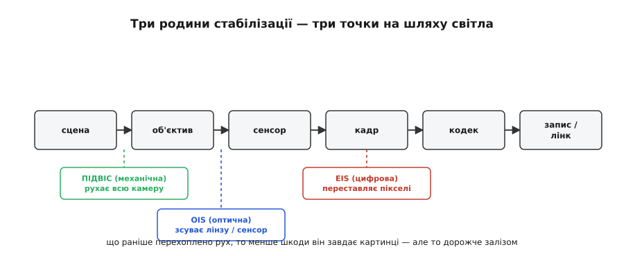
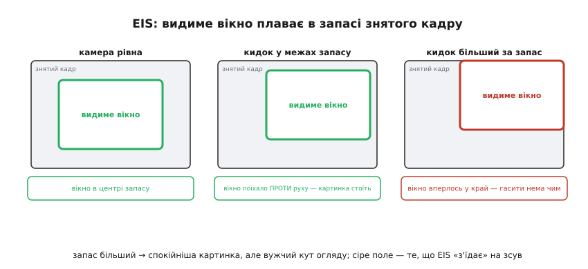

# Стабілізація зображення

Дрон у польоті ніколи не висить нерухомо. Мотори дрібно трясуть раму на сотнях герц, поривчастий вітер хитає корпус, а сам апарат увесь час доводить себе кренами й тангажами, аби втриматися в точці. Камера прикручена до цього всього — і знімає рівно те, що відчуває рама: тремтливу, перехняблену картинку, на якій горизонт гуляє, а дрібні деталі змазані тряскою. Для ока це нудотно, для [мережі-детектора](root:embedded/model-zoo) — згублені об'єкти на змазаних кадрах, для зйомки інспекції — непридатний матеріал. Завдання стабілізації одне й чітке: **відчепити те, що бачить камера, від того, як смикається апарат**, щоб картинка лишалася рівною, поки рама під нею живе власним тривожним життям.

Це той самий клас задачі, що супроводжує нас від [оцінки орієнтації](root:embedded/attitude-estimation), тільки повернутий іншим боком. Там ми хотіли **знати**, як апарат повернутий у просторі. Тут ми це знання **застосовуємо**: виміряли небажаний рух — і відняли його, щоб камера дивилася туди, куди їй велено, а не туди, куди її кинуло поривом. Уся стабілізація — це вимірювання зайвого руху й точне його скасування; різниця між методами лише в тому, **на якому шарі** ми його скасовуємо — заліза, оптики чи пікселів.

### Три місця, де можна вбити тряску

Шлях від сцени до файлу довгий: світло проходить крізь об'єктив, падає на [сенсор](topic:hw-sensing/image-sensor), перетворюється на кадр, кадр кодується й лягає на запис чи в [відеолінк](root:embedded/mjpeg-vs-h264). Небажаний рух можна перехопити на трьох різних точках цього шляху — і звідси три родини стабілізації, що відрізняються радикально.

**Механічна** (підвіс, англ. *gimbal*) фізично тримає цілу камеру нерухомою, поки рама крутиться навколо неї. **Оптична** (англ. *optical image stabilization*, OIS) лишає камеру на місці, але дрібно совгає лінзу або сам сенсор усередині неї, гасячи короткі поштовхи. **Цифрова** (англ. *electronic image stabilization*, EIS) не торкається заліза взагалі — вона **переставляє пікселі** вже у знятому кадрі, зсуваючи й повертаючи зображення так, щоб скасувати рух. Перші дві коштують ваги, місця й моторів; третя — обчислень і частини кадру, яку доводиться віддати. Розберімо кожну за тим самим лекалом: що саме вона гасить, як, і де її межа.


*Три родини стабілізації — три точки на шляху світла. Підвіс гасить рух фізично, ще до камери, повертаючи її всю; OIS зсуває лінзу чи сенсор усередині; EIS працює вже з готовими пікселями. Що раніше на шляху перехоплено рух, то менше шкоди він устигає завдати картинці — але то дорожче залізом.*

### Підвіс: тримати камеру, поки рама крутиться

Найпряміший спосіб — не дати камері трястися взагалі. Підвісь її так, щоб вона могла вільно повертатися навколо трьох осей, а на кожну вісь постав мотор, який активно **відкручує** камеру назустріч кожному руху рами. Рама накренилася праворуч — мотор крену докрутив камеру ліворуч рівно на той самий кут, і об'єктив навіть не помітив, що щось сталося. Осі ті самі три, що ми вже знаємо напам'ять із [орієнтації](root:embedded/attitude-estimation): крен (*roll*), тангаж (*pitch*) і курс (*yaw*). Триосьовий підвіс утримує камеру рівною за всіма трьома.

Серце підвісу — той самий контур, що й у будь-якому стабілізаторі: маленький [IMU](root:embedded/imu-barometer), приклеєний **до самої камери** (не до рами!), безперервно [оцінює її орієнтацію](root:embedded/attitude-estimation), контролер порівнює її із заданою й ганяє мотори, аби звести похибку до нуля. Це чистий [зворотний зв'язок](root:embedded/open-vs-closed-loop), де керована величина — кут камери, а збурення — кидки рами. Те, що IMU сидить на камері, принципово: контур міряє й виправляє орієнтацію саме знімального боку, а не того, що трясеться.


*Підвіс — це замкнений контур навколо кута камери. Рама кидає камеру (збурення), IMU **на камері** міряє, наскільки вона збилась, контролер докручує мотор назустріч, доки похибка не стане нулем. Праворуч — той самий контур у звичному вигляді зворотного зв'язку: різниця між ціллю й виміряним кутом іде в регулятор, той крутить мотор, а кут камери повертається на вхід для наступного такту.*

Чому підвіс злетів саме як технологія останніх років, а не десятиліття тому? Через **мотор**. Старі підвіси крутили камеру [серворушіями](topic:hw-motion/hobby-servo) через шестерні — а будь-яка шестерня має люфт і інерцію, тож рух виходив ступінчастим, із дрібним смиканням і запізненням; саме той ефект ми бачили, розбираючи [качалки й тяги](root:embedded/output-mixing). Прорив дав [безколекторний мотор](topic:hw-motion/bldc-motor) у режимі **прямого приводу** (англ. *direct drive*): без жодних шестерень, вал мотора — це вісь камери. Немає люфту, немає інерції редуктора, керування плавне аж до часток градуса на дуже малій швидкості. Перші доступні контролери таких підвісів (зокрема відомий SimpleBGC розробника під ніком AlexMos) з'явилися приблизно у 2012–2013 роках і швидко зробили плавний триосьовий підвіс масовим — і на знімальних дронах, і в ручних стабілізаторах. *(Усталений факт; конкретні дати ранніх контролерів — за документацією виробників.)* Ідею «тримати камеру рівною, поки оператор рухається» придумали, звісно, набагато раніше — ще [механічний стабілізатор Стедікам](root:embedded/image-stabilization/hist-steadicam-gimbal.md) 1970-х ставив камеру на вільний підвіс у центрі мас; безколекторний мотор лише замінив масу й пружину активним контуром.

Сам контур у найпростішому вигляді — це знайомий [пропорційний регулятор](root:embedded/proportional-control): чим далі камера від заданого кута, тим дужче крутимо мотор назад. Один такт по одній осі в прошивці:

**Умова.** IMU на камері дає поточний кут крену `roll_now` (градуси). Хочемо тримати камеру рівно: ціль `roll_set = 0`. Видати на мотор крену керування, пропорційне похибці, з обмеженням, щоб не вибити мотор на упор.

```c
const float KP_ROLL   = 6.0f;     /* підсилення: одиниць виходу на градус похибки */
const float OUT_LIMIT = 100.0f;   /* межа керування мотором (±) */

/* roll_now — оцінка кута камери з її IMU (градуси), roll_set — бажаний кут */
float gimbal_roll_step(float roll_now, float roll_set)
{
    float error  = roll_set - roll_now;       /* куди й наскільки камера збилася */
    float output = KP_ROLL * error;           /* тягнемо мотор назад, до цілі */

    if (output >  OUT_LIMIT) output =  OUT_LIMIT;   /* не виходимо за межу */
    if (output < -OUT_LIMIT) output = -OUT_LIMIT;
    return output;                            /* далі йде на драйвер мотора крену */
}
```

Перевіримо поведінку в кількох точках:

```
roll_now =  0°   → error =  0°   → output =   0      (камера рівна — мотор спокійний)
roll_now = +5°   → error = −5°   → output = −30      (завалилась праворуч — крутимо ліворуч)
roll_now = −5°   → error = +5°   → output = +30      (завалилась ліворуч — крутимо праворуч)
roll_now = +30°  → error = −30°  → output = −100     (різкий кидок — упираємось у межу виходу)
```

У бойовій прошивці сам по собі П-регулятор замалий: лишиться дрібна стала похибка й коливання на швидких кидках, тому додають [інтегральну](root:embedded/integral-control) і [похідну](root:embedded/derivative-control) складові — повний [ПІД](root:embedded/pid-tuning-cascade), точно як у керуванні самим апаратом. А кожен мотор підбирають за [моментом під масу камери](root:embedded/servo-sizing): слабкий не втримає об'єктив проти ривка, надто сильний — зайва вага й споживання. Принцип же лишається цей: виміряв кут камери, відняв від цілі, докрутив назад.

> 🔧 **Навіщо це.** Підвіс дає найчистішу картинку, бо гасить рух **до** того, як він потрапив у кадр, — об'єктив справді нерухомий. Платиш за це вагою (мотори, рама, друга IMU), струмом (мотори жують його безперервно) і габаритом. На крихітному гоночному дроні підвіс просто нікуди й нема чим везти — там стабілізують інакше. Перше, що перевіряють на «дриготливому» підвісі, — куди приклеєна IMU: відклеїлась на раму замість камери, і контур міряє не той бік, тож «бореться» сам із собою.

### Оптична: совгати лінзу всередині

Підвіс рухає цілу камеру; оптична стабілізація лишає її на місці й совгає лише **лінзу або сам сенсор** усередині корпусу. Крихітні приводи зсувають один оптичний елемент поперек променя так, щоб зображення на сенсорі лишалося на місці, поки корпус дрібно трясеться. Камера хитнулась донизу — лінза підскочила вгору рівно настільки, щоб промінь упав у ту саму точку сенсора.

OIS чудово гасить **дрібну швидку** тряску — тремтіння рук, високочастотну вібрацію моторів, — але хід тих приводів **малесенький**, заледве частки градуса. Великий повільний крен апарата вона не подужає: лінза дійде до краю свого ходу й упреться. Тому в дронах OIS майже завжди живе **в парі** з чимось більшим: підвіс або цифра прибирають великі повільні рухи, а OIS дочищає дрібне швидке тремтіння, на яке моторам підвісу бракує спритності. Сама по собі, на дрібному ході, вона рідко є головним методом саме на дроні — її стихія радше камера в руці.

> 🔧 **Навіщо це.** OIS — це «тонке доведення»: вона ловить швидке дрібне, чого не встигає важкий підвіс, але безпорадна проти великих кидків. На дроні її роль — другий ешелон, не основа. Знати її межу (малий хід) важливо, щоб не чекати від неї стабілізації горизонту в маневрі.

### Цифрова: переставити пікселі вже у кадрі

А якщо мотора нема взагалі — ні підвісу, ні приводів у лінзі? Тоді гасити рух можна вже **після** того, як кадр знято: переставити в ньому пікселі так, ніби камера й не сіпалася. Це і є цифрова стабілізація (EIS), і вона тримається на одному простому факті: якщо ми **точно знаємо**, на який кут камера повернулася між двома кадрами, ми знаємо, **куди** в цьому кадрі поїхало зображення, — і можемо зсунути його назад.

Звідки знати кут? Зі знайомого [гіроскопа](topic:hw-sensing/gyroscope). Він дає кутову швидкість обертання; помноживши її на час кадру, дістаємо, на скільки камера крутнулась за цей кадр, — рівно [інтеграл, який ми вже бачили](root:embedded/calculus-for-pid). А скільки це **пікселів**? Це залежить від того, який кут огляду камери припадає на ширину кадру. Якщо об'єктив бачить, скажімо, 90° по ширині, а кадр — 1920 пікселів завширшки, то один градус повороту зсуває картинку приблизно на `1920 / 90 ≈ 21` піксель.

**Умова.** Гіроскоп показує швидкість рискання `gyro_yaw = 4 °/с`. Камера: кут огляду по ширині `fov = 90°`, кадр `1920` пікселів, частота `30` кадрів/с (тобто `dt ≈ 0.0333` с). На скільки пікселів зсунувся кадр і куди його повернути?

```c
const float FOV_DEG   = 90.0f;
const int   FRAME_W   = 1920;
const float PX_PER_DEG = FRAME_W / FOV_DEG;   /* ≈ 21.3 пікселя на градус */

/* gyro_yaw — кутова швидкість рискання (°/с), dt — тривалість кадру (с) */
int eis_shift_px(float gyro_yaw, float dt)
{
    float angle_deg = gyro_yaw * dt;          /* поворот за цей кадр (градуси) */
    float shift     = angle_deg * PX_PER_DEG; /* у пікселях */
    return (int)(-shift);                     /* зсуваємо кадр ПРОТИ повороту */
}
```

Підставимо:

```
angle_deg = 4 °/с · 0.0333 с      = 0.133°            (за один кадр)
shift     = 0.133° · 21.3 px/°    ≈ 2.84 пікселя
повертаємо кадр на −2.84 px       → картинка стоїть на місці
```

Те саме по тангажу й крену — і зображення тримається рівно, хоч сенсор смикався. Але задарма це не дається, і ціна — **частина кадру**. Щоб мати куди зсувати, EIS не показує весь знятий кадр: вона лишає по краях запас («поле»), а глядачеві віддає лише серединне вікно. Сильніший кидок — більший зсув потрібен — більший запас доводиться різати. Звідси характерна риса цифрової стабілізації: вона **відкушує кут огляду** й трохи погіршує різкість, бо менше вікно потім розтягують назад на повний розмір. Сильна тряска з'їдає більше кадру.


*Ціна цифрової стабілізації — запас кадру. Сенсор знімає більше, ніж бачить глядач: видиме вікно «плаває» всередині знятого кадру протилежно до руху камери. Поки зсув уміщається в запас, картинка нерухома; щойно кидок перевищить запас — стабілізувати нема чим, і край вікна оголює межу. Більший запас = спокійніша картинка, але вужчий кут огляду.*

Дві пастки роблять EIS тоншою, ніж здається. Перша — **точна синхронізація** гіроскопа з кадрами: щоб відняти правильний поворот, треба знати, який відлік гіроскопа відповідає **саме цьому** кадру з точністю до часток мілісекунди; зсунув час на пару кадрів — і стабілізація «бореться» не з тим рухом, роблячи гірше за відсутність. Друга — [рядкова заслінка](topic:hw-sensing/rolling-shutter): більшість сенсорів зчитують кадр не миттєво, а рядок за рядком згори вниз, тож під час повороту верх кадру знято трохи раніше за низ і повернуто на інший кут. Прямі лінії стають хвилястими — ефект «желе» (англ. *jello*), — і простий зсув його не виправить; треба деформувати кадр по рядках, ураховуючи різний кут зчитування кожного. Саме це роблять зрілі інструменти на кшталт відкритого [Gyroflow](root:embedded/image-stabilization/proj-eis-warp.md): беруть знятий запис і логи гіроскопа (вбудовані в камеру чи зняті з [чорної скриньки польотного контролера](root:embedded/data-reliability)), синхронізують їх у часі й перебудовують кожен кадр з урахуванням повороту й рядкової заслінки.

EIS, до речі, споріднена з [оптичним потоком](topic:sf-visual/optical-flow) — оцінкою руху прямо з картинки, кадр до кадру. Різниця в джерелі: чистий оптичний потік вгадує рух **із самих пікселів** і тому плутається на однотонному небі чи швидкому розмитті, тоді як гіроскопна EIS бере рух із давача й тому надійна там, де пікселям вірити не можна. На практиці їх часто поєднують: гіро дає кістяк, потік уточнює.

> 🔧 **Навіщо це.** EIS — стабілізація без грама заліза: ні моторів, ні приводів, лише гіроскоп і обчислення, тому вона єдина, що влазить у крихітний гоночний дрон. Платиш кутом огляду (запас по краях), різкістю (вікно розтягують назад) і, головне, **синхронізацією**: без точного звʼязку «цей відлік гіро — цей кадр» вона псує картинку замість гасити тряску. Тому її часто роблять не на льоту, а постобробкою на землі, де часу й точності вдосталь, — це знову вибір [де рахувати](root:embedded/where-to-compute).

### Що вибрати й чи можна разом

Три методи — не суперники, а інструменти під різну вагу, бюджет і клас апарата, і їхні межі акуратно доповнюють одна одну. **Підвіс** дає найчистіший результат і єдиний по-справжньому тримає горизонт у різкому маневрі, бо гасить рух фізично, ще до кадру, — ціна в вазі, струмі й габариті, тож він живе на знімальних і інспекційних дронах, де є що везти. **EIS** не коштує заліза й тому єдина годиться для гонкового мікродрона — ціна в куті огляду, різкості й вимозі точної синхронізації. **OIS** сама по собі замала проти польотних кидків і працює як тонке доведення поверх іншого методу.

Звідси й найсильніший підхід — **поєднати рівні**: важкий підвіс знімає великі повільні рухи, а легка EIS дочищає дрібний залишок, який моторам уже не наздогнати, — кожен працює там, де він сильний, точно як давачі в [оцінці орієнтації](root:embedded/attitude-estimation) гасили слабкості один одного. Знімальні платформи нерідко складають усі три: підвіс на велике, OIS на швидке дрібне, EIS на залишок у постобробці. Питання не «котрий метод», а «скільки ваги, струму й кадру я готовий віддати за яку чистоту» — і відповідь різна для гоночної «жужалки» й для важкого інспекційного дрона.

### Підсумок

Стабілізація зображення відчіплює те, що бачить камера, від того, як трясеться апарат: міряє небажаний рух і точно його скасовує. Скасувати можна на трьох шарах. **Підвіс** фізично крутить усю камеру назустріч руху рами — триосьовий контур із IMU **на камері**, безколекторні мотори прямого приводу й знайомий ПІД; найчистіша картинка, але вага й струм. **Оптична** совгає лінзу чи сенсор усередині, гасячи дрібне швидке тремтіння на малому ході, — добра напарниця, слабка наодинці. **Цифрова** переставляє пікселі вже у кадрі за даними гіроскопа, віддаючи за це запас по краях, різкість і потребуючи точної синхронізації гіро з кадрами та боротьби з рядковою заслінкою; зате не коштує заліза й влазить туди, де моторів нема. Усі три тримаються однієї ідеї, що веде нас від самої [оцінки орієнтації](root:embedded/attitude-estimation): виміряти зайвий рух — і відняти його. А найкращі платформи не вибирають один метод, а складають їх докупи, даючи кожному ту смугу руху, де він сильний.

---
