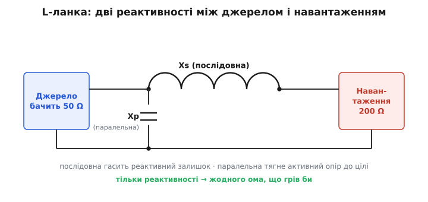
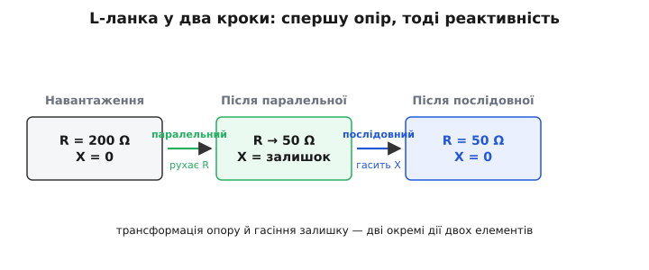
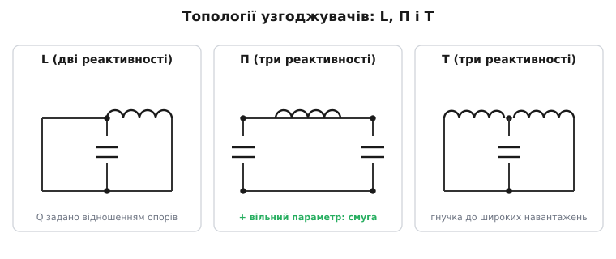

# Схеми узгодження імпедансів

Ми вже знаємо найголовніше про передачу потужності: джерело віддає навантаженню максимум, коли опір навантаження дорівнює внутрішньому опору джерела, а на змінному струмі — коли імпеданс навантаження комплексно-спряжений до імпедансу джерела. Лишилося негарне «але». У реальній схемі ви рідко можете просто **взяти й змінити** навантаження. Антена має той імпеданс, який має. Підсилювач хоче бачити на виході рівно 50 Ом, а кабель і випромінювач дають йому щось геть інше. П'єзоелемент акустичного давача — це майже чиста ємність на одиниці пікофарад, а вхід підсилювача — десятки кілоом. Що робити, коли джерело й навантаження **не збігаються**, а переробити жодне з них не можна?

Відповідь — поставити **між** ними невеличку схему, яка одне «перефарбовує» під інше. Така схема зветься **узгоджувальною** (англ. *matching network*). Вона не торкається ні джерела, ні навантаження — лише сидить посередині й робить так, щоб **джерело бачило на своєму виході той імпеданс, який йому потрібен**, а навантаження тим часом отримувало максимум. І найкрасивіше: робить це **майже без втрат**. Розберімо, як таке взагалі можливо.

### Чому простий резистор тут не годиться

Перша наївна думка: якщо джерело хоче 50 Ом, а навантаження — 200 Ом, чому б не «домалювати» опір резистором? Поставимо 50 Ом паралельно до навантаження або послідовно — підженемо число й готово.

Спробуймо. Навантаження 200 Ом, а нам треба, щоб джерело бачило 50 Ом. Паралельно до 200 Ом поставимо резистор R, щоб сумарний опір став 50:

```
1/50 = 1/200 + 1/R
1/R  = 1/50 − 1/200 = 4/200 − 1/200 = 3/200
R    = 200/3 ≈ 66.7 Ом
```

Число ми отримали — джерело справді бачить 50 Ом. Але ціною чого? Тепер струм джерела розгалужується: частина йде в навантаження, частина — у наш резистор, де **безповоротно перетворюється на тепло**. Ми ж і будували все це, щоб віддати навантаженню **максимум**, а резистор краде частину цього максимуму й гріє повітря. Резистивне «узгодження» підганяє число, але руйнує саму мету: енергія, яку ми так старанно намагалися передати, частково осідає в резисторі.

> 🔧 **Навіщо це.** Тут видно межу резистивних дільників, які ми застосовували в колах постійного струму: вони чудово ділять напругу, але **трансформувати імпеданс без втрат не вміють**. У сигнальному тракті, де кожен децибел потужності цінний (слабкий сигнал з антени, вихід радіопідсилювача), резистор у ролі узгоджувача — це викинута потужність. Тому для узгодження беруть не резистори, а реактивні елементи.

Висновок напрошується: щоб трансформувати імпеданс **і не палити при цьому енергію**, нам потрібен компонент, який «опирається» струмові, але сам нічого не споживає. Такий компонент ми вже знаємо.

### Реактивність трансформує, не витрачаючи

Згадаймо ключову рису конденсатора й котушки: вони протидіють струмові, але енергію не спалюють, а лише тимчасово запасають у полі й повертають назад.

> 🔧 **Навіщо це.** Саме ця властивість робить узгодження можливим. Резистор у колі завжди гріється — він перетворює електричну енергію на тепло безповоротно. А ідеальний конденсатор чи котушка за повний період беруть енергію з кола (напинаючи поле) і повністю віддають її назад — у середньому за цикл споживають нуль. Тож реактивний елемент може стояти на шляху сигналу й **формувати** його, не з'їдаючи. Це і є дозвіл будувати узгоджувач «безкоштовно». Детальніше про реактивність — у [статті про неї](topic:electronics/reactance): реактивний опір вимірюється в омах, але енергію лише гойдає, тоді як резистор її розсіює.

Тепер з'являється глибше запитання. Реактивність — це теж «опір» в омах (Xc для конденсатора, XL для котушки). Якщо ми додаємо реактивності в коло, ми ж нібито додаємо «опір» — але не активний, а реактивний. Як же набір реактивностей перетворить одне **активне** число (200 Ом навантаження) на інше активне число (50 Ом, які бачить джерело)?

Тут і ховається вся хитрість, і вона варта того, щоб її відчути на пальцях. Окрема реактивність справді лише додає до кола реактивну частину. Але коли реактивності з'єднують у комбінацію — скажімо, одну послідовно, другу паралельно, — їхні внески **перемішуються**. Послідовний елемент додається до повного імпедансу прямо, а паралельний — додається до **провідності** (величини, оберненої до імпедансу). А перехід «імпеданс → провідність → імпеданс» — це не просто додавання: він **змішує дійсну й уявну частини**. Тому, додавши реактивність паралельно, ви міняєте не лише уявну частину імпедансу, а й **дійсну** — те саме активне число, яке нас цікавить.

Звучить абстрактно — зробімо це руками.

### L-ланка: дві реактивності, що роблять усю роботу

Найпростіша узгоджувальна схема має лише **два** реактивні елементи. За формою — конденсатор і котушку, з'єднані «буквою Г»: один елемент послідовно, другий паралельно. Через цю форму схему звуть **L-ланкою** (англ. *L-network*; літера схожа на латинське L, покладене набік).


*Дві реактивності у формі літери Г: послідовна (Xs) у шляху сигналу й паралельна (Xp) в обхід. Джерело ліворуч бачить трансформований імпеданс; навантаження праворуч отримує максимум. Резистивних елементів немає — тому втрат теж немає.*

Логіка її дії — це той самий «маневр через провідність», лише розкладений на два кроки. Покажу на конкретиці. Хай навантаження — активні 200 Ом, а джерело хоче бачити активні 50 Ом, на робочій частоті 100 МГц.

**Крок перший — паралельна реактивність.** Чіпляємо паралельно до навантаження реактивний елемент. Він додається до **провідності** навантаження, і його завдання — зробити так, щоб **дійсна частина** результуючого імпедансу впала з 200 Ом до потрібних 50. Інакше кажучи, паралельний елемент «опускає» активне число до цілі — але неминуче лишає по собі якусь паразитну реактивну частину (коло стало частково ємнісним або індуктивним).

**Крок другий — послідовна реактивність.** Тепер ставимо послідовно другий реактивний елемент — **протилежного знаку** до тієї паразитної реактивності, що лишилася. Він її **гасить** рівно так само, як у резонансі котушка гасить конденсатор. Реактивні частини знищують одна одну, лишається чиста дійсна — рівно 50 Ом.

Підсумок маневру: паралельний елемент **притягнув активне число** до цілі (ціною побічної реактивності), а послідовний **прибрав цю побічну реактивність**. На виході — рівно той активний імпеданс, що потрібен джерелу, і **жодного ома, що грів би**.


*Навантаження 200 Ω проходить два перетворення. Паралельний елемент опускає дійсну частину до цільових 50 Ω, лишаючи реактивний залишок; послідовний елемент гасить цей залишок до нуля. Дві окремі дії — два окремі елементи.*

> 🔧 **Навіщо це.** Запам'ятайте поділ ролей у L-ланці: **паралельний елемент рухає активну (дійсну) частину**, **послідовний — компенсує реактивну (уявну)**. Це не формула для зубріння, а спосіб думати: трансформація опору й гасіння залишку — дві окремі дії, які роблять два окремі елементи. Зрозумівши це, ви читатимете будь-яку узгоджувальну схему з першого погляду й одразу бачитимете, котрий елемент «за що відповідає».

Який саме елемент послідовний, а який паралельний — конденсатор чи котушка — залежить від того, що з чим узгоджуємо й у який бік. Але принцип незмінний: дві реактивності, дві ролі.

### Порахуймо L-ланку до кінця

Тепер — повний робочий розрахунок із числами, щоб формули перестали бути абстракцією. Узгоджуємо ті самі активні 50 Ом джерела з активними 200 Ом навантаження.

Перший крок будь-якого розрахунку L-ланки — знайти **добротність трансформації** Q. Вона показує, наскільки «крутий» стрибок опору ми робимо, і задається відношенням більшого активного опору до меншого:

```
Q = √(R_більше / R_менше − 1)
Q = √(200 / 50 − 1) = √(4 − 1) = √3 ≈ 1.73
```

Це Q цілого узгоджувача (не плутати з добротністю окремої котушки). Через нього одразу знаходимо обидві реактивності. Послідовна реактивність прив'язана до **меншого** опору, паралельна — до **більшого**:

```
Xs = Q · R_менше   = 1.73 · 50  ≈ 86.6 Ом
Xp = R_більше / Q  = 200 / 1.73 ≈ 115.5 Ом
```

Ось і вся арифметика узгодження: дві реактивності, 86.6 Ом і 115.5 Ом. Лишилося перетворити «омівські» реактивності на номінали реальних деталей — а це залежить від робочої частоти, бо реактивність C і L залежить від частоти. На f = 100 МГц (ω = 2π·100·10⁶ ≈ 6.28·10⁸ рад/с) візьмімо послідовну реактивність котушкою, а паралельну — конденсатором:

```
котушка:     XL = ωL  →  L = Xs / ω = 86.6 / 6.28e8   ≈ 138 нГн
конденсатор: Xc = 1/(ωC) → C = 1/(ω·Xp) = 1/(6.28e8 · 115.5) ≈ 13.8 пФ
```

Кінцева відповідь: послідовна котушка ≈ 138 нГн і паралельний конденсатор ≈ 13.8 пФ перетворюють 200 Ом навантаження на 50 Ом, які бачить джерело, на частоті 100 МГц. Поставте ці дві деталі правильним боком між підсилювачем і навантаженням — і максимум потужності піде туди, куди треба, а узгоджувач при цьому лишиться холодним.

> 🔧 **Навіщо це.** Зверніть увагу, що в розрахунок **увійшла частота**, і то критично. Та сама пара деталей дає потрібні 50 Ом лише на 100 МГц; зсуньтеся частотою — і реактивності попливуть, узгодження зіпсується. Це наслідок того, що ми будуємо узгоджувач саме з реактивних елементів. Тому L-ланка узгоджує не «взагалі», а **на конкретній частоті** — про що йтиметься нижче.

Цей розрахунок спирається на алгебру комплексних імпедансів — на те, що послідовні Z додаються, паралельні складаються через обернені, а реактивності з'являються як уявна частина.

> 🧮 **Навіщо це.** Формули вище — це згорнутий результат роботи з імпедансом як комплексним числом Z = R + jX. Якщо хочете бачити, **звідки** беруться √(R/r − 1) і прив'язка Xs до меншого опору, треба пройти крок «імпеданс → провідність → імпеданс» в комплексних числах. Сам апарат — у вставці [Імпеданс: узагальнений закон Ома для змінного струму](topic:electronics/phase-shift/math-impedance.md): чому послідовні імпеданси додаються, паралельні складаються через обернені, і чому додавання паралельної реактивності зачіпає й активну частину.

### Спорідненість із резонансом

Уважний читач уже відчув знайоме. Послідовний елемент L-ланки **гасить** реактивність, що лишилася після паралельного, — рівно так, як у коливальному контурі котушка гасить конденсатор. Це не випадковий збіг: узгодження й резонанс — близькі родичі.

Згадаймо: у резонансному контурі реактивності котушки й конденсатора рівні за модулем і протилежні за фазою, тож вони взаємно знищуються, і коло на резонансній частоті поводиться суто активно. В узгоджувачі відбувається те саме, але з додатковим завданням: ми не просто гасимо реактивність дощенту, а ще й по дорозі **перетворюємо одне активне число на інше**. Резонанс прибирає реактивність; узгоджувач прибирає реактивність **і** трансформує опір. Перше — окремий випадок другого.

> 🔧 **Навіщо це.** Звідси практична інтуїція: узгоджувальна L-ланка — це «несиметричний резонанс». Той самий механізм взаємного гасіння реактивностей, що дзвенить у радіоконтурі, тут поставлено на службу трансформації опору. Тому узгоджувачі, як і резонансні контури, **гострі за частотою**: працюють у вузькій смузі біля розрахункової частоти, а далі від неї узгодження «розпливається». Якщо вам потрібне узгодження саме на одній частоті (антена, радіокаскад) — це навіть добре: вузька смуга заодно відсікає сусідні частоти. Якщо ж сигнал широкосмуговий — доведеться шукати інші схеми. Глибше про взаємне гасіння реактивностей і власну частоту контуру — у [статті про LC-резонанс](topic:electronics/lc-resonance).

Цей зв'язок дає й зворотний хід думки: добротність трансформації Q, яку ми рахували, водночас задає **ширину смуги** узгодження — точно як добротність задає гостроту резонансного піка. Чим більший стрибок опору (більше Q), тим вужча смуга, у якій узгодження тримається. Перетворювати 50 Ом на 200 Ом (Q ≈ 1.7) — широка, поблажлива смуга; перетворювати 5 Ом на 500 Ом (Q ≈ 10) — вузька, гостра, чутлива до кожного пікофарада паразитної ємності. За велику трансформацію платять вузькою смугою — це фундаментальний компроміс, не вада конкретної схеми.

### Коли двох елементів мало: П і Т

L-ланка має один зв'язаний параметр: щойно ви задали два потрібні опори (звідки й з куди трансформувати), добротність Q **визначається однозначно** — а з нею й смуга. Вибору не лишається: яке Q «випало» з відношення опорів, таку смугу й маєте. Часто це прийнятно. Але іноді хочеться смугу **задати окремо** — звузити навмисне (щоб заодно фільтрувати) або, навпаки, розширити. Для цього додають **третій** реактивний елемент.


*Три базові схеми. L-ланка (дві реактивності) — Q задається відношенням опорів. П-ланка й Т-ланка (три реактивності) додають вільний параметр: Q, а з ним і смугу, тепер можна обрати незалежно. Форма літер П і Т підказує, як з'єднані елементи.*

Дві найпоширеніші трикомпонентні схеми названо за формою:

**П-ланка** (англ. *Pi network*, бо нагадує грецьку літеру Π) — це фактично дві L-ланки спина до спини: послідовний елемент посередині й два паралельні по краях. Її зручно уявляти так: перша половина трансформує опір джерела вниз до якогось проміжного, низького значення, друга — від цього проміжного вгору до навантаження. Це проміжне значення ви обираєте самі — і саме воно дає той вільний параметр, якого бракувало L-ланці. Хочете вужчу смугу — беріть нижчий проміжний опір (вище Q), хочете ширшу — вищий.

**Т-ланка** (англ. *T network*) — дзеркало П: два послідовні елементи й один паралельний посередині. Тут проміжна точка має, навпаки, **високий** опір, але ідея та сама — розбити велику трансформацію на дві менші з керованою проміжною ланкою.

> 🔧 **Навіщо це.** Практичне правило таке. Потрібне просте узгодження двох опорів — беріть **L-ланку**: дві деталі, мінімум втрат у паразитах, нема чого зайвого підбирати. Потрібно ще й **керувати смугою** (звузити для фільтрації або забезпечити певну добротність) — беріть **П** або **Т**. П-ланку особливо люблять на виходах потужних радіопідсилювачів: вона не лише узгоджує, а й працює як фільтр нижніх частот, пригнічуючи гармоніки — два завдання однією схемою. Т-ланку часто ставлять там, де треба узгоджувати **широкий діапазон** навантажень (антенні тюнери), бо вона гнучкіша до великих і мінливих імпедансів.

Третій елемент не безкоштовний: більше деталей — більше паразитних втрат і ще вужча (за того ж Q) смуга. Тому за можливості лишаються на L-ланці, а до П і Т ідуть лише тоді, коли двох елементів справді бракує для задачі.

### Узгодження як трансформація: трансформатор

Є й геть інший спосіб «перефарбувати» імпеданс, без жодної резонансної гостроти, — **трансформатор**. Дві обмотки на спільному осерді міняють напругу в стільки разів, скільки витків в одній проти іншої. А якщо міняється напруга й струм, то міняється і їхнє відношення — тобто **імпеданс**. І міняється він не в N разів, а в **N² разів**, де N — відношення витків:

```
Z_перв = Z_втор · (N_перв / N_втор)²
```

Поставивши трансформатор із 2:1 за витками, ви трансформуєте опір у 4 рази. Цей шлях має велику перевагу: трансформатор узгоджує **широкосмугово** — у ньому немає резонансу, що прив'язував би до однієї частоти, тож він тягне цілу смугу одразу. Тому трансформаторне узгодження класичне в аудіо (вихідний трансформатор лампового підсилювача узгоджує високий опір лампи з низьким опором динаміка) і в широкосмуговій радіотехніці.

Платою є те, що трансформатор — деталь громіздкіша, дорожча й не дає довільного коефіцієнта (витки цілі, осердя має обмеження за частотою й потужністю). Тому на високих радіочастотах і у вузькосмугових задачах частіше виграє маленька L-ланка з двох SMD-деталей, а трансформатор лишають там, де цінна саме широка смуга або гальванічна розв'язка.

> 🔧 **Навіщо це.** Тримайте в голові дві гілки узгодження. **Реактивна (L, П, Т)** — дешева, мікроскопічна, але вузькосмугова й чутлива до паразитів; ідеальна для фіксованої частоти. **Трансформаторна** — широкосмугова й заодно ізолює кола, але більша й грубіша за коефіцієнтом; ідеальна для аудіо та широких діапазонів. Який бік потрібен, диктує задача: одна частота — реактивна ланка; ціла смуга — трансформатор. Сам принцип трансформації напруги (а з нею струму й імпедансу) — у [статті про трансформатор](topic:electronics/transformer).

### Чому 50 Ом скрізь

Лишилося пояснити, чому в усіх прикладах раз у раз спливає число **50 Ом**. Воно не випадкове й не священне — це інженерний компроміс, який колись усталили для коаксіального кабелю, і відтоді ним користуються всі. Радіопідсилювачі, генератори, аналізатори, антенні роз'єми, ВЧ-фільтри — усе зводять до 50 Ом, щоб будь-який блок стикувався з будь-яким без окремого узгодження. Узгоджувальна ланка тоді потрібна лише на **краях** тракту — там, де живе «дике» навантаження (антена, давач, нестандартний каскад), яке треба привести до спільного знаменника 50 Ом.

> 📜 А звідки взялося саме число 50? Це компроміс між мінімумом втрат, максимумом потужності й розумною напругою в коаксіалі (Bell Labs, кінець 1920-х). Коротку історію цього компромісу й сусіднього 75-омного стандарту розказано у вставці [Звідки взялися 50 Ом](topic:electronics/power-matching/hist-50-ohm.md).

### Як інженери це малюють: діаграма Сміта

Рахувати узгоджувачі формулами можна, але радіоінженери понад вісімдесят років роблять це **графічно** — на діаграмі Сміта. Це хитро викривлена координатна сітка, де будь-який імпеданс — точка, а кожна додана реактивність зсуває цю точку по дузі. Узгодити означає кількома дугами «доїхати» з точки навантаження в центр діаграми (де живе ідеальне узгодження). Додав послідовну котушку — поїхав по одній дузі; паралельний конденсатор — по іншій; і видно наочно, скільки кроків і яких деталей треба.

> 📜 **Навіщо це.** Діаграма Сміта — інструмент, який варто знати в обличчя, навіть якщо рахуєте комп'ютером: усі ВЧ-симулятори показують результат саме на ній. Її незалежно винайшли троє інженерів наприкінці 1930-х у трьох країнах — добрий приклад того, що сильна ідея визріває в кількох головах одночасно. Хто, коли й чому — у вставці [Діаграма Сміта: три винахідники однієї ідеї](root:embedded/impedance-matching-networks/hist-smith-chart.md).

### Одна ідея, що стоїть за кожною схемою

Ми починали з глухого кута: джерело хоче одного імпедансу, навантаження дає інший, а переробити жодне з них не можна. Вихід виявився не в тому, щоб щось ламати, а в тому, щоб поставити між ними тонкий прошарок-посередник. І хоч посередник цей буває різний — дві реактивності L-ланки, три в П чи Т, витки трансформатора, — усі вони роблять одне: показують кожному боку рівно той імпеданс, який той хоче бачити, а самі при цьому не з'їдають дорогоцінний сигнал, бо гойдають енергію, а не палять її. Ось і все узгодження імпедансів у металі: не магія, а двійко правильно поставлених конденсатора з котушкою.
