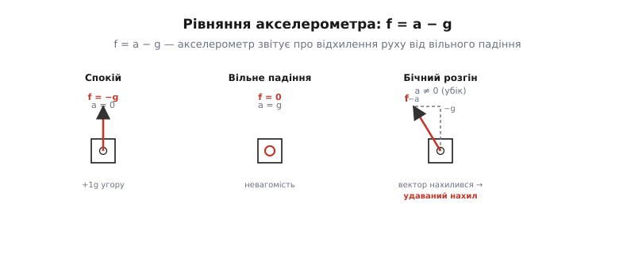
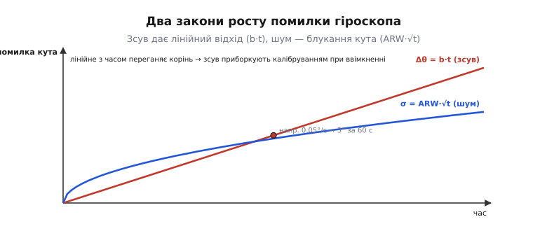
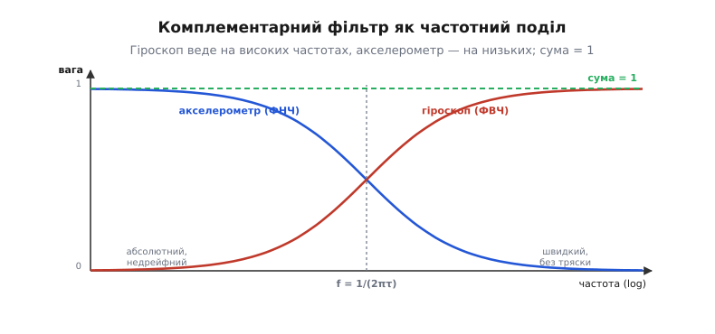
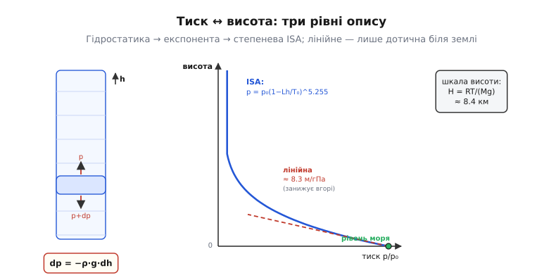

# IMU й барометр (детально)

У [базовій частині](root:embedded/imu-barometer) ми з'ясували головне на рівні поведінки: акселерометр міряє не рух, а **питому силу**; гіроскоп дає кутову швидкість, але його кут спливає; удвох вони тримають орієнтацію, та курс лишається сліпою плямою для гравітації; вібрація — головний ворог IMU; барометр дає надтонку висоту з тиску, але «дихає» з погодою. Тепер розберемо **чому саме так** — з виведеннями формул, граничними випадками й механікою, що ховається за кожним із цих тверджень. Мета цієї частини — щоб після неї в тебе не лишалося чорних скриньок: ні «звідки береться дрейф», ні «чому фільтр саме такий», ні «звідки в барометрі сантиметри».

Почнемо з рівняння, яке акселерометр розв'язує кожним відліком, — бо з нього випливає майже все інше.

### Рівняння акселерометра: f = a − g

Найточніше твердження про акселерометр таке: він міряє **питому силу** (англ. *specific force*) — векторну різницю між справжнім кінематичним прискоренням тіла й прискоренням вільного падіння, виражену в системі координат самого давача. Одним рядком:

```
f = a − g
```

де `a` — справжнє прискорення давача відносно інерціальної системи (те, що ми зазвичай і звемо «прискоренням»), `g` — вектор гравітаційного прискорення (спрямований до центра Землі, |g| ≈ 9.81 м/с²), а `f` — те, що акселерометр насправді видає на своїх трьох осях. Знак мінус — не деталь запису, а суть усієї підступності. Розберемо, звідки він, бо тут криється джерело всіх «неінтуїтивних» станів із базової частини.

Усередині акселерометра — крихітна **пробна маса** на пружних підвісах (у MEMS це кремнієва гребінка, фізику якої розбирає [MEMS-давач](book:electronics/mems)). Давач міряє не «прискорення» напряму, а **зміщення цієї маси** відносно корпусу, тобто силу пружин, яка це зміщення тримає. За другим законом Ньютона на масу `m` діють дві сили: гравітація `m·g` і сила підвісу (пружин) `F_пруж`. Сума дає масу її прискорення:

```
m·a = m·g + F_пруж
F_пруж = m·(a − g)
```

Акселерометр видає саме `F_пруж/m` — силу підвісу на одиницю маси. Тому `f = a − g`. Пружина «звітує» не про рух як такий, а про те, **наскільки рух відхиляється від вільного падіння**. Це і є питома сила. Тепер три стани з базової частини випадають самі собою, без жодного заучування:

**Спокій на столі.** Тіло нерухоме, отже `a = 0`. Тоді `f = 0 − g = −g`. Вектор `g` дивиться вниз, отже `−g` дивиться **вгору**, і його довжина — рівно `9.81` м/с², тобто **+1g угору**. Пружини мусять штовхати масу вгору проти тяжіння — ось цю силу давач і читає.

**Вільне падіння.** Тіло падає вільно, отже `a = g` (воно розганяється точно з гравітаційним прискоренням). Тоді `f = g − g = 0`. Пружинам нема чого тримати — маса й корпус падають однаково. Акселерометр читає **нуль**, хоч тіло й розганяється. Це буквально визначення невагомості.

**Нахилений спокій.** Знову `a = 0`, тож `f = −g`, але тепер осі давача повернені відносно вертикалі. Той самий вектор `−g` розкладається на осі давача по-новому — і з цих проєкцій ми дістаємо кути нахилу. Це і є абсолютний, недрейфний орієнтир крену й тангажа.


*Одне рівняння `f = a − g` пояснює всі стани. У спокої `a = 0` → `f = −g` (вектор угору, 1g). У вільному падінні `a = g` → `f = 0`. У бічному розгоні до `−g` додається реакція на прискорення, і сумарний вектор нахиляється — саме тому розгін «прикидається» нахилом. Пружинний підвіс завжди звітує про відхилення руху від вільного падіння, а не про рух.*

> 🔧 **Навіщо це.** Рівняння `f = a − g` — не абстракція, а те, що ти реально бачитимеш у логах. Модуль вектора акселерометра `|f|` у спокої має дорівнювати `1g` (≈ 9.81). Якщо в статиці `|f|` систематично не 1g — давач розкалібрований по масштабу (*scale factor*) і його треба калібрувати (класичний метод — «шість положень», по ±осі кожної з трьох осей). А якщо `|f|` стрибає під час польоту — це вже не орієнтація, це прискорення й вібрація, і саме тому фузія мусить зважати на `|f|`, коли вирішує, чи довіряти акселерометру зараз.

### Кут нахилу з проєкцій: повне виведення й межі точності

У базовій частині ми оцінили: горизонтальне прискорення `a` виглядає як нахил на `arctan(a/g)`. Тепер виведемо повні формули крену й тангажа з трьох осей і подивимось, де вони ламаються — бо ця межа визначає всю логіку фузії.

Нехай осі давача — `x` (уперед), `y` (праворуч), `z` (вниз), і в спокої він читає компоненти `(fx, fy, fz)`. У статиці це проєкції `−g` на осі. Стандартні формули (порядок обертань «крен навколо x, тангаж навколо y»):

```
тангаж:  θ = atan2( −fx , √(fy² + fz²) )
крен:    φ = atan2(  fy ,  fz )
```

Чому `atan2`, а не звичайний `atan`? Бо `atan2(y, x)` розрізняє всі чотири чверті: він дає правильний знак і не «перевертається» при переході через ±90°, тоді як `atan(y/x)` втрачає квадрант і ділить на нуль при `x = 0`. У прошивці — завжди `atan2f`.

Тепер головне питання: **наскільки бічне прискорення псує цю оцінку?** Хай апарат рухається строго рівно (справжній нахил нульовий), але має бічне прискорення `a_y`. Тоді замість `f = −g` акселерометр бачить `f = a − g`, і його `y`-компонента вже не нуль, а `fy = a_y` (реакція на бічний розгін). З формули крену:

```
φ_хибний = atan2(a_y, g) = atan(a_y/g)
```

Ось звідки береться `arctan(a/g)` з базової частини — це окремий випадок повної формули. Порахуймо межу для типового маневру й побачимо, чому фузія не може «просто вірити» акселерометру.

**Приклад (координований віраж → повний обман акселерометра).** Крайній випадок — літак чи мультикоптер у **координованому віражі**: він нахиляється так, щоб сумарний вектор питомої сили дивився точно вздовж осі `z` апарата (пасажир не відчуває бічної сили, «кава не проливається»). Скільки нахилу «побачить» акселерометр?

```c
// координований віраж: відцентрове прискорення врівноважує нахил
float bank_true = 30.0f * (float)M_PI / 180.0f;  // справжній крен 30°
// у координованому віражі бічна опора = g·tan(крен)
float a_lat = 9.81f * tanf(bank_true);           // = 9.81·tan30° ≈ 5.66 м/с²
// але акселерометр бачить РІВНОДІЙНУ вздовж своєї осі z:
float f_z   = 9.81f / cosf(bank_true);           // = 9.81/cos30° ≈ 11.33 м/с²
float f_y   = 0.0f;   // бічна складова обнулилась: віраж координований!
float phi_meas = atan2f(f_y, f_z);               // = atan2(0, 11.33) = 0°
```

Результат приголомшливий: акселерометр показує **нуль крену** при справжньому нахилі 30°. У координованому віражі бічне прискорення точно «з'їдає» проєкцію гравітації, і давач «думає», що апарат стоїть рівно, — лише вектор став довший (`|f| = 1.155g` замість `1g`). Ось найчистіший доказ, чому **акселерометр не можна питати про нахил у маневрі**: у координованому русі він не просто помиляється — він упевнено бреше нулем. Єдина зачіпка, що щось не так, — це `|f| ≠ 1g`. Саме тому серйозна фузія відстежує модуль вектора й **зменшує довіру до акселерометра рівно тоді, коли `|f|` відходить від 1g**.

> 🔧 **Навіщо це.** Це пояснює, чому «утримання горизонту лише на акселерометрі» неможливе для апарата, що маневрує, — і чому автопілоти на віражі майже повністю переходять на гіроскоп. Практичне правило калібрування: у спокої `atan2(fy, fz)` і `atan2(−fx, √(fy²+fz²))` мають давати нуль на рівній поверхні; якщо ні — у давача є **зсув по нахилу** (*board misalignment*), його вносять у поправку рівнем. А в польоті — дивись на `|f|`: поки він близький до 1g, нахилу можна вірити; відійшов — ні.

### Гіроскоп: чому інтеграл спливає й скільки саме

Гіроскоп міряє кутову швидкість `ω` (°/с). Щоб дістати кут, його інтегрують за часом:

```
θ(t) = θ(0) + ∫₀ᵗ ω(τ) dτ
```

У прошивці інтеграл дискретний — сума добутків «швидкість × крок часу»:

```c
// інтегрування кутової швидкості в кут (по одній осі), крок dt
theta += omega * dt;   // рад += (рад/с)·с
```

Проблема в тому, що реальний гіроскоп видає не чисту `ω`, а `ω_вимір = ω + b + n`, де `b` — **зсув нуля** (*bias*, повільно змінна складова, що показує ненуль навіть у спокої), а `n` — випадковий **шум**. Подивимось, що кожна з цих домішок робить із кутом після інтегрування, — саме тут народжується «дрейф», і його можна порахувати.

**Сталий зсув → лінійний відхід кута.** Хай `b` сталий. Тоді в інтегралі з'являється доданок `∫b dτ = b·t`. Помилка кута росте **лінійно з часом**:

```
Δθ_bias(t) = b · t
```

**Приклад (недокалібрований зсув гіроскопа).** Дешевий MEMS-гіроскоп має залишковий зсув `b = 0.05 °/с` (типова величина після грубого калібрування). Скільки кута він набреше за хвилину польоту й за десять хвилин?

```
Δθ(60 с)  = 0.05 °/с × 60 с  = 3.0°
Δθ(600 с) = 0.05 °/с × 600 с = 30°
```


*Два закони дрейфу гіроскопа. Сталий зсув нуля дає помилку кута, що росте **лінійно** з часом (`Δθ = b·t`) — саме він домінує й саме тому зсув міряють щоразу при ввімкненні. Випадковий шум дає **блукання кута** (`σ = ARW·√t`) — росте як корінь, тож на довгих часах повільніше за зсув, але невблаганно. Лінійне з часом переганяє корінь — ось чому калібрування зсуву критичніше за боротьбу з шумом.*

Три градуси за хвилину, півкола за десять хвилин — і це лише від залишкового зсуву. Ось чому зсув **міряють щоразу при ввімкненні** (усереднюючи `ω` за кілька секунд спокою — тому наземна станція просить «не рухати»), а те, що лишилось після температурного дрейфу, доводиться постійно підправляти акселерометром і магнітометром. Один незміряний градус зсуву на секунду перетворює орієнтацію на здогад за півхвилини.

**Випадковий шум → «блукання кута» (angle random walk).** Тепер хай `b = 0`, але є білий шум `n`. Інтеграл білого шуму — це **випадкове блукання** (*random walk*): помилка кута не росте лінійно, а накопичується як **корінь із часу**. Стандартне відхилення помилки:

```
σ_θ(t) = ARW · √t
```

де `ARW` — *angle random walk* («блукання кута»), паспортна характеристика гіроскопа, яку дають в **°/√год** (градус на корінь із години). Це специфічна одиниця, і причина саме в корені: подвоївши час, ти збільшуєш помилку не вдвічі, а в `√2 ≈ 1.41` раза. Тому інтеграл шуму на коротких масштабах майже нешкідливий, а на довгих — накопичується повільніше, ніж лінійний зсув, але невблаганно.

Звідки беруться самі числа `b` і `ARW` і як їх виміряти? Із **дисперсії Аллана** (*Allan variance*) — методу, що розкладає шум давача за часовими масштабами. Це окрема техніка з власною красивою логікою; винесімо її у [виведення дисперсії Аллана](root:embedded/imu-barometer/math-allan-variance.md) — там побачиш, як з одного довгого запису нерухомого давача дістати і ARW, і зсув-нестабільність, і як читати паспорт гіроскопа.

> 🔧 **Навіщо це.** Дві формули — `Δθ = b·t` (лінійно) і `σ_θ = ARW·√t` (корінь) — дають тобі **горизонт довіри** до гіроскопа без фузії. Підстав паспортні числа свого давача й дізнаєшся, за скільки секунд кут «попливе» на градус. Для дешевого MEMS це секунди-десятки секунд — тому акселерометр і магнітометр мусять «підтягувати» кут постійно, а не зрідка. Для дорогого тактичного гіроскопа — хвилини, і вимоги до магнітометра м'якші.

### Як усередині MEMS-гіроскоп «відчуває» обертання: сила Коріоліса

Класичний гіроскоп Фуко тримав напрям завдяки масивному розкрученому ротору. MEMS-гіроскоп нічого не крутить — і все ж міряє обертання. Механізм інший і вартий того, щоб його зрозуміти, бо з нього випливають дві головні вади давача: чутливість до вібрації й до температури.

Усередині — крихітна кремнієва маса, яку електростатика змушує **весь час коливатися** вздовж однієї осі (назвімо її «драйв», вісь збудження) зі сталою частотою, десятки кілогерц. Поки апарат не обертається, маса ходить туди-сюди строго вздовж драйву. Але щойно з'являється обертання з кутовою швидкістю `ω` навколо осі, перпендикулярної до драйву, на рухому масу починає діяти **сила Коріоліса** (названа на честь французького інженера-математика *Gaspard-Gustave de Coriolis*, який описав її 1835 року):

```
F_Коріоліса = −2·m·(ω × v)
```

де `v` — швидкість коливання маси вздовж драйву. Ця сила перпендикулярна і до `v`, і до `ω`, тож вона розгойдує масу вздовж **третьої осі** («сенс», вісь зчитування). Амплітуда цього наведеного коливання **пропорційна `ω`** — і саме її вимірюють ємнісним давачем на осі сенсу. Обертання перетворюється на бічне тремтіння, а тремтіння — на електричний сигнал.

Тепер стає видно коріння вад. Драйв-коливання й корисний сигнал сенсу — це два тремтіння на близьких частотах, тож **зовнішня вібрація на тих самих кілогерцах домішується прямо в сигнал** (звідси надчутливість до вібрації, глибше про неї — нижче). А частота драйву й жорсткість підвісів **залежать від температури** — кремній розширюється, пружні сталі повзуть, тому зсув нуля й масштаб «пливуть» із нагрівом. Ось чому серйозні плати міряють температуру чипа й вносять поправку (`bias(T)`, `scale(T)`), а найточніші — **термостатують** IMU, тримаючи його на сталій температурі невеликим підігрівом, щоб узагалі виключити цю змінну.

> 🔧 **Навіщо це.** Розуміння коріолісового принципу пояснює дві речі з практики одразу. По-перше, чому гіроскоп на дешевій платі «повзе» перші хвилини після ввімкнення — це не поломка, а прогрів кремнію до робочої температури; серйозні збірки чекають теплового виходу на режим або підігрівають IMU. По-друге, чому механічний резонанс рами на частоті драйву чипа катастрофічний: він б'є прямо в механізм давача, і жоден цифровий фільтр після АЦП цього вже не виправить.

### Поєднання гіроскопа й акселерометра: виведення комплементарного фільтра

Ми маємо два джерела кута з дзеркальними вадами: **гіроскоп** — точний на коротку мить, але дрейфує (помилка накопичується повільно, на **низьких частотах**); **акселерометр** — абсолютний і недрейфний, але зашумлений і бреше на маневрі (помилка на **високих частотах**: тряска, розгони). Напрошується: узяти в кожного те, у чому він добрий. Це і робить [комплементарний фільтр](book:algorithms/complementary-filter) — виведемо його, щоб побачити, звідки береться його єдиний параметр.

Позначмо: `θ_g` — кут, отриманий інтегруванням гіроскопа; `θ_a` — кут, обчислений із проєкцій акселерометра (формули вище). Комплементарний фільтр у дискретній формі:

```
θ = α·(θ_попер + ω·dt) + (1 − α)·θ_a
```

Розберемо, що це означає. Доданок `α·(θ_попер + ω·dt)` — це стара оцінка, проінтегрована гіроскопом на крок уперед, узята з вагою `α`. Доданок `(1 − α)·θ_a` — свіжий кут від акселерометра з вагою `1 − α`. Коефіцієнт `α` близький до одиниці (наприклад, 0.98): орієнтацію в основному «веде» гіроскоп, а акселерометр лише **повільно підтягує** її, не даючи спливти. Чому це саме фільтр і що таке його «частота розділу»?

Перепишемо в частотній мові. Гіроскопова гілка — це **інтегратор із витоком**: вона пропускає швидкі зміни (гіроскоп добрий на високих частотах), але повільно «забуває» накопичену помилку, тобто діє як **фільтр верхніх частот** для помилки гіроскопа. Акселерометрова гілка з вагою `1 − α` — це **фільтр нижніх частот**: вона пропускає лише повільну, усереднену складову (щоб не пускати всередину тряску й розгони). Дві передавальні функції в сумі дають **одиницю на всіх частотах** — звідси й назва «комплементарний» (лат. *complementum* — «доповнення»): високочастотну частину сигналу дає гіроскоп, низькочастотну — акселерометр, і вони точно доповнюють одна одну до цілого.

Ключова величина — **частота розділу** (*crossover frequency*), на якій довіра переходить від акселерометра до гіроскопа. Вона задається сталою часу `τ`:

```
τ = α·dt / (1 − α)
f_розділу = 1 / (2π·τ)
```

Нижче за `f_розділу` кут веде акселерометр (бо на довгих часах гіроскоп дрейфує); вище — гіроскоп (бо на коротких часах акселерометр зашумлений і бреше на маневрі).


*Чому «комплементарний». Гіроскопова гілка — фільтр верхніх частот (веде кут на швидких змінах), акселерометрова — фільтр нижніх частот (веде на повільних). На частоті розділу `f = 1/(2πτ)` довіра переходить від одного до іншого. Сума двох гілок дорівнює одиниці на всіх частотах — сигнал відновлюється без спотворення, кожен давач працює там, де він сильний.*

**Приклад (вибір τ і α під частоту циклу).** Швидкий контур опитує IMU з частотою 500 Гц (`dt = 0.002` с). Хочемо частоту розділу близько 0.5 Гц (гіроскоп веде все, що швидше за пів-секунди; повільніше — підтягує акселерометр). Знайдімо `τ` і `α`.

```c
float dt = 0.002f;                 // 500 Гц
float f_cross = 0.5f;              // бажана частота розділу, Гц
float tau = 1.0f / (2.0f * (float)M_PI * f_cross);  // = 1/(2π·0.5) ≈ 0.318 с
float alpha = tau / (tau + dt);    // = 0.318/(0.318+0.002) ≈ 0.9938
// перевірка назад: τ = α·dt/(1−α) = 0.9938·0.002/0.0062 ≈ 0.320 с  ✓
```

Виходить `α ≈ 0.994`: кожен такт орієнтація на 99.4% ведеться гіроскопом і лише на 0.6% підтягується акселерометром. Це й пояснює, чому в реальних фільтрах `α` завжди так близько до одиниці — при сотнях герців циклу навіть мала вага акселерометра за секунду набирається в достатнє підтягування, а миттєвий вплив тряски лишається крихітним. Зменшиш `α` (опустиш розділ вище) — орієнтація стане «нервовою», реагуватиме на кожен поштовх; збільшиш (розділ нижче) — гіроскопів дрейф встигне проступити між підтягуваннями.

Комплементарний фільтр — це, по суті, **фільтр Калмана зі сталим коефіцієнтом підсилення**. Повноцінний [фільтр Калмана](book:algorithms/kalman-filter) робить те саме розумніше: він **сам** щомиті обчислює оптимальну вагу (той самий `1 − α`) з поточних оцінок довіри до кожного давача — і саме тому може відкидати акселерометр рівно тоді, коли `|f| ≠ 1g` (маневр), і знову йому вірити в спокої. Ідея та сама — доповнити швидке-дрейфне абсолютним-повільним, — але вага стає адаптивною, а не сталою. Загальний погляд на такі поєднання дає [сплав давачів](book:communications/sensor-fusion).

> 🔧 **Навіщо це.** `τ` — головна «ручка» будь-якого саморобного стабілізатора орієнтації. Мала `τ` (висока частота розділу) → апарат смикається на кожному пориві, бо надто вірить зашумленому акселерометру. Велика `τ` → крен «попливе», бо гіроскопів дрейф проступить раніше, ніж акселерометр устигне його вирівняти. Знаючи виведення, ти підбираєш `τ` свідомо: постав її трохи вищою за характерний час своїх маневрів — і гіроскоп поведе апарат крізь віраж, а акселерометр тихо вирівняє горизонт між віражами.

### Вібрація глибше: чому аліасинг непоправний і як його вбити

У базовій частині ми сказали: вібрація підступна тим, що частина її енергії через аліасинг маскується під повільні рухи. Тепер розберемо цей механізм точно — бо саме він диктує **дворівневий** захист і пояснює, чому порядок дій критичний.

**Механізм аліасингу.** Акселерометр опитують із частотою дискретизації `f_s` (скажімо, 1 кГц). За [теоремою Найквіста](book:communications/nyquist-aliasing) давач може чесно відтворити лише частоти нижчі за `f_s/2` (тут — 500 Гц). Але мотори й гвинти породжують вібрацію на сотнях-тисячах герців — часто **вище** за Найквіста. Що відбувається з такою частотою? Вона не зникає й не фільтрується — вона **«згортається» (folds) назад** у робочу смугу під чужим ім'ям. Частота `f` вище за Найквіста з'являється в даних як фальшива низька частота:

```
f_alias = | f − k·f_s |     (k — ціле, таке, що f_alias потрапляє в 0..f_s/2)
```

**Приклад (гвинт «прикидається» коливанням апарата).** Мотор крутиться на 6000 об/хв — це 100 об/с, отже основна вібрація 100 Гц, а її гармоніки (від дисбалансу гвинта, від числа лопатей) — 200, 300, 400 Гц і вище. Хай є сильна гармоніка на `f = 900` Гц, а опитування `f_s = 1000` Гц (Найквіст 500 Гц). Куди вона «сяде»?

```
f_s = 1000 Гц,  Найквіст = 500 Гц
f   = 900 Гц   (вище за Найквіст!)
f_alias = |900 − 1×1000| = 100 Гц   → потрапляє в смугу 0..500 Гц
```

Вібрація 900 Гц з'являється в даних акселерометра як **фальшиве коливання 100 Гц** — а це вже близько до смуги, де живуть реальні рухи апарата. Оцінювач сприймає його за справжню тряску корпусу й «бореться» з нею моторами, що лише підсилює вібрацію. Найгірше: **після дискретизації цей аліас непоправний** — у даних 100 Гц уже неможливо відрізнити «справжні 100 Гц» від «згорнутих 900 Гц». Фільтр, поставлений *після* АЦП, безсилий: він однаково приб'є і корисний сигнал на 100 Гц.

Звідси — **єдиний правильний порядок захисту**, і він дворівневий:

1. **Спершу — фізично, до дискретизації.** М'який монтаж (демпфери, гель, піна) гасить вібрацію механічно, **перш ніж вона дійде до кремнію й буде оцифрована**. Це єдиний спосіб прибрати те, що інакше аліаситься. Демпфер — по суті механічний фільтр нижніх частот: він має власну частоту `f_n` (від маси IMU й жорсткості демпфера) і пропускає повільне, гасить швидке. Кількісно це описує [коефіцієнт передачі вібрації](root:embedded/imu-mounting-materials/math-transmissibility.md) — там виведено, як підібрати `f_n` демпфера так, щоб він давив частоти моторів, але не «розмазував» реальну динаміку апарата.

2. **Потім — цифрово, рештки.** Те, що пройшло крізь демпфер і лягло в смугу нижче за Найквіста **без** аліасингу, добиває цифровий фільтр. Тут два інструменти: широкий **фільтр нижніх частот** (прибирає загальний високочастотний шум) і вузькі **режекторні фільтри** (*notch*), налаштовані точно на частоту обертання моторів і її гармоніки. Оскільки частота моторів змінюється з газом, сучасні автопілоти роблять notch **динамічним** — ведуть його за поточними обертами (з телеметрії ESC або з піка в спектрі), щоб він завжди сидів на вібраційній лінії.

Порядок несвітчабельний: **фізика першою**. Цифра прибирає лише те, що фізика вже пропустила чистим; те, що встигло аліаситись, не врятує ніякий фільтр.

> 🔧 **Навіщо це.** Це найчастіша причина, чому апарат «сходить з розуму» в польоті при чистому столі. Діагностика по логах: візьми канал вібрації (`VIBE` у ArduPilot — це `vibe_x/y/z` у м/с²) і подивись на спектр (`FFT` логів). Побачив пік — знайди його джерело: 100–300 Гц зазвичай гвинти/мотори (баланс, підшипники), гострий пік на кілогерцах — механічний резонанс рами. Лікування за пріоритетом: спершу баланс гвинтів і демпфери (фізика), тоді динамічний notch на знайдену частоту (цифра). Порогові значення `vibe` понад ~30 м/с² — уже червона зона; понад 60 — можливі «клацання» (*clipping*) акселерометра, коли пік вилітає за діапазон давача, і тоді дані просто брешуть.

### Барометр: повне виведення формули «тиск → висота»

У базовій частині ми користувалися лінійним наближенням «1 гПа ≈ 8.3 м». Тепер виведемо **звідки воно** й куди дівається на висоті — бо лінійне наближення добре біля землі, але помітно бреше вище, і серйозний висотомір рахує повну формулу.

Почнемо з фізики стовпа повітря. Візьмімо тонкий шар атмосфери товщиною `dh` на висоті `h`. Тиск знизу більший за тиск зверху рівно на вагу цього шару (на одиницю площі) — це **гідростатична рівновага**:

```
dp = −ρ·g·dh
```

Знак мінус: угору (`dh > 0`) тиск падає (`dp < 0`). Тут `ρ` — густина повітря. Але густина сама залежить від тиску й температури — через **рівняння стану ідеального газу**:

```
ρ = p·M / (R·T)
```

де `M` — молярна маса повітря (≈ 0.02896 кг/моль), `R` — універсальна газова стала (8.314 Дж/(моль·К)), `T` — абсолютна температура (К). Підставимо густину в гідростатичне рівняння:

```
dp = −(p·M·g)/(R·T) · dh
dp/p = −(M·g)/(R·T) · dh
```

Тепер усе залежить від того, як поводиться температура `T` з висотою. Розглянемо два випадки — і саме тут лінійне наближення відходить від повної формули.

**Випадок 1: ізотермічна атмосфера (T = const).** Якщо вдати, що температура стала, права частина інтегрується прямо, і виходить **експоненційний спад тиску**:

```
p(h) = p₀ · exp( −(M·g)/(R·T) · h )
```

Величина `H = R·T/(M·g)` зветься **шкалою висоти** (*scale height*) — це висота, на якій тиск падає в `e ≈ 2.718` раза. Порахуймо її для `T = 288` К:

```
H = R·T/(M·g) = 8.314·288 / (0.02896·9.81) ≈ 8430 м ≈ 8.43 км
```

Отже тиск падає в `e` раз кожні ~8.4 км. Звідси й «магічне» число базової частини. Продиференціюймо експоненту біля землі (`h = 0`), щоб дістати **чутливість** — скільки паскалів на метр:

```
dp/dh |₀ = −p₀/H = −101325/8430 ≈ −12.0 Па/м
```

Ось воно: **≈ 12 Па на метр біля рівня моря**, тобто 1 гПа (100 Па) на кожні `100/12 ≈ 8.3` м. Лінійне наближення базової частини — це просто дотична до експоненти в нулі. І одразу видно її межу: що вище, то менше `p₀` у формулі `dp/dh = −p/H`, тобто **на висоті той самий метр дає менший перепад тиску**. На 5 км тиск уже вдвічі менший, і кожен паскаль «коштує» вдвічі більше метрів — лінійна оцінка «8.3 м на гПа» там уже вдвічі занижує висоту.

**Випадок 2: реальна атмосфера з падінням температури (ISA).** Насправді температура в тропосфері падає з висотою майже лінійно — з **температурним градієнтом** (*lapse rate*) `L = 0.0065` К/м (6.5 °C на кілометр). Тоді `T(h) = T₀ − L·h`, і інтеграл дає **степеневу** (не експоненційну) залежність — стандартну **барометричну формулу** Міжнародної стандартної атмосфери (ISA):

```
p(h) = p₀ · (1 − L·h/T₀) ^ (M·g/(R·L))
```

Показник степеня — стала для Землі:

```
M·g/(R·L) = 0.02896·9.81 / (8.314·0.0065) ≈ 5.255
```

Це і є той самий `5.255`, що фігурує в кожному авіаційному висотомірі. Обернемо формулу — і дістанемо **висоту з виміряного тиску**, як її рахує прошивка:

```
h = (T₀/L) · [ 1 − (p/p₀)^(1/5.255) ]
```

Ось точне виведення того, що робить барометричний висотомір усередині. Стандартні сталі ISA (усталений факт, ICAO/ISO 2533): `p₀ = 101325` Па, `T₀ = 288.15` К (15 °C), `L = 0.0065` К/м. Значно глибше — з різними шарами атмосфери, поправками на нестандартну температуру дня й переведенням у польотні одиниці (QNH, QFE, польотні рівні) — розбирає окремий крок [барометр-альтиметр](root:embedded/barometric-altimeter); тут нам досить бачити, звідки береться і сама формула, і її лінійне наближення.


*Три рівні опису «тиск ↔ висота». Гідростатична рівновага `dp = −ρg·dh` (кожен шар тисне вагою повітря над ним) дає, за сталої температури, експоненту зі шкалою висоти `H ≈ 8.4` км; з реальним падінням температури (`L = 6.5` К/км) — степеневу формулу ISA з показником 5.255. Лінійне «8.3 м на гПа» — це дотична до кривої біля землі; вона добра внизу й помітно занижує висоту вгорі.*

**Приклад (висота з тиску: лінійно проти повної формули).** Барометр показав `p = 795` гПа. Порівняймо грубу лінійну оцінку й точну формулу ISA.

```c
// груба лінійна оцінка від рівня моря (дотична біля землі)
float p_hpa = 795.0f, p0_hpa = 1013.25f;
float dP = p0_hpa - p_hpa;                 // = 218.25 гПа
float h_lin = dP * 8.3f;                    // ≈ 218.25 × 8.3 ≈ 1811 м

// точна формула ISA
float p0 = 101325.0f, T0 = 288.15f, L = 0.0065f;
float p  = 79500.0f;                        // 795 гПа у Па
float h_isa = (T0 / L) * (1.0f - powf(p / p0, 1.0f/5.255f));
// = (288.15/0.0065)·(1 − (0.7846)^0.1903) ≈ 44331·(1 − 0.9553) ≈ 1983 м
```

Лінійна оцінка дала 1811 м, повна формула — 1983 м. На двох кілометрах лінійне наближення вже занижує висоту майже на 170 м (≈ 9%), бо не враховує, що вгорі кожен паскаль «коштує» більше метрів. Біля землі різниця мізерна — тому для утримання висоти на кількох десятках метрів лінійного кроку цілком досить, а от для набору кілометрів потрібна повна формула.

> 🔧 **Навіщо це.** Знаючи виведення, ти розумієш два практичні наслідки. По-перше, чутливість `dp/dh` падає з висотою — той самий барометр «бачить» набір висоти на 5 км удвічі грубіше, ніж біля землі (шуму в паскалях стільки ж, а метрів на паскаль удвічі більше). По-друге, формула містить `T₀` — стандартну температуру дня; у морозний чи спекотний день реальна атмосфера відходить від ISA, і барометрична висота систематично зміщується. Для утримання висоти це не біда (нуль обнуляють на старті), а от для абсолютної висоти над рівнем моря — джерело похибки, яке в авіації закривають установкою QNH.

### Роздільність барометра: звідки беруться сантиметри

Тепер видно й другу тезу базової частини — що барометр «бачить» кроки в сантиметри. Це прямо випливає з чутливості `dp/dh ≈ 12` Па/м і **шумового порогу** давача. Сучасний MEMS-барометр має шум порядку одиниць паскалів (а з усередненням кількох відліків — і частки паскаля). Переведімо шум у метри через чутливість:

```
роздільність по висоті = шум_тиску / (dp/dh)
```

**Приклад (шум давача → роздільність висоти).** Барометр має шумовий поріг `σ_p ≈ 1.2` Па (одне усереднене вимірювання). Яку найменшу зміну висоти він розрізнить біля землі?

```
σ_h = σ_p / (dp/dh) = 1.2 Па / 12 Па/м = 0.10 м = 10 см
```

Десять сантиметрів з єдиного вимірювання — і ще менше, якщо усереднити кілька (шум падає як `√N`). Ось конкретне джерело «сантиметрової» чутливості. Але одразу видно й межу: та сама чутливість `12 Па/м`, що дає тонкість, робить давач **вразливим до будь-якого паразитного тиску**. Порив вітру чи струмінь від гвинта, що створює якихось 12 Па динамічного тиску на отворі давача, зсуне висоту на цілий метр. Ось чому барометр закривають від вітру пінкою (вона вирівнює тиск у камері давача, гасячи динамічні поштовхи), і чому струмінь гвинтів на висінні — окрема біда: він «дме» просто в отвір.

> 🔧 **Навіщо це.** Сантиметрова роздільність — саме та причина, чому барометр незамінний на **малих висотах і повільних вертикальних рухах**, де GNSS по вертикалі надто грубий. Але та ж чутливість вимагає механічного захисту: непринципова, здавалося б, пінка над давачем — насправді умова, без якої висота стрибатиме на метри від вітру. Читаючи чужу збірку, перевір, чи закритий барометр; відкритий давач на вітряному апараті дасть «плаваючу» висоту навіть за ідеальної електроніки.

### Барометр «дихає»: погода і як її обходять фузією

Барометр вимірює **абсолютний** тиск, а той залежить не лише від висоти, а й від погоди: атмосферний фронт зсуває тиск на кілька гектопаскалів за години. Через чутливість 12 Па/м навіть 3 гПа (300 Па) дрейфу тиску — це `300/12 = 25` метрів хибної зміни висоти, хоч апарат стоїть на місці. Механіку цього дрейфу й типові числа ми бачили в базовій частині; тут — як його **обходять**, бо саме тут барометр змикається з рештою давачів у єдину систему.

Ключ — **розділення за часовими масштабами**, той самий принцип, що й у комплементарному фільтрі для орієнтації, лише для висоти. Барометр точний **на коротких** масштабах (сантиметри за секунди), але дрейфує **на довгих** (десятки метрів за години). [Супутникова навігація](book:communications/gnss) — навпаки: по вертикалі груба на коротких масштабах (метри шуму від секунди до секунди), але **не дрейфує** на довгих (прив'язана до незмінних координат Землі). Дзеркальні вади — знову напрошується фузія:

- **висоту веде барометр** (гладко, тонко, швидко реагує на реальний набір/спуск);
- **повільний дрейф підтягує GNSS** (не даючи барометричній висоті спливти з погодою за години).

Це той самий комплементарний поділ, лише осі часу: барометр — «високочастотна» гілка висоти, GNSS — «низькочастотна». А для висоти **над поточною землею** (а не над точкою старту) — критичної на посадці — ставлять **далекомір** (лазерний чи ультразвуковий), що міряє відстань прямо вниз; принципи безконтактного вимірювання відстані розбирає крок [безконтактна відстань](root:embedded/contactless-distance).

### Вертикальний контур: барометр × акселерометр

Лишилася найкрасивіша симетрія, яку ми намітили в базовій частині: **та сама пара «швидке × стабільне» будує й вертикаль**. Тепер видно її точний механізм. Барометр дає висоту — тонко, але повільно й шумно (та ще й «дихає» з погодою). Вертикальна вісь акселерометра дає вертикальне **прискорення** — швидко й без погодного дрейфу, але, як ми вивели, з дрейфом від інтегрування (двічі проінтегруй прискорення в положення — і зсув нуля дасть похибку, що росте вже **квадратично** з часом, `Δh ~ ½·b·t²`).

Дзеркальні вади втретє за статтю — і втретє рятує та сама ідея. Оцінювач поєднує їх: **акселерометр дає швидку вертикальну динаміку** (миттєвий набір/спуск, реакцію на порив), **барометр прив'язує абсолютний рівень** (не даючи подвійному інтегруванню акселерометра спливти). Результат — гладка вертикальна швидкість і висота: досить чутлива, щоб тримати апарат на висінні в сантиметрах, і досить стабільна, щоб не спливати за хвилини. Це буквально той самий комплементарний фільтр, що ми вивели для орієнтації, лише вхідні величини інші: замість «гіроскоп × акселерометр» тут «акселерометр × барометр», а частота розділу підібрана під характерні часи вертикального руху.

Помічаєш повтор ідеї? Тричі за цю статтю — орієнтація (гіроскоп × акселерометр), обхід погодного дрейфу висоти (барометр × GNSS), вертикальний контур (акселерометр × барометр) — та сама конструкція: узяти давач, точний на коротких масштабах але дрейфний, і давач, абсолютний але повільний/шумний, і поєднати їх так, щоб кожен працював там, де він сильний. Це не збіг, а центральний принцип усього борту.

### Що складається з детального погляду

Ми розкрили те, що в базовій частині лишалось на рівні поведінки. **Акселерометр** розв'язує `f = a − g` — і з цього рівняння механічно випливають усі його стани, аж до повного обману в координованому віражі, де він упевнено показує нуль крену при 30° нахилу; єдина зачіпка — `|f| ≠ 1g`. **Гіроскоп** інтегрує кутову швидкість, і його помилка росте двома законами: лінійно від зсуву (`b·t`) і як корінь від шуму (`ARW·√t`); усередині його коріолісовий механізм пояснює і чутливість до вібрації, і температурний дрейф. **Комплементарний фільтр** — це частотний поділ із єдиним параметром `τ`, і фільтр Калмана лише робить його вагу адаптивною. **Вібрація** через аліасинг згортає високі частоти моторів у робочу смугу непоправно — тому захист дворівневий і фізика йде першою. **Барометр** виводиться з гідростатики та ідеального газу в експоненту (ізотермічно) чи степеневу формулу ISA з показником 5.255 (з падінням температури), його сантиметрова роздільність — це шум у паскалях, поділений на 12 Па/м, і та ж чутливість робить його вразливим до вітру й погоди. А наскрізна нитка всієї пари — і всього борту — одна: **чесне відчуття народжується з поєднання давачів із дзеркальними вадами**, кожен з яких сильний там, де слабкий інший.

---
