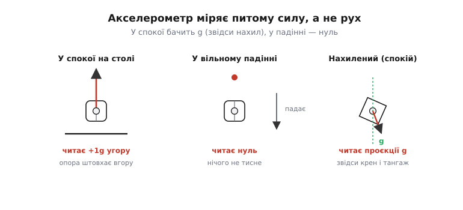
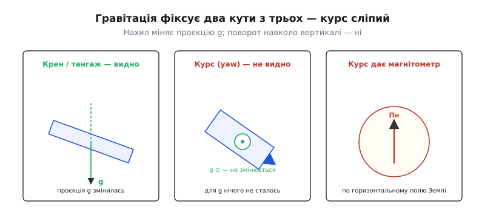
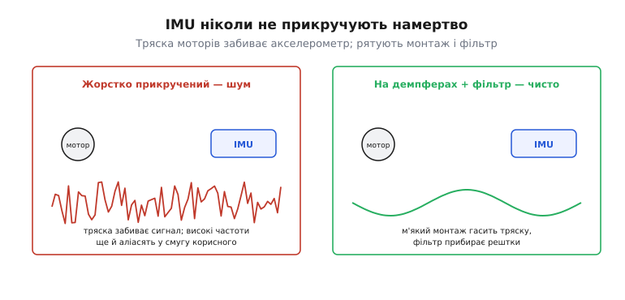
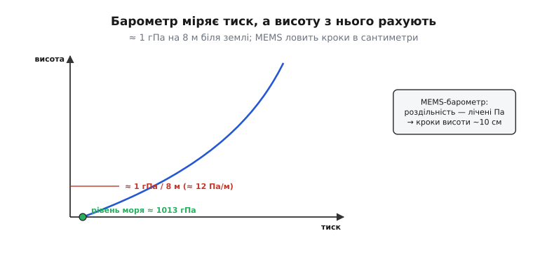
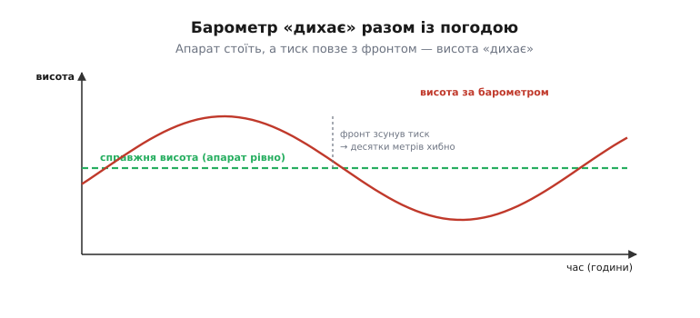

# IMU й барометр

Два найшвидші, найфундаментальніші чуття апарата — **інерціальний блок** (IMU, від англ. *inertial measurement unit* — «вузол інерціального вимірювання»; відповідає за орієнтацію й рух) і **барометр** (від грец. *baros* — «вага» і *metron* — «міра»; відповідає за висоту). Обидва — «відносні» [давачі на борту](root:embedded/onboard-sensors): блискавичні на коротких масштабах, але такі, що дрейфують і потребують абсолютного якоря. Фізику MEMS-давачів описують окремо; тут цікаве інше — **як вони поводяться як компоненти польоту**, у чому їхня підступність і чому без них нічого не злетить. Найбільша пастка криється вже в акселерометрі, який міряє зовсім не те, що здається.

### Акселерометр: він міряє не те, що ти думаєш

Назва обманює. Акселерометр (від лат. *accelerare* — «прискорювати» і грец. *metron* — «міра») **не** міряє «прискорення апарата» в звичному сенсі. Він міряє **питому силу** (англ. *specific force*) — негравітаційну силу на одиницю маси, яка діє на його пробну масу. Наслідки цього неінтуїтивні, але саме вони — ключ до розуміння всієї орієнтації:


*Акселерометр міряє не рух, а питому силу. У спокої на столі опора штовхає його вгору з силою mg — і він читає **+1g угору** (а не «нуль», хоч і лежить нерухомо). У вільному падінні на нього не діє жодна опора — і він читає **нуль** (хоч і розганяється!). Нахилений у спокої він бачить проєкції вектора g на свої осі — звідси й абсолютний крен і тангаж.*

Спершу це збиває з пантелику, та якщо вдуматися — прекрасно. У спокої акселерометр «відчуває» вектор тяжіння (точніше, реакцію опори, спрямовану проти нього), а отже, **знає, де низ**. Із напрямку «низу» легко дістати, наскільки апарат нахилений, — це **абсолютний** орієнтир крену й тангажа, що не дрейфує. Саме тому акселерометр — той «якір», що не дає орієнтації спливати.

Але є й біда, заради якої існує решта IMU. Коли апарат **розганяється**, до тяжіння домішується реакція на це прискорення — і акселерометр уже не може відрізнити «я нахилений» від «я прискорююсь убік». На віражі чи різкому розгоні він «бреше» про нахил. Сам по собі він надійний лише в спокої чи рівному русі.

Наскільки сильно розгін «прикидається» нахилом? Геометрія проста: горизонтальне прискорення `a` виглядає для акселерометра як нахил на кут `arctan(a/g)`. Порахуймо для помірного ривка.

**Приклад (розгін → удаваний нахил).** Апарат розганяється горизонтально з прискоренням `a = 0.2g`, стоячи насправді рівно. Який нахил «побачить» акселерометр?

:::tabs
```c
// кут нахилу з горизонтальної проєкції питомої сили (прошивка)
float a = 0.2f * 9.81f;          // 1.96 м/с²  — бічне прискорення
float g = 9.81f;                 // м/с²
float tilt = atan2f(a, g);       // = atan(0.2) рад
// atan(0.2) ≈ 0.1974 рад  →  0.1974 × 180/π ≈ 11.3°
```
```python
import math
# кут нахилу з горизонтальної проєкції питомої сили
a = 0.2 * 9.81                   # 1.96 м/с²  — бічне прискорення
g = 9.81                         # м/с²
tilt = math.atan2(a, g)          # = atan(0.2) рад
# atan(0.2) ≈ 0.1974 рад  →  0.1974 × 180/π ≈ 11.3°
```
:::

Виходить ≈ 11° удаваного нахилу — чимала брехня, якби їй повірити сліпо. Ось чому поєднання давачів на маневрі більше покладається на гіроскоп, а до акселерометра прислухається тим менше, чим сильніше апарат розганяється. Акселерометр — добрий суддя «де низ» лише тоді, коли апарат не пришвидшується.

> 🔧 **Навіщо це.** Запам'ятай: акселерометр у спокої читає **1g вгору**, у вільному падінні — **нуль**. Це не курйоз, а робоче знання: ось чому показанням акселерометра не можна довіряти нахил під час маневру, і чому будь-який стабілізатор обов'язково поєднує його з гіроскопом. Хто намагається тримати кут «лише на акселерометрі», отримує апарат, що смикається на кожному пориві.

### Гіроскоп і чому самого IMU мало для орієнтації

Друга половина IMU — **гіроскоп** (від грец. *gyros* — «оберт» і *skopein* — «бачити») — міряє **кутову швидкість** (°/с): як швидко апарат обертається. Він швидкий, чистий і не плутає нахил із прискоренням. Та щоб дістати з нього **кут**, його доводиться інтегрувати, а інтеграл накопичує найменший зсув нуля й **спливає**. Тож виходить ідеальна пара протилежностей: гіроскоп точний на коротку мить, але дрейфує; акселерометр абсолютний, але плутається в русі. Поєднавши їх ([комплементарним фільтром](root:com-signal/complementary-filter) чи [фільтром Калмана](root:com-signal/kalman-filter)), дістаємо орієнтацію, що й швидка, і стабільна.

Але навіть удвох вони мають сліпу пляму. Акселерометр бачить вектор g — **вертикальний**. А обертання навколо **вертикальної** осі (курс, *yaw*) цей вектор не змінює зовсім:


*Сліпа пляма гравітації. Нахил по крену чи тангажу повертає апарат відносно вектора g — і акселерометр це бачить. Але поворот навколо вертикалі (курс) лишає g незмінним — для гравітації «нічого не сталося». Тому абсолютний курс дає окремий давач — **магнітометр**, що орієнтується по горизонтальному полю Землі.*

Ось чому в [наборі давачів на борту](root:embedded/onboard-sensors) [магнітометр](root:hw-sensing/magnetometer) стоїть **поряд** з IMU, а не замість: гіроскоп дає швидку зміну курсу, але його абсолютне значення нема чим прив'язати, окрім компаса. Гравітація фіксує два кути з трьох; третій — за магнітним полем.

> 🔧 **Навіщо це.** Це пояснює типову поведінку апаратів: крен і тангаж тримаються добре навіть без компаса, а от **курс «пливе» або бреше саме тоді, коли збитий магнітометр**. Якщо апарат злітає рівно, але «не знає», куди дивиться, чи повільно крутиться на місці — підозрюй насамперед компас і його калібрування, а не гіроскоп.

> 📜 До речі, сам термін «гіроскоп» (грец. «бачити обертання») дав 1852 року **Леон Фуко** (*Léon Foucault*), що розкрученим ротором наочно показав обертання Землі. Згодом **Елмер Сперрі** (*Elmer Sperry*) зробив із гіроскопа **гірокомпас** і стабілізатори для кораблів, а перший **авіаційний автопілот** публічно показав 1914 року в Парижі вже його син **Лоренс Сперрі** (*Lawrence Sperry*) — пролетів над Сеною, знявши руки з керування, поки механік ходив по крилу. Сучасний [MEMS-гіроскоп](root:hw-sensing/gyroscope) не крутиться — він відчуває обертання через ефект Коріоліса на крихітній вібруючій структурі, — але робить ту саму роботу, що й важкий ротор Фуко.

### IMU в польоті: шум, зсув і головний ворог — вібрація

На сучасних апаратах акселерометр і гіроскоп сидять на одному MEMS-чіпі (а часто поряд і магнітометр — звідси «9 осей»), і саме цей чіп задає **серцебиття** швидкого контуру: його опитують сотні-тисячі разів на секунду, і кожне опитування — новий такт стабілізації. Якщо IMU «затнувся» чи зашумів, здригається весь політ — тому його читають із найвищим пріоритетом у [планувальнику задач](root:sys-dron/ardupilot-layers).

Реальний IMU недосконалий і по-іншому. У нього є **зсув нуля** (*bias* — показує трохи не нуль навіть у спокої), **шум**, **температурний дрейф** (показання повзуть при нагріванні — тому серйозні плати міряють температуру й вносять поправку, а інколи навіть підігрівають IMU до сталої). Усе це поєднання давачів здебільшого приборкує. Але є один ворог, що губить навіть добрий IMU, — **вібрація**.


*Чому IMU ніколи не прикручують намертво. Тряска моторів і гвинтів передається на акселерометр і забиває корисний сигнал (ліворуч). Гірше: високочастотна вібрація через дискретизацію [«аліасить»](root:com-signal/nyquist-aliasing) у смугу корисних частот, і її вже не відфільтрувати потім. Рятують **м'який монтаж** (демпфери, піна), що гасить тряску фізично, і **цифровий фільтр**, що прибирає рештки (праворуч).*

Вібрація — підступна тим, що частина її енергії через [ефект аліасингу](root:com-signal/nyquist-aliasing) маскується під повільні рухи апарата, і оцінювач сприймає її за реальні поштовхи. Тому боротьба з нею **дворівнева**: спершу прибрати фізично (демпфери під IMU), бо що в сигнал потрапило — те аліас уже міг зіпсувати, а тоді відфільтрувати залишки. Це не «тонке налаштування», а базова умова, щоб IMU взагалі давав правду.

> 🔧 **Навіщо це.** Вібраційний шум — причина №1, чому саморобні апарати «сходять з розуму» в польоті, хоч на столі все працює. Читаючи чужу збірку, перевір: чи стоїть IMU (часто всередині польотного контролера) на демпферах, чи збалансовані гвинти, чи не передається тряска від рами. Логи польоту майже завжди мають канал вібрації — це перше, куди дивляться за дивної поведінки.

З усього цього випливає й звична вимога: зсув нуля гіроскопа міряють **щоразу при ввімкненні**, поки апарат стоїть нерухомо, — ось чому наземна станція просить «не рухати» під час підготовки до зброєння. Кілька секунд спокою дають оцінювачу заміряти поточний зсув, щоб потім його віднімати з кожного відліку. Поворушиш апарат саме в цю мить — і зсув заміряється з помилкою, а орієнтація почне тихо спливати вже в польоті. Дрібний ритуал «постав і зачекай» — насправді калібрування, без якого швидке відчуття бреше.

### Барометр: тиск замість висоти

Друге чуття цієї пари влаштоване зовсім інакше. **Барометр** дає висоту, але робить це хитро: він міряє не висоту, а **атмосферний тиск**, який передбачувано падає, що вище піднімаєшся (повітря над тобою менше — воно менше тисне).


*Барометр міряє тиск, а висоту з нього рахують. Тиск спадає з висотою (біля землі — приблизно 1 гПа на кожні 8 метрів, тобто ~12 Па на метр). Сучасний MEMS-барометр розрізняє лічені паскалі — а отже, кроки висоти в сантиметри. Звідси його надзвичайна чутливість на коротких масштабах.*

Перевага вражає: оскільки давач ловить зміни тиску в кілька паскалів, він «бачить», як апарат піднявся на **десяток сантиметрів**. Звичайний (неаугментований) GNSS такої тонкості висоти не дасть — його вертикальна точність гірша за горизонтальну (хоча RTK-GNSS уже сягає сантиметрів). Порахуймо зв'язок тиску й висоти на простому прикладі:

**Приклад (тиск → висота).** Біля рівня моря тиск падає приблизно на 12 Па на метр, тобто 1 гПа (100 Па) ≈ 8.3 м. Нехай барометр показав, що тиск упав із 1013 до 1000 гПа:

```
Δp = 1013 − 1000 = 13 гПа
крок:  1 гПа ≈ 8.3 м   (≈ 12 Па/м біля землі)
Δh ≈ 13 × 8.3 ≈ 108 м
```

Тобто апарат піднявся приблизно на 108 метрів. (Точна формула — барометрична, з урахуванням температури, — але для відчуття масштабу годиться й цей лінійний крок.)

> 📜 Цей зв'язок «тиск ↔ висота» відкрили задовго до дронів. 1643 року **Еванджеліста Торрічеллі** (*Evangelista Torricelli*) зробив ртутний барометр і довів, що повітря має вагу й тисне. А 1648-го, за ідеєю **Блеза Паскаля** (*Blaise Pascal*), його швагер **Флорен Пер'є** (*Florin Périer*) виніс барометр на вершину гори Пюї-де-Дом (≈ 1000 м) — і ртутний стовпчик там був помітно нижчий, ніж біля підніжжя. Так народилася сама ідея **висотоміра**: міряючи тиск, можна знати висоту. Твій MEMS-барометр повторює дослід Пер'є тисячі разів на секунду.

### Чому барометр «дихає»: дрейф із погодою

Якщо барометр такий точний — чому ж він теж «відносний»? Бо тиск залежить не лише від висоти, а й від **погоди**. Атмосферний фронт може зсунути тиск на кілька гектопаскалів за години — і барометр «побачить» десятки метрів набору чи зниження висоти, яких насправді немає.


*Барометр «дихає» разом із погодою. Апарат стоїть на місці (зелена пряма — справжня висота), але тиск повільно повзе з атмосферним фронтом, і барометрична висота (червона) дрейфує на десятки метрів. На коротких хвилинах польоту це майже непомітно; на довгих — суттєво. Тому абсолютну прив'язку висоти дає GNSS або далекомір.*

Тому барометр використовують як **відносний** давач: висоту зазвичай «обнуляють» при зльоті (відлік відносно точки старту), а повільний дрейф підправляють GNSS чи далекоміром. Додаймо ще дві практичні біди: барометр чутливий до **струменя від гвинтів і вітру** (динамічний тиск «дме» в давач), тому його прикривають пінкою; і до **ефекту землі** при посадці. Усе це — той самий принцип [набору давачів на борту](root:embedded/onboard-sensors): швидке, що дрейфує, тримають повільним, що не дрейфує.

Ще одна тонкість — **відносно чого** барометр міряє. Висота з тиску — це висота над якоюсь опорною точкою (зазвичай — місцем зльоту, де відлік і обнуляють). Це **не** висота над поточною землею: пролітаючи над пагорбом, барометр не помітить, що земля піднялась назустріч. Для справжньої висоти над поверхнею — потрібної саме на зльоті й посадці — ставлять **далекомір** (лазерний чи ультразвуковий), що міряє відстань прямо вниз. Барометр каже «висоту польоту загалом», далекомір — «скільки лишилось до землі тут і зараз».

> 🔧 **Навіщо це.** Якщо апарат у режимі утримання висоти повільно «спливає» вгору-вниз протягом польоту — це майже напевно барометричний дрейф або незакритий від вітру давач, а не поломка. А ще: ніколи не порівнюй барометричну висоту двох польотів у різні дні «в лоб» — погода між ними могла зсунути нуль на десятки метрів.

### Що з усього цього складається

Інерціальний блок і барометр — це швидке, але «відносне» ядро відчуття апарата. **Акселерометр** міряє питому силу: у спокої бачить вектор g (дає абсолютний крен і тангаж), але плутає нахил із прискоренням у русі. **Гіроскоп** дає чисту кутову швидкість, але його кут дрейфує; удвох вони (через поєднання давачів) тримають орієнтацію, проте курс лишається сліпою плямою — його закриває магнітометр. Реальному IMU дошкуляють зсув, шум і насамперед **вібрація**, тож його ставлять на демпфери й фільтрують. **Барометр** дає надзвичайно тонку висоту з тиску (сантиметри!), але «дихає» з погодою, тож працює як відносний давач, що його прив'язує GNSS. Обидва давачі показують ту саму закономірність: чесне відчуття народжується не з одного приладу, а з командної гри багатьох.

Варто помітити, що та сама пара закриває й **вертикаль**. Барометр дає висоту — повільно й шумно; вертикальна вісь акселерометра дає швидке вертикальне прискорення. Поєднавши їх, оцінювач отримує гладку вертикальну швидкість і висоту — точнісінько як орієнтацію він поєднав із гіроскопа й акселерометра. Та сама ідея поєднання давачів, та сама пара «швидке × стабільне», лише для іншої величини.

А найабсолютніший якір із усіх — [супутникова навігація](root:hw-sensing/gnss): саме вона прив'язує і повільний дрейф висоти барометра, і горизонтальне положення апарата до незмінних координат Землі.

---
