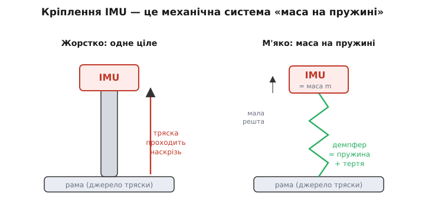
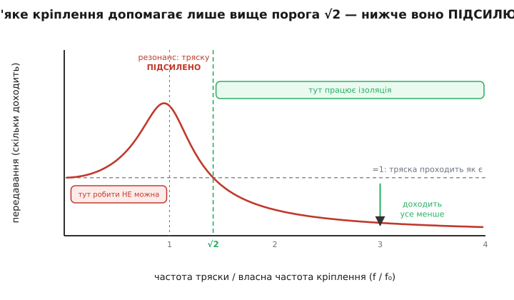
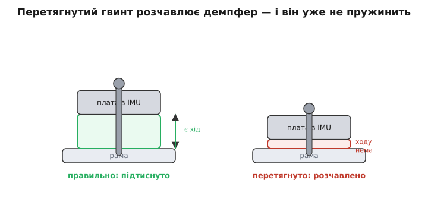

# Матеріали для кріплення IMU

У [попередньому кроці](root:embedded/imu-barometer) ми дійшли простого, але залізного висновку: IMU **ніколи не прикручують намертво**. Тряска моторів і гвинтів забиває корисний сигнал, а частина її через дискретизацію ще й «аліаситься» у смугу повільних рухів — і її вже нічим не відфільтрувати потім. Рятунок — м'який монтаж плюс цифровий фільтр. Звідти ми й рушимо далі, бо за порадою «постав на демпфери» ховається ціла маленька інженерія, у якій легко все зіпсувати. Демпфер можна підібрати так, що стане **гірше**, ніж без нього взагалі.

Чому так? Бо матеріал під IMU — це не «гумка, що гасить тряску». Це **налаштований механічний фільтр**, і, як будь-який фільтр, він має смугу, де працює, і смугу, де нашкодить. Поставив не той матеріал чи не під ту масу — і потрапив у другу смугу. Тому розберімося не з переліком «що приклеїти», а з тим, **як кріплення поводиться як фізична система** і **що насправді робить кожен матеріал**. Тоді вибір стане очевидним, а не вгадуванням.

Саму причину, чому вібрація така руйнівна для давача — як вона насичує діапазон і аліаситься ще до того, як числа дійдуть до програми, — ми тут не переповідаємо; її розбирає окрема стаття.

> 🔧 **Навіщо це.** Це найчастіша прихована причина того, що акуратно зібраний апарат «сходить з розуму» в польоті, хоч на столі бездоганний. Демпфер під польотним контролером є — а апарат смикається. Часто винен не той матеріал або перетягнутий гвинт, і поки не розумієш механіки кріплення, шукати марно. [Чому саме вібрація руйнує IMU](root:hw-sensing/imu-vibration-isolation) — окрема історія (насичення діапазону та аліасинг швидкого тремтіння в повільний хибний сигнал); тут ми приймаємо це як даність і займаємося самим кріпленням.

### Кріплення IMU — це маса на пружині

Почнімо з образу, який пояснює все інше. Візьмемо IMU (часто це цілий польотний контролер із давачем усередині) і покладемо його на шматок м'якого матеріалу, а той — на раму. Що ми щойно зібрали? **Вантаж на пружині.** Маса — це сам IMU з платою; пружина — матеріал під ним; а ще матеріал трохи «в'язкий», тобто гасить рух тертям усередині себе. Це класична механічна система: маса, пружність, тертя.


*Два способи поставити давач. Жорстко (ліворуч) IMU й рама — одне тіло: усе, що трясе раму, трясе й давач. На м'якому матеріалі (праворуч) між ними з'являється пружина з тертям, і давач стає окремою масою, яку рама розгойдує лише частково. Саме ця «окремість» і дає розв'язку — але, як побачимо, лише на правильних частотах.*

Чому цей образ такий важливий? Бо вантаж на пружині має **власну частоту** — ту, на якій він охоче гойдається сам, якщо його штовхнути. Підвісь гайку на гумці й смикни — вона затрясеться з певним ритмом. Стане гайка важчою — ритм сповільниться; візьми твердішу гумку — пришвидшиться. Точно так само поводиться IMU на демпфері: у нього є своя власна частота гойдання, і вся поведінка кріплення крутиться навколо неї.

Жорстке кріплення — це та сама система, але з нескінченно твердою «пружиною». Нескінченно тверда пружина не дає масі рухатися окремо від основи: давач і рама стають одним тілом, і тряска проходить наскрізь без послаблення. Ось чому намертво прикручений IMU дістає всю вібрацію — у нього просто немає тієї пружини, що могла б її поглинути.

> 🔧 **Навіщо це.** Тримай цей образ у голові щоразу, коли вибираєш матеріал: ти не «гасиш тряску губкою», ти **будуєш вантаж на пружині й налаштовуєш його власну частоту**. Усі подальші правила — лише наслідки цього. Хто бачить кріплення так, той не питає «який поролон кращий», а питає «яка вийде власна частота й де вона ляже відносно тряски моторів».

### Головне правило: поріг √2

Тепер найважливіше, заради чого вся ця механіка. Питання просте: коли демпфер допомагає, а коли шкодить? Відповідь дає поведінка вантажа на пружині під зовнішнім струшуванням — і вона неінтуїтивна.

Уведемо одне відношення: частоту тряски `f` поділимо на власну частоту кріплення `f₀`. Усе залежить тільки від нього. І виявляється, що передавання — частка тряски, яка доходить до давача, — поводиться так:

```
f / f₀ ≈ 1     → РЕЗОНАНС: тряска проходить ПІДСИЛЕНОЮ (у кілька разів!)
f / f₀ = √2    → доходить рівно стільки, скільки прийшло (демпфер «нульовий»)
f / f₀ > √2    → доходить усе менше: ось тут і починається ізоляція
```


*Скільки тряски доходить до давача залежно від того, у скільки разів вона швидша за власну частоту кріплення. Зліва від резонансу демпфер **підсилює** тряску — там його ставити не можна. На відношенні √2 ≈ 1.41 він не дає нічого. І лише **правіше** √2 передавання падає нижче одиниці — давач справді захищений, і що далі праворуч, то краще. Уся хитрість кріплення — загнати тряску моторів глибоко в цю праву зону.*

Зупинімося на цьому, бо тут — серце справи. Якщо власна частота кріплення опиниться **близько** до частоти тряски моторів, демпфер не послабить вібрацію, а **розгойдає** її: на резонансі вантаж на пружині гойдається з розмахом, більшим за вхідний поштовх. Це гірше, ніж жорстке кріплення, де тряска хоч би проходила «один до одного». А тепер згадаймо реальність: мотори трясуть раму на сотнях герц. Отже, щоб опинитися праворуч від √2, власну частоту кріплення треба зробити **набагато нижчою** за ці сотні герц — кинути її в кілька десятків герц чи нижче. М'який матеріал і достатня маса саме це й роблять: знижують `f₀`, відсуваючи весь робочий діапазон у праву, корисну зону.

> 🔧 **Навіщо це.** Звідси випливає головна практична заповідь м'якого монтажу: **роби кріплення достатньо м'яким, щоб його власна частота лягла значно нижче частоти моторів.** Занадто тверда «розв'язка» (тонкий жорсткий гумовий п'ятачок, стяжка, твердий двобічний скотч) ставить `f₀` небезпечно близько до обертів — і ти потрапляєш у резонанс, тобто робиш собі гірше, ніж без неї. «М'якше, ніж здається треба» — тут зазвичай правильний напрямок.

Скільки ж це — «достатньо м'яко»? Порахуймо власну частоту простого кріплення, щоб відчути порядок величин.

**Приклад (власна частота кріплення).** Польотний контролер масою `m = 30 г = 0.030 кг` стоїть на чотирьох м'яких подушечках, що разом дають жорсткість `k = 3000 Н/м` (помірно м'який силікон). Яка власна частота й чи годиться вона проти моторів, що крутяться на ~300 об/с?

:::tabs
```c
// власна частота вантажа на пружині: f0 = (1/2π)·√(k/m)
#include <math.h>
float m = 0.030f;            // кг — маса плати з IMU
float k = 3000.0f;           // Н/м — сумарна жорсткість усіх подушок
float w0 = sqrtf(k / m);     // кутова частота, рад/с: √(3000/0.03)=√100000≈316
float f0 = w0 / (2.0f * 3.14159f);   // Гц
// f0 ≈ 316 / 6.283 ≈ 50.3 Гц
```
```python
# власна частота вантажа на пружині: f0 = (1/2π)·√(k/m)
import math
m = 0.030            # кг — маса плати з IMU
k = 3000.0           # Н/м — сумарна жорсткість усіх подушок
w0 = math.sqrt(k / m)          # кутова частота, рад/с: √(3000/0.03)=√100000≈316
f0 = w0 / (2 * math.pi)        # Гц
# f0 ≈ 316 / 6.283 ≈ 50.3 Гц
```
:::

Виходить `f₀ ≈ 50 Гц`. Перевіримо відношення: мотори на 300 Гц дають `f/f₀ = 300/50 = 6` — це глибоко праворуч від √2 ≈ 1.41, у добрій зоні ізоляції. А от якби той самий контролер ми поставили на тверду гумку з `k = 100000 Н/м`, власна частота підскочила б до `f₀ ≈ 290 Гц` — майже в резонанс із моторами. Той самий давач, та сама маса — лише інший матеріал, і з рятівника демпфер перетворюється на підсилювач тряски. Ось чому вибір матеріалу — не дрібниця оздоблення, а власне інженерія.

Чому власна частота падає саме як корінь? Бо `f₀ ∝ √(k/m)`: учетверо м'якший матеріал знижує частоту лише вдвічі, і вчетверо важчий вантаж — теж лише вдвічі. Це означає дві речі заразом. По-перше, не вийде «трохи м'якшим матеріалом» сильно зсунути частоту — потрібні відчутно м'якші подушки або помітно більша маса. По-друге, **маса допомагає**: важчий вузол на тому самому матеріалі має нижчу власну частоту, тобто **краще** ізольований. Це пояснює давню практику — інколи до легкого давача навмисно додають маленьку масу-баласт, щоб опустити `f₀`. Повний розбір цієї кривої — звідки беруться підсилення на резонансі й спад після нього, як на них впливає тертя — винесений в [окрему математичну вставку](root:embedded/imu-mounting-materials/math-transmissibility.md), тут досить самого правила √2.

### Зоопарк матеріалів: що насправді робить кожен

Тепер, коли ми знаємо, що шукаємо — низьку власну частоту й достатнє тертя, — пройдімося матеріалами, які реально йдуть під IMU. Дивитимемося на кожен через ту саму призму: яку він дає пружність, скільки тертя й де ламається.

**М'яка піна (поролон, спінений поліуретан).** Найдешевший і найпоширеніший варіант — шматочок м'якої піни, часто з клейким шаром. Він добре знижує власну частоту (м'який) і має пристойне внутрішнє тертя (комірки тиснуть повітря туди-сюди). Біда піни — **повзучість**: під постійним тиском вона поступово стискається й більше не розправляється, тож із місяцями жорсткість «попливе», а з нею й власна частота. До того ж піна боїться мастил, палива й сонця. Для аматорського апарата це чудовий старт; для серйозного — тимчасове рішення.

**Силіконовий гель і гелеві подушечки.** Крок угору — спеціальні гелеві стрічки й подушки (на зразок тих, що під барабанні мікрофони чи в антивібраційних килимках). Силіконовий гель дуже м'який і **дуже в'язкий**: він не пружинить, як гумка, а «глитає» рух, перетворюючи його на тепло. Висока в'язкість — це велике тертя, а велике тертя **притлумлює пік на резонансі**: навіть якщо ти випадково підійшов до власної частоти, гель не дасть розгойдатися так сильно, як суха пружна гума. Тому гелеві подушки — частий і надійний вибір під польотні контролери. Їхня вада — вони липкі, збирають пил і не люблять високих температур.

**В'язкопружні полімери (типу сорботану).** Окрема порода — [в'язкопружні матеріали](root:embedded/imu-mounting-materials/comp-damping-mounts.md), створені спеціально, щоб гасити, а не пружинити. Найвідоміший — сорботан: спеціальний поліуретан, що поводиться напівтвердо-напіврідко й розсіює дивовижну частку енергії удару в тепло. На дотик він наче «мертвий», без віддачі — кинута на нього кулька майже не підстрибує. Саме ця «мертвість» означає сильне тертя, тобто м'який резонанс і добру ізоляцію. Такі матеріали йдуть туди, де тряска жорстка, а вимоги високі. Тонкість у тому, що їхні властивості залежать від температури: на морозі в'язкопружний полімер дубіє й гасить гірше, на спеці — м'якне.

**Двобічний спінений скотч (акриловий).** Дуже зручний для монтажу плат акриловий [спінений скотч](root:embedded/imu-mounting-materials/comp-damping-mounts.md) (широко відомий під маркою VHB) — це теж в'язкопружна піна, лише у формі клейкої стрічки. Він і тримає, і трохи демпфує. Але обережно: тонкий шар такого скотча **жорсткіший**, ніж здається, тож його власна частота може вийти зависокою. Тонкий твердий скотч під IMU — поширена пастка: тримає чудово, а від вібрації майже не рятує, бо `f₀` сидить близько до моторів. Хочеш ізоляції з нього — бери товстіший і м'якший різновид, а не найтонший «намертво».

**Гумові втулки, грумети й кільця.** Класика «дорослого» монтажу — гумові втулки (грумети) в отворах плати чи маленькі стійки-демпфери, крізь які проходить гвинт. Перевага в тому, що жорсткість тут **закладена конструктивно** й передбачувана: виробник дає матеріал і форму, розраховані на діапазон мас. Тонкі тверді гумові кільця (на кшталт ущільнювальних) — навпаки, кепський вибір: вони задумані ущільнювати, а не гасити, тож зазвичай надто тверді й дають зависоку власну частоту. Грумети під розрахункову масу — добре; перше-ліпше тверде кільце «бо було під рукою» — погано.

Спільна нитка крізь увесь цей перелік одна: **м'якість опускає власну частоту (добре), тертя притлумлює резонансний пік (теж добре), а кожен матеріал десь ламається** — піна повзе, гель боїться спеки, в'язкопружне дубіє на морозі, тонкий скотч зажорсткий. Немає «найкращого» матеріалу — є відповідний цій масі, цій тряс­ці й цим температурам.

### Пастка, що губить навіть правильний матеріал: перетяжка

Можна вибрати ідеальний демпфер і все одно лишитися без ізоляції — одним рухом викрутки. Найпідступніша помилка м'якого монтажу — **перетягнути гвинт**.


*Чому гвинт не можна тягнути «до упору». Демпфер працює, лише поки може стискатися й розправлятися — поки в нього є запас ходу (ліворуч). Перетягнутий гвинт розчавлює матеріал у тонкий твердий млинець (праворуч): ходу не лишилося, пружинити нема чим, і вузол знову став майже жорстким — з усією тряскою наскрізь.*

Механіка тут пряма. М'який матеріал гасить тряску, бо стискається на неї й тут же розправляється — у нього є **запас ходу**. Закрути гвинт до упору — і ти стиснеш демпфер у тонкий твердий шар, у якого ходу майже не лишилося. А стиснутий матеріал ще й **твердішає** (його стає важче стиснути далі), тобто власна частота підскакує — назад у небезпечну зону резонансу. Вийшло подвійно зле: і ходу нема, і `f₀` злетіла. Зовні все начебто на демпферах, а працює як прикручене намертво.

> 🔧 **Навіщо це.** Це пояснює класичну загадку: «я ж поставив на гель, чому досі трясе?» Перевір гвинти. М'який монтаж тримають **підтиснутим, не затягнутим**: гвинт лише фіксує, а матеріал має лишатися помітно пружним на дотик. Часто між гвинтом і платою ставлять обмежувач (втулку-розпірку чи буртик), що не дає перетиснути демпфер, хоч би як крутили. Якщо такого обмежувача немає — тягни делікатно й перевіряй пальцем, що подушка ще «дихає».

### Ще два спотикання: упор у дно й тепловий місток

Дві дрібніші, але реальні пастки замикають картину.

**Упор у дно (англ. *bottoming-out*).** Якщо демпфер замало товстий або вузол важкий, плата на сильному поштовху може **дістати до основи** — стукнутися об раму під собою. У ту мить розв'язки наче й не було: удар проходить напряму, твердо, з гострим піком, який якраз і насичує давач. Тому під IMU лишають достатній зазор і товщину матеріалу, щоб на найбільшій сподіваній тряс­ці плата нікуди не діставала й нічим не торкалася. Те саме стосується дротів: туго натягнутий чи притиснений джгут перетворюється на **жорсткий місток**, яким тряска оминає демпфер і йде в плату напряму. Дроти до м'яко підвішеного IMU лишають вільною петлею — щоб вони висіли, а не передавали вібрацію.

**Тепловий місток.** М'яке кріплення майже завжди ще й **тепловий ізолятор**: піна, гель і гума погано проводять тепло. Згадаймо з [попереднього кроку](root:embedded/imu-barometer), що IMU має температурний дрейф — показання повзуть зі зміною температури, тому серйозні плати міряють температуру давача й вносять поправку, а інколи навіть **підігрівають** IMU до сталої. М'яко підвішений давач, відрізаний від металу, нагрівається й охолоджується інакше: повільніше реагує на зовнішнє, але й гірше скидає власне тепло. Для плат із підігрівом IMU це навіть на руку — теплу нема куди швидко тікати, стабілізувати температуру легше. Але якщо покладатися на тепловий контакт із рамою як радіатором, м'який монтаж його розриває. Висновок простий: вибираючи демпфер, пам'ятай, що ти заразом міняєш і тепловий режим давача, — і не дивуйся повільнішому виходу температури на робочу точку.

### Як упевнитися, що кріплення вдале

Уся ця механіка лишалася б теорією, якби не було як її перевірити. На щастя, сам IMU — найкращий вимірювач власної вібрації. Політний контролер у логах майже завжди веде канал вібрації (по суті — рівень тряски, що долетіла до акселерометра). Це і є прямий вердикт кріпленню: добрий монтаж тримає цей рівень низьким, поганий — високим, а резонанс видно як вузький сплеск на певній частоті обертів.

Звідси проста дисципліна доведення. Зібрав на демпфери — підняв, политав, **глянув лог вібрації**. Високий загальний рівень — матеріал заслабкий, перетягнутий або плата впирається в дно. Сплеск на якихось обертах — потрапив у резонанс, треба зробити кріплення м'якшим (опустити `f₀` нижче) або додати тертя (в'язкіший матеріал, що притлумить пік). Так вибір матеріалу з вгадування стає коротким циклом «постав — заміряй — поправ», де числа з логу прямо кажуть, у який бік рухати власну частоту. Глибше полювання на ці сплески — окрема тема [вібродіагностики](root:embedded/vibration-diagnostics); тут досить знати, що кріплення не приймають «на віру», а звіряють із логом.

> 🔧 **Навіщо це.** Це перетворює монтаж IMU з мистецтва на ремесло. Не треба інтуїтивно «відчувати», добра вийшла подушка чи ні — підніми апарат, зчитай канал вібрації й подивись на число. Один політ із логом дає більше, ніж година роздумів про поролон. І та сама звичка ловить деградацію: піна з часом просіла, гель задубів на морозі — лог вібрації покаже це раніше, ніж апарат почне падати.

### Що з усього цього складається

Ми почали з висновку попереднього кроку — IMU не кріплять жорстко — і розкрили, що ховається за словом «демпфер». Кріплення давача — це **вантаж на пружині з тертям**, у якого є власна частота `f₀`. Уся справа крутиться навколо одного порога: нижче `f/f₀ = √2` демпфер **підсилює** тряску (резонанс), і лише вище — ізолює. Тому головне завдання матеріалу — зробити власну частоту **достатньо низькою**, щоб сотні герц моторної тряски опинилися глибоко в зоні ізоляції; а оскільки `f₀ ∝ √(k/m)`, цього досягають м'яким матеріалом і достатньою масою.

Далі ми побачили, що кожен матеріал грає ту саму партію по-своєму: м'яка піна дешева, але повзе; силіконовий гель в'язкий і добре глушить резонанс; в'язкопружні полімери гасять найкраще, та залежать від температури; тонкий двобічний скотч підступно жорсткий; грумети передбачувані. І жоден правильний вибір не врятує, якщо перетягнути гвинт (демпфер розчавлений — ходу нема), дати платі впертися в дно чи прокласти жорсткий місток дротами. Нарешті, м'який монтаж заразом міняє тепловий режим давача — про що варто пам'ятати через температурний дрейф IMU. А останнє слово завжди за логом вібрації: він прямо каже, чи лягла власна частота туди, куди треба, чи ще ні.

Виходить та сама думка, що пронизує весь цей модуль про давачі: добре відчуття народжується не лише з доброго давача, а з усього, що навколо нього, — і шматок правильно підібраного м'якого матеріалу під IMU важить для чесного польоту не менше, ніж сам кремній усередині чіпа.

---
