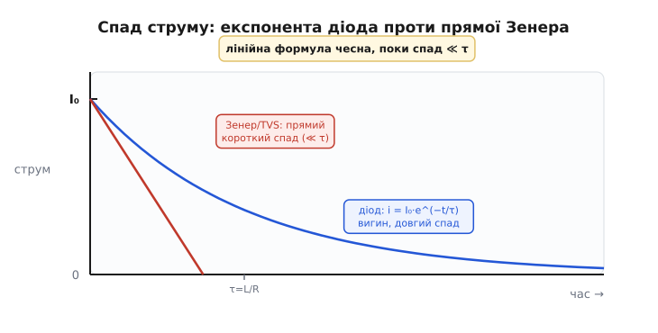
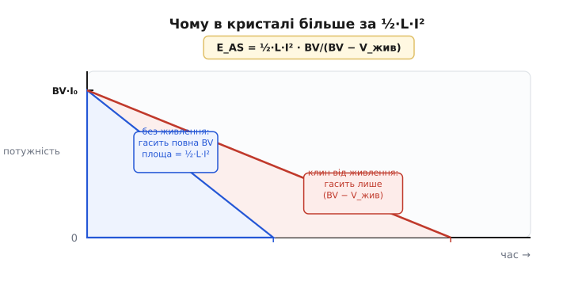

# 🧮 Математика клампа: час спаду, енергія в кристалі, межа за частотою

У темі ми вивели чотири формули й одразу ними скористалися: швидкість спаду di/dt = (V_кламп − V_жив)/L, час вимкнення t_off = L·I₀/(V_кламп − V_жив), енергію поля ½·L·I² і середню потужність ½·L·I²·f. Кожна з них там з'явилася як готовий інструмент — узяли й порахували. Тут ми кожну **виведемо від першопричини**, бо за простими формулами ховаються три тонкощі, на яких ламаються навіть досвідчені:

- спад струму з простим діодом **не лінійний** — це експонента τ = L/R, і ми побачимо, коли її можна вважати прямою, а коли ні;
- енергія, що насправді гріє кристал у лавинному режимі, **більша** за ½·L·I² — і поправковий множник BV_DSS/(BV_DSS − V_жив) ми не приймемо на віру, а отримаємо інтегруванням потужності за час лавини;
- середня потужність ½·L·I²·f — це лише вхід у **теплову** задачу, а виходом є **гранична частота**, вище якої кристал перегрівається; її ми теж порахуємо.

Ця вставка — про **числа за фізикою клампа**. Якісну картину («що вищий кламп, то крутіший спад», «два рейтинги — джоулі й потужність») ми вже бачили в темі; тут — апарат, яким її рахують і де він непомітно бреше, якщо застосувати наосліп.

Відправна точка стоїть окремо, і ми нею просто користуємося.

> 🔧 Поки крізь котушку індуктивності L тече струм I, у її магнітному полі запасено енергію E = ½·L·I². Множник ½ — той самий, що в конденсаторі: струм наростає від 0 до I **поступово**, і кожна порція енергії «заходить» під дедалі більшим струмом, тож у середньому — під половинним. Розмикання змушує це поле спадати, а спадаюче поле наводить напругу, що силкується втримати струм. Виведення — [енергія котушки](topic:electronics/inductor-energy).

## Постановка: одне рівняння на всі кламми

Усе починається з єдиного рівняння, і варто записати його чесно, бо з нього виросте решта. Котушка підкоряється своєму означенню: напруга на ній пропорційна швидкості зміни струму.

```
V_L = L · di/dt
```

До розмикання струм сталий (di/dt = 0), і котушка — просто шматок дроту з опором обмотки R. У мить розмикання ключа струм котушки I₀ нікуди подітися не може — індуктивність не дозволяє струмові стрибнути миттєво (це означало б нескінченне di/dt і нескінченну напругу). Тому струм **продовжує текти** тим самим значенням I₀, але вже не через ключ, а через кламп, який ми поставили йому в обхід.

Тепер запишімо обхід контуру «котушка → кламп → назад до живлення». Один кінець котушки сидить на плюсі живлення V_жив, другий — на вузлі, який кламп тримає на напрузі V_кламп. Котушка бачить різницю цих двох напруг, і саме вона стоїть у лівій частині рівняння котушки. Але напруга, що жене струм **донизу**, протилежна за знаком наростанню, тож:

```
V_кламп − V_жив = −L · di/dt
```

Звідси — стрижневе рівняння всього кроку, з якого ми не випустимо жодної з чотирьох формул:

```
di/dt = −(V_кламп − V_жив) / L
```

Знак мінус каже головне: різниця (V_кламп − V_жив) завжди **додатна** (кламп тримає вище за живлення, інакше струм через нього не пішов би), тож di/dt **від'ємне** — струм спадає. А величина спаду прямо пропорційна цій різниці. Усе подальше — це по-різному розв'язане **одне й те саме** рівняння, залежно від того, чи V_кламп стала, чи сама залежить від струму.

## Виведення першого: час спаду з простим діодом — чесна експонента

Найдешевший кламп — звичайний гасний діод. У темі ми сказали, що тут струм спадає «не зовсім лінійно — це експонента τ = L/R». Доведімо це й побачимо, **звідки** береться R, бо саме він робить діодний випадок інакшим за всі решта.

Річ у тім, що в попередньому рівнянні V_кламп для діода — **не стала**. Діод тримає на собі майже фіксовані ~0.7 В, але між котушкою й живленням стоїть ще опір обмотки R, на якому падіння **залежить від струму**: чим більший струм, тим більше падає на R. Запишімо контур чесно, з усіма падіннями. Після розмикання струм тече по петлі «котушка → діод → опір обмотки». ЕРС самоіндукції котушки −L·di/dt мусить покрити і падіння на діоді V_D, і падіння на власному опорі i·R:

```
−L · di/dt = V_D + i · R
```

Це вже не те просте рівняння зі сталою правою частиною — тут права частина **сама залежить від струму** через доданок i·R. Саме він перетворює прямий спад на криву. Перепишімо у звичному вигляді лінійного диференціального рівняння:

```
L · di/dt + i · R = −V_D
```

Розв'язок такого рівняння — добре знана сума: усталений рівень плюс згасальна експонента. Усталений струм (коли di/dt = 0) дорівнює −V_D/R — крихітне від'ємне число, бо діод дозволяє зворотному струмові текти лише на мікроампери; практично це нуль. А перехідна частина згасає зі **сталою часу τ = L/R**. З початковою умовою i(0) = I₀:

```
i(t) ≈ I₀ · e^(−t/τ),     τ = L / R
```

Ось вона, експонента, і ось звідки τ = L/R: вона з'являється тому, що в контурі є опір R, на якому магнітна енергія поля **поступово розсіюється**, як у будь-якому [RL-колі, що розряджається](topic:electronics/rl-time-constant). Що більший опір обмотки, то швидше згасає струм; що більша індуктивність, то довше тримається. Це той самий механізм, що в розряді конденсатора через резистор, лише роль накопичувача грає магнітне поле, а не електричне.

Тепер — практичний висновок, який у темі дано числом. Експонента ніколи не сягає нуля точно, тож «вимкненим» струм вважають, коли він спав до кількох відсотків від початкового. За 3τ лишається e^(−3) ≈ 5 %, за 5τ — e^(−5) ≈ 0.7 %. Звідси й правило «3…5 сталих часу».

**Умова: реле 12 В, обмотка L = 80 мГн, R = 200 Ом, робочий струм I₀ = 60 мА, кламп — простий діод.**

```
τ = L / R = 0.080 / 200 = 0.0004 с = 0.4 мс
до 5 %  (3τ):  3 · 0.4 = 1.2 мс
до 0.7 % (5τ): 5 · 0.4 = 2.0 мс
```

Ці ж 1.2…2.0 мс ми бачили в темі — тепер видно, що вони не вгадані, а виведені з τ = L/R. І тут варто спіймати тонкість, через яку в темі для **діода** рахували експонентою, а для Зенера й TVS — лінійно. Подивімося, **коли** експонента майже пряма.

Розкладемо її на початку в ряд: e^(−t/τ) ≈ 1 − t/τ для малих t/τ. Лінійний доданок — це і є пряма лінія; кривина ховається в наступному доданку (t/τ)²/2. Поки t набагато менший за τ, квадратичним доданком можна знехтувати, і спад **майже прямий**. А коли спад короткий? Коли різниця (V_кламп − V_жив) велика — тобто для Зенера чи TVS, що тримають десятки вольтів. Перевіримо це на числах самої теми: для Зенер-клампа струм треба було звести з 2 А до нуля за ~50 мкс, тоді як τ обмотки соленоїда (L = 10 мГн при, скажімо, R = 5 Ом) дорівнює 10e-3/5 = 2 мс. Спад (50 мкс) у **сорок разів** коротший за τ — на такому відрізку експонента нерозрізнима з прямою, тож лінійна формула чесна. А для діода спад (1.5 мс) **сумірний** з τ (0.4 мс) — тут пряма вже бреше, і треба експоненту.

> 🔧 **Навіщо це.** Це відповідь на питання «коли можна рахувати простіше». Якщо кламп **високий** (Зенер, TVS, лавина) і спад **короткий** проти τ обмотки — бери лінійну формулу t_off = L·I₀/(V_кламп − V_жив), вона точна й миттєва. Якщо кламп **низький** (діод) і спад тягнеться сумірно з τ — бери експоненту й рахуй через 3…5τ. Сплутати їх — означає або переоцінити швидкість дешевого діода, або марно ускладнити розрахунок швидкого TVS.


*Чому діод рахують експонентою, а Зенер — прямою. З низьким діодним клампом струм згасає за експонентою i = I₀·e^(−t/τ), τ = L/R — крива помітно вигинається, бо спад тягнеться сумірно зі сталою часу обмотки. З високим клампом (Зенер, TVS) спад крутий і короткий — він уривається задовго до того, як експонента встигне зігнутися, тож на цьому відрізку вона нерозрізнима з прямою. Лінійна формула чесна саме там, де спад набагато коротший за τ.*

## Виведення другого: лінійний спад і час вимкнення для високого клампа

Тепер протилежний край — Зенер, TVS чи лавинний ключ, що тримають **сталу** напругу V_кламп незалежно від струму. Це найпростіший випадок нашого стрижневого рівняння, бо права частина — стала. Якщо опором обмотки можна знехтувати (а ми щойно з'ясували, що для короткого спаду — можна), рівняння каже, що di/dt — стала величина:

```
di/dt = −(V_кламп − V_жив) / L = const
```

Стала похідна означає **пряму лінію**: струм спадає рівномірно від I₀ до нуля. Час цього спаду знаходимо тривіально — повний перепад струму I₀ поділити на швидкість його зміни:

```
t_off = I₀ / |di/dt| = L · I₀ / (V_кламп − V_жив)
```

Ось і друга формула теми, виведена в один рядок. Вона читається в обидва боки, і саме це робить її робочим інструментом проектувальника. Знаєш кламп — отримуєш час. Заданий час — отримуєш потрібну різницю напруг, а з неї кламп:

```
(V_кламп − V_жив) = L · I₀ / t_off
```

**Умова: соленоїд L = 10 мГн, I₀ = 2 А, живлення 24 В, кламп тримає V_кламп = 75 В.**

```
t_off = L · I₀ / (V_кламп − V_жив) = 0.010 · 2 / (75 − 24) = 0.020 / 51 ≈ 392 мкс
```

Ті самі ~390 мкс, що в темі. А якби ми **вимагали** 50 мкс, та сама формула навпаки дала б потрібну різницю 0.020/0.000050 = 400 В — і одразу видно, що це задорого для ключа. Формула не лише рахує — вона **показує межу можливого**: швидке вимкнення великого струму неминуче коштує високої напруги на ключі, бо обидва стоять у тому самому дробі.

Тут є ще одна річ, варта окремого слова, — **лінійність** спаду високого клампа має наслідок для енергії. Якщо струм спадає прямою від I₀ до нуля за час t_off, то інтеграл струму за цей час (площа трикутника) дорівнює ½·I₀·t_off. Це знадобиться за мить, коли рахуватимемо енергію в лавині: саме трикутна форма спаду дасть чистий множник ½.

## Виведення третє: чому в кристалі більше за ½·L·I² — поправка UIS

Тепер найцікавіше — місце, де інтуїція «вся енергія поля ½·L·I² йде в кламп» дає **збій**. У темі ми написали канонічну формулу лавинного режиму з поправковим множником і пообіцяли вивести його. Виводимо.

Спершу — звідки взагалі підозра, що ½·L·I² **замало**. Уявіть лавинний ключ: зовнішнього клампа немає, сам MOSFET увійшов у пробій і тримає на собі свою пробивну напругу BV_DSS. Поки він її тримає, у контурі діє рівняння, яке ми вже знаємо, лише V_кламп = BV_DSS:

```
di/dt = −(BV_DSS − V_жив) / L
```

Зверніть увагу на знаменник: струм женеться донизу різницею (BV_DSS − V_жив), а **не** повною BV_DSS. Чому? Бо живлення V_жив усе ще під'єднане і **тягне струм у протилежний бік** — воно й далі силкується підкачувати струм у котушку, як робило до розмикання. Лавина мусить долати не лише власну індуктивність, а й це підпихання живлення. Ось перший натяк: живлення не самоусунулося, воно бере участь.

Тепер порахуймо енергію двома незалежними способами, бо результат настільки контрінтуїтивний, що один доказ лишає сумнів.

**Спосіб перший — баланс енергій (звідки береться зайве).** Спитаймо, скільки енергії взагалі вливається в кристал і звідки вона. Джерел два. Перше — магнітне поле котушки, яке віддає весь свій запас ½·L·I₀². Друге — **саме живлення**: поки триває лавина, струм i(t) ще тече **проти** живлення (котушка качає його назад у джерело… ні, навпаки — джерело й далі проштовхує струм у тому ж напрямку крізь котушку, бо полярність не змінилась). Розберімо це акуратно, бо тут легко заплутатися зі знаками.

До розмикання живлення проштовхувало струм I₀ крізь котушку в навантаження. Після розмикання цей струм за інерцією поля тече **тим самим шляхом** — від плюса живлення крізь котушку — і замикається через лавинний ключ на землю. Тобто живлення й далі віддає в коло потужність V_жив·i(t), увесь час лавини, поки струм не впав до нуля. Ця енергія теж осідає в кристалі (бо кристал — єдине, що розсіює в цьому контурі). Порахуймо її. Струм спадає лінійно від I₀ до 0 за час t_av, тож його інтеграл — площа трикутника:

```
t_av = L · I₀ / (BV_DSS − V_жив)        (час лавини — наша формула t_off)
∫₀^t_av i dt = ½ · I₀ · t_av = ½ · I₀ · L·I₀/(BV_DSS − V_жив) = ½·L·I₀² / (BV_DSS − V_жив)
```

Енергія від живлення за цей час:

```
E_жив = V_жив · ∫ i dt = V_жив · ½·L·I₀² / (BV_DSS − V_жив)
```

А повна енергія в кристалі — сума поля й живлення:

```
E_AS = ½·L·I₀²  +  V_жив · ½·L·I₀²/(BV_DSS − V_жив)
     = ½·L·I₀² · [ 1 + V_жив/(BV_DSS − V_жив) ]
     = ½·L·I₀² · [ (BV_DSS − V_жив + V_жив)/(BV_DSS − V_жив) ]
     = ½·L·I₀² · BV_DSS/(BV_DSS − V_жив)
```

Ось він, поправковий множник, виведений до останнього знака: BV_DSS/(BV_DSS − V_жив). Він більший за одиницю рівно настільки, наскільки живлення встигло докинути енергії, поки ключ тримав підвищену напругу. Якби живлення було нульовим (V_жив = 0), множник дорівнював би одиниці й уся енергія була б самим лише полем ½·L·I². Що ближче BV_DSS до V_жив (тобто що менший «запас» на знищення струму), то довша лавина, то більше живлення встигає докинути — і то більший множник.

**Спосіб другий — прямий інтеграл потужності в кристалі.** Перший доказ дражнить тим, що ділить енергію на «поле» й «живлення» — наче бухгалтерія. Доведімо те саме **в лоб**: проінтегруймо миттєву потужність, що виділяється **в самому кристалі**, за весь час лавини. Кристал тримає на собі напругу BV_DSS, крізь нього тече струм i(t); миттєва потужність — їхній добуток:

```
p(t) = BV_DSS · i(t)
```

Енергія — інтеграл цієї потужності за час лавини. Струм спадає лінійно, його інтеграл ми вже взяли (площа трикутника):

```
E_AS = ∫₀^t_av BV_DSS · i dt = BV_DSS · ∫₀^t_av i dt = BV_DSS · ½·L·I₀²/(BV_DSS − V_жив)
     = ½·L·I₀² · BV_DSS/(BV_DSS − V_жив)
```

Той самий результат, і тепер видно його суть **геометрично**, без бухгалтерії. Напруга на кристалі весь час BV_DSS — повна, висока. А струм женеться донизу лише різницею (BV_DSS − V_жив) — меншою. Кристал розсіює за **повною** напругою, а струм гасне за **зменшеною** швидкістю, тож встигає протекти довше — і добуток «повна напруга × довший час» дає більше, ніж дала б ½·L·I² при тій самій напрузі й короткому часі. Множник BV_DSS/(BV_DSS − V_жив) — це і є відношення «напруга, за якою гріє» до «напруги, що гасить струм».


*Звідки поправка BV/(BV−V_жив). Без живлення (V_жив = 0) струм гасила б повна BV_DSS — спад був би крутий, енергія дорівнювала б рівно ½·L·I². Але живлення тягне струм назад, тож гасить його лише різниця (BV_DSS − V_жив) — спад пологіший, струм тече довше, і площа під кривою потужності більша на той «клин», що його докидає живлення. Множник BV_DSS/(BV_DSS − V_жив) рахує саме цей надлишок.*

**Умова (та сама, що в темі): соленоїд L = 10 мГн, I₀ = 2 А, живлення 24 В, ключ із BV_DSS = 100 В.**

```
множник = BV_DSS/(BV_DSS − V_жив) = 100/(100 − 24) = 100/76 = 1.316
E_поля  = ½·L·I₀² = 0.5 · 0.010 · 4 = 0.020 Дж = 20 мДж
E_AS    = 20 · 1.316 = 26.3 мДж
```

Тобто кристал отримує 26.3 мДж, а не 20 — на 32 % більше, ніж дала б наївна ½·L·I². Для ключа з паспортним E_AS у сотні міліджоулів запас усе одно величезний, але уявіть, що ви рахували **на межі**: наївні 20 мДж проти паспортних 22 здавалися б безпечними, а правдиві 26.3 вже за межею — і ключ гине. Ось ціна пропущеного множника.

Тут варто чесно сказати про **тонкість методики**, бо інакше читач, відкривши різні даташити, побачить суперечність. Не всі виробники тримають живлення під'єднаним під час лавини. У деяких випробувальних схемах (зокрема в Infineon OptiMOS) джерело V_жив **від'єднують** від котушки рівно перед входом у пробій — і тоді живленню нíчого докидати, множник зникає, а паспортна E_AS дорівнює просто ½·L·I². Інші виробники живлення **лишають**, і їхній рейтинг включає множник BV_DSS/(BV_DSS − V_жив), тобто формально «вищий» при тому самому кристалі. (Статус: усталений факт — підтверджено документацією Toshiba, Infineon, Vishay AN-1005; сам параметр UIS/E_AS з'явився в даташитах лише після 1980-х, а одноімпульсне випробування UIS першою впровадила International Rectifier у середині 1980-х.) Практичний висновок один: **рахуйте свою задачу за фізикою** — з множником, якщо живлення у вашій схемі лишається під'єднаним під час викиду (а в реальному драйвері воно майже завжди лишається), — і звіряйте з паспортом, **розуміючи, за якою методикою його зняли**.

> 🔧 **Навіщо це.** Множник BV_DSS/(BV_DSS − V_жив) — це різниця між «порахував і поставив» та «порахував, поставив і не розумію, чому горить». Він особливо кусає, коли пробивна напруга ключа **близька** до живлення: при BV_DSS = 30 В і V_жив = 24 В множник = 30/6 = 5 — енергія в кристалі **вп'ятеро** більша за ½·L·I². Тому для лавинного режиму ніколи не беруть ключ із пробивною «впритул» над живленням: малий знаменник роздуває і час лавини, і енергію. Беруть із добрим запасом BV_DSS над V_жив — тоді й множник близький до одиниці, і ключ працює спокійно.

## Виведення четверте: від середньої потужності до граничної частоти

Остання й найпрактичніша частина. У темі ми порахували, що ШІМ-соленоїд жене крізь кламп **сотні ватів середньої потужності**, і сказали, що саме вона, а не одиничний джоуль, вирішує долю деталі. Але «400 Вт середньої» — це ще не вирок; вирок виносить **температура кристала**. Доведімо ланцюжок «енергія за цикл → середня потужність → нагрів → гранична частота» до кінця, бо саме його край — максимальна частота — і є те число, що проектувальник мусить тримати в голові.

**Крок 1: середня потужність.** Кожне розмикання вкидає в кламп енергію E за один цикл. Якщо ключ перемикається f разів за секунду, то за секунду кламп розсіює f таких порцій. Потужність — це і є енергія за секунду:

```
P_сер = E · f
```

Яку саме E підставити — залежить від клампа, і це важливо. Для **діодного** клампа майже вся енергія поля осідає на опорі обмотки R (бо діод тримає лише ~0.7 В), тож на самому діоді — мала частка, а в обмотці — ½·L·I²·f. Для **Зенера/TVS** уся енергія валиться в сам супресор, E ≈ ½·L·I². Для **лавинного** ключа — з нашим множником, E = ½·L·I²·BV_DSS/(BV_DSS − V_жив). Запишімо загально й підставлятимемо потрібну E:

```
P_сер = ½ · L · I₀² · f                    (Зенер/TVS, уся енергія поля в кламп)
P_сер = ½ · L · I₀² · f · BV/(BV − V_жив)   (лавинний режим, із поправкою)
```

**Умова (з теми): соленоїд L = 10 мГн, I₀ = 2 А, ШІМ f = 20 кГц, кламп — TVS.**

```
E      = ½ · 0.010 · 2² = 0.020 Дж = 20 мДж  (на цикл)
P_сер  = 0.020 · 20000 = 400 Вт
```

Ті самі 400 Вт. Маленький супресор такого не знесе — і тепер порахуймо, **чому саме** не знесе, перейшовши до температури.

**Крок 2: від потужності до температури кристала.** Розсіювана потужність гріє кристал, а тепло стікає від нього в середовище крізь ланцюг теплових опорів — кристал, корпус, плата, повітря. У сталому режимі (потужність ллється давно, температури встоялися) діє точний аналог закону Ома, де роль «напруги» грає різниця температур, «струму» — потік тепла, «опору» — [тепловий опір](topic:physics/thermal-resistance) перехід-середовище R_thja:

```
T_кр = T_навк + P_сер · R_thja
```

Це рівняння — місток від ват до градусів. R_thja дрібного TVS у корпусі для поверхневого монтажу — десятки, а то й понад сотню градусів на ват. Візьмімо помірні R_thja = 75 °C/Вт і навколишні T_навк = 25 °C та підставмо наші 400 Вт:

```
T_кр = 25 + 400 · 75 = 25 + 30000 = 30025 °C
```

Тридцять тисяч градусів — звісно, фізично неможливо; кристал випарується задовго до того. Це число — не прогноз, а **доказ від абсурду**: воно кричить, що TVS у такому режимі не просто грітиметься, а згорить миттєво. Кремнієвий кристал живе, поки його температура нижча за гранично допустиму T_кр(max) — звичайно 150…175 °C. Усе, що вище, — це деградація й пробій.

**Крок 3: гранична частота.** А тепер — найкорисніший поворот думки. Перевернімо рівняння й спитаймо не «яка температура за даної частоти», а «**яка частота допустима**, щоб температура не перевищила межу». Це і є те число, що ставить стелю ШІМ. З умови T_кр ≤ T_кр(max) знаходимо найбільшу дозволену середню потужність, а з неї — найбільшу частоту:

```
P_доп = (T_кр(max) − T_навк) / R_thja
f_max = P_доп / E = (T_кр(max) − T_навк) / (R_thja · ½·L·I₀²)
```

**Умова: той самий соленоїд (E = 20 мДж на цикл), TVS із R_thja = 75 °C/Вт, T_кр(max) = 150 °C, T_навк = 25 °C.**

```
P_доп = (150 − 25) / 75 = 125/75 = 1.67 Вт
f_max = P_доп / E = 1.67 / 0.020 = 83 Гц
```

Вісімдесят три герци. Ось вирок у вигляді числа: TVS на цьому соленоїді витримає щонайбільше ~83 розмикання за секунду, а ШІМ на 20 кГц — у **двісті сорок разів** вище за межу. Тому в темі й сказано категорично: Зенер/TVS — для нечастих вимкнень, а для ШІМ — гасний діод. Тепер це не порада, а наслідок одного поділу.

> 🔧 **Навіщо це.** f_max = (T_кр(max) − T_навк) / (R_thja · ½·L·I²) — це найкорисніша формула всієї вставки, бо в ній сходяться всі важелі, якими ви реально володієте. Хочете вищу частоту — або зменшіть енергію за цикл (нижчий струм, менша індуктивність), або поліпшіть тепловідведення (нижчий R_thja: більший корпус, мідний полігон, радіатор), або підніміть допустиму різницю температур (ширший за температурою кристал). Кожен множник у знаменнику — окрема ручка, і формула одразу каже, наскільки крутити. А головне — вона пояснює, чому діодний кламп рятує: він викидає більшу частину E **з** клампа в обмотку, тобто зменшує ту саму E, що стоїть у знаменнику не на користь TVS.

**Перевіримо й діодний кламп — чому йому байдуже до частоти.** Поставмо на той самий соленоїд гасний діод. Уся енергія поля тепер осідає переважно на опорі обмотки R, а на діоді — лише I₀·0.7 В, поки тече струм, та й то спадаючи. Груба оцінка середньої потужності на самому діоді: середній струм за спад ~I₀/2, напруга 0.7 В, частка часу під струмом — це t_off·f. Але навіть гранично песимістично, припустивши, що діод увесь час проводить повний струм, P_діод ≤ I₀·0.7 = 2·0.7 = 1.4 Вт — і це стеля, реально набагато менше. Звичайний діод у пристойному корпусі такі ватти розсіює спокійно за будь-якої розумної частоти. Ось чисто арифметична причина, чому діод у ШІМ живе, а TVS гине: вони тримають **різну напругу**, тож при тому самому струмі розсіюють потужність, що різниться на два порядки.

## Зведення: чотири виведення в одній долоні

Зберімо апарат до того, чим реально користуються біля плати — тепер уже з розумінням, **звідки** кожна формула й де вона непомітно бреше.

Стрижневе рівняння одне на всі кламми: di/dt = −(V_кламп − V_жив)/L. Із нього все росте.

```
Час спаду, низький кламп (діод):   i(t) = I₀·e^(−t/τ),  τ = L/R,  «нуль» за 3…5τ
Час спаду, високий кламп (Z/TVS):  t_off = L·I₀/(V_кламп − V_жив)   (лінійно, бо спад ≪ τ)
Енергія поля:                       E = ½·L·I₀²
Енергія в кристалі (лавина):        E_AS = ½·L·I₀² · BV/(BV − V_жив)
Середня потужність (ШІМ):           P_сер = E·f
Температура кристала:               T_кр = T_навк + P_сер·R_thja
Гранична частота:                   f_max = (T_кр(max) − T_навк)/(R_thja·E)
```

Три тонкощі, заради яких варто було виводити, а не списати. Перша: діодний спад — **експонента** τ = L/R, лінійна формула чесна лише там, де спад набагато коротший за τ (тобто для високих клампів); сплутати — означає переоцінити дешевий діод. Друга: у лавині кристал отримує **більше** за ½·L·I² на множник BV/(BV − V_жив), бо живлення докидає енергію, поки ключ тримає підвищену напругу; пропустити множник — порахувати безпечним те, що горить, надто коли пробивна близька до живлення. Третя: середня потужність ½·L·I²·f — це лише **вхід** у теплову задачу, а її вихід — гранична частота f_max, і саме вона, а не одиничний джоуль, ставить стелю ШІМ.

Уся вставка зводиться до однієї думки, якої немає в наївній «поставлю діод»: **час задає швидкість спаду, енергія задає виживання при одному ударі, а температура — при повторі**, і це три різні числа з трьох різних формул, що ростуть з одного рівняння. Хто бачить за клампом саме цей розподіл — час, енергія, температура — рахує його правильно з першого разу й знає наперед, за якою частотою його схема перестане бути надійною.

Цей самий потік — час, енергія, потужність, клас клампа — зібрано в робочу функцію, яку зручно тримати під рукою при проектуванні: [калькулятор клампа на C](root:embedded/inductive-clamp-design/proj-clamp-sizing.md). А ширший тепловий бік (як сталий тепловий опір переходить в імпульсний при коротких подіях) розгорнуто окремо: [тепловий бюджет системи](root:embedded/thermal-budget).
