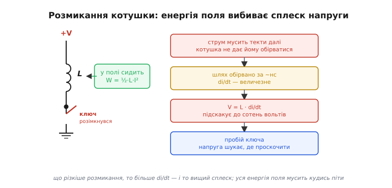
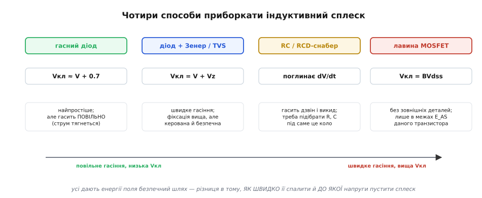
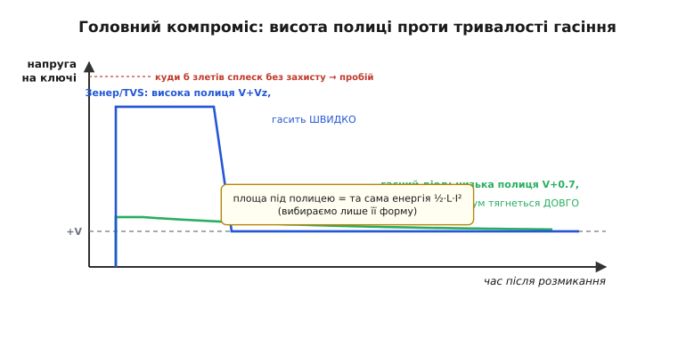
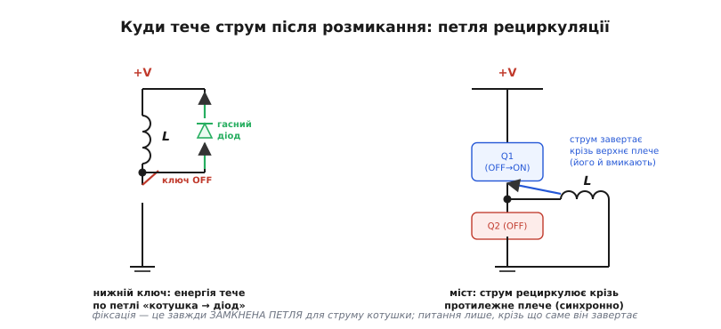

# Комутація індуктивного навантаження

<preknowlist>
- [Енергія в котушці](root:ph-electromagnetism/inductor-energy) — поки крізь котушку тече струм, у її магнітному полі запасено W = ½·L·I² джоулів; це та енергія, яку доведеться кудись подіти в мить розмикання.
</preknowlist>

Реле, соленоїд, клапан, мотор, обмотка трансформатора, навіть довгий метр дроту до навантаження — усе це **котушки**, хай і не названі так у схемі. А котушку, як ми вже бачили, керуючи [мотором через ШІМ](root:embedded/pwm-power-control), не можна просто взяти й вимкнути: вона мститься сплеском напруги, що пробиває ключ. Тоді ми обмежилися одним правилом-оберегом — «ставте гасний діод». Тепер, у модулі про живлення, час розібрати цю комутацію **системно**: не одне рішення, а ціле сімейство, з якого інженер свідомо вибирає під своє коло. Бо «поставити діод» — це лише найпростіший випадок, і він не завжди найкращий.

Чому ця тема стоїть саме тут, серед питань живлення? Бо індуктивне навантаження — це не вузька екзотика, а **щоденний хліб** силового вузла. Кожне реле на платі, кожен соленоїд клапана, кожен крок драйвера мотора — це комутація котушки. Помилка тут не дає про себе знати одразу: плата працює на столі тижнями, а тоді в полі, після сотень тисяч клацань, ключ раптом пробиває. Розуміти, **що саме** відбувається в мить розмикання й **які важелі** ми маємо, — значить відрізняти схему, яка «начебто працює», від тієї, що відпрацює мільйон циклів.

Нитка теми проста. Спершу пригадаємо, **звідки** береться сплеск, але вже мовою енергії — бо саме енергія, а не напруга, є тим, чим ми насправді керуємо. Тоді розгорнемо **карту способів** дати цій енергії безпечний шлях. Далі побачимо головний **компроміс** усіх цих способів — і чому ідеального немає. Нарешті подивимося, **куди тече струм** у реальних схемах — нижній ключ, верхній ключ, міст — і зведемо все в практичні правила вибору.

### Енергія, а не напруга — ось що ми комутуємо

Почнімо з кадру, який усе пояснює. Поки крізь котушку тече струм, у її магнітному полі [запасено енергію](root:ph-electromagnetism/inductor-energy) — рівно

```
W = ½ · L · I²
```

Це не абстракція: ту саму енергію ви бачите іскрою, коли висмикуєте з розетки потужний прилад. І саме вона — головний персонаж усієї теми. Напруга — лише **наслідок** того, як швидко ця енергія намагається вийти.

> 🔧 **Навіщо це.** Запам'ятайте формулу як відправну точку будь-якого розрахунку захисту: усе, що ставлять на котушку, мусить **поглинути або відвести оці ½·L·I²** джоулів. Реле на 12 В зі струмом 100 мА й індуктивністю 50 мГн тримає в полі лише ½·0.05·0.1² = 250 мкДж — мізер; а от обмотка контактора чи дроселя перетворювача може тримати десятки міліджоулів, і це вже всерйоз гріє той елемент, що приймає удар.

Тепер — чому виходить **сплеск**. [Котушка ненавидить різку зміну струму](root:hw-components/inductor-kickback): напруга на ній дорівнює

```
V = L · di/dt
```

Поки ключ замкнений, струм усталений, di/dt = 0, на котушці майже нічого. Розімкніть ключ — і струм мусить упасти до нуля. Котушка пручається: вона наводить на собі **будь-яку** напругу, аби втримати струм бодай ще мить. А механічний контакт чи транзистор обриває коло за наносекунди, тож di/dt стає гігантським, і V злітає до сотень вольтів — доти, доки десь не проб'ється: іскрою на контактах реле або пробоєм транзистора.


*Поки ключ замкнений, у полі сидить ½·L·I². Розмикання обриває шлях за наносекунди — di/dt величезне, тож V = L·di/dt підскакує до сотень вольтів і шукає, де проскочити: пробиває ключ. Що різкіше обрив, то вищий сплеск; уся енергія поля однаково мусить кудись піти.*

Ось чому я наголошую на енергії. Сплеск напруги — це **спосіб** котушки позбутися запасеної енергії, коли їй не дали іншого. Дайте енергії легкий шлях — і сплеску не буде, бо котушці не доведеться «продавлювати» собі дорогу високою напругою. Уся комутація індуктивного навантаження зводиться до одного питання: **куди подіти ½·L·I²** так, щоб напруга на ключі лишилася в безпечних межах. Усі рішення нижче — лише різні відповіді на нього.

І ще одне, що випливає просто з фізики. Енергія не зникає миттєво: щоб вивести її з котушки, потрібен **час**, а скільки саме — задає те, на якій напрузі ми дозволимо їй виходити. Це вже натяк на головний компроміс, до якого ми дійдемо: висока напруга вивантажує котушку швидко, низька — повільно, але енергія в обох випадках та сама.

### Карта способів дати енергії шлях

Розгорнімо сімейство рішень. Усі вони роблять одне — підставляють струму котушки **обхідний шлях** у мить розмикання, — але різняться тим, **до якої напруги** дозволяють піднятися сплеску і **як швидко** спалюють енергію.


*Одна точка комутації — чотири стандартні відповіді. Гасний діод: найпростіший, фіксує біля V+0.7, але гасить повільно. Діод+Зенер або TVS: фіксує вище (V+Vz), зате швидко. RC/RCD-снабер: поглинає dV/dt і дзвін, але треба підбирати номінали. Лавина MOSFET: без зовнішніх деталей, у межах паспортної енергії транзистора. Уздовж осі — той самий компроміс: ліворуч повільно й низько, праворуч швидко й високо.*

**Гасний (freewheeling) діод.** Найпростіше й уже знайоме: [діод паралельно котушці](root:embedded/flyback-protection), катодом до плюса живлення. У нормі замкнений; щойно ключ розмикається й напруга на котушці перевертається, діод відкривається й **замикає струм котушки на себе**. Напруга на ключі обмежена живленням плюс падіння діода — ті самі ~0.7 В (або ~0.3 В у [Шотткі](root:embedded/zener-schottky)). Струм тоді плавно згасає по петлі «котушка → діод», віддаючи енергію на тепло; швидкість згасання задає [стала часу RL-кола](root:hw-analog/rl-time-constant) τ = L/R. Дешево, тихо, надійно — і тому це варіант за замовчуванням для реле й моторів. Недолік у нас попереду.

**Діод із Зенером або TVS-обмежувач.** Якщо потрібне **швидке** згасання (про причину — за хвилину), у гасну гілку додають [стабілітрон](root:embedded/zener-schottky) зустрічно: тепер струм котушки гаситься не на ~0.7 В, а на «живлення + напруга Зенера», скажімо V + 30 В. Те саме, лише охайніше, робить [TVS-діод](root:hw-components/tvs-diode) — спеціалізований обмежувач, створений саме поглинати імпульсну енергію: один компонент замість пари. Чим вища ця напруга фіксації, тим **більша потужність** виходить із котушки (P = V·I), а отже, тим **швидше** вивантажується ½·L·I². Платимо вищою (але свідомо обмеженою й безпечною) напругою на ключі.

**RC- або RCD-снабер.** Інший підхід — не давати струмові окремий шлях, а **поглинати сам сплеск** конденсатором. [Снабер](root:hw-power/snubbers-dvdt) (англ. *to snub* — «приборкати, осадити») — це ланка RC (іноді з діодом, тоді RCD), увімкнена впоперек ключа або котушки: конденсатор приймає різкий фронт напруги, а резистор гасить коливання, щоб коло не «дзвеніло». Снабер не стільки відводить усю енергію котушки, скільки **згладжує** перехід — приборкує крутий dV/dt і паразитний дзвін на швидких фронтах. Його найчастіше бачать там, де комутують швидко або де дзвін випромінює завади: імпульсні перетворювачі, симісторні регулятори, силові мости. Ціна — треба підібрати R і C саме під це коло (наперед вони невідомі), і конденсатор сам трохи навантажує ключ при кожному ввімкненні.

**Лавина самого MOSFET.** Найхитріший варіант — узагалі не ставити зовнішнього захисту, а дозволити транзисторові **самому** прийняти удар. Сучасний силовий MOSFET має [вбудований у структуру діод](root:hw-components/mosfet-power-switch) і паспортно **витримує лавинний пробій**: коли напруга стік-витік сягає межі BVdss, транзистор входить у кероване лавинне проведення й сам розсіює енергію котушки. Виробник для цього вказує параметр **E_AS** — скільки джоулів одиночного імпульсу прилад гарантовано переживе (це й перевіряють тестом UIS, *unclamped inductive switching*). Якщо ½·L·I² вашого навантаження менша за E_AS із запасом — можна обійтися **без жодної зовнішньої деталі**, поклавшись на ключ. Дуже зручно для малих реле й соленоїдів; небезпечно, якщо взяти транзистор без лавинного паспорта або перевищити його енергію.

> 🔧 **Навіщо це.** Чотири інструменти — чотири задачі. **Реле, соленоїд, повільний мотор** — гасний діод (дешево, досить). Треба, щоб реле **швидко відпускало**, або комутуєте **часто** — діод + Зенер чи TVS. **Швидкі фронти, дзвін, завади** (перетворювач, симістор) — снабер. **Мінімум деталей** і ви впевнені в запасі енергії — лавина MOSFET за паспортом E_AS. Перш ніж вибрати, завжди прикиньте ½·L·I²: саме ця цифра каже, чи витримає обраний елемент.

Помітьте спільне: жоден спосіб не «прибирає» енергію — кожен лише **спрямовує** її в керований канал і перетворює на тепло там, де ми це передбачили. Закон збереження невблаганний; інженерія полягає не в тому, щоб обдурити його, а в тому, щоб вибрати **місце й темп** розсіювання.

### Головний компроміс: швидкість проти напруги

Тепер та обіцяна причина, чому простий діод не завжди добрий. Повернімося до реле. З гасним діодом струм котушки згасає повільно — за час близько τ = L/R. А поки крізь обмотку тече струм, реле **тримає** контакти зведеними. Виходить, діод **затягує відпускання** реле: воно відпускає помітно пізніше, ніж зникає сигнал, — на практиці у три-п'ять разів довше, ніж без діода. Для лампочки байдуже, а для реле, що має чітко розривати коло (захист, блокування, швидке перемикання напрямку), ця затримка — справжня вада.

Чому Зенер це лікує? Бо він піднімає напругу, на якій гаситься струм. Згадаймо: котушка вивантажується тим швидше, чим вища напруга на ній під час вивантаження (P = V·I, а енергія фіксована). Діод тримає цю напругу мізерною (~0.7 В) — звідси довге згасання. Зенер навмисно тримає її високою (V + Vz) — і котушка спорожнюється в рази швидше, а реле клацає різко. Ось і весь фокус: **площа під кривою однакова** (та сама енергія ½·L·I²), але форму ми вибираємо — низька довга полиця або висока коротка.


*Напруга на ключі після розмикання. Гасний діод тримає низьку полицю (V+0.7), але струм тягнеться довго. Зенер/TVS пускає полицю вище (V+Vz) — зате коротку: котушка спорожнюється швидко. Площа під обома полицями однакова — це та сама енергія ½·L·I²; ми лише обираємо її форму. Без захисту напруга злетіла б до пунктиру вгорі — і пробила б ключ.*

Звідси випливає просте правило балансу. **Нижча напруга фіксації** — лагідніше до ключа (можна брати дешевший транзистор на меншу напругу), але **повільніше** вивантаження. **Вища напруга фіксації** — швидше вивантаження й різкіше відпускання, але потрібен ключ, що витримає цю напругу. Інженер ставить напругу фіксації якомога вищою — **наскільки дозволяє ключ із запасом** — щоб гасити швидко, але не перейти межу пробою транзистора. Цей розрахунок (яку саме напругу Зенера взяти, скільки енергії він розсіє, чи витримає корпус) — окрема практична задача, і ми зробимо її покроково в [наступному кроці про розрахунок клампу](root:embedded/inductive-clamp-design); тут важливо засвоїти **сам важіль**: швидкість гасіння купується напругою.

Той самий компроміс пояснює, чому в швидких силових схемах люблять снабер і лавину, а не повільний діод: на високих частотах перемикання довге згасання струму просто **не встигає** завершитися до наступного циклу, і повільний діод тут шкідливий. А ще додається тонкість самих діодів: звичайний випрямний діод має помітний [час зворотного відновлення](root:hw-components/diode-bias), тож на швидких фронтах він «не встигає» закритися й сам стає джерелом викиду — тому в [ШІМ](root:embedded/pwm-power-control) і перетворювачах ставлять **швидкі** діоди або Шотткі.

### Куди тече струм: нижній ключ, верхній ключ, міст

Останній шар розуміння — **геометрія петлі**. Фіксація завжди означає одне: струмові котушки потрібна **замкнена петля**, якою він добіжить, поки не згасне. Де саме ця петля проходить — залежить від того, як увімкнено ключ.


*Фіксація — це завжди замкнена петля для струму котушки. Ліворуч: нижній ключ (транзистор між навантаженням і землею) — струм завертає по петлі «котушка → гасний діод → плюс живлення». Праворуч: півміст — коли вимкнули нижнє плече, струм рециркулює крізь верхнє (його ж синхронно й вмикають), без окремого діода. Питання завжди одне: крізь що саме струм завертає.*

**Нижній ключ** (англ. *low-side*) — транзистор стоїть між навантаженням і землею, а котушка «висить» на плюсі. Це найчастіша й найпростіша схема: керувати затвором легко (його джерело на землі), а гасний діод ставлять класично — катодом до плюса, паралельно котушці. Саме цей випадок ми вже бачили з реле й мотором.

**Верхній ключ** (англ. *high-side*) — транзистор між плюсом і навантаженням, а котушка прив'язана до землі. Так роблять, коли навантаження мусить лишатися заземленим (з міркувань безпеки чи спільної землі з давачем). Керувати таким ключем складніше (затвор треба підняти вище плюса живлення — потрібен спеціальний драйвер), а гасний діод тут орієнтують навпаки: від вузла навантаження **до землі**, бо тепер при розмиканні вузол іде **нижче** нуля, і петля замикається через землю.

**Міст** (півміст і повний H-міст) — там, де навантаженням треба керувати у [двох напрямках](root:hw-motion/h-bridge) (мотор уперед/назад) або вивантажувати енергію назад у живлення. Тут найцікавіше: окремий гасний діод часто **не потрібен**, бо роль шляху для струму виконує **протилежне плече** мосту — або його власний вбудований діод, або (краще) спеціально ввімкнений транзистор. Це **синхронна рециркуляція**: щойно одне плече вимкнулося, струм котушки завертає крізь інше, і ми навмисне його **вмикаємо** в потрібну мить, щоб струм ішов через малий опір відкритого каналу, а не через падіння діода. Так роблять усі сучасні драйвери моторів — це ефективніше, бо на відкритому транзисторі губиться менше, ніж на діоді.

> 🔧 **Навіщо це.** Перш ніж малювати захист, спитайте себе: **де мій ключ і куди піде струм котушки, коли ключ закриється?** Нижній ключ — діод катодом до плюса. Верхній — діод до землі (і не забудьте, що сам ключ складніший). Міст — дивіться, чи рециркуляція вже йде крізь сусіднє плече (тоді зовнішній діод зайвий), і чи вмикаєте ви це плече синхронно. Половина «загадкових» пробоїв ключа — це діод, поставлений не туди, або петля, якої взагалі немає.

Окремо застереження для **механічних** контактів. Усе вище — про напівпровідниковий ключ; але якщо котушку розриває **реле або вимикач**, фізика та сама, лише наслідок інший: замість пробою транзистора — **іскра й ерозія контактів**. Гасний діод чи снабер тут так само рятують, продовжуючи життя контактам у рази. А в колах **змінного струму** простий діод не годиться (він би випрямляв), тож там беруть снабер або двонапрямлений TVS — але це вже ближче до теми [ключів для мережі](root:embedded/ac-switch-need), яку ми проходили.

### Що з цим робити на практиці

Зведімо все в робочий порядок дій — він однаковий для будь-якого індуктивного навантаження.

**Крок за кроком: вибір захисту для котушки.**

```
1. Порахуй енергію в полі:           W = ½ · L · I²
2. Визнач, чи важлива швидкість:
     реле/клапан з вимогою швидко відпускати → потрібне швидке гасіння
     просто погасити сплеск, час байдужий    → досить діода
3. Подивись, де ключ (low/high-side) → орієнтуй діод правильно
4. Перевір ключ на напругу фіксації:
     V_фікс = V_живл + V_елемента  (0.7 для діода; V_z для Зенера/TVS)
     V_фікс мусить бути нижчою за межу пробою ключа, із запасом
5. Перевір елемент на енергію:
     обраний діод/Зенер/TVS/MOSFET мусить прийняти W без перегріву
```

Кілька типових рішень, які варто тримати в голові як заготовки. **Мале реле або соленоїд**, час відпускання байдужий — звичайний гасний діод (1N4007 і подібні), катодом до плюса; копійка, ставиться завжди. **Реле, що мусить швидко й чітко відпускати**, — діод послідовно зі стабілітроном (або готовий TVS) на напругу фіксації десь у половину запасу ключа. **Мотор під [ШІМ](root:embedded/pwm-power-control)** — швидкий діод або Шотткі (звичайний не встигне за частотою), а ще краще — драйвер із синхронною рециркуляцією. **Дросель у перетворювачі** — тут захист уже вбудований у саму топологію, плюс снабер на паразитний дзвін. **Малий соленоїд і впевнений запас енергії** — можна покластися на лавину MOSFET за паспортом E_AS, без зовнішніх деталей.

А ще частину роботи можна перекласти на **прошивку**, а не лише на залізо. Якщо керувати затвором ключа **плавніше** — навмисно сповільнити фронт розмикання, — то di/dt спадає, а з ним і сплеск: котушка встигає віддати енергію не так буряно. Це не заміна діодові, а додатковий важіль, особливо для драйверів моторів, де ним же гасять і завади. Як саме сповільнити вимкнення керованим струмом затвора, як стежити за напругою на вузлі ключа й ловити несправність (обрив котушки, застрягання) у самому коді — зібрано окремо в [практикумі безпечної комутації з прошивки](root:embedded/inductive-load-switching/proj-firmware-safe-switching.md).

> 🔧 **Навіщо це.** Найдорожча помилка — узяти потужний транзистор «із запасом по струму», але **забути про сплеск**: він живе тижні на столі й помирає в полі від накопиченого зносу або одного особливо різкого розмикання. Тому правило без винятків: **немає котушки без продуманого шляху для її енергії**. Спочатку рахуєш ½·L·I² і напругу фіксації — і лише тоді обираєш ключ та захист, а не навпаки.

Один важіль цієї теми ми лишили якісним — на скільки саме піднімати напругу фіксації. [Наступний крок](root:embedded/inductive-clamp-design) доводить його до чисел: яку напругу Зенера взяти під конкретний ключ, скільки джоулів той елемент розсіє за кожне клацання і чи витримає його корпус, — щоб коло відпрацювало мільйон циклів, а не тижні на столі.
