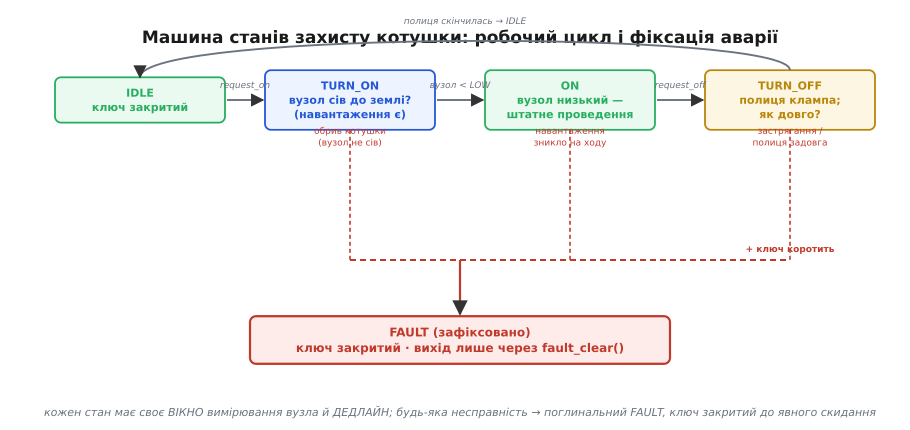

# ⚙️ Безпечна комутація котушки засобами прошивки

У [темі про комутацію індуктивного навантаження](root:embedded/inductive-load-switching) ми домовилися: котушку не можна просто вимкнути, бо в полі сидить ½·L·I², і ця енергія мусить дістати керований шлях — діод, Зенер, снабер чи лавину самого ключа. Усе це **залізо**. Але частину роботи бере на себе **прошивка**, і не як заміну залізу, а як другий, незалежний шар. Цей практикум — про три речі, які робить саме код: він **сповільнює фронт вимкнення**, щоб приборкати di/dt у джерелі; він **дивиться на вузол ключа** очима АЦП чи компаратора й бачить, що з навантаженням; і він **тримає машину станів захисту**, що ловить обрив котушки, застрягання й перевищення часу та фіксує аварію, замість сліпо клацати далі.

Одразу межа, без якої все решта стає небезпечним самообманом. **Прошивка доповнює апаратний захист, а не замінює його.** Гасний діод чи кламп стоять на платі завжди — вони спрацьовують за наносекунди, без процесора, навіть коли код завис, перепрошивається або ще не завантажився. Код повільніший на порядки й має право відмовити; він лише робить систему розумнішою — м'якшою до завад і здатною помітити, що щось не так. Якщо прибрати діод і «гасити сплеск прошивкою» — перший же завислий цикл уб'є ключ. Тримаймо це як аксіому всього нижченаписаного.

### Задача

Маємо типовий силовий вузол: [MOSFET нижнім ключем](topic:electronics/mosfet-power-switch) комутує котушку (реле, соленоїд клапана, обмотку), затвором керує [драйвер](topic:electronics/gate-driver), а паралельно котушці стоїть апаратний кламп. Прошивка має зробити три речі понад просте «ввімкнути/вимкнути».

Перше — **вимикати м'яко**. Різке розмикання дає величезне di/dt, а з ним сплеск і пакет завад, що летить по всій платі. Якщо керувати швидкістю фронту, di/dt падає — котушка віддає енергію не так буряно, кламп працює в легшому режимі, а радіозавада тихне. Але м'який фронт довший, і весь цей час ключ сидить у лінійній зоні, де на ньому одночасно й напруга, і струм, — тобто гріється. Маємо **компроміс**, який треба свідомо налаштувати, а не пустити навмання.

Друге — **бачити вузол ключа**. Напруга на стоку нижнього ключа — це жива розповідь про навантаження, треба лише навчитися її читати. Ключ відкритий, а вузол не притиснувся до землі? Струмові нема куди текти — котушка обірвана. Ключ закрили, а кламп тримає полицю надто довго? Котушка має більшу індуктивність, ніж гадали, або механіка застрягла. Ключ закрили, а вузол лишився притиснутим до землі? Ключ пробитий і коротить. Точну прив'язку «який рівень у якій фазі що означає» розпишемо нижче, з конкретною схемою; поки що важлива сама думка: усе це видно, якщо **вчасно й у правильну мить** виміряти вузол [АЦП](root:embedded/dma-adc) або [компаратором](topic:electronics/comparator).

Третє — **не злітати на хибних спрацюваннях і фіксувати справжню аварію**. Вузол ключа під час комутації — найшумніше місце плати: дзвін, викид, наводки. Наївний поріг «напруга вище X → аварія» спрацює на першому ж сплеску, який сам же кламп і створює штатно. Потрібна машина станів, що **вимірює у вікнах**, де сигнал чистий, ігнорує перехідні процеси й фіксує (англ. *latch*) аварію лише тоді, коли несправність підтверджена, — а далі тримає ключ закритим, доки людина чи старший рівень не зніме фіксацію.

### Ідея

Розкладімо все на три незалежні механізми, бо вони працюють у різних масштабах часу й не повинні плутатися.

**Сповільнення фронту — це керування затвором.** Швидкість, із якою закривається MOSFET, задає струм, яким із затвора **відсмоктують** заряд Qg. Більший опір у колі затвора — менший струм розряду — довший фронт — менше di/dt. Звідси найпростіший важіль: **окремий резистор вимкнення** в колі затвора. Драйвер часто має роздільні виводи на ввімкнення й вимкнення саме для цього — можна сповільнити **лише** фронт вимкнення (де живе сплеск), не чіпаючи ввімкнення. Це апаратне налаштування, але прошивка теж має кермо: де є цифровий драйвер із керованою силою виходу (slew-rate control), код **виставляє** силу/струм затвора регістром; де його нема, код керує грубіше — через ШІМ-«сходинки» або проміжний рівень напруги. Суть та сама: ми вибираємо, **як швидко** вмерти струму, і платимо за м'якість теплом у ключі.

**Моніторинг вузла — це АЦП або компаратор, але в правильний момент.** Ключове слово — **синхронність із комутацією**. Вимірювати треба не безперервно, а у **вікнах**, прив'язаних до станів ключа: коротко після ввімкнення (перевірити, що навантаження є й вузол притиснувся до землі), у фазі фіксації (поміряти, скільки триває полиця клампа — це прямо каже про енергію котушки), і після вимкнення в усталеному стані (перевірити, що ключ справді закрився й не коротить). Між вікнами ми навмисно **не віримо** вузлу, бо там перехідний шум. Компаратор зручний там, де треба ловити швидку подію (перевищення порогу за мікросекунди) без участі процесора; АЦП — там, де треба **значення**, а не просто «вище/нижче».

**Машина станів захисту — це фіксація аварії з підтвердженням.** Стани очевидні: `IDLE` (ключ закритий, спокій), `TURN_ON` (щойно ввімкнули, чекаємо, що навантаження озветься), `ON` (усталене проведення), `TURN_OFF` (фаза гасіння, кламп працює), і поглинальний `FAULT` (зафіксована аварія, ключ примусово закритий). Кожен перехід має **дедлайн** і **перевірку вузла у своєму вікні**; будь-яка несправність веде в `FAULT`, а звідти виходу нема, доки старший код не викличе явне скидання. Це той самий принцип «коли сумніваюся — у безпечний стан», що й у [машині станів PD-sink](root:embedded/pd-sink-design/proj-pd-state-machine.md): мовчання й вихід за дедлайн — теж події, не «почекаємо ще».


*Робочий цикл: IDLE → TURN_ON (перевір, що вузол притиснувся до землі — навантаження є) → ON → TURN_OFF (поміряй тривалість полиці клампа). Кожен стан має дедлайн і своє вікно вимірювання. Спільна нижня шина: обрив котушки, застрягання, перевищення часу гасіння, або пробитий ключ → FAULT. FAULT поглинальний — ключ закритий, вихід лише через явне fault_clear() зі старшого рівня.*

Три механізми незалежні: можна взяти лише моніторинг без сповільнення фронту, або лише сповільнення без машини станів. Але разом вони дають те, чого залізо саме по собі не дає, — **систему, що знає свій стан і безпечно падає**.

### Робочий код: сповільнення фронту вимкнення

Почнімо з фронту. Найчистіший випадок — драйвер із роздільними виводами ввімкнення/вимкнення (наприклад, два піни драйвера на два окремі резистори, або інтегрований драйвер із керованою силою). Розгляньмо реалістичну схему на STM32: ключем керує таймерний канал, а «силу» вимкнення задає **окремий резистор `R_off`**, який ми можемо підмикати або ні через допоміжний GPIO. Це дискретні «передачі» жорсткості фронту — грубо, зате надійно й без аналогових тонкощів.

```c
// Нижній ключ: затвор жене драйвер із роздільними входами ON/OFF.
// R_off_fast — малий резистор вимкнення (різкий фронт);
// R_off_slow — більший, увімкнений паралельно ключем GPIO для м'якого фронту.
// Прошивка лише ОБИРАЄ передачу; саме гасіння робить апаратний кламп.

#define GATE_ON_PORT    GPIOA
#define GATE_ON_PIN     GPIO_PIN_8     // вхід драйвера «ввімкнути»
#define GATE_OFF_PORT   GPIOA
#define GATE_OFF_PIN    GPIO_PIN_9     // вхід драйвера «вимкнути»
#define ROFF_SEL_PORT   GPIOB
#define ROFF_SEL_PIN    GPIO_PIN_0     // 0 = лише R_off_fast; 1 = + R_off_slow

typedef enum { EDGE_FAST, EDGE_SOFT } edge_mode_t;

static void gate_set_edge(edge_mode_t m) {
    // R_off_slow підмикаємо ДО того, як даємо команду вимкнення,
    // інакше зміна передачі посеред фронту дасть стрибок.
    HAL_GPIO_WritePin(ROFF_SEL_PORT, ROFF_SEL_PIN,
                      (m == EDGE_SOFT) ? GPIO_PIN_SET : GPIO_PIN_RESET);
}

static void gate_on(void) {
    HAL_GPIO_WritePin(GATE_OFF_PORT, GATE_OFF_PIN, GPIO_PIN_RESET); // зняти OFF
    HAL_GPIO_WritePin(GATE_ON_PORT,  GATE_ON_PIN,  GPIO_PIN_SET);   // дати ON
}

static void gate_off(edge_mode_t m) {
    gate_set_edge(m);                                               // обрати передачу
    HAL_GPIO_WritePin(GATE_ON_PORT,  GATE_ON_PIN,  GPIO_PIN_RESET); // зняти ON
    HAL_GPIO_WritePin(GATE_OFF_PORT, GATE_OFF_PIN, GPIO_PIN_SET);   // дати OFF
}
```

Чому два окремі входи драйвера, а не один сигнал? Бо фронт **ввімкнення** і фронт **вимкнення** — різні задачі. На ввімкненні нам зазвичай байдуже до сплеску (його там нема — котушка лише починає набирати струм), тож можна вмикати швидко, з малими втратами. А сплеск живе на **вимкненні**, тож саме його фронт ми й хочемо сповільнити. Роздільні резистори дають це безкоштовно: `R_on` малий (швидке ввімкнення), `R_off` керований (м'яке вимкнення). Так роблять у реальних драйверах моторів, де тим самим важелем гасять і завади.

Тепер кількісно — щоб «м'яко» не перетворилося на «гаряче». Час фронту вимкнення приблизно дорівнює часу, за який із затвора витече заряд плато Міллера через `R_off`. Грубо:

```
t_off ≈ R_off · Qgd / (V_drive − V_plateau)
```

де Qgd — заряд Міллера (стік-затвор), V_drive — напруга живлення затвора, V_plateau — напруга плато. А di/dt під час цього фронту — це повний струм навантаження, поділений на час, за який струм у ключі спадає до нуля. Сплеск на клампі лишається обмеженим клампом, але **темп** наростання й завада прямо залежать від `R_off`.

**Скільки коштує м'якість.** Візьмімо ключ із Qgd = 15 нКл, V_drive = 10 В, V_plateau = 5 В, струм навантаження I = 2 А, напруга шини V = 24 В. Порахуймо два варіанти `R_off`.

```
Швидкий: R_off = 10 Ом
  t_off ≈ 10 · 15·10⁻⁹ / (10 − 5)
        = 10 · 15·10⁻⁹ / 5
        = 30·10⁻⁹ с = 30 нс

Енергія за один фронт (груба оцінка, лінійний спад):
  E_sw ≈ ½ · V · I · t_off
       = ½ · 24 · 2 · 30·10⁻⁹
       = 720·10⁻⁹ Дж = 0.72 мкДж

М'який: R_off = 100 Ом
  t_off ≈ 100 · 15·10⁻⁹ / 5 = 300·10⁻⁹ с = 300 нс
  E_sw ≈ ½ · 24 · 2 · 300·10⁻⁹ = 7.2·10⁻⁶ Дж = 7.2 мкДж
```

Десятикратне сповільнення фронту — десятикратні втрати на цьому фронті. Для реле, що клацає раз на секунду, 7.2 мкДж × 1 Гц = 7.2 мкВт — абсолютний мізер, м'якість безкоштовна, беремо її заради тиші в ефірі. А для ключа, що комутує котушку на 20 кГц, ті самі 7.2 мкДж × 20000 = 0.144 Вт **лише на фронтах вимкнення** — уже відчутний нагрів, і тут платити за м'якість дорого. Звідси правило: **повільні комутації (реле, клапани) сповільнюй вільно; швидкі (ШІМ-драйвери) — рівно настільки, наскільки треба втримати завади, бо за кожен зайвий наносекунд платиш теплом × частота.** Це той самий компроміс «швидкість проти напруги», що ми бачили в самій темі, лише тепер другою валютою стали ватти втрат, а кермом — рядок коду.

> 🔧 **Навіщо це.** Сповільнення фронту з прошивки — це насамперед боротьба із **завадами**, а не зі сплеском (сплеск тримає кламп). Якщо плата «сходить з розуму» при кожному вимкненні соленоїда — скидаються давачі, перезавантажується радіо, — перше, що пробують, це уповільнити фронт вимкнення. Часто 100–470 Ом у коло вимкнення затвора рятують усю плату ціною мікроватів на повільному навантаженні. На швидкому ж рахуй ватти й шукай баланс на осцилографі: повільніше, доки завада не стихне, але не повільніше.

### Робочий код: машина станів захисту з моніторингом вузла

Тепер головне — автомат, що веде комутацію й ловить несправності. Зберемо стани, дедлайни й вікна вимірювання в одну неблокуючу машину. Вона **подієва**: її рухає тик таймера й готові вибірки АЦП, а не очікування в циклі. Спершу — як саме вузол ключа видає кожну несправність.

**Що каже напруга на стоку нижнього ключа.** Домовимося про схему: котушка одним кінцем на +V, другим — на стік ключа; ключ замикає її на землю. Тоді:

- **Ключ відкритий, навантаження ціле** → стік притиснутий майже до нуля (падіння Rds(on)·I, частки вольта). Якщо ввімкнули, а стік **лишився високим** (≈ +V) — струм не тече: **котушка обірвана** або не під'єднана.
- **Ключ закритий, усталений стан** → стік дорівнює +V (котушка не проводить, падіння на ній нуль). Якщо закрили, а стік **лишився низьким** — ключ **пробитий і коротить** на землю.
- **Ключ щойно закрили** → стік стрибає вгору до полиці клампа (V + Vклампа) і тримається, **поки котушка віддає енергію**. Тривалість цієї полиці ∝ L·I / Vклампа. Якщо вона **довша за очікувану** — індуктивність більша, ніж у моделі (інша деталь, застрягла механіка), або кламп слабшає.

Ось чому моніторити треба **у вікнах**: кожне твердження вище правдиве лише в конкретній фазі ключа. Поміряти стік посеред фронту — намацати шум; поміряти його у своєму вікні — прочитати діагноз.

```c
#include <stdint.h>
#include <stdbool.h>

// ── Пороги (у відліках АЦП 12 біт, опорна 3.3 В, дільник вузла 1:11) ──
// Вузол стоку через дільник 10:1 заходить в ADC: V_adc = V_node / 11.
#define ADC_NODE_LOW     400     // < цього — вузол «низький» (притиснутий до землі)
#define ADC_NODE_HIGH    2200    // > цього — вузол «високий» (≈ +V або кламп)

// ── Дедлайни (мс), задаються під конкретне навантаження ──
#define T_TURNON_SETTLE  2       // скільки чекати, поки вузол сяде після ввімкнення
#define T_CLAMP_MAX      8       // максимально допустима тривалість полиці клампа
#define T_OFF_SETTLE     2       // скільки чекати усталення після вимкнення

typedef enum {
    SW_IDLE = 0,   // ключ закритий, спокій
    SW_TURN_ON,    // дали ON, чекаємо, що вузол сяде до землі
    SW_ON,         // усталене проведення
    SW_TURN_OFF,   // фаза гасіння — кламп тримає полицю
    SW_FAULT       // зафіксована аварія, ключ примусово закритий
} sw_state_t;

typedef enum {
    FAULT_NONE = 0,
    FAULT_OPEN_COIL,    // ввімкнули, а вузол не сів — обрив/нема навантаження
    FAULT_SHORT_SW,     // вимкнули, а вузол лишився низьким — ключ коротить
    FAULT_CLAMP_TIMEOUT // полиця клампа триває довше норми — застрягання/L більша
} fault_t;

typedef struct {
    sw_state_t state;
    fault_t    fault;
    uint32_t   t_state;     // мітка часу входу в поточний стан (мс)
    uint16_t   adc_node;    // остання вибірка вузла
    edge_mode_t edge;       // яка передача фронту вимкнення
} sw_ctx_t;

static sw_ctx_t sw;

// ── Зовнішні залежності (реалізує платформа) ──
extern uint32_t now_ms(void);            // монотонний час, мс
extern uint16_t adc_read_node(void);     // миттєва вибірка вузла стоку
extern void     gate_on(void);
extern void     gate_off(edge_mode_t m);

static void enter(sw_state_t s) { sw.state = s; sw.t_state = now_ms(); }

static void trip(fault_t f) {        // зафіксувати аварію — ключ геть
    gate_off(EDGE_FAST);             // в аварії гасимо різко: головне — закрити
    sw.fault = f;
    enter(SW_FAULT);
}

// Команди зовні
void sw_request_on(void)  { if (sw.state == SW_IDLE) enter(SW_TURN_ON), gate_on(); }
void sw_request_off(void) { if (sw.state == SW_ON)   enter(SW_TURN_OFF), gate_off(sw.edge); }

void sw_fault_clear(void) {          // ЯВНЕ скидання зі старшого рівня
    if (sw.state == SW_FAULT) { sw.fault = FAULT_NONE; enter(SW_IDLE); }
}

void sw_init(edge_mode_t edge) {
    sw.edge = edge; sw.fault = FAULT_NONE; gate_off(EDGE_FAST); enter(SW_IDLE);
}

// ── Серце: викликати періодично (напр., раз на 1 мс із таймера) ──
void sw_poll(void) {
    uint32_t dt = now_ms() - sw.t_state;
    sw.adc_node = adc_read_node();        // вибірка вузла В ПОТРІБНОМУ вікні

    switch (sw.state) {
    case SW_TURN_ON:
        // Вікно: після ввімкнення вузол МУСИТЬ сісти до землі.
        if (sw.adc_node < ADC_NODE_LOW) {
            enter(SW_ON);                 // навантаження озвалося — все добре
        } else if (dt >= T_TURNON_SETTLE) {
            trip(FAULT_OPEN_COIL);        // не сів за дедлайн → обрив котушки
        }
        break;

    case SW_ON:
        // У проведенні вузол має лишатися низьким. Підскочив — щось не так.
        if (sw.adc_node > ADC_NODE_HIGH) {
            trip(FAULT_OPEN_COIL);        // навантаження зникло на ходу
        }
        break;

    case SW_TURN_OFF:
        // Вікно: вузол злетів на полицю клампа й має сісти назад до +V.
        // «Сісти» = опуститися нижче ADC_NODE_HIGH (полиця скінчилася).
        if (sw.adc_node < ADC_NODE_HIGH) {
            // полиця завершилась — перевіримо, що ключ закрився, а не коротить
            if (sw.adc_node < ADC_NODE_LOW) {
                trip(FAULT_SHORT_SW);     // вузол притиснутий до землі — ключ коротить
            } else {
                enter(SW_IDLE);           // штатно вимкнулися
            }
        } else if (dt >= T_CLAMP_MAX) {
            trip(FAULT_CLAMP_TIMEOUT);    // полиця тягнеться задовго → застрягання
        }
        break;

    case SW_FAULT:
        gate_off(EDGE_FAST);              // тримаємо ключ закритим, чекаємо clear
        break;

    case SW_IDLE:
    default:
        break;
    }
}
```

Розберімо, чому автомат саме такий. Кожна перевірка прив'язана до **свого вікна** й до **свого дедлайну**. У `SW_TURN_ON` ми не «віримо першій же вибірці» — ми даємо вузлу час `T_TURNON_SETTLE` сісти, і лише якщо за цей час він **не сів**, оголошуємо обрив. Це відсікає природний перехідний процес ввімкнення. У `SW_TURN_OFF` логіка тонша: вузол **штатно** має бути високим (на полиці клампа), тож ми чекаємо, доки він **опуститься**; якщо опустився до +V — добре; якщо аж до землі — ключ коротить; якщо не опустився за `T_CLAMP_MAX` — полиця надто довга, отже застрягання чи завелика індуктивність. Той самий вузол, прочитаний у різних станах, дає різні діагнози — у цьому вся суть синхронного моніторингу.

Зверніть увагу на `trip()`: в аварії ми гасимо **різко** (`EDGE_FAST`), а не м'яко. Логіка проста — коли щось пішло не так, головне якнайшвидше **закрити** ключ і обірвати струм; турбота про завади відступає перед турботою про живий транзистор. М'який фронт — це розкіш штатного режиму.

> 🔧 **Навіщо це.** Фіксація аварії (`latch`) — не примха, а захист від **самозбудження**. Уявіть автомат без `FAULT` як поглинального стану: котушка обірвана, ключ вмикається, бачить високий вузол, вимикається, за мить знову вмикається — і так у нескінченному циклі, поки контакт іскрить і плата гріється. Поглинальний `FAULT` зупиняє це намертво: один раз помітив несправність — закрив ключ і чекає **людини** (чи старшого рівня, що вирішить, чи безпечно пробувати знову). У промислових драйверах це називають *latched fault* саме тому: автоматичний повтор у силовому колі — шлях до пожежі.

### Швидкий шлях: компаратор замість АЦП для критичних подій

АЦП у циклі 1 мс ловить повільні несправності — обрив, застрягання. Але деякі біди трапляються за **мікросекунди**: різке коротке замикання навантаження дає стрибок струму, який треба обірвати, перш ніж ключ устигне нагрітися. Чекати наступного тику АЦП тут запізно. Тут працює [компаратор](topic:electronics/comparator): він безперервно звіряє сигнал (напругу на [шунті](topic:electronics/kelvin-shunt) або на вузлі) з порогом і смикає вихід **апаратно**, без процесора, за наносекунди.

```c
// Компаратор на перевищення струму: вхід+ = напруга на шунті,
// вхід− = опорний поріг. Спрацював → переривання → миттєво закрити ключ.
// Це АПАРАТНИЙ запобіжник; машина станів лише дізнається про факт постфактум.

void COMP1_IRQHandler(void) {            // компаратор зловив перевищення
    gate_off(EDGE_FAST);                 // НЕГАЙНО закрити ключ (з ISR, коротко)
    sw_async_trip(FAULT_SHORT_SW);       // лише позначити — розбір у головному циклі
    COMP1_clear_flag();
}
```

Поділ обов'язків чіткий: **компаратор** обриває небезпеку миттєво й апаратно (його справа — встигнути), **машина станів** на АЦП веде штатну логіку й ловить повільні несправності (її справа — думати). Не намагайтеся ловити мікросекундне коротке замикання опитуванням АЦП у циклі — не встигнете; і не вантажте компаратор повільною діагностикою — це не його робота. У `sw_async_trip()` із переривання ми лише **виставляємо прапорець і закриваємо ключ**, а повноцінний перехід у `FAULT` робить `sw_poll()` у головному циклі — той самий принцип «коротко в ISR, важке поза ISR», що й при будь-якій [роботі з перериваннями](topic:programming/isr).

### Складність і пастки на залізі

Тепер найважче — місця, де ця гарна схема ламається об реальність. Усі вони про одне: **вузол ключа під час комутації — брудне, гучне, небезпечне для вимірювання місце**, і наївний код тут б'ється об фізику.

- **Спільна земля — джерело хибних діагнозів номер один.** АЦП міряє напругу вузла **відносно своєї землі**. Але в мить комутації крізь землю тече імпульс струму котушки, і на паразитному опорі та індуктивності доріжки землі підскакує напруга (*ground bounce*). Якщо земля АЦП і силова земля з'єднані не в одній точці, ваш «нуль» поїхав на сотні мілівольтів саме тоді, коли ви міряєте, — і справний вузол виглядає як несправний. Лікування: **зіркова земля** (силова й аналогова сходяться в одній точці біля джерела), вимірювання у вікнах **після** того, як силовий імпульс стих, і — якщо інакше не виходить — диференційне вимірювання вузла відносно силової землі, а не аналогової.

- **Шум на вузлі під час фіксації зриває поріг.** Полиця клампа — не гладка лінія, а дзвін: вузол коливається навколо рівня фіксації, особливо на швидких фронтах. Якщо поріг `ADC_NODE_HIGH` стоїть на самому краю полиці, дзвін то перетинає його, то ні — і `SW_TURN_OFF` блимає між «полиця ще є» і «полиця скінчилась». Лікування: **гістерезис** (різні пороги на вхід і вихід зі стану), вибірка **кількох** відліків і рішення за медіаною, а не за одним, і — головне — не міряти в перші мікросекунди після фронту, де дзвін найлютіший. Це та сама дисципліна, що в [кондиціонуванні сигналу](root:embedded/signal-acquisition): фільтруй і чекай усталення, перш ніж вірити числу.

- **Хибні спрацювання від занадто жорстких вікон.** Дедлайн `T_TURNON_SETTLE` має бути більшим за реальний час, поки вузол сідає, з **запасом на найгірший випадок**: холодна котушка, низька напруга живлення, максимальна індуктивність із допуску. Поставите впритул — справна система час від часу спрацьовуватиме в `FAULT` на повільному ввімкненні, і ви ганятиметеся за «привидом». Краще вікно з запасом і лічильник підозр (`N` поспіль перевищень, перш ніж `trip`), ніж істеричний автомат, що не довіряє жодній штатній комутації.

- **АЦП на вузлі бачить десятки вольтів — потрібен дільник і захист.** Вузол нижнього ключа на полиці клампа сягає V + Vклампа — легко 40–60 В, а вхід АЦП терпить лише до опорної (3.3 В). Між вузлом і АЦП **обов'язково** дільник напруги, а ще краще — дільник плюс обмежувальний діод на опорну й послідовний резистор, щоб сплеск понад розрахунок не пробив вхід мікроконтролера. Без цього перший же сильний кламп уб'є ногу АЦП — і ви втратите саме той вузол, який мали стерегти.

- **Сповільнюючи фронт, не заведіть ключ у лінійну зону назавжди.** Є спокуса зробити фронт дуже м'яким «для тиші». Але якщо `R_off` завеликий, фронт розтягується так, що ключ помітну частку **кожного** циклу сидить напіввідкритим — і на високій частоті це вже не мікровати, а ватти, аж до теплового пробою. Рахуйте E_sw × частоту (як вище) і звіряйте з тим, скільки ключ може розсіяти. М'якість — не безкоштовна чеснота; на швидкому навантаженні вона має ціну в градусах.

- **Body-diode й лавина — не привід викинути зовнішній діод там, де він потрібен.** Прошивка може стежити за вузлом і думати, що «бачить» усе, — але якщо ви поклалися на лавину ключа понад його паспортну E_AS, жоден код не врятує: пробій станеться за наносекунди, між тиками вашого АЦП. Код доповнює залізо, не заміняє: рішення «чи досить body-diode/лавини, чи треба зовнішній діод» ухвалюється **залізом** за енергією ½·L·I² проти E_AS (це ми робили в самій темі), а прошивка лише наглядає, що обране залізо працює в межах. Якщо ½·L·I² близька до E_AS — ставте зовнішній кламп, і хай прошивка стежить за **ним**.

- **Не плутайте «штатний сплеск» з аварією.** Найтонша пастка: сплеск при вимкненні — це **норма**, його створює сама комутація, і кламп його штатно тримає. Якщо код міряє вузол **під час** фронту вимкнення й бачить високу напругу — це не несправність, це робота. Тому вікно діагнозу «ключ коротить / усе гаразд» стоїть **після** усталення (`T_OFF_SETTLE`), а не на самому фронті. Переплутаєте фазу — і кожне справне вимкнення полетить у `FAULT`.

Зведімо. Прошивка дає котушці три речі, яких залізо саме не дає: **м'який фронт** (тихіша плата ціною теплових втрат — вільно на повільному, ощадно на швидкому), **зір** (синхронне з комутацією вимірювання вузла, що читає обрив, коротке й застрягання), і **холодну голову** (машина станів із фіксацією аварії, що падає в безпечний стан і не самозбуджується). Але над усім цим стоїть одне залізне правило, з якого ми почали й яким закінчуємо: **код доповнює апаратний захист, ніколи його не заміняє.** Діод і кламп спрацьовують за наносекунди й коли процесор мертвий; прошивка робить систему розумнішою, але право на життя ключа дає саме залізо. Точний розрахунок цього заліза — яку напругу Зенера взяти, скільки енергії розсіє кламп — ми робимо [наступним кроком](root:embedded/inductive-clamp-design), а спосіб **подавати** живлення на котушку дозовано, через ШІМ, ми вже бачили [в керуванні потужністю](root:embedded/pwm-power-control).
