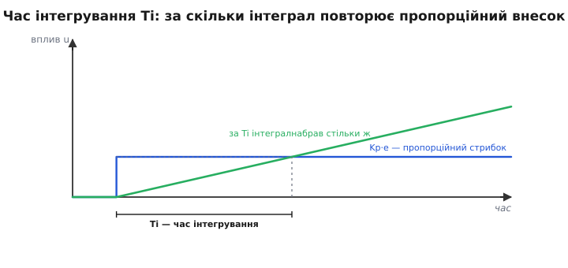
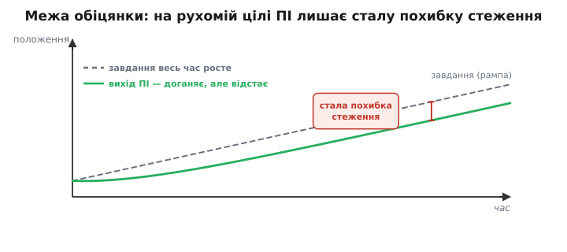
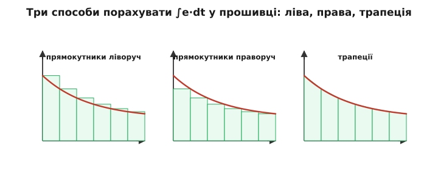
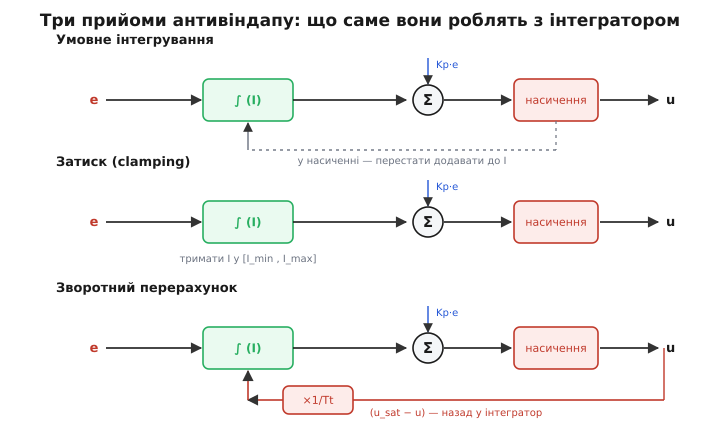
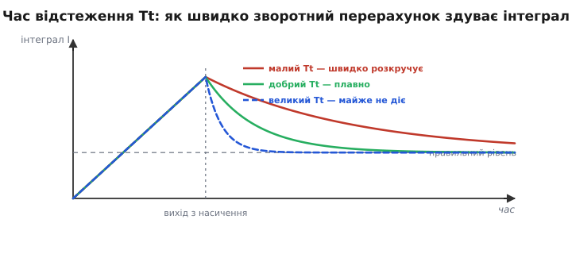

# І-складова: глибше

Базова тема показала головне: [інтегральна складова](root:embedded/integral-control) дає регуляторові пам'ять і тим зводить сталий зсув **точно в нуль**, а ціною стають схильність до коливань і небезпека windup. Тут ми беремо ту саму складову й розбираємо її **до дна**: чому інтегратор — це окремий «стан» усередині регулятора й що це змінює; звідки береться рівно 90° фазового відставання й до чого воно призводить у сходинках системних типів; як насправді порахувати ∫e dt у прошивці й де кожен спосіб бреше; що діється всередині під час windup і як три антивіндап-прийоми лікують це **арифметично**, а не на око; і нарешті — тонкощі, без яких код падає в полі: перемикання режимів, ініціалізація, скінченна точність накопичувача. Нитку ведемо від тих самих двох рівнянь, що й у базовій темі, — але щоразу заглиблюємось на крок далі.

Одне прохання до читача: тримайте в голові базову інтуїцію («інтеграл — це наполегливість, що ллє вплив, поки є помилка»). Усе, що нижче, — це та сама наполегливість, показана зблизька: як вона влаштована, де ламається і як її приборкати в реальному залізі.

## Інтегратор — це стан, а не формула

Почнімо з того, що в базовій темі лишилося між рядків. Пропорційна складова **безпам'ятна**: дай їй помилку — вона миттю видасть Kp·e і забуде. Її вихід — чиста функція входу **зараз**. Інтегральна складова інакша **за самою природою**: її вихід залежить не лише від поточної помилки, а від **усієї історії** помилок від моменту ввімкнення. Це означає, що всередині регулятора живе окреме **число, яке треба зберігати між тактами**, — накопичувач I. Він і є **станом** (англ. *state* — стан) регулятора.

Ця відмінність — не термінологічна дрібниця, а корінь усіх особливостей I. Розгляньмо диференційну форму, з якої ми виходили:

```
 dI/dt = e            ← накопичувач росте зі швидкістю, що дорівнює помилці
 u     = Kp·e + Ki·I
```

Перше рівняння каже: **швидкість зміни стану дорівнює входу**. Це рівняння чистого інтегратора — найпростішої динамічної ланки з пам'яттю. У неї немає власного «загасання»: прибери вхід (e = 0), і стан не повернеться до нуля сам, а **застигне там, де був**. Саме тому інтеграл «запам'ятовує» потрібне зміщення й тримає його без помилки — але саме тому ж він і небезпечний: власного гальма в нього нема, зупинити його може лише зовнішня умова e = 0.

> 🔧 **Навіщо це.** Розуміння «інтеграл — це стан» диктує три обов'язкові речі в коді: цю змінну треба (1) **оголосити так, щоб вона переживала між викликами** (у структурі регулятора, не як локальну), (2) **ініціалізувати** при старті контуру й (3) **захистити від нескінченного росту**. Забудете, що це стан, — і накопичувач або обнулятиметься щотакту (тоді інтеграла фактично нема), або накрутиться в нескінченність (windup). Дві найпоширеніші помилки-початківця з I обидві ростуть із нерозуміння, що це **збережений стан**.

Ще один наслідок: у мові керування чистий інтегратор — це ланка, чий «полюс сидить у нулі». Не заглиблюючись у [частотний опис](root:embedded/why-frequency-domain), досить відчути ось що: така ланка **нескінченно підсилює найповільніші, майже сталі сигнали**. Стала помилка для інтегратора — це вхід нульової частоти, і його підсилення на нульовій частоті нескінченне. Ось звідки, якщо дивитися згори, береться обіцянка «точно нуль»: будь-яка стала помилка помножується на нескінченне підсилення й тому в рівновазі мусить бути нулем — інакше вплив був би нескінченним. Базова тема довела це «руками», через умову dI/dt = 0; тепер видно й другий, частотний бік тієї самої монети.

## Час інтегрування Ti: друга мова тих самих чисел

У базовій темі ми мигцем згадали, що в промисловості силу інтеграла часто задають **оберненою** мірою — **часом інтегрування** Ti (англ. *reset time* — час скидання). Тут розберімо це до кінця, бо саме в цій формі ви побачите інтеграл у більшості реальних регуляторів, і плутанина між Ki та Ti — постійне джерело помилок при перенесенні коефіцієнтів.

Перепишемо ПІ-закон у так званій «стандартній» формі, де за дужку винесено Kp:

```
 u = Kp·( e + (1/Ti)·∫e dt )        ← стандартна (ISA) форма
 u = Kp·e + Ki·∫e dt                ← паралельна форма

 Порівнюючи інтегральні члени:  Ki = Kp / Ti
```

Звідки взялася сама величина Ti і чому вона зветься «часом»? Уявімо, що в момент t = 0 з'явилася **стала** помилка e. Простежмо два внески окремо. Пропорційний одразу стрибає на Kp·e і тримається — це сходинка. Інтегральний стартує з нуля й **лінійно наростає**: за час t він набирає Kp·(1/Ti)·e·t. Питання: за скільки інтегральний внесок **дорівняється** пропорційному?

```
 Kp·(1/Ti)·e·t = Kp·e     →    t = Ti
```

Ось воно: **Ti — це час, за який інтеграл сам повторює («дублює») стрибок, що його дала пропорційна частина**. Малий Ti — інтеграл наздоганяє P швидко, отже інтеграл сильний; великий Ti — плентається позаду, отже слабкий. Тому Ti й Ki **обернені**: сильний інтеграл = малий Ti = великий Ki.


*Геометричний зміст Ti. За сталої помилки пропорційний внесок Kp·e — сходинка (синій), а інтегральний росте лінійно (зелений). Момент, коли інтеграл набрав рівно стільки ж, скільки одразу дала пропорційна частина, і є час інтегрування Ti. Малий Ti — крутіша зелена пряма, сильніший інтеграл.*

Є й третя, зовсім побутова для процесників форма — **повторів за хвилину** (англ. *repeats per minute*): скільки разів на хвилину інтеграл дублює пропорційну дію, тобто просто 60/Ti (якщо Ti у секундах) чи 1/Ti (якщо у хвилинах). Це та сама величина ще під іншим кутом. Знати всі три — Ki, Ti, повтори/хв — треба лише щоб не помилитися, читаючи чужі налаштування: фізика за ними одна.

> 🔧 **Навіщо це.** Переносячи коефіцієнти між приладами чи прошивками, **перше питання — у якій формі задано інтеграл**. Промислові регулятори (та й багато PLC-бібліотек) живуть у Ti (секунди або хвилини!), а ваша прошивка — найпевніше в Ki. Переплутаєте — і замість, скажімо, Ki = Kp/Ti отримаєте Ki = Kp·Ti, тобто силу інтеграла в Ti² разів не таку. Класична пастка: перенесли «Ti = 20» як «Ki = 20» — і контур, що мав неквапом прибирати зсув за 20 секунд, почав дико розгойдуватися. Завжди звіряйте **розмірність і форму**, а не голі числа.

## Чому I розхитує: рівно 90° відставання

Базова тема пояснила нестійкість від I одним реченням: інтеграл діє із запізненням, реагує на минуле. Поглибимо це до **кількісного** твердження, бо саме воно пояснює, **чому** надлишок інтеграла такий підступний.

Візьмімо усталене коливання помилки — синусоїду e = sin(ωt). Що видасть на неї кожна складова? Пропорційна: Kp·sin(ωt) — рівно в такт із помилкою, **нуль зсуву**. Інтегральна: ∫sin(ωt) dt = −(1/ω)·cos(ωt). А −cos — це синус, зсунутий назад на чверть періоду:

```
 e   = sin(ωt)              ← помилка
 ∫e  = −(1/ω)cos(ωt) = (1/ω)·sin(ωt − 90°)   ← інтеграл ВІДСТАЄ на 90°
```

Отже інтегрування дає **рівно 90° фазового відставання** на будь-якій частоті — і, до того ж, підсилення 1/ω, що падає з частотою. Це два ключові факти. Перший: 90° відставання — це половина шляху до фатальних 180°, на яких зворотний зв'язок із гасіння перетворюється на [підкачку](root:embedded/loop-stability) і контур самозбуджується. Пропорційна складова фази не додає; інтегральна одразу з'їдає половину запасу. Тому додавання I **завжди** зменшує запас стійкості — це не випадковість поганого налаштування, а неминуча плата за пам'ять.

Другий факт — падіння підсилення з частотою (1/ω) — пояснює, чому шкода від I зосереджена **на низах**. Інтеграл сильно діє на повільні, майже сталі відхилення (там він і корисний) і майже мовчить на швидких. Тому й коливання, які він провокує, — **повільні**: система розгойдується довгими, наростаючими хвилями. Це рівно той симптом, про який попереджала базова тема («завеликий Ki діє віроломніше»), тепер із механізмом: повільна частота, на якій сумарне відставання (об'єкт плюс 90° від інтеграла) сягає 180°, і стає частотою самозбудження.

Звідси й практичне правило порядку налаштування (докладніше — [чому саме такий порядок](root:embedded/pid-tuning-cascade)): спершу P, бо він фази не псує; I — обережно й **після**, бо кожен його додаток гризе запас; а [D](root:embedded/derivative-control), навпаки, фазу **додає** (+90° у границі) і тому частково компенсує відставання від I. Добре налаштований ПІД — це баланс мінусової фази інтеграла й плюсової фази диференціала навколо нейтральної пропорційної складової.

## Сходинка системних типів: чому зникає саме сталий зсув

Тепер — найглибший наслідок наявності інтегратора, який базова тема лише зачепила фразою «інтеграл не питає, звідки взялася стійка помилка». Насправді тут ховається струнка **сходинка**: скільки в контурі інтеграторів, стільки й «поверхів» помилок він виводить у нуль. Це поняття зветься **тип системи** (англ. *system type*) — число чистих інтеграторів у розімкненому контурі.

Розгляньмо, яку **сталу помилку** лишає контур на різні вхідні дії:

```
 Тип 0 (немає інтегратора, чистий P):
   ступінчасте завдання  →  СТАЛА помилка (той самий зсув e_ss = u₀/Kp)
   лінійно зростаюче      →  помилка росте без межі

 Тип 1 (один інтегратор, ПІ):
   ступінчасте завдання  →  помилка → 0   (обіцянка з базової теми)
   лінійно зростаюче (рампа)  →  СТАЛА, ненульова похибка стеження
   параболічне завдання   →  помилка росте без межі

 Тип 2 (два інтегратори):
   ступінчасте            →  0
   рампа                  →  0
   параболічне            →  СТАЛА похибка
```

Видно закон: **кожен інтегратор піднімає систему на поверх** — прибирає сталу помилку на ту дію, на якій попередній тип лишав сталу, і робить нескінченною ту, що була сталою. ПІ (тип 1) прибирає зсув на **сходинку** (сталу ціль, сталі збурення) — саме це і є та «точно нуль»-обіцянка. Але на **рампі** — коли ціль рівномірно повзе — той самий ПІ лишає сталу похибку.


*Межа однієї інтегральної складової. Коли завдання весь час росте (рампа), ПІ-контур його доганяє, та не зливається з ним: між ними лишається **стала щілина** — похибка стеження. Один інтегратор прибирає сталий зсув, але не сталу похибку на рухомій цілі; для неї потрібен другий інтегратор (тип 2).*

Чому так — видно з тієї самої умови рівноваги. Щоб вихід **рівномірно рухався** за рампою, вплив u мусить бути ненульовим і сталим (треба ж постійно «підганяти» рух). А єдине джерело сталого u в ПІ — це накопичувач на сталому рівні; але щоб він тримав сталий рівень, його вхід (помилка) має бути нулем — тоді u не змінюється, а вихід тоді **не прискорюється**, отже за рампою не встигає. Суперечність розв'язується єдино: помилка сідає на маленьке **стале** значення, рівно таке, щоб інтеграл повільно ріс і давав те наростання впливу, якого вимагає рух за рампою. Нуль на рампі дав би тільки другий інтегратор — той сам постачав би наростаючий вплив за нульової помилки.

Це і є строге формулювання «межі обіцянки», яку базова версія назвала на пальцях («помилку, що весь час змінюється, інтеграл наздоганяє із запізненням»). Глибше це доведено у вставці [чому інтеграл зводить зсув точно в нуль](root:embedded/integral-control/math-zero-offset.md): там показано, що категоричне «нуль» стосується саме **сталого** режиму. Сходинка типів пояснює, **наскільки** саме недотягує один інтегратор на змінних цілях — і чому в задачах стеження за траєкторією (верстати, антени, стежні приводи) іноді ставлять другий інтегратор або додають випереджувальний зв'язок.

> 🔧 **Навіщо це.** Перш ніж боротися з похибкою, спитайте: вона на **сталій** цілі чи на **рухомій**? На сталій ПІ виведе її в нуль — і якщо не виводить, винен windup або замалий Ki. На рухомій (стежите за рампою — рівномірним підйомом, розгортанням, підмоткою) стала похибка стеження — це **не дефект**, а фундаментальна межа одного інтегратора; не намагайтеся вбити її, накручуючи Ki (лише розхитаєте контур) — тут потрібен або другий інтегратор, або випереджувальна подача завдання (feed-forward).

## Як порахувати ∫e dt у прошивці: три чесних способи

Дотепер ми писали `I += e·dt` — і в базовій темі цього вистачало. Але «інтеграл площі під кривою» можна порахувати скінченними шматочками **кількома** способами, і вони дають різний результат. Розібратися варто, бо вибір впливає і на точність, і на стійкість дискретного контуру.

Інтеграл — це площа під кривою помилки. Між двома тактами, e[k−1] і e[k], ту вузьку смужку площі можна оцінити трьома способами:

```
 Прямокутник ліворуч (forward / Ейлера):   I += e[k-1]·Δt
 Прямокутник праворуч (backward):           I += e[k]·Δt
 Трапеція (Тастіна, білінійна):             I += (e[k-1]+e[k])/2·Δt
```


*Три правила чисельного інтегрування. Смужку площі між сусідніми тактами наближають прямокутником по **лівій** висоті (forward), по **правій** (backward) або **трапецією** (середнє двох висот). На спадній помилці ліві прямокутники завищують площу, праві занижують, трапеція лягає найточніше — вона й найпоширеніша в якісних реалізаціях.*

Різниця не косметична. Прямокутник ліворуч (форма Ейлера) бере висоту з **минулого** такту — він трохи «відстає» ще на один крок, і це додаткове запізнення злегка **гризе стійкість** дискретного контуру, надто на повільній частоті дискретизації. Прямокутник праворуч бере поточну висоту — трохи стійкіший. Трапеція (її ще звуть перетворенням Тастіна або білінійним) усереднює обидві висоти й дає найточніше наближення неперервного інтеграла, найкраще зберігаючи фазу; за це її й люблять у ретельних реалізаціях ПІД. На типових для вбудованих систем високих частотах керування (сотні герц і вище, коли Δt дуже малий) різниця між трьома мізерна — усі три збігаються до тієї самої площі; але на повільних контурах (одиниці герц) вона стає відчутною, і трапеція виграє.

Тепер — важлива тонкість **об'єднання Δt із коефіцієнтом**. Куди подіти крок часу? Є два табори:

```
 Варіант А (Δt усередині накопичувача):
   I   += e·Δt;           u = Kp·e + Ki·I

 Варіант Б (Δt у коефіцієнті):
   Iraw += e;             u = Kp·e + (Ki·Δt)·Iraw
```

Обидва дають те саме за сталого Δt, але **поводяться по-різному, коли Δt плаває**. Реальний такт ніколи не ідеально сталий: планувальник смикається, переривання затримуються. Варіант А чесно множить кожну свіжу помилку на **фактичний** проміжок часу — тому він стійкий до дрижання такту (англ. *jitter*): пропустили такт удвічі довший — і площу за нього порахували вдвічі більшу, як і має бути. Варіант Б неявно припускає сталий Δt і на дрижанні накопичує похибку. Тому в надійних реалізаціях крок часу **вимірюють** (за апаратним таймером) і множать на нього явно — це варіант А. Дрібниця, але саме через неї контур, ідеальний на стенді з жорстким тактом, «попливе» на завантаженому процесорі з нерівним розкладом.

> 🔧 **Навіщо це.** У прошивці **міряйте реальний Δt** апаратним таймером і множте на нього явно (варіант А), а не покладайтеся на «номінальний» період циклу. І тримайте **одну** форму інтегрування в усьому проєкті — змішувати праві прямокутники в одному контурі з трапецією в іншому означає плодити нез'ясовні розбіжності в поведінці. Для більшості вбудованих контурів годиться простий backward (`I += e·Δt`); трапецію беріть, коли контур повільний або коли переносите налаштування з неперервної моделі й хочете точно зберегти фазу.

## Windup зблизька: розімкнений контур усередині замкненого

Базова тема дала правильний образ windup: за насичення інтеграл накручується до величезного значення, а потім жене вихід за ціль. Тепер подивімося, **чому** це відбувається, на рівні структури — бо саме структурне розуміння підказує, як лікувати.

Ключ ось у чому. Поки виконавчий орган **не** в насиченні, петля замкнена: більший вплив → більший рух → менша помилка → менший вплив. Це саморегуляція. Але в мить, коли орган упирається в межу, реальний вплив на об'єкт **перестає залежати** від того, що вимагає регулятор: мотор на 100% дає 100% хоч ти проси 120, хоч 500. Зв'язок «вихід регулятора → об'єкт» **розірвано** — контур фактично **розімкнувся**, хоч формально дроти на місці.

А тепер згадаймо, що інтегратор — це стан без власного гальма (ми це встановили на початку). У розімкненому контурі його ніхто не спиняє: помилка велика й тримається (об'єкт же не дотягує), тож `dI/dt = e` жене накопичувач далі й далі. Інтегратор **розганяється у власному світі**, бо петля зворотного зв'язку, яка мала б його гальмувати, розірвана насиченням. Ось точна суть windup: **інтегратор інтегрує помилку розімкненого контуру**. Він накопичує «борг» впливу, якого фізично неможливо видати.

Коли об'єкт нарешті дотягується й помилка міняє знак, петля замикається знову — але накопичувач уже роздутий до абсурду, і тепер його доводиться **розряджати** тим самим повільним `dI/dt = e`, тепер із помилкою іншого знаку. Увесь цей час роздутий інтеграл жене вихід **за** ціль. Звідси й дикий переліт, і довге гойдання.

Це пояснення відразу дає критерій, **коли** windup можливий: лише там, де є (1) інтегратор і (2) насичуваний виконавчий орган, і система в нього впирається. Немає насичення — немає розмикання — немає windup. Тому на малих відхиленнях його й не видно (орган не в межі), а на великих кидках чи довгій недосяжній цілі — неминучий. І тому будь-який інтегральний регулятор на **реальному** (завжди обмеженому) залізі **мусить** мати антивіндап — не як прикрасу, а як умову працездатності.

## Три антивіндап-схеми — тепер із арифметикою

Базова тема назвала три прийоми одним абзацом. Розберімо, що кожен робить із накопичувачем **точно**, бо диявол — у деталях реалізації.


*Три прийоми антивіндапу як сигнальні структури. Кістяк спільний: помилка йде в інтегратор, далі підсумовується з пропорційним внеском і крізь насичення дає вплив. Умовне інтегрування (вгорі) **глушить** вхід інтегратора, поки орган у насиченні. Затиск (посередині) тримає сам інтеграл у заданих межах. Зворотний перерахунок (внизу) повертає різницю (u_sat − u) назад у інтегратор через коефіцієнт 1/Tt.*

**Умовне інтегрування** (англ. *conditional integration*, або *integrator clamping* у сенсі «заморозити»). Найпростіше: щойно виявили, що орган у насиченні, — **перестаємо додавати** до накопичувача. Не обнуляємо, а саме заморожуємо на поточному значенні. Логіка в коді:

```c
float u_unsat = Kp*e + Ki*I;              // що хотів би видати
float u = clamp(u_unsat, U_MIN, U_MAX);   // що реально видамо
bool saturated = (u != u_unsat);
// інтегруємо лише якщо НЕ в насиченні
if (!saturated) I += e * dt;
```

Тонкість, яку часто гублять: заморожувати варто **не завжди при насиченні**, а лише коли інтегрування **погіршує** справу. Якщо орган у верхній межі, а помилка вже від'ємна (тягне вниз) — інтегрувати **можна й треба**, бо це виведе нас із насичення. Тому розумніший варіант перевіряє **знак**: заморозити, лише якщо помилка штовхає туди ж, куди вже вперся орган (`e` і напрям насичення однакові). Груба «заморозка при будь-якому насиченні» теж працює, але виходить із межі трохи повільніше.

**Затиск інтеграла** (англ. *clamping*). Ще простіше й найдешевше: тримати сам накопичувач у жорстких межах, не даючи йому роздутися понад те, що він фізично може «виплатити»:

```c
I += e * dt;
if (Ki*I > U_MAX) I = U_MAX / Ki;         // інтеграл сам не може вимагати
if (Ki*I < U_MIN) I = U_MIN / Ki;         // більше за повний хід органу
```

Розумний вибір меж: щоб **інтегральний внесок сам по собі** не перевищував повний хід виконавчого органу (звідси U_MAX/Ki). Тоді навіть у найгіршому разі роздутий інтеграл не жене більше, ніж орган і так може дати, — і перельоту від накрученого інтеграла нема. Це найпоширеніший захист у простих прошивках: два рядки, і найгірші перельоти зникають.

**Зворотний перерахунок** (англ. *back-calculation*, або *tracking* — відстеження). Найгнучкіший і найелегантніший. Ідея: коли межа «зрізала» вплив, повернути в інтегратор **рівно ту різницю**, що її зрізали, — з якоюсь швидкістю, заданою **часом відстеження** Tt (англ. *tracking time*). Формально до `dI/dt = e` додається доганяльний член:

```
 dI/dt = e + (1/Tt)·(u_sat − u)

   u_sat − u  =  0, поки нема насичення (тоді все як звичайно)
   u_sat − u  <  0, коли межа зрізала вплив згори → інтеграл ПРИБИРАЄТЬСЯ
```

Розберімо, чому це працює **саме як треба**. Поки насичення нема, u_sat = u, доганяльний член нуль — маємо звичайний інтегратор. Щойно межа зрізала вплив, різниця (u_sat − u) стає ненульовою й **протилежною** за знаком до того, куди роздувся інтеграл, — і вона повільно **здуває** накопичувач, поки той не сяде на рівень, де регулятор просить рівно стільки, скільки орган може дати. Інакше кажучи, у насиченні інтегратор **відстежує** межу замість того, щоб тікати від неї. Це й дало другу назву — tracking.

Що задає Tt? **Як швидко** відбувається це здування. Малий Tt — сильний доганяльний член — інтеграл здувається **швидко** (майже миттєво сідає на межу); завеликий Tt — член слабкий — здування мляве, майже як без захисту.


*Роль часу відстеження Tt. Усі три криві стартують із однаково роздутого за насичення інтеграла. Малий Tt (червоний) здуває його до правильного рівня швидко; добрий (зелений) — плавно; завеликий (синій, пунктир) — майже не діє, і захисту фактично нема. Tt — це «стала часу» повернення інтеграла з накрутки.*

Практичний орієнтир для Tt: між часом інтегрування Ti й (якщо є) диференціальним часом Td, часто беруть Tt = √(Ti·Td) або просто Tt ≈ Ti. Логіка проста: здувати інтеграл швидше, ніж він взагалі здатний осмислено накопичуватися (Tt ≪ Ti), — зайве й може смикати; повільніше за корисну дію (Tt ≫ Ti) — захист не встигає. Порядок Ti — розумна відправна точка.

Усі три прийоми роблять, по суті, одне: **не дають інтегратору інтегрувати помилку розімкненого контуру**. Умовне — грубо вимикає інтегрування; затиск — грубо обмежує результат; зворотний перерахунок — м'яко й пропорційно повертає зрізане. Історію цих схем — як «reset windup» мучив пневматичні й ранні цифрові регулятори, як Фертик і Росс формалізували зворотний перерахунок у 1967-му й як Åström розвинув його в спостерігач — винесено у вставку [reset windup і народження антивіндапу](root:embedded/integral-control/hist-reset-windup.md); там же — чому інженерна назва «інтегральна» витіснила стару «reset» лише близько 1970 року.

> 🔧 **Навіщо це.** Почніть із **затиску** (два рядки, рятує від найгіршого). Якщо контур часто й надовго входить у насичення й важлива чистота виходу з нього — переходьте на **зворотний перерахунок** із Tt ≈ Ti: він виводить із межі найплавніше. Умовне інтегрування — добрий компроміс, коли хочеться простоти, але й трохи розуму: не забудьте перевіряти **знак помилки**, інакше застрягнете в насиченні довше, ніж треба. І хоч який прийом обрали — **перевіряйте його великими кидками завдання**, бо саме там windup вилазить, а на дрібних відхиленнях усі три виглядають однаково добре.

## Перемикання режимів і безстрибковий перехід

Ось тонкість, про яку базова тема сказала одне речення («візьміть за звичку обнуляти інтеграл у момент увімкнення») — а в реальній прошивці це ціла тема, бо режими перемикаються постійно: ручний ↔ автоматичний, зброєння дрона, зміна польотного режиму, аварійне повернення. І щоразу постає питання: **що робити з накопиченим інтегралом?**

Проблема має два боки. Перший — **старий борг**. Якщо контур довго стояв вимкненим (або в ручному режимі), а помилка весь цей час трималася, і ви лишили інтегрування ввімкненим, — накопичувач набив величезне значення, як при windup. У мить переходу в автомат цей борг вистрелить вихід. Класика — дрон на землі зі ввімкненим контуром висоти: висота нижча за завдання, інтеграл накрутився, і в секунду зброєння апарат підстрибує. Ліки прості: **обнуляти інтеграл у момент увімкнення** контуру (або тримати його замороженим, поки контур неактивний).

Другий бік тонший — **безстрибковий перехід** (англ. *bumpless transfer*). Уявіть плавний перехід із ручного режиму (оператор сам задавав вплив u_manual) в автоматичний. Якщо ви просто ввімкнете ПІ з нульовим інтегралом, вихід стрибне з u_manual на Kp·e — різкий поштовх, ривок механіки. Правильно — **преднавантажити** інтегратор так, щоб у першу мить автомат видав **рівно** те, що видавала рука, і рух пішов далі гладко:

```c
// перехід ручний → авто без стрибка: підібрати I так, щоб u не скакнув
// хочемо: Kp*e + Ki*I == u_manual  у момент переходу
I = (u_manual - Kp*e) / Ki;
```

Це той самий принцип, що й у зворотному перерахунку: інтегратор **відстежує** реальний вихід, щоб перемикання нічого не смикнуло. У добрих реалізаціях неактивний контур увесь час тримає інтеграл у стані «якби я був активний, я видавав би поточний u» — тоді будь-яке перемикання безстрибкове за побудовою.

> 🔧 **Навіщо це.** Пропишіть у логіці контуру **дві дії на межах режимів**: (1) при першому вмиканні з холодного стану — **обнулити** інтеграл, щоб не вистрелив накопичений за простою борг; (2) при перемиканні з іншого джерела впливу — **преднавантажити** інтеграл під поточний вихід, щоб перехід був безстрибковим. Пропустите перше — апарат смикнеться на старті; пропустите друге — смикнеться при кожній зміні режиму. Обидва баги «плавають» і жахливо ловляться в польоті, тож закладайте їх у код одразу.

## Скінченна точність: коли інтеграл «застрягає»

Останній шар — суто прошивковий, і його майже ніде не пишуть, а він кусає боляче. Неперервний інтеграл живе в ідеальних дійсних числах; накопичувач у мікроконтролері — у скінченних. Це породжує два підступні дефекти.

Перший — **застрягання інтеграла** на `float`. Уявіть повільний контур із малим Ki й дуже малою залишковою помилкою. Свіжий доданок e·Δt виходить крихітним. Якщо накопичувач I уже досяг чималого значення, то за арифметикою з рухомою комою додавання крихітного числа до великого може **не змінити жодного біта**: доданок менший за одиницю молодшого розряду (англ. *ULP — unit in the last place*) — і губиться. Наслідок дивовижний: інтеграл **перестає рости**, хоч помилка ще є, — і сталий зсув **не добирається до нуля**, застрягши на дрібному залишку. Обіцянка «точно нуль» тихо ламається не в математиці, а в **бітах** `float`.

```
 I = 5000.0f;  e·Δt = 0.0001f;
 I + e·Δt  →  все ще 5000.0f  (доданок менший за ULP при цій величині I)
 → інтеграл застряг, зсув не добирається до нуля
```

Ліки: тримати накопичувач у **вищій точності** (`double`, а краще — в окремому масштабованому цілому/накопичувачі з фіксованою комою, де молодший розряд завжди відчутний), або накопичувати не сам інтеграл, а «сирий» Iraw += e й множити на Ki·Δt наприкінці — тоді доданки однакового масштабу й не тонуть. Це одна з причин, чому серйозні реалізації ведуть інтегральний стан у **фіксованій комі з широким словом**, а не наївним `float`.

Другий дефект — **переповнення накопичувача**. У цілочисловій арифметиці накопичувач, що росте без затиску, рано чи пізно **переповниться** й обернеться (з великого додатного стрибне у велике від'ємне) — і вихід стрельне в протилежний бік. Це ще одна причина **завжди затискати** інтеграл: затиск не лише лікує windup, а й гарантує, що накопичувач ніколи не вийде за діапазон свого типу.

Повний розбір цілочислової реалізації ПІ — з вибором розрядності накопичувача, масштабуванням коефіцієнтів у формат Q, захистом від застрягання й переповнення, — винесено в окрему [реалізацію ПІ у фіксованій комі](root:embedded/integral-control/proj-pi-fixed-point.md); там же приклад робочого модуля на C для копійчаного мікроконтролера без апаратного `float`. Загальні ж принципи дискретного ПІД (структура, порядок операцій) — у [практичній темі дискретного ПІД](topic:algorithms/discrete-pid).

> 🔧 **Навіщо це.** Якщо ваш ПІ **майже** прибирає зсув, але лишає впертий крихітний залишок, який не бажає зникати, — підозрюйте не коефіцієнти, а **точність накопичувача**: доданок e·Δt тоне в ULP великого `float`. Тримайте інтегральний стан у `double` чи в масштабованому цілому й перевіряйте, що молодший доданок реально змінює біти. А на цілих числах **обов'язково** затискайте накопичувач — інакше рано чи пізно він переповниться й перекине вихід. Ці баги не видно на симуляції з ідеальними числами — лише на живому залізі.

## Де живе інтеграл у каскаді

Останній архітектурний штрих. Реальні апарати рідко керуються одним контуром — частіше [каскадом](root:embedded/pid-tuning-cascade): зовнішній контур (скажімо, положення) задає завдання внутрішньому (швидкості), а той керує залізом. Питання: **у якому контурі ставити інтеграл?**

Загальне правило випливає з того, що ми вже знаємо про I. Інтеграл прибирає **сталу** помилку — тож він потрібен там, де ця стала помилка виникає й куди «стікаються» сталі збурення. Найчастіше це **зовнішній, повільніший** контур: саме він мусить точно вийти на кінцеву ціль (висоту, положення, температуру), і саме туди сходяться сталі збурення (вітер, вага, тепловтрати). Внутрішній, швидкий контур нерідко лишають чисто пропорційним або ПД — щоб він був **швидким і без зайвого фазового відставання**, яке інтеграл вніс би в саму серцевину каскаду й підважив би стійкість усієї споруди.

Але не догма: якщо стале збурення діє саме на внутрішню величину (наприклад, стале тертя у приводі швидкості), інтеграл потрібен і там. Ключ — питати не «де за правилом», а «**де виникає стала помилка, яку треба вбити**»: туди й ставити інтегратор, пам'ятаючи, що кожен доданий інтегратор — це ще −90° фази в тому контурі й ще один стан, який треба захищати від windup і правильно ініціалізувати при перемиканнях.

Отже, глибокий портрет інтегральної складової склався. Це **стан із пам'яттю без власного гальма**: він нескінченно підсилює найповільніші сигнали (звідси точний нуль на сталій помилці) і додає рівно 90° відставання (звідси розхитування); один інтегратор піднімає систему на поверх типу (нуль на сходинці, стала похибка на рампі); у реальному залізі його треба інтегрувати чесним правилом із виміряним Δt, захищати від windup (бо насичення розмикає контур і пускає інтегратор у рознос), безстрибково перемикати між режимами й берегти від застрягання та переповнення у скінченній арифметиці. Усе це — та сама «наполегливість» із базової теми, розібрана до гвинтика.

Чого інтегралу так і бракує — то це чуття до **майбутнього**: він тягнеться за минулим і тому розхитує. Ліки від цього розхитування — і зовсім інший, випереджувальний характер — дає [диференційна складова](root:embedded/derivative-control), до якої ми переходимо далі. А коли всі три складові разом, лишається зібрати їх у надійний код і [налаштувати під конкретний апарат](root:embedded/pid-tuning-cascade) — саме там сухі Kp, Ki, Kd оживають у впевнене керування.

---
