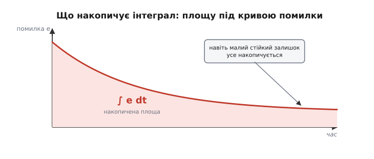
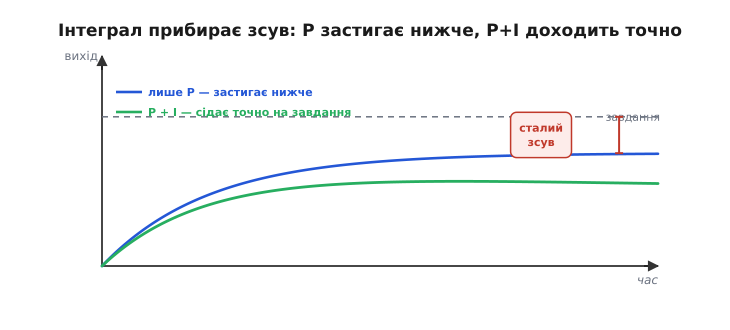
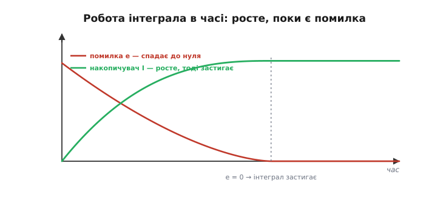
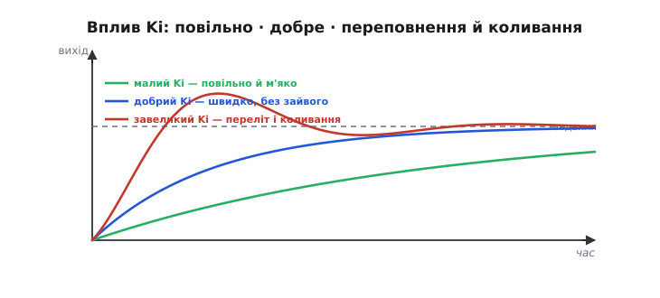
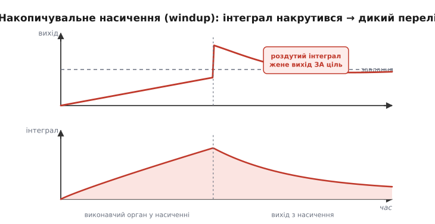
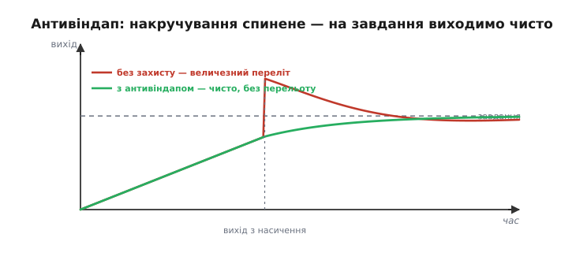

# І-складова

[Пропорційний регулятор](root:embedded/proportional-control) лишає сталий зсув через свою **безпам'ятність**: він бачить тільки помилку **зараз** і не помічає, що «недотягує» вже довго. Ліки очевидні — дати регуляторові **пам'ять**: хай він накопичує помилку в часі й, поки вона лишається, додає дедалі більше впливу, аж доки не зажене її точно в нуль. Це **інтегральна** складова (від латинського *integer* — цілий, повний: вона збирає помилку в одне ціле за весь час), літера **I** у «ПІД». Саме вона автоматизує ручний «скидач», яким пропорційному регуляторові доводилося компенсувати залишковий зсув руками.

Якщо пропорційну складову уявляти як пружину, то інтегральну — як **наполегливість**. Вона не сильна вмить, зате **невтомна**: щомиті додає по краплі впливу, поки лишається бодай натяк на помилку. Уявіть, як наповнюєте склянку точно до риски: ви доливаєте й доливаєте, потроху, аж доки рівень не стане **рівно** на лінії, — і тоді спиняєтесь. Інтеграл робить те саме з помилкою: ллє вплив, доки вона не зникне зовсім. Це терпіння там, де пропорційній складовій бракує самої лише сили.

### Накопичувати помилку

Інтегральна складова дивиться не на миттєву помилку, а на її **накопичену суму** в часі — математично це **інтеграл** помилки, ∫e dt. А інтеграл — це **площа під кривою**: відкладіть помилку проти часу, і ∫e dt буде площею між цією кривою та віссю. Тож I весь час підсумовує «площу» помилки: поки помилка є, площа росте; що довша й більша помилка, то швидше росте.


*Що накопичує інтеграл. Червона — помилка в часі; затінена ділянка — її накопичена «площа» ∫e dt. Поки помилка не нуль, площа росте; навіть крихітна, але стійка помилка з часом накопичується у велику суму. Саме цю суму інтегральна складова й перетворює на додатковий вплив.*

У цьому головна сила I: він **терплячий**. Хоч якою малою була б стала помилка, дай їй час — і накопичена сума стане досить великою, щоб її здолати. Там, де пропорційний регулятор «махнув рукою» на крихітний залишковий зсув, інтегральний **продовжує тиснути**, бо пам'ятає: ми недотягуємо вже довго.

Технічно інтеграл — це просто **поточна сума**: щокроку до накопичувача додають свіжу помилку, помножену на крок часу. Велика помилка наповнює його швидко, мала — повільно, але **неухильно**. Тому інтеграл розрізняє те, чого не бачить пропорційна складова: довга вперта маленька помилка (сталий зсув) накопичується в чималу суму — і саме її інтеграл зрештою долає.

Наочно це видно на [круїз-контролі](root:embedded/open-vs-closed-loop). На пагорбі пропорційний регулятор додає газу за помилкою швидкості, але застигає трохи нижче 100, бо для підйому потрібен постійний надлишок газу. Інтегральна складова цей надлишок **намацає сама**: поки швидкість трохи нижча за 100, інтеграл повільно піднімає газ, аж доки спідометр не покаже рівно сто; на спуску — навпаки, поволі прибере. Так круїз-контроль тримає **точну** швидкість на будь-якому профілі дороги, а не лише на рівному.

Варто відчути й **темп** інтеграла: він — найповільніша з трьох складових. Пропорційна реагує миттєво, інтегральна ж розгойдується поволі: їй треба час, щоб накопичити суму, і так само час, щоб її «розрядити». Через це I має найдовшу пам'ять у регуляторі — і це водночас дар (помічає стійкий зсув, який усі проґавили) і небезпека (повільно відпускає, тож легко переганяє ціль за інерцією). Тримати цей повільний темп у голові — половина успіху в приборканні інтеграла.

### Інтеграл прибирає зсув

Додавши інтегральну складову до пропорційної, дістаємо дволітерний регулятор:

```
 u = Kp·e + Ki·∫e dt

   Kp·e      — пропорційна частина: реакція на помилку ЗАРАЗ
   Ki·∫e dt  — інтегральна частина: реакція на НАКОПИЧЕНУ помилку
   Ki        — інтегральний коефіцієнт (вага накопичення)
```


*Інтеграл прибирає зсув. Лише P (синій) застигає нижче завдання — лишається сталий зсув. P+I (зелений) спершу теж недотягує, але інтегральна складова накопичує цей залишок і потроху додає впливу, доки вихід не сяде точно на завдання. Помилка йде в нуль — і лишається там.*

Чому зсув зникає **повністю**? Бо інтеграл застигає лише тоді, коли його перестають годувати — тобто коли помилка стає **рівно нуль**. Поки лишається бодай крихітна помилка, сума все росте, вплив усе більшає — і так доти, доки помилку не виб'ють у нуль. Інтегральна складова за самою своєю природою не заспокоїться на «майже досягли»: вона тисне, аж поки не досягне точно.

**Приклад (як інтеграл з'їдає зсув).** Візьмімо [дрон під пропорційним керуванням](root:embedded/proportional-control): Kp = 4, лишився сталий зсув e = 2°, бо для утримання рівня бракувало впливу u₀ = 8. Додамо інтеграл, Ki = 2, крок dt:

```
 Накопичувач:  I += e·dt;   u = Kp·e + Ki·I

 Поки тримається зсув, інтеграл росте — і сумарний вплив
 Kp·e + Ki·I стає БІЛЬШИМ за u₀: дрон рушає до горизонту.
 Помилка тане, з нею тане і внесок P (Kp·e → 0),
 а інтегральний внесок натомість росте й перебирає тягар:
 у новій рівновазі e = 0, і ВЕСЬ потрібний вплив u₀ = 8
 тримає сам інтеграл, застигнувши на I = u₀/Ki = 8/2 = 4.
```

Зверніть увагу на красу механізму: інтеграл **сам** намацав те значення впливу (u₀ = 8), яке P-регулятор міг забезпечити лише ціною помилки. Тепер вплив є, а помилки нема — і це саме те, чого пропорційному регулятору бракувало.

Тут варто наголосити на математичній **певності** цього механізму. Інтеграл росте доти, доки його «годують» ненульовою помилкою; єдиний стан, у якому він застигає, — це e = 0. Отже, поки система взагалі здатна досягти завдання, P+I-регулятор **гарантовано** зведе сталу помилку до нуля — не приблизно, а точно. Пропорційний регулятор «мириться» з невеликим зсувом; інтегральний на нього принципово не згоден. У цьому й полягає його єдине, але дуже цінне завдання — і робить він його бездоганно.

Це не просто враження, а доказовий факт: накопичувач за своєю побудовою може застигнути лише там, де помилка дорівнює нулю, тож інша рівновага неможлива в принципі. Строге доведення цього — від означення інтегратора до точного значення, на якому він спиняється, — у вставці [чому інтеграл зводить зсув точно в нуль](root:embedded/integral-control/math-zero-offset.md).

Та сама властивість робить інтеграл чудовим **борцем зі сталими збуреннями**. Постійний вітер, що відхиляє дрон; перекіс центру ваги; тертя, що гальмує вісь, — усе це для регулятора виглядає як стала помилка, і інтеграл прибирає її так само невблаганно, як і внутрішній зсув. Він не питає, **звідки** взялася стійка помилка, — просто накопичує проти неї поправку, доки вона не зникне. Тому P+I добре тримає завдання не лише на гладкому стенді, а й у реальних умовах, де завжди щось потроху збиває апарат убік.


*Робота інтеграла в часі. Поки помилка (червона) додатна, накопичувач (зелений) зростає, нарощуючи вплив; щойно помилка добігає нуля — інтеграл застигає на тому рівні, що дає точно потрібний для утримання вплив. Інтеграл «запам'ятовує» необхідне зміщення й тримає його сам.*

### Коефіцієнт Ki: швидше проти стійкіше

Інтегральна складова не безкоштовна — у неї свій компроміс, керований коефіцієнтом **Ki**. Малий Ki — зсув прибирається **повільно**: інтеграл ліниво накопичується, і вихід довго підповзає до завдання. Великий Ki — зсув прибирається швидко, але інтеграл стає «нетерплячим»: він **переповнюється**, переганяє ціль, і система **перестрілює** та коливається.


*Вплив Ki. Малий (зелений) — зсув зникає повільно й м'яко. Добрий (синій) — швидко й без зайвого. Завеликий (червоний) — інтеграл переповнюється, вихід перестрілює завдання й розгойдується. Інтегральна складова взагалі схильна додавати коливань, бо діє із запізненням — на минуле, а не на теперішнє.*

Чому I взагалі **погіршує** стійкість? Бо він діє з **запізненням**: реагує не на теперішню помилку, а на **накопичену минулу**, тож завжди трохи «відстає» від подій. Це запізнення (фазове відставання) і підштовхує контур до коливань — той самий механізм, що й у [межі стійкості замкненого контуру](root:embedded/loop-stability), де зайвий зсув фази обертає гасіння на підкачку.

Звідси практичне застереження: **надлишок інтеграла підступніший, ніж надлишок пропорційності**. Завеликий Kp дає різке, але чесне коливання, яке видно одразу. Завеликий Ki діє віроломніше: система спершу здається стабільною, а тоді розгойдується повільними, наростаючими хвилями, які важче зв'язати з причиною. Тому інтегральну складову нарощують **обережніше** за пропорційну, і за найменших ознак повільного гойдання першим підозрюють саме завеликий Ki. У процесному керуванні силу інтеграла часто задають **оберненою** мірою — **часом інтегрування** (англійською *reset time*, Ti): грубо, за скільки секунд інтеграл сам набирає стільки ж впливу, скільки дає пропорційна частина. Малий Ti = сильний інтеграл, великий Ti = слабкий.

Поєднання пропорційної й інтегральної складових — **ПІ-регулятор** — це, без перебільшення, найпоширеніший регулятор у промисловості: він і швидко реагує (P), і точно виходить на завдання (I), а коливань уникає, якщо не перебирати з Ki. Безліч контурів температури, тиску, витрати, швидкості працюють саме як ПІ, без жодної диференційної складової. Отож, опанувавши P та I, ви вже володієте робочим інструментом для більшості задач керування.

> 🔧 **Навіщо це.** Додавайте інтегральну складову **обережно й після** того, як налаштували P. Її завдання вузьке — **прибрати сталий зсув**, а не прискорити реакцію. Починайте з малого Ki й піднімайте, доки зсув не зникатиме за прийнятний час; щойно з'являються повільні коливання чи затяжний переліт — Ki завеликий, відступіть. Пам'ятайте головне: P бореться з помилкою **зараз**, I — зі **сталою** помилкою; не намагайтеся інтегралом робити роботу пропорційної складової.

### Накопичувальне насичення (windup)

Найпідступніша вада інтеграла, яку **конче** треба знати, — **накопичувальне насичення**, англійською *windup* («накручування»). Виникає вона щоразу, коли виконавчий орган упирається в свою межу — у **насичення** (англійською *saturation*): коли більший сигнал керування вже не дає більшого впливу, бо заліза «до кінця».

Уявіть: завдання різко змінилося або апарат довго не може його досягти (мотор уже на повних обертах, а ціль ще далеко). Помилка велика й **тривала** — а отже, інтеграл увесь цей час **накручується**, росте й росте до величезного значення. Біда в тому, що виконавчий орган уже **й так на максимумі** — більший інтеграл нічого не додає до руху, лише роздуває внутрішнє число регулятора. А коли апарат нарешті дотягується до завдання, цей **роздутий** інтеграл нікуди не дівся: він далі щосили жене вихід **за** ціль — аж поки повільно не «розкрутиться» назад. Наслідок — величезний **переліт** і довге гойдання там, де мало бути плавне приземлення на завдання.


*Накопичувальне насичення (windup). Поки виконавчий орган у насиченні (не може дати потрібного впливу), помилка тримається, а інтеграл накручується до величезного значення (затінено внизу). Коли вихід нарешті досягає завдання, роздутий інтеграл жене його далеко за ціль — і апарат довго гойдається, поки інтеграл «розкручується». Класична причина дикого перельоту.*

Канонічний приклад — дрон, що стоїть на землі з увімкненим контуром висоти: висота нижча за завдання, мотори впираються в межу, інтеграл накручується хвилинами — і в мить зльоту апарат вистрілює вгору, далеко переганяючи задану висоту.

Корінь біди — у тому, що **наївний** інтеграл живе у власному світі чисел і не знає про межі реального заліза. Він чесно накопичує «борг» впливу, якого вимагає помилка, — навіть коли цей борг уже неможливо виплатити, бо мотор на максимумі. Накопичений борг доводиться потім «віддавати» перельотом. Тому будь-який інтегральний регулятор на **реальному** (а отже, обмеженому) виконавчому органі без захисту рано чи пізно дасть windup — це не рідкісна патологія, а пряма й неминуча властивість наївної реалізації.

> 🔧 **Навіщо це.** Випробовуйте контур із **великими** завданнями й тривалим насиченням — саме там вилазить windup, а на дрібних відхиленнях він непомітний. Найдешевший і найнадійніший захист — **затиснути інтеграл** розумними межами (такими, щоб сам інтеграл не міг вимагати більше за повний хід виконавчого органу). І візьміть за звичку **обнуляти інтеграл** у момент «увімкнення» контуру — зброєння, зльоту: інакше накопичений за простою борг вистрелить апарат у першу ж секунду роботи.

### Як приборкати інтеграл: антивіндап

На щастя, windup лікують — прийомами під спільною назвою **антивіндап** (англійською *anti-windup*, «проти накручування»). Ідея проста: **не давати інтегралу накручуватися, коли виконавчий орган і так у насиченні**. Раз більший вплив усе одно нічого не змінить — нема сенсу його «вимагати».


*Антивіндап рятує. Без захисту (червоний) — роздутий за насичення інтеграл дає величезний переліт. З антивіндапом (зелений) — накручування спинене, тож на завдання вихід виходить чисто, майже без перельоту. Та сама система, та сама ціль — різниця лише в тому, чи дозволили інтегралу «накрутитися».*

Трьох прийомів зазвичай досить. **Умовне інтегрування**: щойно вплив уперся в межу — просто **перестати** додавати до накопичувача, поки не вийдемо з насичення. **Затиск** (англійською *clamping*): тримати сам інтеграл у заданих межах згори й знизу, не даючи йому роздуватися. **Зворотний перерахунок**: відмотувати накопичене назад рівно на стільки, на скільки вплив «зрізала» межа. Усі троє роблять те саме — не дають інтегралу вимагати неможливого, тож коли система виходить із насичення, накопичувач уже не роздутий і перельоту нема.

Деталі [реалізації на мікроконтролері](book:algorithms/discrete-pid) — окрема тема; головне ж засвоїти **симптом і причину**: дикий переліт після довгої великої помилки — це майже завжди windup, і лікується він антивіндапом, а не зменшенням Ki.

> 🔧 **Навіщо це.** Якщо ваш апарат поводиться добре за малих відхилень, але після **великого** збурення чи різкої зміни завдання дає дикий **переліт** і довго заспокоюється — підозрюйте **windup**, а не погані коефіцієнти. Будь-який інтегральний регулятор на реальному (а отже, обмеженому) виконавчому органі **обов'язково** має мати антивіндап — це не вдосконалення, а необхідність. Найдешевший варіант — просто **затиснути** інтеграл у розумних межах; уже він рятує від найгірших перельотів.

### Звідки взялася назва

Назва «інтегральна» — інженерна й порівняно пізня: широко її закріпили лише близько 1970 року. А історично цю складову звали **«скидачем»**, точніше — **«автоматичним скиданням»** (англійською *automatic reset*, згодом просто *reset*). Слово прийшло від ручного гвинта-«скидача» на ранніх [пропорційних регуляторах](root:embedded/proportional-control): оператор крутив його руками, щоб зрушити робочу точку й прибрати залишковий зсув. У пневматичних регуляторах 1930-х (першим був «Стабілог» Клессона Мейсона з компанії Foxboro) цю ручну дію автоматизували: окремий міх через дросель поволі підмінював опорний сигнал, доки помилка не зникне, — той самий «скидач», тільки автоматичний. Рівняння, що пов'язало «скидання» з математичним інтегруванням, прийшло помітно пізніше за саму дію.

А ще раніше ту саму інтегральну дію застосував Ніколас Мінорський: у праці 1922 року «Про напрямну стійкість автоматично кермованих тіл» він поклав інтегральний член у закон автоматичного стернування корабля — щоб судно не йшло вічно з невеликим, але стійким відхиленням від курсу під сталим вітром. Випробували цей закон на лінкорі USS *New Mexico*. Так інтегральна дія працювала в металі ще до того, як її стали звати «інтегральною».

Підсумок: інтегральна складова дає регуляторові **пам'ять про минуле** й тим прибирає сталий зсув — те, чого пропорційна не вміє. Ціна — схильність до коливань (бо I діє із запізненням) і небезпека windup (яку знімає антивіндап). P реагує на помилку **тепер**, I — на **накопичену** (минуле); чого тут бракує — то це чуття до **майбутнього**, до того, **куди** й **як швидко** помилка змінюється. Саме його, а заразом і ліки від коливань, дає [диференційна складова](root:embedded/derivative-control).

Сам по собі ПІ-регулятор уже вміє і швидко реагувати, і точно триматися завдання попри збурення — для багатьох апаратів цього цілком досить. [Диференційна складова](root:embedded/derivative-control) — не обов'язкова основа, а **відточування**: чуття до швидкості зміни помилки, що зробить рух плавнішим, гасить коливання наперед і дозволяє безпечно підняти Kp. Разом усі три й складають повний регулятор ПІД.

---
