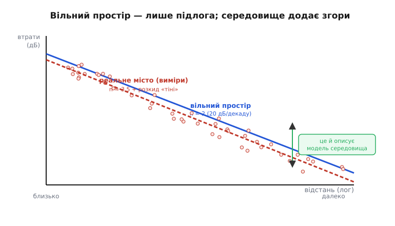
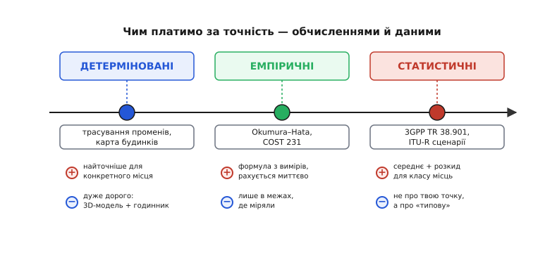
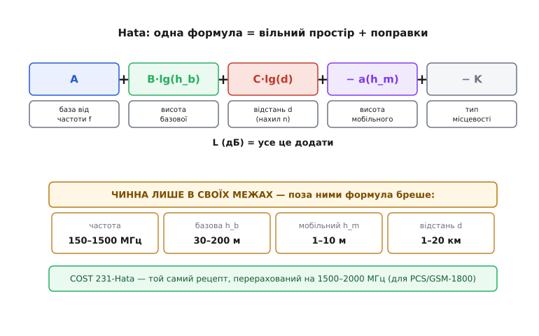
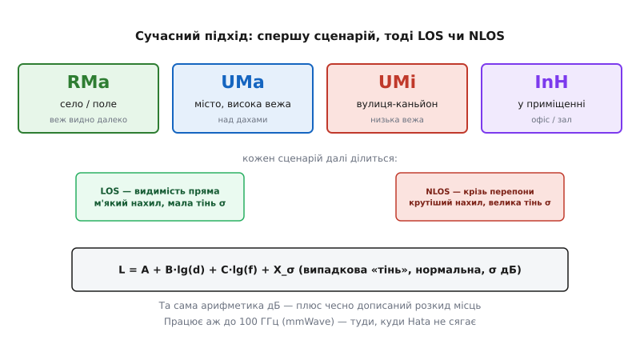

# Моделі розповсюдження ITU-R і 3GPP

Коли ми складали [бюджет радіолінії](root:embedded/link-budget), один доданок ми взяли майже на віру — **втрати у просторі** L_path. Для прикладу на 10 метрів ми написали «−60 дБ» і пішли далі. Та звідки це число? У чистому випадку його дає [втрата у вільному просторі](book:communications/free-space-loss) — формула для **вакууму**, де між антенами нема нічого. Але твій дрон літає не у вакуумі. Між ним і пультом — будинки, дерева, земля, дощ, стіни. І реальні втрати виявляються **набагато більшими**, ніж обіцяє вакуумна формула, — інколи на 20-30 дБ, тобто в сотні разів за потужністю.

Отже постає чесне інженерне питання: **як передбачити справжні втрати в реальному середовищі, ще не виїхавши в поле з аналізатором спектра?** Відповідь — **моделі розповсюдження** (*propagation models*): формули й таблиці, що оцінюють L_path для типового міста, села чи приміщення. Саме їх стандартизують міжнародні організації — **ITU-R** (радіосектор Міжнародного союзу електрозв'язку) і **3GPP** (консорціум, що пише стандарти стільникового зв'язку від 3G до 5G). У цьому кроці ми розберемо, звідки ці моделі взялися, як вони влаштовані й — головне — як вибрати правильну для свого пристрою.

### Вільний простір — це лише підлога

Почнімо з того, *чому* вакуумна формула завжди занижує втрати. У вільному просторі хвиля розходиться сферою, і її потужність падає як квадрат відстані — звідси відомі **20 дБ на декаду**: збільшив відстань удесятеро — втратив 20 дБ. Це фундаментальна «підлога»: менше за неї втрати не бувають **ніколи** (хіба що хвилевід чи дзеркальний коридор тимчасово сфокусують промінь).

А далі починається реальність. У місті хвиля **не йде прямо**: вона відбивається від стін, огинає кути, проходить крізь листя й шибки, гасне в кожній перешкоді. Кожне таке явище забирає енергію понад вакуумну норму. Підсумок дивовижно простий: у реальному середовищі втрати теж ростуть лінійно з логарифмом відстані, але **крутіше**. Інженери описують цей нахил одним числом — **показником втрат** (*path-loss exponent*) n:

```
L = L₀ + 10·n·lg(d/d₀)
```

де n = 2 — це чистий вільний простір, а в місті n сягає 3-4, у щільній забудові навіть 5. Кожна одиниця n — це додаткові 10 дБ втрат на декаду відстані. Ось чому Wi-Fi, що в полі добиває на сотні метрів, у бетонному офісі ледь дотягує крізь дві стіни.


*Синя пряма — вільний простір, n = 2, теоретична нижня межа втрат. Червоні точки — реальні виміри в місті: вони лягають на крутішу пряму (n ≈ 3.5) і ще «дихають» навколо неї на одиниці децибел. Саме цю надбавку — і нахил, і розкид — описує модель розповсюдження.*

Зверни увагу на дві речі на рисунку. По-перше, **нахил** реальної прямої більший — це й є вищий n. По-друге, точки не лежать на прямій ідеально, а розсіяні навколо неї: два місця на однаковій відстані від вежі можуть відрізнятися за рівнем сигналу на десяток децибел — одне за рогом будинку, інше на відкритому майданчику. Цей розкид зветься **затіненням** (*shadowing*), і запам'ятаймо його — згодом побачимо, що сучасні моделі вписують його в формулу окремим доданком.

### Три способи передбачити втрати

Як же дістати ці n та L₀ для конкретного міста? Історично склалося три родини підходів — і вони різняться тим, **чим ти платиш за точність**.


*Зліва направо точність за конкретним місцем спадає, зате зростає швидкість і всеохопність. Детерміновані моделі рахують кожен промінь по 3D-карті — точно, але дорого. Емпіричні стискають тисячі вимірів в одну формулу — миттєво, але лише там, де міряли. Статистичні описують не точку, а цілий клас місць середнім і розкидом.*

**Детерміновані** (*deterministic*) моделі — це трасування променів (*ray tracing*): беремо 3D-карту будинків і прораховуємо кожне відбиття й заломлення фізично. Результат найточніший для **конкретної** вулиці, але ціна страшна: потрібна докладна геометрія міста й чимало машинного часу. Для планування однієї базової станції — годиться; для оцінки «чи добиватиме мій дрон узагалі» — надмір.

**Емпіричні** (*empirical*, від гр. empeiría — досвід) моделі йдуть із протилежного боку: хтось колись об'їхав місто з вимірювачем, зібрав тисячі точок і **підігнав** під них одну формулу. Жодної фізики відбиттів — лише регресія крізь хмару даних. Рахується вмить на будь-якому калькуляторі, але працює **тільки в тих умовах, де міряли**: винесеш за межі частот чи відстаней — формула почне відверто брехати. Класика цього класу — **Okumura-Hata**, до якої ми зараз дійдемо.

**Статистичні** (*statistical*) моделі — сучасний синтез. Вони не описують ані твою точку, ані конкретне місто, а **цілий клас середовищ** («щільне місто», «село», «офіс»): дають середній нахил для класу **плюс** розподіл того самого затінення. Саме так влаштовані моделі **3GPP** і нові рекомендації **ITU-R**. Це визнання чесної правди: радіоканал — річ випадкова, тож і описувати його треба мовою ймовірностей, а не однієї точної цифри.

### Okumura-Hata: класика емпіричного жанру

Найвідоміша емпірична модель народилася в Японії. У 1968 році інженер **Йосіхіса Окумура** з лабораторії електрозв'язку (ECL) корпорації NTT з колегами об'їздив околиці Токіо, ретельно міряючи силу сигналу, і видав велику працю з **графіками** загасання для різних частот, висот антен і типів місцевості (*Okumura Y. та ін., «Field strength and its variability in VHF and UHF land-mobile radio service», Review of the Electrical Communication Laboratory, т. 16, 1968 — усталений факт*). Графіки були точні, але незручні: щоб дістати число, доводилося читати з кривих лінійкою.

За дванадцять років, у 1980-му, інший інженер NTT — **Масахару Хата** — зробив наступний крок: він **підігнав під криві Окумури аналітичні формули** (*Hata M., «Empirical Formula for Propagation Loss in Land Mobile Radio Services», IEEE Trans. Vehicular Technology, серпень 1980 — усталений факт*). Відтоді замість графіків можна просто підставити числа у формулу. Так Okumura-Hata стала робочим інструментом планування стільникових мереж на десятиліття.

Сама формула виглядає громіздко, та її будова напрочуд знайома — це **той самий бухгалтерський підхід у децибелах**, що й бюджет лінії: береш базову величину й **додаєш поправки**.


*Загальні втрати складаються з бази за частотою, поправок на висоту базової та мобільної антен, нахилу за відстанню й знижки за тип місцевості — усе в децибелах, усе додаванням. Унизу — жорсткі межі чинності: поза ними формулою користуватися не можна. COST 231-Hata — той самий рецепт, перерахований на вищі частоти.*

Для міста формула Хати має такий вигляд:

```
L = 69.55 + 26.16·lg(f) − 13.82·lg(h_b) − a(h_m) + (44.9 − 6.55·lg(h_b))·lg(d)
```

де f — частота в МГц, h_b — висота базової антени в метрах, h_m — висота мобільної антени, d — відстань у кілометрах, а a(h_m) — поправка на висоту мобільного. Не лякайся коефіцієнтів: вони не з фізики, а **з підгонки під виміри Окумури** — це числа, що найкраще лягли на хмару точок. Важлива не їхня точна величина, а структура: є доданок за частотою (вище f → більші втрати), за висотою вежі (вища вежа → менші втрати, тому знак мінус), і головний доданок з lg(d) — той самий нахил n, тільки тут він залежить ще й від висоти антени.

> 🔧 **Навіщо це.** Уяви: тобі треба прикинути, чи накриє базова станція на даху 30-метрового будинку район радіусом 3 км на частоті 900 МГц. Не треба нічого вимірювати в полі — підставив числа у формулу Хати, дістав L_path в децибелах, поклав його в [бюджет лінії](root:embedded/link-budget) замість вакуумного значення — і відразу бачиш, чи лишається запас над [чутливістю приймача](book:communications/free-space-loss). П'ять хвилин арифметики економлять день поїздок з вимірювачем.

Та сама громіздкість формули приховує небезпеку, і це **головне, що треба засвоїти про емпіричні моделі**: вони чинні лише у **вузьких межах**, у яких збирали дані. Для Хати це частоти **150-1500 МГц**, висота базової антени **30-200 м**, мобільної **1-10 м**, відстань **1-20 км**. Підставиш Wi-Fi на 2400 МГц — дістанеш число, але **неправильне**, бо на цій частоті Окумура нічого не міряв. Підставиш відстань 200 метрів замість мінімального кілометра — знову промах. Формула не знає, що вийшла за межі; брехатиме впевнено. Тому перше питання до будь-якої емпіричної моделі завжди одне: **а мої умови взагалі в її діапазоні?**

Коли в 1990-х Європа будувала цифровий стільниковий зв'язок на вищих частотах, межі Хати в 1500 МГц стали затісні. Робоча група **COST 231** (європейський дослідницький проєкт, 1986-1996) перерахувала коефіцієнти моделі під смугу **1500-2000 МГц** — для систем PCS і GSM-1800 (*усталений факт*). Цей варіант звуть **COST 231-Hata**; це не нова фізика, а той самий рецепт із підправленими числами для вищих частот. Глибший розбір самих формул — поправки a(h_m), різниця для села й відкритого простору, точні коефіцієнти COST 231 — винесений в окрему [математичну вставку](root:embedded/itu-r-propagation-models/math-hata-derivation.md).

### Сучасний підхід: спершу сценарій, тоді LOS чи NLOS

Час минав, частоти росли, а стільниковий зв'язок дійшов до **міліметрових хвиль** (десятки гігагерц) у 5G. Тут стара Okumura-Hata безпорадна — її ніколи не міряли на таких частотах. Знадобилася нова рамка, і її дав **3GPP** у технічному звіті **TR 38.901** — моделі каналу на діапазон **0.5-100 ГГц** (*усталений факт; документ 3GPP TR 38.901*). Паралельно свої рекомендації веде **ITU-R** (серія P — наприклад, P.1411 для коротких міських трас, P.1238 для приміщень), і обидва підходи спираються на ту саму ідею.

Ідея в тому, щоб **спершу назвати сценарій**, а вже потім рахувати. Замість однієї формули «на місто взагалі» стандарт дає набір **типових середовищ**, кожне зі своїми коефіцієнтами:


*Спершу обираємо клас середовища — село (RMa), велике місто з високою вежею (UMa), вулиця-каньйон із низькою вежею (UMi) чи приміщення (InH). Кожен далі ділиться на LOS (пряма видимість) і NLOS (крізь перепони): NLOS має крутіший нахил і більший розкид. Формула — та сама арифметика дБ плюс випадковий доданок «тіні» X_σ, і працює аж до 100 ГГц.*

Чотири основні сценарії 3GPP легко впізнати з життя. **RMa** (*Rural Macro*) — село й поле: вежу видно здалеку, перепон мало. **UMa** (*Urban Macro*) — велике місто, вежа стоїть **над дахами**. **UMi** (*Urban Micro*) — низька вежа просто на вулиці, сигнал біжить «каньйоном» між будинками. **InH** (*Indoor Hotspot*) — усе в приміщенні: офіс, зал, аеропорт.

Усередині кожного сценарію — ще одна, найважливіша розвилка: **LOS чи NLOS**. LOS (*line of sight*) — між антенами **пряма видимість**, нічого не заступає; втрати близькі до вакуумних, нахил м'який, розкид малий. NLOS (*non-line-of-sight*) — між ними **стоять перепони**, сигнал доходить лише відбиттями й огинаннями; нахил крутіший, втрати більші, а розкид — значно ширший. Це розрізнення замінило стару спробу описати «місто загалом» одним числом: насправді той самий квартал поводиться зовсім по-різному, видно тобі вежу чи ні.

І ось ключова новація форми. Згадаймо затінення — розкид точок навколо прямої. Старі моделі його просто ігнорували, видаючи одне «середнє» число. Сучасні **вписують його у формулу чесно**:

```
L = (детермінована частина: A + B·lg(d) + C·lg(f))  +  X_σ
```

де X_σ — **випадкова величина**, нормально розподілена з нульовим середнім і **середньоквадратичним відхиленням σ** (для LOS зазвичай 3-4 дБ, для NLOS 6-8 дБ і більше). Тобто модель каже не «втрати дорівнюють 120 дБ», а «втрати дорівнюють 120 дБ **у середньому**, але в конкретній точці можуть бути на ±8 дБ більші чи менші — і ось імовірність кожного відхилення». Це і є перехід від детермінованого числа до **статистичного опису**, про який ми говорили на початку. Сам нормальний розподіл цього доданку й те, чому затінення «логнормальне», розбираємо у [вставці про статистику затінення](root:embedded/itu-r-propagation-models/math-shadowing-stats.md).

Чому це чесніше? Бо радіоканал **справді** такий. Ти не можеш знати наперед, чи опиниться твій приймач за рогом, чи на відкритому місці — тож єдина правдива відповідь і є ймовірнісною. Інженер, що планує мережу, бере це σ і питає: «Який запас закласти, щоб зв'язок працював **не в середньому місці, а в 95% місць**?» Це той самий [запас на завмирання](root:embedded/link-budget), тільки тепер обґрунтований не на око, а через розподіл.

### Як цим користатися в реальному пристрої

Підсумуймо в робочий алгоритм. Коли тобі треба оцінити дальність зв'язку для свого ESP32, дрона чи давача, дій так.

**Крок перший — назви сценарій і частоту.** Де працюватиме пристрій: у полі, у місті, в приміщенні? Чи буде пряма видимість? Яка частота — 433 МГц, 868, 2400, 5800? Це звужує вибір моделі. Для 900 МГц у місті годиться Okumura-Hata; для Wi-Fi у приміщенні — модель InH з ITU-R P.1238 або 3GPP; для далекої LoRa в полі — RMa.

**Крок другий — перевір межі.** Чи лягають твоя частота, відстань і висоти антен у діапазон обраної моделі? Якщо ні — бери іншу. Це найчастіша помилка новачка: підставити Wi-Fi у формулу Хати, бо вона «під рукою».

**Крок третій — порахуй L_path і поверни його в бюджет.** Модель дає тобі реалістичне число втрат — куди більше за вакуумне. Поклади його в [рядок бюджету лінії](root:embedded/link-budget) замість free-space, додай запас на σ — і дивись, чи лишається сигнал над порогом чутливості.

Ось як виглядає крок третій у коді — пряма реалізація міської формули Хати, яку зручно тримати у прошивці для прикидок:

**Приклад (Okumura-Hata, місто, у прошивці).** Базова антена на даху 30 м, мобільна 1.5 м, частота 900 МГц, відстань 2 км:

:::tabs
```c
#include <math.h>

// Втрати за міською моделлю Хати, дБ.
// f — МГц (150..1500), hb — м (30..200), hm — м (1..10), d — км (1..20)
float hata_urban_db(float f, float hb, float hm, float d) {
    // поправка на висоту мобільної антени (середнє місто)
    float a_hm = (1.1f * log10f(f) - 0.7f) * hm
               - (1.56f * log10f(f) - 0.8f);

    float L = 69.55f
            + 26.16f * log10f(f)
            - 13.82f * log10f(hb)
            - a_hm
            + (44.9f - 6.55f * log10f(hb)) * log10f(d);
    return L;
}

void example(void) {
    float L = hata_urban_db(900.0f, 30.0f, 1.5f, 2.0f);
    // L ≈ 137 дБ — порахуй і порівняй із вакуумом на 2 км/900 МГц (≈ 97 дБ):
    // місто з'їдає на ~40 дБ більше, ніж обіцяє вільний простір!
}
```
```py
from math import log10

# Втрати за міською моделлю Хати, дБ.
# f — МГц (150..1500), hb — м (30..200), hm — м (1..10), d — км (1..20)
def hata_urban_db(f, hb, hm, d):
    # поправка на висоту мобільної антени (середнє місто)
    a_hm = (1.1 * log10(f) - 0.7) * hm \
         - (1.56 * log10(f) - 0.8)

    return (69.55
            + 26.16 * log10(f)
            - 13.82 * log10(hb)
            - a_hm
            + (44.9 - 6.55 * log10(hb)) * log10(d))


L = hata_urban_db(900.0, 30.0, 1.5, 2.0)
# L ≈ 137 дБ — порахуй і порівняй із вакуумом на 2 км/900 МГц (≈ 97 дБ):
# місто з'їдає на ~40 дБ більше, ніж обіцяє вільний простір!
```
:::

Порахуй це число на папері поряд із вакуумною [втратою у вільному просторі](book:communications/free-space-loss) для тих самих 2 км і 900 МГц — і побачиш різницю в десятки децибел. Саме ця різниця й пояснює, чому «за паспортом дальність 5 км», а в реальному місті ледь добиває на півтора. Модель не дає магічної точності, але вона **рятує від найгрубшої помилки** — проєктування за вакуумним числом, якого в природі не існує.

І останнє, найважливіше застереження. Будь-яка модель — **статистична оцінка, а не пророцтво**. Вона каже, що буде в *типовому* місці типового міста, а твоя конкретна точка може виявитися й кращою, і гіршою на той самий десяток децибел затінення. Тому модель — це інструмент **планування й прикидки**, з якого починають; а остаточну впевненість дає лише **виміряний у полі сигнал** на реальному маршруті. Грамотний радіоінженер моделлю окреслює, де зв'язок *має* працювати, закладає запас на σ — а тоді їде й перевіряє. Модель скорочує пошук, але не скасовує поля.

---
