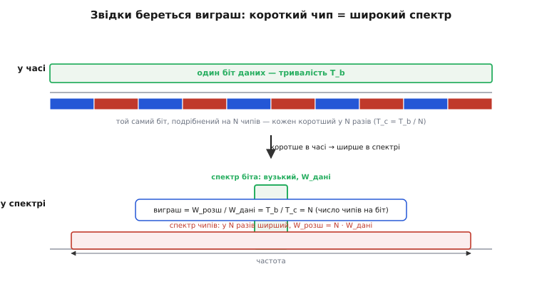
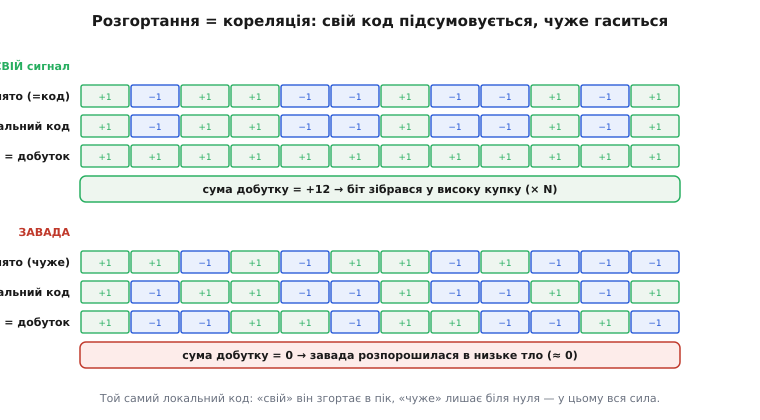
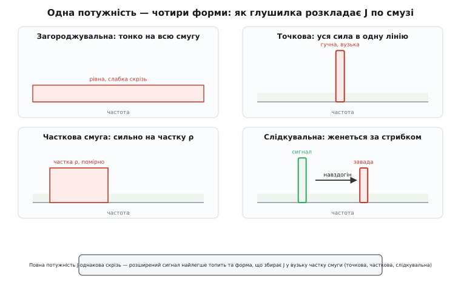
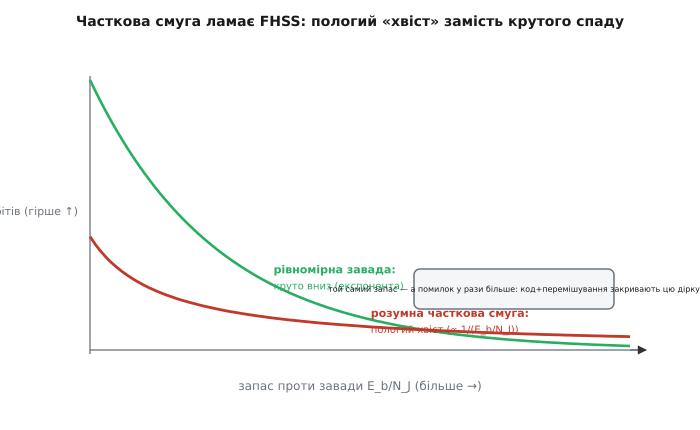
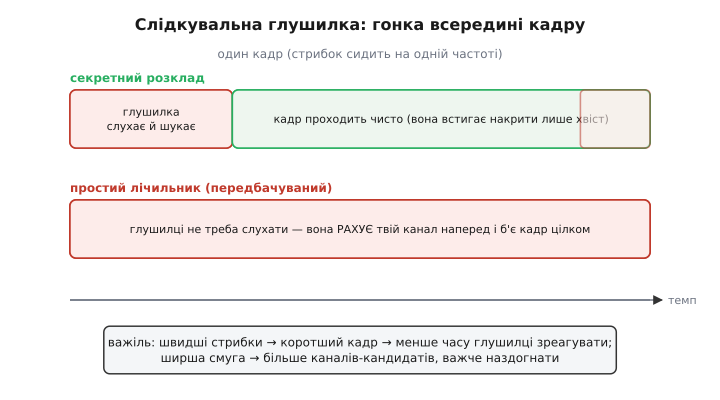
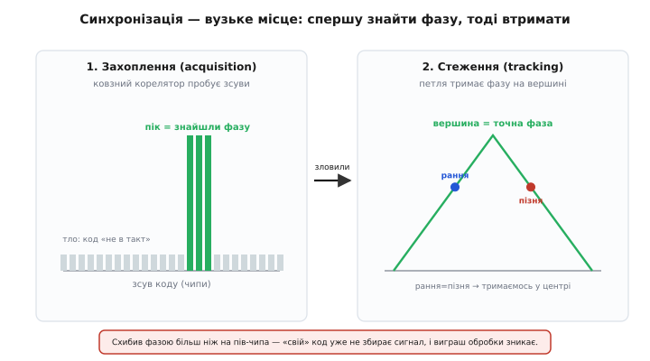

# Лінк під глушінням

У [базовому кроці](root:embedded/jamming-fhss) ми зловили головну інтуїцію: одна гучна завада вбиває вузький лінк, бо топить корисний сигнал у себе; а порятунок — навмисно **розмазати** сигнал по широкій смузі, щоб його не можна було накрити однією лінією. Ми побачили дві родини цього прийому — стрибки частоти (FHSS) і пряму послідовність (DSSS) — і числову міру запасу, виграш обробки, аж до сорока трьох децибелів у GPS.

Тепер спустімося на шар нижче. Базовий крок відповідав на питання «що відбувається». Детальний відповідає на «**чому саме так, наскільки саме, і де межа**». Ми виведемо виграш обробки з першопринципів — з простого факту, що короткий імпульс має широкий спектр. Ми розберемо глушилку не як «гучну заваду взагалі», а як **супротивника з бюджетом потужності й часу**, і покажемо, що серед усіх форм завади є найгірша — і що навіть її можна перемогти. Ми доведемо, чому слідкувальна глушилка програє перегони зі швидкістю світла. І ми впремося в справжню ахіллесову п'яту розширеного спектра — синхронізацію, — бо саме там лінк падає найчастіше, і саме її мусить витягнути прошивка.

Нитка та сама, що в базовому кроці — **чому вузький беззахисний → розмазати → FHSS і DSSS → виграш обробки → ціна**, — але тепер кожен вузол ми доводимо до дна, з формулами й граничними випадками. Почнемо з питання, яке базовий крок обійшов: а **на скільки** гучною мусить бути глушилка, щоб таки пробити розширений лінк?

## Дуель у децибелах: відношення завада/сигнал

Базовий крок казав правильну річ — приймач дивиться на відношення корисної потужності до завад, — але не назвав його числом. Назвімо. Уся боротьба з глушінням зводиться до однієї величини: **відношення завада/сигнал** (англ. *jamming-to-signal ratio*, J/S) на вході приймача. Це просто у скільки разів потужність завади `J` перевищує потужність корисного сигналу `S` там, де приймач їх слухає:

```
J/S = J / S          (у разах)
(J/S)_дБ = 10·log₁₀(J/S)
```

Ключ ось у чому. **Глушилці майже завжди легко зробити J/S величезним.** Вона може стояти ближче за передавача, бити напряму, мати антену з підсиленням, качати кіловати. Проти дрона на кілометрі, чий передавач видає частки вата, наземна глушилка легко дає J/S у тридцять, сорок, п'ятдесят децибелів. Якби приймач читав біти «в лоб», він би давно захлинувся. Питання не в тому, чи зробить глушилка J/S великим — зробить. Питання в тому, **скільки J/S лінк витримає, перш ніж упасти**.

І ось тут виграш обробки перестає бути абстрактним числом і стає **бронею з конкретною товщиною**. Розгортання в приймачі — множення на «свій» код — піднімає корисне над завадою рівно на величину виграшу. Тобто ефективне відношення, яке бачить вирішувач біта **після** розгортання, — це не сире J/S, а J/S, зменшене на виграш обробки. Запишімо баланс, який і є серцем усієї теми:

```
запас = G_p − (J/S) − (E_b/N₀)_потр − L_втрати      (усе в дБ)
```

Розберімо кожен доданок, бо кожен має фізичний сенс.

`G_p` — **виграш обробки** (англ. *processing gain*), у скільки разів ми розтягнули спектр; це наш «плюс», броня. `J/S` — те, що накидає глушилка; наш головний «мінус». `(E_b/N₀)_потр` — **потрібне відношення енергії біта до спектральної густини шуму**, тобто скільки чистого запасу над тлом вимагає сам спосіб модуляції, щоб читати біти з прийнятною похибкою; для простих схем це одиниці децибелів (типово 7–12 дБ на похибку близько 10⁻⁵, залежно від модуляції й наявності кодування). `L_втрати` — **втрати реалізації** (англ. *implementation loss*): неідеальний корелятор, неточна синхронізація, квантування — усе, що з'їдає частину теоретичного виграшу; закладають кілька децибелів.

Коли `запас > 0`, лінк живий: навіть під глушінням вирішувач бачить біт над тлом. Коли `запас < 0`, лінк упав. А **найбільше значення J/S, за якого запас іще нульовий**, має власну назву — **межа глушіння** (англ. *jamming margin*): гранична гучність завади, яку лінк терпить.

```
M_j = G_p − (E_b/N₀)_потр − L_втрати      (дБ)
```

Це та сама формула, лише переставлена: `запас = M_j − J/S`. Межа глушіння каже наперед, ще до паяння: «моя завада може бути гучнішою за сигнал на стільки-то децибелів — і я ще встою».

> 🔧 **Навіщо це.** Межа глушіння — це **не абстракція, а рядок у технічному завданні на лінк**. Замовник каже «зв'язок має триматися, поки глушилка не гучніша за нас на 25 дБ» — і ти вже знаєш потрібний виграш обробки: `G_p = 25 + (E_b/N₀)_потр + L_втрати ≈ 25 + 10 + 3 = 38 дБ`. Звідси одразу випливає число чипів на біт (для DSSS) чи розмір смуги стрибків (для FHSS). Уся архітектура радіо виводиться з одного цільового числа.

**Приклад (яку глушилку витримає GPS-приймач).** Візьмімо виграш GPS з базового кроку — 43 дБ — і подивімося, до якої гучності завади він доживає. Нехай простий приймач вимагає `(E_b/N₀)_потр ≈ 9` дБ і має `L ≈ 3` дБ втрат:

```
M_j = 43 − 9 − 3 = 31 дБ
```

Тридцять один децибел — це понад 1200 разів за потужністю. Глушилка мусить бути **більш ніж у тисячу разів гучнішою** за й без того слабенький сигнал GPS, щоб пробити навіть простий приймач. Ось чому цивільний GPS так важко заглушити грубою силою — і чому серйозні глушилки GPS насправді б'ють не потужністю, а **розумом**, про що далі.

Тепер, коли ми знаємо, що вся дуель — про виграш обробки проти J/S, час вивести сам виграш не як задане число, а з фізики.

## Звідки береться виграш: короткий чип має широкий спектр

Базовий крок дав формулу `виграш = чипи на біт` як факт. Виведімо її з першопринципу, бо саме тут — фізичне серце розширеного спектра, і без нього FHSS та DSSS здаються фокусом.

Почнімо з фундаментального факту про сигнали, який стоїть за всім: **чим коротший імпульс у часі, тим ширший його спектр у частоті.** Це не властивість радіо — це властивість самого перетворення між часом і частотою, обернена пропорція між тривалістю й шириною смуги. Довга рівна нота — вузька лінія в спектрі. Різкий короткий клац — розмазаний по всьому спектру шурхіт. Математично ширина головної пелюстки спектра прямокутного імпульсу тривалістю `τ` дорівнює приблизно `1/τ`: удвічі коротший імпульс — удвічі ширший спектр.

Тепер прикладімо це до DSSS. Один біт даних триває `T_b`; його «природний» спектр вузький, шириною близько `W_дані ≈ 1/T_b`. Ми беремо цей біт і **дрібнимо** його на `N` коротких імпульсів-чипів (англ. *chip* — «дрібка, скалка»), кожен тривалістю `T_c = T_b / N`. Кожен чип у `N` разів коротший за біт — отже, за оберненою пропорцією, спектр чипового потоку в `N` разів **ширший**:

```
W_дані ≈ 1 / T_b
W_розш ≈ 1 / T_c = N / T_b = N · W_дані
```

Ось і все виведення. Розмазування спектра — це просто наслідок того, що ми зробили сигнал «дрібнозернистішим» у часі. А виграш обробки — це відношення нової ширини до старої:

```
G_p = W_розш / W_дані = T_b / T_c = N
```


*Угорі — вісь часу: один біт даних тривалістю T_b, той самий біт розбитий на N коротших чипів по T_c = T_b/N. Унизу — вісь частоти: вузький спектр біта проти в N разів ширшого спектра чипів. Коротше в часі означає ширше в спектрі, і той самий множник N — це і є виграш обробки.*

Тепер видно, чому базова формула правдива, і водночас видно її **межу**. Виграш — це відношення смуг, а не якийсь магічний підсилювач. Він не додає корисному сигналу жодного вата потужності: сумарна енергія біта та сама, ми лише розклали її тонше по частоті, а потім у приймачі зібрали назад. Виграш працює проти **вузької** завади саме тому, що вона, на відміну від корисного, при зборі назад не складається — а розсипається. Проти **широкої** завади, розмазаної так само, як сигнал, виграш куди менший — і це перша тріщина, до якої ми ще повернемося.

Для FHSS та сама логіка виглядає інакше, але дає той самий результат. Там сигнал у кожну мить вузький, зате за час одного біта (чи кількох) перестрибує по `N` різних каналах, розкиданих у смузі `W_розш`. Усереднена по часу «зайнята» смуга — знову `N` каналів, і виграш — знову відношення повної смуги стрибків до смуги даних. Різниця в тім, що DSSS займає всю широку смугу **одночасно**, а FHSS — **по черзі**; але площа «частота × час» однакова, тож і захист однакового порядку. Це глибша причина, чому обидві родини звуть одним іменем «розширений спектр»: вони по-різному заповнюють ту саму площу.

Ми вивели виграш. Тепер найцікавіше — механіка того, як приймач збирає розмазане назад. Базовий крок сказав «множать на код двічі»; доведімо, чому це працює, через кореляцію.

## Розгортання як кореляція: чому свій код збирає, а чужий гасить

Множення прийнятого сигналу на локальний код і підсумовування по біту має точну назву — **кореляція** (лат. *correlatio* — «співвідношення»): міра того, наскільки два сигнали «однакові за формою». Розберімо її на пальцях, бо це і є момент, де корисне й завада міняються ролями.

Уявімо код як послідовність із `N` значень `±1` — скажімо, `+1 −1 +1 +1 −1 …`. Передавач множить кожен біт на цю послідовність: біт «1» летить як сам код, біт «0» — як код навпаки. У приймачі ми множимо прийняте на **ту саму** локальну послідовність, чип за чипом, і **додаємо** результати.

Для **свого** сигналу трапляється диво простоти. Прийнятий чип — це переданий чип, тобто значення коду; множимо його на те саме значення коду. Але `(+1)·(+1) = +1` і `(−1)·(−1) = +1` — **завжди `+1`**, хоч яке було значення. Кожен доданок дає `+1`, і сума по всіх `N` чипах дорівнює `+N`. Корисний біт зібрався в одну високу купку висотою `N`. Формально це працює, бо код помножений сам на себе дає одиницю в кожній точці — властивість, яку звуть **автокореляцією в нулі**: код ідеально схожий сам на себе, коли точно суміщений.

Для **завади** все інакше. Завада не знає нашого коду; її значення в кожному чипі ніяк не пов'язані з нашими `±1`. Множимо чуже на наш код — добуток стрибає то `+1`, то `−1`, як монетка. Додаємо `N` таких випадкових `±1` — плюси й мінуси гасять одне одного, і сума виходить **біля нуля** (точніше, росте лише як `√N`, а не як `N`). Це — **низька крос-кореляція**: чужий сигнал і наш код несхожі, тож збору в купку не відбувається.


*Угорі — свій сигнал: прийняте дорівнює коду, помножене на той самий код дає скрізь +1, сума = +12, біт зібрався у високу купку. Унизу — завада: чужа послідовність, помножена на код, дає то +1, то −1, і сума ≈ 0, завада розпорошилася в тло. Той самий локальний код одне збирає в пік, інше лишає біля нуля.*

Ось чому в базовому кроці корисне «піднялося», а чуже «впало». Корисне пройшло множення на код **двічі** (`код · код = 1`) і зібралося в купку `N`. Завада пройшла код **раз** — і вперше розсипалася. Відношення купки до тла зросло рівно в `N` разів — це і є виграш обробки, тепер уже не як відношення смуг, а як відношення висот після кореляції. Дві картини — спектральна й кореляційна — це одне й те саме число з різних боків.

Тепер стає видно й **тонку умову**, від якої все тримається. Множення «двічі дає одиницю» працює, лише якщо локальний код у приймачі точно суміщений із прийнятим — чип у чип. Зсунь локальний код навіть на пів-чипа — і `код · зсунутий_код` уже не одиниця скрізь, а знову випадкові `±1`; сума падає з `N` до майже нуля, і свій сигнал розсипається так само, як завада. Ось де ховається справжня плата за розширений спектр: усе тримається на **точній синхронізації фази коду**, і саме туди б'ють найрозумніші атаки. До синхронізації ми дійдемо окремим розділом — вона того варта.

А поки корисно розібрати, які взагалі бувають властивості в цих кодів — бо не будь-яка послідовність `±1` годиться.

Гарний код розширення мусить мати дві властивості одночасно: **гострий автокореляційний пік** (щоб чіткою була фаза — суміщений дає `N`, зсунутий хоч на чип дає майже нуль) і **низьку крос-кореляцію** з іншими кодами (щоб кілька передавачів у тій самій смузі не заважали одне одному — на цьому стоїть множинний доступ CDMA). Такі послідовності не беруть навмання: їх будують детерміновано зсувними регістрами (m-послідовності, коди Ґолда) або добирають (коди Баркера для коротких пакетів). Механіку їхньої побудови й точні формули автокореляції винесімо в окрему вставку, щоб не рвати нитку: [як будують коди розширення](root:embedded/jamming-fhss/math-spreading-codes.md) — там LFSR, m-послідовності, властивості Ґолда й чому 11-чиповий Баркер дає рівно 10.4 дБ.

Ми розібрали DSSS до дна. Тепер повернімося до FHSS і побачимо, що там ховається найпідступніший супротивник усієї теми.

## Найгірша завада для FHSS: розумна часткова смуга

Базовий крок намалював FHSS оптимістично: завада сидить на одному каналі, сигнал перестрибує, губиться два хопи з дванадцяти, їх перевідправляють. Це правда для **дурної** завади. Але супротивник не зобов'язаний бути дурним. Спитаймо чесно: **як мала б розкластися завада, щоб завдати FHSS максимум шкоди при тій самій потужності?** Відповідь неочевидна й важлива.

У глушилки є фіксований бюджет — повна потужність `J`. Вона може розкласти її по осі частот як завгодно, і форма розкладу вирішує все.


*Та сама потужність J розкладається по-різному: загороджувальна — тонко на всю смугу; точкова — уся сила в одну вузьку лінію; часткова смуга — сильно на частку ρ; слідкувальна — женеться за стрибком сигналу. Розширений сигнал найлегше топить та форма, що збирає J у вузьку частку смуги.*

Розгляньмо крайнощі, а тоді знайдімо оптимум між ними.

**Загороджувальна завада** (англ. *barrage jamming*) розмазує `J` рівномірно по всій широкій смузі стрибків `W_розш`. Це чесний, але марнотратний хід. На кожен окремий канал припадає лише `J / N` потужності — розмазана завада ділиться на всі `N` каналів так само, як сигнал розмазаний по них. Кожен хоп сигналу зустрічає слабеньку заваду `J/N`; виграш обробки працює на повну, і саме звідси беруться наші оптимістичні децибели межі глушіння. Загороджувальна завада — це той випадок, коли розширений спектр виграє з розгромним рахунком.

**Точкова завада** (англ. *spot jamming*) — протилежність: уся `J` в один вузький канал. Той єдиний канал забитий намертво, зате решта `N−1` чисті. Сигнал попадає на забитий канал із імовірністю лише `1/N`; більшість хопів проходять ідеально. Це той сценарій із базового кроку — і він, як ми бачили, для FHSS майже нешкідливий, бо псує мізерну частку хопів.

А тепер — **головне питання**: що як не кидатися в крайнощі, а забити не один канал і не всі, а **частку** каналів `ρ` (гр. «ро»), але **сильно**? Це **завада часткової смуги** (англ. *partial-band jamming*). Логіка супротивника тонка. Якщо забити частку `ρ` смуги, то вся потужність `J` концентрується в `ρ·N` каналах, тобто на кожному забитому каналі густина завади вища в `1/ρ` разів, ніж у загороджувальної. Сигнал попадає на забиту зону з імовірністю `ρ` — рідше; **але коли попадає — там набагато гучніше**, і хоп гине напевно. Виникає добуток двох ефектів, що тягнуть у різні боки: `ρ` менша — рідше влучаємо, але кожне влучання смертельніше.

І ось нетривіальний результат, який робить часткову смугу підступною. Є **оптимальна для глушилки** частка `ρ*` — не надто мала, не надто велика, — за якої добуток «частота влучань × шкода від влучання» максимальний. І за цієї оптимальної `ρ*` крива якості лінка **перегинається**. Без розумної завади частка збитих бітів спадала б із запасом `E_b/N_J` **круто, за експонентою** — додав кілька децибелів запасу, і помилки впали на порядки. А проти оптимальної часткової смуги спад стає **пологим, обернено-лінійним**: помилки спадають лише як `1/(E_b/N_J)`. Щоб їх задавити, треба вже не кілька зайвих децибелів, а **десятки**.


*Дві криві частки збитих бітів від запасу E_b/N_J. Рівномірна завада дає крутий спад (експонента): трохи більше запасу — і помилок майже нема. Розумна часткова смуга дає пологий хвіст (∝ 1/(E_b/N_J)): той самий запас лишає в рази більше помилок. Код і перемішування закривають цю дірку.*

Це класичний результат теорії розширеного спектра, установлений ще в 1970-х (аналіз Вітербі й Джейкобса для нешумового прийому частотної маніпуляції); точні числа `ρ*` та константи хвоста залежать від модуляції та детектора — статус тут усталений якісно, а конкретні коефіцієнти є параметрами моделі, не універсальною сталою. Але **механізм** однаковий і важливий: розумна завада, зібравши потужність у частку смуги, обертає нашу експоненційну броню на пологий хвіст.

Виходить, самих стрибків **недостатньо**. FHSS без нічого відкритий частковій смузі. І тут вступає рятівна пара, без якої серйозний стрибучий лінк не будують: **завадостійке кодування плюс перемішування**.

Ідея точна й красива. Часткова смуга б'є **пачками**: коли хоп попав у забиту зону, гинуть **усі** біти цього хопа підряд — а це може бути десяток бітів поспіль. Пачка помилок — найгірше, що буває для кодів виправлення: код, здатний виправити скажімо два помилкові біти на блок, безсилий, коли їх злиплося десять поруч. Рішення — **перемішати** біти перед відправкою так, щоб сусідні по коду біти летіли в **різних** хопах. Тоді збитий хоп викидає не десять сусідів одного блоку, а по одному біту з десяти різних блоків — і кожен блок втрачає лише один біт, який його код легко виправляє. Перемішування **перетворює одну довгу пачку помилок на багато поодиноких**, а код їх добиває.

Саме тому стрибки частоти майже ніколи не ходять самі — їх завжди супроводжує зв'язка «код + перемішувач». Механіку виправлення тут дає, зокрема, [код Ріда–Соломона](topic:communications/reed-solomon): він оперує не бітами, а символами, і природно любить пачкові помилки — один зіпсований символ коштує рівно одного виправлення незалежно від того, скільки бітів у ньому лягло. А перемішування розкидає символи по хопах так, щоб забита зона не з'їла кількох символів одного блоку. Разом вони повертають пологий хвіст назад у крутий спад — розширений спектр знову виграє, але вже не сам, а в парі з кодуванням.

> 🔧 **Навіщо це.** Коли робиш FHSS-лінк для дрона й тестуєш його «в полі», а він добре тримає широку заваду й раптом сипеться від вузької гучної, — це майже напевно **часткова смуга без захисту від пачок**. Лікування — не гнатися за потужністю, а ввімкнути FEC із перемішуванням поверх хопів. У готових системах (LoRa, DVB, RC-протоколи типу ELRS) це вже всередині; коли катаєш власний протокол на голому трансивері — перемішувач і код доведеться поставити самому, інакше перша ж розумна глушилка знайде твою дірку.

Ми розібрали найгіршу **статичну** заваду. Але є ще підступніший клас — той, що не сидить на місці, а **женеться** за сигналом. Він програє, і причина того — чиста фізика часу.

## Слідкувальна глушилка: перегони, які не виграти

Найрозумніша атака на FHSS звучить страшно: а що, як глушилка **слухає ефір, ловить, на яку частоту стрибнув сигнал, і б'є саме туди** — щохопа? Тоді жоден стрибок не втече: куди сигнал, туди й завада. Це **слідкувальна** (англ. *follower*), вона ж **ретрансляційна** (англ. *repeater*), глушилка. На папері вона перемагає FHSS. На практиці — програє, і щоб зрозуміти чому, треба лише порахувати час і згадати, що радіохвиля летить зі скінченною швидкістю.

Розгорнімо перегони по кроках. Щоб зіпсувати конкретний хоп, завада мусить встигнути зробити **три речі**, поки сигнал іще сидить на цій частоті:

1. **Почути** сигнал: він мусить долетіти від передавача до глушилки — це час `d_TJ / c`, де `d_TJ` — відстань передавач–глушилка, `c` — швидкість світла.
2. **Опрацювати**: виявити нову частоту, налаштувати на неї свій передавач, підняти потужність — це апаратна затримка петлі `τ_j`.
3. **Вдарити**: її завада мусить долетіти від глушилки до приймача — час `d_JR / c`.

А скільки часу в неї є? Сигнал сидить на цій частоті рівно **час перебування** `T_h` (англ. *dwell time*, від *to dwell* — «затримуватися»). Але є тонкість на користь оборони: корисний сигнал теж летить до приймача не миттєво, а за `d_TR / c`. Тож удар глушилки має прийти, поки корисний **іще звучить** у приймача, тобто до моменту `T_h + d_TR / c` від початку хопа. Складаємо умову, за якої глушилка **встигає**:

```
d_TJ/c  +  τ_j  +  d_JR/c   <   T_h  +  d_TR/c
```


*Три вузли: передавач стрибає щоT_h, глушилка слухає й б'є, приймач чекає біт. Зелений шлях — сигнал напряму до приймача (час d_TR/c). Червоні шляхи — сигнал до глушилки, її обробка τ_j, і удар до приймача. Завада встигне зіпсувати хоп лише якщо d_TJ/c + τ_j + d_JR/c < T_h + d_TR/c; коротший час перебування (швидші стрибки) робить умову невиконанною.*

Тепер видно всю красу оборони. Перенесімо доданки — і ліворуч лишиться те, що глушилка **програє** за геометрією та залізом:

```
τ_j  +  (d_TJ + d_JR − d_TR)/c   <   T_h
```

Комбінація відстаней `d_TJ + d_JR − d_TR` — це **геометричний гак**: наскільки шлях «через глушилку» довший за прямий шлях сигналу. За нерівністю трикутника цей гак майже завжди додатний (нуль лише коли глушилка точнісінько на прямій між передавачем і приймачем). Отже, у глушилки завжди є **вроджена фора не на її користь**: вона мусить укластися в час перебування `T_h` **мінус** свою обробку `τ_j` **мінус** геометричний гак. І тут оборона тримає єдиний козир, але вирішальний — **вона керує `T_h`**. Досить робити стрибки достатньо швидкими, щоб `T_h` став меншим за `τ_j` плюс гак, — і слідкувальна глушилка **фізично не встигає**: доки вона почула, налаштувалася й ударила, сигнал уже на іншій частоті, а її удар б'є в порожнечу.

**Приклад (чи встигне слідкувальна глушилка за швидким хопом).** Полічімо в числах. Нехай глушилка стоїть за `15` км від передавача й за `15` км від приймача, а прямий шлях `d_TR` = `20` км. Її апаратна петля `τ_j` = `10` мкс (оптимістично швидка). Геометричний гак:

```
гак = (d_TJ + d_JR − d_TR) = 15 + 15 − 20 = 10 км
час гака = 10 000 м / (3·10⁸ м/с) ≈ 33 мкс
разом мінімум = τ_j + час гака = 10 + 33 = 43 мкс
```

Тепер порівняймо з часом перебування. Якщо лінк стрибає **повільно**, скажімо `1000` хопів/с, то `T_h` = `1` мс = `1000` мкс — глушилка встигає з величезним запасом, слідкувальна атака працює. Але піднімімо до **швидких** стрибків, `30 000` хопів/с:

```
T_h = 1 / 30 000 = 33 мкс
умова глушилки: 43 мкс < 33 мкс  →  ХИБНО
```

Не встигає. Її мінімальний час `43` мкс уже більший за час перебування `33` мкс — доки вона зреагувала, сигнал пішов. Ось чому серйозні військові стрибучі радіо (та й швидкохопні цивільні протоколи) женуть **десятки тисяч хопів на секунду**: не заради швидкості даних, а щоб **загнати час перебування під поріг реакції будь-якої слідкувальної глушилки**. Швидкість стрибків — це пряма зброя проти найрозумнішої атаки, і межу задає швидкість світла, яку глушилці не обійти.

Тонкий висновок для розробника: **швидкі стрибки перемагають слідкувальну заваду, повільні — часткову смугу з кодуванням**. Часто це різні режими, і добра система вміє обидва. А от що спільне для всіх режимів і що ламає лінк найчастіше в реальності — це навіть не завада, а те, з чого все починається: синхронізація.

## Ахіллесова п'ята: синхронізація фази

Ми весь час мовчазно припускали, що приймач **уже** знає, де ми в коді чи в розкладі стрибків — що його локальний код суміщений із прийнятим чип у чип, а його синтезатор перестрибує в такт із передавачем. Але звідки він це знає? Ніхто не дає йому старту дзвіночком. Прийом розширеного сигналу починається з важкої задачі: **знайти фазу** — і саме тут лінк падає найчастіше, задовго до того, як з'явиться будь-яка глушилка.

Пригадаймо тонку умову з розділу про кореляцію: множення «двічі дає одиницю» збирає сигнал у купку `N`, **тільки** якщо локальний код точно суміщений. Зсув на пів-чипа — і купка розсипається до нуля, свій сигнал стає невидимим, як завада. Для GPS із чипом `≈ 1` мкс «пів-чипа» — це піваршина світлового шляху, сотні метрів; для DSSS на мегачипах це наносекунди. Приймач мусить попасти в цю фазу **наосліп**, не знаючи наперед ані відстані до передавача (а отже, затримки поширення), ані точного зсуву своїх годинників.

Задачу ділять на два етапи з різними характерами — **захоплення** й **стеження**.


*Ліворуч — захоплення: ковзний корелятор пробує зсуви коду, і лише на правильному зсуві кореляція дає високий пік («знайшли фазу»), решта зсувів — низьке тло. Праворуч — стеження: петля тримає фазу на вершині трикутника кореляції, порівнюючи ранню й пізню точки; рівні — тримаємось у центрі. Схибив фазою більш ніж на пів-чипа — виграш обробки зникає.*

**Захоплення** (англ. *acquisition* — «здобуття») — це грубий пошук: приймач пробує різні зсуви свого коду відносно прийнятого й дивиться, де кореляція раптом підскочить. Уяви, що ти прикладаєш прозорий шаблон-код до сигналу й совгаєш його, доки візерунки не збіжаться — тоді кореляція спалахне піком. Реалізують це **ковзним корелятором** (англ. *sliding correlator*): пробуємо зсув, корелюємо на короткому вікні, немає піка — зсуваємо код на пів-чипа й пробуємо знову. Проблема очевидна: якщо код довгий (у GPS — 1023 чипи), можливих зсувів фази — понад дві тисячі (по пів-чипа), а ще й частота могла «поїхати» від Доплера, тож перебирати доводиться **двовимірну сітку** «зсув × частота». Наївний послідовний перебір може тривати відчутні секунди — ось чому «холодний старт» GPS-приймача такий довгий, а сучасні приймачі ставлять **тисячі паралельних кореляторів**, щоб перебрати всі зсуви разом.

Полічімо порядок часу, щоб відчути масштаб. Нехай треба перевірити `N_c` зсувів фази, на кожен витрачаємо час інтеграції `T_і`, і робимо це послідовно одним корелятором:

```
час захоплення ≈ N_c · T_і · N_f
```

де `N_f` — число частотних комірок, які теж треба перебрати. Для тисячі зсувів, десятка частотних комірок і мілісекундної інтеграції це вже `1000 · 10 · 1 мс = 10` с — неприйнятно, звідси й паралелізм.

**Стеження** (англ. *tracking*) — етап легший, коли фазу вже зловлено: тепер її треба лише **втримувати**, бо годинники плинуть, апарат рухається, затримка поволі міняється. Класичний прийом — **ранньо-пізня петля** (англ. *early-late loop*): корелюємо не лише з поточним зсувом коду, а й із копією, зсунутою трохи «раніше», і копією «пізніше». Якщо ми точно на вершині трикутника автокореляції, рання й пізня дають однакову висоту. Щойно фаза попливла — одна з них піднялася, інша впала; за різницею петля розуміє, у який бік підправити локальний годинник, і повертає пік у вершину. Це стежить за фазою безперервно, поки лінк живий.

Тепер видно, чому синхронізація — **головна вразливість** розширеного спектра, гостріша за будь-яку заваду. По-перше, під час захоплення виграш обробки ще **не працює на повну**: код не суміщений, сигнал не зібраний, приймач сліпий — саме тоді навіть помірна завада може не дати «зачепитися». По-друге, збити стеження легше, ніж пробити вже синхронізований лінк: досить зіпсувати кілька хопів у критичний момент, щоб петля «зірвалася» й довелося починати захоплення з нуля. Розумні глушилки б'ють саме сюди — не в дані, а в **синхронізацію**: не топлять сигнал грубою силою, а зривають фазу, змушуючи приймач вічно шукати старт. Ось чому цивільний GPS, дарма що має тридцять із гаком децибелів межі глушіння, насправді вразливий: слабенька, але хитра завада на етапі захоплення коштує дешевше, ніж тисячократне перевищення потужності.

> 🔧 **Навіщо це.** У прошивці синхронізація — це найбільший шматок коду приймача розширеного спектра й найчастіше джерело «чомусь не ловить». Коли твій DSSS/FHSS-лінк «іноді не піднімається», перше підозрюване — не потужність, а **захоплення**: замалий діапазон пошуку частоти (не врахував Доплер чи вигін кварцу), закоротке вікно інтеграції (пік тоне в шумі), надто грубий крок зсуву (проскочив вершину). А коли лінк «раптом рветься на маневрі» — це зрив **стеження**: петля не встигла за швидкою зміною затримки. Обидві біди лікуються не гучнішим передавачем, а правильними константами петель.

Ми пройшли всю фізику: дуель у децибелах, виведення виграшу, кореляцію, найгіршу заваду, перегони зі світлом, синхронізацію. Час зібрати це в **архітектуру** — як реальні системи складають ці прийоми разом, і як шматок цього лягає в прошивку дрона.

## Як це складають разом: від антени до прошивки

Жодна серйозна система не покладається на один прийом. Стійкий до глушіння лінк — це **шари оборони**, кожен закриває свою дірку попереднього. Пройдімося знизу вгору, від заліза до коду, бо так видно логіку.

**Шар антени: не пустити заваду всередину.** Найелегантніша оборона — не боротися із завадою в цифрі, а **не почути** її фізично. Багатоелементна антена з керованою діаграмою (англ. *controlled reception pattern antenna*, CRPA) складає сигнали кількох елементів так, щоб у **напрямку глушилки** утворилася «сліпа зона» — нуль діаграми, — а в напрямку супутника лишилося підсилення. Математична межа тут проста й важлива: **масив із `M` елементів може поставити `M−1` незалежних нулів**, тобто семиелементна антена гасить до шести глушилок одночасно, хоч би які вони були гучні. Це найпотужніший анти-глушильний прийом для GPS — він працює **до** будь-якого розгортання, прибираючи заваду ще на вході, тож дає десятки децибелів понад виграш обробки. Плата — розмір, вага, ціна й обчислення адаптивного формування, тож CRPA живе на військовій та важливій цивільній техніці, не в кишенькових приймачах.

**Шар адаптації: обходити зайняті канали.** Замість сліпо стрибати по всіх каналах розумна FHSS-система **стежить**, де погано, і **викидає** брудні канали з розкладу. Саме так працює **адаптивна зміна каналів** (англ. *adaptive frequency hopping*, AFH) у Bluetooth: він ділить смугу 2.4 ГГц на 79 каналів по 1 МГц (від 2402 до 2480 МГц) і стрибає близько 1600 разів на секунду — новий канал кожні 625 мкс; а виявивши, що на певних каналах постійна біда (там реве Wi-Fi чи мікрохвильовка), **вилучає їх зі списку** й стрибає лише по чистих. Це перетворює статичну заваду (і чужий постійний сигнал) на розв'язну задачу: навіщо стрибати туди, де завжди погано, якщо можна не стрибати. AFH з'явилася у версії 1.2 саме як ліки від співіснування з Wi-Fi — і це той рідкісний випадок, коли анти-глушильний прийом щодня рятує не від ворога, а від сусіднього роутера.

**Шар кодування: пережити те, що пробилося.** Що б не пройшло крізь антену й адаптацію — добиває **код виправлення плюс перемішування**, як ми вивели в розділі про часткову смугу. Це останній рубіж: він не заважає заваді псувати частину сигналу, а **відновлює дані** з того, що лишилося, обертаючи пачки помилок на поодинокі й виправляючи їх. Без цього шару FHSS відкритий частковій смузі, а DSSS — глибоким провалам; з ним — обидва тримають пологий хвіст під контролем.

**Шар секрету: не дати вгадати розклад.** Уся оборона тримається на тому, що розклад стрибків (чи код розширення) **невідомий глушилці**. Якби він був передбачуваний, слідкувальна глушилка не мусила б слухати ефір — вона просто **сиділа б там, куди сигнал стрибне наступним**, обходячи всі перегони зі світлом. Тому розклад породжують **криптографічно стійким** генератором: не простим лічильником, а послідовністю, яку без ключа не відрізнити від випадкової. У військових це серцевина захисту (розклад — секрет рівня ключа); у цивільних протоколах хоча б беруть довгий псевдовипадковий генератор, синхронізований спільним зерном, щоб чужий не вгадав наступний канал. Механіку такого генератора — зсувний регістр із оберненим зв'язком, що дає довгу неповторну послідовність, — винесімо в код-вставку: [генератор розкладу стрибків на LFSR](root:embedded/jamming-fhss/proj-hop-sequence.md).

Тепер зберімо шари в живий приклад — шматок прошивки RC-лінка на голому 2.4-ГГц трансивері, що поєднує адаптивний обхід і чорний список каналів. Це спрощено, але показує, як фізика перетворюється на код.

**Приклад (адаптивний вибір наступного каналу з чорним списком).** Приймач веде статистику якості кожного каналу (за контрольними сумами прийнятих пакетів) і виключає ті, де забагато помилок, — точно як AFH. Генеруємо наступний канал псевдовипадково, але пропускаємо занесені в чорний список:

```c
#include <stdint.h>
#include <stdbool.h>

#define N_CHAN        79        // каналів у смузі 2.4 ГГц (як у Bluetooth)
#define BAD_LIMIT     6         // стільки поспіль збоїв — канал у чорний список
#define GOOD_RECOVER  200       // стільки чистих пакетів — реабілітація каналу

static uint8_t  err_run[N_CHAN];    // поспіль збоїв на каналі
static uint16_t good_run[N_CHAN];   // поспіль чистих пакетів
static bool     blacklisted[N_CHAN];

// Псевдовипадковий генератор розкладу (спільне зерно з передавачем!).
// 16-бітний LFSR, поліном 0xB400 — довга неповторна послідовність.
static uint16_t lfsr = 0xACE1u;    // зерно узгоджене на обох кінцях
static uint16_t hop_prng(void) {
    uint16_t lsb = lfsr & 1u;
    lfsr >>= 1;
    if (lsb) lfsr ^= 0xB400u;      // обернений зв'язок
    return lfsr;
}

// Оновити статистику каналу за результатом прийому одного пакета.
void channel_feedback(uint8_t ch, bool crc_ok) {
    if (crc_ok) {
        err_run[ch] = 0;
        if (blacklisted[ch] && ++good_run[ch] >= GOOD_RECOVER) {
            blacklisted[ch] = false;    // канал очистився — повертаємо в гру
            good_run[ch] = 0;
        }
    } else {
        good_run[ch] = 0;
        if (++err_run[ch] >= BAD_LIMIT)
            blacklisted[ch] = true;     // канал стабільно брудний — геть
    }
}

// Наступний канал за розкладом, але не з чорного списку.
uint8_t next_hop_channel(void) {
    for (int guard = 0; guard < 4 * N_CHAN; ++guard) {
        uint8_t ch = (uint8_t)(hop_prng() % N_CHAN);
        if (!blacklisted[ch])
            return ch;                  // чистий канал за псевдовипадком
    }
    return 0;   // рятівний випадок: усе в чорному списку — беремо нульовий
}
```

Розберімо, що тут відбувається на кожному шарі нашої оборони. `hop_prng` — **шар секрету**: LFSR дає довгу псевдовипадкову послідовність, і поки зерно `0xACE1` та поліном спільні на обох кінцях, приймач і передавач стрибають синхронно, а чужому розклад невідомий. `channel_feedback` із `blacklisted` — **шар адаптації**: канал, що стабільно псує пакети (шість збоїв поспіль), вилітає з гри, як у AFH, а якщо очистився (двісті чистих пакетів) — повертається. `next_hop_channel` зшиває їх: бере наступний канал за секретним розкладом, але пропускає брудні. Контрольна сума `crc_ok`, за якою все крутиться, — це той самий механізм із базового кроку, що ловить збиті пакети; тут він годує рішення, куди стрибати. Чого тут навмисно **немає** — кодування з перемішуванням (шар виживання) і формування нулів антеною (шар заліза): перше додається окремим блоком FEC поверх, друге живе в аналоговій частині. Але навіть цей шматок уже поєднує три з чотирьох шарів — і саме так виглядає стійкий лінк у прошивці: не один геніальний прийом, а кілька простих, що прикривають дірки одне одного.

Помітна й тонка пастка `guard` у циклі: якщо **всі** канали потраплять у чорний список (потужна широка завада забила ефір), наївний `while(blacklisted)` зациклився б навічно. Тому ставимо стелю спроб і рятівний вихід — краще стрибнути на поганий канал, ніж повісити приймач. Це дрібниця, але саме такі дрібниці відрізняють код, що виживає в полі, від коду, що гарно виглядає на дошці.

## Що з усього цього винести

Пройдімо нитку востаннє, тепер із висоти детального розбору. Уся боротьба з глушінням — це **одна дуель у децибелах**: виграш обробки проти відношення завада/сигнал, а різниця між ними, межа глушіння, — це наперед відома товщина броні, яку ти закладаєш іще в технічному завданні. Сам виграш не магія, а проста обернена пропорція між часом і частотою: подрібнив біт на `N` чипів — отримав у `N` разів ширший спектр і в `N` разів вищий пік після кореляції. Кореляція й ділить світ на «своє» (збирається в купку `N`) і «чуже» (розсипається до `√N`), і вся сила тримається на точній фазі коду.

Далі — межі й контрзаходи. Проти FHSS найстрашніша не гучність, а **розум**: часткова смуга обертає круту експоненту захисту на пологий хвіст, і рятує тільки код із перемішуванням. Проти слідкувальної глушилки рятує **швидкість стрибків**: фізика часу й скінченна швидкість світла не дають їй встигнути, якщо час перебування коротший за її петлю плюс геометричний гак. А найтонше місце всієї конструкції — **синхронізація**: доки приймач не зловив фазу, виграш не працює, і саме туди б'ють найдешевші атаки. Реальні системи відповідають **шарами** — нулі антени, адаптивний обхід каналів, кодування, секретний розклад, — де кожен шар закриває дірку сусіднього.

І головний зсув думки проти базового кроку: розширений спектр — це **не одна ідея «розмазати», а ціла екосистема компромісів проти супротивника, що теж думає**. Дурну заваду б'є вже сама ідея; розумну — лише правильно складені шари. Коли наступного разу твій лінк упаде під завадою, ти вже знатимеш не «додати потужності», а спитати точно: це груба сила пробила межу глушіння, це розумна часткова смуга знайшла дірку в кодуванні, це слідкувальна глушилка встигла за повільним хопом — чи це взагалі не завада, а зірване захоплення. Кожна біда має свій механізм, і кожен механізм ми тут довели до дна.

---
