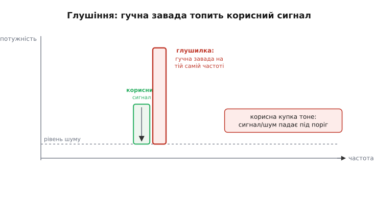
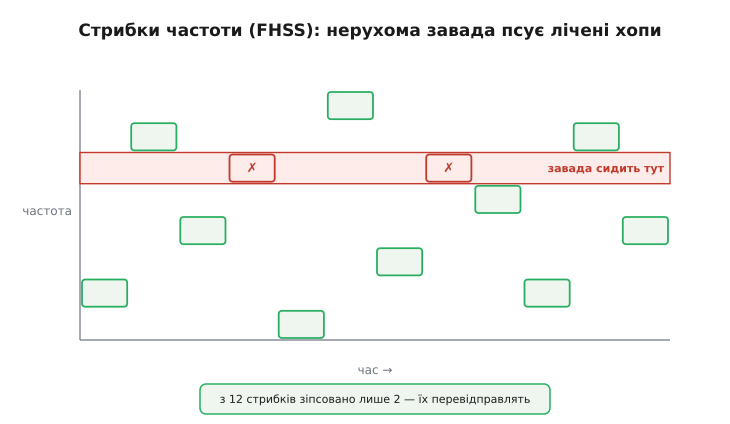
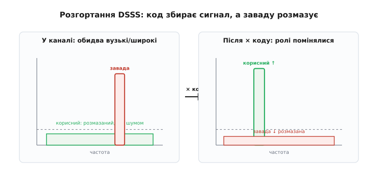
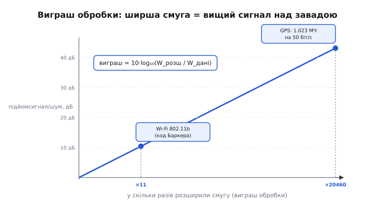
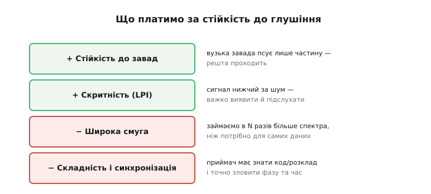
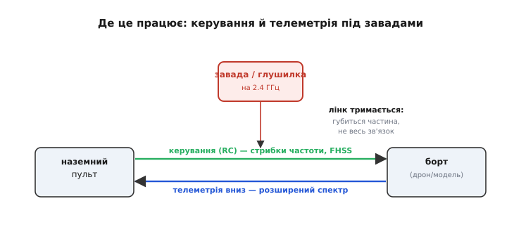

# Лінк під глушінням

Уяви дрон на кілометрі від пульта. Команди йдуть угору, телеметрія — вниз, усе працює. Аж раптом поряд вмикається потужний передавач на тій самій частоті — і зв'язок обривається. Не тому, що зламалося радіо: просто корисний сигнал **потонув** у чужому реві. Це і є **глушіння** (*jamming*, від *to jam* — «забити, заклинити»): навмисна гучна завада, що топить твій сигнал у себе. Питання, на яке відповідає ця тема, гостре й практичне: як зробити лінк, який **не падає** від однієї завади? І чому проти глушіння найкраще працює ідея, що на перший погляд здається марнотратною дурницею.

### Чому вузький лінк беззахисний

Почнімо з кореня — чому одна завада здатна вбити цілий зв'язок. Приймач розрізняє сигнал не за абсолютною гучністю, а за **відношенням** корисної потужності до шуму та завад на тій самій частоті. Поки корисна купка стирчить над цим тлом — біти читаються; щойно тло піднялося вище за неї — лишається каша.


*Гучна вузька завада сидить рівно на робочій частоті лінка й піднімає рівень потужності там набагато вище за корисну купку. Приймач більше не бачить різниці «сигнал проти тла» — відношення сигнал/шум падає під поріг, і зв'язок рветься.*

Звичайне радіо тримає всю свою потужність на одній частоті — і саме це робить його вразливим. Глушилці не треба перекривати весь ефір: досить однієї **вузької** потужної лінії точно на робочому каналі. Вузький лінк — це **єдина точка відмови**: одна влучна завада, і все. Звідси й рятівна думка: а що, як не тримати сигнал на одному місці?

### Рятунок — розмазати сигнал по широкій смузі

Відповідь звучить парадоксально. Замість того щоб тримати сигнал вузьким і сильним, його **навмисне розмазують** по смузі в десятки й сотні разів ширшій, ніж потрібно для самих даних. Густина потужності на кожному окремому герці падає — сигнал стає низьким і непомітним, ледь над шумом, — зате він більше **не прив'язаний до однієї частоти**, де його легко накрити. Цю родину прийомів називають **розширеним спектром** (*spread spectrum*).

> 📡 **Залежність — як саме розмазують.** Розширений спектр — це коли той самий сигнал займає набагато ширшу смугу, ніж треба для його даних, заради надійності й скритності, а не швидкості. Знати тут досить двох речей: спосіб «розмазування» секретний (відомий лише передавачу й приймачу), тож чужий його не збере; і саме завдяки цьому приймач відновлює корисне, а будь-яку чужу заваду навпаки розпорошує. Глибше — у темі [розширений спектр](topic:communications/spread-spectrum).

Розмазати сигнал можна двома основними способами, і обидва б'ють глушіння, але по-різному. Перший — **перестрибувати** з частоти на частоту за секретним розкладом (FHSS). Другий — лишатися на місці, але **множити** дані на швидкий секретний код, що розтягує спектр (DSSS). Розберімо обидва — спершу наочніший.

### Стрибки частоти: тікати від завади

Найпростіша ідея: не сиди на одній частоті, де тебе чекає глушилка, — **перестрибуй**. Передавач щомиті міняє частоту за псевдовипадковим розкладом, а приймач стрибає **синхронно** з ним, бо знає той самий розклад. Це **стрибки частоти** (*frequency-hopping spread spectrum*, FHSS).


*Завада сидить на одному каналі (червона смуга через увесь час). Стрибучий сигнал залітає на неї лише зрідка: з дванадцяти стрибків зіпсовано хіба два — їх легко виявити за контрольною сумою й перевідправити. Решта проходить чисто. Нерухома вузька завада безсила проти того, хто весь час тікає.*

Логіка проста й красива: завада нерухома, а ти весь час тікаєш. Вона псує лише ті нечисленні стрибки, що випадково потрапили на її частоту, — а зіпсований стрибок легко помітити за [контрольною сумою](topic:communications/checksums) і **перевідправити**. Чим швидші стрибки й чим більше каналів, тим меншу частку лінка з'їдає одна завада. Саме так працює **Bluetooth**: близько 1600 стрибків за секунду по десятках каналів у смузі 2.4 ГГц, та ще й з адаптивним обходом тих каналів, де галасує Wi-Fi. Ось чому навушники й роутер уживаються в одній кімнаті, майже не заважаючи одне одному.

### Пряма послідовність: розгорнути сигнал назад

Другий спосіб хитріший і потужніший проти глушіння. Частоту не міняють; натомість **кожен біт даних множать на швидкий псевдовипадковий код** із коротких імпульсів-чипів. Швидке «дрібнення» біта на чипи **розширює** його спектр у стільки разів, скільки чипів припадає на біт: сигнал стає в N разів ширшим і в N разів нижчим — розмазаним, ледь помітним над шумом. Це **пряма послідовність** (*direct-sequence spread spectrum*, DSSS).

Найцікавіше стається на приймальному боці. Прийнятий сигнал **знову множать на той самий код** — і ролі корисного й завади міняються місцями.


*Зліва — те, що приходить у канал: корисний сигнал розмазаний під шумом, а вузька завада стирчить гучною лінією. Справа — після множення на код у приймачі: корисне зібралося у вузьку високу купку над шумом, а завада, якій код «чужий», розпорошилася в широке низьке тло. Корисне зросло, чуже потонуло.*

Чому так? Корисний сигнал множать на код **двічі** — раз у передавачі, раз у приймачі; два множення на ту саму послідовність дають одиницю, тож біт повертається цілим і вузьким. А завада проходить код лише **один раз** — у приймачі. Для неї це перше множення не «згортає» її назад, а вперше **розмазує** по всій широкій смузі. Те, що було гучною вузькою лінією, стає тонким низьким тлом. Корисне піднялося, чуже впало — відношення сигнал/шум стрибнуло вгору.

### Виграш обробки: на скільки піднявся сигнал

Ось числова суть усієї ідеї. На скільки саме код піднімає корисний сигнал над завадою, зветься **виграшем обробки** (*processing gain*): у скільки разів розтягнули спектр, у стільки ж піднявся сигнал над тим, що код не зміг зібрати. А оскільки розтягують у десятки тисяч разів, зручніше говорити в [децибелах](topic:communications/power-decibels).


*Що ширше розмазали сигнал відносно його даних, то вищий підйом сигнал/шум. Старий Wi-Fi 802.11b брав 11-чиповий код Баркера — виграш близько 10 дБ. GPS розтягує 50 біт/с даних у потік 1.023 мільйона чипів/с — і дістає аж ~43 дБ, тобто понад 20 000 разів.*

Запишімо це формулою. Виграш обробки — це відношення розширеної смуги до смуги самих даних; для DSSS воно дорівнює кількості чипів на біт:

```
виграш = W_розш / W_дані = чипи на біт
G_дБ   = 10 · log₁₀(виграш)
```

> 🔧 **Навіщо це.** Виграш обробки — це **запас лінка проти завади ще до паяння**. Він прямо додається до [бюджету радіолінії](root:embedded/link-budget): кожен зайвий децибел виграшу — це децибел, на який завада може бути гучнішою, а лінк іще встоїть. Хочеш надійніший зв'язок під глушінням — або підніми потужність (дорого, є межа закону), або **розширюй спектр сильніше**: довший код, більше каналів. Друге часто дешевше й елегантніше.

**Приклад (порахуймо запас GPS перед завадою).** Сигнал GPS біля Землі настільки слабкий, що тоне під рівнем теплового шуму, — і все одно приймач його витягує саме виграшем обробки. Порахуймо його з відношення смуг:

```
код GPS : 1 023 000 чипів/с
дані    :      50 біт/с
виграш  = 1 023 000 / 50 = 20 460
G_дБ    = 10 · log₁₀(20 460) ≈ 43 дБ
```

Сорок три децибели — це понад 20 000 разів. Стільки «безкоштовної» переваги дає код приймача проти будь-якої вузької завади чи шуму. Той самий рахунок робить мікроконтролер, що приймає розширений сигнал; ось як перевести відношення смуг у децибели виграшу в реальній прошивці:

:::tabs
```c
#include <math.h>

// Виграш обробки в децибелах із відношення смуг (чип-рейт / швидкість даних).
float processing_gain_db(float chip_rate_hz, float data_rate_bps) {
    float ratio = chip_rate_hz / data_rate_bps;   // у скільки разів ширше
    return 10.0f * log10f(ratio);                 // дБ
}

// GPS C/A: 1.023 МЧ/с проти 50 біт/с → ≈ 43 дБ
float g = processing_gain_db(1023000.0f, 50.0f);  // g ≈ 43.1
```
```py
import math

# Виграш обробки в децибелах із відношення смуг (чип-рейт / швидкість даних).
def processing_gain_db(chip_rate_hz, data_rate_bps):
    ratio = chip_rate_hz / data_rate_bps    # у скільки разів ширше
    return 10.0 * math.log10(ratio)         # дБ


# GPS C/A: 1.023 МЧ/с проти 50 біт/с → ≈ 43 дБ
g = processing_gain_db(1023000.0, 50.0)     # g ≈ 43.1
```
:::

Запас лінка проти завади — це і є цей виграш плюс звичайний [запас бюджету](root:embedded/link-budget). Поки сума більша за нуль, глушилці треба бути неймовірно гучною, щоб пробити лінк.

### За що платимо

Безкоштовного тут немає — за стійкість до глушіння є чесна ціна, і її треба знати наперед.


*Два плюси й два мінуси. Плюси: вузька завада псує лише частину сигналу, а не весь; сам сигнал нижчий за шум, тож його важко навіть виявити, не те що підслухати. Мінуси: займаємо в багато разів ширшу смугу, ніж треба для даних; приймач складніший — він мусить знати секретний код чи розклад і точно зловити фазу й час.*

Головна плата — **смуга**: щоб розмазати сигнал, потрібен ефір у десятки чи сотні разів ширший за самі дані, а спектр спільний і дорогий. Друга плата — **складність і синхронізація**: приймач мусить не лише знати код чи розклад стрибків, а й точно потрапити з передавачем у такт за часом і фазою. Схибив у синхронізації — і «свій» код уже не збирає сигнал, а розмазує його так само, як заваду. Тому розширений спектр беруть не всюди, а там, де надійність під завадами важливіша за економію смуги.

### Де це працює: керування й телеметрія

Найприродніший дім цієї ідеї — лінк, який **не має права впасти**: керування рухомим апаратом і його телеметрія.


*Угору йде [керування (RC)](topic:communications/rc-link) — зазвичай стрибками частоти, бо команди критичні й мусять проходити навіть під завадою. Униз — [телеметрія](topic:communications/telemetry-stream) розширеним спектром. Завада на 2.4 ГГц з'їдає частину обох потоків, але не весь лінк: губиться шматок, не зв'язок.*

У радіокеруванні моделями й дронами **стрибки частоти** стали стандартом саме тому, що команда керма мусить дійти навіть тоді, коли поряд хтось забиває ефір: апаратура перестрибує заваду й тримає лінк живим. [Телеметрія](topic:communications/telemetry-stream) вниз — координати, заряд, висота — так само виграє від розширеного спектра: навіть слабкий далекий сигнал читається з-під шуму завдяки виграшу обробки. Не випадково й народилася ця ідея у військових: радіо, яке важко заглушити й важко запеленгувати, — мрія будь-якої армії. Звідти вона спустилася в цивільне життя й тепер тримає зв'язок між пультом і моделлю, телефоном і навушниками, приймачем і супутником — усюди, де лінк мусить вистояти проти завади.

---
