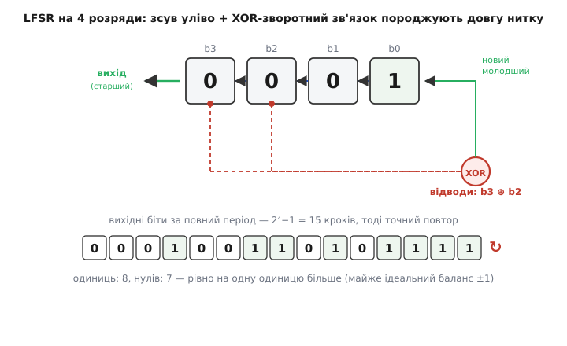
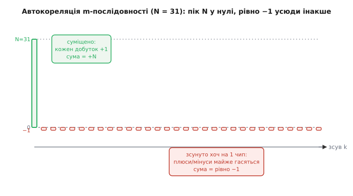
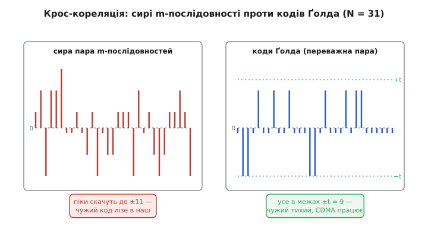

# 🧮 Як будують коди розширення

Ми вже бачили, на чому тримається вся магія прямої послідовності: прийняте множать на локальний код, і свій сигнал збирається у високу купку `N`, а чужа завада розпорошується до `√N`. Але тоді ми обійшли одне питання, лишивши його на потім: **звідки беруть сам код?** Не будь-яка послідовність `±1` годиться. Взяти монетку й накидати випадкових плюсів-мінусів — і код або не дасть гострого піку (фаза розмиється, приймач не зловить старту), або лаятиметься з кодами інших передавачів (кілька апаратів у спільній смузі глушитимуть одне одного). Гарний код мусить мати **дві властивості одночасно**, і вони тягнуть у різні боки:

- **гострий автокореляційний пік** — код, суміщений сам із собою, дає `N`; зсунутий хоч на один чип — майже нуль. Це те, що робить фазу чіткою: приймач знає, що влучив у старт, лише коли купка стрибнула вгору;
- **низька крос-кореляція** з іншими кодами — два різні коди, перемножені, дають майже нуль за будь-якого зсуву. Це те, що дозволяє багатьом передавачам ділити одну смугу, не заважаючи (на цьому стоїть множинний доступ за кодом, CDMA).

Випадкова послідовність провалює обидві вимоги нерівномірно й непередбачувано. Тому коди розширення **не кидають навмання — їх будують детерміновано**, за правилами, що гарантують потрібні властивості. Три родини покривають майже всю практику: **m-послідовності** (довгі, з майже ідеальним піком), **коди Ґолда** (багато кодів із гарантовано низькою взаємною завадою) і **коди Баркера** (короткі, з бездоганним піком для окремих пакетів). Розберімо кожну від першопричини — не «ось формула», а *чому саме така формула неминуча*.

> 🔧 **Навіщо це.** Це не абстрактна теорія чисел — це прямий вибір у прошивці. Коли ти піднімаєш DSSS-лінк чи генеруєш розклад стрибків, ти або сам добираєш код, або читаєш у стандарті, який узяли й **чому**. Заниження довжини коду — це заниження виграшу обробки (менше броні проти завади); поганий вибір взаємних кодів — це самоглушіння твоїх же передавачів. Знати, як коди влаштовані, — значить розуміти, що саме ти жертвуєш, коли підкручуєш ці числа.

## Зсувний регістр із оберненим зв'язком: машина, що робить довгу нитку

Почнімо з механізму, який породжує майже всі довгі псевдовипадкові коди в залізі, — бо він до сміху простий і водночас глибокий. Уяви кілька комірок пам'яті в ряд, кожна тримає один біт. На кожен такт годинника весь ряд **зсувається** на одну комірку: вміст кожної переходить у сусідню, з одного кінця біт випадає назовні (це вихід), а з іншого кінця має зайти новий біт. Питання лише — **звідки брати новий біт?** Якби ми брали його ззовні, це був би звичайний зсувний регістр, порожня труба. Уся хитрість у тому, що новий біт беруть **із самого регістра**: складають (за модулем 2, тобто операцією XOR — «виключне або») значення кількох певних комірок і заводять результат назад на вхід. Ця петля «вихід кількох комірок → XOR → вхід» і зветься **оберненим зв'язком** (англ. *feedback*), а вся конструкція — **зсувний регістр із лінійним оберненим зв'язком** (англ. *linear-feedback shift register*, LFSR).


*Регістр на чотири розряди з відводами від b3 і b2. Щотакту вміст зсувається вліво, старший розряд випадає як вихід, а XOR двох відводів дає новий молодший біт. За повний період — 2⁴−1 = 15 тактів — регістр проходить усі п'ятнадцять ненульових станів по одному разу, тоді точний повтор. У вихідній нитці рівно вісім одиниць і сім нулів — майже ідеальний баланс.*

Тепер найважливіше — **чому ця дрібничка дає довгу неповторну нитку**. Стан регістра — це просто `n` бітів, тобто одне з `2ⁿ` чисел. Кожен такт детерміновано переводить поточний стан у наступний: та сама вхідна комбінація завжди дає ту саму вихідну. А отже, щойно регістр вдруге потрапить у стан, де вже був, — далі все повторюватиметься точнісінько, як минулого разу. Стани ходять **по колу**. Питання лише в довжині цього кола. Один стан випадає одразу: якщо весь регістр — нулі, то XOR нулів дає нуль, новий біт нуль, і машина застрягає в нулях навічно. Отже, з гри виходить рівно один стан, і **найдовше можливе коло — це всі решта `2ⁿ−1` ненульових станів**. Якщо відводи підібрані так, що регістр обходить усі `2ⁿ−1` станів перед повтором, послідовність на виході зветься **послідовністю максимальної довжини**, скорочено **m-послідовністю** (англ. *maximal-length sequence*).

Що ж вирішує, обійде регістр усі стани чи застрягне в короткому циклі раніше? **Вибір відводів.** Не будь-який набір комірок годиться: більшість наборів дають короткі цикли (регістр повертається до початку, не обійшовши й половини станів). Потрібні відводи описує **примітивний поліном** над полем із двох елементів — многочлен степеня `n`, який не розкладається на простіші множники в особливий спосіб. Записують його як суму степенів: наприклад, відводи від четвертої й третьої комірки чотирирозрядного регістра — це поліном `x⁴ + x³ + 1`. Одиничка в кінці — це вихід, старший степінь `x⁴` — довжина регістра, а проміжні члени — де сидять відводи. Глибоко пірнати в теорію полів тут не треба; практично важливо запам'ятати одне: **примітивні поліноми для кожного `n` давно вирахувані й табульовані**, їх беруть готовими. Для чотирьох розрядів працює `x⁴ + x³ + 1` (та ще `x⁴ + x + 1`); для п'яти — `x⁵ + x² + 1`, `x⁵ + x³ + 1` та інші. Візьмеш табличний примітивний — дістанеш повний період `2ⁿ−1`; візьмеш абияк — ризикуєш коротким циклом.

Тепер відчуй масштаб, бо саме він робить LFSR корисним. Регістр — крихітний, лічені розряди; а період росте як `2ⁿ−1`, тобто **вибухово**. Двадцять розрядів — це вже понад мільйон чипів до повтору; тридцять — понад мільярд. Ось звідки береться «довга неповторна ±1-послідовність» майже задарма: жменька тригерів і один XOR роблять нитку, яку неозброєним оком не відрізнити від випадкової. Саме тому LFSR — робоча конячка генерації розкладу стрибків: у [коді генератора розкладу](root:embedded/jamming-fhss/proj-hop-sequence.md) ми бачили той самий 16-розрядний регістр із поліномом `0xB400`, що видає десятки тисяч псевдовипадкових каналів, поки зерно узгоджене на обох кінцях.

> 🔧 **Навіщо це.** «Псевдо-» тут — ключове слово, і в ньому й сила, і пастка. Сила: послідовність **повторювана** — задав те саме зерно на передавачі й приймачі, і обидва згенерують ту саму нитку, синхронно, без передавання самого коду в ефір. Пастка: вона **не криптостійка**. Лінійний зворотний зв'язок означає, що, піймавши лише `2n` вихідних бітів, супротивник відновлює весь регістр і передбачає всю нитку наперед. Для скромного антизавадного захисту цивільного лінка цього досить; для захисту від розумного ворога сирий LFSR **не годиться** — там розклад породжують криптостійким генератором, а LFSR лишають для тестів, скремблювання й розширення, де таємність не критична.

## m-послідовність: чому її автокореляція — ідеальна кнопка

Тепер про головну властивість m-послідовності — ту, заради якої її й беруть у розширений спектр. Переведімо вихідні біти у `±1` (нуль → `+1`, одиниця → `−1` — байдуже яка домовленість, аби стала) і спитаймо: наскільки ця нитка схожа сама на себе, коли її зсунути? Це і є **автокореляція**: беремо послідовність, робимо її копію, зсуваємо копію на `k` чипів по колу й рахуємо, скільки збігів мінус скільки розбіжностей — тобто суму почленних добутків `R(k) = Σ sᵢ · sᵢ₊ₖ`.

За нульового зсуву відповідь очевидна: кожен чип збігається сам із собою, `(+1)·(+1) = +1` і `(−1)·(−1) = +1`, сума всіх `N` добутків дорівнює `+N`. Це той самий пік, що збирає корисний біт у купку. А от що діється за **ненульового** зсуву — це вже диво, і воно неочевидне.


*Циклічна автокореляція m-послідовності довжини N = 31. У точці нульового зсуву — гострий пік заввишки рівно N. За будь-якого зсуву від 1 до 30 — стале значення рівно −1. Двозначність «N або −1» і є та ідеальна кнопка, на якій тримається чіткість фази: зсунувся хоч на чип — і збіг миттєво впав з піку до −1.*

Чому за будь-якого зсуву виходить **рівно −1**, ні більше ні менше? Тут ховається краса, і її варто побачити повністю. Візьми m-послідовність і зсунь її копію на будь-яку ненульову кількість чипів. Виявляється — і це фундаментальна властивість, — що зсунута m-послідовність **сама є тією самою m-послідовністю**, лише почата з іншого місця (бо всі зсуви одного циклу — це один і той самий цикл). А тепер почленно перемнож оригінал на цей зсув, чип за чипом. Кожен добуток `(±1)·(±1)` — це знову `±1`, тобто це нова `±1`-послідовність. І ключове: ця послідовність-добуток теж виявляється **тією самою m-послідовністю** (властивість, яку звуть «зсув-і-склади»: m-послідовність, складена за модулем 2 зі своїм зсувом, дає знову свій же зсув). А в кожній m-послідовності одиниць рівно на одну **більше**, ніж нулів — у `±1`-світі це означає рівно на один `−1` більше, ніж `+1`. Отже сума всіх `N` добутків — це сума однієї m-послідовності, а вона дорівнює `(кількість +1) − (кількість −1) = −1`. Звідси й береться те магічне рівно `−1`: не наближено, не «біля нуля», а точно `−1`, хоч би на скільки ти зсунув.

Порахуймо на конкретиці, щоб число стало відчутним.

**Автокореляція m-послідовності N = 31.** Регістр на 5 розрядів із примітивним `x⁵ + x³ + 1` дає період 31. Порахуймо баланс і два значення автокореляції:

```
довжина періоду     N = 2⁵ − 1 = 31
одиниць у періоді   = 16   (на одну більше)
нулів у періоді     = 15
у ±1-світі:  сума    = (+1)·15 + (−1)·16 = −1

автокореляція:
  зсув 0            R(0) = +N = +31       ← гострий пік
  будь-який зсув ≠0  R(k) = −1            ← стале мале тло
```

Відношення піку до тла — `31 : (−1)`, тобто пік стирчить над рівнем зсуву в `N+1 = 32` рази. Ось чому приймач так упевнено ловить фазу: варто локальному коду точно суміститися з прийнятим — і кореляція злітає з `−1` до `+31`, стрибок ні з чим не сплутати. У цьому й полягає **гострий автокореляційний пік** — перша з двох потрібних властивостей коду. Двозначність «`N` або `−1`» називають **ідеальною двозначною автокореляцією**, і серед усіх послідовностей `±1` це чи не найкраще, що взагалі буває для довгих кодів.

Тонкість, про яку легко забути: ця ідеальна кнопка — для **циклічної** (періодичної) автокореляції, коли зсув робиться по колу. У реальному DSSS, де код котиться безперервно біт за бітом, працює саме циклічна картина, тож `−1` — це чесне тло. А от для одного короткого, не повторюваного пакета важлива **аперіодична** автокореляція (без загортання по колу) — і там m-послідовності вже не ідеальні. Саме туди приходять коди Баркера, до яких ми дійдемо; а поки тримаймо в голові, що ідеальне `−1` — це властивість довгого, безперервного коду.

## Коди Ґолда: коли одного коду замало

m-послідовність чудова сама по собі, але в неї є прикра вада, щойно передавачів стає **багато**. Уяви кілька апаратів у спільній смузі; кожному треба свій код, щоб приймач розрізняв їх за формою, а не за частотою, — це і є ідея CDMA, коду-як-адреси. Здавалося б, візьми кілька різних m-послідовностей — і готово. Але тут чигає халепа: **дві різні m-послідовності можуть корелювати одна з одною погано**. Їхня взаємна (крос-) кореляція не мала й не стала — вона стрибає, і в деяких зсувах дає високі піки. А високий пік крос-кореляції означає рівно те, чого ми боїмося: код одного передавача частково «збирається» приймачем іншого — тобто виглядає як сигнал, а не як тло. Сусід стає завадою.


*Зліва — крос-кореляція сирої пари m-послідовностей (N = 31): значення стрибають шістьма рівнями аж до ±11, без жодної гарантії, де опиниться пік. Справа — крос-кореляція двох кодів Ґолда з переважної пари: усе затиснуте між зеленими лініями ±t, і приймає лише три значення. Ґолд міняє непередбачувані високі піки на передбачувану низьку межу.*

Річард Ґолд у 1967 році знайшов елегантний вихід (усталений факт: R. Gold, «Optimal binary sequences for spread spectrum multiplexing», IEEE Trans. IT, 1967). Ідея разюче проста. Візьми **дві особливі** m-послідовності однакової довжини — так звану **переважну пару** (англ. *preferred pair*): це не будь-які дві, а спеціально дібрані так, що їхня взаємна кореляція набуває лише **трьох значень** і не перевищує відомої малої межі. А тепер породи цілу родину нових кодів так: склади (за модулем 2) першу послідовність із другою, зсунутою на `0`, потім на `1`, потім на `2` — і так усі `N` можливих зсувів. Кожен зсув дає **новий код Ґолда**. Разом із двома вихідними m-послідовностями це дає `N + 2 = 2ⁿ + 1` кодів у родині — для п'яти розрядів аж 33 різні коди.

І ось у чім чудо: **будь-які два коди з родини Ґолда** — хоч би які — корелюють між собою не гірше за ту саму малу трьохзначну межу. Не «здебільшого», не «в середньому» — **гарантовано для всіх пар**. Ти дістаєш багато кодів (по одному на кожен передавач), і жоден не заважає жодному сильніше за заздалегідь відому межу. Плата — крихітна: пік автокореляції в самих кодів Ґолда вже не ідеально двозначний, а трохи «брудніший» за материнські m-послідовності. Але це чесний обмін: жертвуєш дещицею гостроти власного піку заради того, щоб уся юрба кодів жила мирно.

Ту межу можна назвати точним числом. Для `n`-розрядного регістра (довжина `N = 2ⁿ − 1`) взаємна кореляція будь-яких двох кодів Ґолда набуває рівно трьох значень:

```
три значення крос-кореляції:  { −1,  −t(n),  t(n) − 2 }
де   t(n) = 2^⌊(n+2)/2⌋ + 1
```

Порахуймо для нашого прикладу й перевіримо, що межа тримається.

**Крос-кореляція кодів Ґолда для n = 5.** Довжина `N = 31`. Обчислимо межу `t` і три дозволені значення:

```
t(5)  = 2^⌊7/2⌋ + 1 = 2³ + 1 = 9
три значення:  { −1,  −9,  9 − 2 } = { −1, −9, +7 }
найбільша за модулем крос-кореляція  = 9

для порівняння — сира пара m-послідовностей
на тій самій довжині сягала  ±11  (шість різних значень)
```

Отже, вся крос-кореляція будь-якої пари з 33 кодів Ґолда сидить у діапазоні `[−9, +7]`, приймаючи лише три значення, — проти непередбачуваних піків до `±11` у сирої пари. Ба більше: для **непарних** `n` ця межа `t(n)` практично впирається в теоретичну нижню границю Велча — тобто краще за коди Ґолда з переважної пари для непарного `n` узагалі майже нічого не збудуєш. Саме тому Ґолдові коди — це серце практичних CDMA-систем: цивільний GPS роздає різним супутникам різні коди Ґолда (там їх звуть кодами Ґолда сімейства C/A), і приймач за низькою взаємною кореляцією впевнено відділяє потрібний супутник від усіх інших, що світять на тій самій частоті. Один код Ґолда — адреса одного супутника.

> 🔧 **Навіщо це.** Коли твоя система має більше одного передавача в спільній смузі — кілька дронів на рій, кілька вузлів мережі, кілька супутників, — питання «який код кому» стає питанням «хто кого глушитиме». Візьмеш випадкові коди чи випадкові m-послідовності — дістанеш непередбачувані сплески взаємної завади, і десь у полі два вузли раптом «осліпнуть» один від одного. Візьмеш родину Ґолда — дістанеш **тверду верхню межу** взаємної завади наперед, яку закладаєш у бюджет лінка так само, як виграш обробки. Це різниця між «здається, працює» і «доведено не гірше за `t`».

## Коди Баркера: бездоганний короткий код і магічні 10.4 дБ

Лишилася третя родина — і вона зовсім про інше. m-послідовності й коди Ґолда — довгі, для безперервного потоку, де працює **циклічна** кореляція. А що, як треба не потік, а один короткий пакет — заголовок кадру, синхрослово, короткий сплеск? Тоді код не котиться по колу; він летить раз, і важлива **аперіодична** автокореляція — та, де копія зсувається без загортання, і в зоні перекриття лишається дедалі менше чипів. Для такого випадку існують **коди Баркера** (англ. *Barker code*, за Р. Г. Баркером, 1953) — короткі послідовності `±1` з майже неможливо гарною властивістю.

Властивість така: у коді Баркера довжини `N` **аперіодична автокореляція за будь-якого ненульового зсуву не перевищує за модулем одиниці**. Пік у нулі дорівнює `N`, а всі бічні пелюстки — рівно `0` або `±1`. Це найкраще, що взагалі може бути для короткого коду: бічні сплески притиснуті до фізичної межі, нижче нікуди. Візьмімо найвідоміший — 11-чиповий Баркер `+1 +1 +1 −1 −1 −1 +1 −1 −1 +1 −1` — і подивімося на його автокореляцію.

**Аперіодична автокореляція 11-чипового Баркера.** Зсуваємо код відносно себе й на кожному зсуві рахуємо суму добутків у зоні перекриття:

```
зсув 0   :  +11        ← головний пік = N
зсув ±1  :   0
зсув ±2  :  −1
зсув ±3  :   0
зсув ±4  :  −1
зсув ±5  :   0
зсув ±6  :  −1
...усі бічні пелюстки ∈ { −1, 0, +1 }
```

Пік `11`, найбільша бічна пелюстка `1`. Відношення піку до найгіршої бічної пелюстки — `11 : 1`, тобто головний сплеск стирчить над найвищим хибним у **одинадцять разів**. У децибелах бічний рівень — це `20·log₁₀(1/11) ≈ −20.8 дБ` під піком: гострий, чистий, ні з чим не сплутати навіть в одному пострілі.

А тепер — звідки беруться ті самі **10.4 дБ**, які ми згадали в основному кроці, кажучи про старий Wi-Fi 802.11b. Тут важливо не сплутати два різні числа, бо їх легко змішати. Одне — щойно пораховане придушення бічних пелюсток (≈ 20.8 дБ), властивість форми коду. Інше — **виграш обробки**: у скільки разів код піднімає корисний сигнал над завадою, а це, як ми вивели, дорівнює числу чипів на біт. Для 11-чипового Баркера на біт припадає рівно 11 чипів, тож:

```
виграш обробки = чипи на біт = 11
G_дБ = 10 · log₁₀(11) = 10 · 1.0414 ≈ 10.4 дБ
```

Ось вони, рівно `10·log₁₀(11) ≈ 10.4 дБ` — не кругле число, а точний логарифм одинадцяти. Саме стільки «безкоштовної» переваги над вузькою завадою давав кожному біту 11-чиповий код Баркера в 802.11b. Зверни увагу на два різні логарифми: виграш обробки рахують через `10·log₁₀` (це відношення **потужностей** — смуга до смуги), а придушення бічних пелюсток — через `20·log₁₀` (це відношення **амплітуд** кореляції). Плутати їх — класична помилка; тут вони обидва є, і кожен зі свого приводу. Механіку самих децибелів — коли `10·log`, а коли `20·log` — розібрано в темі [потужність і децибели](topic:communications/power-decibels), а природу самого логарифма — у [логарифмах](topic:math/logarithms).

Лишається питання, від якого віє загадкою: якщо коди Баркера такі ідеальні, чому не брати довгі — на сто, на тисячу чипів — і не мати заразом і величезний виграш обробки, і бездоганний пік? Відповідь коротка й дивовижна: **довгих кодів Баркера не існує**. Відомі лише довжини `2, 3, 4, 5, 7, 11, 13` — і жодної понад 13. Це не «поки не знайшли»: для всіх **непарних** довжин понад 13 неіснування строго доведене (Турин і Сторер, 1961), і давня гіпотеза Турина стверджує, що немає жодного Баркера довшого за 13 узагалі; для парних довжин понад 4 питання формально досі відкрите, хоча всі відомі результати кажуть, що їх теж немає (статус: доведено для непарних, гіпотеза для решти). Природа просто не дозволяє притиснути **всі** бічні пелюстки до одиниці, коли чипів багато, — це надто жорстка умова, і десь пелюстка неминуче вилазить. Ось чому 13 — стеля: далі бездоганність недосяжна. Тому Баркер живе там, де треба **короткий** ідеальний код: заголовок кадру, синхрослово, преамбула пакета, стиснення радарного імпульсу. А коли треба довгий код для великого виграшу — беруть m-послідовності чи Ґолда, миряться з бічним рівнем `−1` замість нуля й вигравають на довжині.

## Де ці коди працюють у нашій темі

Зберімо три родини в одну картину — і побачимо, що кожна закриває свій кут тієї самої задачі стійкого лінка, яку ми розбираємо.

**LFSR і m-послідовності — це двигун секрету й фази.** У FHSS зсувний регістр породжує **розклад стрибків**: довгу псевдовипадкову нитку номерів каналів, синхронну на обох кінцях завдяки спільному зерну, — рівно те, що ми складали в [генераторі розкладу на LFSR](root:embedded/jamming-fhss/proj-hop-sequence.md). У DSSS m-послідовність — це сам код розширення, а її ідеальний двозначний пік `N`/`−1` — це та гостра кнопка, на якій тримається **захоплення й стеження фази**: ми бачили, як приймач шукає вершину трикутника автокореляції, а ранньо-пізня петля втримує її. Без гострого піку не було б за що чіплятися — фаза розмилась би, і виграш обробки не ввімкнувся б.

**Коди Ґолда — це коли передавачів багато.** Щойно в спільній смузі не один апарат, а рій дронів, мережа вузлів чи сузір'я супутників, гола m-послідовність починає самоглушитися високими піками крос-кореляції. Ґолд міняє це на **гарантовану межу** взаємної завади — і саме тому лежить в основі CDMA й цивільного GPS. Це прямо продовжує тему множинного доступу за кодом, де код грає роль адреси.

**Коди Баркера — це короткий ідеальний маркер.** Там, де потрібен не потік, а точний старт одного пакета, 11- чи 13-чиповий Баркер дає бездоганний аперіодичний пік — його ставлять у преамбулу, щоб приймач упевнено зловив початок кадру навіть під шумом. Старий 802.11b узяв 11-чиповий Баркер саме за це, отримавши заразом свої `10·log₁₀(11) ≈ 10.4 дБ` виграшу.

І головний зсув думки, з яким варто вийти. Виграш обробки в основному кроці ми брали як відношення смуг — число, що падає з неба. Тепер видно, що воно **не падає з неба**: воно народжується з форми конкретного коду, а форму цю **будують** за правилами, що детерміновано гарантують гострий пік і низьку взаємну кореляцію. LFSR робить довгу нитку майже задарма; примітивний поліном тягне її на повний період; двозначна автокореляція m-послідовності дає чітку фазу; переважна пара Ґолда затискає взаємну заваду в тверду межу для юрби передавачів; а Баркер притискає бічні пелюстки до фізичного дна для одного короткого пострілу. Розширений спектр — це не «розмазати абияк». Це **точно спроєктувати код** так, щоб математика кореляції зіграла на твоєму боці, а не проти тебе.
