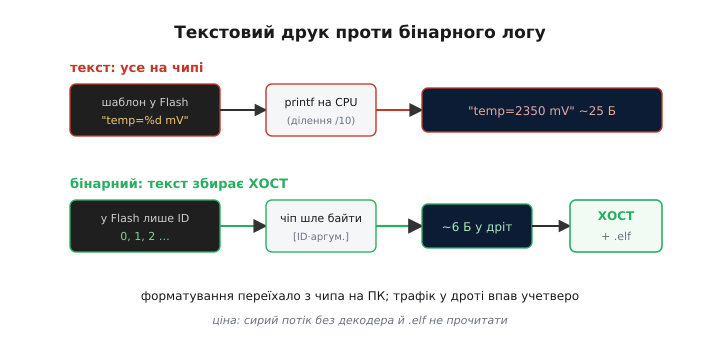
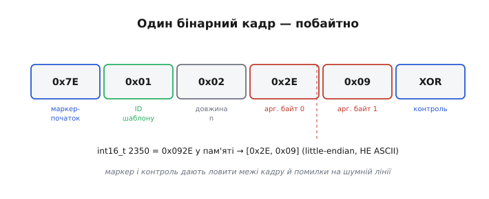

# ⚙️ Бінарне логування: не форматуй на чипі, шли байти (defmt-клас)

Звичайна система логування з рівнями, часом і кільцем — добра основа, але є одна ціна, якої вона не знімає: рядки все одно **збираються на чипі**. Структура логу — це одне, а текст рядка — інше. А що, якщо людський рядок збирати не на мікроконтролері, а на ПК? Тоді чіп шле жменю байтів, а текст «дописується» на хості. Саме на цій ідеї стоять бінарні логери — defmt у Rust і зв'язка `SEGGER_RTT` з `printf`-декодером у C.

## Задача

Вартість однієї звичної стрічки логу — `printf("temp=%d mV, vbat=%d\n", t, v)` або її двійника в конкретному середовищі (`Serial.printf` в Arduino, `ESP_LOGI` в ESP-IDF, `printf` через перенаправлений `_write` у STM32) — на МК не така дрібниця, як здається. Розкладімо її на складові.

Перше — **Flash**. Рядок-шаблон `"temp=%d mV, vbat=%d\n"` — це 20+ байтів, що постійно лежать у Flash пристрою. Один рядок — ще безлад. Але рядків логу в реальному проєкті сотні. Flash мікроконтролера тісний — кілобайти дефіцитного простору, за які звичайно конкурує код; тепер уявіть, що ще сотні рядкових шаблонів «крадуть» ті самі кілобайти. Вони потрібні лише читачеві — але зберігаються в прошивці назавжди.

Друге — **CPU**. `printf` — це важка робота. Перетворити `int` на ASCII — це ділення на 10 у циклі (десяткові цифри вибираються по одній). Для `float` — ще складніше. Це CPU-час у гарячому шляху: там, де мікроконтролер вимірює напругу, керує двигуном або обробляє сигнал, `printf` гальмує саме те, що треба робити швидко.

Третє — **дріт**. На виході після форматування маємо: `"temp=2350 mV, vbat=4012\n"` — близько 25 байтів людського тексту. А UART повільний: при 115 200 бод 25 байтів ідуть майже 2 мілісекунди. Звідси проблема: якщо логуєш у гарячому циклі, дріт стає обмеженням тайминга.

Мета — лишити людський рядок **читачеві**, але прибрати з пристрою і Flash-шаблон, і важке форматування, і товстий потік байтів. Ключ у тому, що шаблон **вже є двічі**: у прошивці (Flash) і в [`.elf`-файлі на ПК](topic:sf-lang/linking), що його лишає лінкер. Навіщо везти те, що ПК і так має?

Якір: один виклик `printf("temp=%d mV, vbat=%d\n", t, v)` — ~20 байтів у Flash + форматування на CPU + ~25 байтів у дріт. Бінарний лог замінює це на: 0 байтів шаблону у Flash + 0 форматування + ~6 байтів у дріт.

## Ідея: ID шаблону + сирі аргументи; текст збирає хост

Головний хід простий і елегантний. **Не слати рядок.** На етапі компіляції кожному рядку-шаблону присвоюємо числовий **ID**. Числа 0, 1, 2, 3 — замість рядків `"boot"`, `"temp=%d mV"`, `"VBAT low %d"` тощо. У Flash замість самого рядка лишається лише невеликий числовий ідентифікатор. А в дріт іде кадр: `[ID шаблону][сирі байти аргументів]`. Текст не збирається на чипі взагалі.


*Текстовий друк проти бінарного. Зверху: рядок-шаблон лежить у Flash, printf форматує його на CPU чипа, у дріт іде ~25 байтів готового тексту. Знизу: у Flash лише ID, чіп шле жменю сирих байтів [маркер·ID·аргументи], а людський рядок збирає хост за допомогою .elf. Форматування переїхало з чипа на ПК, трафік у дроті впав учетверо.*

Інтуїтивна аналогія: це як **телеграфний кодовий словник** — замість диктувати довгий жарт по телефону кажеш «номер дванадцять», а хто має той самий словник, той розгортає назад. Словник тут — `.elf`-файл на ПК: він вже містить таблицю символів і рядки. Нічого нового на ПК везти не треба.

Що саме економиться, якщо порівняти з трьома вадами з розділу «Задача»:

- **Flash**: шаблон не дублюється в прошивку. Він існує лише в `.elf` на ПК, де він і так лежав. Flash пристрою звільняється від сотень рядків.
- **CPU**: `int` і `float` не перетворюються на ASCII на чипі. Сирі 4 байти `int` або 2 байти `int16_t` ідуть прямо в дріт, такими, як є в регістрі процесора.
- **Дріт**: замість ~25 байтів тексту — 6 байтів кадру: маркер + ID + довжина + 2 байти аргументу. Це вчетверо менше трафіку, і дріт більше не є вузьким місцем.

Хто складає текст назад — **хост-декодер**: програма на ПК, яка читає потік байтів з порту, відкриває `.elf`, за ID знаходить шаблон `"temp=%d mV…"`, підставляє сирі байти аргументу у `%d` і виводить людський рядок у термінал. Час форматування переїхав з МК на потужний ПК — там він нічого не вартий.

> 🔧 **Навіщо це.** Час форматування і кілобайти Flash на МК — дефіцитні ресурси. Коли лог став вузьким місцем (тайминг «пливе», Flash не вистачає) — бінарний лог прибирає обидва тиски одним ходом.

З цього випливає важливий наслідок: лог став **майже безкоштовним** на пристрої. Рівні DEBUG можна лишати завжди ввімкненими — кожне повідомлення коштує лише кілька байтів. На відміну від підходу «компілюй геть» (де зайві рівні просто вирізають із прошивки), тут ми **не вимикаємо, а здешевлюємо** сам лог.

Чесна ціна: сирий потік байтів у звичайному моніторі не прочитати — обов'язково потрібен декодер і **саме той** `.elf`, що в прошивці.

## Робочий код (C/C++): мінімальний бінарний логер

Щоб зрозуміти суть без зовнішніх бібліотек, зробимо «defmt для бідних». Справжній defmt (у Rust) автоматизує присвоєння ID лінкером; ми зробимо те саме вручну через `enum`. Суть — ідентична: ID + сирі байти. Від середовища потрібне лише одне: вміти віддати в послідовний порт кілька довільних байтів — тож нижче та сама схема трьома доріжками.

:::tabs
```arduino
// ── Словник подій: ID замість рядків ──────────────────────────────────────
enum LogId : uint8_t {
    LOG_BOOT    = 0,   // "boot"
    LOG_TEMP    = 1,   // "temp=%d mV"
    LOG_VBAT_LOW = 2,  // "VBAT low %d"
};

// ── Кадр: [0x7E маркер][id][n байтів аргументів][XOR контроль] ────────────
void blog(uint8_t id, const void* args, uint8_t n) {
    uint8_t xor_sum = 0x7E ^ id ^ n;
    Serial.write(0x7E);          // маркер-початок (ресинхронізація)
    Serial.write(id);
    Serial.write(n);
    const uint8_t* p = (const uint8_t*)args;
    for (uint8_t i = 0; i < n; i++) {
        Serial.write(p[i]);
        xor_sum ^= p[i];
    }
    Serial.write(xor_sum);       // контрольний байт (XOR усього кадру)
}

// ── Макрос: одна змінна, sizeof автоматично ────────────────────────────────
#define BLOG(id, val)  do { auto _v = (val); blog((id), &_v, sizeof(_v)); } while(0)

// ── Використання ──────────────────────────────────────────────────────────
void setup() {
    Serial.begin(115200);
    blog(LOG_BOOT, nullptr, 0);        // подія без аргументів (n=0)
}

void loop() {
    int16_t temp_mv = (int16_t)analogReadMilliVolts(34);
    BLOG(LOG_TEMP, temp_mv);           // int16_t → 2 байти сирих у кадр
    // якщо напруга критична — сигналізуємо
    int16_t vbat_mv = (int16_t)analogReadMilliVolts(35);
    if (vbat_mv < 3300) {
        BLOG(LOG_VBAT_LOW, vbat_mv);
    }
    delay(100);
}
```
```esp-idf
#include <string.h>
#include "driver/uart.h"
#include "esp_adc/adc_oneshot.h"
#include "freertos/FreeRTOS.h"
#include "freertos/task.h"

// ── Словник подій: ID замість рядків ──────────────────────────────────────
typedef enum {
    LOG_BOOT     = 0,   // "boot"
    LOG_TEMP     = 1,   // "temp=%d mV"
    LOG_VBAT_LOW = 2,   // "VBAT low %d"
} log_id_t;

#define BLOG_UART  UART_NUM_0

// ── Кадр збираємо в буфері й віддаємо драйверу одним записом ──────────────
static void blog(uint8_t id, const void *args, uint8_t n) {
    uint8_t f[4 + 8];                        // маркер+id+n+аргументи+XOR
    uint8_t xor_sum = 0x7E ^ id ^ n;
    f[0] = 0x7E;                             // маркер-початок (ресинхронізація)
    f[1] = id;
    f[2] = n;
    if (n) memcpy(&f[3], args, n);
    for (uint8_t i = 0; i < n; i++) xor_sum ^= f[3 + i];
    f[3 + n] = xor_sum;                      // контрольний байт (XOR усього кадру)
    uart_write_bytes(BLOG_UART, f, 4 + n);
}

// ── Макрос: одна змінна, sizeof автоматично ───────────────────────────────
#define BLOG(id, val)  do { typeof(val) _v = (val); blog((id), &_v, sizeof(_v)); } while (0)

// ── Використання ──────────────────────────────────────────────────────────
void app_main(void) {
    uart_config_t cfg = {
        .baud_rate  = 115200,           .data_bits = UART_DATA_8_BITS,
        .parity     = UART_PARITY_DISABLE, .stop_bits = UART_STOP_BITS_1,
        .flow_ctrl  = UART_HW_FLOWCTRL_DISABLE, .source_clk = UART_SCLK_DEFAULT,
    };
    uart_param_config(BLOG_UART, &cfg);
    uart_driver_install(BLOG_UART, 256, 512, 0, NULL, 0);
    blog(LOG_BOOT, NULL, 0);                 // подія без аргументів (n=0)

    adc_oneshot_unit_handle_t adc;
    adc_oneshot_unit_init_cfg_t unit = { .unit_id = ADC_UNIT_1 };
    adc_oneshot_new_unit(&unit, &adc);
    adc_oneshot_chan_cfg_t ch = { .atten = ADC_ATTEN_DB_12,
                                  .bitwidth = ADC_BITWIDTH_DEFAULT };
    adc_oneshot_config_channel(adc, ADC_CHANNEL_6, &ch);
    adc_oneshot_config_channel(adc, ADC_CHANNEL_7, &ch);

    while (1) {
        int raw = 0;
        adc_oneshot_read(adc, ADC_CHANNEL_6, &raw);
        int16_t temp_mv = (int16_t)(raw * 3300 / 4095);  // грубо, без калібрування
        BLOG(LOG_TEMP, temp_mv);             // int16_t → 2 байти сирих у кадр
        // якщо напруга критична — сигналізуємо
        adc_oneshot_read(adc, ADC_CHANNEL_7, &raw);
        int16_t vbat_mv = (int16_t)(raw * 3300 / 4095);
        if (vbat_mv < 3300) {
            BLOG(LOG_VBAT_LOW, vbat_mv);
        }
        vTaskDelay(pdMS_TO_TICKS(100));
    }
}
```
```stm32
#include "stm32f4xx_hal.h"

extern UART_HandleTypeDef huart2;            // готує CubeMX: MX_USART2_UART_Init()
extern ADC_HandleTypeDef  hadc1;             // MX_ADC1_Init()

// ── Словник подій: ID замість рядків ──────────────────────────────────────
typedef enum {
    LOG_BOOT     = 0,   // "boot"
    LOG_TEMP     = 1,   // "temp=%d mV"
    LOG_VBAT_LOW = 2,   // "VBAT low %d"
} log_id_t;

// ── Кадр: [0x7E маркер][id][n байтів аргументів][XOR контроль] ────────────
static void blog(uint8_t id, const void *args, uint8_t n) {
    uint8_t f[4 + 8];
    uint8_t xor_sum = 0x7E ^ id ^ n;
    f[0] = 0x7E;                             // маркер-початок (ресинхронізація)
    f[1] = id;
    f[2] = n;
    for (uint8_t i = 0; i < n; i++) {
        f[3 + i] = ((const uint8_t *)args)[i];
        xor_sum ^= f[3 + i];
    }
    f[3 + n] = xor_sum;                      // контрольний байт (XOR усього кадру)
    HAL_UART_Transmit(&huart2, f, 4 + n, HAL_MAX_DELAY);
}

// ── Макрос: одна змінна, sizeof автоматично ───────────────────────────────
#define BLOG(id, val)  do { typeof(val) _v = (val); blog((id), &_v, sizeof(_v)); } while (0)

// один вимір АЦП у мілівольтах (опорна напруга 3300 мВ, 12 біт)
static uint16_t adc_mv(void) {
    HAL_ADC_Start(&hadc1);
    HAL_ADC_PollForConversion(&hadc1, 10);
    uint32_t raw = HAL_ADC_GetValue(&hadc1);
    HAL_ADC_Stop(&hadc1);
    return (uint16_t)(raw * 3300u / 4095u);
}

// ── Використання ──────────────────────────────────────────────────────────
int main(void) {
    HAL_Init();
    SystemClock_Config();
    MX_GPIO_Init();
    MX_USART2_UART_Init();
    MX_ADC1_Init();
    blog(LOG_BOOT, NULL, 0);                 // подія без аргументів (n=0)

    while (1) {
        int16_t temp_mv = (int16_t)adc_mv();
        BLOG(LOG_TEMP, temp_mv);             // int16_t → 2 байти сирих у кадр
        // якщо напруга критична — сигналізуємо
        int16_t vbat_mv = (int16_t)adc_mv();
        if (vbat_mv < 3300) {
            BLOG(LOG_VBAT_LOW, vbat_mv);
        }
        HAL_Delay(100);
    }
}
```
:::

Хост-бік — звичайний скрипт на ПК (Python, Node, будь-що), не прошивка:

| ID  | Шаблон        |
|-----|---------------|
| 0   | `"boot"`      |
| 1   | `"temp=%d mV"`|
| 2   | `"VBAT low %d"`|

Декодер читає кадри з COM-порту, за ID знаходить шаблон у таблиці, підставляє сирі байти як `int16_t` — і виводить звичайний текстовий лог. Людський рядок збирається на ПК.

Дві деталі, що визначають надійність. Перша — **порядок байтів**. Число більше за байт лежить у пам'яті в порядку, який задає ядро; усі ядра, з якими маємо справу тут, — little-endian (Cortex-M у STM32, Xtensa та RISC-V в ESP32, AVR), тож `int16_t 2350 = 0x092E` в пам'яті — `[0x2E, 0x09]`. Хост мусить читати в тому самому порядку. Це «домовленість двох кінців»; структури з padding надсилати сирими не варто — надсилай поля по одному фіксованого типу.

Друга — **маркер + довжина + XOR**. UART не ідеальний: шум, старт без синхронізації. Маркер `0x7E` дає декодеру знайти початок кадру після збою; XOR-контроль ловить одиночні помилки і сигналізує: «скинь стан, чекай наступного 0x7E». Це та сама ідея контрольних сум, що захищає будь-який запис чи передачу даних від тихого псування.


*Один кадр бінарного логу побайтно: маркер-початок 0x7E · ID шаблону · довжина · сирі байти аргументу (int16_t 2350 = 0x2E 0x09, little-endian — НЕ ASCII!) · контрольний XOR. Маркер і контрольний байт дають декодеру ловити межі кадру й помилки на шумній лінії.*

## Складність і пастки на МК

- **Сирий потік нечитабельний без декодера.** У звичайному моніторі — каша з байтів; треба тримати декодер і **саме той** `.elf`, що в прошивці. Перепрошив, забув оновити `.elf` на ПК — текст «попливе»: ID показуватимуть не ті рядки. Це головна ціна методу, і її треба враховувати в робочому процесі.

- **Версія прошивки = версія словника.** ID живуть, поки збігаються бінарник і його `.elf`. Зібрав заново — ID могли зсунутися (якщо `enum` змінився або компілятор переупорядкував). Звідси правило: декодуй лог тим `.elf`, яким зібрано цю прошивку — та сама вимога, що й при відновленні адрес через `addr2line`, де «той самий `.elf`» є умовою достовірності трасування.

- **Порядок байтів і вирівнювання.** Надсилаємо сирі байти змінної — хост мусить знати тип і порядок байтів того ядра, що шле (тут — little-endian). Структуру з padding надсилати сирою небезпечно: padding залежить від компілятора й налаштувань. Надсилай поля по одному фіксованого розміру (`int16_t`, `int32_t`), не цілий `struct`.

- **Межі кадрів на шумній лінії.** Загубив байт — і декодер «з'їде». Тому кадр має маркер-початок + довжину + контрольний байт (XOR/CRC), щоб ловити збій і ресинхронізуватись. Та сама ідея контрольних сум, що захищає й запис образу від тихого псування.

- **Віддача байтів у порт усе ще блокує.** Хай як зветься виклик — `Serial.write`, `uart_write_bytes`, `HAL_UART_Transmit` — він чекає, поки байти підуть у лінію. Бінарний лог швидший (менше байтів, без форматування), але дріт лишається повільним. У переривання та гарячому циклі діє те саме правило, що й для звичайного логу: постав прапорець, надсилай у головному циклі. Стало дешевше — але не безкоштовно.

- **Коли не варто.** Для прототипу чи разового пошуку помилки звичайний текстовий друк простіший і не вимагає декодера. Бінарний логер виправдовує складність, коли логів багато, Flash/CPU/тайминг дефіцитні або потрібен швидкий потік телеметрії. Практична порада: звичайна система логування з рівнями й кільцем — за замовчуванням; цей підхід — коли звичайний друк вже став вузьким місцем.
