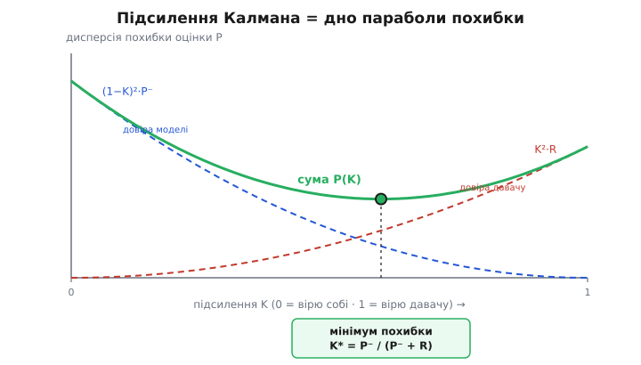

# 🧮 Виведення підсилення Калмана

> У [темі](root:embedded/kalman-filter) ми прийняли підсилення `K = P⁻/(P⁻+R)` як готову формулу — повзунок довіри, що його фільтр пересуває сам. Тут покажемо, **звідки** береться саме ця дробина, а не якась інша зважена сума. Виведемо її двічі, з двох незалежних боків, і обидва дадуть рівно той самий результат: спершу як вагу, що **мінімізує похибку оцінки**, тоді як **добуток двох дзвонів**. Те, що два різні підходи сходяться в одній точці, і є зерно слова «оптимальний». Апарат потрібен скромний: означення дисперсії, одна похідна, прирівняна до нуля, та трохи алгебри з дробами. Скрізь працюємо скалярно — одна величина; матричну форму лише накреслимо в кінці, бо вона читається рядок у рядок так само.

## Що ми взагалі хочемо оптимізувати

Перш ніж щось мінімізувати, треба чесно назвати, що саме. У нас на руках два числа про одну невідому величину — назвімо її істинним значенням `x` (правдивий кут, який ми ніколи не знаємо точно). Перше число — **передбачення** `x̂⁻`: те, що дала модель руху на кроці «передбач». Над ним мінусик угорі (англ. *prior* — «попереднє», до врахування виміру) — це наша оцінка **до** того, як ми глянули на свіжий давач. Друге число — **вимір** `z`: те, що показав давач цього такту.

Жодне з них не є істиною. Обидва промахуються, і важливо домовитися, **як саме**. Запишемо це чесно, через похибку кожного:

```
x̂⁻ = x + e⁻       e⁻ — похибка передбачення
z  = x + v        v  — похибка виміру (шум давача)
```

Тут `e⁻` і `v` — випадкові: ми не знаємо їхнього знаку чи величини на конкретному такті, знаємо лише, **наскільки широко вони гуляють**. Цю ширину гуляння й несуть два числа, що ми ввели в темі. Дисперсія (англ. *variance* — розкид) передбачення — це `P⁻`: середній квадрат його похибки. Дисперсія виміру — це `R`: середній квадрат шуму давача. Формально:

```
P⁻ = E[ e⁻² ]      середній квадрат похибки передбачення
R  = E[ v²  ]      середній квадрат шуму давача
```

Запис `E[…]` — це **сподівання** (англ. *expectation* — очікуване середнє): уявне усереднення по нескінченній юрбі тактів. На одному такті похибка може бути будь-яка; `E[e⁻²]` каже, скільки вона в **середньому по квадрату**. Чому саме квадрат, а не сам модуль похибки? Бо квадрат карає великі промахи різкіше за дрібні (промах удвічі більший важить уже вчетверо), він гладкий — його зручно диференціювати, — і саме він дає дисперсію, ширину того самого дзвону. Корінь із дисперсії — це знайоме нам **середньоквадратичне відхилення** σ (англ. *standard deviation*), напівширина дзвону: `P⁻ = (σ⁻)²`, `R = (σ_z)²`.

Зробимо ще два припущення, без яких далі нічого не вийде, — і назвемо їх уголос, бо саме на них усе тримається. Перше: похибки **незміщені**, тобто в середньому нульові, `E[e⁻] = 0` і `E[v] = 0`. Це означає, що ні модель, ні давач не брешуть **систематично** в один бік — вони просто шумлять навколо правди. (Якби давач мав сталий зсув, його місце не тут, а в калібруванні; Калман гасить шум, а не систематичну брехню.) Друге: похибки передбачення й виміру **незалежні** одна від одної, `E[e⁻·v] = 0`. І це фізично чесно — модель руху й давач помиляються з **різних** причин: модель не знає поштовхів вітру, давач шумить через свою електроніку, і ці дві біди ніяк не змовлені між собою. Це припущення зніме за мить цілий доданок, тож тримаймо його на видноті.

> 🔧 **Навіщо це.** Уся «оптимальність» Калмана живе саме на цих двох рядках припущень — незміщеність і незалежність. На практиці перше ламає неоткалібрований давач (систематичний зсув), друге — спільне джерело завад (наведення живлення, що б'є водночас і в гіроскоп, і в акселерометр). Якщо фільтр поводиться дивно, а формули правильні, перевіряти треба саме ці припущення про шум, а не код. Тому й варто знати, де вони сховані.

## Крок перший: ставимо задачу як зважене середнє

Тепер головний хід. Нову, кращу оцінку `x̂` шукатимемо **не з повітря**, а у вигляді зваженого поєднання двох наявних чисел — передбачення й виміру. Найзагальніше лінійне поєднання двох чисел, що не з'їжджає вбік (зберігає незміщеність), — це таке, де ваги дають у сумі одиницю:

```
x̂ = (1 − K)·x̂⁻ + K·z
```

Тут `K` — одне число від 0 до 1, частка, яку ми віддаємо виміру; решту `(1−K)` лишаємо передбаченню. Чому ваги мусять складатися в одиницю? Бо інакше оцінка з'їде. Перевірмо швидко: якщо в середньому і `x̂⁻`, і `z` дорівнюють істині `x` (вони ж незміщені), то й їхнє зважене середнє має дорівнювати `x`, інакше ми внесли б власний зсув. Підставмо середні:

```
E[x̂] = (1 − K)·x + K·x = x        ✓ за будь-якого K
```

Виходить рівно `x` — за **будь-якого** `K`, саме тому що ваги в сумі одиниця. Отже ця форма гарантує незміщеність задарма, хай яким буде `K`. Лишається крутити одну ручку `K` — і питання звужується до єдиного: **за якого `K` оцінка найточніша?**

Перепишемо цю ж формулу так, як вона стоїть у самій темі, — щоб видно було, що це той самий вираз, лише згрупований навколо передбачення. Розкриємо дужку й зберемо:

```
x̂ = x̂⁻ − K·x̂⁻ + K·z = x̂⁻ + K·(z − x̂⁻)
                                  └── нев'язка ──┘
```

Це і є знайома форма «передбач і виправ»: береш передбачення й підтягуєш його на частку `K` тієї відстані, на яку вимір розійшовся з ним. Різниця `z − x̂⁻` — **нев'язка** (англ. *innovation* — «новина», те нове, що приніс вимір). Дві форми — `(1−K)·x̂⁻ + K·z` і `x̂⁻ + K·(z − x̂⁻)` — тотожні, просто перша зручніша для виведення дисперсії, а друга для коду.

## Крок другий: похибка оцінки і її дисперсія

Тепер — серце виведення. Подивімося, яку **похибку** має наша зважена оцінка, і як ця похибка залежить від `K`. Похибка оцінки — це `e = x̂ − x`, наскільки `x̂` промахнувся повз істину. Беремо форму `x̂ = (1−K)·x̂⁻ + K·z`, віднімаємо `x` і згадуємо, що `x̂⁻ = x + e⁻`, а `z = x + v`:

```
e = x̂ − x = (1 − K)·x̂⁻ + K·z − x
          = (1 − K)·(x + e⁻) + K·(x + v) − x
```

Розкриваємо й дивимося, що буде з самим `x`. Збираємо доданки з `x` окремо:

```
e = (1 − K)·x + K·x − x  +  (1 − K)·e⁻ + K·v
  =        x − x         +  (1 − K)·e⁻ + K·v
  = (1 − K)·e⁻ + K·v
```

Ось і перша нагорода за вимогу «ваги в сумі одиниця»: усі члени з невідомою істиною `x` скоротилися дочиста, лишилися **самі похибки**. Похибка нової оцінки — це просто те саме зважене середнє з похибок передбачення й виміру:

```
e = (1 − K)·e⁻ + K·v
```

Гарно, але `e` — випадкова: на кожному такті своя. Що ми справді можемо мінімізувати — це її **середній квадрат**, тобто дисперсію оцінки `P = E[e²]`. Підносимо `e` до квадрата:

```
e² = [ (1 − K)·e⁻ + K·v ]²
   = (1 − K)²·e⁻²  +  2·(1 − K)·K·e⁻·v  +  K²·v²
```

Тепер беремо сподівання `E[…]` від кожного доданку — і тут спрацьовує друге припущення. Середній квадрат `E[e⁻²]` — це `P⁻`, середній квадрат `E[v²]` — це `R`. А середній **добуток** `E[e⁻·v]` дорівнює нулю, бо ми домовилися, що похибки незалежні: модель і давач помиляються з різних причин. Цілий середній доданок випаровується:

```
P = E[e²] = (1 − K)²·P⁻  +  2·(1 − K)·K·E[e⁻·v]  +  K²·R
                                  └────── = 0 ──────┘
P = (1 − K)²·P⁻ + K²·R
```

Ось вона — **дисперсія оцінки як функція ваги** `K`. Це центральна формула виведення, тож прочитаймо, що вона каже, ще до жодної похідної. Перший доданок `(1−K)²·P⁻` — внесок похибки передбачення: що більше ваги лишаємо передбаченню (менше `K`), то сильніше його шум `P⁻` тягне нашу оцінку. Другий `K²·R` — внесок шуму давача: що більше ваги віддаємо виміру (більше `K`), то сильніше його шум `R` лізе в оцінку. Два доданки **тягнуть у різні боки**: збільшуєш `K` — гасиш перший, але роздуваєш другий; зменшуєш — навпаки. Десь між крайнощами `K=0` і `K=1` мусить лежати золота середина, де сума найменша. Її ми зараз і знайдемо.

## Крок третій: мінімізуємо — і дробина народжується сама

`P(K)` — це парабола по `K` (квадратний многочлен з додатним старшим коефіцієнтом `P⁻ + R`), вітками вгору. У такої парної кривої є рівно один найнижчий пагорб — там, де дотична горизонтальна, тобто похідна `dP/dK` дорівнює нулю. Це звичайний шкільний прийом пошуку мінімуму: знайди, де нахил кривої обертається на нуль. Продиференціюємо `P` по `K`. Перший доданок `(1−K)²·P⁻`: похідна `(1−K)²` дає `2·(1−K)·(−1)`. Другий `K²·R` дає `2·K·R`:

```
dP/dK = 2·(1 − K)·P⁻·(−1) + 2·K·R
      = −2·(1 − K)·P⁻ + 2·K·R
```

Прирівнюємо до нуля й ділимо обидві частини на 2:

```
−(1 − K)·P⁻ + K·R = 0
```

Розкриваємо й збираємо `K` по один бік:

```
−P⁻ + K·P⁻ + K·R = 0
K·(P⁻ + R) = P⁻
```

Звідки, поділивши на `(P⁻ + R)`:

```
        P⁻
K = ─────────
     P⁻ + R
```

Ось воно. Та сама дробина, що ми взяли на віру в темі, **виведена** — як єдина вага, за якої дисперсія оцінки найменша. Жодного вгадування: ми поставили чесне питання «за якого `K` похибка найменша?» — і алгебра відповіла однозначно. Прочитаймо її ще раз, тепер уже знаючи, що вона оптимальна. Якщо передбачення певне (`P⁻` мале проти `R`), чисельник малий → `K → 0` → майже не рухаємось, віримо собі. Якщо вимір точний (`R` мале проти `P⁻`), знаменник майже дорівнює чисельнику → `K → 1` → стрибаємо до давача. Повзунок стоїть саме там, де велить математика похибки, — і ні на волосину інакше.

Швидко переконаймося, що це справді **мінімум**, а не максимум. Друга похідна `d²P/dK² = 2·P⁻ + 2·R` додатна завжди (дисперсії невід'ємні), отже крива опукла вгору, і єдина критична точка — таки найнижча. Сумніву немає.


*Дисперсія оцінки P(K) — парабола вітками вгору. Один доданок (синій) карає за надмірну довіру моделі, другий (червоний) — за надмірну довіру давачу; їхня сума (зелена) має єдиний мінімум. Оптимальне підсилення Калмана — це абсциса цього дна, і саме там похибка оцінки найменша з можливих.*

## Куди сідає дисперсія: формула оновлення P

Знайшовши оптимальне `K`, варто спитати: а **наскільки** ж стала точніша оцінка? Тобто яке `P` у самій точці мінімуму? Можна підставити знайдене `K` назад у `P = (1−K)²·P⁻ + K²·R` і довго спрощувати, але є коротший і красивіший шлях, що дає заразом і формулу з самої теми.

Повернімося до рівняння мінімуму, ще до того як ми поділили на `(P⁻+R)`:

```
K·(P⁻ + R) = P⁻
```

Розкриємо ліву частину: `K·P⁻ + K·R = P⁻`. Перенесемо `K·P⁻` праворуч:

```
K·R = P⁻ − K·P⁻ = (1 − K)·P⁻
```

Притримаймо цю рівність — `K·R = (1−K)·P⁻` — вона зараз спрацює як ключ. Тепер беремо дисперсію оцінки й трохи переставляємо доданки:

```
P = (1 − K)²·P⁻ + K²·R
  = (1 − K)·(1 − K)·P⁻ + K·(K·R)
```

У першому доданку лишаємо один множник `(1−K)` назовні, а в другому підставляємо щойно здобуте `K·R = (1−K)·P⁻`:

```
P = (1 − K)·[ (1 − K)·P⁻ ] + K·[ (1 − K)·P⁻ ]
  = (1 − K)·P⁻ · [ (1 − K) + K ]
  = (1 − K)·P⁻ · 1
```

Дужка `(1−K) + K` згортається в одиницю, і лишається диво простоти:

```
P = (1 − K)·P⁻
```

Та сама формула звуження дзвону, що в темі. Ось чому оновлення непевності виглядає так оманливо легко — `(1−K)·P⁻`, без жодних квадратів: квадрати з обох доданків самі скоротилися, **бо ми стоїмо рівно в точці оптимуму**. Це не випадковість запису, а підпис оптимальності: спрощення `P = (1−K)·P⁻` справедливе лише для **оптимального** `K`; за будь-якого іншого довелося б тягнути повну `(1−K)²·P⁻ + K²·R`. Велике `K` (повірили виміру) сильно стискає `P`; мале — майже не чіпає. А оскільки `0 < K < 1`, маємо `(1−K) < 1`, тобто `P < P⁻` **завжди**: прийнявши вимір, фільтр стає певнішим **без винятку**, хай яким був вимір. Нове знання не може зробити нас дурнішими.

## Той самий результат з іншого боку: добуток двох дзвонів

Ми вивели `K`, ні разу не згадавши слова «Гаусс» — самою лише мінімізацією середнього квадрата похибки. Тепер прийдемо до тієї **самісінької** дробини зовсім іншою дорогою — через перемноження двох дзвонів. Те, що дві незалежні дороги ведуть в одну точку, — не збіг, і за мить стане ясно чому.

У темі ми сказали: над істинною величиною в нас два дзвони — широкий дзвін передбачення (центр `x̂⁻`, дисперсія `P⁻`) і вужчий дзвін виміру (центр `z`, дисперсія `R`), — і крок «виправ» їх **перемножує**. Подивімося на це перемноження впритул. Дзвін (нормальний розподіл) із центром μ і дисперсією σ² має вигляд `exp(−(x−μ)²/(2σ²))` — гостроверха гірка, що спадає тим швидше, чим менша σ².

> Дзвін, він же нормальний розподіл — крива, що описує, наскільки правдоподібне кожне значення невідомої величини: вершина в найімовірнішому, спад обабіч, ширина = непевність. Її форма `exp(−(x−μ)²/(2σ²))` нам тут і потрібна. Звідки вона береться й чому шум так часто лягає саме в неї — у [нормальному розподілі](topic:math/normal-distribution).

Перемножуємо два таких дзвони. Добуток показників `exp` — це `exp` від суми показників, тож у показнику додаються два квадрати:

```
exp( −(x − x̂⁻)²/(2P⁻) ) · exp( −(x − z)²/(2R) )
   = exp( −(x − x̂⁻)²/(2P⁻) − (x − z)²/(2R) )
```

Уся дія — в показнику. Покажемо, що сума двох квадратів — це знову **один** квадрат (плюс щось, що від `x` не залежить), тобто добуток двох дзвонів — теж дзвін. Винесемо `−1/2` і зведімо до спільного знаменника `P⁻·R`. Працюємо лише з тим, що в дужці:

```
(x − x̂⁻)²/P⁻ + (x − z)²/R
   = [ R·(x − x̂⁻)² + P⁻·(x − z)² ] / (P⁻·R)
```

Розкриємо квадрати в чисельнику й зберемо за степенями `x`. Коефіцієнт при `x²` вийде `(R + P⁻)`, при `x` — `−2·(R·x̂⁻ + P⁻·z)`:

```
чисельник = (P⁻ + R)·x²  −  2·(R·x̂⁻ + P⁻·z)·x  +  (сталі без x)
```

Тепер винесемо `(P⁻+R)` за дужку, щоб коефіцієнт при `x²` став одиницею, — і побачимо центр нового дзвону. Многочлен `x² − 2·b·x + …` — це `(x − b)² + …`, тобто його вершина в `x = b`. У нас `b` — це коефіцієнт при `x`, поділений на коефіцієнт при `x²` (і на знак мінус, який уже винесений):

```
                R·x̂⁻ + P⁻·z
центр  μ_нов = ───────────────
                  P⁻ + R
```

А коефіцієнт `(P⁻+R)/(P⁻·R)` перед усім квадратом — це `1/σ²_нов`, бо стандартний дзвін має в показнику `1/(2σ²)`. Отже нова дисперсія:

```
   1        1     1                  P⁻ · R
─────── = ──── + ────     ⟹    σ²_нов = ───────
 σ²_нов    P⁻     R                     P⁻ + R
```

Дві формули — центр і ширину — і отримали. Тепер найголовніше: покажемо, що центр `μ_нов` — це **рівно** наша зважена оцінка з тим самим `K`. Перепишемо центр, поділивши чисельник і знаменник так, щоб виловити `K = P⁻/(P⁻+R)`:

```
        R·x̂⁻ + P⁻·z       R          P⁻
μ_нов = ───────────── = ─────── ·x̂⁻ + ─────── ·z
          P⁻ + R         P⁻+R         P⁻+R
```

Множник при `z` — це точнісінько `P⁻/(P⁻+R) = K`. А множник при `x̂⁻` — це `R/(P⁻+R)`, і легко бачити, що він дорівнює `(1−K)`, бо `K + R/(P⁻+R) = (P⁻+R)/(P⁻+R) = 1`. Отже:

```
μ_нов = (1 − K)·x̂⁻ + K·z          з тим самим K = P⁻/(P⁻+R)
```

Та сама зважена оцінка. І та сама дисперсія: `σ²_нов = P⁻·R/(P⁻+R)`, а це — простою алгеброю — є рівно `(1−K)·P⁻` (підставте `1−K = R/(P⁻+R)` і скоротіть). Дві геть різні дороги — «мінімізуй середній квадрат похибки» і «перемнож два дзвони» — привели в **ту саму** точку, до останнього символу.

## Чому дисперсії складаються як паралельні опори

Найкрасивіший рядок щойно проскочив повз: ширина нового дзвону рахується не через самі дисперсії, а через їхні **обернені**:

```
 1        1     1
─────── = ──── + ────
 σ²_нов    P⁻     R
```

Зупинімося тут, бо це не просто алгебра — це підказка, як узагалі думати про точність. Обернену дисперсію `1/σ²` називають **точністю** (англ. *precision*): чим вона більша, тим вужчий дзвін, тобто тим більше ти знаєш. І формула каже зворушливо просту річ: **точності додаються**. Знання передбачення (точність `1/P⁻`) плюс знання виміру (точність `1/R`) дають сумарне знання (точність `1/σ²_нов`). Два джерела інформації **складають** свою інформацію — і тому разом ти знаєш строго більше, ніж від кожного окремо.

Хто бавився з електронікою, упізнає форму миттєво. Це ж закон **паралельних опорів**: коли два резистори стоять паралельно, складаються їхні провідності (обернені опори), а спільний опір виходить **меншим за найменший** з двох:

```
 1       1      1
──── = ───── + ─────       (паралельні опори R₁, R₂)
 R∥     R₁      R₂
```

Аналогія точна до кісток, і ось у чому її суть. Опір — це «спротив струму»; провідність `1/R` — «легкість, з якою тече струм», і легкості складаються, бо два шляхи разом пропускають більше, ніж кожен сам. Дисперсія — це «спротив знанню» (велика σ² = туманно, нічого не видно); точність `1/σ²` — «ясність», і ясності складаються, бо два погляди разом бачать чіткіше, ніж кожен сам. У кожній парі складається **легкість/ясність**, а підсумкова величина (опір / дисперсія) виходить **меншою за найменшу складову**.

> 🔧 **Навіщо це.** Цей погляд через точність — не прикраса, а робочий інструмент. По-перше, він підказує, що поєднувати можна **скільки завгодно** джерел поспіль: додав точність третього давача, четвертого — і дзвін лише вужчає. Саме так фільтр, обробляючи такт за тактом, **накопичує** знання: кожен новий вимір докидає свою порцію точності. По-друге, він одразу каже, **скільки виграєш**: два однакові давачі (`R₁ = R₂`) дають удвічі більшу точність, тобто дисперсію вдвічі меншу, а σ — лише в √2 разів вужчу. Хочеш удвічі точніший дзвін за σ — треба **вчетверо** більше однакових вимірів. Ця «квадратична» ціна точності — чому інколи дешевше поставити один добрий давач, ніж купу посередніх.

Де ж аналогія з опорами **ламається** — а вона ламається, і про це чесно. Опори паралеляться однаково, хай де стоять. Дзвони ж складають точність **лише** коли їхні похибки незалежні — те друге припущення, що ми тримали на видноті. Якщо передбачення й вимір помиляються з **однієї** причини (спільне наведення, скажімо), частина їхньої «ясності» — та сама, спільна, і просто додавати `1/P⁻ + 1/R` означало б порахувати це спільне знання двічі, оманливо звузивши дзвін. Резистори такого не вміють — у них немає «спільної причини». Тому формула паралельних опорів справджується для дзвонів **рівно настільки**, наскільки чесне припущення незалежності; зламай його — і красива аналогія попливе.

## Чому це й є «оптимальний» фільтр — і що саме означає слово

Тепер ми готові сказати точно, що ховається за словом «оптимальний», яке в темі прозвучало майже як гасло. Виведення дало дві речі, і їх варто розділити, бо вони про різне.

Перше: серед усіх **лінійних** поєднань передбачення й виміру (`x̂ = a·x̂⁻ + b·z`) ми знайшли те єдине, що дає найменшу дисперсію похибки. Зверни увагу — для цього **не знадобився Гаусс**. Ми ніде в першому виведенні не припускали форми розподілу; вистачило знати дисперсії `P⁻`, `R` та незалежність і незміщеність похибок. Тому навіть якщо шум **не** гауссів (але незміщений і некорельований), знайдене `K` лишається **найкращою лінійною оцінкою** — англ. *best linear unbiased estimator*, BLUE: жодне інше зважування двох чисел не дасть меншої похибки. Це підтверджена річ, і вона важлива: вона каже, що Калман не розвалюється від негауссового шуму — він просто перестає бути **найкращим серед усіх** і лишається найкращим **серед лінійних**.

Друге — і ось де заходить Гаусс. Якщо похибки **таки** гауссові, то добуток дзвонів дав нам не просто гарну лінійну оцінку, а **повний** розподіл невідомої величини після виміру: новий дзвін `μ_нов ± σ_нов` — це і є вся правда про `x`, яку взагалі можна витягти з двох даних. Його вершина `μ_нов` — найімовірніше значення (а для симетричного дзвону це заразом і середнє, тобто оцінка з найменшою середньою квадратичною похибкою). Тут уже немає застереження «серед лінійних»: за гауссового шуму **жодна** оцінка, навіть найхитріша нелінійна, не поб'є цю за середнім квадратом похибки. Калман стає оптимальним **серед усіх можливих** фільтрів, а не лише лінійних.

Складімо обидва шари в одне чітке твердження, статус — усталений (це класичний результат теорії оцінювання):

```
шум некорельований, незміщений          → K оптимальне СЕРЕД ЛІНІЙНИХ (BLUE)
шум до того ж гауссів                    → K оптимальне СЕРЕД УСІХ (мінімум сер. кв. похибки)
```

Ось чому в темі ми обставили слово «оптимальний» умовами «лінійна модель і гауссів шум»: за них працює сильніше, друге твердження. Прибери Гаусс — лишиться слабше, але теж непогане: найкращий з лінійних. А прибери ще й лінійність моделі — і жодна з цих гарантій уже не діє, доводиться лінеаризувати (це вже [розширений фільтр Калмана](topic:algorithms/kalman-ekf)), і оптимальність губиться зовсім. Тепер видно, чому два виведення сходяться: вони доводять **дві грані однієї оптимальності** — лінійну (без Гаусса) і повну (з Гауссом), — і обидві грані вказують на ту саму дробину `K`.

## Де в темі це працює: рядок коду — це і є мінімум

Повернімося від алгебри до тих кількох рядків C, що крутяться на мікроконтролері. Тепер у них видно більше, ніж раніше. Згадаймо крок «виправ» зі скалярного фільтра:

```c
float K = P / (P + R);       /* підсилення з поточних непевностей */
x = x + K * (z - x);         /* x̂ = x̂⁻ + K·(z − x̂⁻) */
P = (1.0f - K) * P;          /* P = (1−K)·P⁻ */
```

Кожен рядок — пряма цитата з нашого виведення. Перший — оптимальна вага `K = P⁻/(P⁻+R)`, та, що мінімізує дисперсію. Другий — зважена оцінка у формі «передбач і виправ». Третій — те красиве згортання `(1−K)·P⁻`, яке справедливе **тільки тому**, що `K` оптимальне. Тобто мікроконтролер на кожному такті не «застосовує формулу» — він щоразу **наново розв'язує задачу мінімізації похибки**, просто розв'язок уже згорнутий у три множення. У цьому й сила: повна оптимізація коштує три арифметичні дії.

І тепер ясно, чому фільтр сам пересуває повзунок довіри без жодного ручного `α`, як ми тішилися в темі. `K` — не налаштування, а **щотактний розв'язок** рівняння `dP/dK = 0` з поточними `P⁻` та `R`. Росте непевність передбачення `P⁻` (давно не було вимірів, модель розпливлась) — оптимум зсувається до більшого `K`, фільтр сам починає більше вірити давачу. Стане давач брудніший (більше `R`) — оптимум повзе до меншого `K`. Повзунок рухається не тому, що хтось його штовхає, а тому, що **щотакту наново знаходиться дно параболи похибки**, а дно дихає разом з `P⁻`.

## Натяк на матричну форму

Поки величина одна, усе вище — звичайні числа. Коли ж величин кілька й вони пов'язані (кут **і** швидкість, та ще й зсув нуля гіроскопа), оцінка стає **вектором** стану, а непевність — **матрицею коваріації** `P`: на діагоналі дисперсії кожної величини, поза нею — як вони корелюють.

> Матриця коваріації — це дзвін у багатьох вимірах: діагональ тримає непевність кожної величини окремо, а позадіагональні члени кажуть, **наскільки величини пов'язані** (промахнувся в куті — що це каже про швидкість). Геометрично це вже не відрізок-ширина, а нахилений еліпс непевності. Деталі — у [матриці коваріації](topic:math/covariance-matrix-intuition).

Виведення повторюється **рядок у рядок**, лише числа стають матрицями, а ділення — оберненням матриці. Там, де у нас стояло `K = P⁻/(P⁻+R)`, з'являється

```
K = P⁻·Hᵀ·(H·P⁻·Hᵀ + R)⁻¹
```

Розшифруймо нашвидку, щоб видно було той самий кістяк. Матриця `H` (англ. *measurement matrix*) — це міст від стану до виміру: вона каже, **яку комбінацію** величин стану взагалі бачить давач (гіроскоп міряє швидкість, а не кут; далекомір — відстань, а не координати). Транспонована `Hᵀ` повертає з простору вимірів назад у простір стану. Тоді `H·P⁻·Hᵀ` — це непевність передбачення, **перерахована в одиниці виміру** (наш колишній `P⁻` у знаменнику), `(… + R)` — додаємо до неї шум давача (той самий `P⁻ + R`), а `(…)⁻¹` — обернення матриці замість ділення. Перший множник `P⁻·Hᵀ` грає роль чисельника `P⁻`. Прибери всі вектори-матриці, лиши скаляри й постав `H = 1` (давач міряє саму величину) — і матрична формула **точно** зсідається в нашу скалярну `K = P⁻/(P⁻+R)`. Той самий повзунок довіри, той самий мінімум похибки, лише записаний для багатьох пов'язаних величин заразом. Повну матричну механіку як самодостатній атом розібрано у [фільтрі Калмана](topic:algorithms/kalman-filter); нам же головне, що **серце** скрізь те саме — вага, яка робить очікувану похибку найменшою.

## Що лишається з виведення

Підсилення Калмана — не вгадана зважена сума, а **розв'язок задачі на мінімум**. Ми записали нову оцінку як зважене середнє передбачення й виміру з вагами, що в сумі дають одиницю (звідси незміщеність задарма), виразили дисперсію похибки `P = (1−K)²·P⁻ + K²·R` (середній доданок зник через незалежність шумів), і прирівняли похідну до нуля — парабола похибки має єдине дно при `K = P⁻/(P⁻+R)`. У тій самій точці формула звуження дзвону згортається до простого `P = (1−K)·P⁻`, і це згортання — підпис оптимальності, а не випадок запису. Той самий результат прийшов і з перемноження двох дзвонів: добуток Гауссів — Гаусс, де **точності складаються** (`1/σ²_нов = 1/P⁻ + 1/R`), достоту як провідності паралельних опорів, тож разом ми знаємо точніше за кожне джерело — рівно настільки, наскільки чесне припущення незалежності. Те, що дві незалежні дороги ведуть до тієї самої дробини, і робить фільтр оптимальним: за некорельованого шуму — найкращим серед лінійних оцінок (BLUE), а коли шум до того ж гауссів — найкращим серед геть усіх. Скалярний код — це й є цей мінімум, згорнутий у три множення; матрична форма `K = P⁻Hᵀ(HP⁻Hᵀ+R)⁻¹` повторює виведення слово в слово, лише ділення стає оберненням матриці. Усе, що фільтр робить на кожному такті, — наново знаходить дно параболи похибки; а воно дихає разом з непевністю передбачення, тому й повзунок довіри рухається сам.
